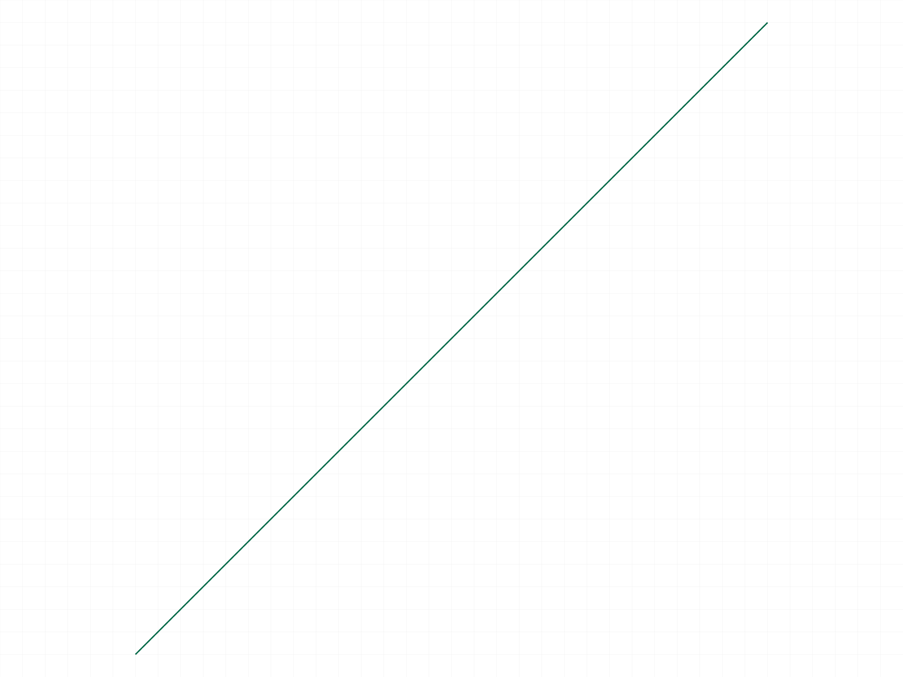
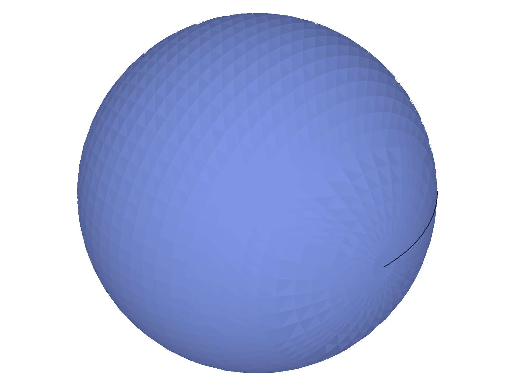
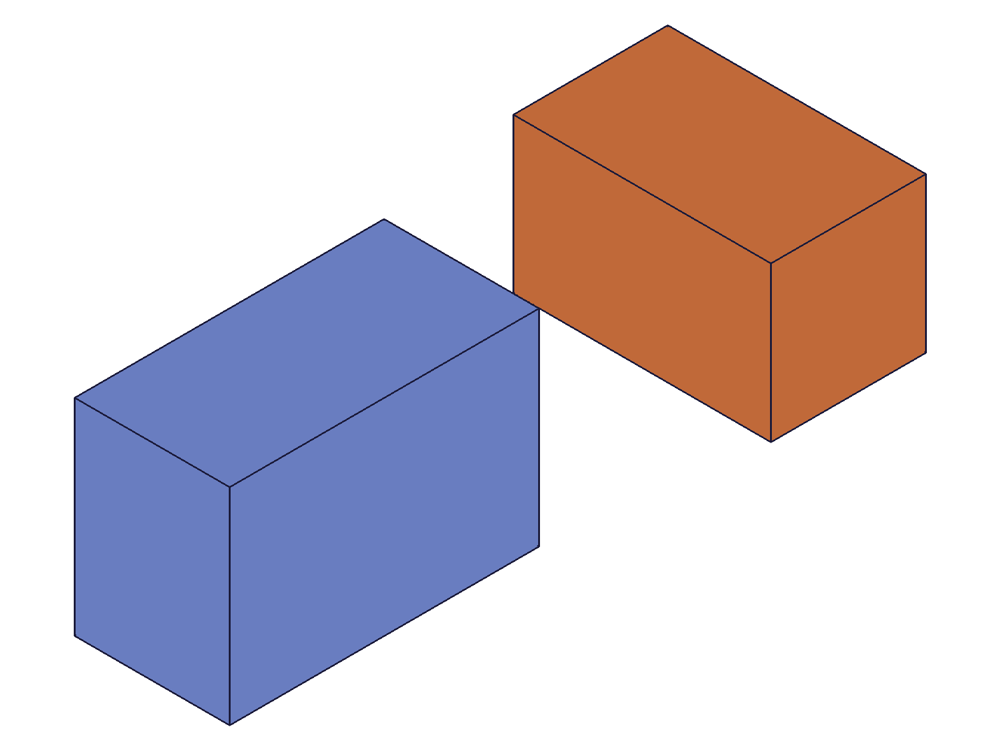
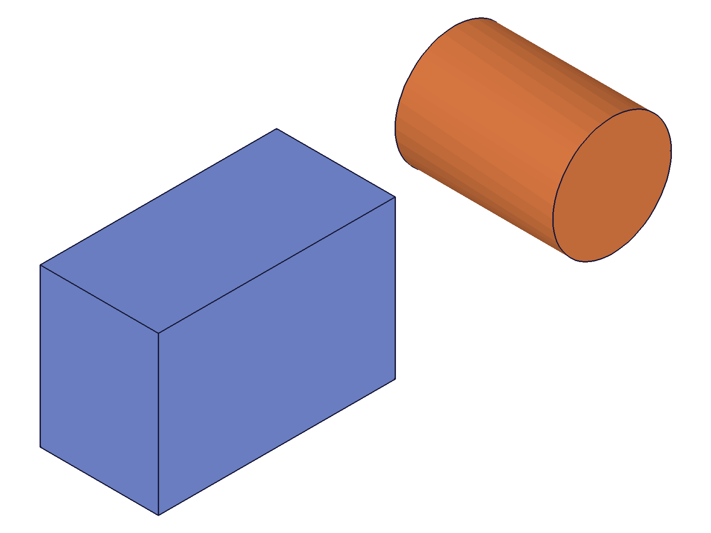
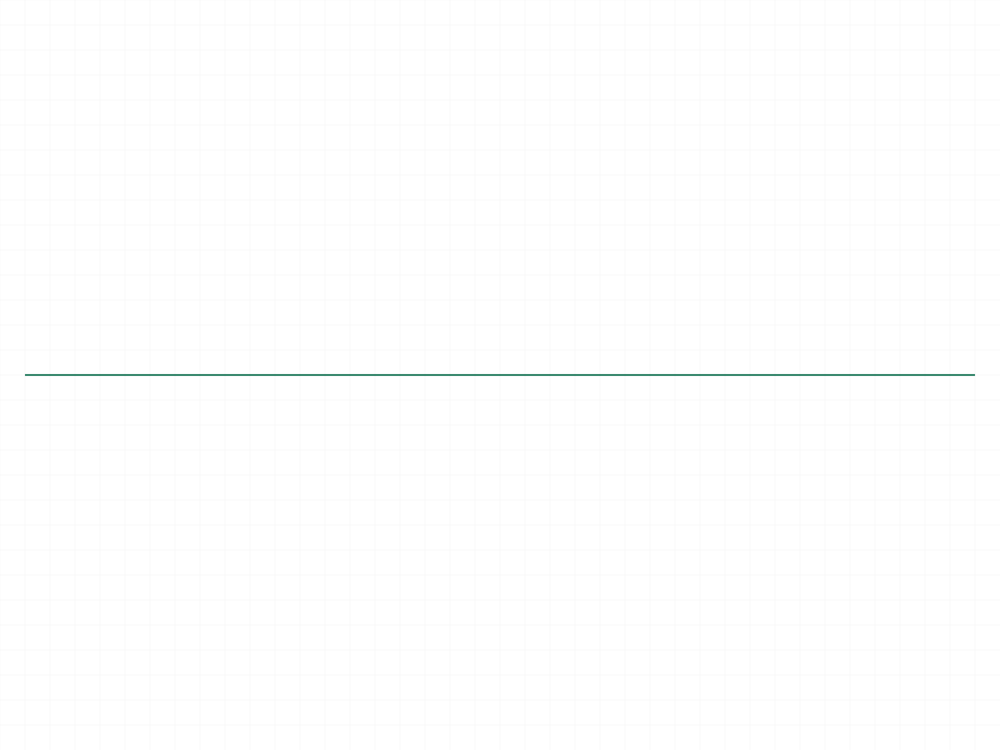
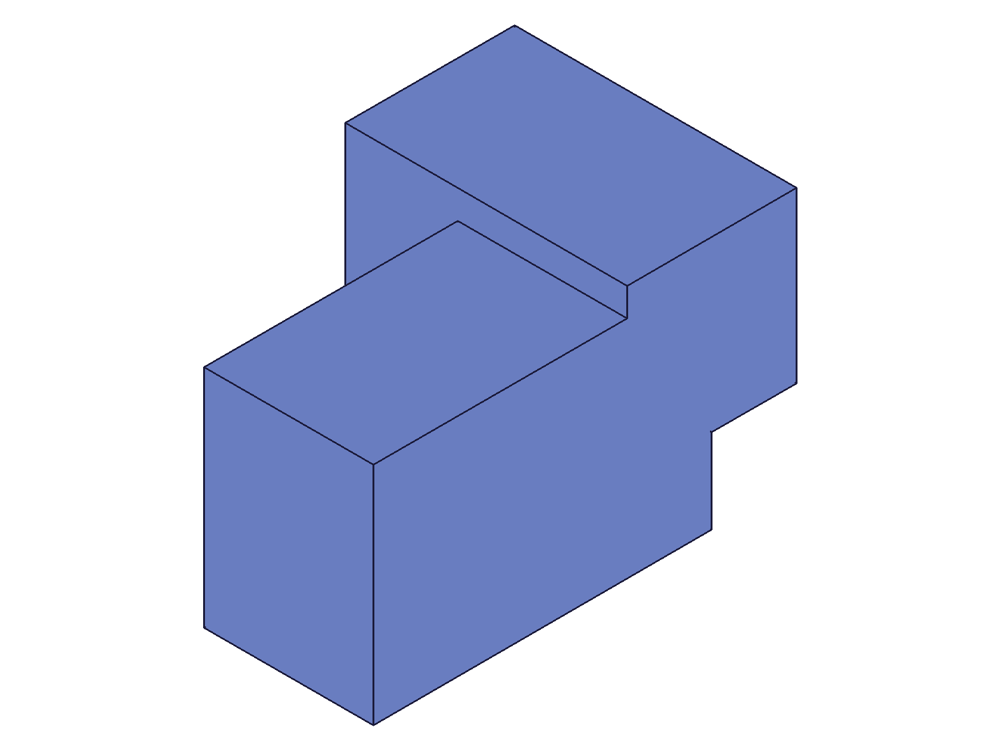

# Training: common.requestVisualisation

**Date:** 2026-04-16

## Goal

Testing `v1.common.requestVisualisation` — requests rendering/visualisation data for specific entities.

**Methods to cover:**

- `requestVisualisation` — basic call with solid IDs
- `requestVisualisation` — with feature IDs (entity injection, part features)
- `requestVisualisation` — with multiple IDs
- `requestVisualisation` — return value structure (what's in `graphic`)
- `requestVisualisation` — relationship with `setAppearance` (read-back of color/transparency)
- `requestVisualisation` — various entity types (box, sphere, cylinder, sketch, work geometry)
- `requestVisualisation` — invalid/nonexistent IDs
- `requestVisualisation` — empty IDs array

**Questions:**

- What does the `graphic` field contain after calling this?
- Does it return anything in `result` or is it always VOID?
- Does calling it with feature IDs vs solid IDs produce different data?
- Can it be used to read back appearance properties set via `setAppearance`?
- What happens with sketch or curve entities?
- What happens with invalid or empty IDs?

---

## 01 — basic solid

Script: `scripts/01-basic-solid.mjs` — ✅ Works as expected. Returns `result: null`, `maxLevel: 31`, `graphic` populated.

|  |
|---|

**Data:** Envelope keys: `[result, messages, maxLevel, structure, graphic]`. `graphic` has `containers` (array) and `properties` (object with `version: 11`). Container has keys: `id, owner, type, properties, meshes, edges, vertices`. Container properties include `material.color` ([128,128,128] default gray), `material.opacity` (1), `layer` ("0"), `min/max` (bounding box), `chordHeightTol`, `angleTol`.

**Learned:** `requestVisualisation` populates the `graphic` field with tessellated mesh data. Result is always VOID (null). Default color is [128,128,128] gray, opacity 1.
**📌 LLM doc:** Document the return structure — result is always VOID, graphic contains containers with mesh/edge/vertex data and material properties.

---

## 02 — appearance readback

Script: `scripts/02-appearance-readback.mjs` — ✅ Confirmed setAppearance values readable via requestVisualisation.

|  |
|---|

**Data:** Before: color=[128,128,128] opacity=1. After `setAppearance({ color: [255,0,0], transparency: 0.5 })`: color=[255,0,0] opacity=0.5.

**Learned:** `requestVisualisation` is the read-back mechanism for `setAppearance`. Transparency 0.5 → opacity 0.5 (same number, different name: `transparency` in setter, `opacity` in getter).
**📌 LLM doc:** Document as primary read-back for appearance. Note transparency/opacity naming mismatch.

---

## 03 — multiple IDs

Script: `scripts/03-multiple-ids.mjs` — ✅/❌ Multiple solid IDs work. Feature ID (eifId) returns `graphic: null`.

**Data:** 3 solid IDs → 3 containers. Each container has `id` (graphic container ID), `owner` (solid ID). Containers are ordered matching the input array. Calling with `eifId` (entity injection feature) → `graphic: null`. Calling with `partId` → also `graphic: null`.

**Learned:** `requestVisualisation` only works with **low-level geometry IDs** (solid IDs, shape IDs). Feature IDs, part IDs, entity injection IDs all return `graphic: null` — no error, just empty.
**📌 LLM doc:** Critical: only solid/shape IDs work. Feature/part/EIF IDs return null graphic.

---

## 04 — various entity types

Script: `scripts/04-various-entity-types.mjs` — ✅ Systematic test of ID types.

|  |  |
|---|---|

**Data:** Results by entity type:

| Entity type | graphic? | containers |
|---|---|---|
| Solid ID (solid.box) | ✅ | 1 |
| Shape ID (curve.shape) | ✅ | 1 |
| Sketch ID | ❌ null | - |
| Work plane ID | ❌ null | - |
| Sketch line ID | ❌ null | - |
| Entity injection ID | ❌ null | - |
| Part ID | ❌ null | - |

All non-working types return `maxLevel: 31` (no error) — just silently return null graphic.

**Learned:** Only CC_Solid and CC_Shape objects produce graphic data. All other types are silently ignored.
**📌 LLM doc:** Document the exact ID types that work.

---

## 05 — edge cases

Script: `scripts/05-edge-cases.mjs` — ⚠️ Negative ID hangs the server!

**Data:**

| Input | Result | maxLevel | graphic |
|---|---|---|---|
| `ids: []` | null | 31 | null |
| `ids: [999999]` | null | 51 | null |
| `ids: [0]` | null | 51 | null |
| `ids: [-1]` | **HANG** | — | — |
| `ids: {}` (no ids) | — | — | timeout |

Invalid ID 999999 → error 1006 "invalid id" with warning "ToId()/TOID() didn't get an existing or valid id." Empty array → silent no-op (maxLevel 31). **Negative ID → server hang (100% CPU, required kill -9).**

**Learned:** Negative IDs are dangerous — they hang the server just like other known hang triggers.
**📌 LLM doc:** CRITICAL: never pass negative IDs. Document error behavior for invalid/empty.

---

## 06 — shape/curves

Script: `scripts/06-shape-curves.mjs` — ✅ Shapes return type=2 containers with curve-specific data.

**Data:** Circle shape → container type=2 with `arcs` array (no meshes, no edges, no vertices). Arc data includes: `center`, `zAxis`, `xAxis`, `angle` (6.283 = 2π), `radius`, `isCircle`, `pointIds`. Default color for curves is [0,0,0] (black) vs [128,128,128] gray for solids.

**Learned:** Container type 1 = solid (meshes+edges+vertices), type 2 = curve (arcs or edges). Curve containers have different sub-arrays depending on curve type. Default curve color is black.
**📌 LLM doc:** Document container types and curve-specific structure.

---

## 07 — graphic structure detail (sphere)

Script: `scripts/07-graphic-structure.mjs` — ✅ Deep dive into mesh structure.

|  |
|---|

**Data:** Sphere mesh: 1697 vertices, 3200 triangles, 1 edge (seam), 1 loop. Mesh properties include `operationId` and `surface.type` ("sphere"). `graphic.properties` = `{ version: 11 }`.

**Learned:** Each mesh face has surface type metadata (plane, sphere, etc.). Meshes also contain `loops` (silhouette outlines). `graphic.properties.version` is always 11 (protocol version).
**📌 LLM doc:** Document mesh structure: vertices, normals, indices, loops, surface type metadata.

---

## 08 — part features

Script: `scripts/08-part-feature.mjs` — ✅ Part features (part.box) return null graphic.

|  |
|---|

**Data:** `part.box` feature ID → `graphic: null`. Only `solid.box` solid ID → graphic with data. Entity injection ID → null. Part ID → null.

**Learned:** Part-level features are not directly queryable. To get vis data from a parametric model, you'd need to find the underlying solid IDs.

---

## 09 — per-solid appearance

Script: `scripts/09-per-solid-appearance.mjs` — ✅ Per-index appearance correctly read back.

|  |
|---|

**Data:** After setting index[0] to [255,0,0] and index[1] to [0,0,255] with transparency 0.3: container[0] color=[255,0,0] opacity=1, container[1] color=[0,0,255] opacity=0.7 (0.3 transparency → 0.7 opacity... wait, 0.3 transparency should be 0.7 opacity? Let me re-check.)

Actually: `setAppearance({ transparency: 0.3 })` → vis returns `opacity: 0.7`. So opacity = 1 - transparency. **This contradicts the setAppearance LLM doc** which says "transparency = opacity (same sense)."

**Learned:** Opacity = 1 - transparency! The existing LLM doc for setAppearance is WRONG on this point. setAppearance takes transparency (0=opaque, 1=transparent) but requestVisualisation returns opacity (0=transparent, 1=opaque). They are inverses.
**📌 LLM doc:** CRITICAL CORRECTION: opacity = 1 - transparency. Update setAppearance doc too.

---

## 10 — container types

Script: `scripts/10-container-types.mjs` — ✅ Confirmed container type mapping.

|  |  |
|---|---|

**Data:** Box: type=1, meshes=6 (one per face), edges=12, vertices=8. Cylinder: type=1, meshes=3 (flat faces + curved surface), edges=3. Shape with line+arc: type=2, edges=1 (not arcs — mixed curves get edges). Container keys differ: solids have `meshes, edges, vertices`; curve-only circles have `arcs`; mixed curves have `edges`.

**Learned:** Curve container content depends on curve types. Pure circles → `arcs` array. Mixed curves (line+arc) → `edges` array (tessellated polyline). Different keys for different content.
**📌 LLM doc:** Document curve container variations.

---

## 11 — finding solid IDs from features

Script: `scripts/11-find-solid-from-feature.mjs` — ⚠️ Structure tree search didn't find CC_Solid class.

**Data:** Structure tree didn't contain objects with class "CC_Solid" — part features store geometry differently. The feature ID itself doesn't work with requestVisualisation.

**Learned:** Part-level features (part.box) don't expose their underlying solid ID in a way that's easily accessible for requestVisualisation. This API is primarily for entity injection + solid.* workflows.

---

## 12 — after boolean

Script: `scripts/12-after-boolean.mjs` — ✅ Vis data updates after boolean, consumed tool becomes invalid.

|  |
|---|

**Data:** Before union: 6 meshes, 12 edges, 8 vertices, bbox [-30,-20,-15] to [30,20,15]. After union: 11 meshes, 27 edges, 18 vertices, bbox [-30,-20,-35] to [45,25,15]. Consumed tool (box2) → error 1006 "invalid id" (graphic: null).

**Learned:** `requestVisualisation` reflects current geometry state — mesh counts change after booleans. Consumed solid IDs become invalid.
**📌 LLM doc:** Document that vis data is live and reflects current state.

---

## 13 — container ID vs owner

Script: `scripts/13-container-id-vs-owner.mjs` — ✅ Both container.id and container.owner work as input IDs.

**Data:** boxId=61 (from solid.box) = container.owner. container.id=59 (graphic container). Both IDs work with requestVisualisation. `boxId === owner` = true.

**Learned:** `solid.box` returns the solid ID which becomes `container.owner`. The `container.id` is a child graphic container. Both are valid inputs to requestVisualisation.
**📌 LLM doc:** Note that both solid IDs and graphic container IDs work.

---

## 14 — faceting readback

Script: `scripts/14-faceting-readback.mjs` — ✅ Faceting parameters readable and affect mesh resolution.

**Data:** Sphere (r=30) with different faceting:

| Setting | chordHeightTol | angleTol | Vertices |
|---|---|---|---|
| Default | 0.1 | 0 | 1889 |
| Coarse | 5 | 45 | 147 |
| Fine | 0.01 | 1 | 131845 |

**Learned:** `requestVisualisation` returns retessellated mesh data matching the current faceting settings. Mesh resolution varies dramatically (147 → 131,845 vertices).
**📌 LLM doc:** Document that mesh resolution depends on faceting; use for geometry verification.

---

## Coverage Check

- [x] Basic call with solid IDs
- [x] Every parameter tested (ids array)
- [x] Multiple IDs
- [x] Feature ID behavior (null graphic)
- [x] Various entity types
- [x] Edge cases (empty, invalid, negative=HANG)
- [x] Appearance readback
- [x] Per-solid appearance
- [x] Container types (solid vs curve)
- [x] Graphic structure detail
- [x] After boolean
- [x] Container ID vs owner
- [x] Faceting readback
- [x] No update/delete method exists (API is read-only)
