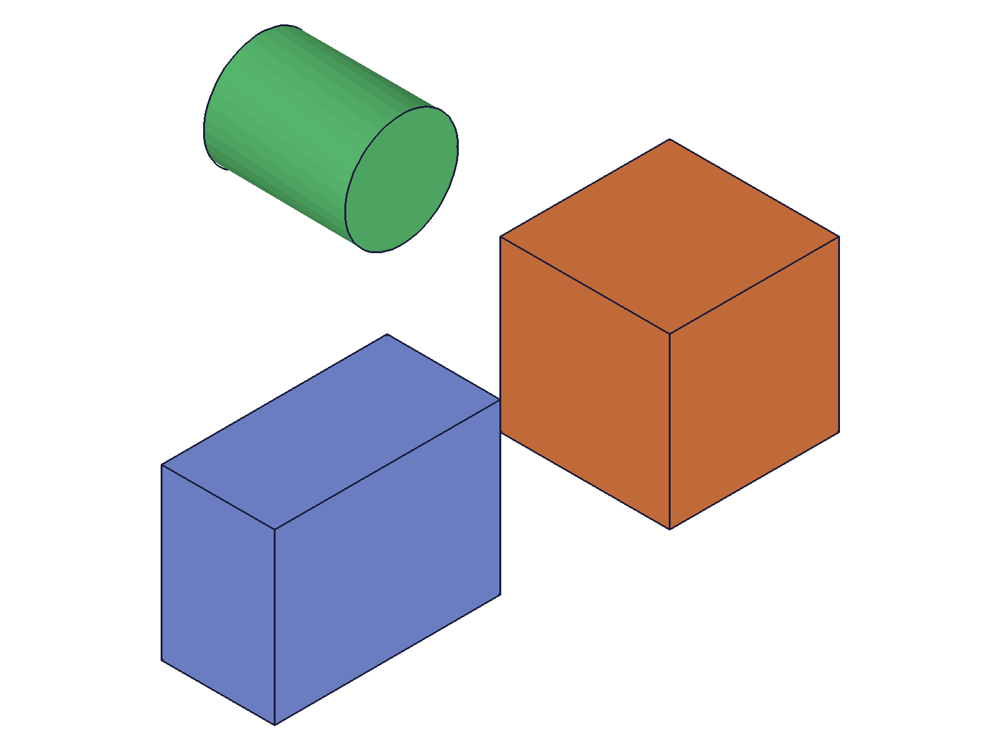
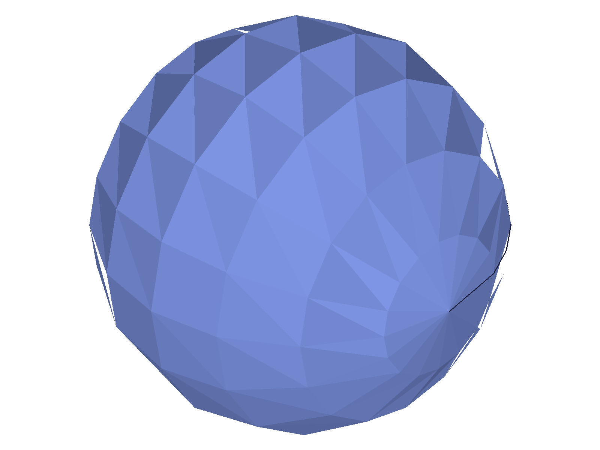
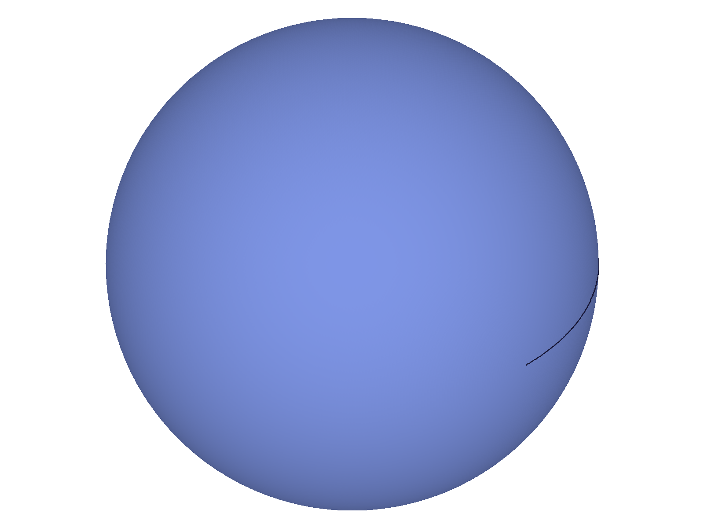
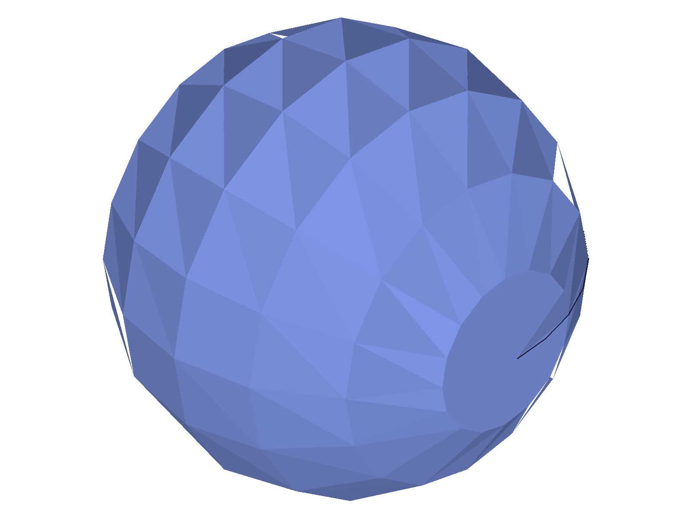

# Training: common.setAppearance

**Date:** 2026-04-16

## Goal

Testing `v1.common.setAppearance` — setting color, transparency, and faceting tolerances on features and specific solid indices.

**Methods to cover:**

- `setAppearance` — basic color (RGB 0-255 array)
- `setAppearance` — transparency (0-1 range)
- `setAppearance` — color + transparency combined
- `setAppearance` — `target` as plain ID vs `target` as `{ id, indices }` object
- `setAppearance` — `indices` for selecting specific solids in a multi-solid feature
- `setAppearance` — `chordHeightTol` and `angleTol` per-feature faceting overrides
- `setAppearance` — array form (batch multiple targets in one call)
- `setAppearance` — edge cases: no color/no transparency, invalid target, out-of-range values

**Questions:**

- Does the color actually affect the graphic data returned?
- Does transparency affect the graphic data or is it metadata only?
- How do indices work — 0-based? What happens with out-of-range indices?
- Do chordHeightTol/angleTol actually change tessellation on the feature?
- Can you set appearance on sketches, work geometry, or only solid features?
- What happens if you call setAppearance with no color and no transparency?
- Does the array form work as documented?

---

## 01 — basic color

Script: `scripts/01-basic-color.mjs` — ✅ `setAppearance` accepts RGB color arrays. Returns `result: null`, `maxLevel: 31` (info). Three successive calls (red, green, blue) all succeed.

|  |  |
|---|---|

**Data:** All calls return `result: null, maxLevel: 31`. The harness renderer does NOT reflect `setAppearance` colors — both images look identical (blue default). Color is stored internally but not visible in the renderer's output. See script 14 for proof that color is stored.

**Learned:** `setAppearance` silently stores color metadata. The harness renderer ignores it and uses its own per-body palette.

---

## 02 — verify storage in structure tree

Script: `scripts/02-verify-storage.mjs` — ✅ called with `color: [255,0,0], transparency: 0.5`. Structure trees before and after are identical in size (21047 bytes each). Graphic data from `recalc()` is null (4 bytes — just `null`).

**Data:** Structure tree does NOT show appearance data. Graphic from `recalc()` is null in CLI mode. Appearance storage is invisible through these channels — must use `requestVisualisation` (script 14) to observe stored values.

**Learned:** Appearance data is NOT in the structure tree and NOT in the recalc graphic data.

---

## 03 — transparency edge cases

Script: `scripts/03-transparency.mjs` — ✅ as documented for valid range.

**Data:** All calls return `maxLevel: 31`:
- `transparency: 0.5` ✅
- `transparency: 0.0` ✅ (fully opaque)
- `transparency: 1.0` ✅ (fully transparent)
- `transparency: 2.0` ✅ silently accepted — no error, no clamp
- `transparency: -1.0` ✅ silently accepted — no error
- Empty call (no color, no transparency) ✅ silently accepted

**Learned:** Out-of-range transparency values are accepted without error. No validation on range [0,1].
**📌 LLM doc:** Values outside [0,1] silently accepted — no validation. Empty call is a no-op.

---

## 04 — indices for per-solid coloring

Script: `scripts/04-indices.mjs` — per-solid targeting via `target: { id, indices }` works.

|  |  |
|---|---|

**Data:**
- `indices: [0]` → `maxLevel: 31` ✅ (0-based)
- `indices: [1]` → `maxLevel: 31` ✅
- `indices: [2]` → `maxLevel: 31` ✅
- `indices: [99]` → `maxLevel: 51` ERROR: `"objId not found"` — out-of-range index caught
- `indices: [0, 2]` → `maxLevel: 31` ✅ — multiple indices work
- `indices: []` → `maxLevel: 31` ✅ — empty array is a silent no-op

**Learned:** Indices are 0-based. Multiple indices in one call work. Out-of-range index gives error. Empty indices array succeeds silently.
**📌 LLM doc:** Document index semantics — 0-based, multi-index, out-of-range error.

---

## 05 — array form (batch)

Script: `scripts/05-array-form.mjs` — ✅ as documented. Passing an array of objects to `setAppearance` sets different appearances on different features in one call.

**Data:** Both the plain array form and array-with-indices form return `maxLevel: 31`.

**Learned:** Array form works as documented. Can mix plain target IDs and `{ id, indices }` objects.

---

## 06 — target types (what accepts appearance?)

Script: `scripts/06-target-types.mjs` — key finding: only "operation" IDs are valid targets.

**Data:**
- Part ID → `maxLevel: 51` ERROR: `"The provided id for the target has the wrong type. It must be an operation id."` (code 1007)
- Entity injection ID → `maxLevel: 31` ✅
- Raw solid ID (boxId) → `maxLevel: 31` ✅
- Work plane ID → `maxLevel: 51` ERROR: `"must be an operation id"` (code 1007)
- Sketch ID (from `sketch.create`) → `maxLevel: 51` ERROR: `"must be an operation id"` (code 1007)
- Invalid ID (999999) → `maxLevel: 51` ERROR: `"invalid id"` (code 1006)

**Learned:** Target must be a feature/operation ID — entity injection features, part features (box, extrusion, etc.), or direct solid IDs. Part containers, sketches, and work geometry are NOT valid targets.
**📌 LLM doc:** Critical — document which ID types are valid targets. Error code 1007 for wrong type.

---

## 07 — part-level features

Script: `scripts/07-part-features.mjs` — ✅ `part.box` and `part.extrusion` feature IDs work as targets.

|  |  |
|---|---|

**Data:**
- `part.box` feature ID → `maxLevel: 31` ✅
- `part.extrusion` feature ID → `maxLevel: 31` ✅
- Sketch feature ID (from `part.sketch`) → `maxLevel: 51` ERROR: `"must be an operation id"` (code 1007)

**Learned:** Parametric features (box, extrusion) accept appearance. Sketch features do not.
**📌 LLM doc:** Confirm part features are valid targets, sketches are not.

---

## 08 — faceting parameters (chordHeightTol, angleTol)

Script: `scripts/08-faceting-params.mjs` — ✅ per-feature faceting overrides work and visually change tessellation.

|  |  |  |
|---|---|---|

**Data:** Vertex counts from `recalc()` are all 0 (CLI mode doesn't return mesh data through recalc). But snapshots clearly show:
- **Baseline** (defaults: chordHeightTol=0.1, angleTol=0): smooth sphere with visible facets
- **Coarse** (chordHeightTol=5.0, angleTol=45): heavily faceted, large triangles
- **Fine** (chordHeightTol=0.01, angleTol=1): very smooth sphere, facets barely visible

**Learned:** `chordHeightTol` and `angleTol` in `setAppearance` override the global faceting settings for that specific feature. Visual evidence confirms they work. The recalc graphic data doesn't expose mesh in CLI mode — snapshots (which go through `requestVisualisation` internally) do.
**📌 LLM doc:** Per-feature faceting overrides are real and work. Document how they relate to global `setFacetingParameters`.

---

## 09 — color edge cases

Script: `scripts/09-color-edge-cases.mjs` — mixed results.

**Data:**
- `color: [300, 400, 500]` → `maxLevel: 31` ✅ — silently accepted, no clamp
- `color: [-10, -20, -30]` → `maxLevel: 31` ✅ — silently accepted
- `color: [127.5, 64.3, 200.8]` → `maxLevel: 31` ✅ — floats accepted
- `color: [255, 0]` → `maxLevel: 51` ERROR: `"color has invalid number of elements! There should be 3 element(s)"` (code 1002)
- `color: [255, 0, 0, 128]` → `maxLevel: 51` ERROR: same — exactly 3 required
- `color: []` → `maxLevel: 51` ERROR: same

**Learned:** Color must be exactly 3 elements. Values outside [0,255] are silently accepted. Floats are accepted. No clamping.
**📌 LLM doc:** Must be exactly 3 elements. No range validation on values.

---

## 10 — OFB persistence (first attempt)

Script: `scripts/10-ofb-persistence.mjs` — ❌ load failed because `doClear: 'TRUE'` (string) was used. `loadRes.id` was `undefined`.

**Learned:** `doClear` parameter on `common.load` must be a boolean/number, not a string. This is a `common.load` issue, not a `setAppearance` issue.

---

## 11 — persistence fix attempt

Script: `scripts/11-persistence-fix.mjs` — ❌ load still failed with `doClear: 'TRUE'` (string). Error: `"doClear has the wrong type! It should be of type (boolean)"` (code 1001).

---

## 12 — persistence v2 (doClear: 1)

Script: `scripts/12-persistence-v2.mjs` — ✅ load succeeded with `doClear: 1`. Result: `{id: 4}`.

|  |  |
|---|---|

**Data:** OFB content ~23920 bytes. Load result: `{id: 4}`, maxLevel: 31. Both snapshots show the same coarse-faceted sphere, confirming faceting settings persisted through the OFB save/load cycle.

**Learned:** Appearance (at minimum faceting params) persists through OFB save/load. Color persistence can't be visually confirmed via the harness renderer but is likely stored.
**📌 LLM doc:** Appearance persists in OFB format.

---

## 13 — overwrite behavior

Script: `scripts/13-overwrite.mjs` — ✅ successive `setAppearance` calls on the same target all succeed (maxLevel 31). Set color+transparency, then color-only, then transparency-only — no errors.

**Data:** All three calls return `maxLevel: 31`. No `getAppearance` API exists to verify whether properties merge or replace.

**Learned:** Multiple `setAppearance` calls on the same target don't conflict. Whether unspecified properties are preserved or reset is unknown — there's no read-back API.

---

## 14 — requestVisualisation (observing stored appearance)

Script: `scripts/14-requestVis.mjs` — ✅ `requestVisualisation` returns stored appearance data in the graphic payload.

**Data:** After `setAppearance({ target: eifId, color: [255,0,0], transparency: 0.5 })`, `requestVisualisation({ ids: [boxId] })` returns graphic data with:
```
containers[0].properties.material.color = [255, 0, 0]
containers[0].properties.material.opacity = 0.5
containers[0].properties.chordHeightTol = 0.1
containers[0].properties.angleTol = 0
```

Graphic has two top-level keys: `containers` and `properties`.

**Learned:** `requestVisualisation` is how to verify appearance — it returns color as `material.color`, transparency as `material.opacity`, and faceting params in `properties`. This is the read-back mechanism for appearance data.
**📌 LLM doc:** Document requestVisualisation as the way to read back appearance. Note: transparency → opacity naming difference.

---

## Coverage checklist

- [x] setAppearance called successfully
- [x] Color (RGB array) tested
- [x] Transparency tested with valid and out-of-range values
- [x] Target as plain ID vs `{ id, indices }` object
- [x] Per-solid indices (0-based, multi-index, out-of-range, empty)
- [x] chordHeightTol / angleTol per-feature overrides
- [x] Array form (batch multiple targets)
- [x] Target type validation (which IDs work, which don't)
- [x] Color edge cases (wrong element count, out-of-range values, floats)
- [x] OFB persistence roundtrip
- [x] Overwrite behavior
- [x] Read-back via requestVisualisation
- [x] Part features (part.box, part.extrusion) as targets
