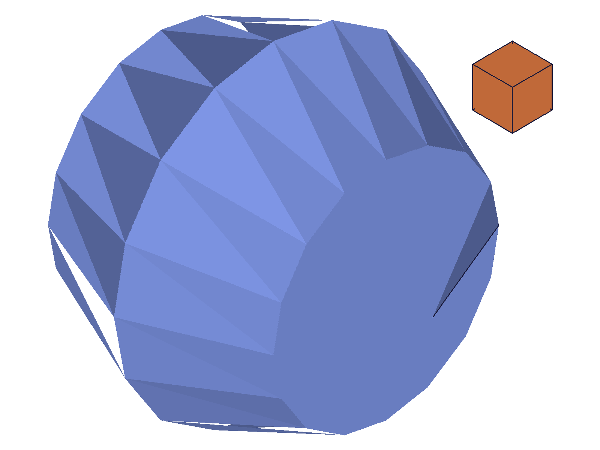
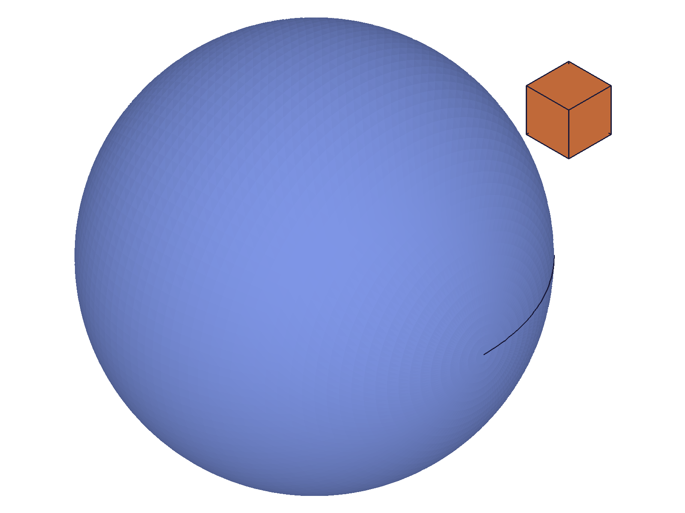

# Training: getFacetingParameters & setFacetingParameters

**Date:** 2026-04-16

## Goal

Testing `v1.common.getFacetingParameters` and `v1.common.setFacetingParameters`.

**Methods to cover:**

- `getFacetingParameters` — no params, returns `{ angleTol, chordHeightTol }`
- `setFacetingParameters` — `angleTol` and `chordHeightTol` (both required)

**Questions:**

- What are the exact default values from getFacetingParameters?
- Does setFacetingParameters support partial updates (just one param)?
- What validation exists for edge cases (zero, negative, huge values)?
- Does cross-talk with getDatabaseSettings work bidirectionally?
- Does getFacetingParameters return only `{ angleTol, chordHeightTol }` or additional fields?
- What's the return value and maxLevel of setFacetingParameters?
- What happens with empty params `{}`?
- Do values persist across `common.clear()` and `part.create()`?
- Do the faceting params actually affect tessellation output (vertex counts)?

---

## 01 — defaults

Script: `scripts/01-defaults.mjs` — ✅ Returns `{ angleTol: 0, chordHeightTol: 0.2 }`, maxLevel=31.

**Data:** Result contains exactly 2 keys: `angleTol, chordHeightTol`. No other fields. chordHeightTol=0.2 (not 0.1) because worker state persists from prior sessions — true server default is 0.1 per `getDatabaseSettings` LLM doc.

**📌 LLM doc:** getFacetingParameters returns exactly `{ angleTol, chordHeightTol }` — a strict subset of getDatabaseSettings.

---

## 02 — set both params

Script: `scripts/02-set-both.mjs` — ✅ Setting both params works. Returns null, maxLevel=31.

**Data:** Before: `{ angleTol: 0, chordHeightTol: 0.2 }`. After `setFacetingParameters({ angleTol: 15, chordHeightTol: 0.5 })`: `{ angleTol: 15, chordHeightTol: 0.5 }`. Confirmed via `files/02-set-both-set-both.json`.

**📌 LLM doc:** setFacetingParameters returns null (VOID), maxLevel=31 on success.

---

## 03 — partial updates (FAIL)

Script: `scripts/03-set-partial.mjs` — Partial updates appear to silently fail.

**Data:** Baseline `{ angleTol: 0, chordHeightTol: 0.1 }`. After `setFacetingParameters({ angleTol: 25 })`: still `{ angleTol: 0, chordHeightTol: 0.1 }`. After `setFacetingParameters({ chordHeightTol: 0.02 })`: still unchanged. See `files/03-set-partial-partial-updates.json`.

**Learned:** Partial updates don't work — setting only one param has no effect. Investigated further in script 14.

---

## 04 — empty params

Script: `scripts/04-empty-params.mjs` — ✅ Empty `{}` returns maxLevel=51 (ERROR), values unchanged.

**Data:** Before: `{ angleTol: 10, chordHeightTol: 0.3 }`. After `setFacetingParameters({})`: unchanged. maxLevel=51 (error). Different from `setDatabaseSettings({})` which returns maxLevel=31 (no-op, no error). See `files/04-empty-params-empty-params.json`.

**📌 LLM doc:** Empty params rejected with error — unlike setDatabaseSettings.

---

## 14 — partial update debug (NullMem error)

Script: `scripts/14-partial-debug.mjs` — Partial updates return maxLevel=51 with NullMem error.

**Data:** Baseline `{ angleTol: 10, chordHeightTol: 0.5 }`. Setting `{ angleTol: 30 }` alone: maxLevel=51, error message: `"Type error: A variable of the type NullMem (nicht initialisiertes Member) has been defined as type Gleitkommazahl addressed."` Values unchanged. Same error for `{ chordHeightTol: 0.01 }` alone. See `files/14-partial-debug-partial-debug.json`.

**Learned:** **setFacetingParameters REQUIRES BOTH params.** Omitting either triggers a NullMem error because the missing param is accessed as an uninitialized member. This is a critical difference from setDatabaseSettings which supports partial updates.

**📌 LLM doc:** Both `angleTol` and `chordHeightTol` are mandatory in setFacetingParameters — not optional as the API docs suggest.

---

## 15 — zero values (v2, both params provided)

Script: `scripts/15-edge-zero-v2.mjs` — Mixed results for zero values.

**Data:**
- `{ angleTol: 10, chordHeightTol: 0 }`: maxLevel=31 ✅ — zero chordHeightTol ACCEPTED. Readback: `{ angleTol: 10, chordHeightTol: 0 }`.
- `{ angleTol: 0, chordHeightTol: 0.3 }`: maxLevel=31 ✅ — zero angleTol accepted (means "disabled").
- `{ angleTol: 0, chordHeightTol: 0 }`: maxLevel=51 ❌ — BOTH zero rejected. Error: "Not allowed to set both angleTol and chordHeightTol to 0".

See `files/15-edge-zero-v2-edge-zero-v2.json`.

**Learned:** Zero chordHeightTol is accepted by setFacetingParameters (when angleTol > 0). This **differs from setDatabaseSettings** which rejects `chordHeightTol: 0` with an error. At least one tolerance must be non-zero.

**📌 LLM doc:** Zero chordHeightTol accepted (unlike setDatabaseSettings). Both zero rejected.

---

## 16 — negative values (v2, both params provided)

Script: `scripts/16-edge-negative-v2.mjs` — ✅ Negatives silently ignored.

**Data:** Baseline `{ angleTol: 10, chordHeightTol: 0.3 }`. All three tests (`{ angleTol: 10, chordHeightTol: -0.5 }`, `{ angleTol: -10, chordHeightTol: 0.3 }`, `{ angleTol: -5, chordHeightTol: -1 }`) returned maxLevel=31 but values unchanged. See `files/16-edge-negative-v2-edge-negative-v2.json`.

**Learned:** Negative values are silently ignored — no error, no change. Consistent with setDatabaseSettings behavior.

**📌 LLM doc:** Negative values silently ignored.

---

## 17 — large and tiny values (v2)

Script: `scripts/17-edge-large-v2.mjs` — Large values accepted, fractional angleTol < 1 rejected.

**Data:**
- `{ angleTol: 0, chordHeightTol: 1000 }`: ✅ accepted, stored.
- `{ angleTol: 360, chordHeightTol: 0.1 }`: ✅ accepted, stored.
- `{ angleTol: 0, chordHeightTol: 0.001 }`: ✅ accepted, stored.
- `{ angleTol: 0.5, chordHeightTol: 0.1 }`: ❌ maxLevel=51, rejected.

See `files/17-edge-large-v2-edge-large-v2.json`. Investigated angleTol boundary in script 18.

---

## 18 — angleTol boundary

Script: `scripts/18-angleTol-boundary.mjs` — angleTol must be 0 or >= 1.

**Data:** Tested values 0, 0.1, 0.5, 0.9, 1, 1.5, 2, 3, 5, 10, 15, 20, 45, 90, 180, 360.
- angleTol=0: ✅ (disabled)
- angleTol in (0, 1): ❌ rejected (0.1, 0.5, 0.9 all fail)
- angleTol >= 1: ✅ accepted (including fractional like 1.5)

See `files/18-angleTol-boundary-angleTol-boundary.json`.

**Learned:** angleTol has a minimum threshold of 1.0 degree. Values between 0 (exclusive) and 1 (exclusive) are rejected. 0 means disabled.

**📌 LLM doc:** angleTol must be 0 (disabled) or >= 1.0 degrees.

---

## 08 — cross-talk with getDatabaseSettings

Script: `scripts/08-crosstalk.mjs` — ✅ Bidirectional cross-talk confirmed.

**Data:**
- Set via setFacetingParameters `{ angleTol: 20, chordHeightTol: 0.05 }` → getDatabaseSettings reads `angleTol: 20, chordHeightTol: 0.05`. ✅
- Set via setDatabaseSettings `{ angleTol: 5, chordHeightTol: 0.8 }` → getFacetingParameters reads `{ angleTol: 5, chordHeightTol: 0.8 }`. ✅

See `files/08-crosstalk-crosstalk.json`.

**📌 LLM doc:** Same backing store — changes via either API visible from both.

---

## 09 — persistence across clear/create

Script: `scripts/09-persist-clear.mjs` — ✅ Values persist.

**Data:** Set `{ angleTol: 12, chordHeightTol: 0.25 }`. After `common.clear()`: unchanged. After `part.create()`: unchanged. See `files/09-persist-clear-persist-clear.json`.

**📌 LLM doc:** Worker-level state, not drawing-level. Survives clear and part.create.

---

## 12 — wrong types

Script: `scripts/12-wrong-types.mjs` — Type errors and unknown params all rejected.

**Data:**
- String chordHeightTol `'abc'`: maxLevel=51, code=1001 "wrong type! should be (real)". Type check runs before NullMem check.
- Boolean angleTol `true` (chordHeightTol missing): maxLevel=51, NullMem error (missing param).
- Unknown param `{ foo: 42 }` (both real params missing): maxLevel=51, NullMem error.

See `files/12-wrong-types-wrong-types.json`.

**📌 LLM doc:** Params must be real (number) type. Strings rejected with code 1001.

---

## 19 — mesh debug (facetingParamsMode not reset)

Script: `scripts/19-mesh-debug.mjs` — ✅ setFacetingParameters does NOT reset facetingParamsMode.

**Data:** Set facetingParamsMode=0 via setDatabaseSettings, then called setFacetingParameters. facetingParamsMode stayed at 0. Sphere at cht=0.5 returned 277 vertices. See `files/19-mesh-debug-mesh-debug.json`.

---

## 21 — single mesh verification

Script: `scripts/21-single-mesh.mjs` — ✅ cht=0.5 produces 277 vertices in isolation.

**Data:** With facetingParamsMode=0 and cht=0.5: sphere returns 277 vertices, 1392 indices. Confirms faceting params affect tessellation. Vertex counts consistent with setDatabaseSettings training data (0.5 → 277 vertices). See `files/21-single-mesh-single-mesh.json`.

---

## 13 — visual comparison (coarse vs fine)

Script: `scripts/13-visual-comparison.mjs` — ✅ Dramatic visual difference.

|  |  |
|---|---|

**Data:** Coarse (cht=5.0) shows heavily faceted polygonal sphere with visible triangular faces. Fine (cht=0.01) shows smooth sphere. Reference box (orange) is same size in both, confirming the difference is tessellation quality, not geometry.

**📌 LLM doc:** Include note about visual impact of chordHeightTol.

---

## Coverage Checklist

- [x] getFacetingParameters called successfully, return structure documented
- [x] setFacetingParameters called successfully with both params
- [x] Partial updates tested — FAIL, both params required
- [x] Empty params tested — error
- [x] Edge cases: zero, negative, large, tiny, fractional
- [x] angleTol boundary discovered (must be 0 or >= 1)
- [x] Cross-talk with getDatabaseSettings confirmed bidirectional
- [x] Persistence across clear/create confirmed
- [x] Wrong types tested
- [x] Mesh effect verified numerically (vertex counts) AND visually (snapshots)
- [x] Behavioral claims verified with data AND visual evidence
