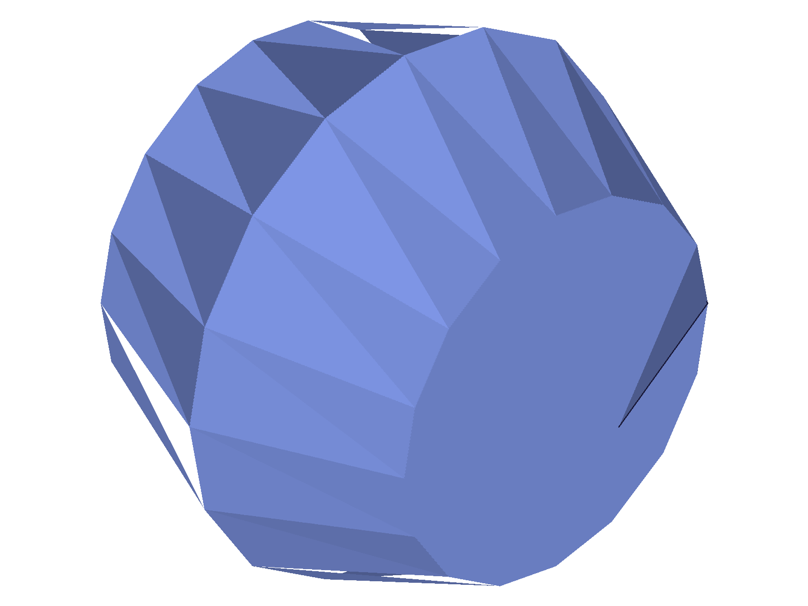
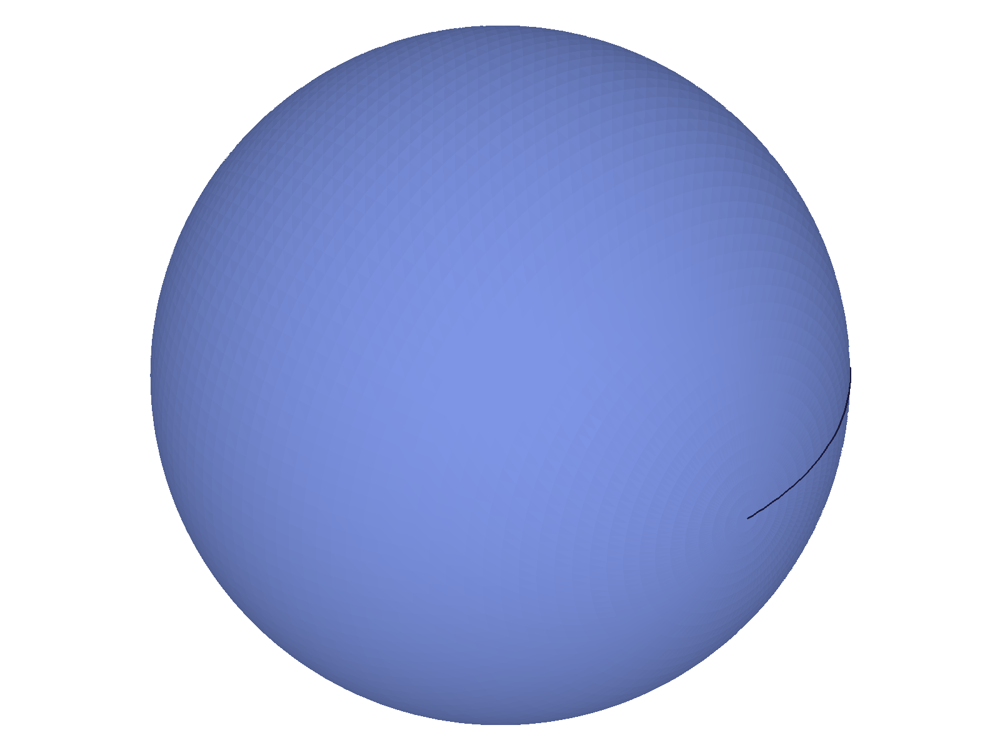

# Training: setFacetingParameters (verification)

**Date:** 2026-04-16

## Goal

Verification session for `v1.common.setFacetingParameters`. The prior session (2026-04-16_11-00-00_getFacetingParameters) already covered this API extensively with 21 scripts and produced a comprehensive LLM doc. This session verifies key findings live and fills any gaps.

**Key findings to verify:**

- Both params required (partial update → NullMem error)
- angleTol must be 0 or >= 1.0
- Negative values silently ignored
- Zero chordHeightTol accepted when angleTol > 0
- Both zero rejected
- Cross-talk with getDatabaseSettings
- Mesh effect on actual geometry

**New tests:**

- Extra unknown params alongside valid ones (does it still work or error?)
- Calling setFacetingParameters twice in succession (do values compound or overwrite?)
- Boundary: angleTol exactly 1.0 vs 0.99

---

## 01 — both params required

Script: `scripts/01-both-required.mjs` — ✅ Confirmed: partial updates fail with maxLevel=51, both params together work (maxLevel=31).

**Data:** Only angleTol → maxLevel=51. Only chordHeightTol → maxLevel=51. Both → maxLevel=31, readback `{"angleTol":15,"chordHeightTol":0.3}`. See `files/01-both-required-both-required.json`.

---

## 02 — angleTol boundary

Script: `scripts/02-angleTol-boundary.mjs` — ✅ Confirmed: angleTol must be 0 or >= 1.0.

**Data:**
- angleTol=0: ✓ (maxLevel=31, readback=0)
- angleTol=0.5: ❌ (maxLevel=51, readback=0)
- angleTol=0.99: ❌ (maxLevel=51, readback=0)
- angleTol=1.0: ✓ (maxLevel=31, readback=1)
- angleTol=1.5: ✓ (maxLevel=31, readback=1.5)

See `files/02-angleTol-boundary-angleTol-boundary.json`.

---

## 03 — negatives and zeros

Script: `scripts/03-negatives-and-zeros.mjs` — ✅ All edge cases confirmed.

**Data:**
- Negative angleTol: maxLevel=31 but unchanged (silently ignored)
- Negative chordHeightTol: maxLevel=31 but unchanged (silently ignored)
- Both zero: ❌ rejected (maxLevel=51)
- Zero chordHeightTol + angleTol>0: ✓ accepted (chordHeightTol=0)

See `files/03-negatives-and-zeros-negatives-zeros.json`.

---

## 04 — extra unknown params (NEW FINDING)

Script: `scripts/04-extra-params.mjs` — Extra unknown params are silently ignored when valid params are present.

**Data:**
- `{ angleTol: 15, chordHeightTol: 0.2, unknownParam: 42 }`: ✓ maxLevel=31, values applied. `unknownParam` silently ignored.
- `{ angleTol: 10, chordHeightTol: 0.3, facetingParamsMode: 1 }`: ✓ maxLevel=31, faceting values applied. `facetingParamsMode` silently ignored (stays at 0).

See `files/04-extra-params-extra-params.json`.

**Learned:** Extra/unknown params are silently ignored — they do NOT cause errors as long as both required params (`angleTol`, `chordHeightTol`) are present. The existing LLM doc's "Unknown param names → Error" row was misleading: the error only happens because required params are missing, not because of the unknowns themselves.

**📌 LLM doc:** Clarify unknown params behavior — silently ignored when valid params present. Error only if required params are missing.

---

## 05 — successive calls

Script: `scripts/05-successive-calls.mjs` — ✅ Successive calls overwrite, no compounding.

**Data:** Call 1 set `{ angleTol: 10, chordHeightTol: 0.5 }`. Call 2 set `{ angleTol: 5, chordHeightTol: 0.02 }`. Readback after call 2: `{ angleTol: 5, chordHeightTol: 0.02 }`. Overwrite confirmed.

See `files/05-successive-calls-successive-calls.json`.

---

## 07 — cross-talk

Script: `scripts/07-crosstalk.mjs` — ✅ Bidirectional cross-talk confirmed.

**Data:**
- Set via setFacetingParameters `{ angleTol: 20, chordHeightTol: 0.05 }` → getDatabaseSettings reads same values.
- Set via setDatabaseSettings `{ angleTol: 5, chordHeightTol: 0.8 }` → getFacetingParameters reads same values.

See `files/07-crosstalk-crosstalk.json`.

---

## 09 — mesh effect (v2)

Script: `scripts/09-mesh-effect-v2.mjs` — ✅ Dramatic mesh effect confirmed with vertex counts AND snapshots.

|  |  |
|---|---|

**Data:** Coarse (cht=5.0): 85 vertices. Fine (cht=0.01): 8385 vertices. Ratio: 98.6x. Snapshots show heavily faceted polygon vs smooth sphere. Mesh effect via `setFacetingParameters` confirmed with numerical and visual evidence.

See `files/09-mesh-effect-v2-mesh-effect-v2.json`.

---

## Coverage Checklist

- [x] Both params required (partial update → NullMem error) — script 01
- [x] angleTol boundary (0 or >= 1.0) — script 02
- [x] Negative values silently ignored — script 03
- [x] Zero chordHeightTol accepted when angleTol > 0 — script 03
- [x] Both zero rejected — script 03
- [x] Cross-talk with getDatabaseSettings bidirectional — script 07
- [x] Mesh effect confirmed (vertex counts + snapshots) — script 09
- [x] Extra unknown params silently ignored (NEW) — script 04
- [x] Successive calls overwrite (NEW) — script 05
- [x] Behavioral claims verified with data AND visual evidence
