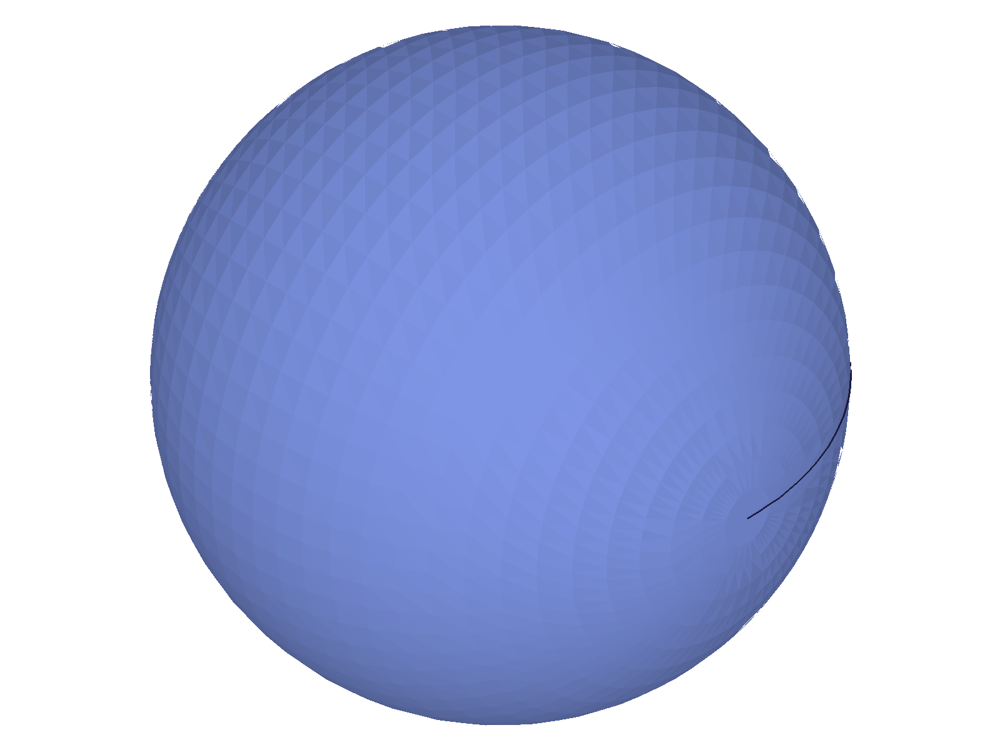
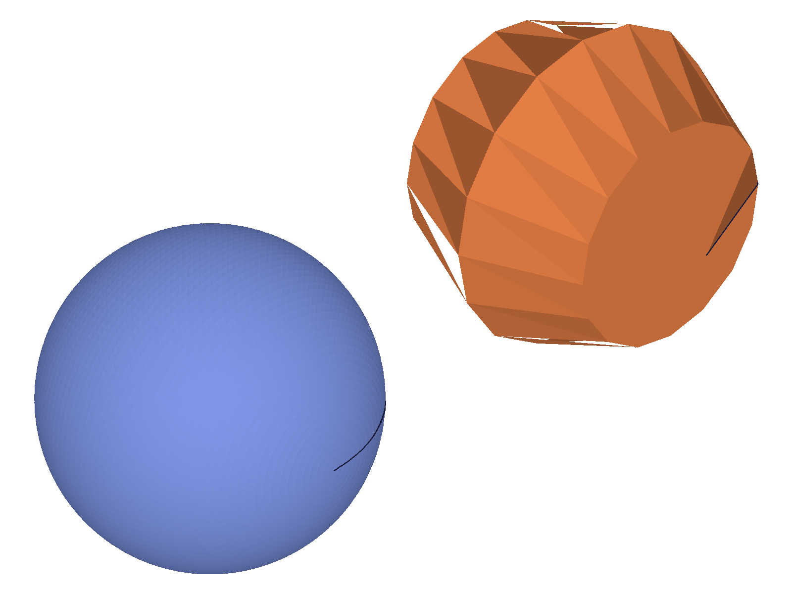
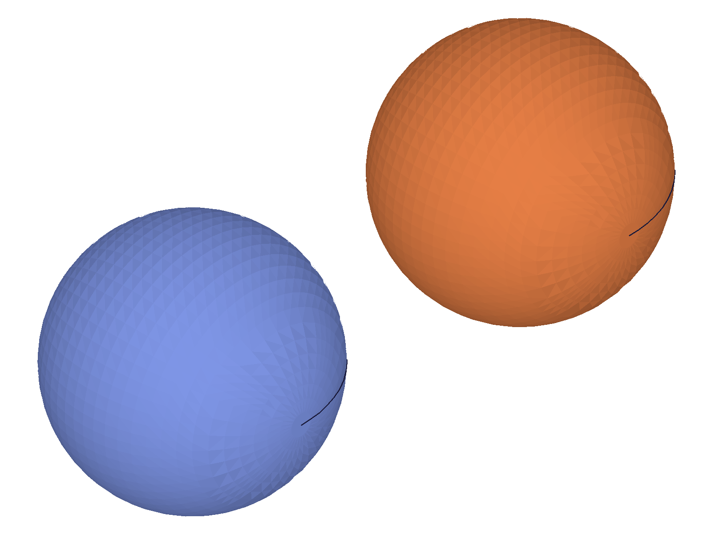

# Training: Faceting Concepts — chordHeightTol, angleTol, Quality vs Performance

**Date:** 2026-04-16

## Goal

Conceptual study of the tessellation/faceting system. Prior API sessions (getDatabaseSettings, setDatabaseSettings, getFacetingParameters, setFacetingParameters) documented the CRUD mechanics. This session synthesizes the **concepts** — what the parameters mean geometrically, how they interact, and practical quality-vs-performance guidance.

**Questions to answer:**

1. What does `chordHeightTol` mean geometrically?
2. What does `angleTol` mean geometrically?
3. How do they interact when both are non-zero?
4. Does faceting affect flat faces (box) or only curved geometry?
5. How does per-entity faceting work (`setAppearance` + `facetingParamsMode`)?
6. Does faceting quality affect STL export?
7. What are practical recommendations for quality vs performance tradeoffs?

---

## 01 — chordHeightTol sweep

Script: `scripts/01-chord-height-sweep.mjs` — Sweeping chordHeightTol from 0.001 to 10 on a sphere (r=20).

**Data:** Vertex counts from `requestVisualisation` (see `files/01-chord-height-sweep-chord-sweep.json`):

| chordHeightTol | Vertices | Indices | Edge Points |
|---|---|---|---|
| 0.001 | 115,461 | 688,140 | 405 |
| 0.01 | 8,385 | 48,384 | 129 |
| 0.05 | 2,017 | 11,328 | 65 |
| 0.1 (default) | 1,697 | 9,600 | 33 |
| 0.25 | 497 | 2,688 | 28 |
| 0.5 | 277 | 1,392 | 17 |
| 1 | 153 | 672 | 13 |
| 2 | 113 | 528 | 9 |
| 5 | 85 | 288 | 5 |
| 10 | 45 | 144 | 5 |

**Learned:** chordHeightTol is the **max perpendicular distance** (in model units) from the true curved surface to the flat tessellation triangle. Lower = finer mesh. The relationship is super-linear: 10x tighter tolerance → ~10-14x more vertices. At 0.001, the sphere has 115K vertices. At 10, just 45. Edge tessellation also scales with the same tolerance. `requestVisualisation` reports the effective `chordHeightTol` in `container.properties`.

📌 LLM doc: Document the geometric meaning and scaling behavior.

---

## 02 — angleTol sweep

Script: `scripts/02-angle-tol-sweep.mjs` — Sweeping angleTol from 1° to 180° on a sphere, with chordHeightTol effectively disabled (set to 100).

**Data:** (see `files/02-angle-tol-sweep-angle-sweep.json`):

| angleTol (°) | Vertices |
|---|---|
| 1 | 131,845 |
| 2 | 33,153 |
| 3 | 8,385 |
| 5 | 8,385 |
| 10 | 2,145 |
| 15 | 561 |
| 20 | 561 |
| 30 | 154 |
| 45 | 126 |
| 60 | 45 |
| 90 | 20 |
| 180 | 0 |

**Learned:** angleTol is the **max angle (degrees) between surface normals of adjacent tessellation triangles**. Smaller angle = smoother transitions = more triangles. At 1° the sphere needs 131K vertices to keep normals within 1° of each other. At 180° (degenerate — any angle allowed) → 0 vertices (no mesh at all). **Previous LLM doc was partially wrong**: it said angleTol only matters at small values (<10°). That was because chordHeightTol=0.1 was also set, and chord was dominating. With chord tolerance effectively disabled, angleTol produces a full smooth curve of vertex counts from 131K down to 0.

📌 LLM doc: Correct the angleTol description — it's a full independent constraint, not just a modifier. The "only matters below 10°" claim was an artifact of concurrent chordHeightTol.

---

## 03 — interaction (both constraints set)

Script: `scripts/03-interaction.mjs` — Testing combinations of chordHeightTol and angleTol.

**Data:** (see `files/03-interaction-interaction.json`):

| Label | cht | at | Vertices | Analysis |
|---|---|---|---|---|
| chord-only-0.1 | 0.1 | 0 | 1,697 | chord baseline |
| chord-only-0.5 | 0.5 | 0 | 277 | chord baseline |
| chord-only-1 | 1 | 0 | 153 | chord baseline |
| angle-only-5 | 100 | 5 | 8,385 | angle baseline |
| angle-only-15 | 100 | 15 | 561 | angle baseline |
| angle-only-30 | 100 | 30 | 154 | angle baseline |
| chord-tight-angle-loose | 0.1 | 30 | 1,697 | chord demands 1697, angle demands 154 → **chord wins** |
| chord-loose-angle-tight | 1 | 5 | 8,385 | chord demands 153, angle demands 8385 → **angle wins** |
| both-tight | 0.01 | 5 | 8,385 | both demand 8385 (coincidence) |
| both-loose | 5 | 30 | 153 | chord demands 85, angle demands 154 → **angle wins (153≈154)** |

**Learned:** When both constraints are set, the tessellation engine satisfies **both simultaneously**. The more restrictive constraint (whichever demands more triangles) determines the final mesh density. This is a MAX operation: `vertices = max(vertices_from_chord, vertices_from_angle)`. Not an override — both constraints are always checked.

📌 LLM doc: Document the MAX/AND interaction rule.

---

## 04 — flat vs curved geometry

Script: `scripts/04-flat-vs-curved.mjs` — Box (flat faces) vs cylinder (curved) at varying tolerances.

**Data:** (see `files/04-flat-vs-curved-flat-vs-curved.json`):

| chordHeightTol | Box Vertices | Cylinder Vertices |
|---|---|---|
| 0.01 | 24 | 514 |
| 0.1 | 24 | 130 |
| 0.5 | 24 | 66 |
| 1 | 24 | 66 |
| 5 | 24 | 34 |

**Learned:** Box vertices are constant at 24 regardless of tolerance. Flat faces (planes) are always represented by minimal triangles — no subdivision is needed because the approximation error is already zero. Only curved surfaces (cylinders, spheres, cones) are affected by tessellation parameters. 24 = 8 corners × 3 (replicated per adjacent face for normals).

📌 LLM doc: Faceting only affects curved geometry. Flat faces are always minimal.

---

## 05 — per-entity faceting

Script: `scripts/05-per-entity-faceting.mjs` — Two spheres with different per-entity chordHeightTol via `setAppearance`.

**Data:** (see `files/05-per-entity-faceting-per-entity.json`):

| Mode | Sphere 1 (cht=0.01) | Sphere 2 (cht=5) |
|---|---|---|
| mode=1 (per-entity) | 8,385 | 85 |
| mode=0 (global, cht=0.5) | 277 | 277 |

**Learned:**
- **mode=1**: `setAppearance` per-entity chordHeightTol/angleTol is respected. Each entity gets its own tessellation quality. `requestVisualisation` reports the per-entity value in `container.properties.chordHeightTol`.
- **mode=0**: Global settings override per-entity — both spheres get the same tessellation (277 verts at cht=0.5).

📌 LLM doc: Document mode=0 vs mode=1 behavior with per-entity faceting.

---

## 06 — STL export faceting

Script: `scripts/06-stl-export-faceting.mjs` — STL export with varying `stl.facetingTol` and `stl.angleTol`.

**Data:** (see `files/06-stl-export-faceting-stl-export.json`):

| Label | facetingTol | angleTol | Base64 Length | Approx Raw KB |
|---|---|---|---|---|
| fine | 0.01 | 6 | 1,075,312 | ~807 |
| default | 0.1 | 6 | 213,448 | ~160 |
| medium | 0.5 | 6 | 33,712 | ~25 |
| coarse | 1 | 6 | 18,248 | ~14 |
| veryCoarse | 5 | 6 | 18,248 | ~14 |
| tightAngle | 0.1 | 1 | 243,312 | ~183 |
| looseAngle | 0.1 | 30 | 213,448 | ~160 |

**Learned:** STL export has its **own independent tessellation** via `stl.facetingTol` and `stl.angleTol` params. These are separate from the database settings. The defaults are facetingTol=0.1 (same concept as chordHeightTol) and angleTol=6° (tighter than the database default of 0°). The file size scaling matches mesh data patterns. At facetingTol=1 and 5, sizes are identical — hitting a minimum triangle count. STL angleTol at 1° adds ~15% more data vs 6°.

📌 LLM doc: STL export tessellation is independent of database settings.

---

## 07 — geometry types comparison

Script: `scripts/07-geometry-types.mjs` — Box, cylinder, sphere, cone at same tolerance.

**Data:** (see `files/07-geometry-types-geometry-types.json`):

| cht | Box | Cylinder | Sphere | Cone |
|---|---|---|---|---|
| 0.01 | 24 | 514 | 8,385 | 514 |
| 0.1 | 24 | 258 | 1,697 | 258 |
| 1 | 24 | 66 | 153 | 66 |
| 5 | 24 | 34 | 85 | 34 |

**Learned:** Geometry curvature determines tessellation cost:
- **Box** (0 curvature): 24 verts always — zero error on flat faces.
- **Cylinder/Cone** (single curvature): identical counts — curved in one direction only.
- **Sphere** (double curvature): 6-16x more vertices than cylinder. Curved in both U and V → quadratic relationship to single-curvature bodies.

📌 LLM doc: Document curvature impact on tessellation density.

---

## 08 — visual quality comparison

Script: `scripts/08-visual-quality.mjs` — Snapshots of sphere at different chordHeightTol values.

|  |  |
| --- | --- |

**Left:** cht=5 (85 verts) — clearly faceted polyhedron, individual triangles visible.
**Right:** cht=0.05 (2017 verts) — smooth sphere, facets barely visible.

---

## 09 — per-entity visual comparison

Script: `scripts/09-per-entity-visual.mjs` — Two spheres, different per-entity tessellation.

|  |  |
| --- | --- |

**Left (mode=1):** Blue sphere (cht=0.01) is smooth, orange sphere (cht=5) is faceted. Per-entity faceting works.
**Right (mode=0):** Both spheres same quality (cht=0.1 global). Per-entity overrides ignored.

---

## 10 — edge tessellation

Script: `scripts/10-edge-tessellation.mjs` — Edge point counts on a cylinder at varying tolerances.

**Data:** (see `files/10-edge-tessellation-edge-tessellation.json`):

| cht | doCurveTess | Edges | Edge Points |
|---|---|---|---|
| 0.01 | true | 3 | 516 |
| 0.1 | true | 3 | 132 |
| 1 | true | 3 | 52 |
| 5 | true | 3 | 20 |
| n/a | false | no `edges` | 1 line, 2 arcs (analytic) |

**Learned:** chordHeightTol affects edge tessellation too — the same tolerance controls both mesh and edge polyline density. With `doCurveTessellation=false`, edges switch from polylines to analytic curves (lines and arcs), which is a structural change in the graphic payload.

📌 LLM doc: Edge tessellation shares the same tolerance parameter.

---

## Coverage Checklist

- [x] Q1: chordHeightTol geometric meaning — verified (max distance from curve to chord)
- [x] Q2: angleTol geometric meaning — verified (max angle between adjacent facet normals)
- [x] Q3: Interaction when both set — MAX/AND rule (more restrictive wins)
- [x] Q4: Flat vs curved — faceting only affects curved surfaces
- [x] Q5: Per-entity faceting — works via setAppearance + mode=1
- [x] Q6: STL export — independent tessellation via stl.facetingTol/angleTol
- [x] Q7: Practical recommendations — covered by data tables
- [x] Cross-API verification — tested across requestVisualisation, setAppearance, setDatabaseSettings, setFacetingParameters, save(STL)
- [x] Edge cases probed — angleTol=180 (0 verts), angleTol=0 (disabled), cht on flat faces (no effect)
