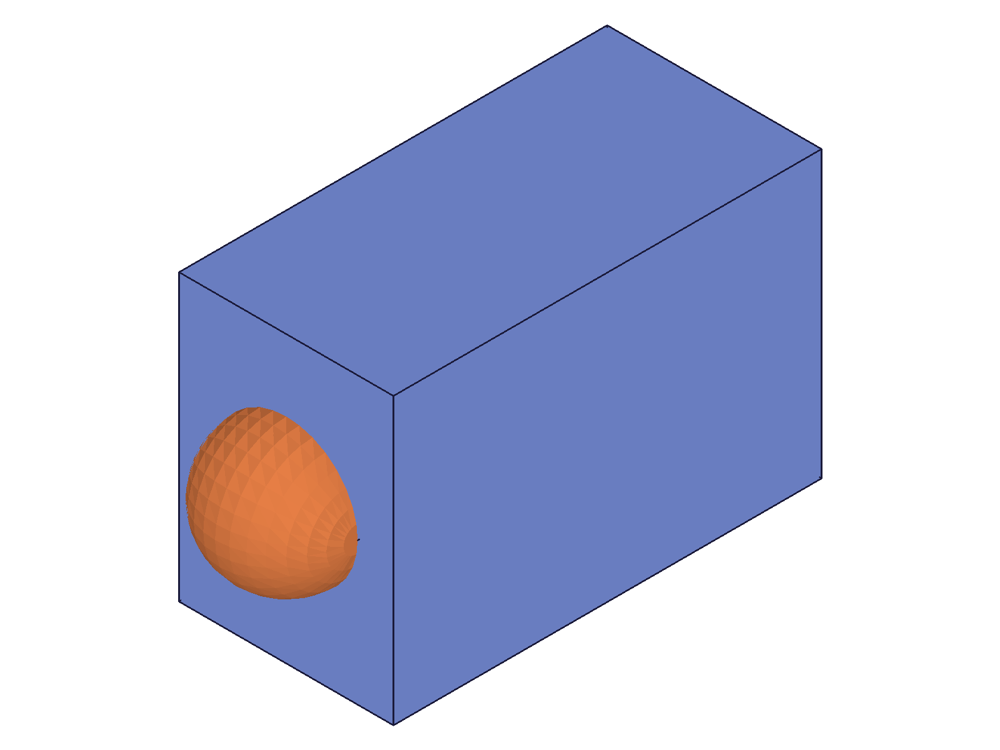
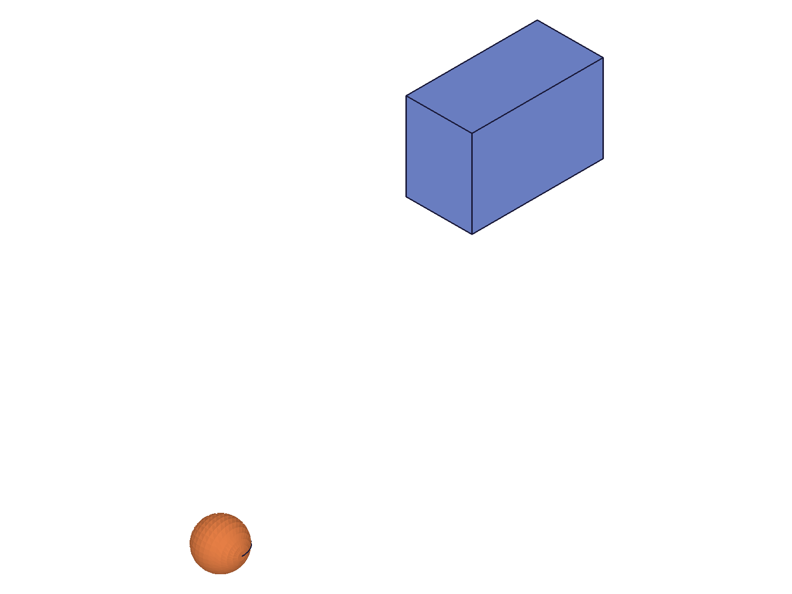
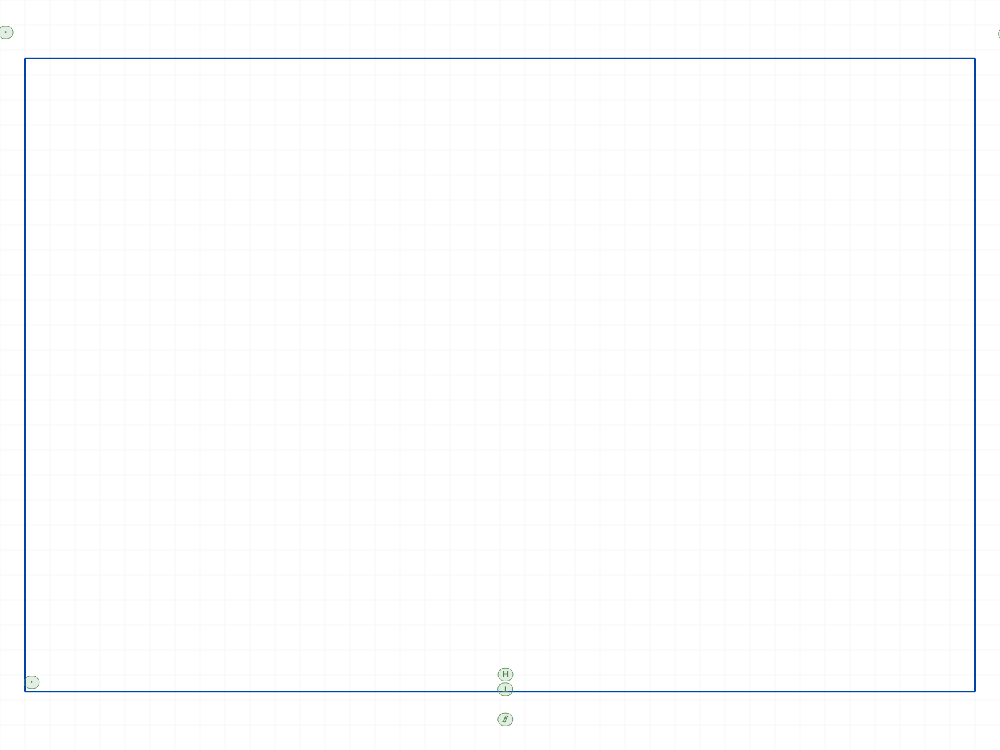
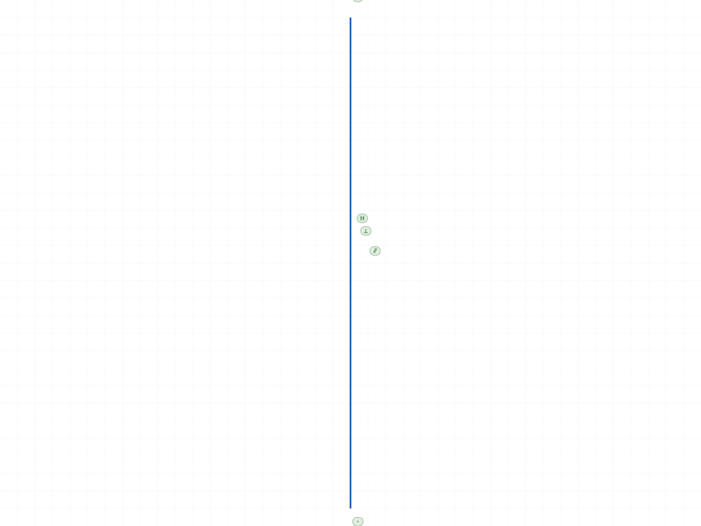
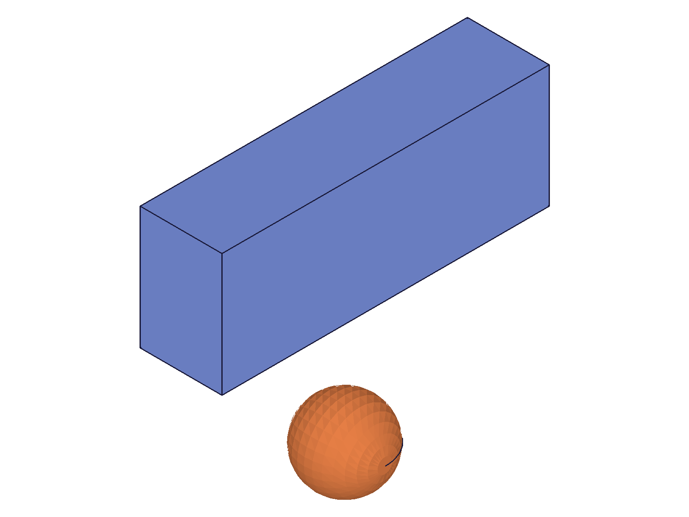
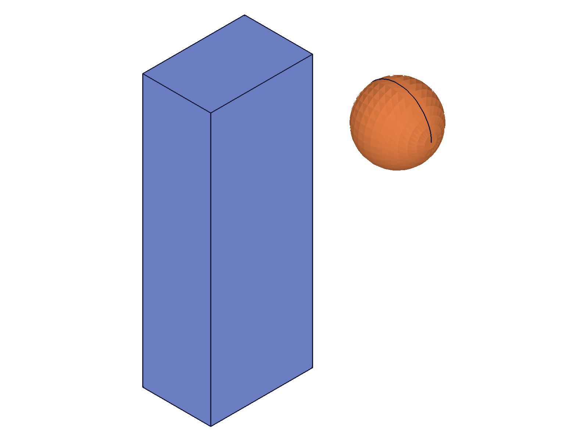
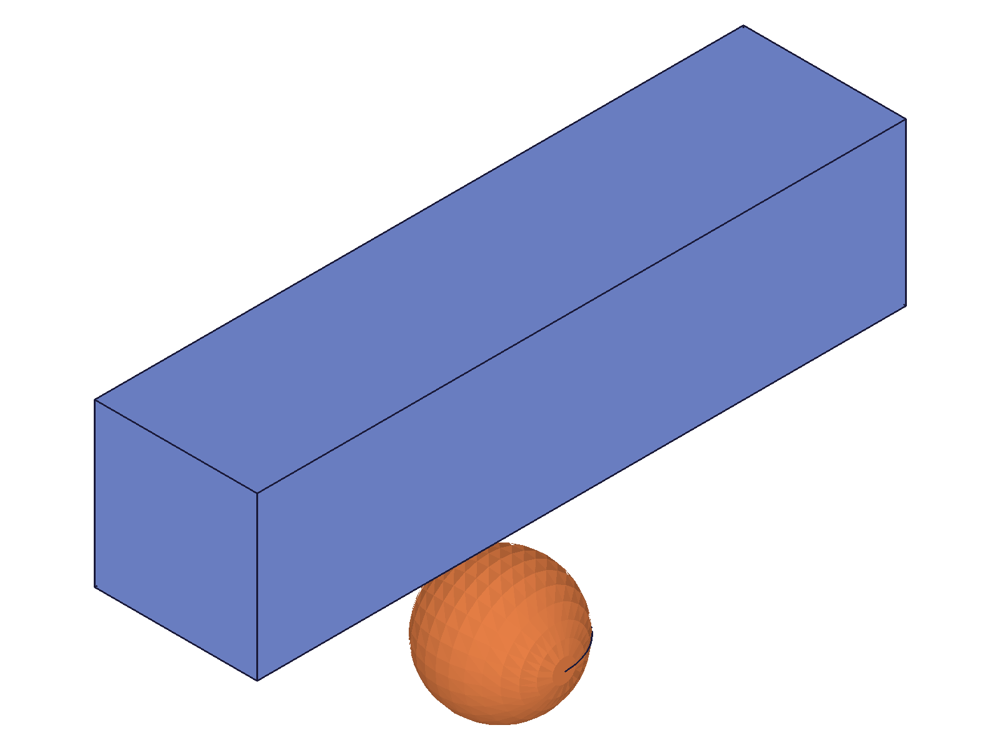
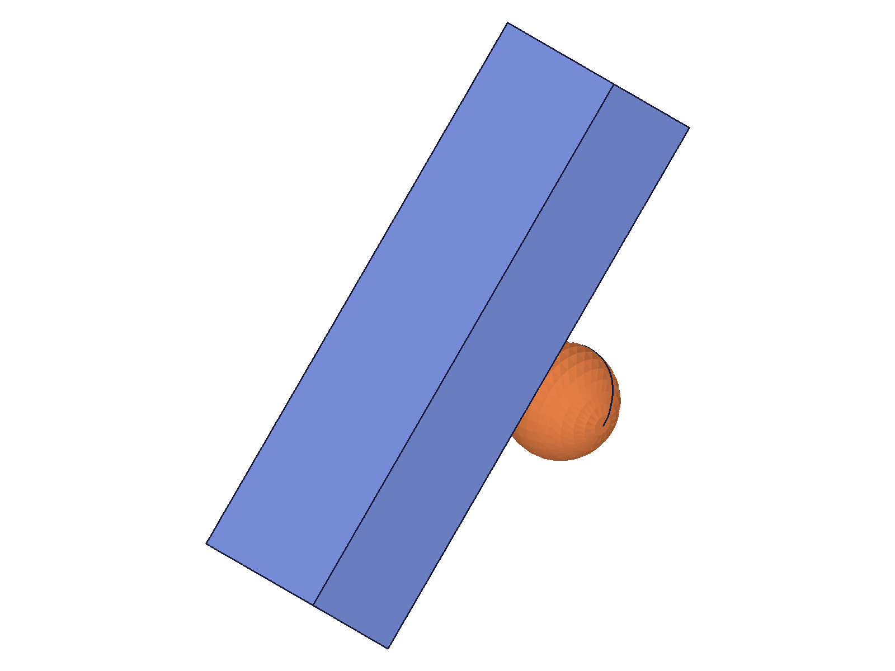

# Training: common.setObjectCoordSystem

**Date:** 2026-04-16

## Goal

Testing `v1.common.setObjectCoordSystem` — sets a new coordinate system (origin + x/y direction vectors) on an object.

**Methods to cover:**

- `setObjectCoordSystem` — params: id, origin, xVec, yVec
- Effect on different object types: parts, sketches, entity injections, solids, work geometry, features, curve shapes
- Interaction with existing geometry (does it move geometry or just set metadata?)
- Edge cases: non-orthogonal vectors, zero vectors, parallel vectors, unnormalized vectors, invalid IDs, cumulative vs absolute

## 01 — setObjectCoordSystem on part (identity axes, shifted origin)

Script: `scripts/01-basic-on-part.mjs` — ✅ call succeeds, result=null, maxLevel=31 (info).

|  |  |
| --------------------------------------------------- | ----------------------------------------------------- |

**Data:** Response: `{ result: null, messages: [], maxLevel: 31 }`. PNGs are byte-identical (35549 bytes each).

**Learned:** Setting origin [50,50,0] on the part with identity axes produces no visible change because the renderer auto-scales — all geometry moved together, so relative positions unchanged.

## 02 — setObjectCoordSystem on entity injection (identity axes, shifted origin)

Script: `scripts/02-on-eif.mjs` — ✅ call succeeds, result=null, maxLevel=31.

|  |  |
| -------------------------------------------- | ---------------------------------------------- |

**Data:** PNGs byte-identical (35549 bytes each). Same auto-scaling effect as script 01.

**Learned:** Same behavior on EIF as on part — origin shift moves all contained geometry uniformly.

## 03 — setObjectCoordSystem on solid body (identity axes, shifted origin)

Script: `scripts/03-on-solid.mjs` — ✅ box moved, sphere stayed. Origin [100,100,0] on the box body only.

|  |  |
| ---------------------------------------------- | ------------------------------------------------- |

**Data:** Before PNG=47909 bytes, after=22988 bytes — dramatically different. Response: `{ result: null, maxLevel: 31 }`. The box moved to upper-right while the sphere (untouched) stayed at its original position.

**Learned:** `setObjectCoordSystem` physically repositions the target object. When applied to a single solid body, only that body moves. The reference sphere proves the translation is real, not a rendering artifact.

**📌 LLM doc:** Core behavior — sets origin+orientation of the target object, physically repositioning geometry. Affects only the targeted object, not siblings.

## 04 — setObjectCoordSystem on sketch (rotated axes + shifted origin)

Script: `scripts/04-on-sketch.mjs` — ✅ sketch reoriented. Applied `origin: [0,150,0], xVec: [0,1,0], yVec: [0,0,1]` on the sketch.

|  |  |
| ------------------------------------------------------- | ------------------------------------------------------------ |

**Data:** `sketch.getPositions` returned null both before and after (API needs different params — not a useful probe). PNGs differ visually: before shows a wide rectangle, after shows what looks like a single vertical line — the rectangle was reoriented to the YZ plane and we're seeing it edge-on.

**Learned:** Works on sketches. Reorienting the sketch's coordinate system physically moves the sketch plane in 3D. The sketch renderer draws the 2D projection.

**📌 LLM doc:** Works on sketches — changes the sketch plane orientation in 3D space.

## 05 — setObjectCoordSystem on EIF with rotated axes

Script: `scripts/05-rotation-axes.mjs` — ✅ geometry rotated. Applied `xVec: [0,1,0], yVec: [-1,0,0]` on the EIF (90° rotation in XY plane).

|  |  |
| --------------------------------------------------- | -------------------------------------------------------- |

**Data:** PNGs differ visually. Before: long horizontal box (80×30×20) with sphere below. After: tall vertical box with sphere to the right. Both box and sphere rotated together (they're in the same EIF).

**Learned:** When applied to a container (EIF), ALL child objects rotate with the new coord system. The axes define the new orientation — xVec becomes the local X direction, yVec becomes the local Y direction.

**📌 LLM doc:** Container-level application affects all children. Axes define the new local frame.

## 06 — EIF origin shift verified with STEP data

Script: `scripts/06-eif-origin-with-data.mjs` — ✅ STEP files differ after origin shift on EIF.

**Data:** STEP before=13048 bytes, after=13120 bytes. `step0.content !== step1.content` → true. The geometry positions in the exported STEP changed, confirming the origin shift is a real geometric transformation, not just metadata.

**Learned:** The origin shift in scripts 01/02 was real — it just wasn't visible due to auto-scaling. STEP export proves the geometry moved.

**📌 LLM doc:** Origin shift is a real transformation even when single-body auto-scaling hides the visual change.

## 07 — non-orthogonal vectors (xVec=[1,0,0], yVec=[1,1,0])

Script: `scripts/07-non-orthogonal.mjs` — ✅ accepted without error, maxLevel=31. Snapshots identical (auto-scaling, single body).

**Data:** The server did not error on non-orthogonal vectors. Visual inspection inconclusive due to auto-scaling. See script 15 and 18 for data-verified follow-up.

## 08 — zero-length vectors

Script: `scripts/08-zero-vectors.mjs` — ❌ ERROR level 51 for all three cases.

**Data:** All three variants (zero xVec, zero yVec, both zero) return maxLevel=51 with message: `"Vectors for SetCoordSystem may not have length 0"`. Function: `OBJ_SetCoordSystem` at `GenericObject.cpp:300`.

**Learned:** Zero-length vectors are rejected with a clear error. Both vectors must have non-zero length.

**📌 LLM doc:** Error: zero-length vectors. Both xVec and yVec must be non-zero.

## 09 — setObjectCoordSystem on work geometry

Script: `scripts/09-on-work-geometry.mjs` — ✅ all three types succeed (work plane, work axis, work point). All returned maxLevel=31, no errors.

**Data:** `wp-response.json`, `wa-response.json`, `wpt-response.json` all show `{ result: null, messages: [], maxLevel: 31 }`.

**Learned:** Works on all work geometry types. No type restriction.

## 10 — setObjectCoordSystem on part feature (part.box)

Script: `scripts/10-on-part-feature.mjs` — ✅ succeeds. maxLevel=31. Snapshots identical (single body, auto-scaling).

**Data:** Response: `{ result: null, messages: [], maxLevel: 31 }`. Before/after PNGs visually identical (same auto-scaling issue as scripts 01-02).

**Learned:** Works on parametric features (part.box), not just direct geometry.

## 11 — parallel vectors

Script: `scripts/11-parallel-vectors.mjs` — ❌ ERROR level 51 for both variants.

**Data:** Same-direction (xVec=[1,0,0], yVec=[1,0,0]) and opposite-direction (xVec=[1,0,0], yVec=[-1,0,0]) both return maxLevel=51 with message: `"Vectors for SetCoordSystem may not be parallel"`. Function: `OBJ_SetCoordSystem` at `GenericObject.cpp:302`.

**Learned:** Parallel vectors are rejected. xVec and yVec must not be collinear — they need to span a 2D plane.

**📌 LLM doc:** Error: parallel vectors. xVec and yVec must not be collinear.

## 12 — unnormalized vectors

Script: `scripts/12-unnormalized-vectors.mjs` — ✅ accepted. STEP files identical before/after.

**Data:** xVec=[100,0,0], yVec=[0,100,0] → maxLevel=31, STEP before==after (20160 bytes). Large-magnitude vectors equivalent to identity ([1,0,0],[0,1,0]). No scaling applied.

**Learned:** Vectors are normalized internally — magnitude doesn't matter, only direction. [100,0,0] ≡ [1,0,0].

**📌 LLM doc:** Vectors are auto-normalized. Only direction matters, not magnitude.

## 13 — cumulative vs absolute

Script: `scripts/13-cumulative-or-absolute.mjs` — ✅ **ABSOLUTE**, not cumulative.

**Data:** step0→step1: differ (initial→[50,0,0]). step1→step2: identical (applying [50,0,0] again → no change). step0=13036, step1=12996, step2=12996 bytes.

**Learned:** `setObjectCoordSystem` is an absolute operation. It sets the coord system to the specified values. Calling it twice with the same values is idempotent. It does NOT accumulate transformations.

**📌 LLM doc:** Absolute, not cumulative. Idempotent — applying the same coord system twice has no additional effect.

## 14 — setObjectCoordSystem on curve shape

Script: `scripts/14-on-curve-shape.mjs` — ✅ succeeds, maxLevel=31. Snapshots visually identical (auto-scaling, single shape rotated to same proportions).

**Data:** Response: `{ result: null, maxLevel: 31 }`.

**Learned:** Works on curve shapes (curve.shape containers).

## 15 — non-orthogonal verification with STEP data (xVec=[1,0,0])

Script: `scripts/15-non-orthogonal-with-data.mjs` — STEP files identical. Non-orthogonal yVec=[1,1,0] with xVec=[1,0,0] produced no change.

**Data:** step0==step1==step2 (all 13040 bytes). The orthogonalization of yVec=[1,1,0] against xVec=[1,0,0] yields the Y-component [0,1,0], which is identity. So the "rotation" was effectively zero.

**Learned:** Orthogonalization hypothesis confirmed for this case — the server orthogonalizes yVec relative to xVec. When xVec is [1,0,0], the perpendicular component of yVec=[1,1,0] is [0,1,0] (identity Y). See script 18 for a more revealing test.

## 16 — invalid IDs

Script: `scripts/16-invalid-id.mjs` — ❌ ERROR level 51 for both cases.

**Data:** ID 99999: maxLevel=51, two messages — WARNING "ToId()/TOID() didn't get an existing or valid id" + ERROR code 1006 "An element of parameter 'id' has an invalid id!". ID 0: maxLevel=51, one ERROR code 1006.

**Learned:** Standard ClassCAD invalid-ID error. Error code 1006.

## 17 — sketch with STEP verification

Script: `scripts/17-sketch-with-getgeometry.mjs` — ✅ call succeeds, but STEP files identical.

**Data:** STEP before==after (2400 bytes). The sketch's coord system change is not reflected in STEP export — STEP represents B-rep geometry, not sketch metadata.

**Learned:** STEP export does not capture sketch coordinate system changes. The change is still real (confirmed visually in script 04).

## 18 — non-orthogonal vectors with revealing rotation (xVec=[1,1,0])

Script: `scripts/18-non-orthogonal-revealing.mjs` — ✅ geometry rotated ~45°. STEP files differ.

|  |  |
| ------------------------------------------------------------- | ----------------------------------------------------------- |

**Data:** STEP before=20076, after=23164 bytes. Both box and sphere rotated together (~45° in XY plane). xVec=[1,1,0] defines the new X direction, yVec=[0,1,0] was orthogonalized to be perpendicular to [1,1,0].

**Learned:** Server orthogonalizes yVec against xVec (likely Gram-Schmidt). The rotation is defined primarily by xVec direction. Non-orthogonal yVec is accepted and silently corrected. The Z axis is derived as xVec × yVec_orthogonalized.

**📌 LLM doc:** Non-orthogonal yVec is silently orthogonalized against xVec. The primary rotation is defined by the xVec direction.

## Summary of findings

| Object type | Works? | Notes |
|---|---|---|
| Part | ✅ | Moves all contained geometry |
| Entity injection | ✅ | Moves/rotates all contained solids/shapes |
| Solid body | ✅ | Moves only that body, not siblings |
| Sketch | ✅ | Reorients the sketch plane |
| Work plane | ✅ | Repositions |
| Work axis | ✅ | Repositions |
| Work point | ✅ | Repositions |
| Part feature (part.box) | ✅ | Repositions |
| Curve shape | ✅ | Reorients |

| Edge case | Result |
|---|---|
| Zero vectors | ERROR: "may not have length 0" |
| Parallel vectors | ERROR: "may not be parallel" |
| Non-orthogonal vectors | Accepted, yVec orthogonalized against xVec |
| Unnormalized vectors | Accepted, auto-normalized |
| Invalid ID | ERROR code 1006 |
| Double application | Idempotent (absolute, not cumulative) |
