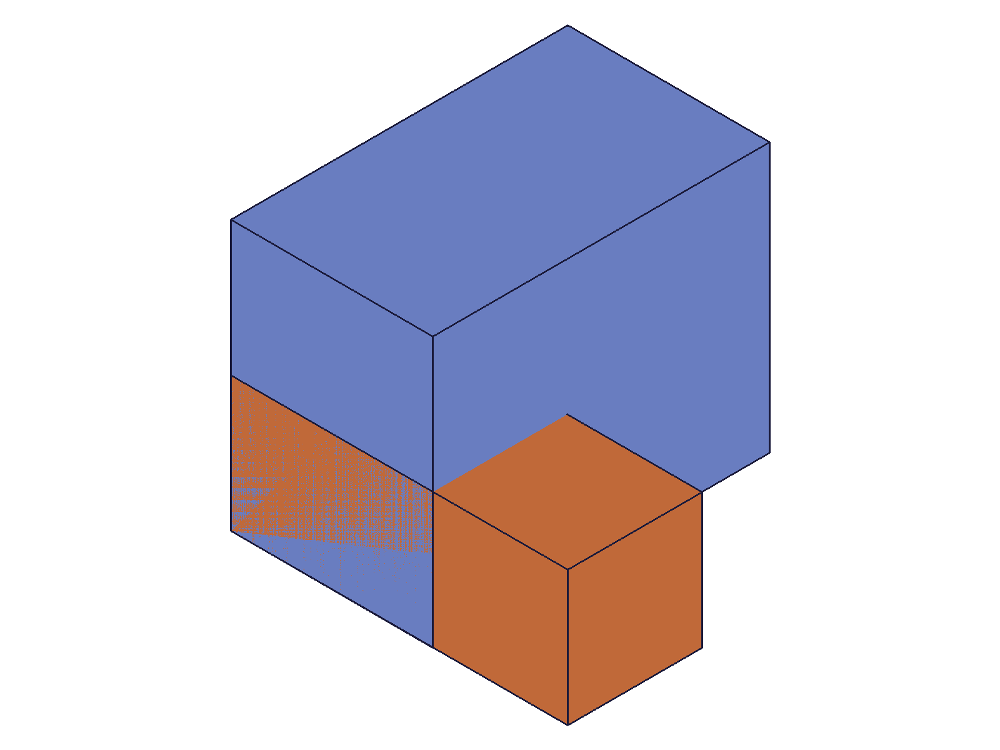
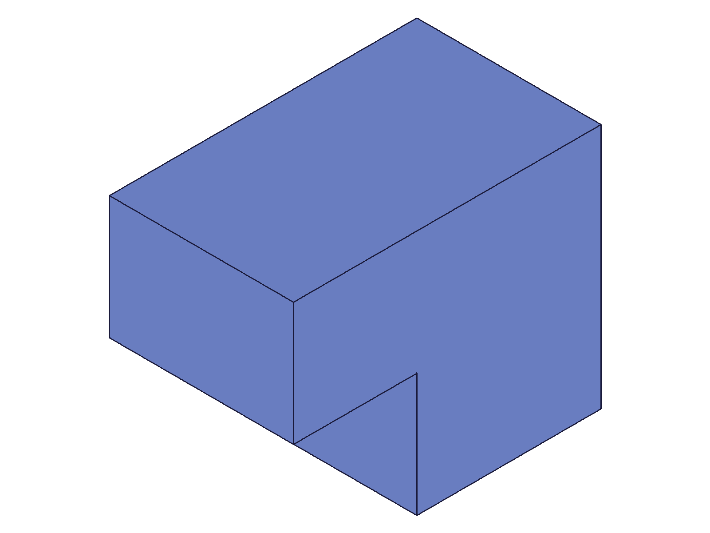
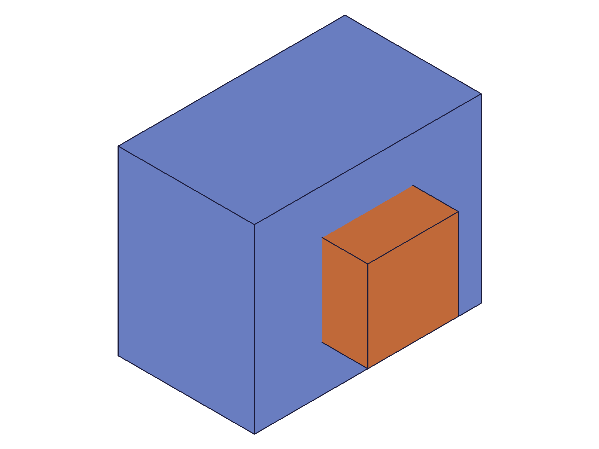
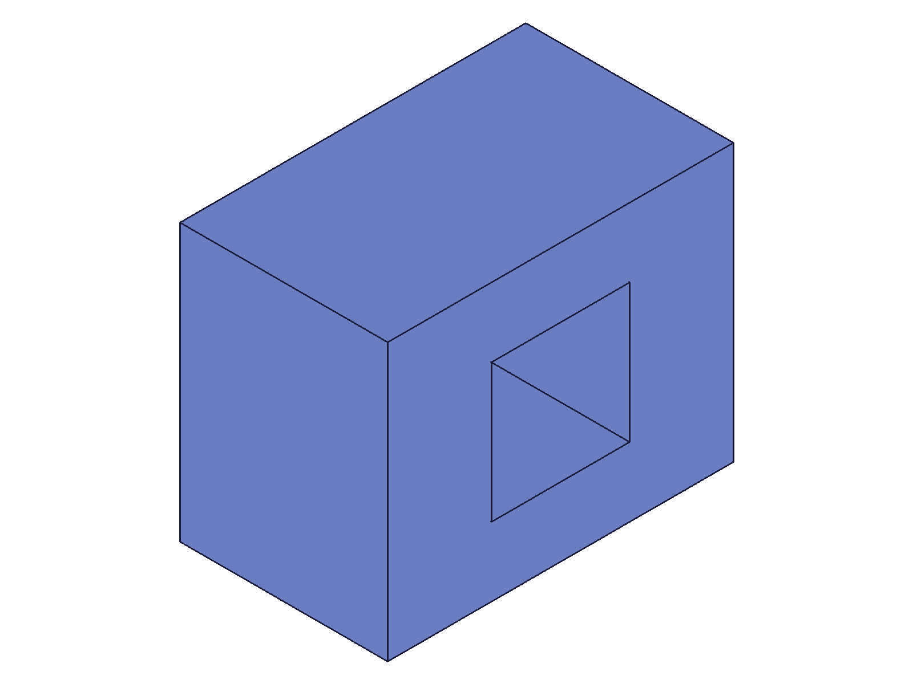
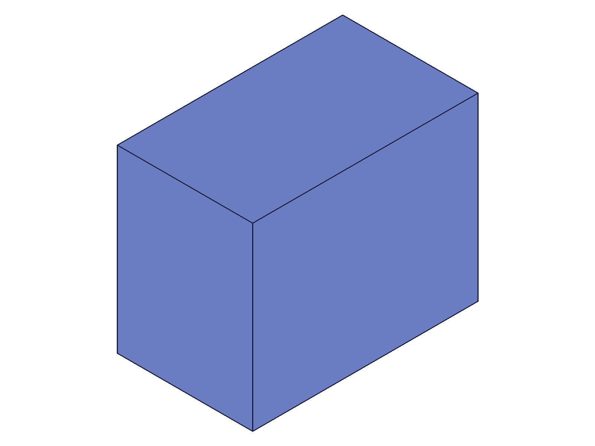
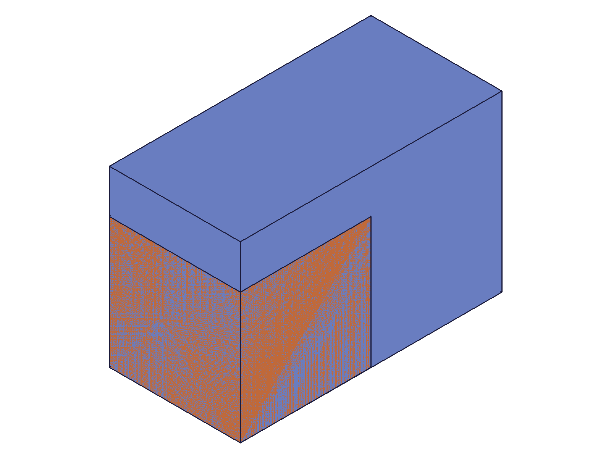
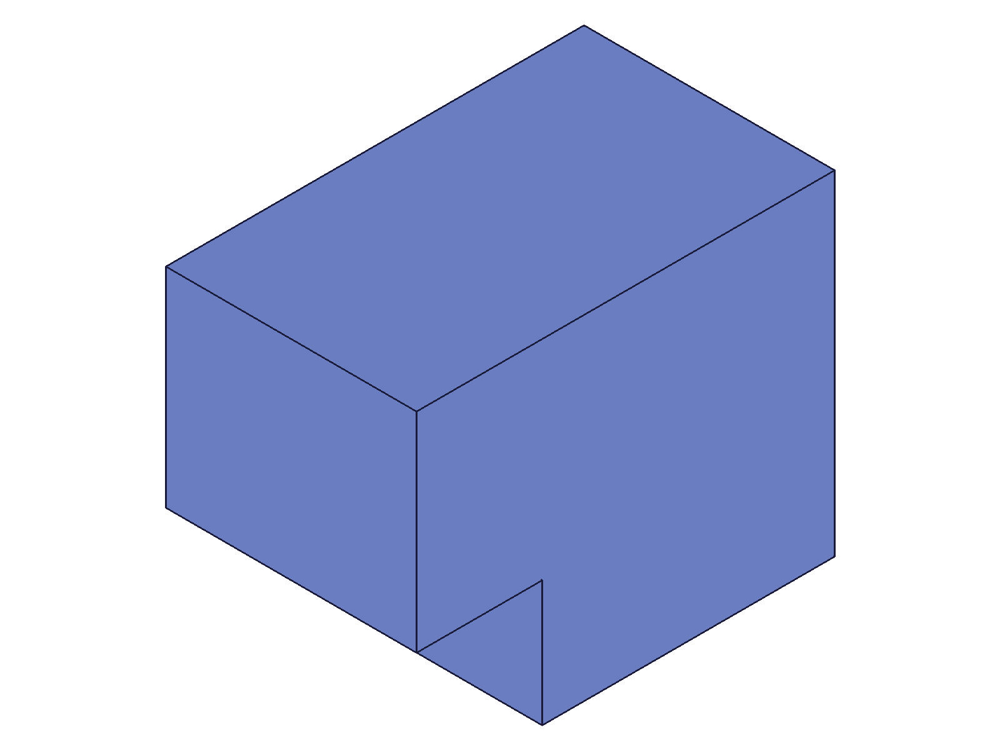
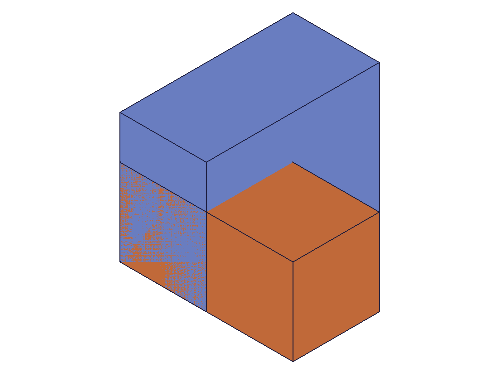
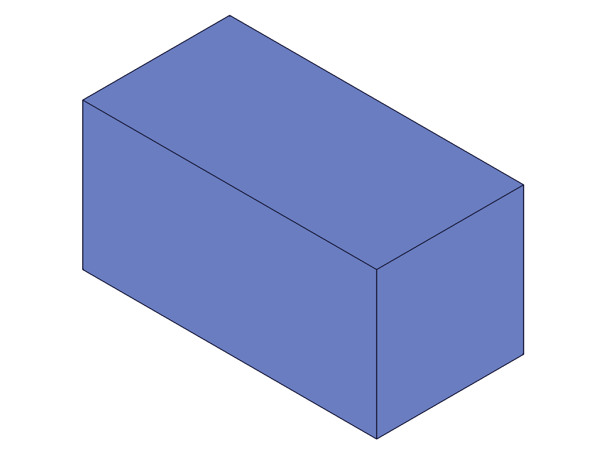
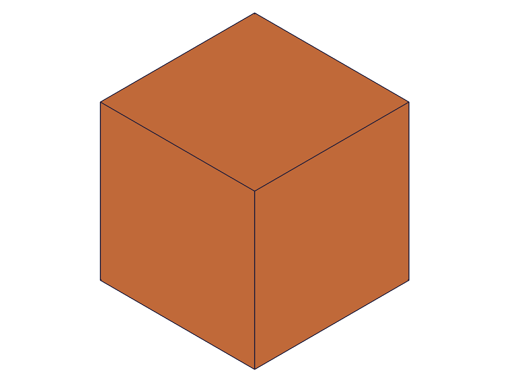

# Training: `part.box` (feature) vs `solid.box` (direct) — when to use which

**Date:** 2026-04-17

## Goal

Comparing the two box-creation paradigms to understand their structural differences, capabilities, and when an agent should choose one over the other.

**Questions to answer:**

- How do the structure trees differ between `part.box` and `solid.box`?
- Can `solid.box` geometry be updated after creation? (part.box has `updateBox`)
- Does `solid.box` support expression-driven dimensions?
- Can both paradigms coexist in the same part?
- How do boolean operations differ between feature-based and direct solids?
- What APIs work on feature IDs vs solid IDs? (e.g., `setAppearance`, `calculateMassProperties`, `getGeometryIds`)
- What are the delete/removal differences?
- Can you reference a `solid.box` result from `part.boolean`? Can you reference a `part.box` result from `solid.union`?
- Performance or structural implications of choosing one over the other?

---

## 01 — structure comparison

Script: `scripts/01-structure-comparison.mjs` — ✅ Both paradigms coexist in the same part.

`part.box` returned feature ID 54 (numeric). `solid.box` returned solid ID 127 (numeric). Both IDs are numeric but represent different object types in the system.

|  |  |
|---|---|

**Data:** Structure trees dumped to `files/01-structure-comparison-structure-after-feat-box.json` (21KB) and `files/01-structure-comparison-structure-after-both.json` (23KB). Feature box creates a feature tree node under the part. EIF + solid box creates an entity injection feature with a solid child inside it.

**Learned:** Both paradigms coexist cleanly — a part can contain feature boxes AND entity injection features with direct solids simultaneously.

---

## 02 — update capability

Script: `scripts/02-update-capability.mjs` — ✅ Feature box updated; solid.translation failed due to wrong param name (`targets` → `target`).

`updateBox` succeeded: result=54, maxLevel=31. `solid.translation` failed: "parameter 'target' must be provided" (code 1004) — I used `targets` (plural) instead of `target` (singular).

|  |  |
|---|---|

**Data:** `files/02-update-capability-update-feat-result.json` confirms success (maxLevel 31). `files/02-update-capability-solid-translate-result.json` shows error.

**Learned:** `solid.translation` uses singular `target`, not plural `targets`. Fixed in script 11.

---

## 03 — expression support

Script: `scripts/03-expression-support.mjs` — ✅ Feature box accepts expressions; solid.box rejects them.

`part.box` with `'@expr.H'` succeeded (boxId=56). `solid.box` with `'@expr.L'` failed: "parameter 'length' has the wrong type! It should be of type (real)" (code 1001). Same error for inline math `'3*25'`.

|  |  |
|---|---|

**Data:** `files/03-expression-support-solid-expr-result.json` — code 1001, wrong type. `solid.box` dims are strictly `real` — no strings of any kind.

Note: Expression update appeared to not take effect (H still 40 after `updateExpression`), but this was a scripting error — I used the wrong `updateExpression` API form (direct `name`/`value` instead of `toUpdate` array). Already documented in `references/part/updateExpression.md`.

**📌 LLM doc:** `solid.box` strictly requires numeric `real` params — no expression strings, no inline math.

---

## 04 — feature boolean

Script: `scripts/04-cross-paradigm-boolean.mjs` — ✅ `part.boolean` works between two feature boxes.

Two feature boxes (100×80×60 and 40×40×100), subtraction produced boolean feature ID 184, maxLevel 31.

|  |  |
|---|---|

**Data:** `files/04-cross-paradigm-boolean-part-boolean-result.json` — result=184, success.

---

## 05 — solid boolean in EIF

Script: `scripts/05-solid-boolean-in-eif.mjs` — ✅ `solid.subtraction` works between two direct solids.

Two solid boxes in same EIF (100×80×60 and 40×40×100), subtraction returned modified target ID 61, maxLevel 31.

|  |  |
|---|---|

**Data:** `files/05-solid-boolean-in-eif-solid-subtraction-result.json` — result=61 (target ID), success.

---

## 06 — cross-paradigm boolean (fails)

Script: `scripts/06-cross-paradigm-mix.mjs` — ❌ Cross-paradigm booleans are rejected.

`part.boolean` with feat box as target and solid box as tool: **"parameter 'tools' has a wrong id type! Provide only following id types: ['feature']"** (code 1001).

`solid.subtraction` with solid box as target and feat box as tool: also failed (code 1001).

**Data:** `files/06-cross-paradigm-mix-cross-bool-result.json` — tools must be feature type. `files/06-cross-paradigm-mix-reverse-cross-bool-result.json` — reverse also fails.

|  |
|---|

**Learned:** The two paradigms are **strictly isolated for boolean operations**. Feature booleans (`part.boolean`) only accept feature IDs. Solid booleans (`solid.subtraction`, etc.) only accept solid IDs. You cannot mix them.

**📌 LLM doc:** Critical finding — feature and solid boolean systems are completely separate.

---

## 07 — delete behavior (initial attempt)

Script: `scripts/07-delete-behavior.mjs` — Partial. `deleteFeature` requires `ids` array (not `id`). `deleteSolid` works correctly.

**Data:** `files/07-delete-behavior-delete-feat-result.json` — "parameter 'ids' must be provided" (used wrong param name). `files/07-delete-behavior-wrong-delete-result.json` — `deleteSolid` on feat box ID fails ("wrong id type! Provide only: ['entityinjection']"). `files/07-delete-behavior-wrong-delete2-result.json` — `deleteFeature` on solid box ID fails ("parameter 'ids' must be provided").

|  |  |
|---|---|

---

## 08 — API compatibility

Script: `scripts/08-api-compatibility.mjs` — Mixed results. Tests which APIs accept feature vs solid IDs.

| API | Feature ID | Solid ID | Notes |
|---|---|---|---|
| `setAppearance` | ❌ (needs `target` param, not `id`) | ❌ (same) | Wrong param name in my script |
| `calculateMassProperties` | ❌ code 1001 | ✅ volume=125000 | Accepts: part/assembly, instance, solid |
| `setObjectName` | ✅ maxLevel=31 | ✅ maxLevel=31 | Both work |
| `getGeometryIds` | ❌ code 1001 | ❌ code 1001 | Requires part ID only |

**Data:** `files/08-api-compatibility-mass-solid-result.json` — volume 125000 (50³), cog at [120,0,0]. `files/08-api-compatibility-mass-feat-result.json` — "wrong id type! Provide only: ['part/assembly', 'instance', 'solid']". Feature IDs are NOT solid IDs in the type system.

**Learned:** Feature IDs and solid IDs are distinct types. `calculateMassProperties` accepts solid IDs but not feature IDs — even though both represent 3D geometry.

**📌 LLM doc:** Feature IDs are type "feature", solid IDs are type "solid". Different APIs accept different types.

---

## 09 — positioning comparison

Script: `scripts/09-positioning-comparison.mjs` — ✅ Cross-paradigm params silently ignored.

`part.box` with `translation: [100, 0, 0]` succeeded (maxLevel 31) but the translation was silently ignored — box at origin. `solid.box` with `references: [wcsId]` also succeeded (maxLevel 31) but references was silently ignored — box at origin.

|  |  |
|---|---|

**Data:** Both `files/09-positioning-comparison-feat-with-translation.json` and `files/09-positioning-comparison-solid-with-references.json` show result=ID, maxLevel=31 — no errors.

**Learned:** Unknown params are silently accepted and ignored. `part.box` only uses `references` for positioning. `solid.box` only uses `translation`/`rotation`/`rotateFirst`. No error for passing the wrong paradigm's params — a dangerous silent no-op.

**📌 LLM doc:** Silent param ignoring is a gotcha agents must know about.

---

## 10 — feature chain vs direct equivalent

Script: `scripts/10-feature-tree-depth.mjs` — ✅ Both approaches produce identical visible geometry.

Feature chain: box1 → box2 → part.boolean(SUBTRACTION). Direct: solidBox1 → solidBox2 → solid.subtraction. Structure trees dumped to verify tree differences.

|  |  |
|---|---|

**Data:** `files/10-feature-tree-depth-feature-chain-structure.json` (25KB) and `files/10-feature-tree-depth-direct-equiv-structure.json` (25KB). Visual result is identical. The feature tree differs in depth — feature approach preserves the history (box1, box2, boolean as separate features), while direct approach has flat solids inside an EIF.

**Learned:** Feature history vs flat geometry is the structural distinction. Same visual result either way.

---

## 11 — solid transform (fixed)

Script: `scripts/11-solid-transform-fix.mjs` — ✅ Post-creation transforms work for direct solids.

`solid.translation({ id: eifId, target: solidBoxId, translation: [0, 0, 50] })` — result=61, maxLevel=31. `solid.rotation({ id: eifId, target: solidBoxId, rotation: [0, 0, π/6] })` — result=61, maxLevel=31.

**Data:** `files/11-solid-transform-fix-solid-translation-result.json` and `files/11-solid-transform-fix-solid-rotation-result.json` — both success.

**Learned:** While `solid.box` has no `updateBox` equivalent, post-creation transforms (`solid.translation`, `solid.rotation`, `solid.scale`) provide the ability to modify existing solids. This is fundamentally different from `updateBox` which changes dimensions — transforms only move/rotate/scale, they can't change length/width/height independently.

---

## 12 — expression update verify (scripting error)

Script: `scripts/12-expr-update-verify.mjs` — Expression update used wrong API form (direct `name`/`value` instead of `toUpdate` array). Already documented gotcha.

`updateExpression` returned result=1, maxLevel=31 (silent no-op). `getExpression('H')` still shows value=40. This is the exact silent-failure behavior documented in `references/part/updateExpression.md`.

**Learned:** Not a new finding — confirms the existing LLM doc is accurate.

---

## 13 — delete behavior (fixed)

Script: `scripts/13-delete-fix.mjs` — ✅ Correct delete APIs work for both paradigms.

`part.deleteFeature({ ids: [box1] })` — result=null, maxLevel=31 (success). `solid.deleteSolid({ id: eifId, ids: [solid1] })` — result=null, maxLevel=31. `part.deleteFeature({ ids: [eifId] })` — also works (removes the EIF container + all solids inside).

|  |  |
|---|---|

**Learned:** `deleteFeature` with `ids` array removes feature tree nodes. `deleteSolid` removes individual solids from an EIF. You can also delete an EIF via `deleteFeature` which removes the entire container and its contents.

**📌 LLM doc:** Deletion paths differ — `deleteFeature` for features/EIFs, `deleteSolid` for individual solids.

---

## 14 — calculateMassProperties ID types

Script: `scripts/14-mass-properties-correct.mjs` — ✅ Confirmed which ID types work.

| ID type | Result | Volume |
|---|---|---|
| Part ID | ✅ | 317000 (all bodies combined) |
| Solid ID | ✅ | 125000 (individual solid) |
| Feature ID | ❌ | "wrong id type! Provide only: [part/assembly, instance, solid]" |
| EIF ID | ❌ | Same error |

**Data:** `files/14-mass-properties-correct-mass-part-id.json` — volume=316999.999... ≈ 317000 = 192000+125000. Includes ALL bodies (both feature and direct solid).

**Learned:** Part-level mass includes everything. Solid-level mass is per-solid. Feature IDs are not valid for mass calculation — you must use the part ID or find the underlying solid ID.

**📌 LLM doc:** `calculateMassProperties` accepts part/assembly/instance/solid IDs, NOT feature or EIF IDs.

---

## 15 — silently ignored params

Script: `scripts/15-ignored-params.mjs` — ✅ Cross-paradigm params are silently ignored.

Two `part.box` calls (one with `translation`, one without) — both produced boxes at the same position (single cube visible in snapshot). Two `solid.box` calls (one with `references`, one without) — both produced boxes at the same position.

|  |  |
|---|---|

**Data:** Both snapshots show single cubes (overlapping identical boxes). Confirms that unknown params are accepted without error but produce no effect.

---

## 16 — appearance and geometry APIs

Script: `scripts/16-appearance-correct.mjs` — Mixed.

`setAppearance` requires `target` param, not `id` — my usage was wrong for both paradigms. `getGeometryIds` with part ID returned empty object `{}` (success but no IDs?). `getGeometryPositions` with part ID failed.

**Data:** `files/16-appearance-correct-geo-ids-part.json` — result: `{}` (empty). Not enough investigation to draw conclusions about these APIs.

---

## Summary

| Dimension | `part.box` (feature) | `solid.box` (direct) |
|---|---|---|
| **Container** | Part (feature tree) | Entity injection in part |
| **ID type** | feature | solid |
| **`id` param** | Part ID | Entity injection ID |
| **Update API** | `updateBox` (via open/close) | None (use `solid.translation`/`rotation`/`scale` for transforms) |
| **Expression dims** | ✅ `@expr.NAME`, inline math | ❌ strictly `real` only |
| **Positioning** | `references: [wcsId]` | `translation`, `rotation`, `rotateFirst` |
| **Boolean system** | `part.boolean` (feature IDs only) | `solid.subtraction`/`union`/`intersection` (solid IDs only) |
| **Delete** | `part.deleteFeature({ ids })` | `solid.deleteSolid({ id: eifId, ids })` |
| **Mass properties** | Via part ID only (feature ID rejected) | Via solid ID or part ID |
| **setObjectName** | ✅ | ✅ |
| **Feature history** | Full parametric tree | Flat solids in EIF |
| **Cross-paradigm** | Cannot mix in booleans | Cannot mix in booleans |
| **Coexistence** | Can coexist in same part | Can coexist in same part |

### When to use which

**Use `part.box` (feature) when:**
- Building parametric models where dimensions should be expression-driven
- Need to update dimensions after creation (via `updateBox`)
- Want feature history for design intent (booleans, patterns, etc.)
- Positioning relative to work coordinate systems

**Use `solid.box` (direct) when:**
- Building geometry programmatically without parametric history
- Need direct solid manipulation (transforms, booleans via `solid.*`)
- Working with imported geometry or one-off constructions
- Need to measure individual solid properties (`calculateMassProperties` with solid ID)
