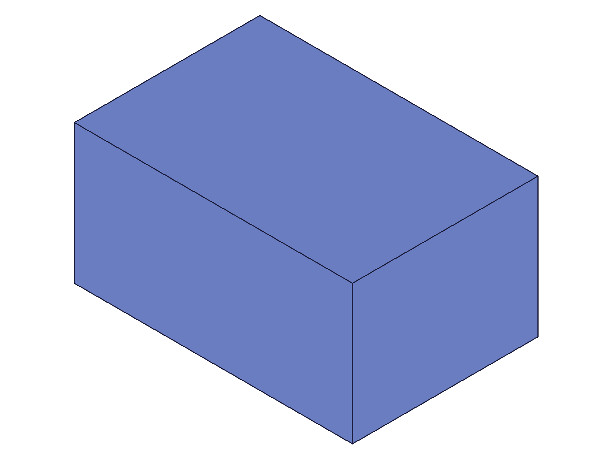
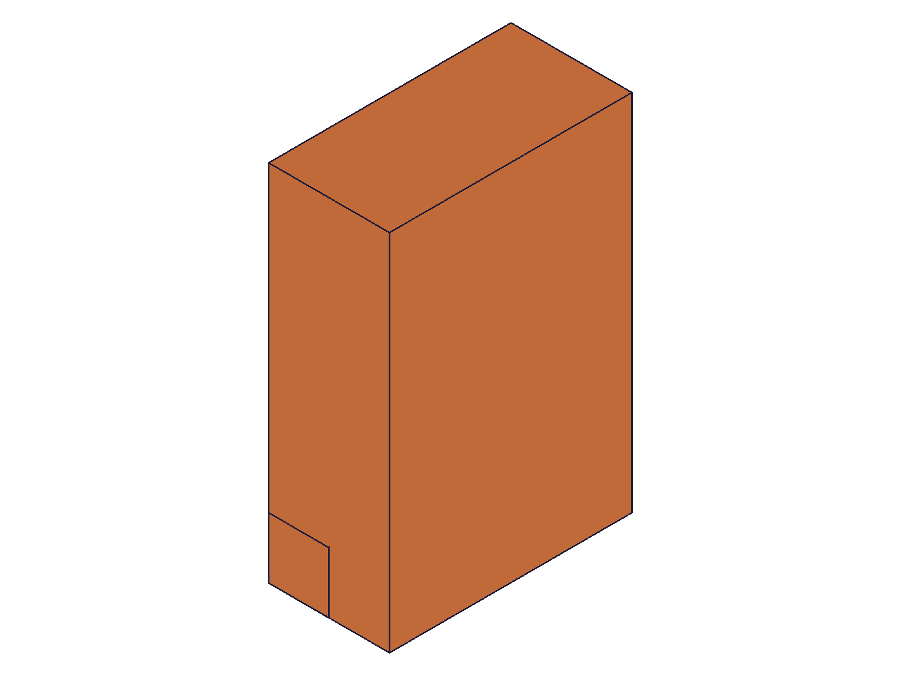
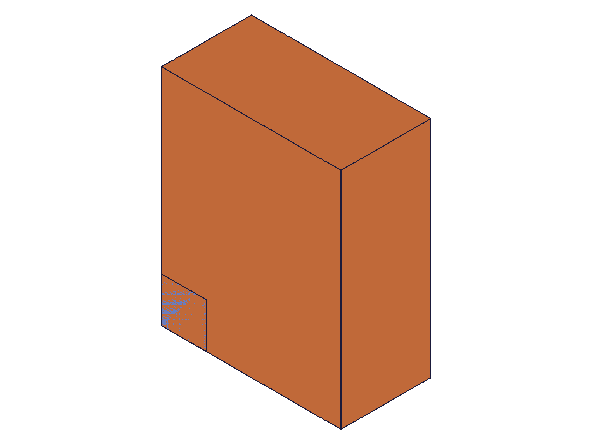
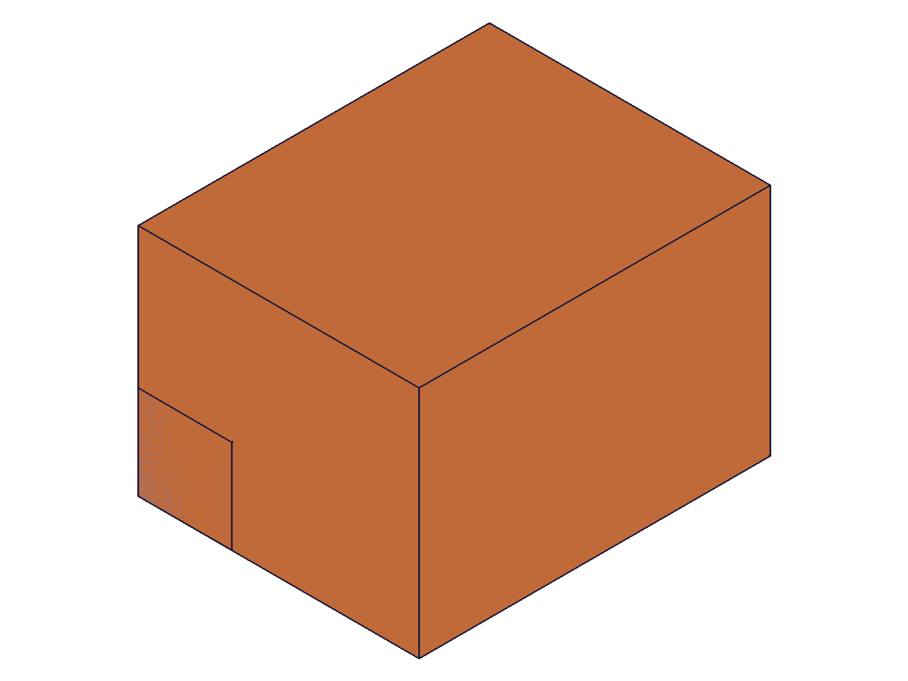
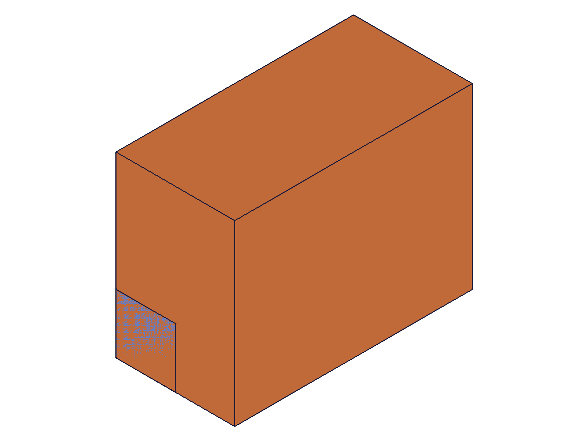
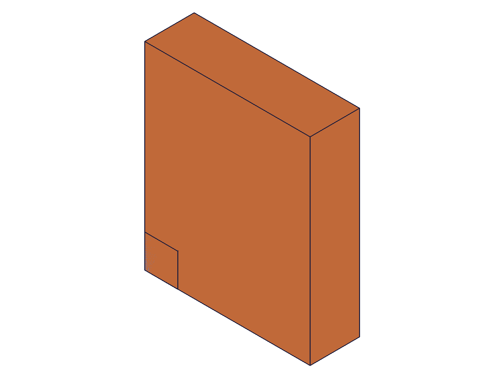
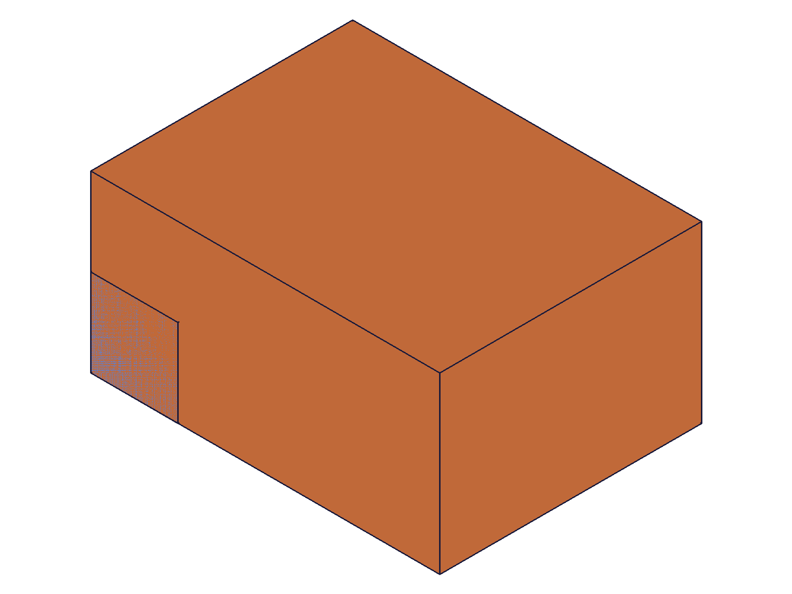
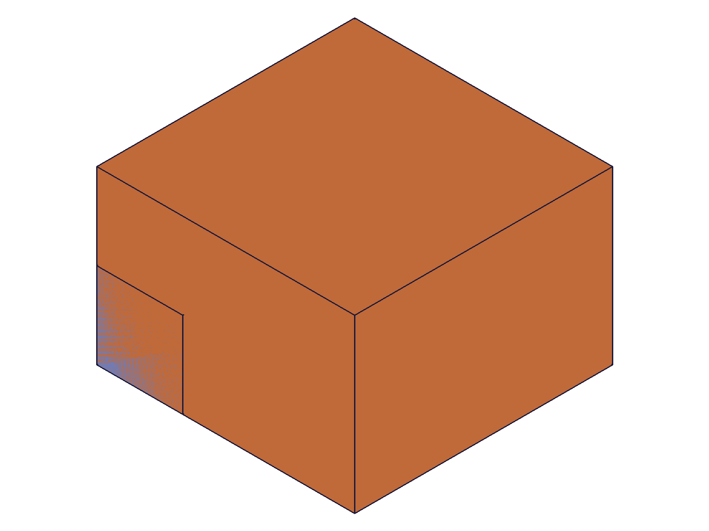
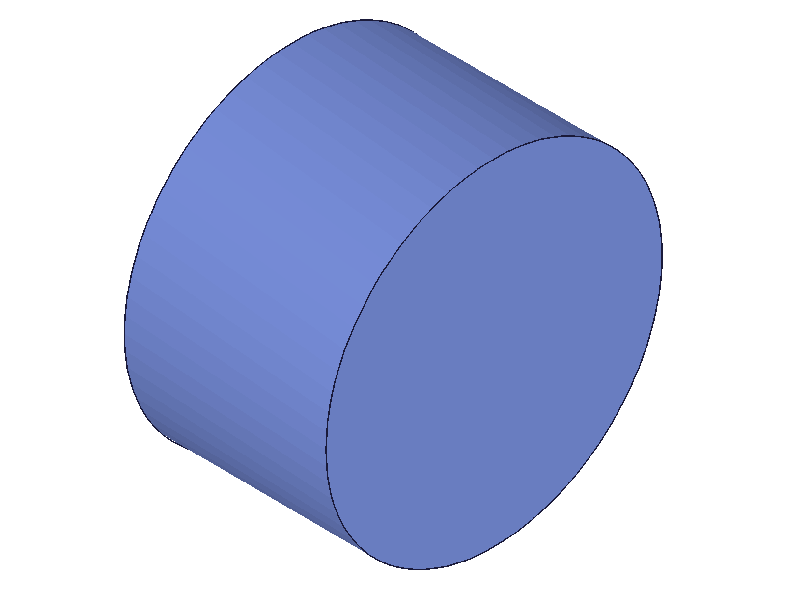
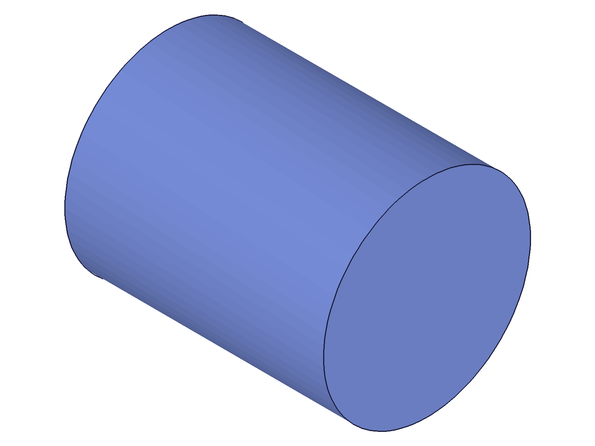

# Training: part.updateBox

**Date:** 2026-04-17

## Goal

Testing `v1.part.updateBox` — the parametric update API for box features.

**Methods to cover:**

- `updateBox` — update each dimension param: `length`, `width`, `height`
- `updateBox` — update `name`
- `updateBox` — update `references` (add/remove workCSys)
- `updateBox` — partial update (omit params, keep existing values)
- `updateBox` — multiple params in single call
- `updateBox` — expression strings in dimension params (`@expr.`, inline math)
- `updateBox` — edge cases: zero/negative dimensions, invalid IDs
- `updateBox` — verify open/close requirement (call without openFeature)
- `updateBox` — multiple sequential updates within single open/close
- `updateBox` — verify geometry actually changes (filewrite + snapshot)

**Questions:**

- Does updateBox return the feature ID or VOID?
- What happens if you pass a param that equals the current value (no-op update)?
- Can you update references to move the box to a different WCS?
- Can you remove references (set to []) to move box back to origin?
- What happens if you call updateBox on a non-box feature?
- Do expression-driven updates via `@expr.` work correctly in updateBox?

---

## 01 — basic dimension update

Script: `scripts/01-basic-dimension-update.mjs` — ✅ Height updated from 40 to 120. updateBox returns feature ID (54), not VOID. maxLevel 31.

|  |  |
|---|---|

**Data:** updateBox result=54, maxLevel=31, messages=[] (see `files/01-basic-dimension-update-update-response.json`). Shape clearly changed: before is a wide/short box (80x60x40), after is more proportional (80x60x120 — height tripled).

**Note:** `getExpression` with `name: 'height'` returned null for the box feature. Box feature params aren't directly queryable via getExpression by param name.

**Learned:** updateBox returns the feature ID on success (not VOID as the docs suggest with `id|VOID`).
**📌 LLM doc:** Return value is feature ID on success, null on failure.

## 02 — name update

Script: `scripts/02-update-name.mjs` — ✅ Name update succeeds. updateBox result=54, maxLevel=31.

**Data:** Response in `files/02-update-name-rename-response.json`. Script crashed on `getObjectName` (not a real API), but the update itself succeeded.

**Learned:** Name updates work via updateBox within open/close.

## 03 — partial update (width only)

Script: `scripts/03-partial-update.mjs` — ✅ Updating only `width: 120` worked. Other dims (length=80, height=40) preserved.

|  |  |
|---|---|

**Data:** result=91, maxLevel=31. Before shows 80x60x40 box with small 20x20x20 ref box. After shows the target box expanded in Y direction (width), confirmed by shape change relative to reference box.

**Learned:** Partial updates preserve existing values for omitted params. Confirmed.

## 04 — multi-param update

Script: `scripts/04-multi-param-update.mjs` — ✅ All three dimensions updated in single call (length=40, width=100, height=80).

|  |  |
|---|---|

**Data:** result=91, maxLevel=31. Shape change visible: before is horizontally elongated (80x60x40), after is more vertically oriented (40x100x80).

**Learned:** Multiple params in one updateBox call all apply. No issues.

## 05 — without openFeature

Script: `scripts/05-without-open.mjs` — ✅ Fails as expected. result=null, maxLevel=51.

**Data:** Two error messages (see `files/05-without-open-without-open-response.json`):
1. Code 1200: "The provided feature is not allowed to update. It's not active and open."
2. Code 1004: "\"id\" must be provided for update."

**Learned:** Without openFeature, updateBox returns null (not the feature ID) with two errors. The second error (1004) is misleading — the ID was provided, but the server rejects it because the feature isn't open.
**📌 LLM doc:** Without openFeature: returns null + errors 1200 and 1004. The 1004 "id must be provided" is misleading — the real issue is 1200.

## 06 — expression update (FAILED — test error)

Script: `scripts/06-expression-update.mjs` — ❌ Failed with "Could not convert api params" (code 1000).

**Data:** `files/06-expression-update-expr-update-response.json` shows error 1000. Root cause: used wrong `expression()` syntax (`{ id, name, value }` instead of `{ id, toCreate: [...] }`), so expressions were never created. The `@expr.H` reference pointed to nothing.

**Learned:** Test error, not an API limitation. See script 12 for corrected test.

## 07 — inline math update

Script: `scripts/07-inline-math-update.mjs` — ✅ Inline math works: `'3*25'`, `'sqrt(2500)'`, `'10+20+30'`.

|  |  |
|---|---|

**Data:** result=91, maxLevel=31.

**Learned:** Inline math expressions work in updateBox dimension params, same as in creation.

## 08 — references update (add/remove WCS)

Script: `scripts/08-references-update.mjs` — ✅ Both adding and removing references succeed.

|  |  |  |
|---|---|---|

**Data:** Add references: result=62, maxLevel=31. Remove references: result=62, maxLevel=31. Snapshots look identical due to auto-scaling with single body — position changes aren't visible. But API returned success for both operations.

**Learned:** `references: [wcsId]` moves box to WCS. `references: []` moves box back to drawing origin. Both work in updateBox.
**📌 LLM doc:** References can be added and removed via updateBox. `references: []` resets to drawing origin.

## 09 — sequential updates in single open/close

Script: `scripts/09-sequential-updates.mjs` — ✅ Three updateBox calls within one open/close all applied.

|  |  |
|---|---|

**Data:** All three returned result=91, maxLevel=31 (see `files/09-sequential-updates-sequential-responses.json`). Before: 80x60x40 box. After: 30x120x100 — shape dramatically changed, confirming all updates took effect. Ref box visible as tiny cube.

**Learned:** Multiple updateBox calls within a single open/close all apply correctly. Only one closeFeature needed at the end.
**📌 LLM doc:** Multiple sequential updates within single open/close work.

## 10 — zero and negative dimensions

Script: `scripts/10-zero-negative-dims.mjs` — ✅ Both fail with error 1122.

**Data:**
- `height: 0` → result=54, maxLevel=51, error 1122: "Value for height must be greater than 0" (see `files/10-zero-negative-dims-zero-height-response.json`)
- `width: -50` → result=54, maxLevel=51, two errors 1122 — both height and width flagged as invalid (see `files/10-zero-negative-dims-negative-width-response.json`). The height error from the zero test persisted.

**Learned:** Zero/negative dims return feature ID (not null) but with maxLevel 51 and error 1122. Same behavior as part.box creation. The feature continues to exist with its previous valid geometry.
**📌 LLM doc:** Zero/negative dims don't destroy the feature — error 1122 but feature keeps previous geometry.

## 11 — expression variants (FAILED — test error)

Script: `scripts/11-expr-variants.mjs` — ❌ All tests failed because expression creation used wrong syntax (same as script 06). boxId=null cascaded to all subsequent calls.

**Learned:** Test error. See script 12.

## 12 — expression corrected

Script: `scripts/12-expr-corrected.mjs` — ✅ `@expr.` works in both creation and updateBox.

|  |  |
|---|---|

**Data:**
- Expression creation (with `toCreate`): result=1, maxLevel=31 ✓
- Box creation with `@expr.L/W/H`: result=93, maxLevel=31 ✓
- updateBox with `height: '@expr.L'` (rebinding height to L=60): result=93, maxLevel=31 ✓
- updateBox with `height: 200` (numeric after expr): result=93, maxLevel=31 ✓

Shape changed: before was 60x40x80 (H=80 dominates), after expr update was 60x40x60 (H=L=60, more cubic).

**Learned:** `@expr.NAME` works in updateBox. You can switch from numeric to expression and back. The earlier failures (scripts 06/11) were test errors.
**📌 LLM doc:** @expr works in updateBox. Can switch between numeric and expression-driven dimensions.

## 13 — updateBox on wrong feature type

Script: `scripts/13-wrong-feature-type.mjs` — ⚠️ Unexpected: updateBox on a cylinder returned SUCCESS (result=54, maxLevel=31, no errors).

**Data:** `files/13-wrong-feature-type-wrong-type-response.json` — result=54, messages=[], maxLevel=31.

**Learned:** updateBox doesn't validate that the target is a box feature. Passes height through since cylinder also has a `height` param.

## 14 — name verification via structure + noop update

Script: `scripts/14-verify-name-structure.mjs` — ✅ Name change verified in structure tree. Noop update succeeds.

**Data:**
- Before rename: feature named `OrigBox`, body child named `OrigBox_0`
- After rename: feature renamed to `NewBoxName`, body child STILL named `OrigBox_0`
- Noop update (`height: 50` when height is already 50): result=54, maxLevel=31 — no error, no issues

**Learned:** Name update changes the feature tree node name but NOT the body child (which keeps the `_0` suffix of the original name). Noop updates are fine.
**📌 LLM doc:** Body child retains original name after rename. Noop updates are harmless.

## 15 — wrong feature type with full params + visual verification

Script: `scripts/15-wrong-type-verify.mjs` — ⚠️ updateBox on cylinder with all box params succeeds silently. Cylinder actually changed.

|  |  |
|---|---|

**Data:**
- `updateBox({ id: cylId, length: 100, width: 80, height: 200, name: 'BoxName?' })` → result=54, maxLevel=31
- `updateCylinder({ id: cylId, radius: 50 })` after updateBox → result=54, maxLevel=31

Before: squat cylinder (r=30, h=60). After updateBox: taller cylinder — the `height: 200` param applied to the cylinder. Box-specific params (`length`, `width`) were silently ignored. `updateCylinder` still works on the feature afterward.

**Learned:** `updateBox` on a non-box feature doesn't error. Shared parameter names (height, name, references) actually apply. Feature-type-specific params are silently ignored. The feature retains its original type (cylinder stays cylinder). This contradicts the openFeature.md doc claim about "Index ausserhalb des Arraybereichs" errors.
**📌 LLM doc:** updateBox on non-box features doesn't error — shared params (height, name) apply silently. Always use the matching update method.

---

## Coverage Checklist

- [x] updateBox called successfully
- [x] Every required parameter tested (id)
- [x] Key optional parameters exercised (length, width, height, name, references)
- [x] Partial update (omit params) verified
- [x] Multiple params in one call verified
- [x] Sequential updates within single open/close verified
- [x] Expression strings (@expr and inline math) verified
- [x] open/close requirement verified (error without open)
- [x] Edge cases: zero/negative dims, noop update, wrong feature type
- [x] References: add WCS and remove (reset to origin)
- [x] Behavioral claims verified with data AND visual evidence
