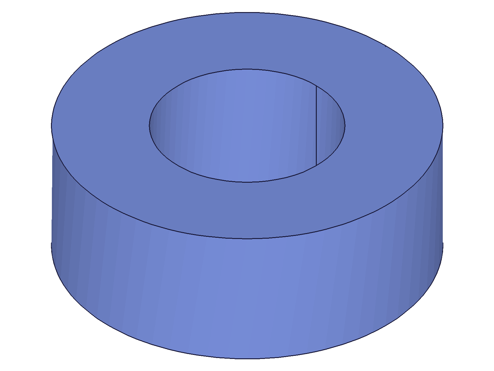
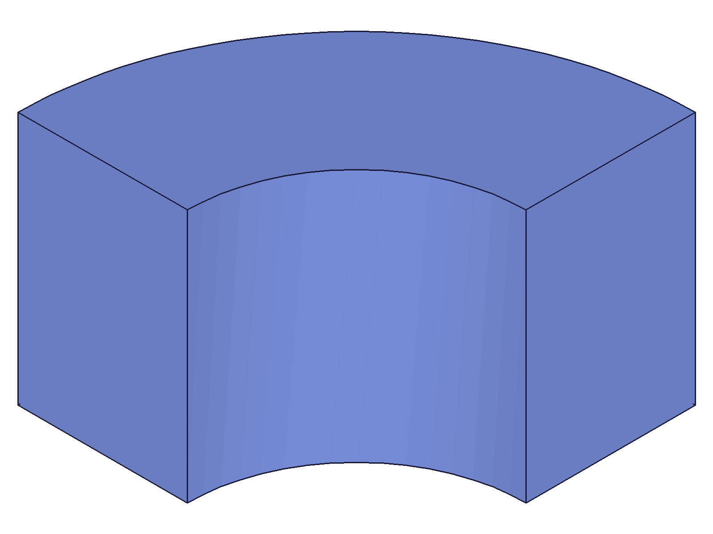
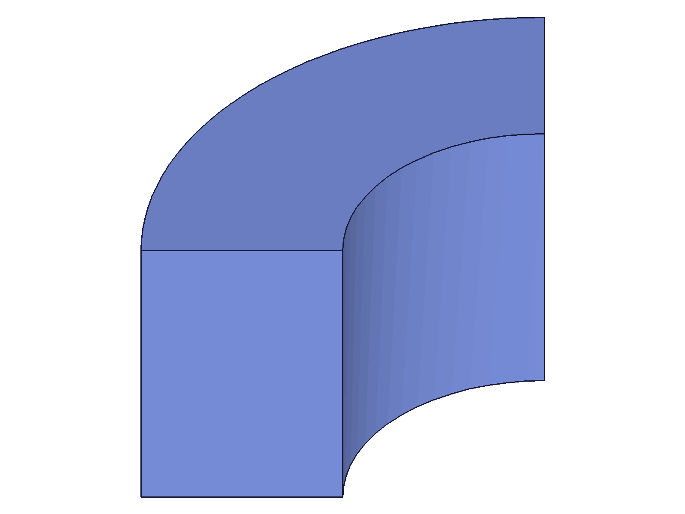
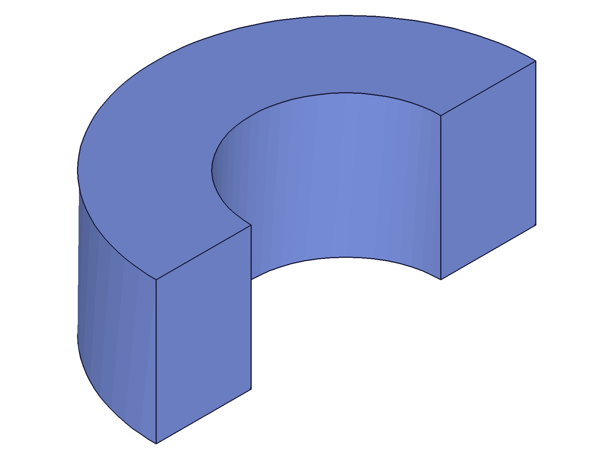
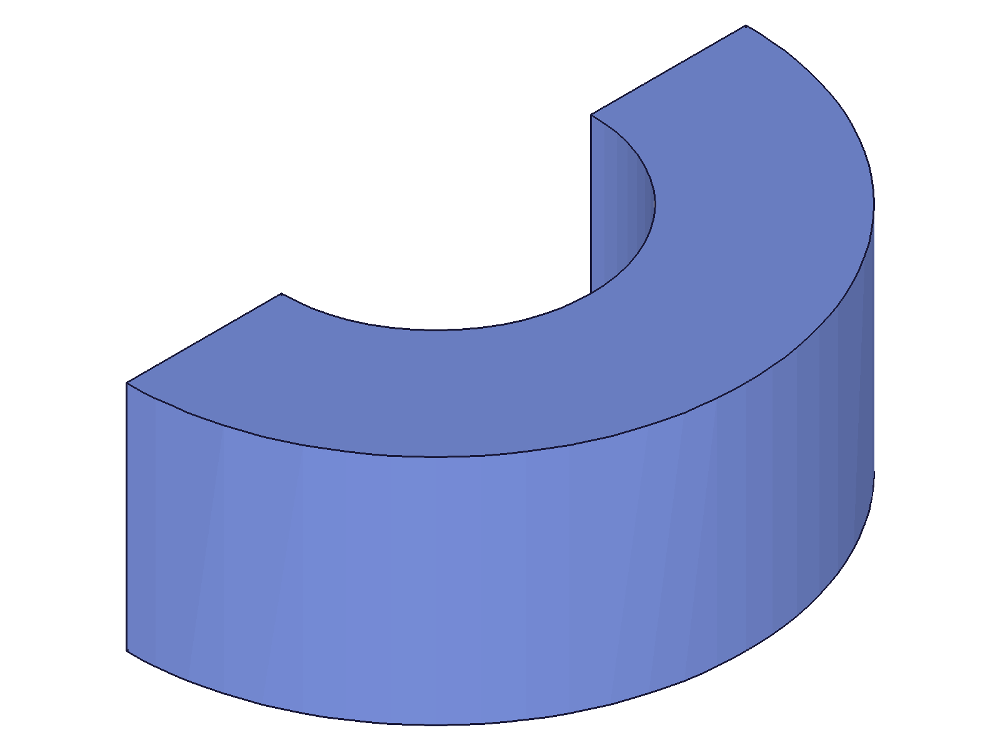
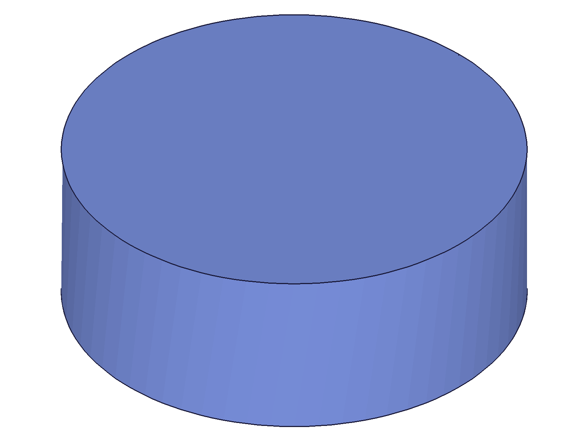
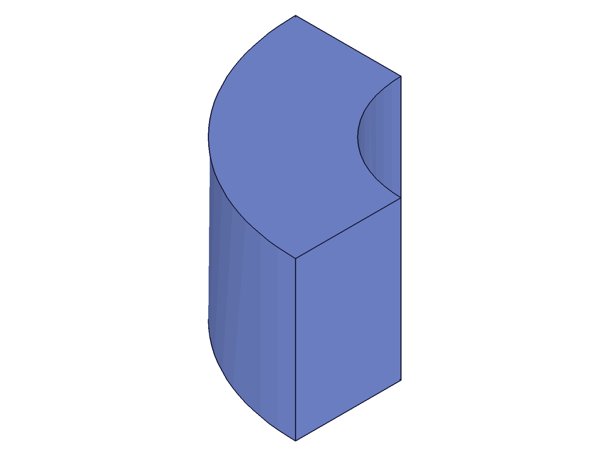
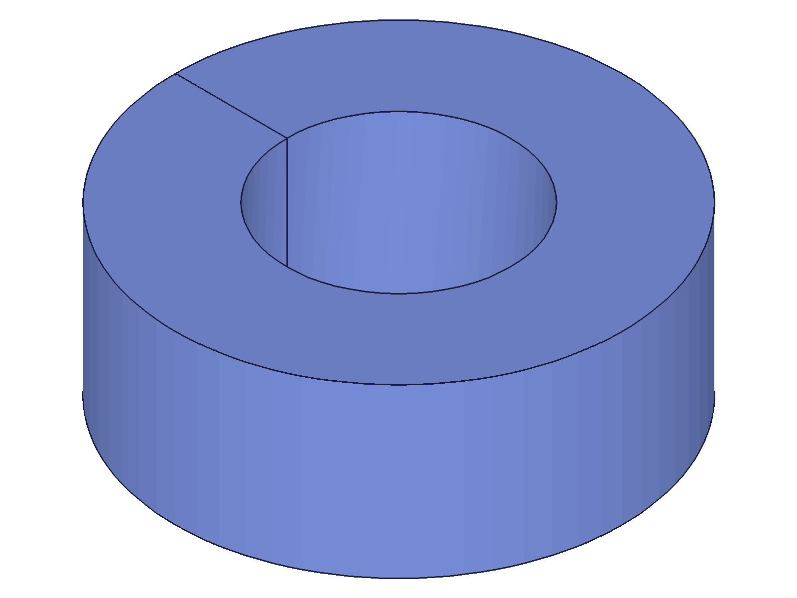
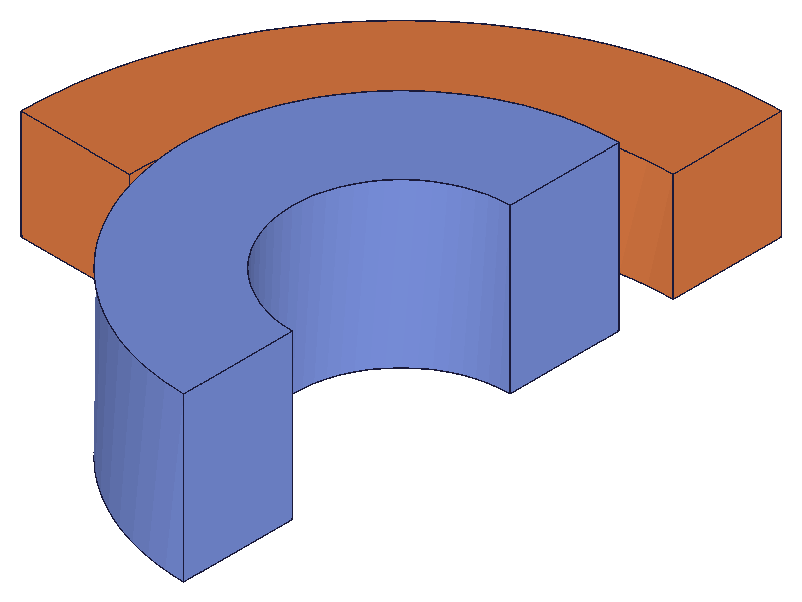

# Training: part.revolve

**Date:** 2026-04-17

## Goal

Testing `v1.part.revolve` — creates a revolve (lathe) feature by rotating a 2D sketch profile around an axis.

**Methods to cover:**

- `revolve` — basic full revolution (default 2*PI)
- `revolve` params: id, references (sketch regions, sketch contour lines), axisIds (work axis, sketch line, two points)
- `revolve` params: startAngle, endAngle (partial revolve)
- `revolve` params: inverted (CW vs CCW direction)
- `revolve` params: name
- `revolve` — axis from built-in work axes (XAxis, YAxis, ZAxis)
- `revolve` — axis from sketch line
- `revolve` — axis from two points
- Edge cases: profile overlapping axis, zero-angle revolve, same start/end angle

**Questions:**

- What types of IDs work for `axisIds`? Work axis, sketch line, brep edge, two points?
- Does `references` accept both sketch regions and raw contour line IDs?
- What happens with a full revolution (default) vs partial?
- What does `inverted` actually do — and is it visible?
- Can angles be expression strings?
- What happens when the profile crosses the axis?
- What happens with startAngle > endAngle?

---

## 01 — basic full revolve

Script: `scripts/01-basic-full-revolve.mjs` — ✅ Full revolve (default 2*PI) around built-in YAxis with sketch region reference. Result: feature ID 94, maxLevel=31.

|  |
|---|

**Data:** Rectangle profile [20,0,0]→[40,30,0] revolved around YAxis. Produces a washer/ring shape — inner radius 20, outer radius 40, height 30.

---

## 02 — partial revolve (quarter)

Script: `scripts/02-partial-revolve.mjs` — ✅ endAngle=PI/2 produces a quarter ring.

|  |
|---|

**Data:** result=94, maxLevel=31. Quarter turn around Y axis.

---

## 03 — start and end angles

Script: `scripts/03-start-end-angles.mjs` — ✅ startAngle=PI/4, endAngle=3*PI/4 produces a 90° arc starting at 45°.

|  |
|---|

**Data:** result=94, maxLevel=31. The arc is rotated — it starts at 45° and sweeps to 135°, confirming both startAngle and endAngle work as documented.

---

## 04 — contour line IDs as references

Script: `scripts/04-contour-lines-ref.mjs` — ✅ Raw rectangle line IDs work as `references` (no region needed).

|  |
|---|

**Data:** result=92, maxLevel=31. Identical to region-based revolve. Line IDs from `sketch.rectangle` accepted directly.

📌 LLM doc: Both sketch region IDs and raw contour line IDs work in `references`.

---

## 05 — inverted parameter (string 'TRUE')

Script: `scripts/05-inverted.mjs` — Normal half revolve ✅, inverted='TRUE' ❌ (null, maxLevel=51).

|  |
|---|

**Data:** `inverted: 'TRUE'` (string) fails — error: `"id" must be provided to create CC_Revolve"`. This error is misleading — the `id` is provided, the real issue is the string value for `inverted`.

---

## 06 — inverted parameter (integer vs JS boolean)

Script: `scripts/06-inverted-fix.mjs` — `inverted: 1` ✅, `inverted: true` (JS boolean) ❌.

|  |
|---|

**Data:** `inverted: 1` → result=94, maxLevel=31. `inverted: true` → null, maxLevel=51, error code 1004. The `inverted` parameter takes integer 1/0, NOT JS boolean, NOT string 'TRUE'/'FALSE'.

Comparing normal (05) vs inverted (06): the half ring's opening faces the opposite direction. Normal sweeps CCW, inverted sweeps CW.

📌 LLM doc: `inverted` is integer boolean (1/0). JS `true`/`false` and string `'TRUE'`/`'FALSE'` fail with misleading "id must be provided" error.

---

## 07 — sketch line as axis

Script: `scripts/07-sketch-line-axis.mjs` — ✅ Sketch line accepted as revolve axis.

|  |
|---|

**Data:** result=100, maxLevel=31. Drew a sketch line at x=0 (along Y) and used it as the axis. Half revolve produced identical shape to work axis version.

📌 LLM doc: Sketch lines are valid axis references in `axisIds`.

---

## 08 — two work points as axis

Script: `scripts/08-two-points-axis.mjs` — ✅ Two work points define the axis.

**Data:** result=110, maxLevel=31. Created two work points at [0,0,0] and [0,50,0] — effectively defining the Y axis. Works as documented: `axisIds` accepts two point IDs.

📌 LLM doc: `axisIds` accepts a single line (work axis, sketch line, brep edge) OR two points (work points, sketch points, brep vertices).

---

## 09 — expression-driven angles

Script: `scripts/09-expression-angles.mjs` — Named expression `@expr.ANG` ✅, inline math string `'3.14159/2'` ❌.

**Data:** `endAngle: '@expr.ANG'` → result=100, maxLevel=31. `endAngle: '3.14159/2'` → null, maxLevel=51 (error 1004). Expression strings must reference named expressions with `@expr.` prefix. Inline math expressions don't work.

📌 LLM doc: Angles accept numbers or `@expr.NAME` expression strings. Inline math like `'3.14/2'` is not supported.

---

## 10 — edge cases (multi-part — UNRELIABLE)

Script: `scripts/10-edge-cases.mjs` — Only test 1 (zero angle) ran as first part, tests 2-4 failed due to multi-part bug. **Results from this script are unreliable for tests 2-4.** Re-tested in isolated scripts 12-15.

---

## 11 — profile crossing axis (multi-part — UNRELIABLE)

Script: `scripts/11-profile-crossing-axis.mjs` — Touch-axis ✅ (first part), cross-axis failed (second part, multi-part bug). Re-tested in isolated scripts.

|  |
|---|

**Data:** Profile starting at x=0 (touching Y axis) produces a solid cylinder (no hole) — the profile goes from the axis outward.

📌 LLM doc: Profile touching the axis (starting at x=0) creates a solid of revolution with no center hole.

---

## 12 — negative endAngle (isolated)

Script: `scripts/12-neg-angle-isolated.mjs` — ✅ Negative endAngle is valid.

|  |
|---|

**Data:** `endAngle: -PI/2` → result=94, maxLevel=31. The sweep goes in the negative direction (CW). This is equivalent to using `inverted: 1` with a positive angle.

📌 LLM doc: Negative angles reverse the sweep direction. Valid, not an error.

---

## 13 — startAngle > endAngle (isolated)

Script: `scripts/13-start-gt-end-isolated.mjs` — ✅ Works.

|  |
|---|

**Data:** `startAngle: PI, endAngle: PI/2` → result=94, maxLevel=31. Wraps around — sweeps from 180° backward to 90°.

📌 LLM doc: startAngle > endAngle is valid — sweeps in the negative direction.

---

## 14 — profile crossing axis (isolated)

Script: `scripts/14-cross-axis-isolated.mjs` — ⚠️ Creates degenerate feature (maxLevel=51).

**Data:** Profile [-10,0,0]→[40,30,0] crossing YAxis → result=94 (feature created!) but maxLevel=51: "The brep elements of at least one face are not well defined. Brep reference attribute is missing." Feature exists but is broken.

📌 LLM doc: Profile crossing the revolve axis creates a degenerate feature. Returns an ID but maxLevel=51.

---

## 15 — same start and end angle (isolated)

Script: `scripts/15-same-angle-isolated.mjs` — ✅ Produces full revolve.

|  |
|---|

**Data:** `startAngle: PI/2, endAngle: PI/2` → result=94, maxLevel=31. Full revolution — the sweep goes all the way around (360°). Same as default behavior.

📌 LLM doc: When startAngle = endAngle, it creates a full revolution (wraps 360°). Also applies to `endAngle: 0` (default start=0).

---

## 16 — multi-part revolve bug

Script: `scripts/16-multi-part-test.mjs` — First revolve ✅, second revolve ❌ (null, maxLevel=51).

**Data:** Two separate parts, each with identical revolve setup. First part revolve succeeds (94, maxLevel=31). Second part revolve fails with "id must be provided" error. Confirmed in scripts 05, 06, 10, 11 — every multi-part test showed this behavior.

📌 LLM doc: **BUG**: Cannot create revolve features in two different parts within the same drawing session. The second `part.revolve` call fails with misleading error.

---

## 17 — two revolves in same part

Script: `scripts/17-two-revolves-same-part.mjs` — ✅ Both succeed.

|  |
|---|

**Data:** Two revolves in the same part (different sketches): first=94, second=179, both maxLevel=31. Per-body coloring shows both solids (blue half ring + orange quarter ring). Multiple revolves per part work fine — the bug is only cross-part.

📌 LLM doc: Multiple revolves in the same part are fine. The cross-part bug only affects different parts.

---

