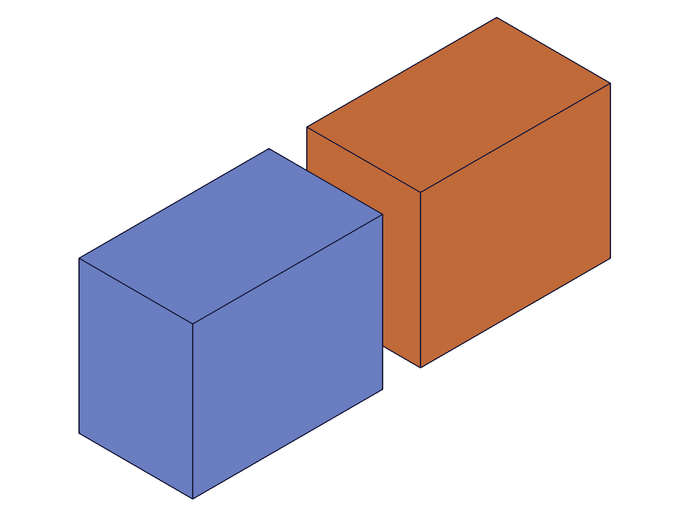

# Training: User Data Limitations

**Date:** 2026-04-17

## Goal

Studying user data limitations — the docs claim keys/values are strings only, and user data is not copied on object duplication.

**Questions to answer:**

- What happens if you pass a non-string value (number, boolean, object, array)?
- Are keys case-sensitive?
- Is there a max key/value length?
- What happens with empty string keys? Empty string values?
- What happens with special characters in keys/values (unicode, newlines, etc.)?
- Does `solid.copy` preserve user data from the source solid? (Docs say no)
- Does user data survive save/load cycles?
- Can user data be set on different object types (parts, sketches, solids, features)?
- What happens when you set the same key twice? (Overwrite or error?)
- What happens when you `getUserData` for a non-existent key without a defaultValue?

## 01 — non-string values

Script: `scripts/01-non-string-values.mjs` — all non-string types rejected with error code 1001.

**Data:** Number, boolean, object, and array values all get `maxLevel: 51` with message: `"The parameter \"value\" has the wrong type! It should be of type (string)"`. Null value gets a different error: `"Set the parameter \"value\" = VOID is not allowed in this situation!"`. No keys were stored — all sets failed. See `files/01-non-string-values-non-string-results.json`.

**Learned:** Strict string-only enforcement on values. Type mismatch = error code 1001. Null/VOID = different error message but same result (rejected).
**📌 LLM doc:** Values must be strings — document the error codes and workaround (JSON.stringify).

## 02 — key edge cases

Script: `scripts/02-key-edge-cases.mjs` — rich findings on key behavior.

**Data** (from `files/02-key-edge-cases-key-edge-results.json`):
- **Empty key** (""): accepted, maxLevel 31. The empty string is a valid key.
- **Empty value** (""): accepted, maxLevel 31. Retrieved as "".
- **Case sensitivity**: `MyKey="upper"`, `mykey="lower"`, `MYKEY="allcaps"` — all stored separately. Keys ARE case-sensitive.
- **Overwrite**: Set `overwrite="first"`, then set `overwrite="second"` → retrieved `"first"`. **setUserData does NOT overwrite existing keys!** This is silent — maxLevel 31, no error, but the value doesn't change.
- **Special characters**: Spaces, slashes, dots, colons, tabs, newlines — all work in keys. All retrieved correctly.
- **Unicode**: Japanese characters (日本語) work as both key and value.

**Learned:** Keys are case-sensitive. The overwrite behavior is a major gotcha — must remove-then-set to update.
**📌 LLM doc:** Document case sensitivity, no-overwrite behavior (critical!), special character support.

## 03 — copy not preserved

Script: `scripts/03-copy-not-preserved.mjs` — ✅ confirmed docs claim.

|  |
|---|

**Data** (from `files/03-copy-not-preserved-copy-results.json`): Original box had 3 keys (weight, color, material) with values. Copy (via `solid.copy`) had 0 keys — all `getUserData` calls returned `"NOT_FOUND"` (the defaultValue). Original box data was untouched.

**Learned:** `solid.copy` does not copy user data. Exactly as documented.
**📌 LLM doc:** Confirm copy limitation.

## 04 — overwrite behavior (dedicated test)

Script: `scripts/04-overwrite-behavior.mjs` — confirmed no-overwrite.

**Data** (from `files/04-overwrite-behavior-overwrite-results.json`):
- Set `test="first"` → get `"first"` ✓
- Set `test="second"` (maxLevel 31, no error) → get `"first"` — **silent no-op**
- Set `test="third"` (maxLevel 31, no error) → get `"first"` — still no-op
- `removeUserData(key:"test")` → get `"GONE"` (default) ✓
- Set `test="new-value"` → get `"new-value"` ✓ — works after remove

**Learned:** To update a value, you MUST remove first then set. `setUserData` on an existing key is a silent no-op.
**📌 LLM doc:** Critical gotcha — document the remove-then-set pattern.

## 05 — different object types

Script: `scripts/05-different-object-types.mjs` — ✅ all object types support user data.

**Data** (from `files/05-different-object-types-object-type-results.json`): Part, entity injection, solid, and sketch all accept `setUserData` and return correct values via `getUserData`. Invalid ID (9999) correctly errors with code 1006 ("invalid id").

**Learned:** User data is universal — any object ID can hold user data.
**📌 LLM doc:** Document universal object support.

## 06 — value length limits

Script: `scripts/06-value-length-limits.mjs` — no practical limits found.

**Data** (from `files/06-value-length-limits-length-results.json`): Values of 100, 1K, 5K, 10K, 50K, and 100K characters all stored and retrieved with exact match. Long key (1000 chars) works. JSON roundtrip (`JSON.stringify` → `setUserData` → `getUserData` → `JSON.parse`) works perfectly.

**Learned:** No observed length limit for keys or values. JSON serialization is a reliable workaround for storing structured data.
**📌 LLM doc:** Document JSON workaround pattern.

## 07 — non-existent key defaults

Script: `scripts/07-nonexistent-key-defaults.mjs` — ✅ safe default behavior.

**Data** (from `files/07-nonexistent-key-defaults-default-results.json`):
- Non-existent key without `defaultValue` → returns `""` (empty string), maxLevel 31
- Non-existent key with `defaultValue: "fallback"` → returns `"fallback"`
- `removeUserData` on non-existent key → maxLevel 31, no error (safe no-op)
- `clearUserData` on empty object → maxLevel 31, no error (safe no-op)
- `getUserDataKeys` on empty object → `[]`
- Numeric key → error 1001, same as non-string value

**Learned:** All "missing" operations are safe no-ops. Default return for missing key is "" (empty string). Keys must also be strings.

## 08/11 — save/load persistence

Scripts: `scripts/08-save-load-persistence.mjs`, `scripts/11-save-load-thorough.mjs` — **user data NOT preserved.**

**Data** (from `files/11-save-load-thorough-thorough-persistence.json`): Set user data on part and solid, saved to OFB, cleared, loaded. Scanned IDs 1–200 — zero objects with user data found. Total user data after load: 0.

**Learned:** User data does NOT survive save/load cycles (OFB format). It is session-only metadata.
**📌 LLM doc:** Critical limitation — document that user data is session-scoped.

## 09 — clear and multiple keys

Script: `scripts/09-clear-and-multiple-keys.mjs` — ✅ clear works correctly.

**Data** (from `files/09-clear-and-multiple-keys-clear-results.json`): Set 20 keys → `clearUserData` → 0 keys. Fresh `setUserData` after clear works. `removeUserData` on one key correctly removes only that key, leaving others intact.

**Learned:** `clearUserData` is a clean wipe. New data can be set after clear.

## 10 — sketch geometry user data

Script: `scripts/10-sketch-geometry-userdata.mjs` — ✅ works on individual sketch elements.

**Data** (from `files/10-sketch-geometry-userdata-sketch-geo-results.json`): Sketch, line, and individual rectangle line segments all accept user data. Each element has independent user data storage.

**Learned:** User data granularity extends to individual sketch geometry elements (lines, arcs, etc.), not just top-level objects.

## 12/14 — survive operations

Scripts: `scripts/12-survive-recalc.mjs`, `scripts/14-survive-operations.mjs` — user data survives all in-session operations.

**Data** (from logs):
- After `recalc` → user data intact ✓
- After `setObjectName` (rename) → user data intact ✓
- After `updateExpression` → user data intact ✓
- After adding more solids to same part → user data intact ✓

**Learned:** User data is stable within a session. It survives recalc, rename, expression updates, and model modifications.

## 13 — max keys stress test

Script: `scripts/13-max-keys-stress.mjs` — no key count limit found.

**Data** (from `files/13-max-keys-stress-stress-results.json`): 50, 100, 200, and 500 keys all stored correctly on a single object. No failure, no performance degradation observed.

**Learned:** No practical limit on number of keys per object.

## Coverage checklist

- [x] Each stated question answered with evidence
- [x] Edge cases probed (empty keys, special chars, overwrite, save/load, deletion)
- [x] Findings grounded in server responses, not doc assumptions
- [x] Tested across multiple APIs (parts, solids, sketches, entity injections)
- [x] Key findings backed by `filewrite` data
