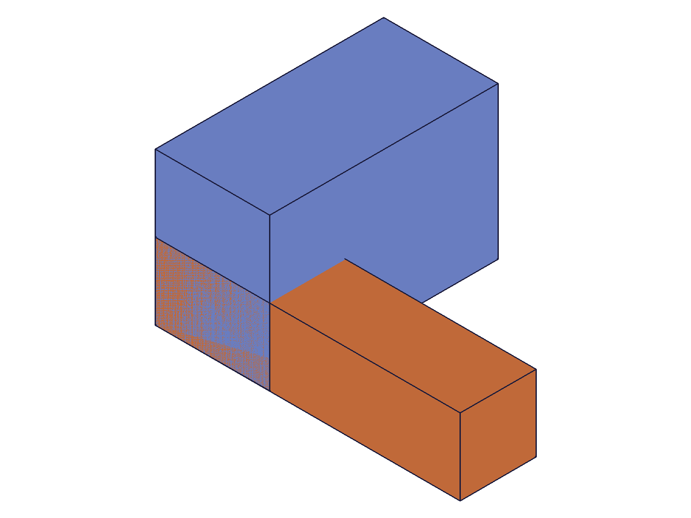
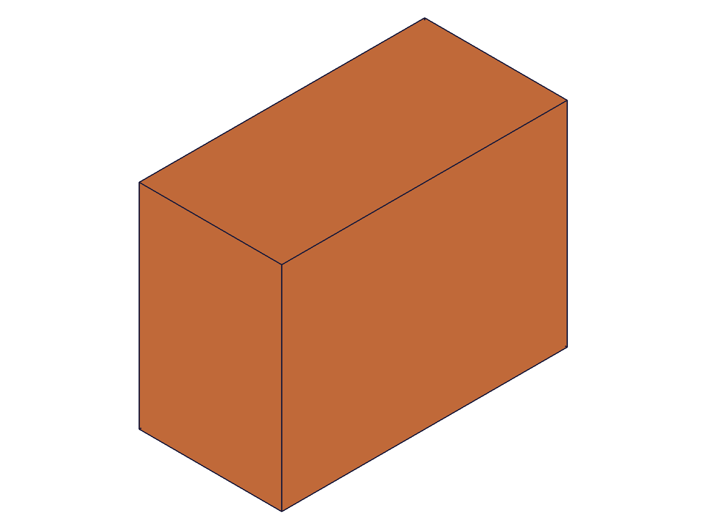
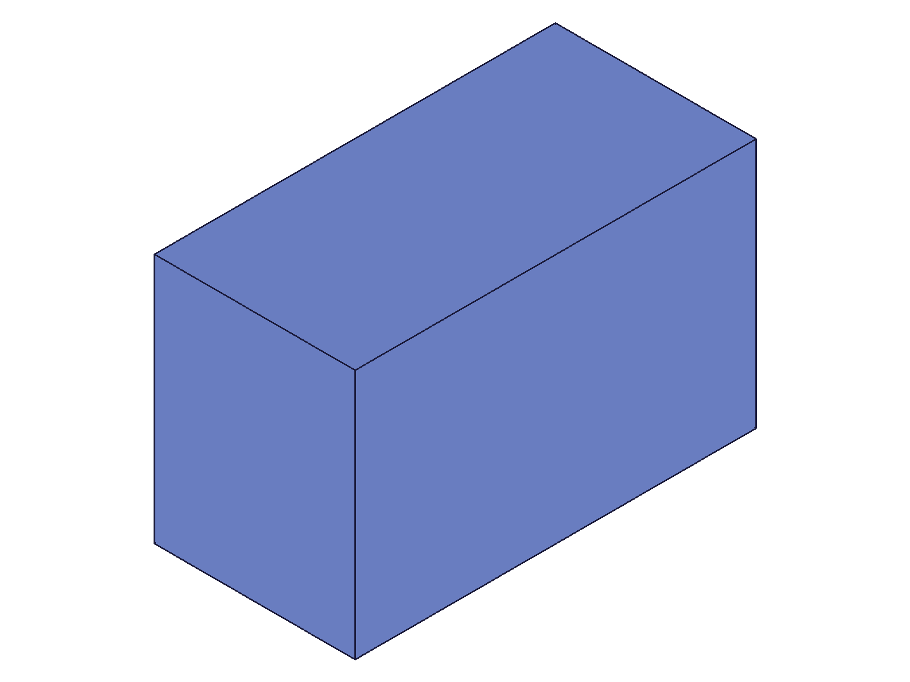
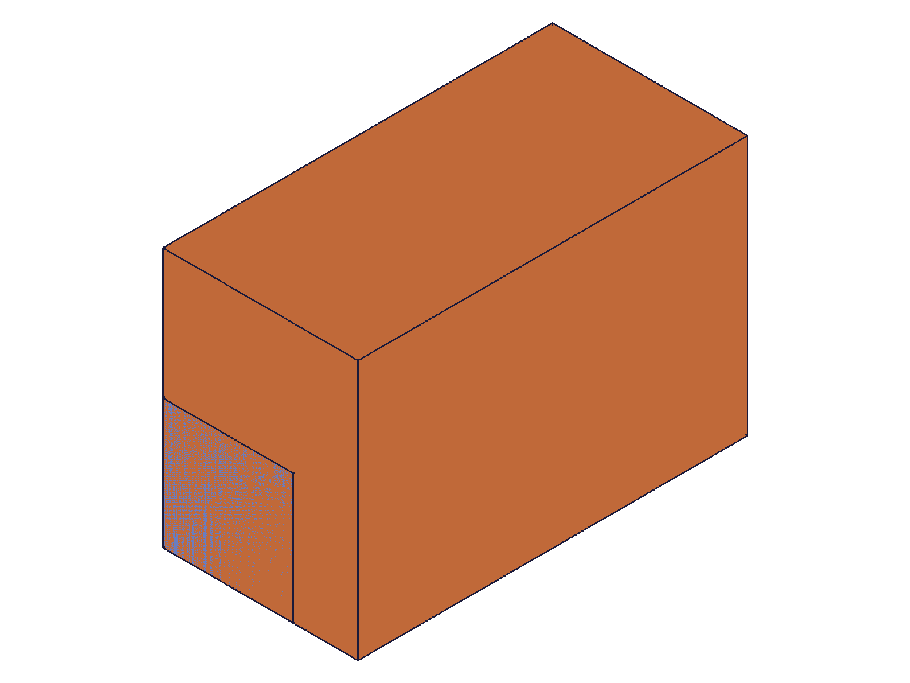
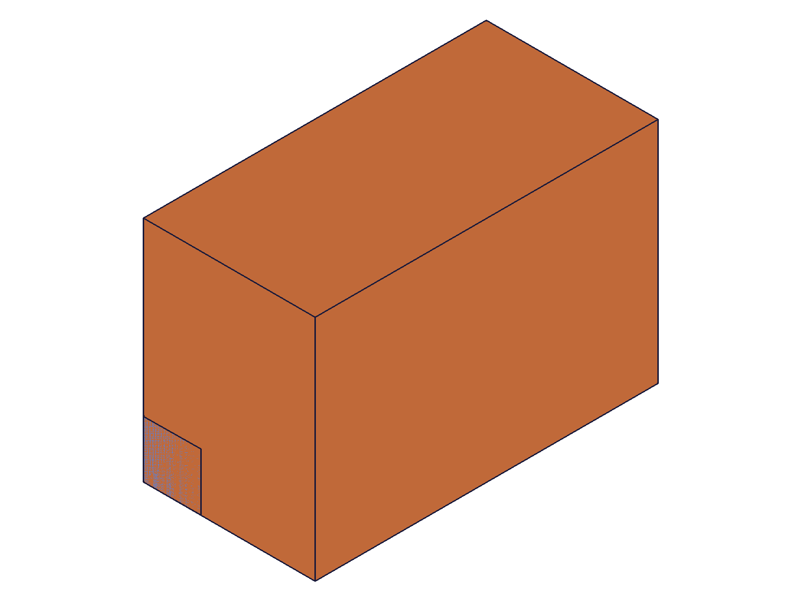
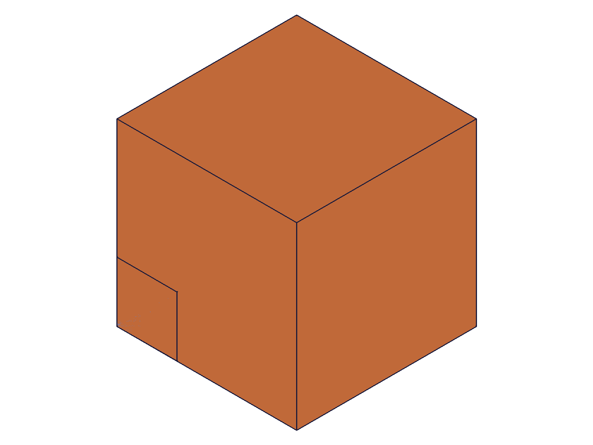
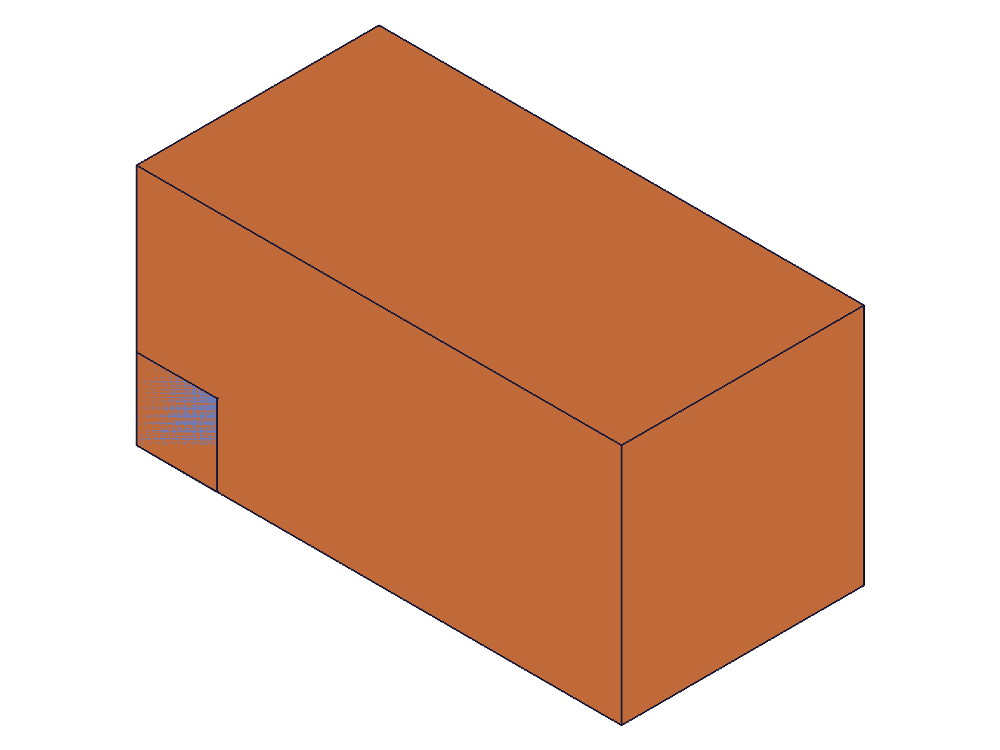
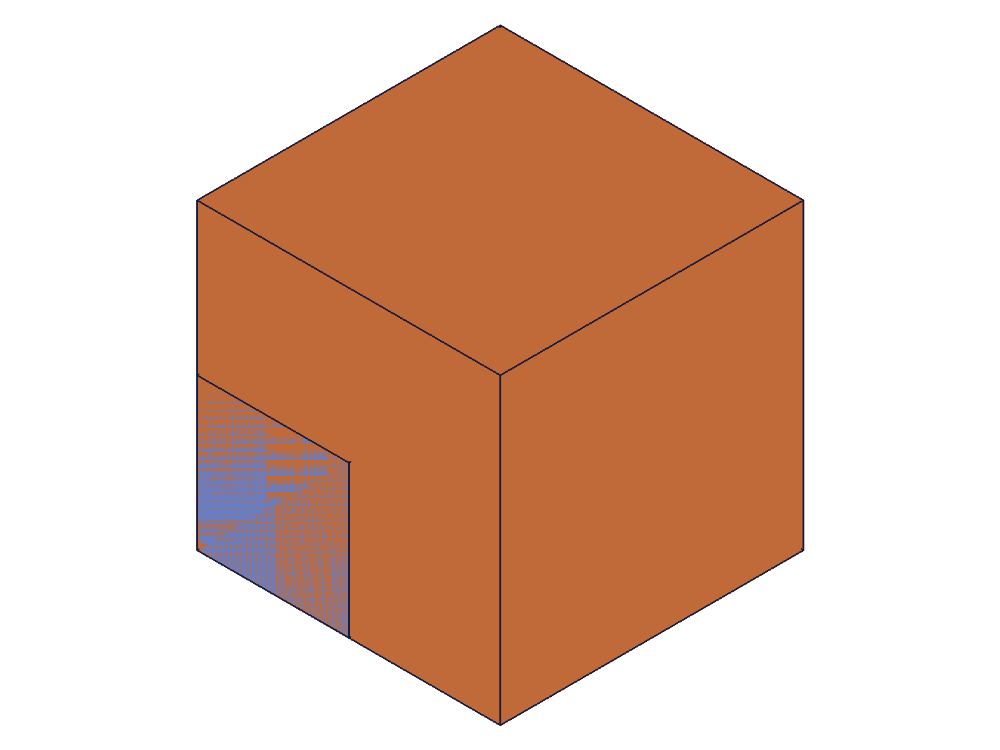
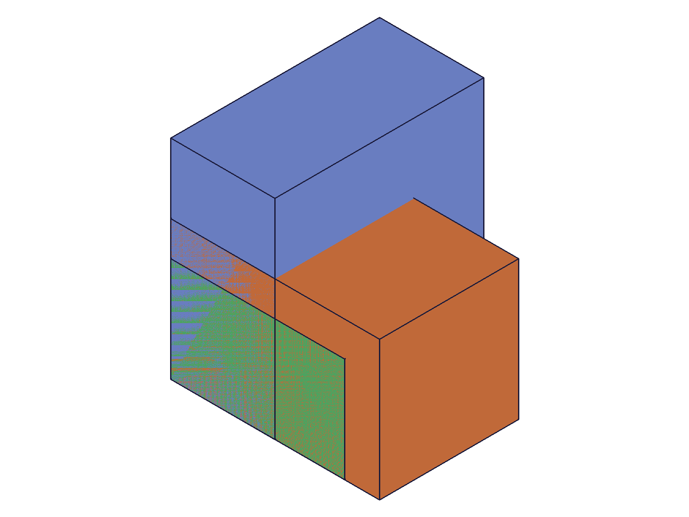
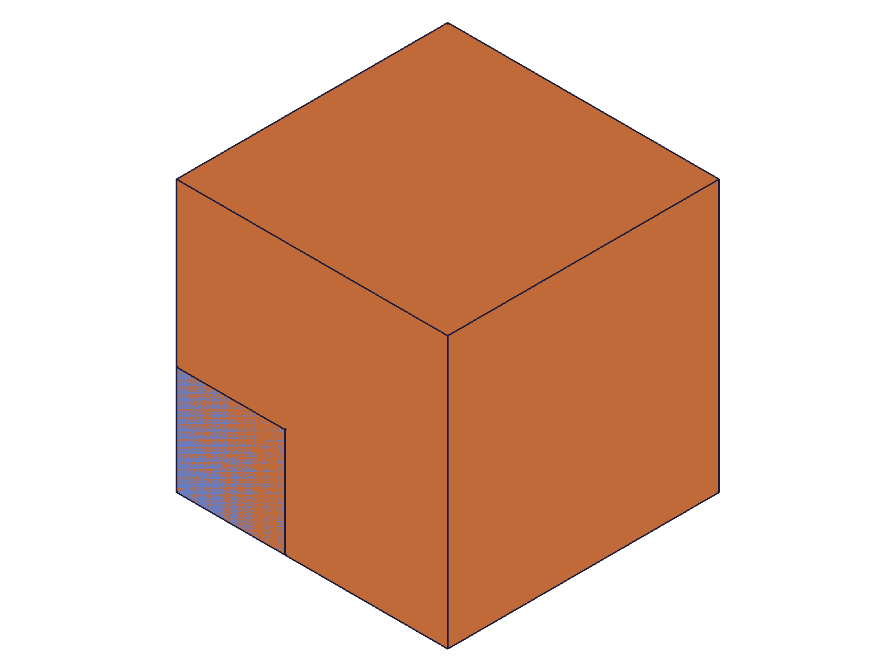

# Training: part.box and part.updateBox

**Date:** 2026-04-17

## Goal

Testing `v1.part.box` and `v1.part.updateBox` — parametric box feature creation and update.

**Methods to cover:**

- `box` — create with defaults, all params (name, length, width, height)
- `box` — with `references` (work coordinate system placement)
- `box` — with expression-driven dimensions (`@expr.` syntax)
- `updateBox` — change dimensions after creation (requires openFeature/closeFeature)
- `updateBox` — change references, change name
- `updateBox` — partial updates (only some params)

**Questions:**

- What does `part.box` return? Feature ID? What type?
- How does `references` work — does it accept work plane IDs, work CSys IDs, or both?
- Can you use expression strings directly in length/width/height?
- What happens with zero or negative dimensions?
- What does `updateBox` return?
- What is the relationship between `part.box` (feature) and `solid.box` (direct)?
- Does updating box dimensions via `updateBox` immediately regenerate geometry, or is a recalc needed?

---

## 01 — basic defaults

Script: `scripts/01-basic-defaults.mjs` — ✅ Default box creates 100×100×100 cube.

**Data:** result=54 (feature ID), maxLevel=31 (info), messages=[]. Default name is "Box".

|  |
|---|

## 02 — named with dimensions

Script: `scripts/02-named-with-dimensions.mjs` — ✅ Named box with custom dimensions works. Multiple boxes in same part supported.

**Data:** First box "MyBox" (60×40×30) → ID 54, maxLevel 31. Second box "SmallBox" (20×20×80) → ID 91, maxLevel 31. Each box feature gets a distinct per-body color in the renderer.

|  |
|---|

## 03 — references with workCSys

Script: `scripts/03-references-workcsys.mjs` — ✅ Box placed at work coordinate system via `references: [wcsId]`.

**Data:** Box at origin → ID 62, maxLevel 31. Box at WCS [50,30,20] → ID 99, maxLevel 31. Both created successfully. Visual shows two boxes at different positions (origin box partially occluded by WCS box in isometric view).

|  |
|---|

## 04 — expression-driven dimensions

Script: `scripts/04-expression-driven.mjs` — ✅ `@expr.` syntax works for length/width/height.

**Data:** Expressions L=80, W=50, H=L*0.5=40. Box created with `@expr.L`, `@expr.W`, `@expr.H` → ID 56, maxLevel 31. Verified H expression evaluates to `{expression: "L * 0.5", value: 40}`.

|  |
|---|

📌 LLM doc: Document `@expr.` syntax for dimension parameters.

## 05 — inline expression strings

Script: `scripts/05-inline-expression-strings.mjs` — ✅ Inline math expressions work in dimension params.

**Data:** Box with length='3*25'(=75), width='2*20+10'(=50), height='sqrt(2500)'(=50) → ID 54, maxLevel 31, messages=[].

📌 LLM doc: Document that raw expression strings (not just `@expr.` refs) work in dimension params.

## 06 — updateBox basic

Script: `scripts/06-updateBox-basic.mjs` — ✅ Full dimension update via openFeature → updateBox → closeFeature.

**Data:** Box (60×40×30) updated to (120×80×60). updateBox result=91 (returns same feature ID), maxLevel 31. Reference box (20³) clearly shows the target box grew — visible size ratio changed dramatically.

|  |  |
|---|---|

📌 LLM doc: updateBox regenerates geometry immediately (no separate recalc needed). Returns feature ID.

## 07 — updateBox partial

Script: `scripts/07-updateBox-partial.mjs` — ✅ Partial update works — unspecified params keep existing values.

**Data:** Box (60×60×60) updated with only `height: 120`. Result=91, maxLevel 31. Before snapshot shows a cube; after shows a tall rectangular box. Width and length remained at 60.

|  |  |
|---|---|

📌 LLM doc: Document partial update behavior — omitted params are preserved.

## 08 — updateBox name

Script: `scripts/08-updateBox-name.mjs` — ✅ Feature rename via updateBox works.

**Data:** Box created as "OldName" (ID 54). After updateBox with `name: 'NewName'`, structure tree shows `tree.54.name = NewName`. The solid body child node retained `OldName_0` — only the feature name changed, not the internal body name. Result=54, maxLevel 31.

## 09 — updateBox add references

Script: `scripts/09-updateBox-add-references.mjs` — ✅ Adding references to an existing box repositions it.

**Data:** Box at origin → updateBox with `references: [wcsId]` (WCS at [100,50,0]). Result=99, maxLevel 31. Box moved to WCS position.

|  |  |
|---|---|

## 10 — zero and negative dimensions (edge cases)

Script: `scripts/10-zero-negative-dims.mjs` — ⚠️ Zero/negative dimensions return ERROR but still create a feature.

**Data:**
- `length: 0` → ID 54, maxLevel **51** (ERROR), code 1122: "Length not valid... Value for length must be greater than 0."
- `height: -30` → ID 64, maxLevel **51** (ERROR), code 1122: "Height not valid... Value for height must be greater than 0."
- All zero → ID 74, maxLevel **51**, 3 error messages (one per dimension).

The feature ID is returned despite the error — the feature exists in the tree but is degenerate (no valid geometry).

📌 LLM doc: Zero/negative dims create a degenerate feature with error messages. Always check maxLevel after creation. Dimensions must be > 0.

## 11 — updateBox without openFeature

Script: `scripts/11-updateBox-without-open.mjs` — ✅ Fails as expected.

**Data:** updateBox without openFeature → result=null, maxLevel **51** (ERROR). Two error messages:
- Code 1200: "The provided feature is not allowed to update. It's not active and open."
- Code 1004: "\"id\" must be provided for update."

📌 LLM doc: openFeature is mandatory before updateBox. Without it, returns null with error.

## 12 — multiple boxes same part

Script: `scripts/12-multiple-boxes-same-part.mjs` — ✅ Three boxes with WCS placement, all different sizes.

**Data:** Box1 (60×60×30) → ID 78, Box2 (40×40×60) → ID 115, Box3 (50×30×50) → ID 152. All maxLevel 31. Structure dump (31KB) shows complete feature tree with all three box features. Each box gets a distinct color in the renderer.

|  |
|---|

## 13 — references with workPlane (error case)

Script: `scripts/13-references-workplane.mjs` — ❌ Work plane IDs rejected by `references`.

**Data:** Passing a work plane ID in `references` → result=null, maxLevel **51** (ERROR), code 1001: "The parameter 'references' has a wrong id type! Provide only following id types: ['workcsys']".

📌 LLM doc: **Critical gotcha** — `references` only accepts `workcsys` IDs, not workplane, workaxis, or workpoint. Despite the docs calling it "reference of the work coordinate system", the error message confirms it must literally be a workCSys ID.

## 14 — updateBox with expressions

Script: `scripts/14-updateBox-expr.mjs` — ✅ Can switch from plain values to @expr. syntax via updateBox.

**Data:** Box created with plain values (50×50×50). Updated to `@expr.L` (60), `@expr.W` (40), `@expr.H` (30) → result=93, maxLevel 31. After changing expression H from 30 to 100 + recalc, box height changed to 100. Expression-driven features react to expression updates.

|  |  |  |
|---|---|---|

## 15 — updateBox remove references

Script: `scripts/15-updateBox-remove-references.mjs` — ✅ Removing references by passing empty array works.

**Data:** Box at WCS [80,60,0] → updateBox with `references: []` → box moves back to origin. Result=99, maxLevel 31.

|  |  |
|---|---|

---

## Summary of answers

1. **What does `part.box` return?** Feature ID (numeric). Not a solid ID — it's the parametric feature in the design tree.
2. **How does `references` work?** Accepts ONLY `workcsys` IDs (not workplane, workaxis, or workpoint). Places the box at the coordinate system's origin and orientation. Empty array = drawing origin.
3. **Can you use expression strings?** Yes — both `@expr.NAME` references and inline math expressions (`'3*25'`, `'sqrt(100)'`) work in length/width/height.
4. **Zero/negative dimensions?** Creates a degenerate feature (returns ID + error messages, maxLevel 51). Always validate dimensions > 0.
5. **What does `updateBox` return?** The feature ID (same as creation). maxLevel 31 on success.
6. **`part.box` vs `solid.box`?** `part.box` creates a parametric feature in the design tree — supports `updateBox`, expression binding, and references. `solid.box` creates a direct solid in an entity injection — no feature tree, no update API, no references. Use `part.box` for parametric modeling, `solid.box` for direct geometry manipulation.
7. **Does updateBox regenerate geometry immediately?** Yes — no separate recalc needed. The closeFeature call triggers regeneration.
