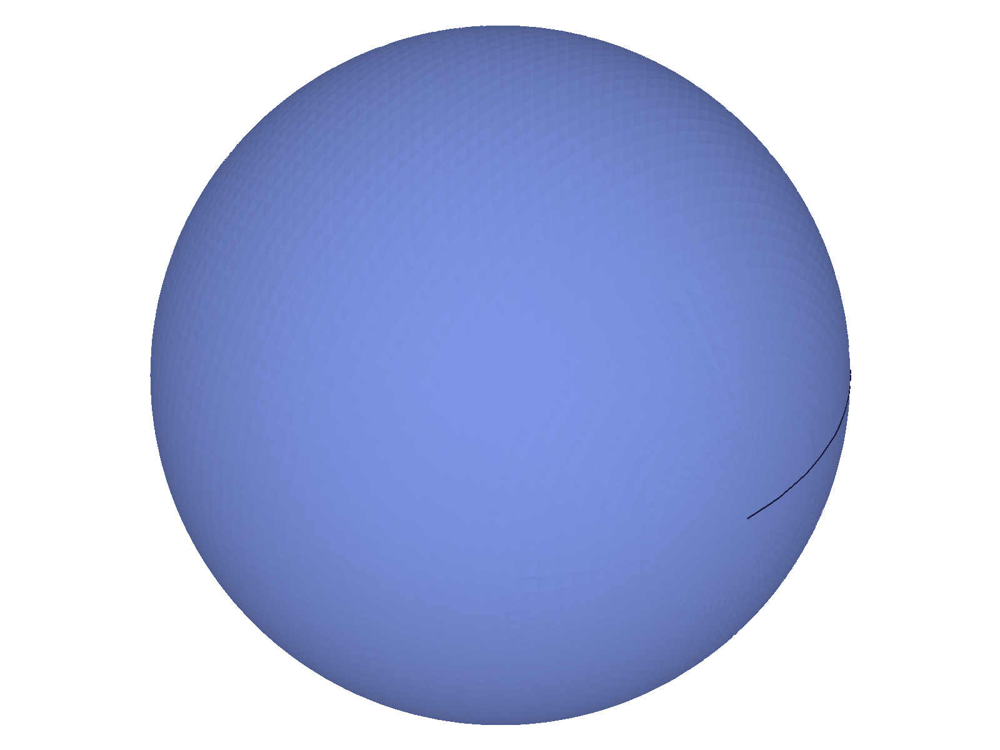
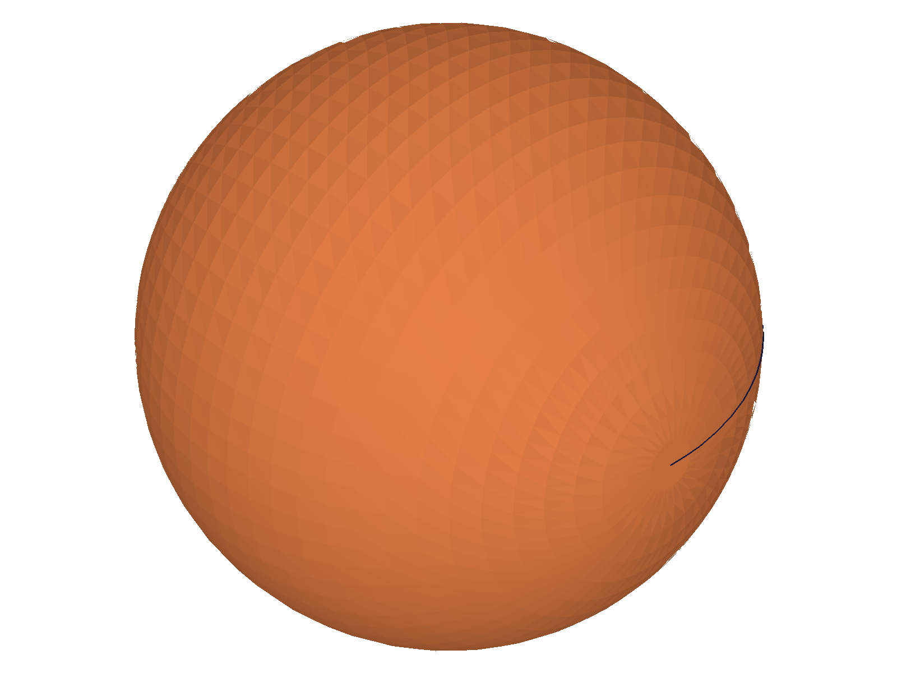
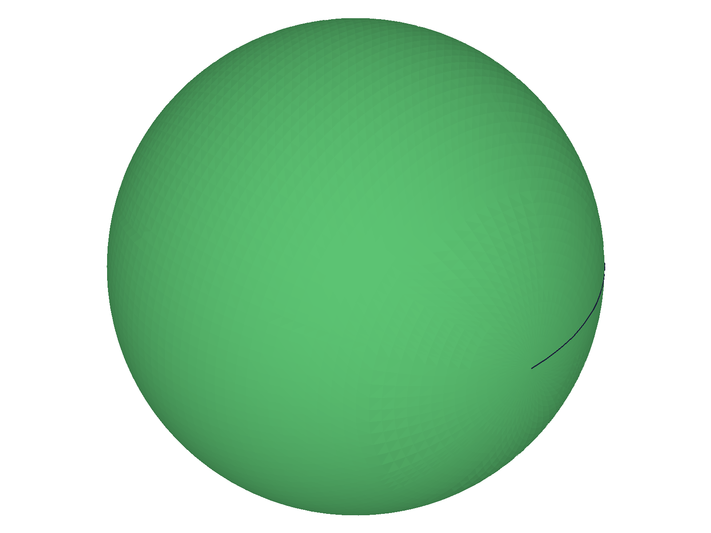
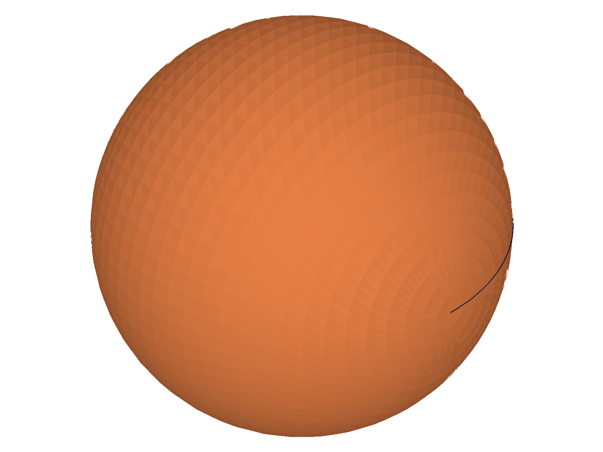
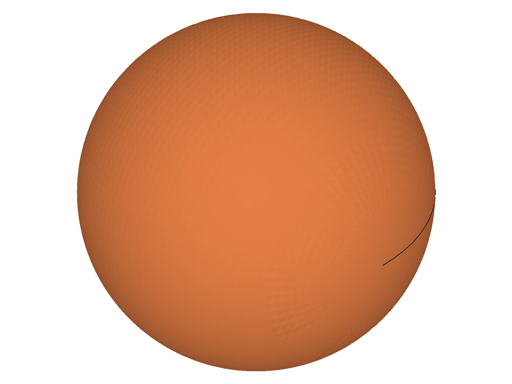
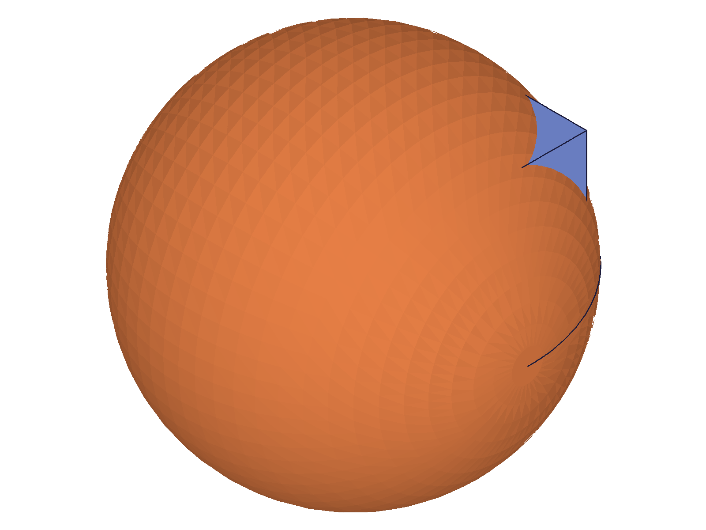
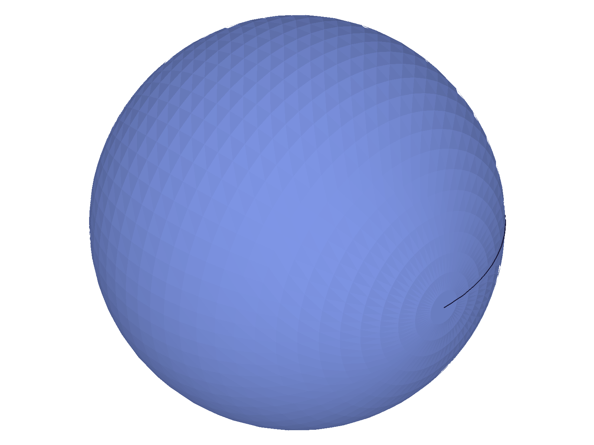
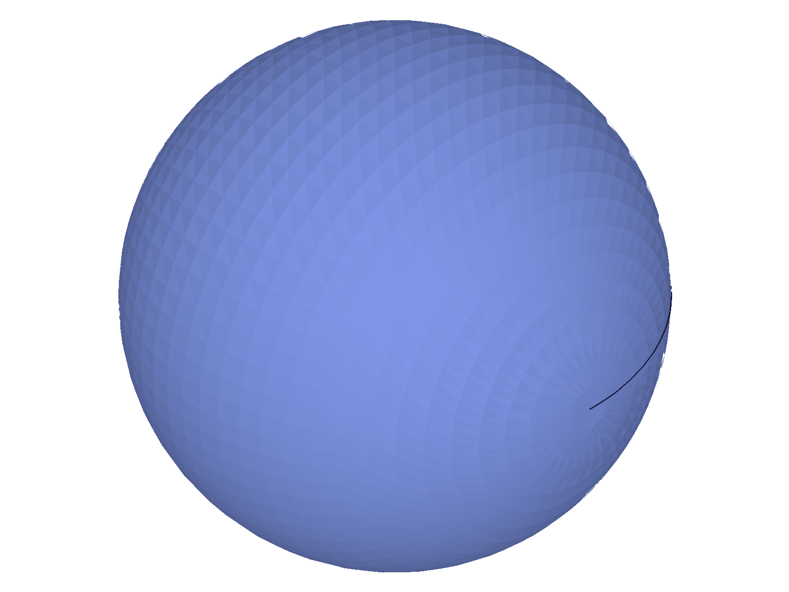
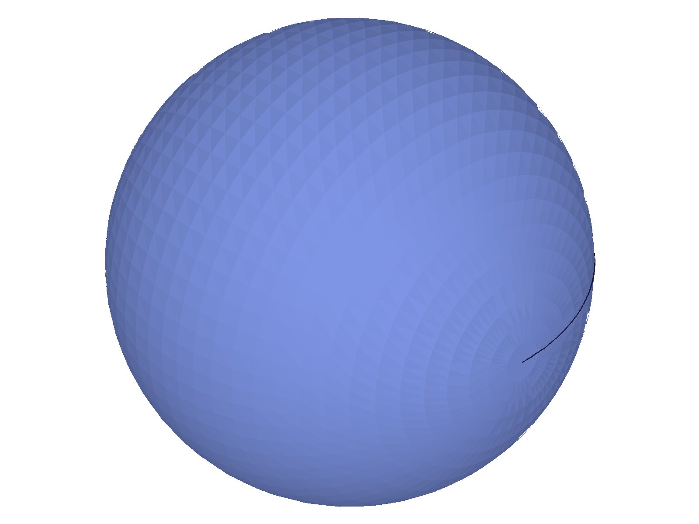

# Training: part.sphere / part.updateSphere

**Date:** 2026-04-17

## Goal

Testing `v1.part.sphere` and `v1.part.updateSphere`.

**Methods to cover:**

- `sphere` — basic creation with default radius (100)
- `sphere` params: id, name, references (workCSys), radius
- `sphere` with expression-driven radius (`@expr.R`, inline math)
- `sphere` edge cases: zero radius, negative radius, radius=0
- `sphere` with invalid references (non-workCSys IDs)
- `updateSphere` — change radius, name, references via open/close pattern
- `updateSphere` without openFeature (should fail)
- `updateSphere` partial update (omitted params keep existing values)
- Multiple spheres in one part

**Questions:**

- Does sphere follow the same pattern as box/cone/cylinder for references, expressions, and errors?
- What error codes are returned for zero/negative radius?
- Does updateSphere return the feature ID or null on success/failure?
- Can references be added/removed via updateSphere?

---

## 01 — basic defaults

Script: `scripts/01-basic-defaults.mjs` — ✅ as documented. Default sphere radius=100, returns feature ID 54, maxLevel 31 (info).

|  |
|---|

**Data:** `result: 54`, `maxLevel: 31`, no error messages (see `files/01-basic-defaults-default-response.json`).

## 02 — custom radius and name

Script: `scripts/02-custom-radius-name.mjs` — ✅ as documented. Custom radius=50, name="MySphere" both work. Returns feature ID 54, maxLevel 31.

|  |
|---|

**Data:** `result: 54`, `maxLevel: 31`.

## 03 — references (workCSys placement)

Script: `scripts/03-references-workcsys.mjs` — ✅ as documented. Two spheres: one at origin (radius 30), one at WCS origin [80,0,0] (radius 30). Both succeed with maxLevel 31. The `references` param accepts workCSys IDs and places the sphere center at the coordinate system origin.

|  |
|---|

**Data:** AtOrigin: `result: 62, maxLevel: 31`. AtWCS: `result: 77, maxLevel: 31` (see `files/03-references-workcsys-references-response.json`).

## 04 — invalid references (non-workCSys IDs)

Script: `scripts/04-invalid-references.mjs` — ✅ errors as expected. WorkPlane, workAxis, and workPoint IDs all rejected with error 1001: "The parameter \"references\" has a wrong id type! Provide only following id types: [\"workcsys\"]". All return `null`, maxLevel 51.

**Data:** All three return `result: null`, `maxLevel: 51`, code 1001 (see `files/04-invalid-references-invalid-refs-response.json`).

**📌 LLM doc:** `references` only accepts workCSys IDs — same as box/cone/cylinder. Error 1001 with null result.

## 05 — zero/negative radius

Script: `scripts/05-zero-negative-radius.mjs` — ✅ error behavior confirmed. Zero and negative radii produce error 1122 but still return a feature ID (degenerate feature). Tiny positive radius (0.001) works fine.

**Data:**
- Zero: `result: 54`, `maxLevel: 51`, code 1122: "Radius not valid for Zero (CC_Sphere). Value for radius must be greater than 0."
- Negative: `result: 64`, `maxLevel: 51`, code 1122: same message
- Tiny (0.001): `result: 74`, `maxLevel: 31` (success)

See `files/05-zero-negative-radius-edge-cases-response.json`.

**Learned:** Zero/negative radius creates a degenerate feature (ID returned, maxLevel 51 error) — same pattern as box/cone. The feature exists in the tree but has no valid geometry.
**📌 LLM doc:** Zero/negative radius creates degenerate feature with error 1122. Always validate radius > 0.

## 06 — expression-driven radius

Script: `scripts/06-expression-radius.mjs` — ✅ all three expression forms work:
- `'@expr.R'` (named expression reference) — result: 56, maxLevel: 31
- `'sqrt(900)'` (inline math) — result: 71, maxLevel: 31
- `'@expr.R * @expr.factor'` (combined expression) — result: 86, maxLevel: 31

|  |
|---|

**Data:** All three succeed with maxLevel 31 (see `files/06-expression-radius-expression-response.json`).

**📌 LLM doc:** All expression forms work in radius param, same as box/cone/cylinder.

## 07 — updateSphere basic (radius change)

Script: `scripts/07-update-basic.mjs` — ✅ radius update works. Changed radius 40→80 via open/close pattern. Reference box (20³) included for visual scale comparison.

|  |  |
| --- | --- |

**Data:** `updateSphere` returns `result: 91` (feature ID), `maxLevel: 31` (see `files/07-update-basic-update-response.json`). Before snapshot shows sphere with small reference box visible; after snapshot shows sphere grown relative to reference box (box barely visible due to sphere size).

**📌 LLM doc:** updateSphere returns feature ID on success, maxLevel 31.

## 08 — updateSphere without openFeature

Script: `scripts/08-update-no-open.mjs` — ✅ fails as expected. Without `openFeature`, `updateSphere` returns `null`, maxLevel 51, with errors:
- Code 1200: "The provided feature is not allowed to update. It's not active and open."
- Code 1004: "\"id\" must be provided for update."

**Data:** See `files/08-update-no-open-no-open-response.json`. Same error pattern as box/cone/cylinder.

**📌 LLM doc:** Must use open/close pattern. Without it: null + errors 1200 + 1004.

## 09 — updateSphere name and references

Script: `scripts/09-update-name-refs.mjs` — ✅ both work.
- Add references + rename: `result: 99`, maxLevel 31. Sphere moves to WCS position.
- Remove references (`references: []`): `result: 99`, maxLevel 31. Sphere returns to origin.

|  |  |  |
| --- | --- | --- |

**Data:** See `files/09-update-name-refs-add-refs-response.json` and `files/09-update-name-refs-remove-refs-response.json`.

**📌 LLM doc:** Can add (`references: [wcsId]`) and remove (`references: []`) coordinate system placement via updateSphere. Can rename via `name` param.

## 10 — partial update (omitted params preserved)

Script: `scripts/10-update-partial.mjs` — ✅ confirmed. Only name changed to "RenamedOnly", radius stayed at 50.

|  |
|---|

**Data:** Structure tree confirms: `class: "CC_Sphere"`, `name: "RenamedOnly"`, `radius: 50` (unchanged). See `files/10-update-partial-structure-after-partial.json` at node ID 54.

**📌 LLM doc:** Omitted params in updateSphere keep existing values (partial update confirmed).

## 11 — updateSphere with expression + expression-driven recalc

Script: `scripts/11-update-expression.mjs` — ✅ expression binding via updateSphere works. Changed radius from 40 to `@expr.R` (R=30), then updated R to 80 + recalc. Sphere grew automatically.

|  |  |  |
| --- | --- | --- |

**Data:** updateSphere returns `result: 120`, `maxLevel: 31`. After changing R=30→80 + recalc, sphere grows visibly relative to reference box (before: sphere fills viewport, after expr update: sphere shrinks relative to box, after recalc R=80: sphere grows again relative to box).

**📌 LLM doc:** Expression-driven radius works via updateSphere. Updating the expression + recalc auto-updates the sphere geometry.

## 12 — multiple spheres in one part

Script: `scripts/12-multiple-spheres.mjs` — ✅ three spheres created at different positions with distinct radii. All return unique feature IDs.

|  |
|---|

**Data:** s1=70 (origin, r=30), s2=85 (WCS at [80,0,0], r=20), s3=100 (WCS at [0,80,0], r=25). All maxLevel 31. Renderer auto-scales to fit all geometry — individual spheres may overlap in the isometric view.

## 13 — empty references array

Script: `scripts/13-empty-refs-array.mjs` — ✅ as documented. Empty `references: []` is equivalent to omitting `references` — sphere placed at drawing origin.

|  |
|---|

**Data:** `result: 54`, `maxLevel: 31` (see `files/13-empty-refs-array-empty-refs-response.json`).

---

## Answers to Questions

1. **Does sphere follow the same pattern as box/cone/cylinder?** Yes, exactly. Same error codes (1001, 1122), same degenerate feature behavior for invalid dimensions, same references=workCSys-only, same expression support, same open/close pattern for updates.

2. **Error codes for zero/negative radius?** Code 1122: "Value for radius must be greater than 0." Feature ID still returned (degenerate).

3. **Does updateSphere return feature ID or null?** Feature ID on success, null on failure.

4. **Can references be added/removed via updateSphere?** Yes. `references: [wcsId]` to add, `references: []` to remove.
