# Training: part.updateExtrusion

**Date:** 2026-04-17

## Goal

Testing `v1.part.updateExtrusion` — the update method for parametric extrusion features.

**Methods to cover:**

- `updateExtrusion` — basic call with `openFeature`/`closeFeature` gate
- Update `limit2` — change extrusion distance
- Update `type` — change between UP, DOWN, SYMMETRIC, CUSTOM
- Update `limit1` — change start offset (CUSTOM type)
- Update `direction` — change custom direction vector
- Update `taperAngle` — add/change/remove taper
- Update `capEnds` — toggle solid/sheet
- Update `references` — swap profile
- Update `name` — rename feature
- Expression-driven updates (`@expr.` syntax)
- Multiple updates in one open/close session
- Error cases: no openFeature, limit2=0, invalid direction

**Questions:**

- Does `updateExtrusion` return the feature ID or VOID?
- Can you change from UP to CUSTOM and set direction in one call?
- What happens when updating limit2 to 0 or negative?
- Can you change references to a different sketch profile?
- Does changing type from UP to SYMMETRIC recalculate correctly?
- Can you update taperAngle on an existing extrusion that had no taper?

---

## 01 — basic update limit2

Script: `scripts/01-basic-update-limit2.mjs` — ✅ Basic open→update→close pattern works. `updateExtrusion` returns the feature ID (96), not VOID. maxLevel=31, empty messages.

Created 80x50 rect extrusion with limit2=30, updated to limit2=100. Proportions changed visibly (taller→wider aspect ratio).

**Data:** `update-response.json`: `{ result: 96, messages: [], maxLevel: 31 }`. Before: 80x50x30, after: 80x50x100 — shape change confirmed by different aspect ratio in snapshots.

**Side note:** `part.box` with `references: [topId]` returned null — `references` param is for extrusions/profiles, not box features.

| 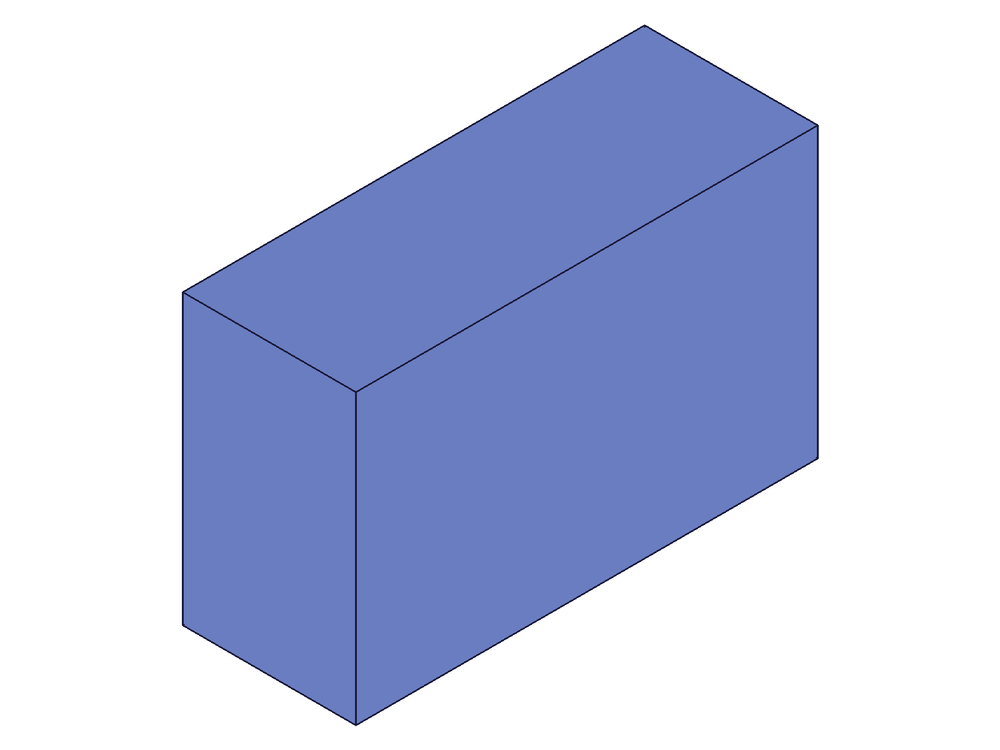 | 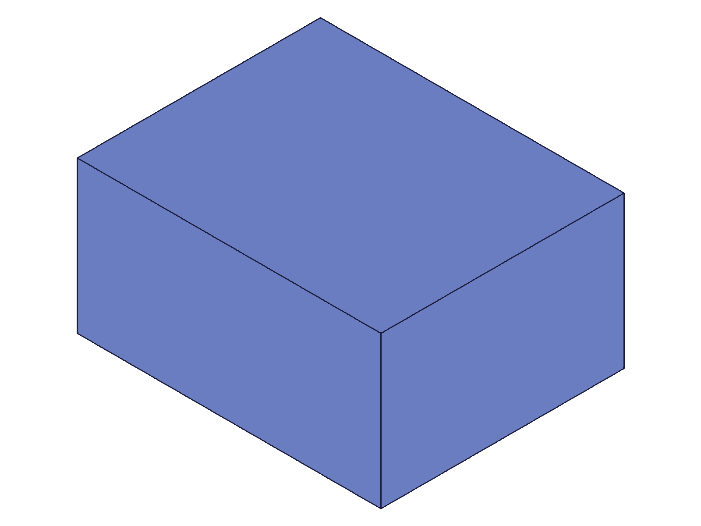 |
|---|---|

**Learned:** `updateExtrusion` returns the feature ID (same ID as creation). Pattern is open→update→close, geometry recalculates on close.
**📌 LLM doc:** `updateExtrusion` returns feature ID, not VOID.

---

## 02 — update type (UP → DOWN → SYMMETRIC)

Script: `scripts/02-update-type-down.mjs` — ✅ Type changes work. Both UP→DOWN and DOWN→SYMMETRIC transitions succeed with maxLevel=31.

**Data:** Both responses: `{ result: 96, messages: [], maxLevel: 31 }`. Ref box (10x10x10, orange) provides visual anchor.

| 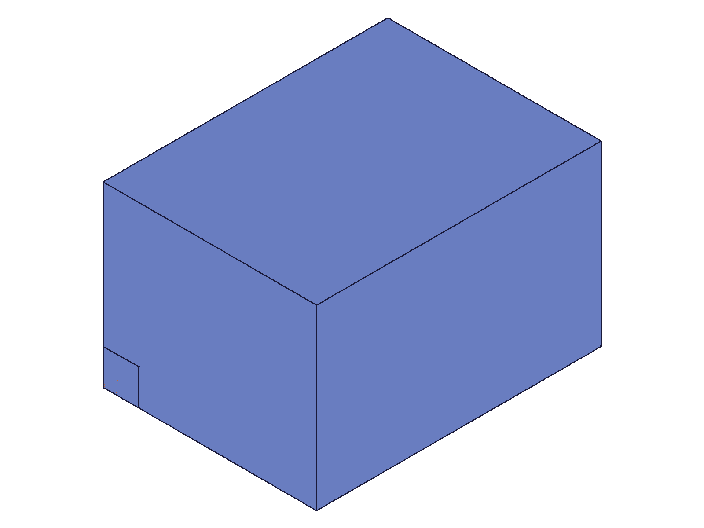 | 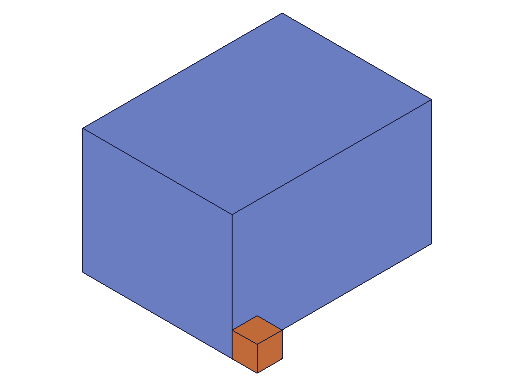 | 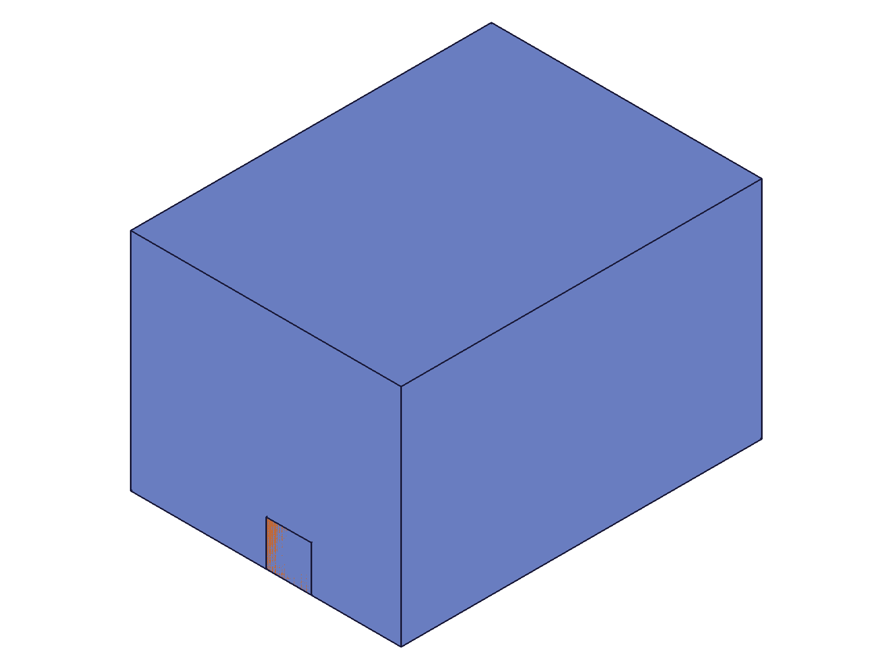 |
|---|---|---|

**Learned:** Type transitions work cleanly. UP→DOWN flips the extrusion direction (ref box now above most of the body). SYMMETRIC centers the extrusion on the sketch plane. No errors, no intermediate recalc needed — closeFeature handles it.

---

## 03 — update to CUSTOM type (direction + limit1)

Script: `scripts/03-update-type-custom.mjs` — ✅ Three sequential updates all succeed (maxLevel=31).

1. UP→CUSTOM with direction=[1,0,1] and limit2=80 in one call — diagonal extrusion along XZ
2. Direction-only update to [0,1,1] — type stays CUSTOM, body now extends along YZ
3. limit1=20 — adds start offset, body begins 20 units along direction from sketch plane

| 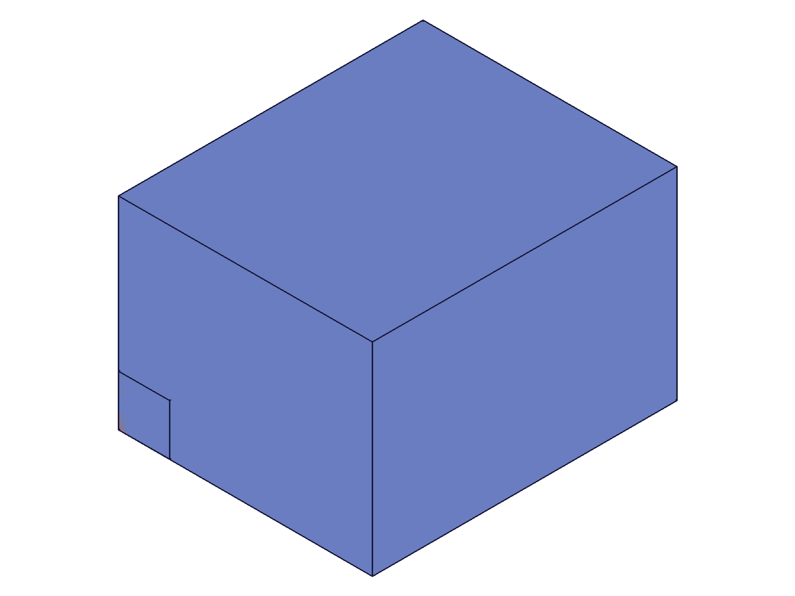 | ![CUSTOM [1,0,1]](files/03-update-type-custom-after-custom-solid.png) |
|---|---|
| ![dir [0,1,1]](files/03-update-type-custom-after-direction-change-solid.png) | 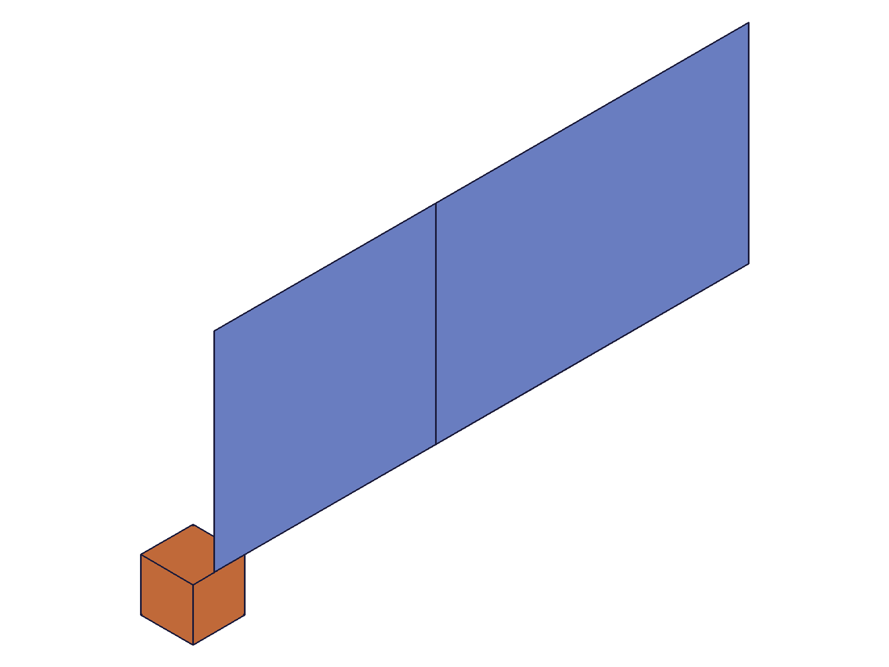 |

**Data:** All responses: `{ result: 96, messages: [], maxLevel: 31 }`. Visual confirmation: shape clearly changes with each update. Direction-only update proves CUSTOM type is sticky — you don't need to re-specify type when just changing direction.

**Learned:**
- Can set type + direction + limits in one updateExtrusion call
- Direction-only update works on existing CUSTOM extrusion (type persists)
- limit1 creates a gap between sketch plane and extrusion start
**📌 LLM doc:** Multi-param updates in one call, type persistence, limit1 offset behavior.

---

## 04 — update taperAngle

Script: `scripts/04-update-taper.mjs` — ✅ All taper operations work. Add (0.15), change to negative (-0.15), and remove (0) — all maxLevel=31.

| 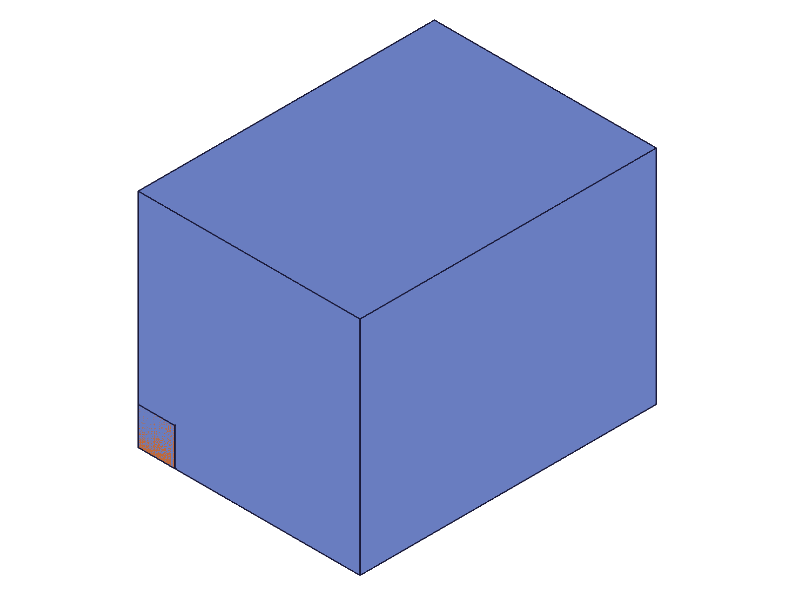 | 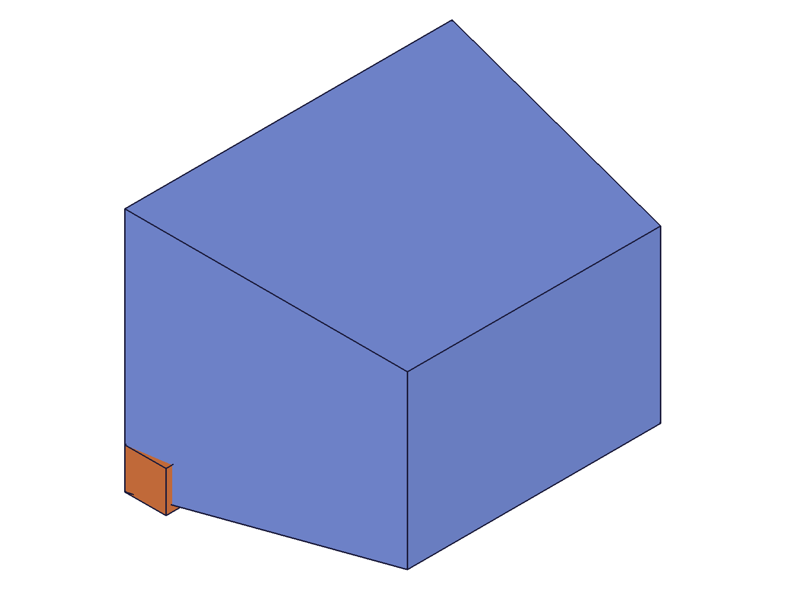 | 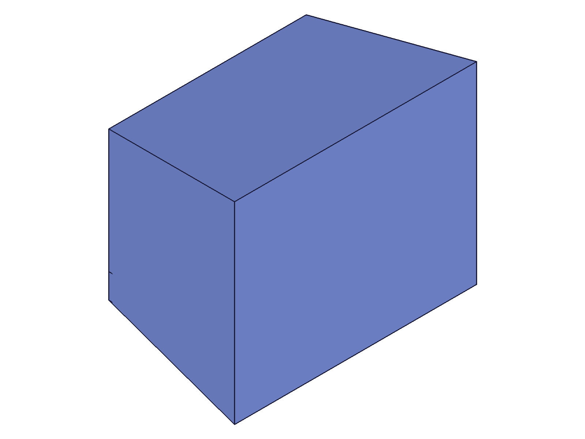 |
|---|---|---|

**Data:** All responses `{ result: 96, messages: [], maxLevel: 31 }`. Positive taper narrows the top face (visible tapered edges). Negative taper widens the top beyond the base. Taper=0 restores straight extrusion.

**Learned:** Can add/modify/remove taper on an existing extrusion. Taper persists until explicitly changed — setting taper once doesn't require re-specifying it on future updates to other params.

---

## 05 — update capEnds (solid ↔ sheet)

Script: `scripts/05-update-capends.mjs` — ✅ capEnds toggle works. capEnds=0 (sheet) succeeds, capEnds=1 (solid) restores. String 'TRUE' fails as expected.

| 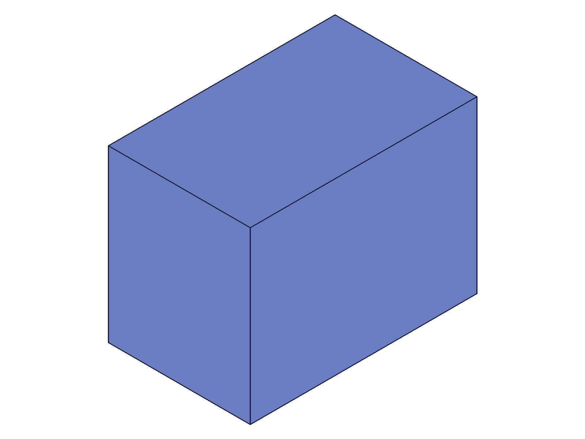 | 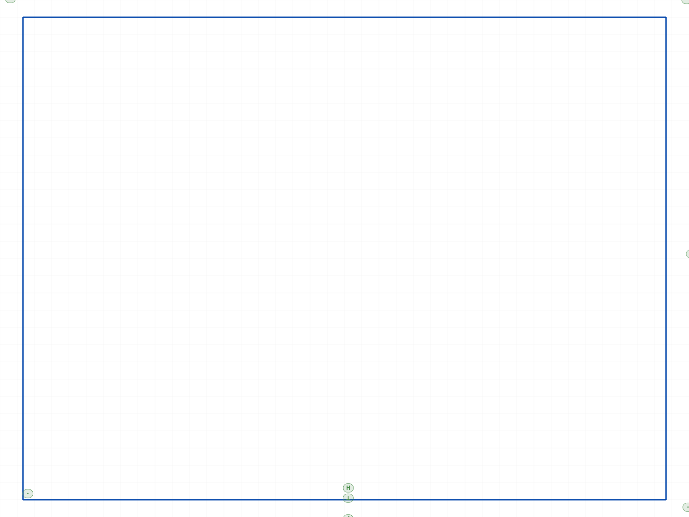 |  |
|---|---|---|

**Data:** capEnds=0: maxLevel=31 but **no `-solid.png` generated** — sheet bodies don't render as solids in the harness. Only sketch PNG produced. capEnds=1: solid rendering restored. String 'TRUE': error 1001 "capEnds has the wrong type! It should be of type (boolean)".

**Learned:** capEnds toggle is reversible. Sheet bodies produce no solid snapshot (renderer limitation). The `capEnds` type error applies identically to `updateExtrusion` as to `extrusion`.
**📌 LLM doc:** capEnds must be integer (0/1) in updates too. Sheet bodies don't render as solids.

---

## 06 — expression-driven updates

Script: `scripts/06-expression-update.mjs` — ✅ Expressions work in updateExtrusion. Both limit2 and taperAngle accept `@expr.` syntax.

| 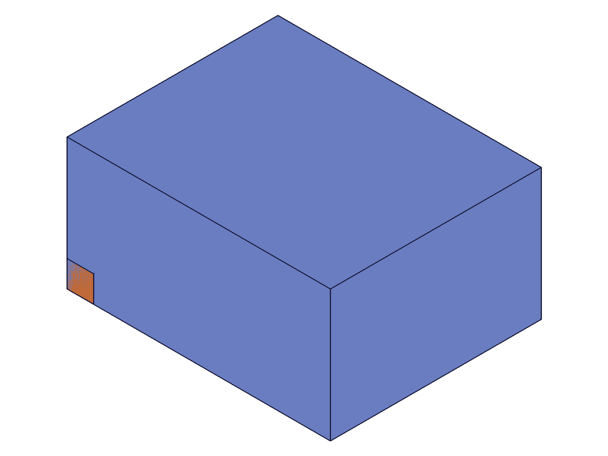 | 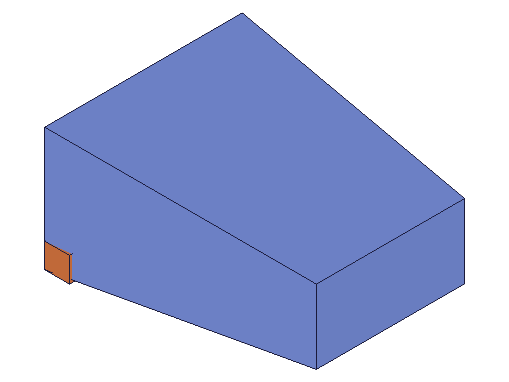 |
|---|---|

**Data:** Both updates maxLevel=31. After setting limit2 to `@expr.H` and then changing H from 30→100 via `updateExpression`, the extrusion auto-recalculated without open/close. Taper expression (`@expr.T=0.1`) also applied correctly — visible trapezoid shape.

**Learned:** Expression bindings via `@expr.` work in `updateExtrusion` identically to `extrusion`. Once bound, changing the expression value auto-recalcs the feature (no open/close needed for expression updates).
**📌 LLM doc:** Expressions work in updateExtrusion params. Expression changes auto-recalc.

---

## 07 — update name

Script: `scripts/07-update-name.mjs` — ✅ Name update works. maxLevel=31.

**Data:** Structure tree before shows `"name": "OriginalName"` at the feature node (id 96). After update, same node shows `"name": "RenamedExtrusion"`. A child body node retains `"OriginalName_0"` — the body name suffix is not updated by `updateExtrusion`.

**Learned:** `name` param in `updateExtrusion` renames the feature node but NOT its child body nodes (which keep the original name with `_0` suffix).
**📌 LLM doc:** Name update renames feature node only, not child bodies.

---

## 08 — update references (swap profile)

Script: `scripts/08-update-references.mjs` — ✅ Profile swap works. Both single-profile swap and multi-profile update succeed.

| 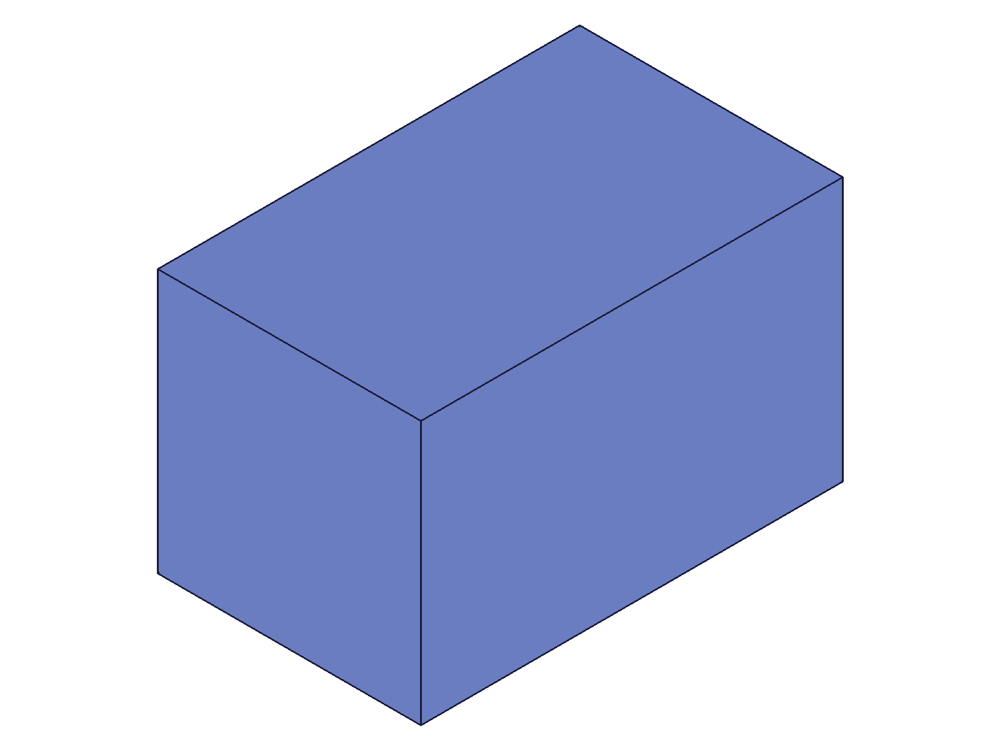 | 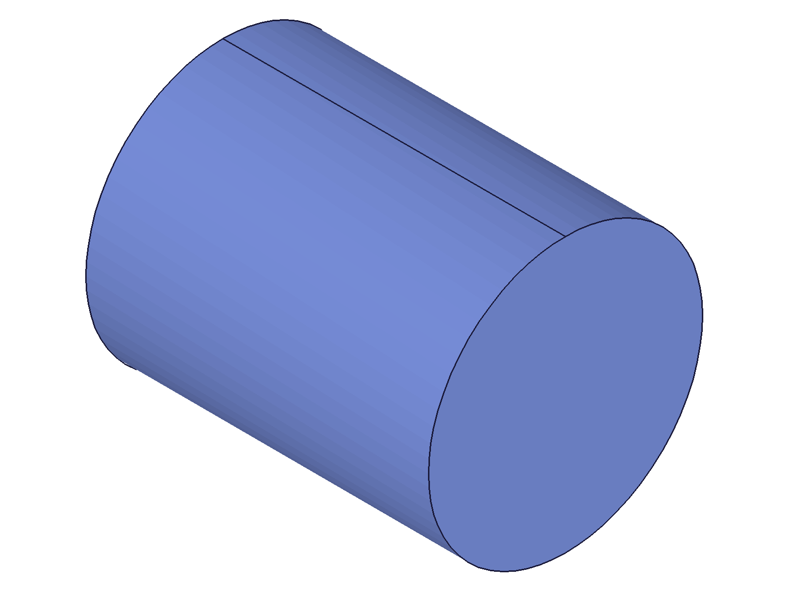 | 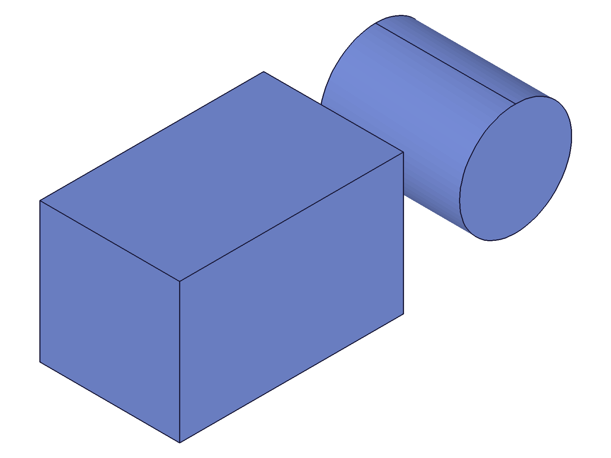 |
|---|---|---|

**Data:** All updates maxLevel=31. Rectangle region (ID 92) → circle region (ID 97): extrusion changes from box to cylinder. Both regions [92, 97]: extrusion creates TWO bodies from one feature — a box and a cylinder side by side.

**Learned:** You can completely change the extrusion profile via `references` update. Passing multiple regions to one extrusion creates multiple bodies from a single feature. This is powerful — one extrusion feature can produce multiple solids.
**📌 LLM doc:** References swap changes profile. Multiple regions = multiple bodies from one feature.

---

## 09 — error cases (no openFeature, wrong ID)

Script: `scripts/09-no-open-feature.mjs` — ✅ Expected errors reproduced.

**Data:**
- No openFeature: error 1200 "The provided feature is not allowed to update. It's not active and open." + error 1004. Returns null, maxLevel=51.
- Wrong ID (part ID instead of feature ID): error 1007 "The provided id for the feature is not a feature or work geometry id." + error 1004. Returns null, maxLevel=51.

**Learned:** Both error cases produce clear, actionable error messages. The error 1004 "id must be provided for update" is a secondary error — it fires because the primary validation failed and the system couldn't resolve the feature.
**📌 LLM doc:** Error messages for no-open and wrong-ID cases.

---

## 10 — edge case limit2 values (0, negative, large)

Script: `scripts/10-edge-limit2.mjs` — Mixed results.

| 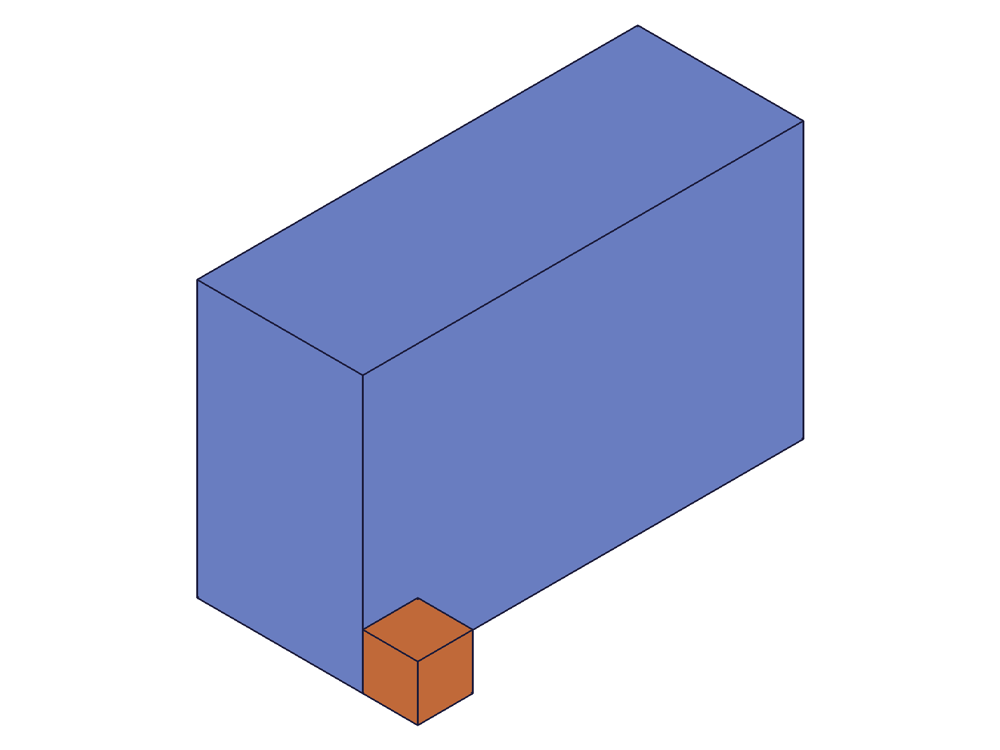 |
|---|

**Data:**
- limit2=0: maxLevel=51, error 1122 "Height not valid. Value for height must be greater than 0." — but **returns feature ID (96)**, not null. Feature enters degenerate state.
- limit2=-30: maxLevel=31 — recovers from degenerate state. Negative limit2 reverses direction (DOWN instead of UP).
- limit2=10000: maxLevel=31 — very large values accepted without error.

**Learned:** limit2=0 returns the feature ID even on error (unlike other errors that return null). The feature becomes degenerate but can be recovered by a subsequent valid update. Negative limit2 reverses direction regardless of type. No upper bound limit on limit2.
**📌 LLM doc:** limit2=0 creates degenerate feature (recoverable). Negative limit2 reverses direction.

---

## 11 — multiple updates in one open/close session

Script: `scripts/11-multi-update-session.mjs` — ✅ Three sequential updates in one session all succeed.

| 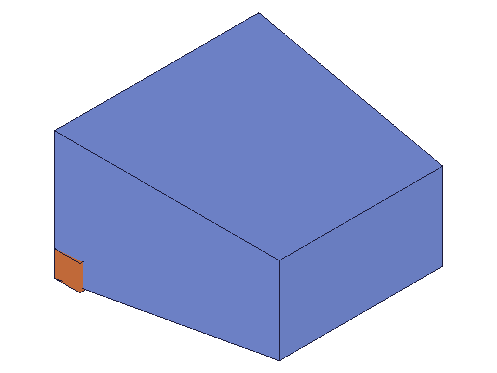 |
|---|

**Data:** All three updates returned maxLevel=31: limit2=80, taperAngle=0.1, name='MultiUpdate'. Combined effect visible — taller extrusion with inward taper. Only one closeFeature needed at the end.

**Learned:** Confirmed: multiple `updateExtrusion` calls in one open/close session work. Each update is cumulative — the feature accumulates changes until closeFeature commits them all.
**📌 LLM doc:** Multiple updates per open/close session work, cumulative.

---

## 12 — CUSTOM→UP transition (direction memory)

Script: `scripts/12-custom-to-up.mjs` — ✅ Both transitions succeed (maxLevel=31).

| 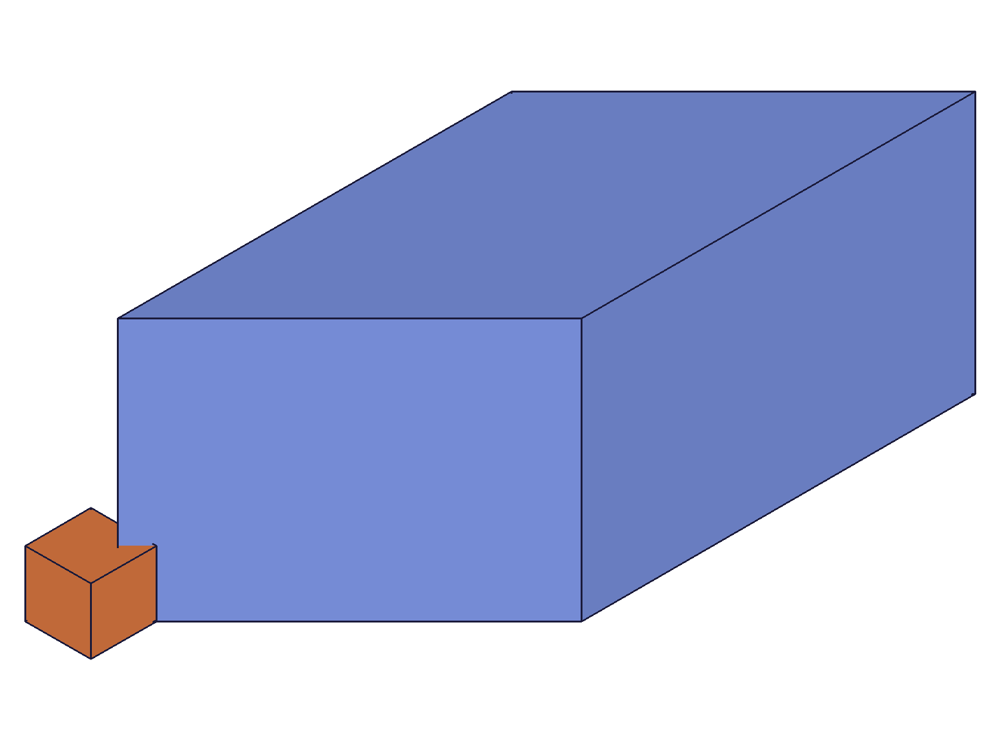 | 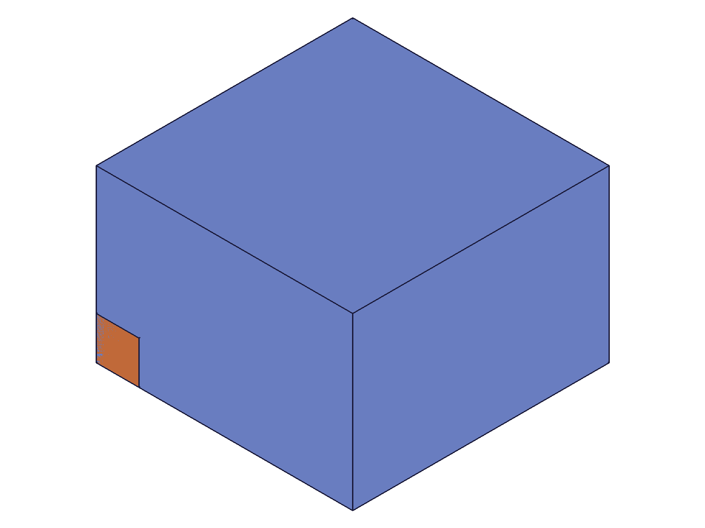 |
|---|---|

**Data:** CUSTOM→UP: maxLevel=31. UP→CUSTOM (without specifying direction): maxLevel=31 — the feature remembered the previous direction [1,0,1]! Snapshot after CUSTOM-again shows the same diagonal shape as the original CUSTOM state.

**Learned:** Feature parameters persist even after type changes. Switching CUSTOM→UP→CUSTOM restores the previous direction and limit1 without re-specifying them. The feature stores all params internally.
**📌 LLM doc:** Feature remembers direction/limit1 across type changes — no need to re-specify.

---

## 13 — combined update (all params at once)

Script: `scripts/13-combined-update.mjs` — ❌ Error: taper + non-normal custom direction is invalid.

**Data:** maxLevel=51, error code 0: "Extrudedirection with taper angle is not normal to curves". Direction [1,0,2] combined with taperAngle=0.08 on a sketch on XY plane fails because taper requires the extrusion direction to be normal to the sketch plane.

**Learned:** Taper angle ONLY works when the extrusion direction is perpendicular to the sketch plane normal. For CUSTOM direction at an angle, taper is not supported. This applies to both creation and updates.
**📌 LLM doc:** Taper + non-normal custom direction = error. Taper requires normal-to-sketch direction.

---

## 14 — realistic design iteration workflow

Script: `scripts/14-realistic-workflow.mjs` — ✅ Four design iterations on one feature, all succeed.

| 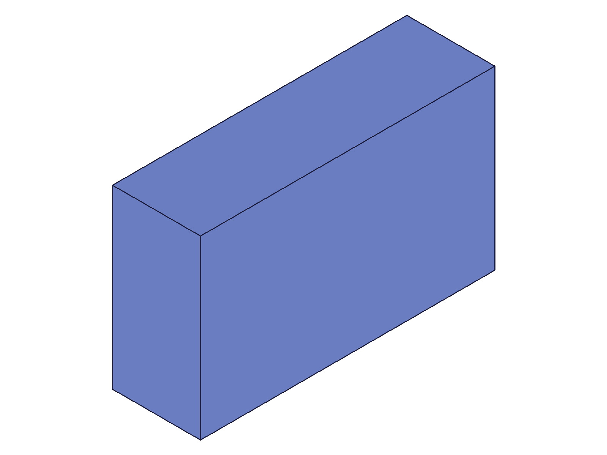 |
|---|

**Data:** Initial (limit2=@expr.BaseH) → thicker (limit2=30) → tapered (taperAngle=0.05) → symmetric (type=SYMMETRIC, taperAngle=0). All transitions maxLevel=31. Expression-driven initial value, then numeric overrides — demonstrates the typical parametric design iteration pattern.

**Learned:** `updateExtrusion` supports iterative design refinement. You can freely mix expression-driven and numeric values, change types, add/remove taper across multiple open/close cycles.
