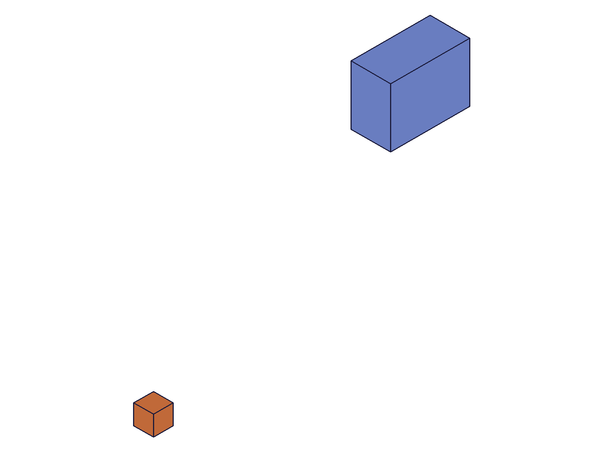
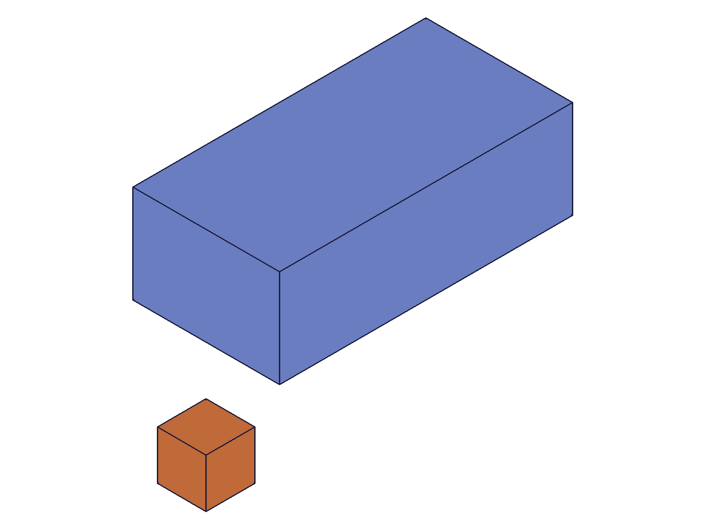
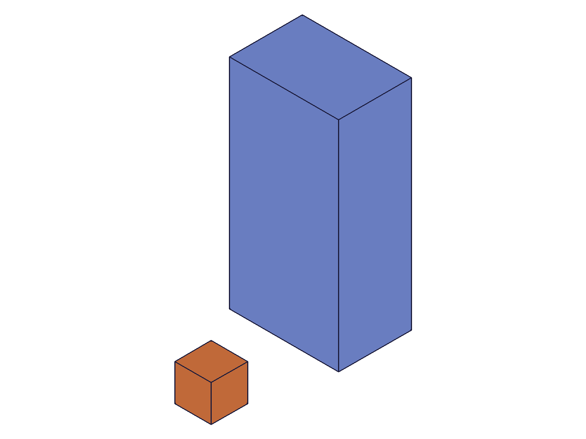
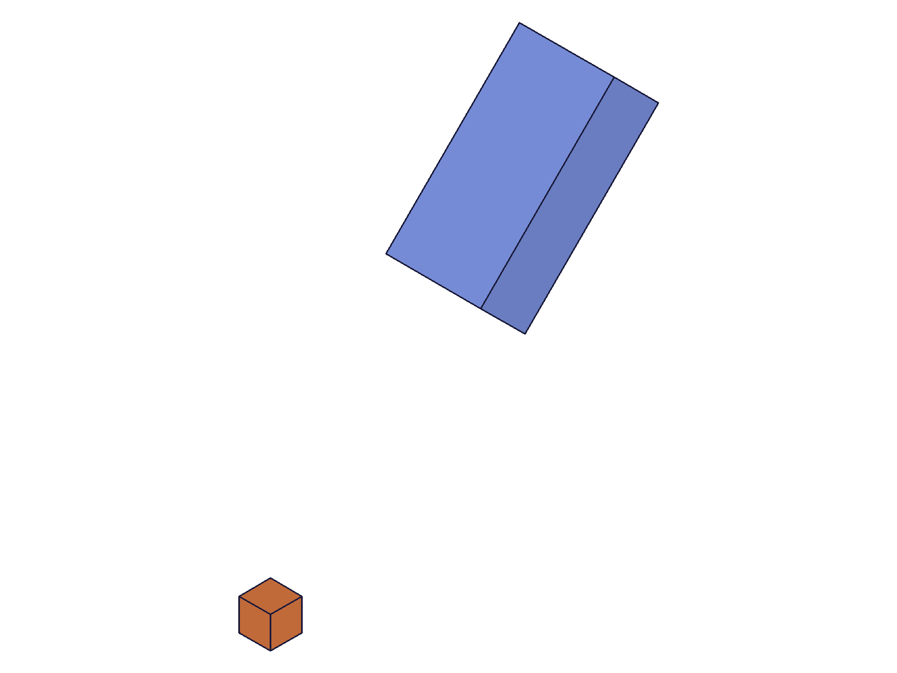
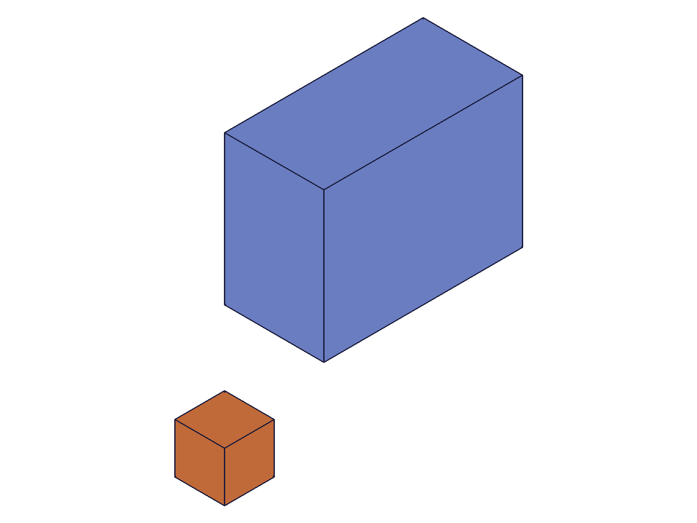
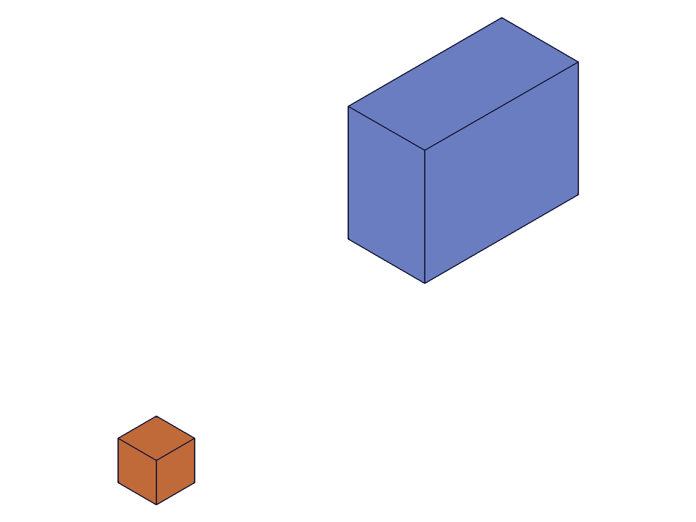
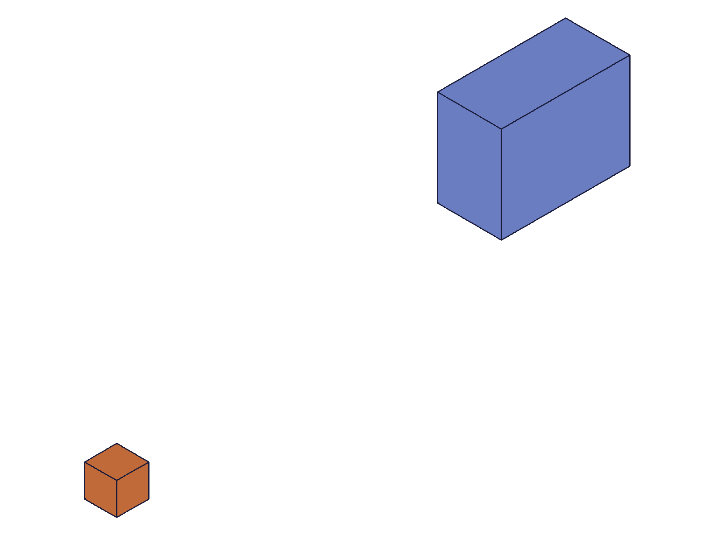
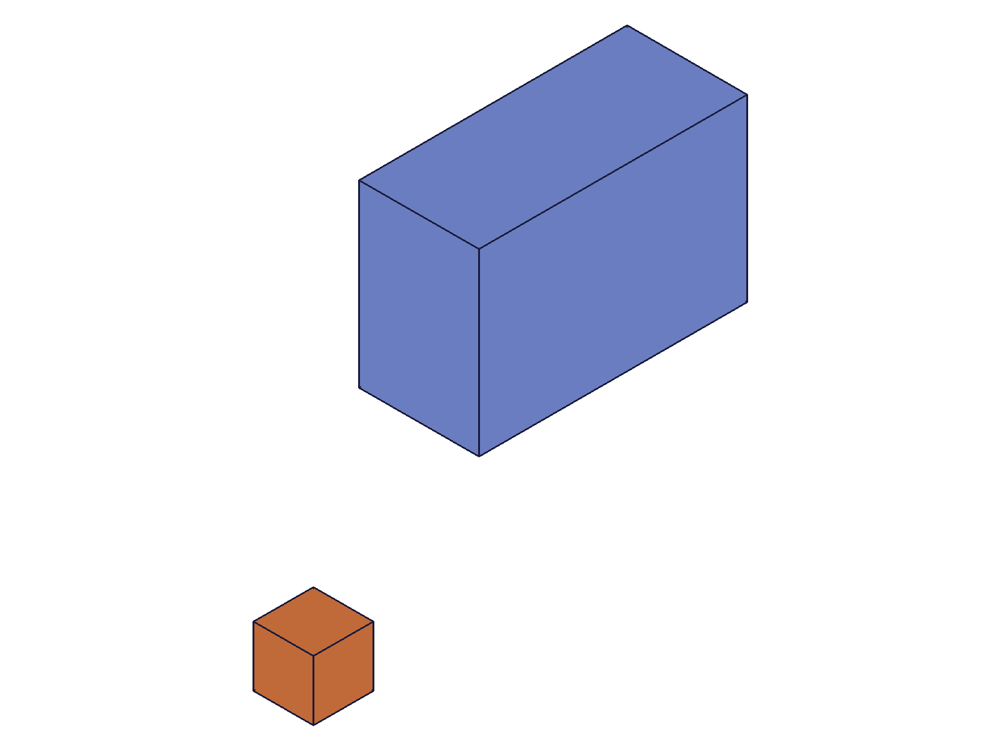
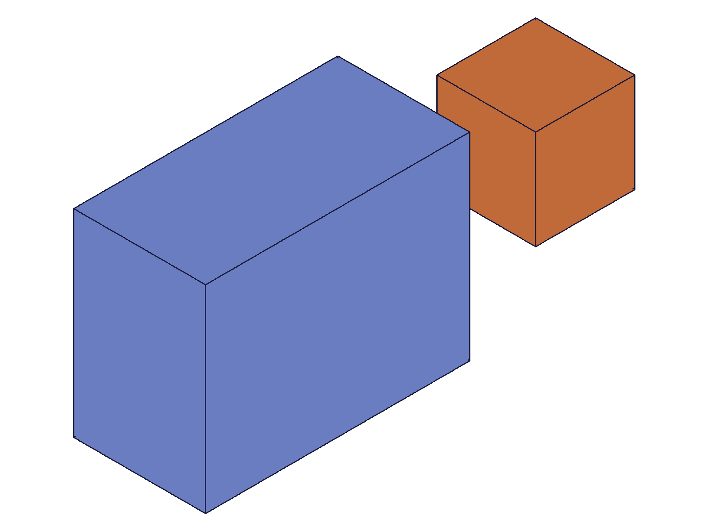
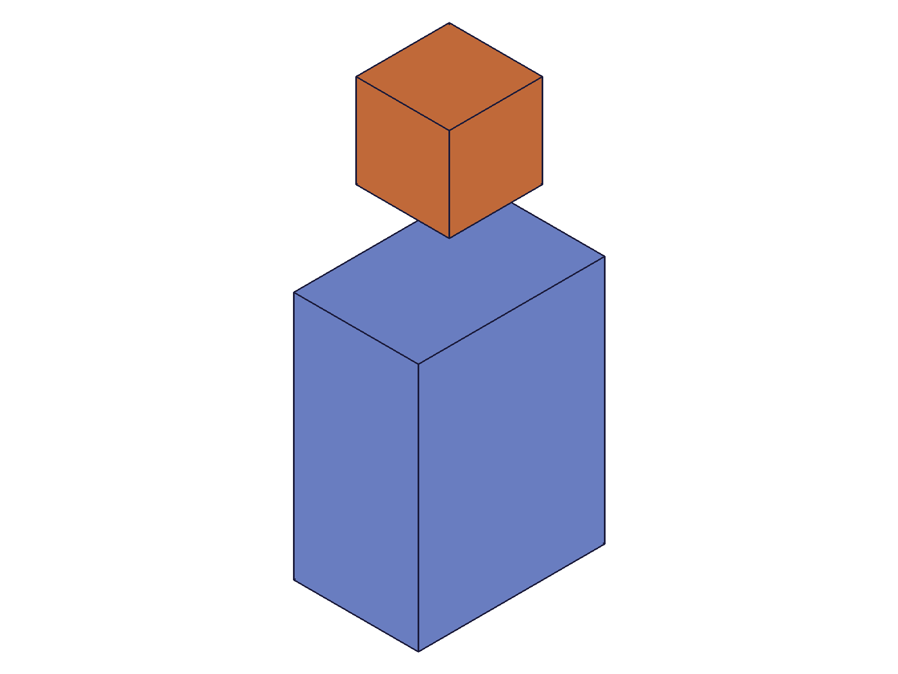

# Training: common.transformObjectWithMatrix

**Date:** 2026-04-17

## Goal

Testing `v1.common.transformObjectWithMatrix` — transforms an object with a 4×4 matrix.

**Methods to cover:**

- `transformObjectWithMatrix` — basic translation via identity + offset
- `transformObjectWithMatrix` — rotation via rotation matrix
- `transformObjectWithMatrix` — combined rotation + translation
- `transformObjectWithMatrix` — `isGlobal: TRUE` (default) vs `isGlobal: FALSE`
- `transformObjectWithMatrix` — on different object types (solid, EIF, part, sketch, work geometry, part feature)
- `transformObjectWithMatrix` — cumulative vs absolute behavior (is it cumulative like solid.translation or absolute like setObjectCoordSystem?)
- `transformObjectWithMatrix` — scaling in the matrix (does it work? the docs don't mention restrictions)
- `transformObjectWithMatrix` — non-orthogonal matrix (shear)
- `transformObjectWithMatrix` — identity matrix (no-op)
- `transformObjectWithMatrix` — singular/degenerate matrix (error handling)

**Questions:**

- Is `transformObjectWithMatrix` cumulative or absolute?
- Does `isGlobal: FALSE` transform in the object's local coordinate system?
- Does the matrix support scaling, or only rigid-body transforms?
- How does it compare to `setObjectCoordSystem` (absolute coord system set)?
- What happens with singular matrices or non-orthogonal matrices?
- Does it work on all the same object types as `setObjectCoordSystem`?

---

## 01 — basic translation

Script: `scripts/01-basic-translation.mjs` — ✅ Translation via identity + [100, 50, 0] offset works. maxLevel=31, result=null.

|  |  |
|---|---|

**Data:** Response `files/01-basic-translation-translation-response.json` — result: null, messages: [], maxLevel: 31.

## 02 — rotation

Script: `scripts/02-rotation.mjs` — ✅ 90° Z rotation works. Box proportions visibly changed from wide (60×20) to tall (20×60).

|  |  |
|---|---|

**Data:** maxLevel=31. Rotation matrix `[[0,-1,0,0],[1,0,0,0],[0,0,1,0],[0,0,0,1]]` correctly rotated the 60×20×30 box — before: flat/wide, after: tall/narrow.

## 03 — combined rotation + translation

Script: `scripts/03-combined.mjs` — ✅ 45° Z rotation + [50,50,0] translation in one matrix works.

|  |
|---|

**Data:** maxLevel=31. Box both rotated (diagonal orientation visible) and displaced from reference.

## 04 — cumulative behavior (critical finding)

Script: `scripts/04-cumulative.mjs` — ✅ **CUMULATIVE, not absolute.** Two identical [50,0,0] translations stack.

|  |  |  |
|---|---|---|

**Data:** STEP export (`files/04-cumulative-cumulative-step.txt`) shows box vertices at X=80..120 after two translations. Original box was centered at X=0 (span -20..20). After first +50: span 30..70. After second +50: span 80..120. Confirmed cumulative.

**Learned:** `transformObjectWithMatrix` is cumulative — each call composes with the current state. This is fundamentally different from `setObjectCoordSystem` which is absolute/idempotent.
**📌 LLM doc:** Cumulative behavior is the single most important distinction from `setObjectCoordSystem`. Must document prominently.

## 05 — identity matrix

Script: `scripts/05-identity.mjs` — ✅ Identity matrix is a no-op. STEP files before/after are identical (9781 bytes each).

**Data:** maxLevel=31. `files/05-identity-identity-step-before.txt` and `files/05-identity-identity-step-after.txt` byte-identical.

## 06 — isGlobal=FALSE (first test)

Script: `scripts/06-isglobal-false.mjs` — After global 90° rotation, a local [50,0,0] translation with `isGlobal: false` moved in global X (not local X). STEP data: X changed from -10 to 40 (+50 in global X), Y unchanged at ±30.

**Data:** `files/06-isglobal-false-step-after-global.txt` vs `files/06-isglobal-false-step-after-local.txt`: X shifted +50 in global coords. Not in local direction.

**Learned:** `isGlobal: FALSE` does NOT use the rotated geometry orientation as the local frame. The local frame appears unaffected by prior `transformObjectWithMatrix` calls. Further testing in script 15-16.

## 07 — uniform 2× scaling

Script: `scripts/07-scaling.mjs` — ✅ Uniform 2× scale matrix works. No error.

**Data:** STEP coords: before (-20, 15, -10) → after (-40, 30, -20). Every coordinate exactly doubled. maxLevel=31.

**Learned:** `transformObjectWithMatrix` supports scaling — not limited to rigid-body transforms. This is more general than `curve.transformShape` which requires orthogonal matrices.
**📌 LLM doc:** Scaling support is a key capability.

## 08 — shear (non-orthogonal matrix)

Script: `scripts/08-nonorthogonal.mjs` — ⚠️ Shear matrix rejected with error, but geometry still changed (auto-corrected).

**Data:** maxLevel=51 (ERROR). Message: `"Solid: Transformationmatrix of this object has been set to be uniformed scaled and orthogonal"`. STEP coords changed: X from -20 to -22.36 (= -20 × √1.25). The server orthogonalized the shear matrix.

|  |
|---|

**Learned:** Non-orthogonal (shear) matrices are auto-corrected to uniform-scaled orthogonal. Error reported but geometry DOES change — to the corrected matrix, not the requested one. This is a dangerous silent correction.
**📌 LLM doc:** Document shear auto-correction behavior.

## 09 — singular/degenerate matrices

Script: `scripts/09-singular-matrix.mjs` — Three degenerate matrix types tested:

1. **Zero matrix:** ERROR code 1014 — "The provided matrix is left-handed. This is not yet supported"
2. **Projection matrix** (z=0 row): Same error code 1014 — "left-handed"
3. **Bad bottom row** [0,0,0,0]: ERROR — "Matrix kann nicht invertiert werden" (German: "matrix cannot be inverted") — internal error from GenericVectorMath.cpp

**Data:** All three in `files/09-singular-matrix-*-response.json`.

**Learned:** Left-handed matrices (det ≤ 0 in upper 3×3) → error code 1014. Non-invertible full 4×4 → internal inversion error. Both fail gracefully.
**📌 LLM doc:** Document error codes and causes.

## 10 — mirror (reflection)

Script: `scripts/10-mirror.mjs` — ❌ Mirror matrix rejected. ERROR code 1014 — "left-handed".

**Data:** `files/10-mirror-mirror-response.json`. maxLevel=51. Mirror across YZ plane (negate X) has det=-1 → left-handed.

**Learned:** Mirror/reflection transforms are not supported. Use `solid.mirror` instead.
**📌 LLM doc:** No reflection/mirror via matrix. Use dedicated APIs.

## 11 — non-uniform scaling (3×X)

Script: `scripts/11-nonuniform-scale.mjs` — ✅ Non-uniform scaling works without error.

**Data:** STEP before: X=-20, after: X=-60 (3× in X). Y and Z unchanged. maxLevel=31 (no error). The matrix `[[3,0,0,0],[0,1,0,0],[0,0,1,0],[0,0,0,1]]` is diagonal → orthogonal (perpendicular columns) despite non-uniform magnitudes.

**Learned:** Non-uniform scaling via diagonal matrices is accepted — the orthogonality check is about column perpendicularity, not magnitude uniformity.
**📌 LLM doc:** Both uniform and non-uniform diagonal scaling work.

## 12 — EIF container transform

Script: `scripts/12-on-eif-container.mjs` — ✅ Transforming EIF moves all children together.

|  |  |
|---|---|

**Data:** maxLevel=31. Both boxes inside the EIF rotated 90° and translated together. Clear visual confirmation — the orange cube moved from right side to on top.

## 13 — part feature and part

Script: `scripts/13-on-part-feature.mjs` — ✅ Both `part.box` feature and part itself accept `transformObjectWithMatrix`.

**Data:** Both returned maxLevel=31. Single-body snapshots look identical due to auto-scaling (pure translation on a single body).

## 14 — work geometry

Script: `scripts/14-on-work-geometry.mjs` — ✅ Work plane, work axis, and work point all accept transforms.

**Data:** All three returned maxLevel=31 with empty messages.

## 15 — isGlobal with explicit OCS

Script: `scripts/15-isglobal-with-ocs.mjs` — After `setObjectCoordSystem` rotated OCS 90°, global translate [50,0,0] and local translate [50,0,0] both moved in global X.

**Data:** `files/15-isglobal-with-ocs-step-after-global-translate.txt` and `files/15-isglobal-with-ocs-step-after-local-translate.txt` — both show X=40 (from -10 + 50). Y unchanged.

## 16 — isGlobal direct A/B comparison

Script: `scripts/16-isglobal-comparison.mjs` — ✅ Definitive test: two fresh boxes, same OCS rotation, one with isGlobal=TRUE, one with isGlobal=FALSE. Identical result.

**Data:** First point both: `(40., -30., -15.)`. Same? true.

**Learned:** `isGlobal` has no observable effect on standalone objects (solids, entity injections) even after explicit OCS changes. Likely only meaningful for assembly instances. The doc example uses `id: instance` hinting at assembly context.
**📌 LLM doc:** Document isGlobal limitation — no effect on standalone objects.

---

## Summary of Answers

1. **Cumulative or absolute?** — **Cumulative.** Each call composes with current state. Two translations of [50,0,0] move to [100,0,0].
2. **isGlobal: FALSE?** — Has no observable effect on standalone objects. Likely assembly-instance only.
3. **Scaling support?** — Yes. Both uniform and non-uniform diagonal scaling work. Shear (non-orthogonal) is auto-corrected with error.
4. **vs setObjectCoordSystem?** — `transformObjectWithMatrix` is cumulative and supports scaling. `setObjectCoordSystem` is absolute and does not.
5. **Singular/degenerate matrices?** — Left-handed (det ≤ 0) → error 1014. Non-invertible → internal error. Both fail gracefully.
6. **Object types?** — Works on solids, EIF containers, part features, parts, work planes, work axes, work points. Container transforms move all children.
