# Training: part.extrusion

**Date:** 2026-04-17

## Goal

Testing `v1.part.extrusion` — the feature-level extrusion that lives in the design tree (unlike `solid.extrusion` which is a direct operation in an EIF).

**Methods to cover:**

- `extrusion` — create from sketch region
- `extrusion` — create from sketch contour elements (line IDs)
- `extrusion` params: `references`, `type` (UP, DOWN, SYMMETRIC, CUSTOM), `limit1`, `limit2`, `taperAngle`, `direction`, `capEnds`, `name`
- Expression-driven parameters (`limit2: '@expr.H'`)

**Questions:**

- Does `references` accept sketch region IDs, individual sketch line IDs, or both? → **Both work**
- How do the four types (UP/DOWN/SYMMETRIC/CUSTOM) differ in extrusion direction? → **UP=+normal, DOWN=-normal, SYMMETRIC=split, CUSTOM=user direction**
- What does `limit1` do for CUSTOM vs other types? → **Only used for CUSTOM; defines start offset**
- Does `taperAngle` work for all types? → **Yes**
- What does `capEnds: FALSE` produce (sheet body)? → **Open-ended shell, no top/bottom faces**
- What happens with zero or negative `limit2`? → **Zero=degenerate (error 1122), negative=valid (reverses direction)**
- How does `direction` interact with CUSTOM type? → **Direction sets sweep vector; must not be perpendicular to sketch normal**
- Can you extrude from a circle sketch region? From a complex profile? → **Yes, circle→cylinder, tapered circle→cone**

---

## 01 — basic extrusion without planeId

Script: `scripts/01-basic-region.mjs` — ⚠️ Sketch created without `planeId` produces maxLevel=51 error on extrusion, but geometry IS created.

**Data:** result=96 (feature ID returned), maxLevel=51, error: `Sketch.GetNormal:CCObject can not be opened` (see `files/01-basic-region-extrusion-response.json`).

| 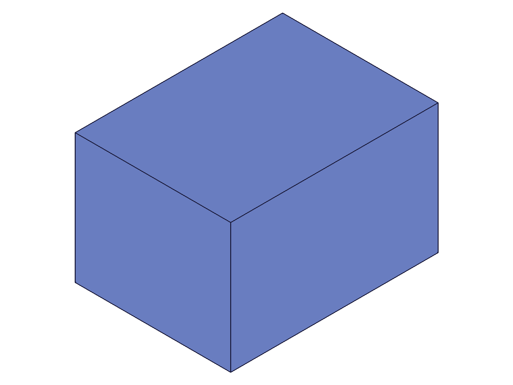 |
|---|

**Learned:** Without `planeId` on the sketch, `part.extrusion` produces an ERROR-level message about `Sketch.GetNormal`, but the feature is still created and geometry renders. This is a trap — always set `planeId`.
**📌 LLM doc:** Sketch must have `planeId` set for clean extrusion.

---

## 02 — region vs line IDs as references

Script: `scripts/02-with-planeId.mjs` — ✅ Both region IDs and line IDs work as `references`.

**Data:** Region extrusion: result=96, maxLevel=31. Line extrusion: result=212, maxLevel=31 (see `files/02-with-planeId-region-extrusion.json`, `files/02-with-planeId-lines-extrusion.json`).

| 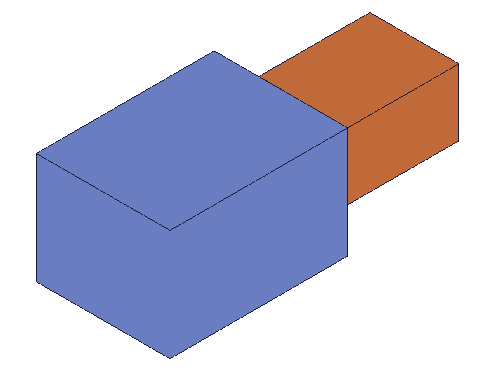 |
|---|

**Learned:** `references` accepts both sketch region IDs (from `sketch.sketchRegion`) and sketch contour element IDs (individual line IDs from `sketch.rectangle`, etc.). Both produce clean geometry.
**📌 LLM doc:** Document both reference types.

---

## 03 — extrusion types (UP, DOWN, SYMMETRIC, CUSTOM)

Script: `scripts/03-types.mjs` — ✅ All four types succeed (maxLevel=31).

**Data:** UP=216, DOWN=261, SYMMETRIC=306, CUSTOM=351 — all maxLevel=31 (see `files/03-types-type-results.json`).

| 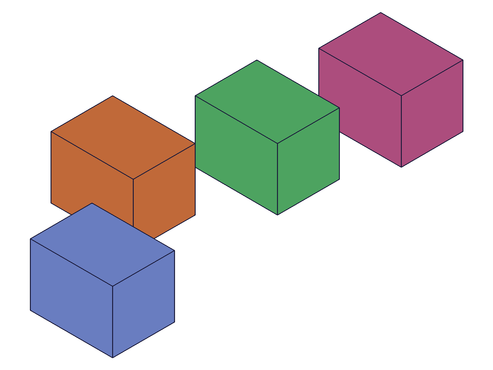 |
|---|

**Learned:** All four types work. Hard to distinguish UP/DOWN/SYMMETRIC visually from isometric view due to auto-scaling and sketch plane position. Verified in script 13 that direction differences are real.
**📌 LLM doc:** Document type enum values.

---

## 04 — taper angle

Script: `scripts/04-taper-angle.mjs` — ✅ Positive, negative, and zero taper angles all work.

**Data:** All maxLevel=31. No taper=96, 10°=181, 30°=266, -10°=343 (see `files/04-taper-angle-taper-results.json`).

| 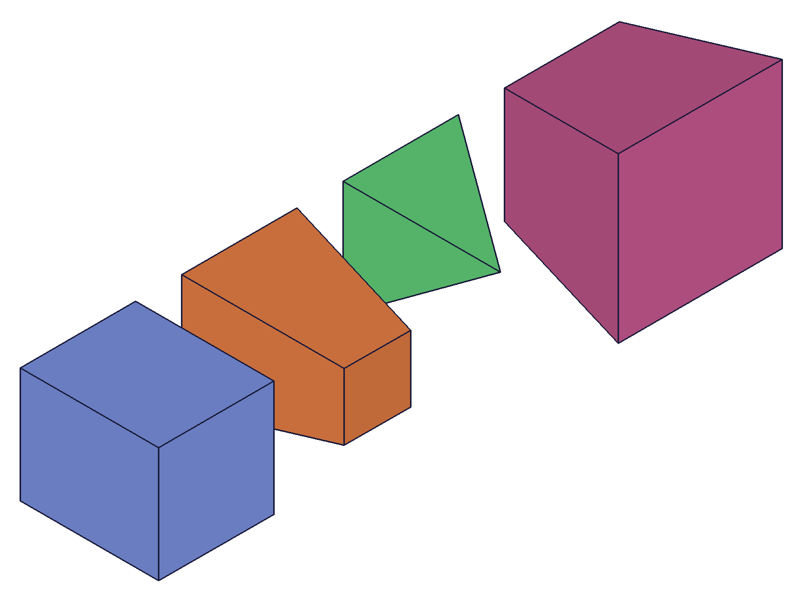 |
|---|

**Learned:** Positive `taperAngle` tapers inward (top face smaller), negative tapers outward (top face larger). Angle is in radians. 30° (~0.5236 rad) produces a near-point top on a 50×50 profile with limit2=60.
**📌 LLM doc:** Document taper direction convention.

---

## 05 — capEnds

Script: `scripts/05-capEnds.mjs` — ✅ `capEnds: 1` (solid) and `capEnds: 0` (sheet) both work. String values ('TRUE'/'FALSE') REJECTED.

**Data:** First attempt with strings: maxLevel=51, error: `"capEnds" has the wrong type! It should be of type (boolean)`. Fixed with integers (1/0): both maxLevel=31 (see `files/05-capEnds-capEnds-results.json`).

| 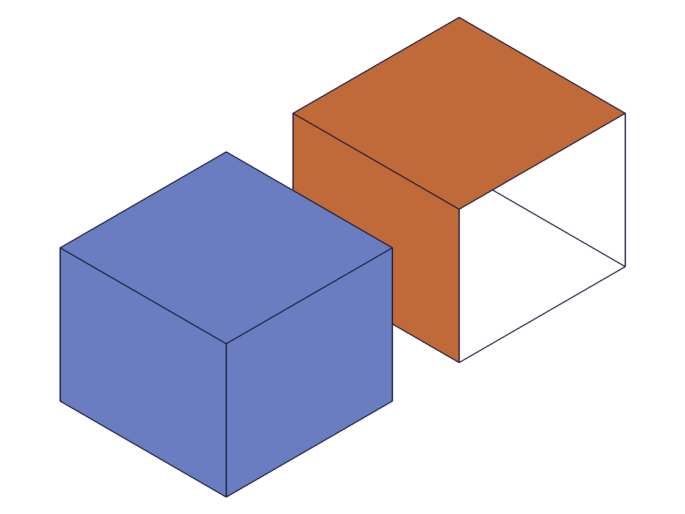 |
|---|

**Learned:** `capEnds` requires integer booleans (1 or 0), not strings. `capEnds: 0` creates a sheet body — open top and bottom, walls only visible.
**📌 LLM doc:** Boolean params are integers, not strings. Sheet body = no caps.

---

## 06 — limit edge cases

Script: `scripts/06-edge-limits.mjs` — Mixed results.

**Data:**
- `limit2=0` → result=96, maxLevel=51: "Height not valid. Value for height must be greater than 0" (degenerate feature)
- `limit2=-20` → result=154, maxLevel=31 (SUCCESS — reverses direction)
- `limit1=30, limit2=10` (CUSTOM, inverted) → result=239, maxLevel=31 (works!)
- `limit2=0.001` → result=324, maxLevel=31 (very thin but valid)
- `limit2` omitted → result=409, maxLevel=31 (defaults to 100)

See `files/06-edge-limits-limit-results.json`.

| 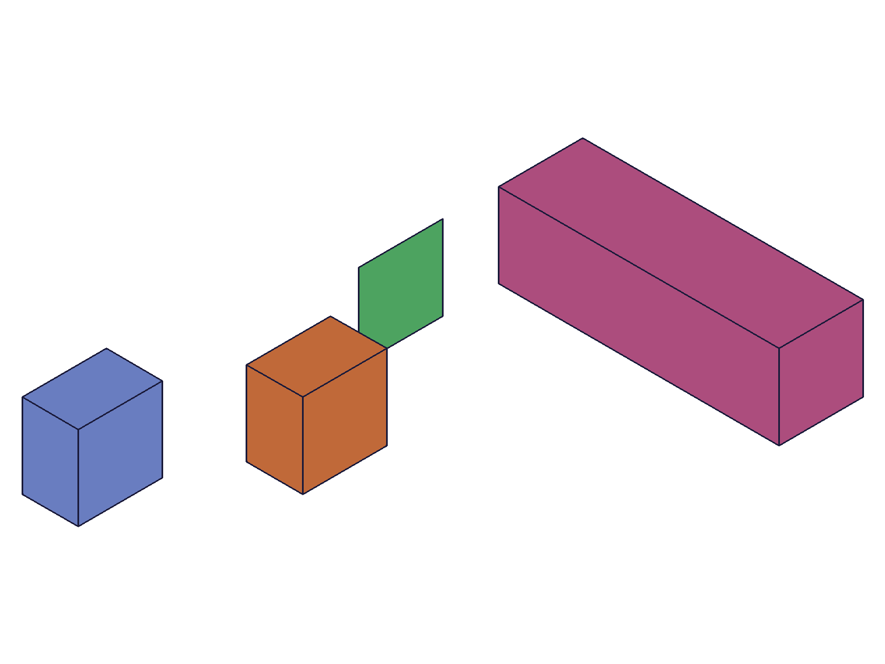 |
|---|

**Learned:** Negative limit2 is valid and reverses the extrusion direction. Zero produces degenerate feature (error 1122). Inverted limit1>limit2 range works for CUSTOM. Default limit2 is 100.
**📌 LLM doc:** Document negative limit2, zero limit2, and defaults.

---

## 07 — expression-driven parameters

Script: `scripts/07-expressions.mjs` — ✅ `limit2: '@expr.H'` and `taperAngle: '@expr.T'` both work.

**Data:** Extrusion with H=50: result=98, maxLevel=31. After updateExpression H→100 + recalc, getExpression confirms H.value=100 (see `files/07-expressions-expr-extrusion.json`).

| 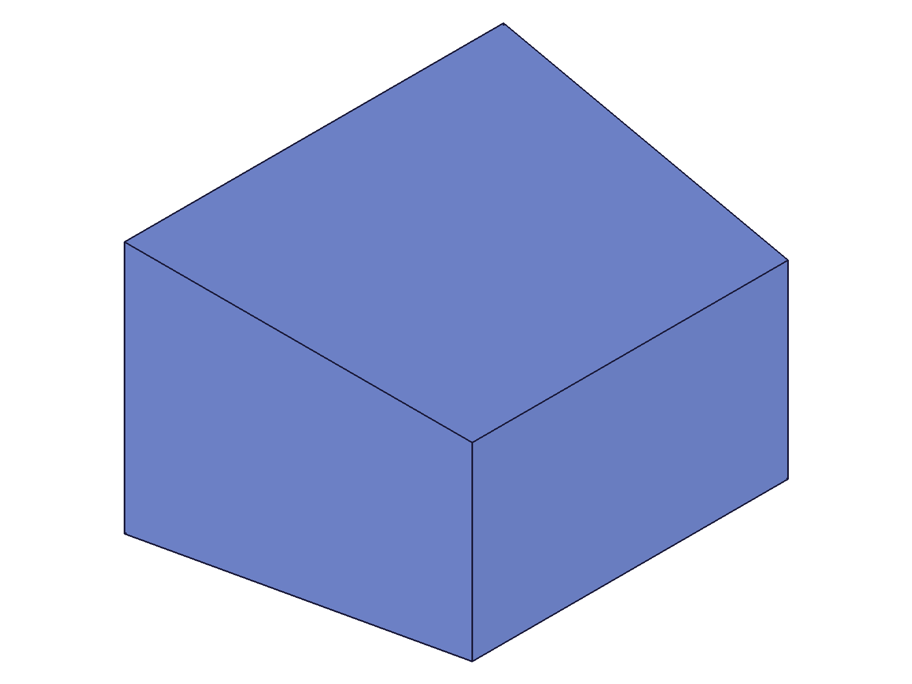 |
|---|

**Learned:** Expression-driven parameters work exactly like primitive features. `@expr.NAME` syntax accepted for `limit2` and `taperAngle`.
**📌 LLM doc:** Document expression syntax for extrusion params.

---

## 08 — CUSTOM direction variants

Script: `scripts/08-custom-direction.mjs` — 4/5 succeed, horizontal fails.

**Data:**
- `[0,0,1]` → maxLevel=31 (vertical, same as UP)
- `[1,0,1]` → maxLevel=31 (diagonal — produces sheared body)
- `[1,0,0]` → maxLevel=51: "Direction can't be perpendicular to the normal vector of sketch plane" (code 1122)
- `[0,0,-1]` → maxLevel=31 (negative Z, same as DOWN)
- `[0,0,10]` → maxLevel=31 (scaled magnitude — no difference from [0,0,1])

See `files/08-custom-direction-direction-results.json`.

| 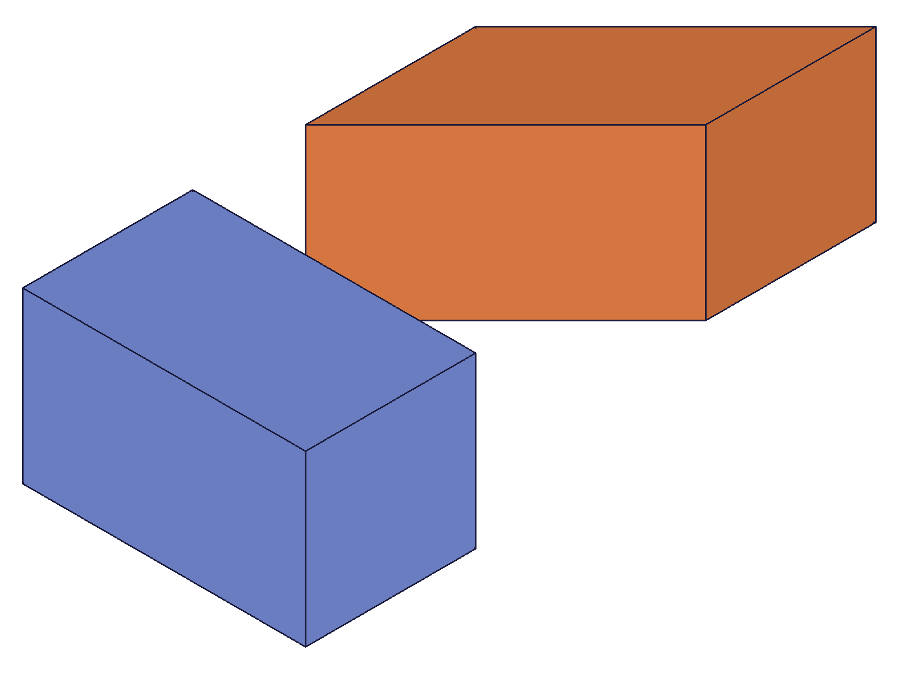 |
|---|

**Learned:** Direction is a unit direction for CUSTOM type — magnitude is irrelevant (unlike `solid.extrusion` where magnitude IS the distance). `limit2` controls distance. Direction cannot be perpendicular to sketch plane normal.
**📌 LLM doc:** Critical: direction magnitude is irrelevant. Direction must have component along sketch normal.

---

## 09 — type parameter verification

Script: `scripts/09-type-verify.mjs` — All types succeed. `getExpression` cannot read feature parameters.

**Data:** UP=96, DOWN=214, SYMMETRIC=363, CUSTOM=543 — all maxLevel=31. `getExpression` on feature ID for 'limit1'/'limit2' returns null for all types (see `files/09-type-verify-type-verify.json`).

**Learned:** Feature parameters (limit1, limit2, etc.) are NOT readable via `getExpression` on the feature ID. They are internal feature properties, not named expressions.

---

## 10 — circle profile extrusion

Script: `scripts/10-circle-profile.mjs` — ✅ Circle → cylinder, tapered circle → cone.

**Data:** Plain circle extrusion: result=65, maxLevel=31. Tapered circle (0.3 rad): result=100, maxLevel=31 (see `files/10-circle-profile-circle-results.json`).

| 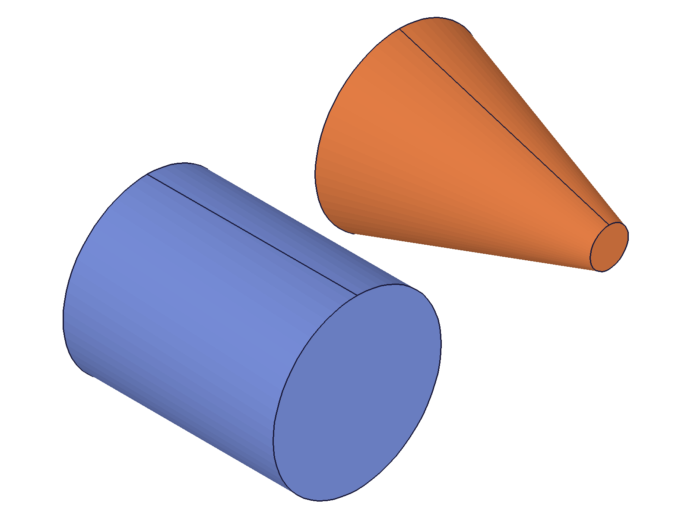 |
|---|

**Learned:** Circle sketch region extrudes into a cylinder. With taper, it produces a cone. Both clean.

---

## 11 — non-XY plane extrusion

Script: `scripts/11-non-xy-plane.mjs` — ✅ Extrusion on Front plane works.

**Data:** Front plane (normal=[0,1,0]) sketch + UP extrusion: result=96, maxLevel=31 (see `files/11-non-xy-plane-front-plane.json`).

| 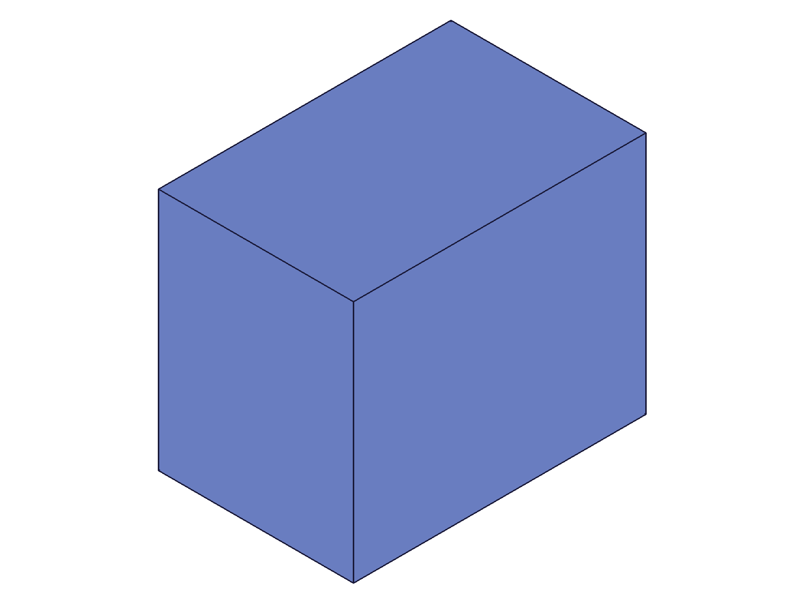 |
|---|

**Learned:** UP/DOWN types follow the sketch plane's normal, not hardcoded Z. Works on any oriented sketch plane.

---

## 12 — error cases (wrong IDs, missing references)

Script: `scripts/12-wrong-ids.mjs` — All error cases caught cleanly.

**Data:**
- Sketch ID as `id` → null, error: "The provided id for the part is not a part id."
- Region ID as `id` → same error
- Empty `references: []` → result=100, maxLevel=51: "Nothing was selected" (broken feature created)
- `references` omitted → null, error: "The parameter 'references' must be provided"
- Single line ref (open) → result=116, maxLevel=51: "Brep after linear sweep not manifold"

See `files/12-wrong-ids-wrong-ids.json`.

**Learned:** `id` must be a part ID. `references` is required (not optional despite bracket notation). Empty references creates a broken feature. Open profiles fail with "not manifold."
**📌 LLM doc:** Document required params and common errors.

---

## 13 — direction with non-CUSTOM types

Script: `scripts/13-direction-non-custom.mjs` — ✅ Direction silently ignored for UP/DOWN.

**Data:** UP+dir=[1,0,1]: maxLevel=31. DOWN+dir=[1,0,1]: maxLevel=31. UP+neg limit2: maxLevel=31. DOWN+neg limit2: maxLevel=31. All produce straight vertical extrusions despite diagonal direction (see `files/13-direction-non-custom-dir-non-custom.json`).

| 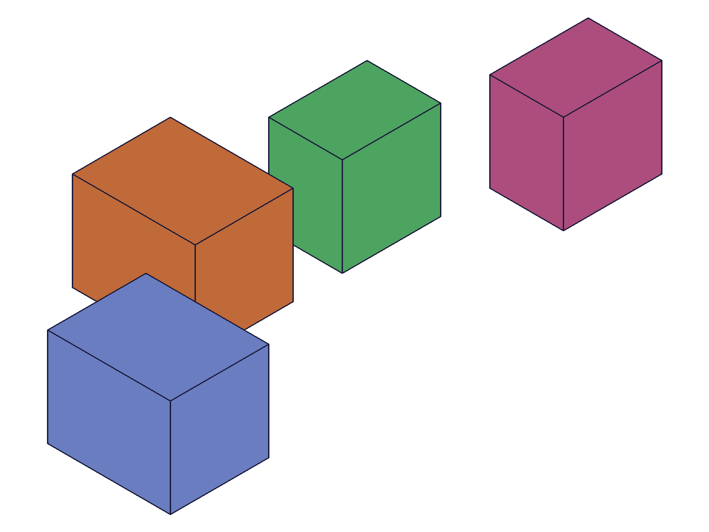 |
|---|

**Learned:** `direction` parameter is silently ignored when `type` is not CUSTOM. No error, no warning. Negative limit2 with UP reverses direction (extrudes downward); negative limit2 with DOWN reverses again (extrudes upward).
**📌 LLM doc:** Direction only used for CUSTOM.

---

## 14 — realistic multi-feature workflow

Script: `scripts/14-realistic-workflow.mjs` — ✅ Box + boss + slot extrusions coexist as separate features.

**Data:** box=54, boss=131, slot=234 — all maxLevel=31 (see `files/14-realistic-workflow-workflow.json`).

| 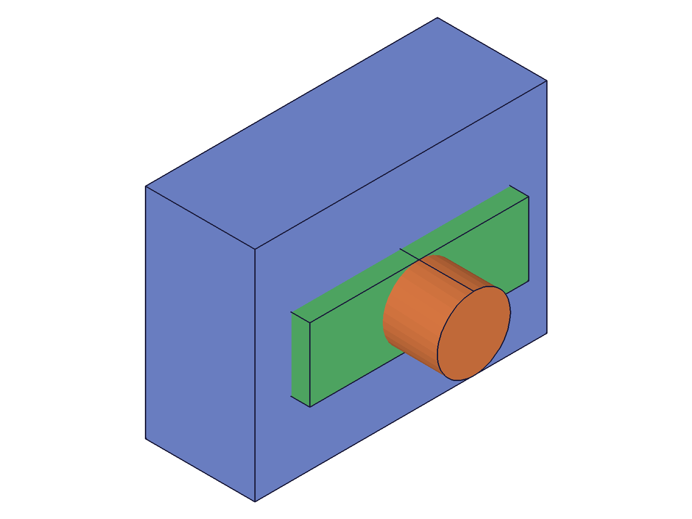 |
|---|

**Learned:** Multiple extrusion features in one part create separate additive bodies (each with distinct color in renderer). Extrusions are purely additive — for subtraction, use `part.boolean` after extrusion.
