# Training: part.cone & part.updateCone

**Date:** 2026-04-17

## Goal

Testing `v1.part.cone` and `v1.part.updateCone` — parametric cone feature creation and update.

**Methods to cover:**

- `cone` — create with defaults
- `cone` params: bDiameter, tDiameter, height, name, references (workCSys)
- `cone` — expression-driven dimensions (`@expr.` syntax, inline math)
- `cone` — edge cases: zero/negative dimensions, tDiameter > bDiameter, tDiameter = bDiameter (cylinder-like)
- `cone` — multiple cones in one part
- `updateCone` — change bDiameter, tDiameter, height, name, references
- `updateCone` — partial updates (omit params, keep existing values)
- `updateCone` — without openFeature (expect failure)
- `updateCone` — expression-driven updates

**Questions:**

- What defaults does `part.cone` use when params are omitted?
- Does `references` work the same as `part.box` (workCSys IDs only)?
- What happens with tDiameter=0 (true cone apex)? The default is 0.1, suggesting 0 might fail.
- What happens with bDiameter=tDiameter (cylinder)?
- Does `updateCone` require open/close pattern like `updateBox`?
- Can you create a cone with inline math expressions?

---

## 01 — defaults

Script: `scripts/01-defaults.mjs` — ✅ cone created with defaults (bDiameter=50, tDiameter=0.1, height=100).

| 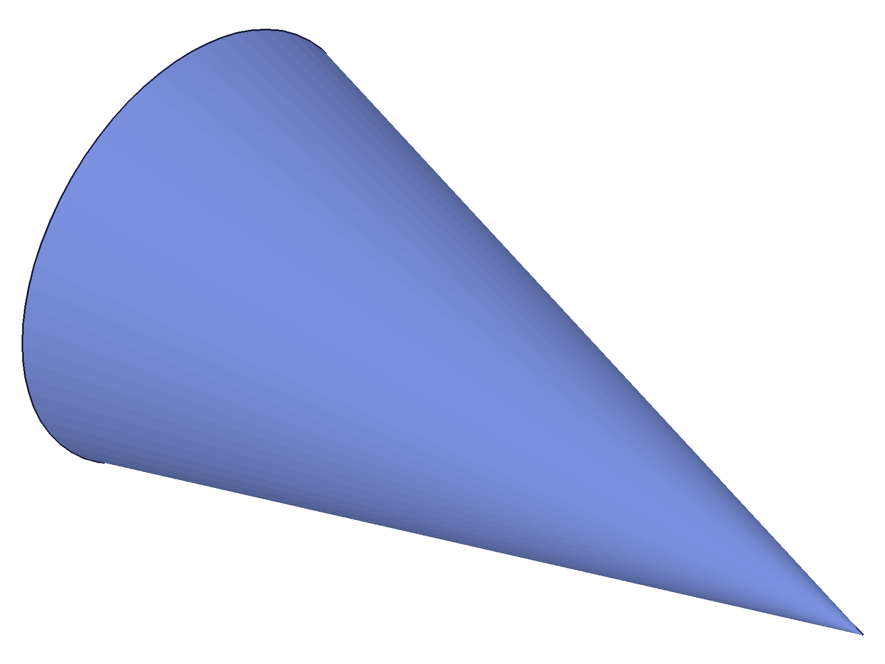 |
|---|

**Data:** result=54 (feature ID), maxLevel=31 (info). The default tDiameter=0.1 produces a near-point apex.

---

## 02 — named with custom dimensions

Script: `scripts/02-named-custom-dims.mjs` — ✅ as documented, custom bDiameter=80, tDiameter=20, height=120.

| 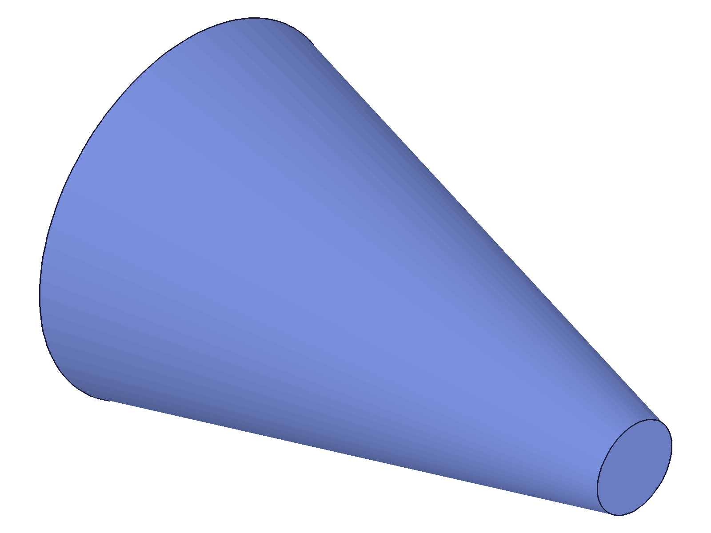 |
|---|

**Data:** result=54, maxLevel=31.

---

## 03 — references (workCSys)

Script: `scripts/03-references-wcsys.mjs` — ✅ two cones: one at origin, one at workCSys (50,50,0).

| 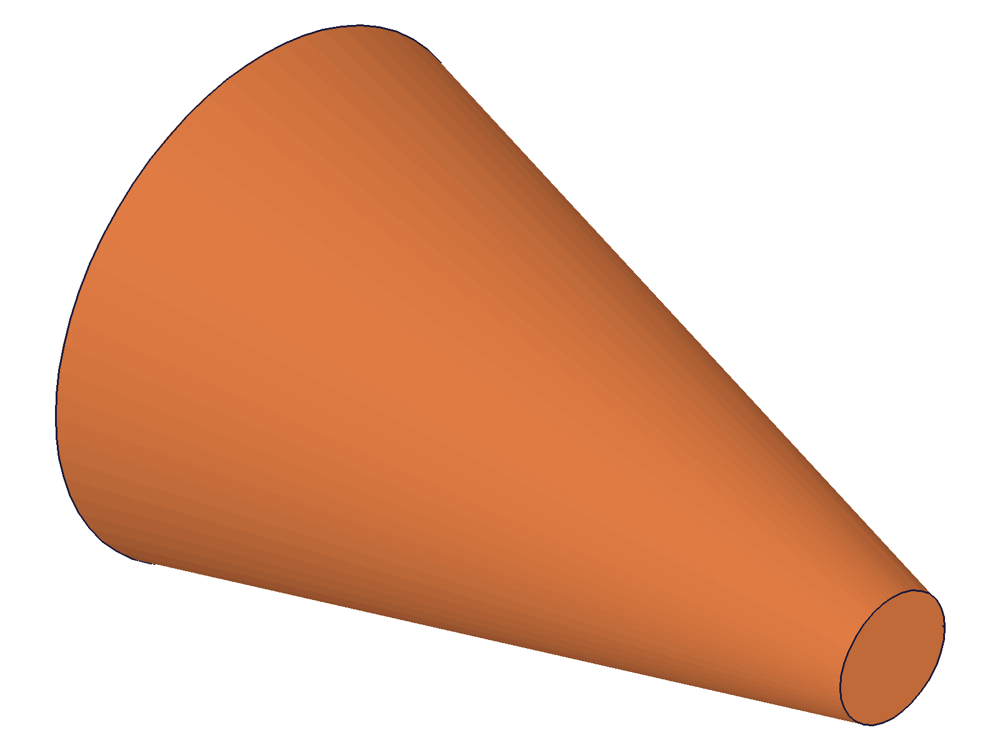 |
|---|

**Data:** c1 result=62, c2 result=81, both maxLevel=31. Two separate features created successfully with distinct colors (per-body coloring visible).

---

## 04 — wrong reference type (workPlane)

Script: `scripts/04-wrong-reference-type.mjs` — ✅ fails as expected with error 1001.

**Data:** result=null, maxLevel=51 (ERROR). Message: `"The parameter \"references\" has a wrong id type! Provide only following id types: [\"workcsys\"]"`, code 1001.

**Learned:** Same behavior as `part.box` — `references` only accepts workCSys IDs.

📌 LLM doc: Document that references only accepts workCSys IDs, error 1001 for wrong type.

---

## 05 — zero and negative dimensions

Script: `scripts/05-zero-negative-dims.mjs` — all four cases produce error 1122 but still return a feature ID (degenerate feature).

**Data:**
- tDiameter=0 → result=54, maxLevel=51, error 1122: "Value for top diameter must be greater than 0"
- bDiameter=0 → result=64, maxLevel=51, error 1122: "Value for bottom diameter must be greater than 0"
- height=0 → result=74, maxLevel=51, error 1122: "Value for height must be greater than 0"
- bDiameter=-50 → result=84, maxLevel=51, error 1122: "Value for bottom diameter must be greater than 0"

**Learned:** All three params must be > 0. The default tDiameter=0.1 exists because tDiameter=0 (true apex) is not valid. A feature ID is returned even on error — the feature exists in the tree but has no valid geometry.

📌 LLM doc: tDiameter=0 is NOT valid — you cannot create a mathematically perfect cone point. All dims must be > 0. Degenerate feature created on error.

---

## 06 — equal diameters (bDiameter = tDiameter)

Script: `scripts/06-equal-diameters.mjs` — ✅ produces a cylinder-like shape (truncated cone with equal ends).

| 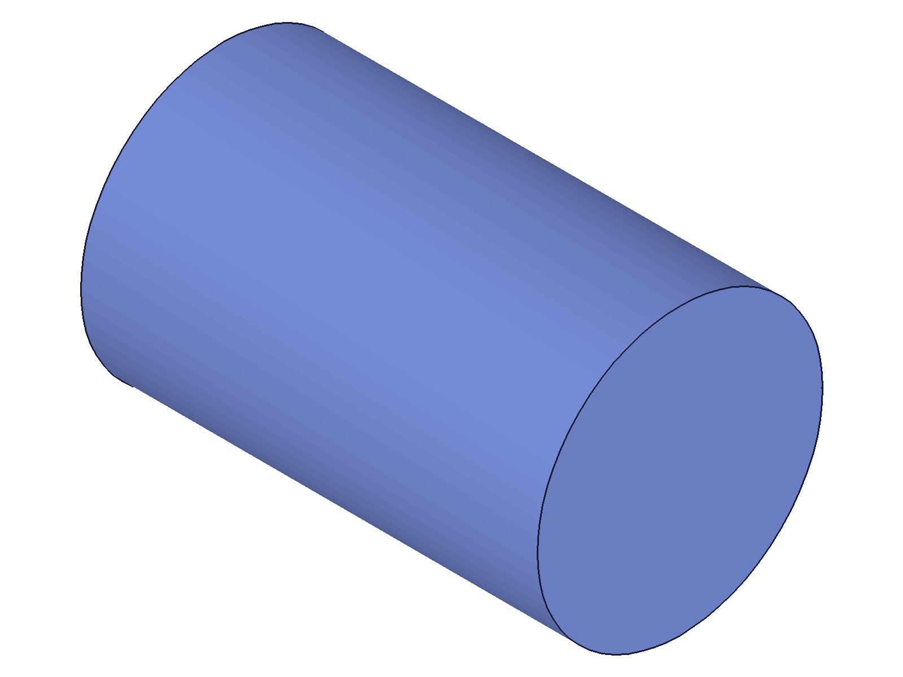 |
|---|

**Data:** result=54, maxLevel=31. Visually confirms a perfect cylinder shape.

📌 LLM doc: bDiameter=tDiameter is valid — produces a cylinder. Use `part.cylinder` instead if this is the intent.

---

## 07 — inverted diameters (tDiameter > bDiameter)

Script: `scripts/07-inverted-diameters.mjs` — ✅ produces an inverted cone (wider at top, narrower at bottom).

| 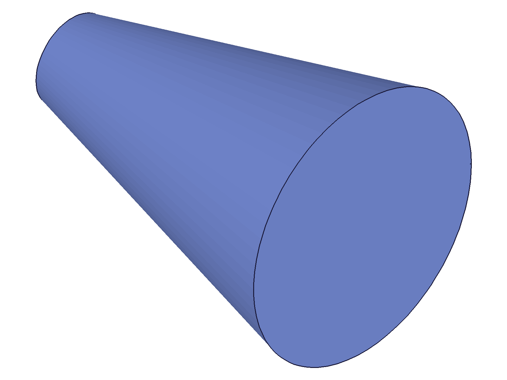 |
|---|

**Data:** result=54, maxLevel=31. Visually confirms the inverted shape. This is valid and expected.

📌 LLM doc: tDiameter > bDiameter is valid — creates an upside-down cone.

---

## 08 — expression-driven dimensions

Script: `scripts/08-expressions.mjs` — ✅ both `@expr.` references and inline math work.

| 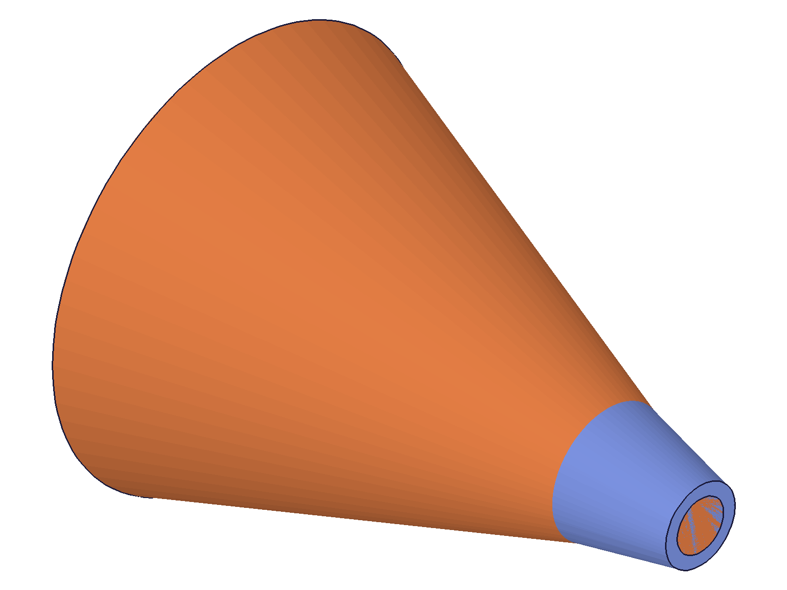 |
|---|

**Data:** exprCone result=56 (maxLevel 31), mathCone result=75 (maxLevel 31). Two cones created with expression-driven dims. Snapshot shows two distinct bodies.

📌 LLM doc: Both `@expr.NAME` and inline math (e.g., `'4*20'`, `'sqrt(100)'`) work for bDiameter, tDiameter, height.

---

## 09 — updateCone basic (open/close pattern)

Script: `scripts/09-updateCone-basic.mjs` — ✅ updateCone works with open/close pattern. Changed bDiameter 60→100, tDiameter 10→40, height 80→150.

| 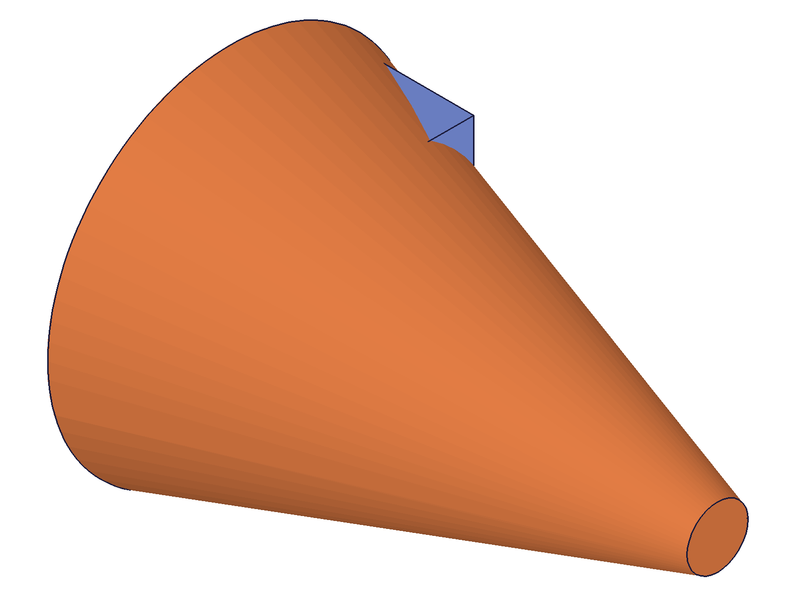 | 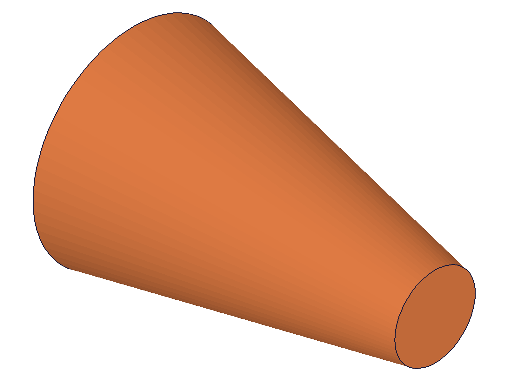 |
| --- | --- |

**Data:** updateCone result=91, maxLevel=31. Reference box (blue, 20x20x20) visible in both frames. After update, cone is visibly larger relative to the reference box — proportions changed from narrow taper to broader frustum. Visual and data agree.

---

## 10 — partial updateCone (omitted params keep existing)

Script: `scripts/10-updateCone-partial.mjs` — ✅ partial update works. Only height changed; bDiameter and tDiameter retained.

**Data:** getExpression returned null for all cone params (bDiameter, tDiameter, height) — `getExpression` does NOT work for reading feature member values. Updated to use structure tree in script 17.

📌 LLM doc: `getExpression` cannot read cone feature parameters. Use the structure tree instead.

---

## 11 — updateCone without openFeature

Script: `scripts/11-updateCone-no-open.mjs` — ✅ fails as expected with errors 1200 + 1004.

**Data:** result=null, maxLevel=51. Messages: error 1200 "The provided feature is not allowed to update. It's not active and open." + error 1004 "\"id\" must be provided for update."

**Learned:** Same open/close gate requirement as all other update APIs.

---

## 12 — updateCone rename

Script: `scripts/12-updateCone-name.mjs` — ✅ renaming works via updateCone.

**Data:** result=54, maxLevel=31. Structure tree saved to verify name change.

---

## 13 — updateCone references (add/remove WCS)

Script: `scripts/13-updateCone-references.mjs` — ✅ can add and remove references via updateCone.

|  |  | 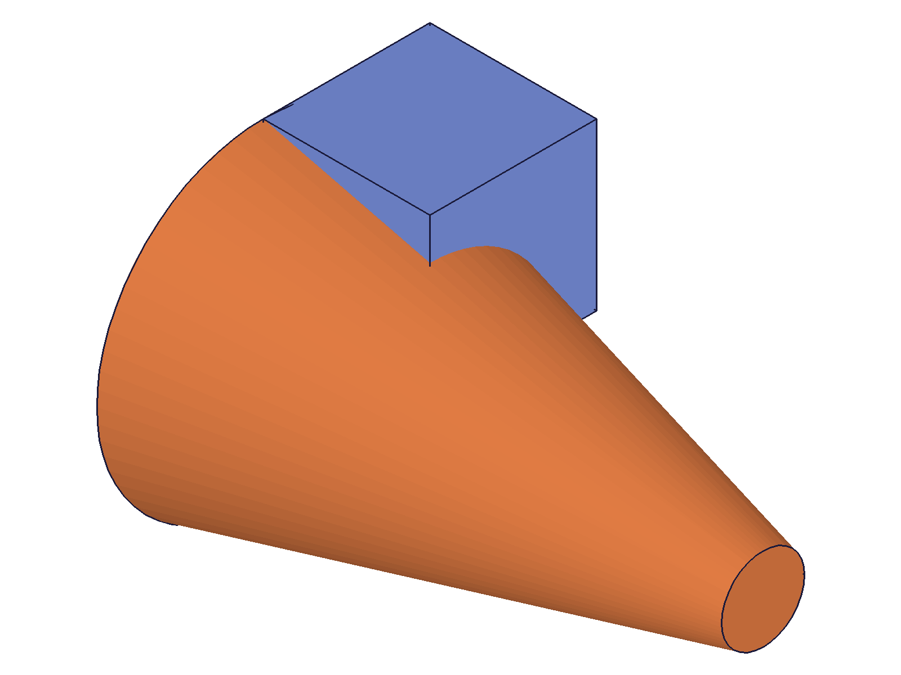 |
| --- | --- | --- |

**Data:** Add ref result=99 maxLevel=31. Remove ref result=99 maxLevel=31. Both operations succeed. The visual difference is subtle due to auto-scaling, but the operations returned success.

📌 LLM doc: Can add (`references: [wcsId]`) or remove (`references: []`) coordinate system placement via updateCone.

---

## 14 — updateCone with expressions + expression change + recalc

Script: `scripts/14-updateCone-expressions.mjs` — ✅ expression-driven update works. After changing named expressions and recalc, cone dimensions update.

|  | 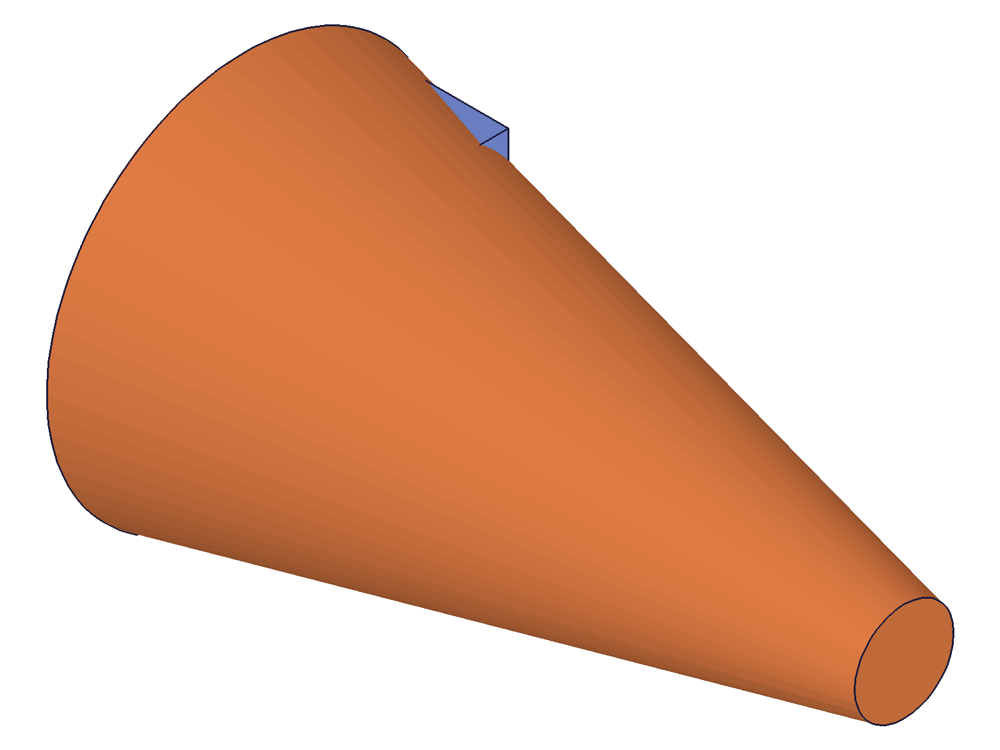 |
| --- | --- |

**Data:** Expression update returned result=93, maxLevel=31. After changing BD from 60→120 and H from 100→200 via updateExpression + recalc, the cone is visually much larger relative to the reference box. The reference box (blue, 20x20x20) shrank to a tiny corner in the after-change snapshot.

📌 LLM doc: Expression-driven cone dimensions update automatically when expressions change + recalc.

---

## 15 — multiple cones in one part

Script: `scripts/15-multiple-cones.mjs` — ✅ three cones with different shapes at different WCS positions.

| 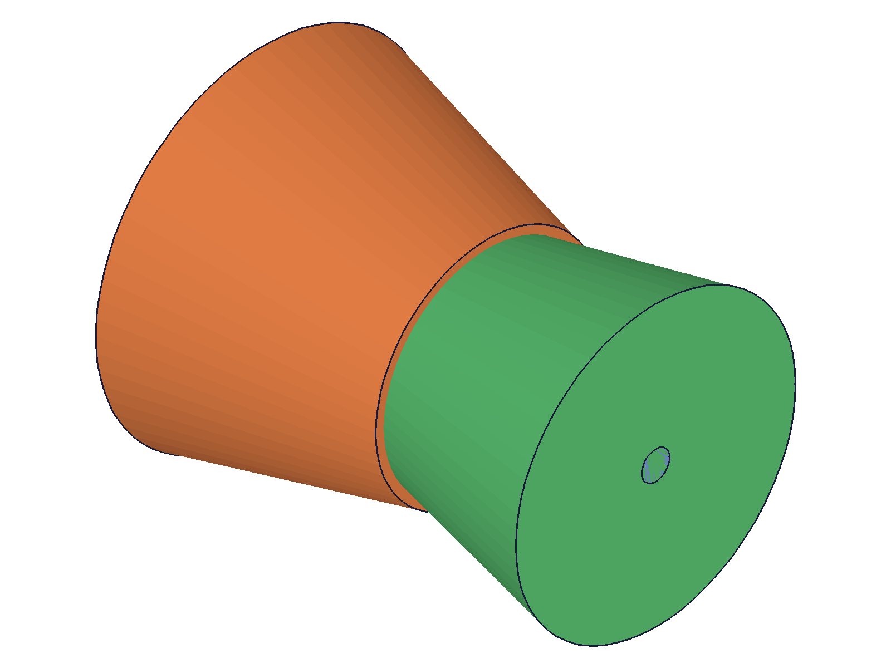 |
|---|

**Data:** c1=78, c2=97, c3=116 — all maxLevel=31. Three distinct bodies visible with different colors (orange inverted cone, green fat cone). Each has its own WCS.

---

## 16 — cone expression names investigation

Script: `scripts/16-cone-expression-names.mjs` — tried 17 candidate expression names for getExpression on a cone feature. All returned null.

**Data:** Structure tree confirms members are named `bDiameter`, `tDiameter`, `height` (matching API params), but `getExpression` doesn't expose them. This is consistent across feature types — `getExpression` reads named expressions created via `part.expression`, not feature member values.

---

## 17 — verify partial update via structure tree

Script: `scripts/17-verify-partial-update.mjs` — ✅ partial update confirmed via structure tree.

**Data:** Before: bD=60, tD=10, h=80. After `updateCone({ height: 200 })`: bD=60, tD=10, h=200. Only height changed — other params preserved. See `files/17-verify-partial-update-partial-verify.json`.

---

## Coverage Checklist

- [x] API called successfully (scripts 01, 02)
- [x] Every required parameter tested (id)
- [x] Key optional parameters exercised (bDiameter, tDiameter, height, name, references)
- [x] Enum values / type variants — N/A (no enum types on cone)
- [x] updateCone tested (scripts 09, 10, 11, 12, 13, 14)
- [x] Realistic usage combining with prerequisites (script 15: multiple cones with WCS)
- [x] Behavioral claims verified with data AND visual evidence
