# Training: part.cylinder & part.updateCylinder

**Date:** 2026-04-17

## Goal

Testing `v1.part.cylinder` and `v1.part.updateCylinder` — parametric cylinder feature creation and update.

**Methods to cover:**

- `cylinder` — create with default params
- `cylinder` params: id, name, diameter, height, references (workCSys)
- `cylinder` with expression-driven dimensions (`@expr.` and inline math)
- `cylinder` edge cases: zero/negative diameter, zero/negative height
- `cylinder` with multiple cylinders in one part
- `updateCylinder` — change diameter, height, name, references after creation
- `updateCylinder` — partial updates (omit some params)
- `updateCylinder` — expression-driven updates
- `updateCylinder` — without openFeature (expect error)

**Questions:**

- Does `cylinder` behave like `box` and `cone` with respect to references, expressions, edge cases?
- What are the exact default values (docs say diameter=100, height=100)?
- Does updateCylinder on a non-cylinder feature silently apply shared params?
- What error codes appear for invalid dimensions?

---

## 01 — basic defaults

Script: `scripts/01-basic-defaults.mjs` — ✅ as documented. Default cylinder created with result=54, maxLevel=31.

| 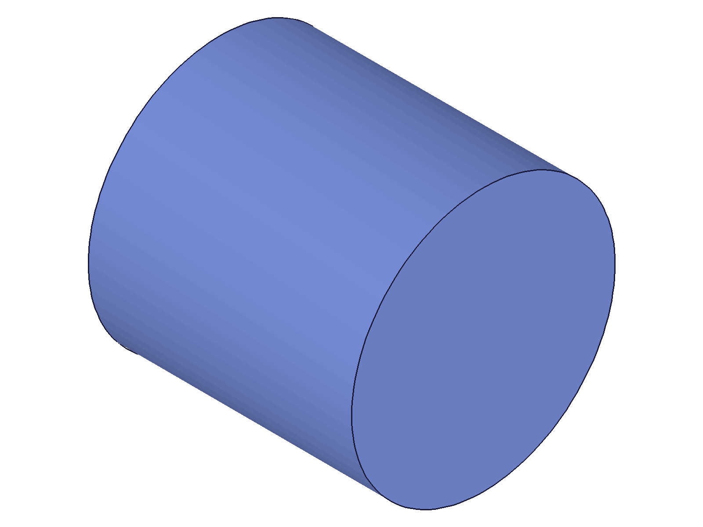 |
|---|

**Data:** result=54, maxLevel=31, messages=[]. Feature ID returned. Default cylinder appears nearly equi-proportional (diameter=100, height=100 per docs).

**📌 LLM doc:** Default values are diameter=100, height=100. Default name is "Cylinder".

## 02 — custom params

Script: `scripts/02-custom-params.mjs` — ✅ custom name, diameter=60, height=120 all accepted. result=54, maxLevel=31.

| 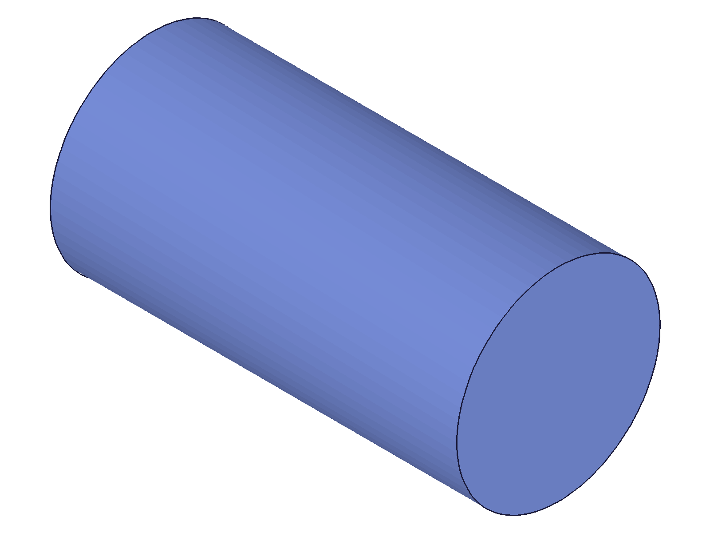 |
|---|

**Data:** result=54, maxLevel=31, messages=[]. Custom dimensions produce a taller, narrower cylinder as expected.

## 03 — WCS references

Script: `scripts/03-references-wcs.mjs` — ✅ cylinder placed at WCS offset (80,0,0). Reference box at origin for visual comparison.

| 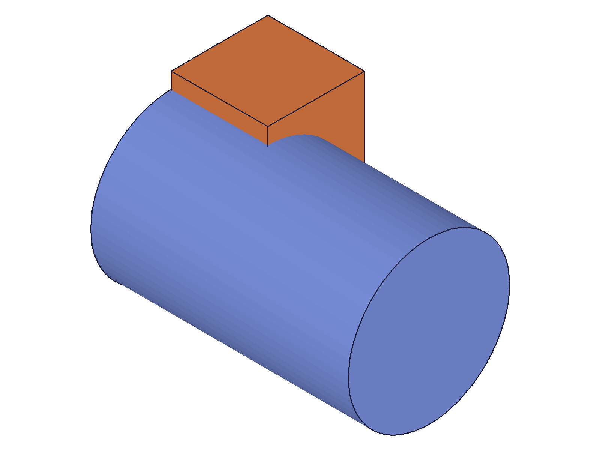 |
|---|

**Data:** wcsId=54, cylId=62, maxLevel=31. The cylinder is clearly offset from the reference box in the snapshot, confirming WCS placement works.

**📌 LLM doc:** `references` accepts workCSys IDs to position the cylinder.

## 04 — bad reference IDs

Script: `scripts/04-references-bad-id.mjs` — ✅ work plane ref rejected, empty ref accepted.

**Data:**
- Work plane ref: result=null, maxLevel=51, error 1001: "wrong id type! Provide only following id types: ['workcsys']"
- Empty ref: result=68, maxLevel=31 — places at drawing origin

**📌 LLM doc:** `references` only accepts workCSys IDs. Work planes, axes, points all rejected with error 1001. Empty array = drawing origin.

## 05 — zero/negative dimensions

Script: `scripts/05-zero-negative-dims.mjs` — ✅ all four cases produce error 1122, but still return feature IDs (degenerate features).

**Data:**
- Zero diameter: result=54, maxLevel=51, code 1122 "Value for diameter must be greater than 0"
- Negative diameter: result=64, maxLevel=51, code 1122 same message
- Zero height: result=74, maxLevel=51, code 1122 "Value for height must be greater than 0"
- Negative height: result=84, maxLevel=51, code 1122 same message

**Learned:** Consistent with box and cone — zero/negative dims create degenerate features (feature ID returned, no valid geometry, maxLevel=51). The feature exists in the tree but has no renderable body.

**📌 LLM doc:** All dimensions must be > 0. Error 1122 for violations. Degenerate feature IDs are still returned.

## 06 — expressions

Script: `scripts/06-expressions.mjs` — ✅ both `@expr.NAME` references and inline math work at creation time.

| 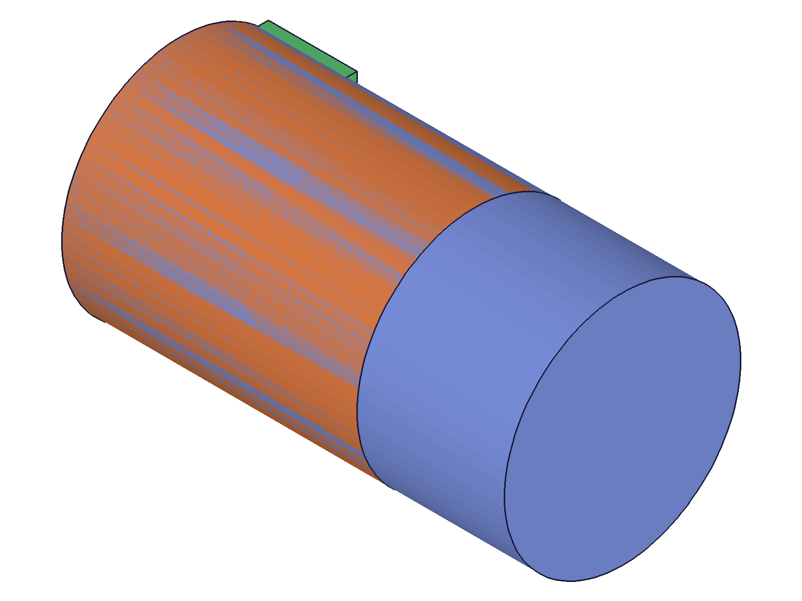 |  |
|---|---|

**Data:**
- `@expr.D` (80) and `@expr.H` (150): result=56, maxLevel=31
- Inline math `'4*20'` and `'sqrt(10000)'`: result=75, maxLevel=31
- After updating D=40 and H=60 + recalc: snapshot shows size change (cylinders + ref box proportions shifted)

**📌 LLM doc:** Expression-driven creation works. `@expr.NAME` and inline math both supported. Updating expressions + recalc propagates to cylinders.

## 07 — multiple cylinders

Script: `scripts/07-multiple-cylinders.mjs` — ✅ three cylinders at different WCS positions.

| 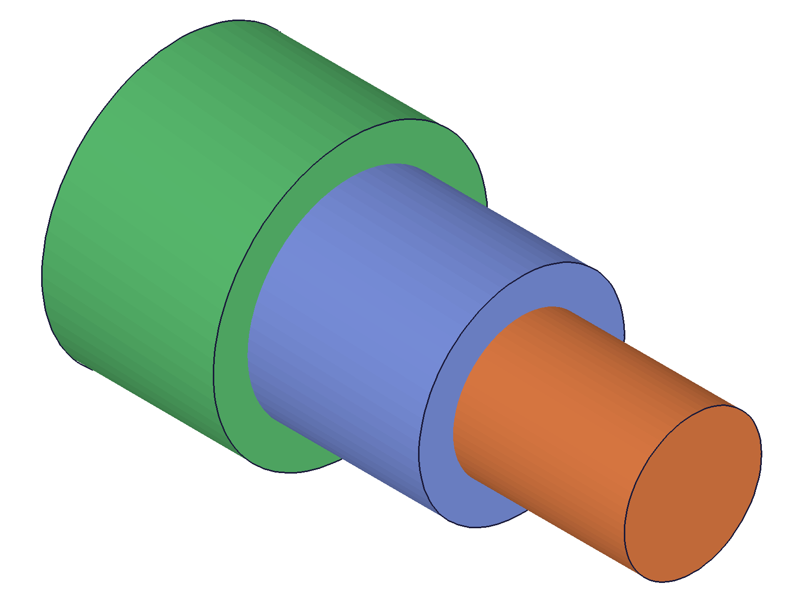 |
|---|

**Data:** cyl IDs: 78, 97, 116. Three distinct bodies visible in snapshot with different sizes and positions. Renderer assigns distinct colors per body.

## 08 — basic update

Script: `scripts/08-update-basic.mjs` — ✅ updateCylinder changes diameter and height via open/close pattern.

| 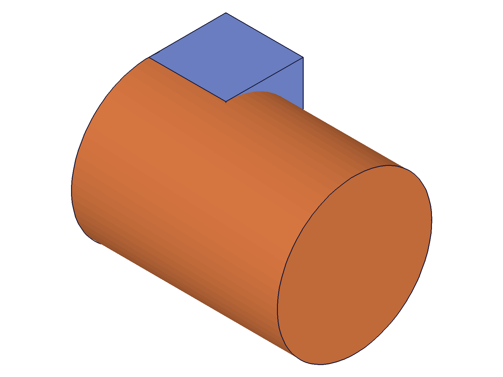 |  |
|---|---|

**Data:** updateCylinder result=91 (same feature ID), maxLevel=31, messages=[]. Before: d=60, h=80 with visible reference box. After: d=100, h=200 — cylinder dominates, box barely visible due to auto-scale.

**📌 LLM doc:** updateCylinder returns the feature ID on success. Geometry regenerates on closeFeature.

## 09 — partial updates

Script: `scripts/09-update-partial.mjs` — ✅ omitted params keep existing values.

|  | 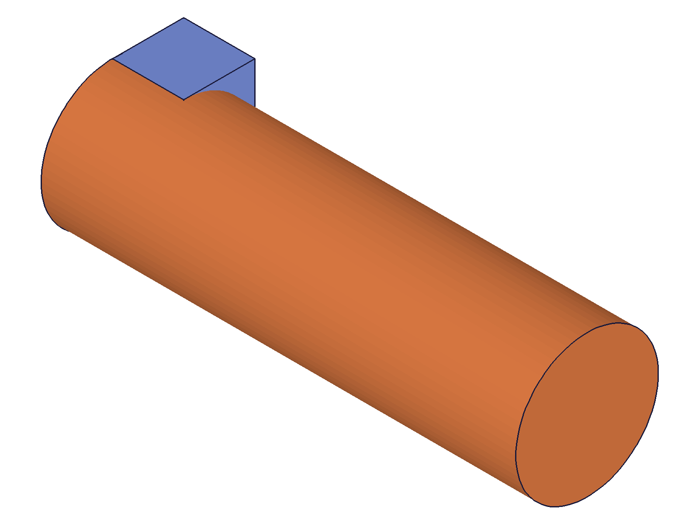 | 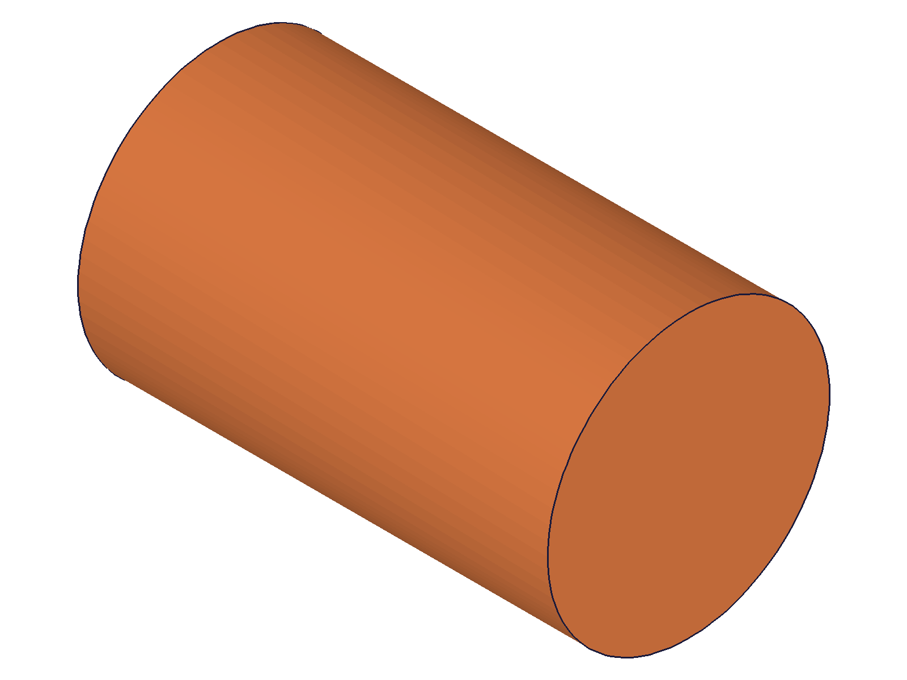 |
|---|---|---|

**Data:** Both partial updates return result=91, maxLevel=31. Height-only update: cylinder becomes taller while diameter unchanged. Diameter-only update: cylinder becomes wider.

**📌 LLM doc:** Partial updates confirmed — omitted params keep current values.

## 10 — update name and references

Script: `scripts/10-update-name-refs.mjs` — ✅ rename + WCS placement via update, then references removal.

|  | 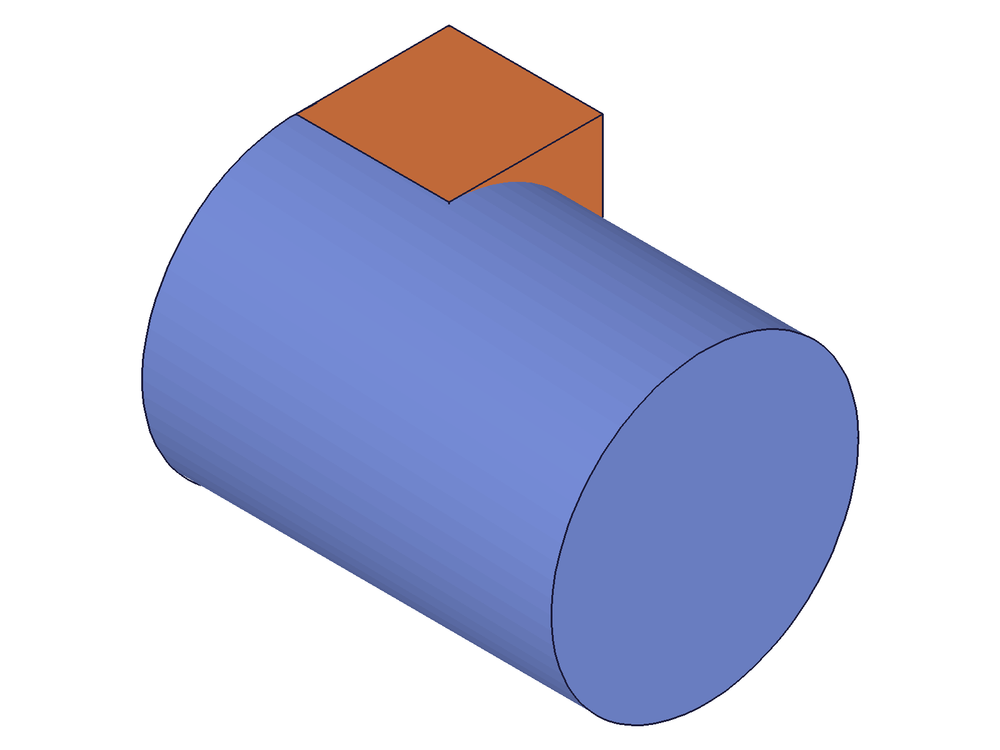 |  |
|---|---|---|

**Data:** rename+move: result=62, maxLevel=31. remove-ref: result=62, maxLevel=31. Cylinder moves to WCS position, then back to origin when references cleared. Visual confirmation: cylinder shifts position relative to reference box.

**📌 LLM doc:** Can add/remove WCS references and rename via updateCylinder. `references: []` resets to drawing origin.

## 11 — update without openFeature

Script: `scripts/11-update-no-open.mjs` — ✅ fails with expected errors.

**Data:** result=null, maxLevel=51. Two errors:
- code 1200: "The provided feature is not allowed to update. It's not active and open."
- code 1004: "id must be provided for update." (misleading — id was provided)

**📌 LLM doc:** Without openFeature: returns null with errors 1200 + 1004. The 1004 is misleading — actual issue is 1200.

## 12 — update with expressions

Script: `scripts/12-update-expressions.mjs` — ✅ can switch from numeric to expression-driven via updateCylinder.

|  |  | 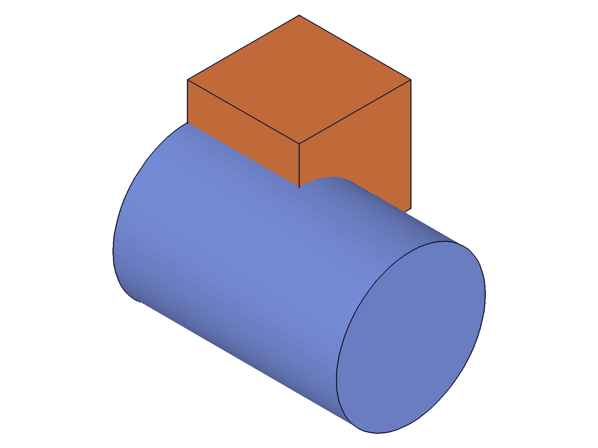 |
|---|---|---|

**Data:** expr update: result=56, maxLevel=31. Three distinct snapshots show: original numeric dims → shrunk after switching to @expr.D=40, @expr.H=60 → expanded after updating D=120, H=200 + recalc. Reference box provides scale comparison.

**📌 LLM doc:** Can switch from numeric to expression-driven dims. Expression changes + recalc propagate.

## 13 — update with zero dimensions

Script: `scripts/13-update-zero-dims.mjs` — ✅ zero diameter update returns error but feature recovers.

|  |  | 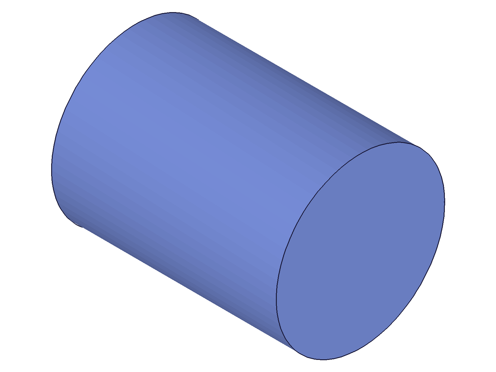 |
|---|---|---|

**Data:** zero diam update: result=54 (feature ID, not null!), maxLevel=51, error 1122. Recovery with valid values: result=54, maxLevel=31. Previous valid geometry preserved during invalid state.

**📌 LLM doc:** Zero/negative update returns feature ID (not null) with error 1122. Feature keeps previous valid geometry. Recoverable with a subsequent valid update.

## 14 — updateCylinder on wrong feature type (box)

Script: `scripts/14-update-wrong-type.mjs` — updateCylinder on a box feature gives error.

| 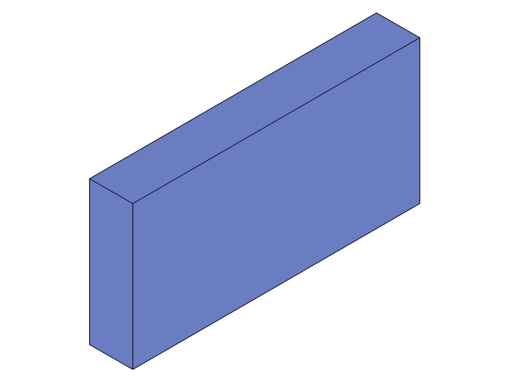 |
|---|

**Data:** result=54 (feature ID returned!), maxLevel=51, code 0: "Evaluation error in Box1.SetOperationParams:[Index 3 ausserhalb des Arraybereichs] not defined !"

**Learned:** Unlike updateBox on non-box features (which silently applies shared params per box.md), updateCylinder on a box triggers an internal error — the cylinder-specific `diameter` param maps to an array index that doesn't exist on the box's internal parameter array. The feature ID is still returned, but with an error. The box geometry appears unchanged in the snapshot.

**📌 LLM doc:** updateCylinder on a non-cylinder feature produces error code 0 with internal "Index out of bounds" message. The cylinder-specific param (`diameter`) doesn't map correctly to other feature types. Always use the matching update method.

## 15 — multiple updates in one open/close session

Script: `scripts/15-update-multi-calls.mjs` — ✅ three sequential updateCylinder calls within one open/close, all succeed.

|  | 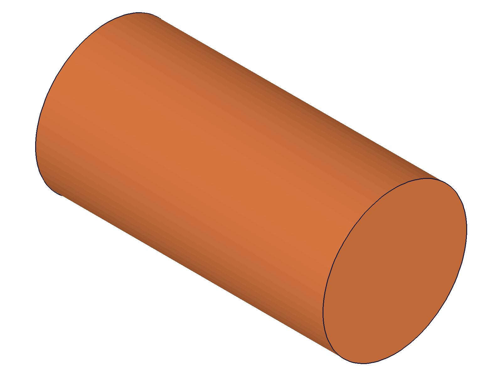 |
|---|---|

**Data:** All three calls return result=91, maxLevel=31. First: diameter=100. Second: height=200. Third: name change. All apply on closeFeature. Snapshot confirms visually larger cylinder after updates.

**📌 LLM doc:** Multiple updateCylinder calls in one open/close session all apply. Only one closeFeature needed at the end.

---

## Coverage Checklist

- [x] The API has been called at least once successfully (scripts 01, 02)
- [x] Every required parameter tested (id — scripts 01-15)
- [x] Key optional parameters exercised (name: 02, diameter: 02, height: 02, references: 03/04)
- [x] Corresponding `updateCylinder` tested (scripts 08-15)
- [x] At least one realistic usage combining API with prerequisites (scripts 03, 06, 07, 10, 12)
- [x] Behavioral claims verified with data AND visual evidence
- [x] Edge cases: zero/negative dims (05, 13), bad references (04), missing openFeature (11), wrong feature type (14)
- [x] Expression support: @expr.NAME and inline math at creation (06) and update (12)
- [x] Partial updates (09), multi-update sessions (15)
