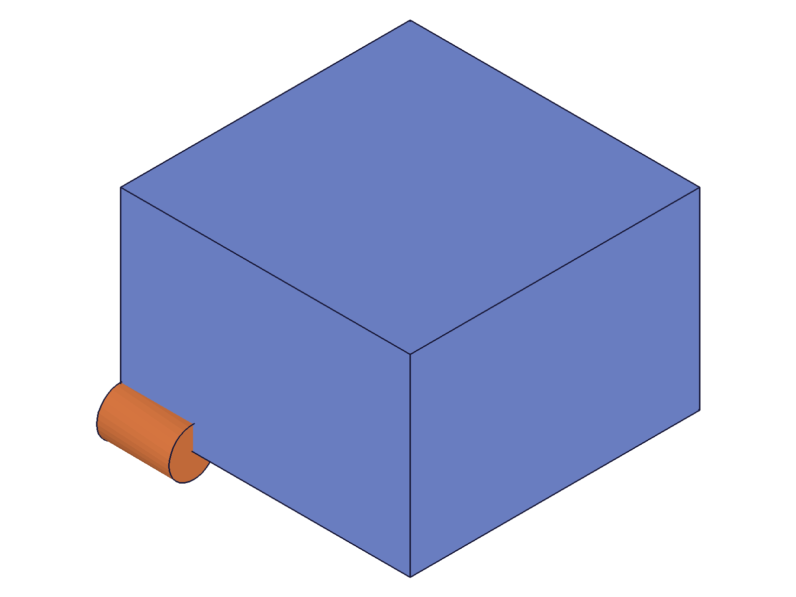
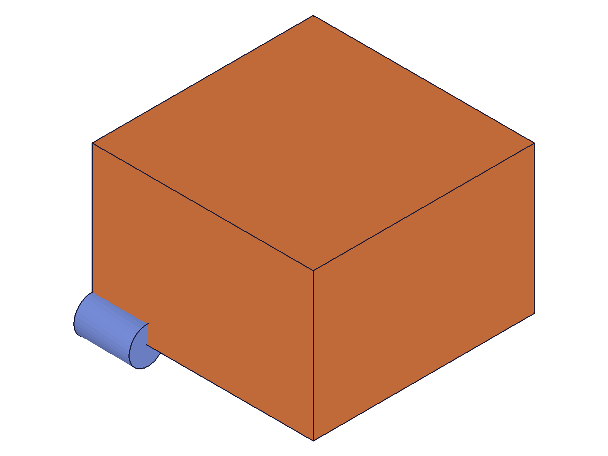
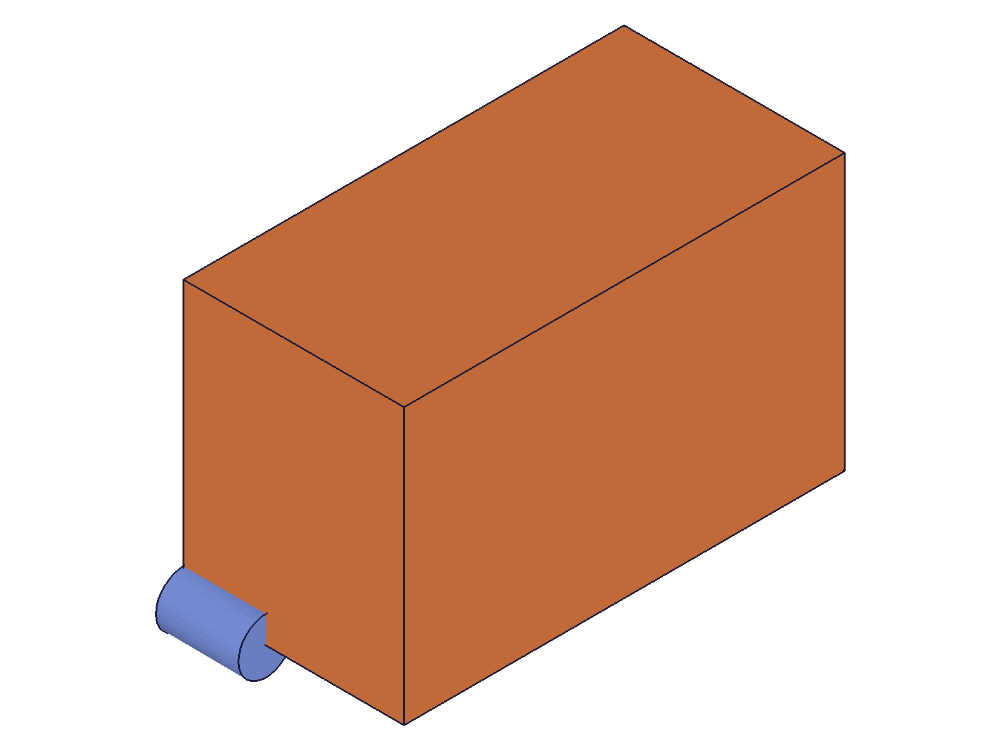
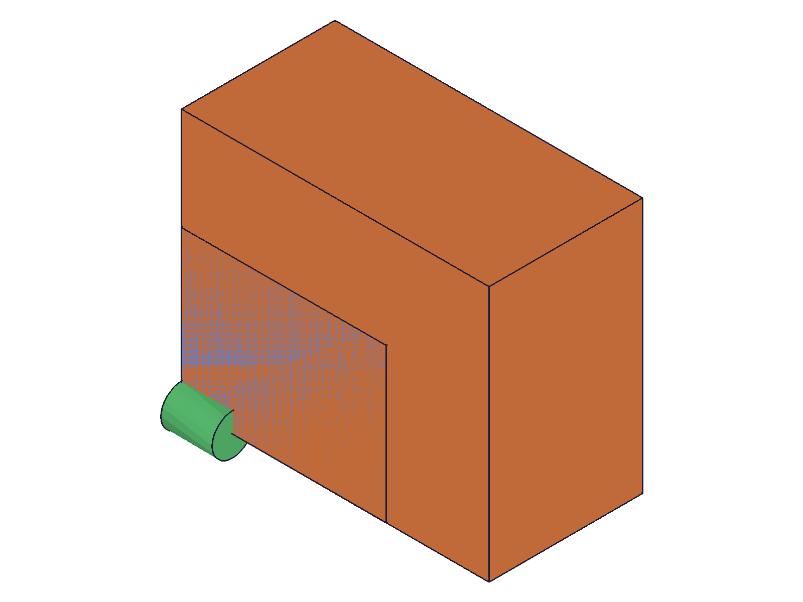
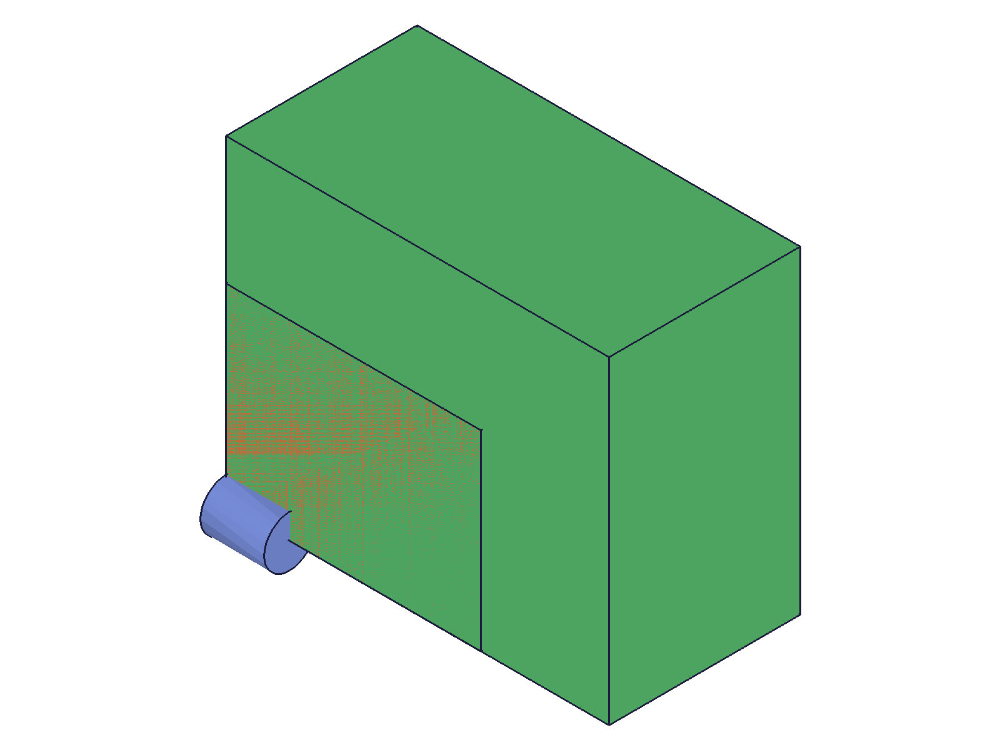
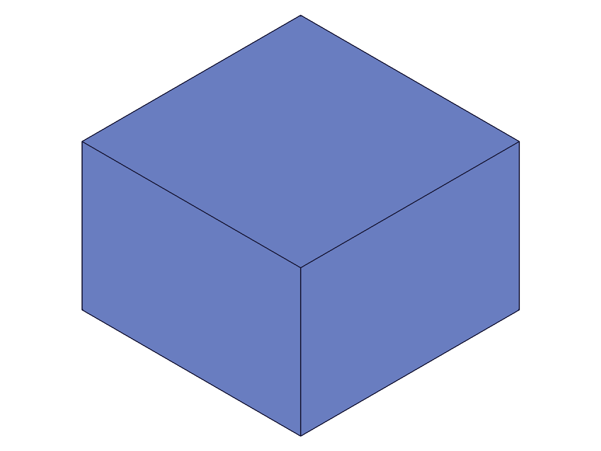
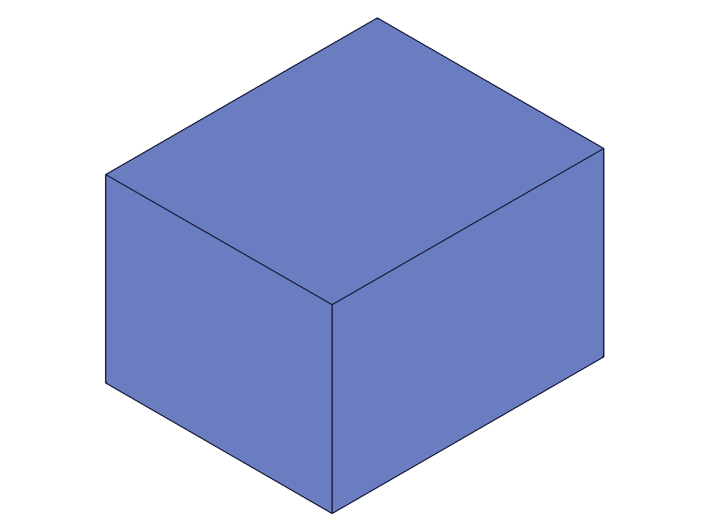
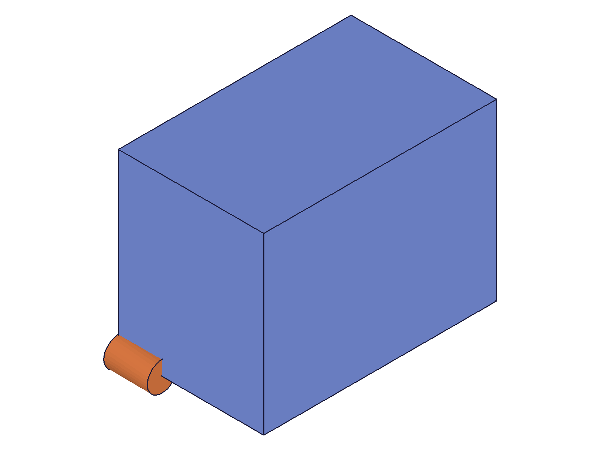
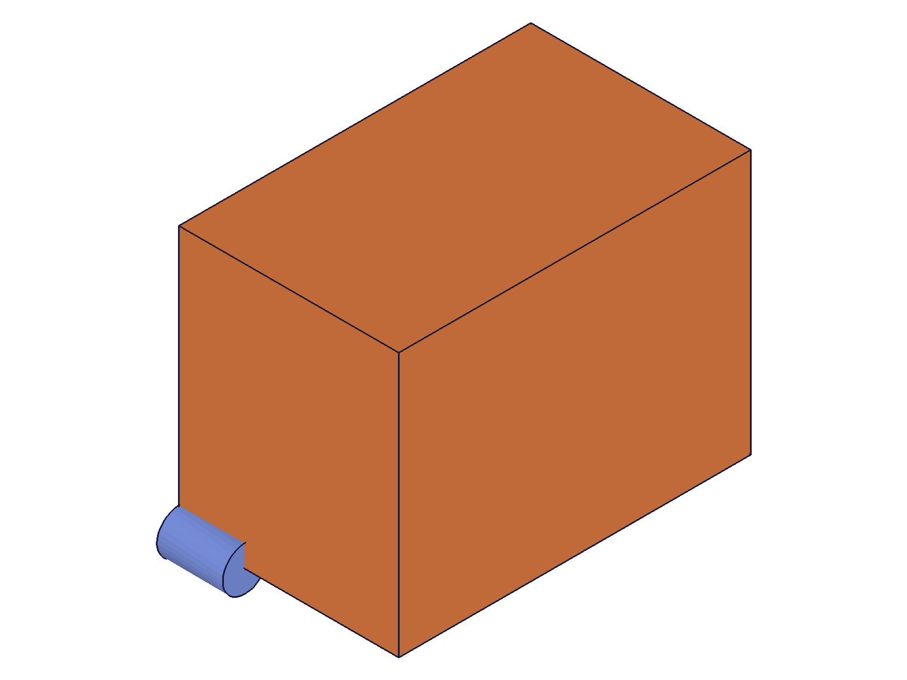
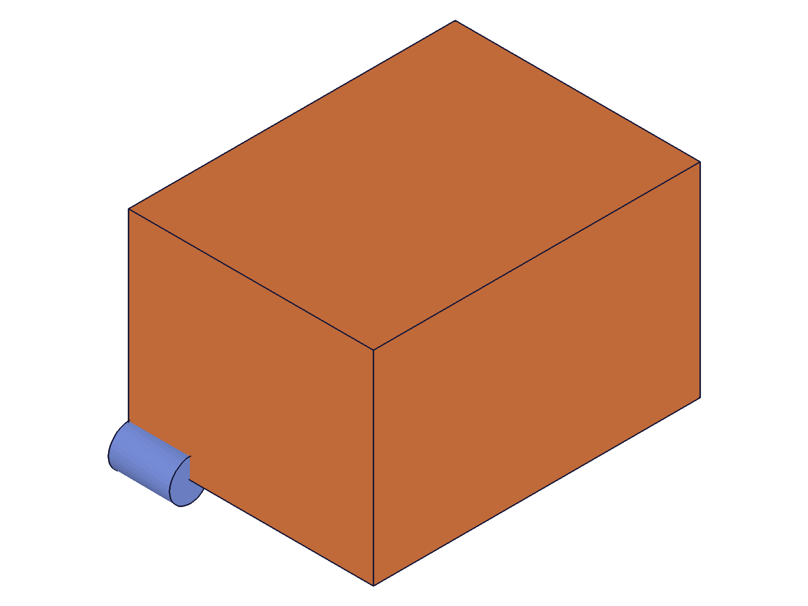

# Training: part.slice and part.updateSlice

**Date:** 2026-04-18

## Goal

Testing `v1.part.slice` and `v1.part.updateSlice` — feature-level slice that cuts solids at a work plane.

**Methods to cover:**

- `slice` — basic creation with targets and reference work plane
- `slice` params: id (part), name, targets (plain IDs and {id, indices} objects), reference (work plane ID), inverted
- `updateSlice` — change reference, inverted, targets, name after creation

**Questions:**

- Which side is kept with `inverted: FALSE` vs `TRUE`?
- What happens when no `reference` is provided (default behavior)?
- Can you slice multiple targets at once?
- How do `targets[].indices` work for multi-solid features?
- What happens when the slice plane misses the solid entirely?
- Does `updateSlice` require `openFeature`/`closeFeature`?
- What does slice return — the slice feature ID or the target ID?
- Are target features consumed like in `part.boolean`?

---

## 01 — basic slice at Top plane

Script: `scripts/01-basic-slice.mjs` — ✅ basic slice works after fixing work plane name from `'WorkPlane_Top'` to `'Top'`.

First attempt failed because `getWorkGeometry` returned null for `'WorkPlane_Top'` — the correct name is `'Top'`. Error: `"Set the parameter \"reference\" = VOID is not allowed in this situation!"` (code 1001).

After fix: slice returned feature ID 120, maxLevel 31. Snapshots look identical due to auto-scaling (single body, size-only change).

**Data:** `files/01-basic-slice-slice-response.json` — `result: 120, messages: [], maxLevel: 31`

|  |  |
|---|---|

**Learned:** `reference` param requires a valid work plane ID; passing null/VOID triggers error 1001.
**📌 LLM doc:** Document that `reference` is effectively required despite being marked optional in docs.

## 03 — slice with reference body and data verification

Script: `scripts/03-slice-verify-data.mjs` — ✅ slice confirmed visually with reference cylinder.

Box 60×40×60 at z=-30 to +30, ref cylinder at [80,20,0]. Sliced at Top plane (z=0, inverted=FALSE → keep +Z). Before: box large with small cylinder at midpoint. After: box shorter, cylinder at bottom edge — confirms lower half removed.

**Data:** Graphic data from API response contains local-space coordinates (not world space) — bounding box unchanged at [0,60] in all axes. Graphic containers: 1 container, 6 meshes, 24 vertices both before and after. The graphic data from `r.graphic` is NOT useful for verifying dimensional changes from slice.

|  |  |
|---|---|

**Learned:** API response `r.graphic` contains local-space geometry, not world-space transformed geometry. Use snapshots with reference bodies for visual verification of slice effects.
**📌 LLM doc:** Note that graphic data from the response is in local coordinates.

## 05 — custom work plane

Script: `scripts/05-custom-workplane.mjs` — ✅ slice at custom work plane at z=15 works.

Box 80×50×40 sliced at z=15 → kept z=15 to z=40 (25 units). Snapshot shows taller proportions relative to width (box went from wide+short to narrower+taller), confirming bottom portion removed.

|  |
|---|

## 06 — multiple targets

Script: `scripts/06-multiple-targets.mjs` — ✅ multiple targets sliced in one call.

Two boxes: Box1 (50×30×40) and Box2 (30×50×60 at x=60). Both sliced at z=20 with single call. Snapshots show both boxes reduced in height, with visible cut line. Colors changed (feature reassignment).

|  |  |
|---|---|

**Learned:** Multiple features can be sliced in one call via `targets` array.
**📌 LLM doc:** Document multi-target support.

## 07 — plain IDs in targets

Script: `scripts/07-plain-ids.mjs` — ✅ targets accepts plain IDs `[boxId]` not just objects `[{id: boxId}]`.

Result: sliceId=91, maxLevel=31. Both syntaxes work.

**📌 LLM doc:** Document both target syntaxes.

## 09 — inverted=TRUE

Script: `scripts/09-inverted-only.mjs` — ✅ inverted works but has rendering quirks.

Box 60×40×60 at z=0-60, sliced at z=30. With `inverted: 1`, returns feature ID 156, maxLevel 31.

Script 10 (`10-inverted-debug.mjs`) revealed: graphic containers = 0 in the API response for inverted slices, but STEP save succeeds and solo snapshot shows the box correctly. The geometry exists but graphic data is empty in the response.

|  |
|---|

**Data:** `r.graphic.containers.length === 0` for inverted=1 vs 1 container for inverted=0. STEP export confirms geometry present.

**Learned:** `inverted: 1` (TRUE) keeps the -normal side. Works correctly but the API response's `r.graphic` contains 0 containers (rendering quirk). Geometry is valid — STEP save and standalone snapshots work.
**📌 LLM doc:** Document inverted semantics and the graphic data quirk.

## 11 — no reference (omitted)

Script: `scripts/11-no-reference.mjs` — ❌ omitting `reference` is an error.

Error: `"The parameter \"reference\" must be provided in the api call!"` (code 1004).

**Learned:** Despite docs marking `reference` as optional with `(default=xy)`, it is effectively REQUIRED. Omitting it always fails.
**📌 LLM doc:** Document that reference is required.

## 12 — consumption behavior

Script: `scripts/12-consumption.mjs` — ✅ target features are consumed, like `part.boolean`.

After slicing boxId: reusing boxId in a boolean gives `"Entity \"Box\" is not available. It has already been consumed/used in another operation."` (code 1014). Using the slice feature ID as a boolean target succeeds (returned 127, maxLevel 31).

**Data:** `files/12-consumption-reuse-box-response.json` — code 1014, consumed. `files/12-consumption-use-slice-response.json` — maxLevel 31, success.

**Learned:** Target features are consumed. The slice feature ID is valid for subsequent operations.
**📌 LLM doc:** Document consumption behavior and chaining pattern.

## 13 — plane misses the solid

Script: `scripts/13-plane-misses.mjs` — ✅ silent success when plane doesn't intersect.

Box at z=0-50, plane at z=100. Slice returns feature ID 99, maxLevel 31. Solid kept unchanged (on the +normal side of the plane, so it's preserved). Snapshot shows unchanged box.

|  |
|---|

**Learned:** Slicing with a plane that doesn't intersect the solid is a no-op — succeeds silently, solid is preserved on whichever side of the plane it falls.
**📌 LLM doc:** Document no-op behavior for non-intersecting planes.

## 14 — angled work plane

Script: `scripts/14-angled-plane.mjs` — ✅ non-axis-aligned planes work.

Box 80×60×50, plane at origin [40,30,25] with normal [1,0,1] (45° between X and Z). Slice succeeds, snapshot shows diagonal cut.

|  |  |
|---|---|

## 15 — updateSlice: flip inverted

Script: `scripts/15-update-inverted.mjs` — ✅ updating inverted works with openFeature/closeFeature.

Created slice with inverted=0, then updated to inverted=1. `openFeature → updateSlice → closeFeature` pattern. Returns same slice feature ID (118), maxLevel 31.

## 16 — updateSlice: change reference plane

Script: `scripts/16-update-reference.mjs` — ✅ changing reference plane works.

Sliced at z=15 (kept z=15-60), then updated reference to z=45 plane (kept z=45-60). Both snapshots show progressively shorter box relative to reference cylinder.

|  |  |
|---|---|

**📌 LLM doc:** Document updateSlice workflow.

## 17 — updateSlice without openFeature

Script: `scripts/17-update-no-open.mjs` — ❌ fails without openFeature, as expected.

Error 1: `"The provided feature is not allowed to update. It's not active and open."` (code 1200).
Error 2: `"\"id\" must be provided for update."` (code 1004).

**Learned:** `openFeature` is mandatory for `updateSlice`, consistent with all other `update*` APIs.

## 18 — updateSlice: rename

Script: `scripts/18-update-name.mjs` — ✅ renaming works via updateSlice.

Changed name from `'OriginalName'` to `'RenamedSlice'`. Returned same ID (91), maxLevel 31.

---

## Answers to Goal Questions

1. **Which side is kept?** `inverted=FALSE` (default): keeps the side along the plane's normal vector (+normal side). `inverted=TRUE`: keeps the opposite side (-normal side).

2. **No reference?** Error — `reference` is required despite being marked optional in the docs.

3. **Multiple targets?** Yes — pass multiple items in the `targets` array.

4. **Targets with indices?** Not tested (would require a multi-solid feature like a boolean result). Both `[id]` and `[{id}]` syntax work.

5. **Plane misses solid?** Silent success — the solid is preserved unchanged.

6. **openFeature required for updateSlice?** Yes — error code 1200 without it.

7. **Return value?** Returns a NEW feature ID (the slice feature), not the target ID.

8. **Target consumption?** Yes — target features are consumed (error 1014 if reused), same as `part.boolean`.
