# Training: part.updateBoolean

**Date:** 2026-04-18

## Goal

Testing `v1.part.updateBoolean` — all update scenarios on an existing boolean feature.

**Methods to cover:**

- `updateBoolean` — change `type` (UNION→SUBTRACTION, UNION→INTERSECTION, SUBTRACTION→UNION, etc.)
- `updateBoolean` — change `name` only
- `updateBoolean` — change `target` (swap base feature)
- `updateBoolean` — change `tools` (swap tool features)
- `updateBoolean` — combined changes (type + name, target + tools)
- Error: calling without `openFeature` gate

**Questions:**

- Does changing type visually change the geometry? Can we verify with data?
- Can we swap target and tools on an existing boolean?
- What happens when you change to a new target/tool that doesn't exist?
- Does the returned ID change after update, or stay the same?
- What's the interaction between update and feature consumption?

---

## 01 — type change: UNION → SUBTRACTION

Script: `scripts/01-type-union-to-subtraction.mjs` — ✅ works as expected.

| 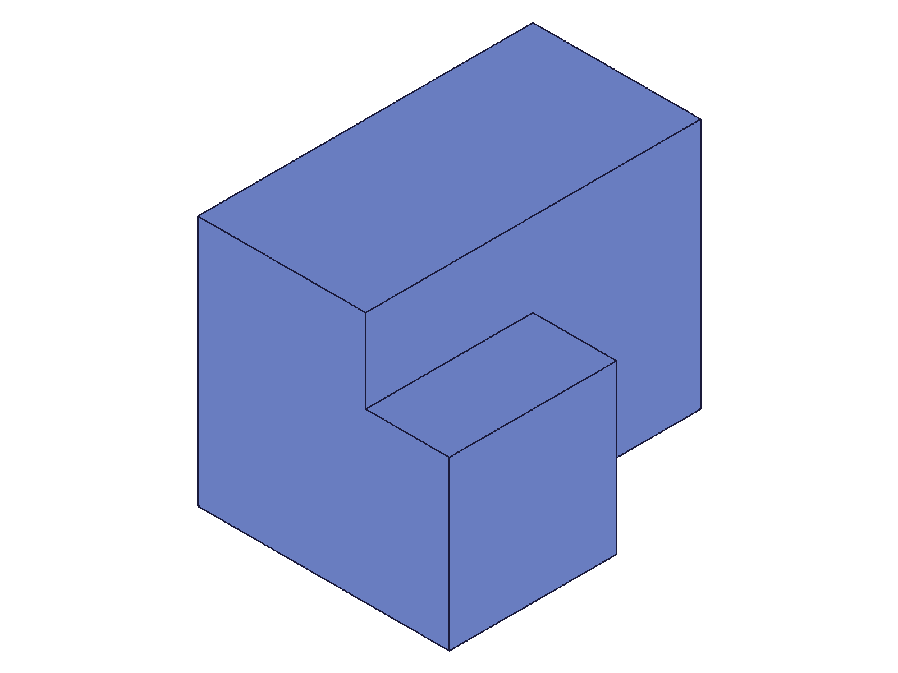 | 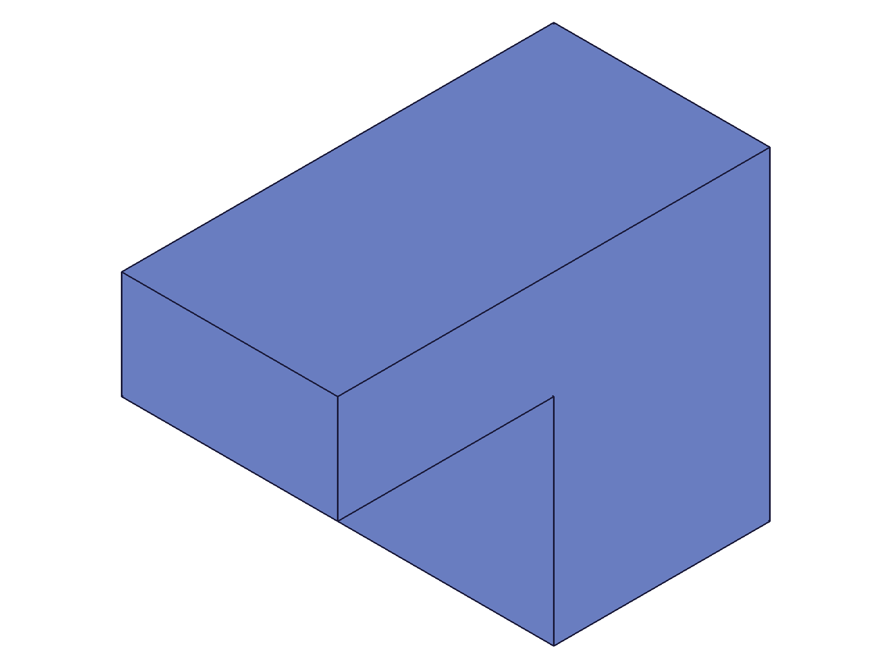 |
|---|---|

**Data:** result=128 (same ID), maxLevel=31, no messages (see `files/01-type-union-to-subtraction-update-response.json`).

**Learned:** Type change from UNION to SUBTRACTION works. Geometry recomputes on `closeFeature`. Returned ID is the same as the input boolean ID.
**📌 LLM doc:** Confirm type change works, same ID returned.

## 02 — type change: UNION → INTERSECTION

Script: `scripts/02-type-union-to-intersection.mjs` — ✅ produces overlap-only solid.

|  |
|---|

**Data:** result=128, maxLevel=31.

**Learned:** Intersection produces the overlap region. Visual confirms small cube-like shape (the shared volume of the two overlapping boxes).

## 03 — name change only

Script: `scripts/03-name-change.mjs` — ✅ name changed, geometry unchanged.

| 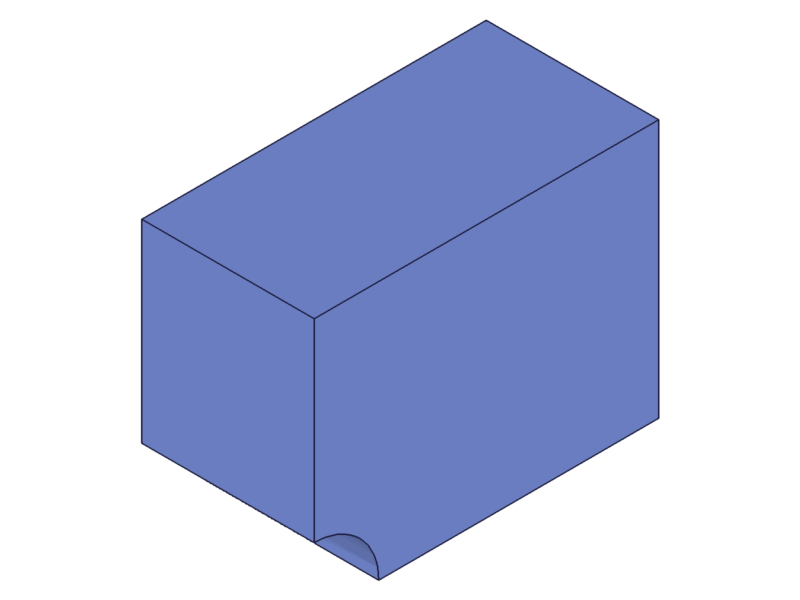 |
|---|

**Data:** result=110, maxLevel=31. Geometry unchanged — subtraction hole still present.

**Learned:** Name-only update doesn't affect geometry.

## 04 — error: no openFeature gate

Script: `scripts/04-no-openfeature.mjs` — ✅ error as expected.

**Data:** result=null, maxLevel=51. Two errors:
- Code 1200: "The provided feature is not allowed to update. It's not active and open."
- Code 1004: "\"id\" must be provided for update."

See `files/04-no-openfeature-no-gate-response.json`.

**Learned:** The openFeature gate is mandatory. Error messages are clear and diagnostic.
**📌 LLM doc:** Document exact error codes for missing openFeature.

## 05 — combined type + name change

Script: `scripts/05-type-and-name.mjs` — ✅ both params applied simultaneously.

**Data:** result=128, maxLevel=31.

**Learned:** Multiple params (type + name) can be changed in a single updateBoolean call.

## 06 — change target

Script: `scripts/06-change-target.mjs` — ✅ target swapped successfully.

| 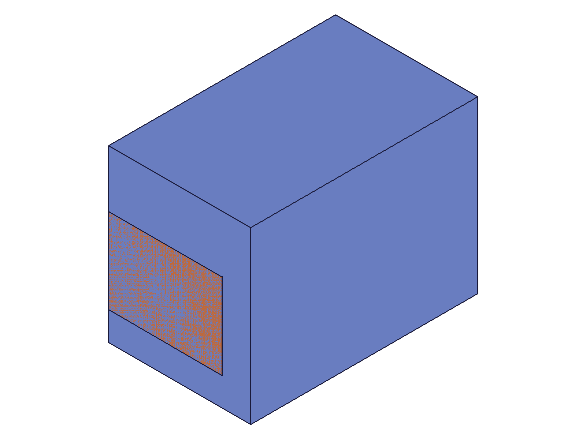 | 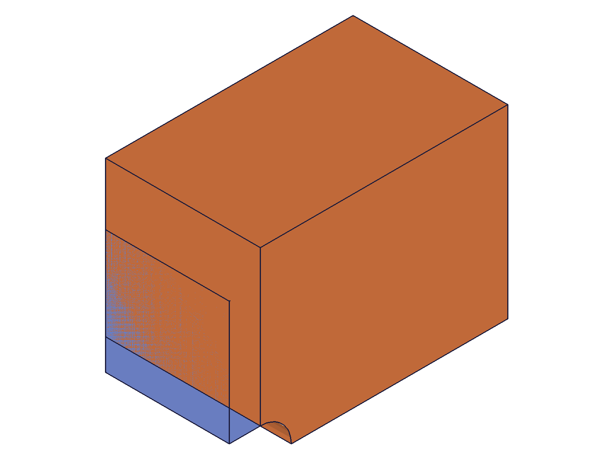 |
|---|---|

**Data:** result=147, maxLevel=31. Before: SmallBox (40³) as target with cylinder subtracted. After: BigBox (80×60×50) as target with same cylinder subtracted — geometry clearly different.

**Learned:** Changing `target` works. The old target feature becomes unconsumed/available again. The new target is consumed instead. Target must use object form `{ id: featureId }`.
**📌 LLM doc:** Document target swap behavior and that old target is released.

## 07 — change tools

Script: `scripts/07-change-tools.mjs` — ✅ tool swapped from Cyl1 (d=20) to Cyl2 (d=30).

| 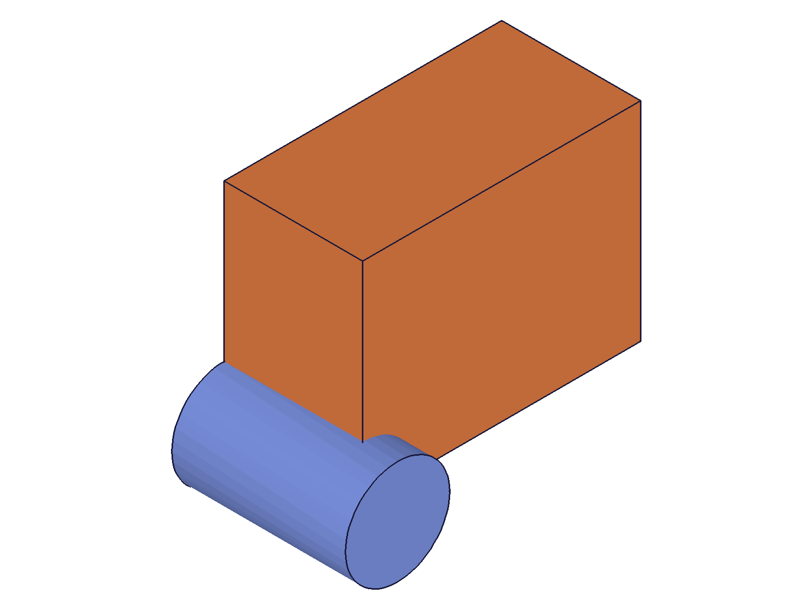 | 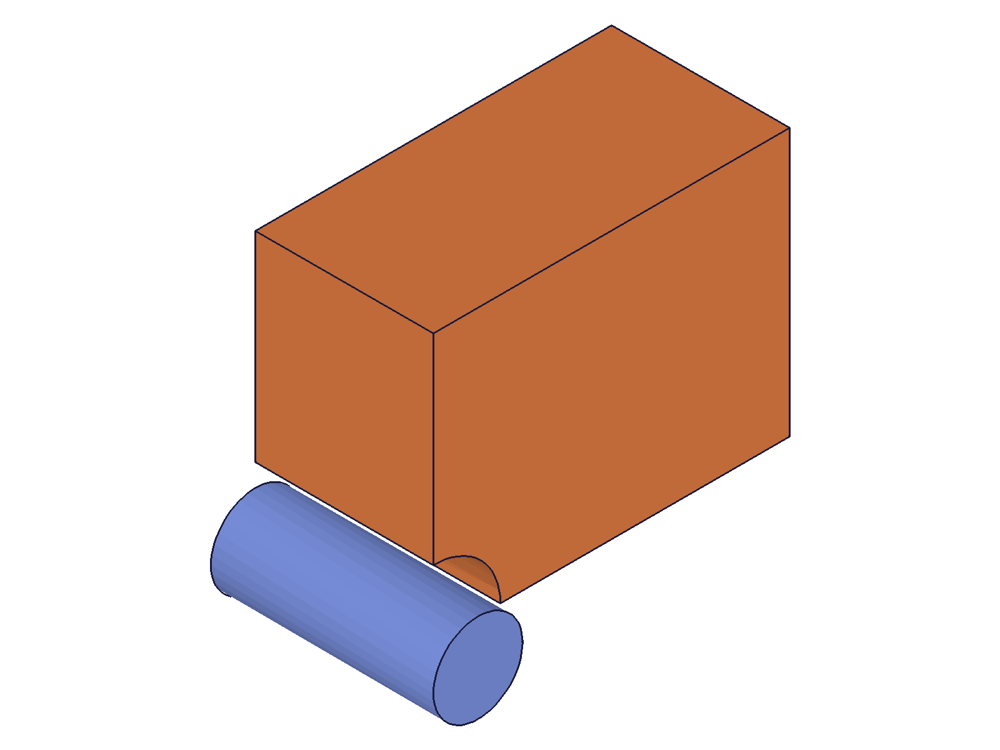 |
|---|---|

**Data:** result=129, maxLevel=31. Before: small hole at x=20. After: larger hole at x=50. Old tool (Cyl1) becomes unconsumed and visible.

**Learned:** Tool swapping works. Old tools are released, new tools consumed.
**📌 LLM doc:** Document tool swap and old tool release behavior.

## 08 — type change: SUBTRACTION → UNION

Script: `scripts/08-subtraction-to-union.mjs` — ✅ notch disappears, bodies merge.

| 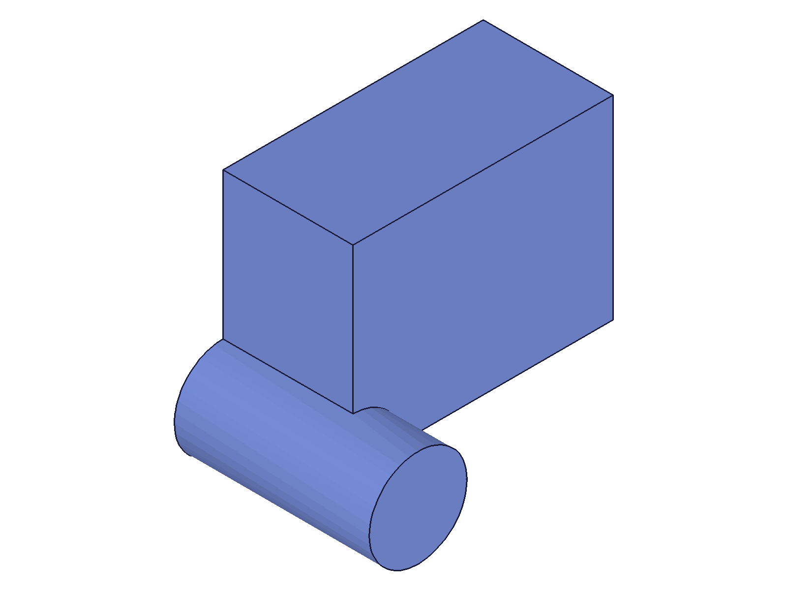 |
|---|

**Data:** result=110, maxLevel=31.

**Learned:** Reverse type change works. SUB→UNION merges the previously subtracted tool back into the body.

## 09 — type change: INTERSECTION → SUBTRACTION

Script: `scripts/09-intersection-to-subtraction.mjs` — ✅ from overlap cube to notched box.

|  |
|---|

**Data:** result=128, maxLevel=31.

**Learned:** All type transitions work in any direction.

## 10 — change to multiple tools

Script: `scripts/10-multiple-tools.mjs` — ✅ swapped from 1 tool to 2 tools.

| 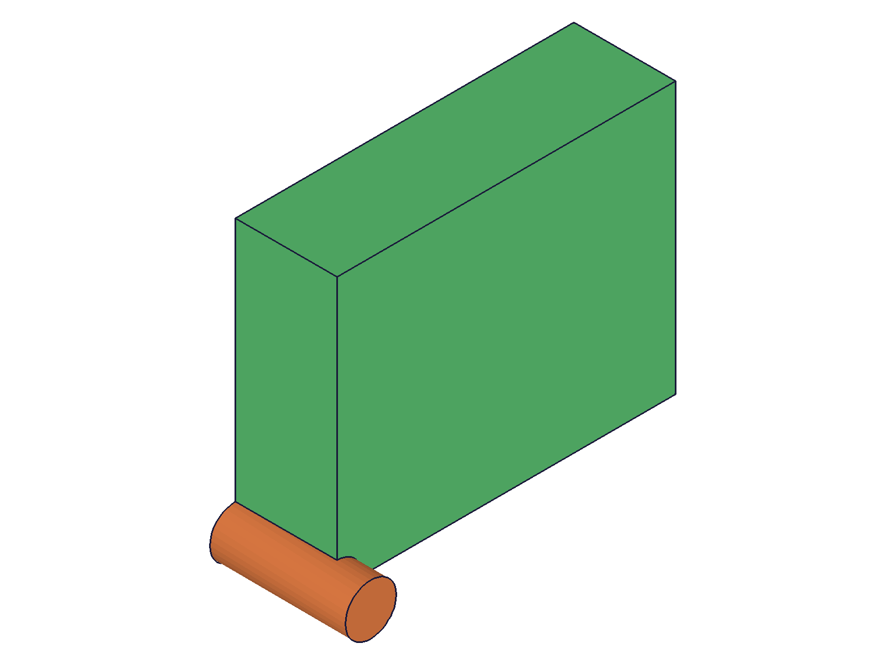 | 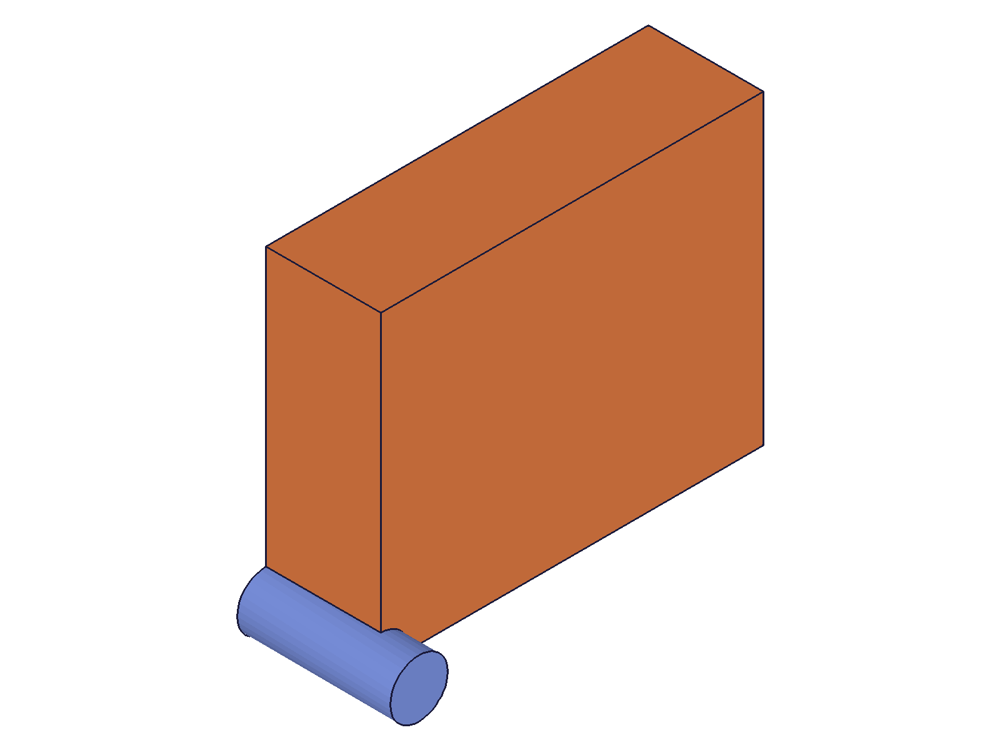 |
|---|---|

**Data:** result=148, maxLevel=31. Old tool (Cyl1) released, two new tools (Cyl2, Cyl3) consumed.

**Learned:** Can change from N tools to M tools in a single update.
**📌 LLM doc:** Document multiple tool swap.

## 11 — target with indices

Script: `scripts/11-target-with-indices.mjs` — ✅ target with `indices: [0]` accepted.

**Data:** result=128, maxLevel=31.

**Learned:** The `target.indices` parameter works in updateBoolean, same as in `boolean`.

## 12 — invalid target ID

Script: `scripts/12-invalid-target.mjs` — ✅ error with clear message.

**Data:** result=null, maxLevel=51. Errors:
- Code 0 (WARNING): "ToId()/TOID() didn't get an existing or valid id."
- Code 1006 (ERROR): "An element of parameter \"id\" has an invalid id!"

See `files/12-invalid-target-invalid-target-response.json`.

**Learned:** Invalid target ID properly rejected.
**📌 LLM doc:** Document error for invalid target.

## 13 — sequential updates

Script: `scripts/13-sequential-updates.mjs` — ✅ three consecutive open→update→close cycles.

**Data:** All three updates returned ID=128, maxLevel=31. Sequence: UNION → SUBTRACTION → INTERSECTION → UNION+rename (see `files/13-sequential-updates-sequential-results.json`).

**Learned:** Multiple sequential updates on the same boolean feature work. Each requires its own open/close cycle. ID never changes.
**📌 LLM doc:** Confirm sequential updates work with separate open/close cycles.

## 14 — tools with indices (object form)

Script: `scripts/14-tools-with-indices.mjs` — ✅ tools as `[{ id, indices }]` accepted.

**Data:** result=128, maxLevel=31.

**Learned:** Tools accept the object form with indices in updateBoolean.

## 15 — feature ordering constraint (error case)

Script: `scripts/15-realistic-workflow.mjs` — ❌ error: slot created AFTER boolean.

**Data:** result=null, maxLevel=51. Error code 1014: "Entity \"Slot\" is not available. It has already been consumed/used in another operation." See `files/15-realistic-workflow-realistic-response.json`.

**Learned:** **Critical gotcha:** `openFeature` rolls back the design tree to just before the boolean. Features created AFTER the boolean in the tree do not exist at that point and cannot be used as new targets/tools. The error message is misleading — it says "consumed" when the real issue is the feature doesn't exist yet in the rolled-back tree state.
**📌 LLM doc:** Document the feature ordering constraint — new targets/tools must exist BEFORE the boolean in the design tree.

## 16 — corrected feature ordering

Script: `scripts/16-tool-ordering.mjs` — ✅ works when slot is created BEFORE the boolean.

| 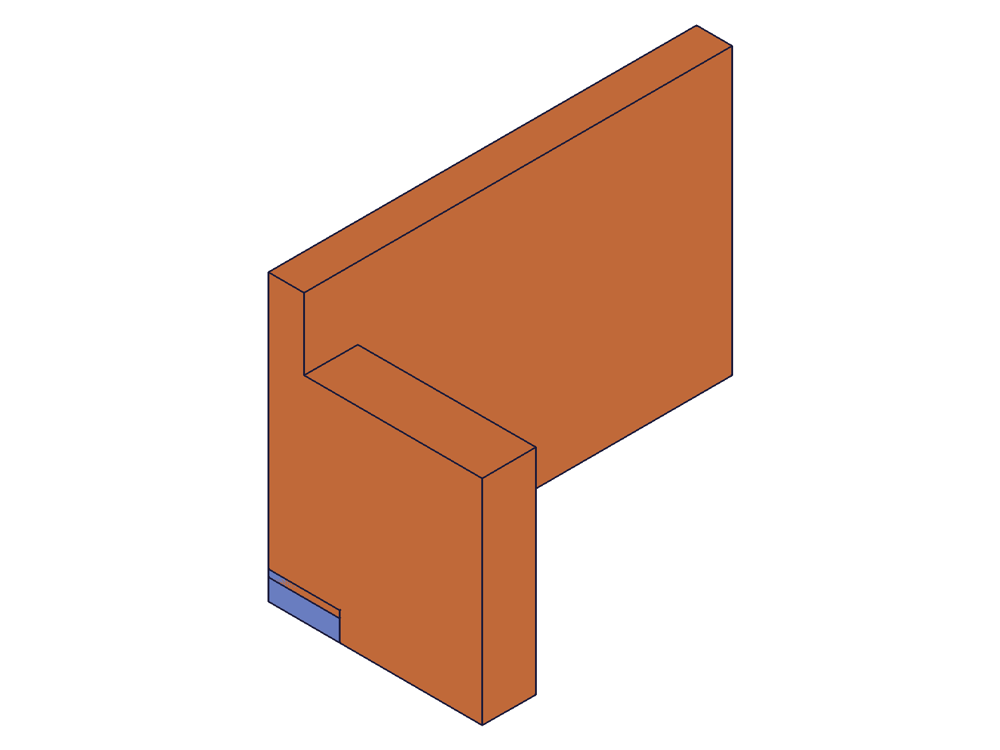 | 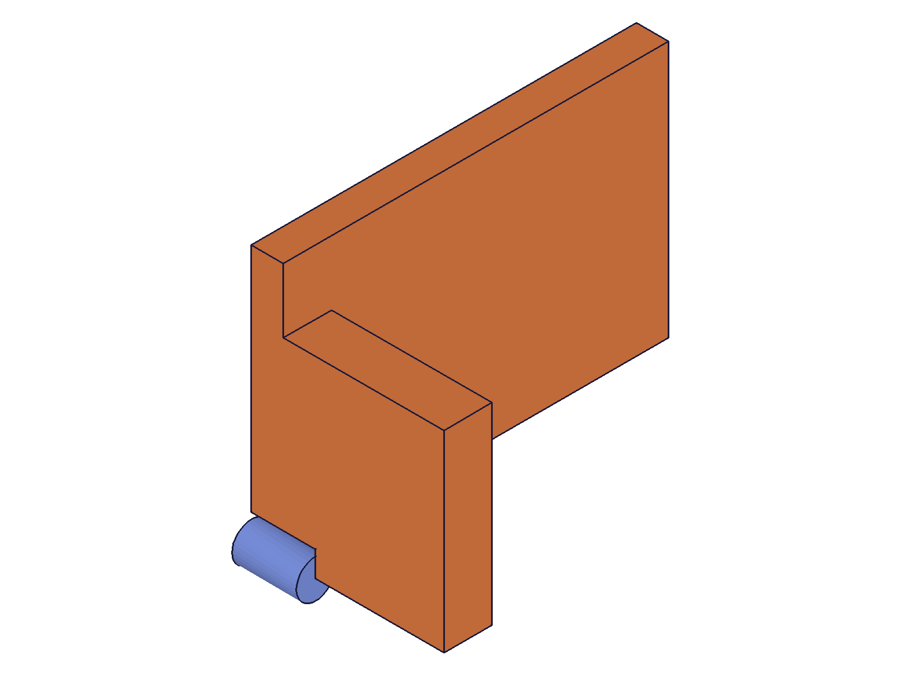 |
|---|---|

**Data:** result=232, maxLevel=31. Successfully swapped cylindrical hole for rectangular slot.

**Learned:** When the new tool feature exists before the boolean in the design tree, the update works. The old tool (cylinder) becomes unconsumed and visible after the swap.
