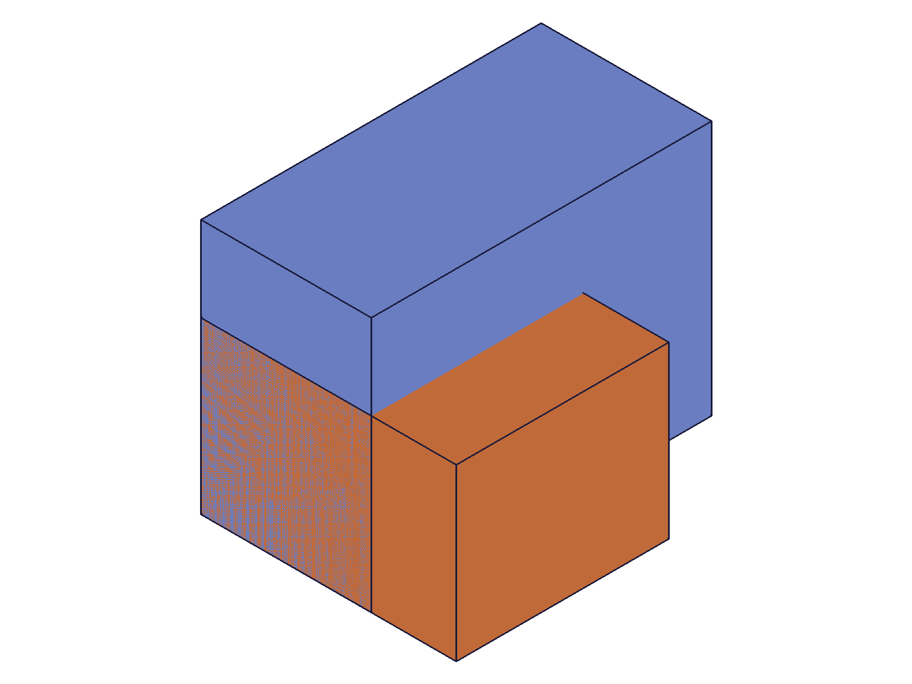
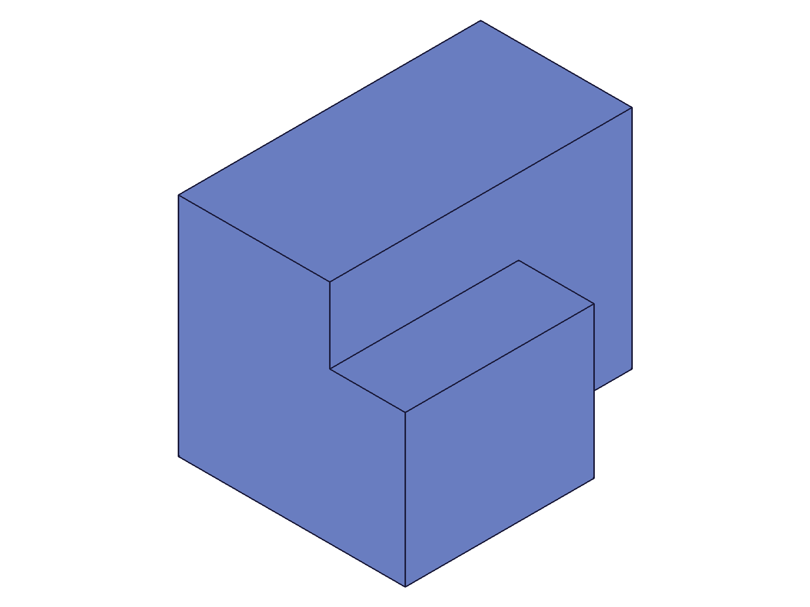
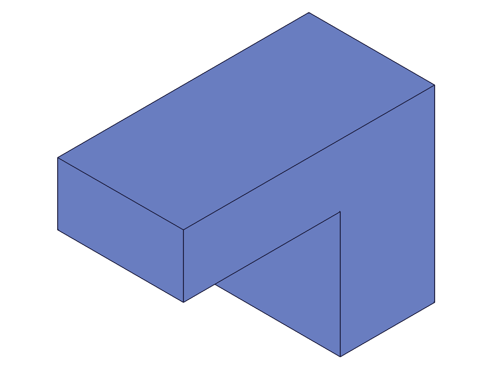
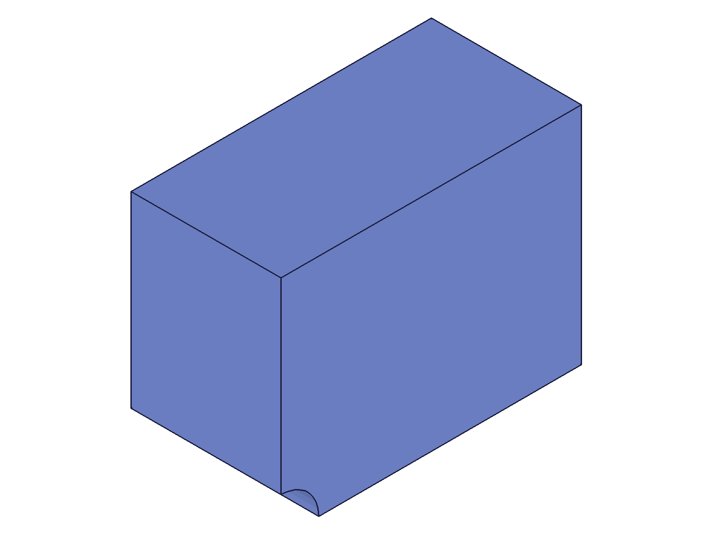
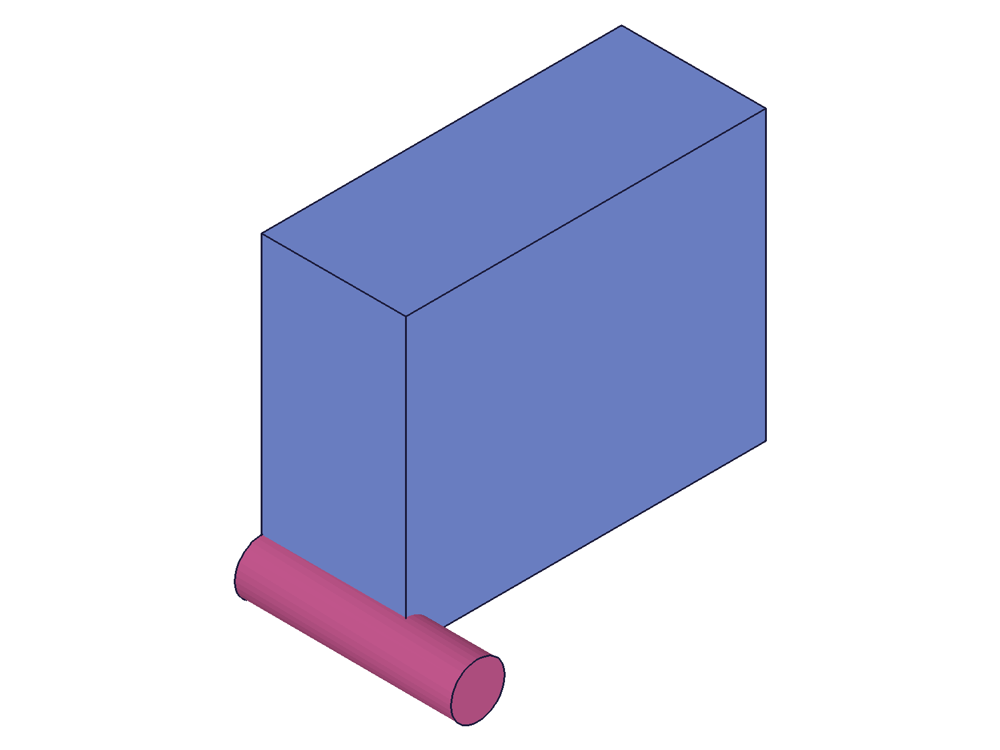
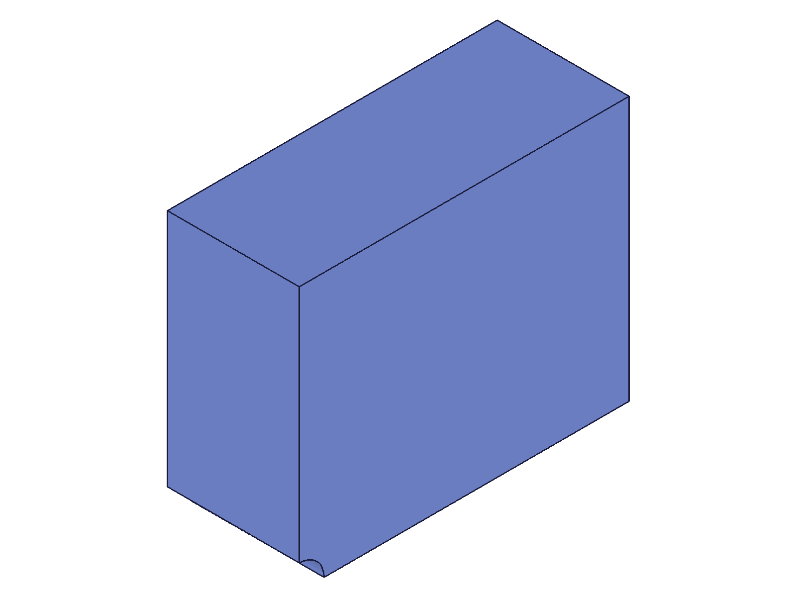
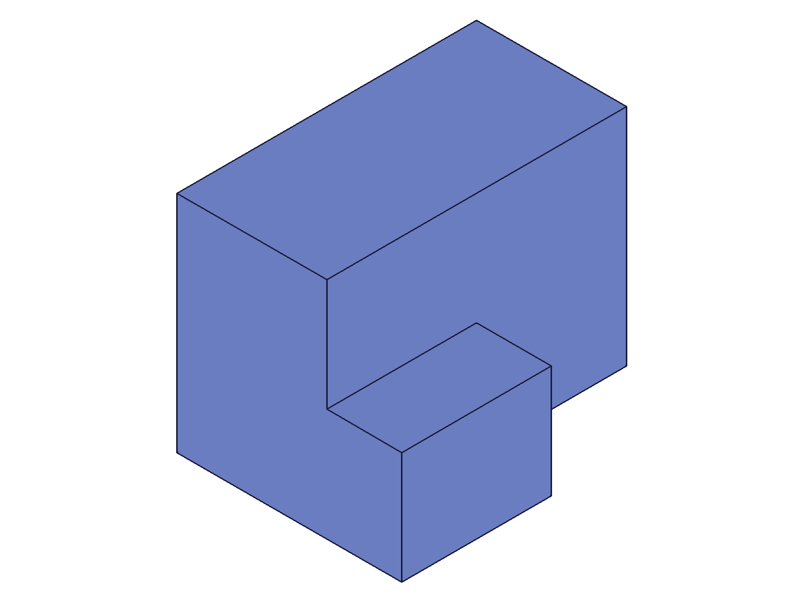
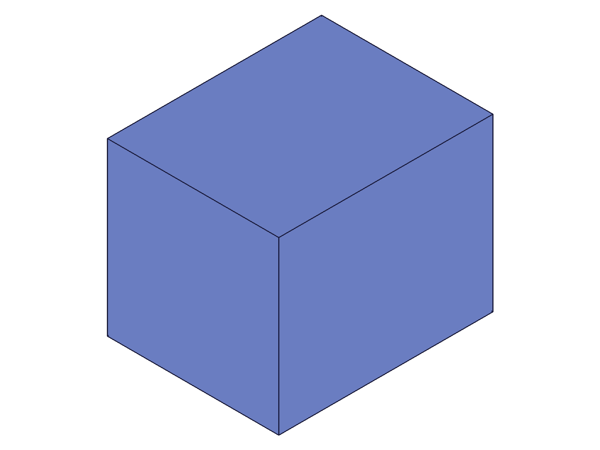
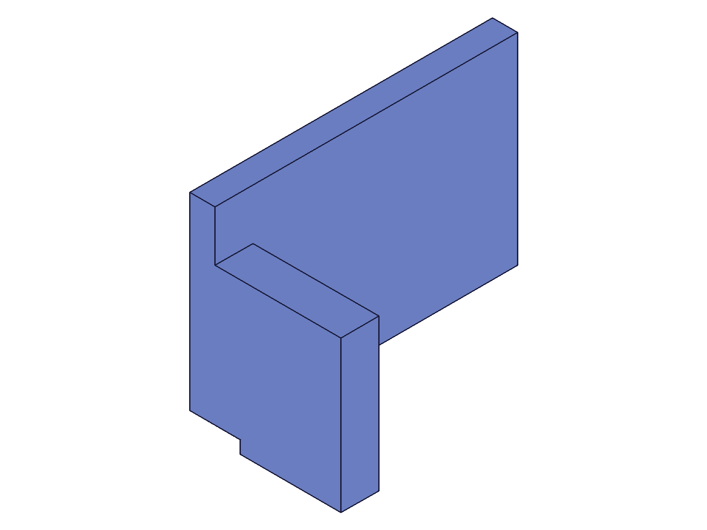

# Training: part.boolean & part.updateBoolean

**Date:** 2026-04-18

## Goal

Testing `v1.part.boolean` and `v1.part.updateBoolean` — feature-level boolean operations.

**Methods to cover:**

- `boolean` — types: UNION, SUBTRACTION, INTERSECTION
- `boolean` params: id (part ID), type, target (plain ID vs object), target.indices, tools (plain IDs vs objects), tools[].indices, name
- `updateBoolean` — change type, change target, change tools, change name after creation

**Questions:**

- How does `target` work as a plain feature ID vs an object `{id, indices}`?
- What does the `indices` param do — which solids does it select from multi-solid features?
- What happens with non-overlapping bodies?
- Can you chain multiple boolean features?
- What's the return value? Feature ID or VOID?
- What errors arise from invalid inputs?
- How does `updateBoolean` interact with the openFeature/closeFeature gate?
- Difference from `solid.union/subtraction/intersection` (direct-mode)?

---

## 01 — basic union

Script: `scripts/01-basic-union.mjs` — ✅ UNION creates a combined body. Returns **new feature ID** (184), not the target ID. maxLevel=31.

|  |  |
|---|---|

**Data:** box1=54, box2=91, boolId=184. maxLevel=31, messages=[]. See `files/01-basic-union-union-response.json`.

**Learned:** `part.boolean` returns a NEW feature ID — fundamentally different from `solid.union` which returns the target ID.
**📌 LLM doc:** Return value is a new feature ID, not the target ID.

## 02 — basic subtraction

Script: `scripts/02-basic-subtraction.mjs` — ✅ SUBTRACTION cuts the tool volume from the target. Returns feature ID 184.

|  |
|---|

**Data:** result=184, maxLevel=31. Visual shows box with notch cut in the lower-right.

## 03 — basic intersection

Script: `scripts/03-basic-intersection.mjs` — ✅ INTERSECTION keeps only the overlapping volume. Returns feature ID 184.

|  |
|---|

**Data:** result=184, maxLevel=31. Visual shows only the cube-shaped overlap region.

## 04 — target formats (invalidated)

Script: `scripts/04-target-formats.mjs` — ⚠️ Tests 2 & 3 failed due to `part.create` between tests clearing the drawing. Only test 1 (plain ID) valid: succeeded (128, maxLevel=31).

**Learned:** Calling `part.create` resets the entire drawing state. Multiple `part.create` calls in one script can cause confusing errors (`"id" must be provided to create CC_Union"`, code 1004). Prefer single `part.create` per script.

## 05 — object form debug

Script: `scripts/05-object-form-debug.mjs` — `target: {id: box1}` works (result=128, maxLevel=31). `tools: [{id: box4}]` failed because target was already consumed by test 1.

**Data:** `files/05-object-form-debug-obj-target-response.json` — success. `files/05-object-form-debug-obj-tools-response.json` — error: "Entity \"Base\" is not available. It has already been consumed/used in another operation." (code 1014).

**📌 LLM doc:** Features are consumed after boolean. Error message explicitly says "consumed/used in another operation".

## 06 — tools object forms

Script: `scripts/06-tools-object-forms.mjs` — Plain tools `[cyl1]` succeeds. Object tools `[{id: cyl2}]` failed because target (box1) was already consumed by test 1.

**Learned:** The tools object format is NOT the issue — it's target consumption.

## 07 — clean object form

Script: `scripts/07-clean-object-form.mjs` — ✅ `tools: [{id: cyl1}]` works perfectly with fresh features. result=110, maxLevel=31.

|  |
|---|

**Learned:** Both plain ID and object `{id}` forms work for target and tools. The object form is needed when using `indices`.

## 08 — consumption behavior

Script: `scripts/08-consumption.mjs` — ✅ Confirms consumption and chaining.

**Data:**
- Reuse consumed target (box1): `null`, maxLevel=51, "Entity \"Base\" is not available" (code 1014)
- Reuse consumed tool (box2): `null`, maxLevel=51, same error
- Chain via boolean feature ID: `result=298`, maxLevel=31 — **works**

**Learned:** Both target AND tool features are consumed after `part.boolean`. To chain booleans, use the returned boolean feature ID as the new target.
**📌 LLM doc:** Consumption behavior — both target and tools consumed. Chain via returned feature ID.

## 09 — naming

Script: `scripts/09-naming.mjs` — ✅ Custom and default names both work. Created 4 boolean features with IDs 128, 231, 337, 451.

**Data:** `files/09-naming-bool-ids.json`. All maxLevel=31.

**Learned:** Default names are type-dependent: "Union", "Subtraction", "Intersection" per docs. Custom `name` param overrides.

## 10 — multiple tools

Script: `scripts/10-multiple-tools.mjs` — ✅ Three cylinders subtracted in one call. result=204, maxLevel=31.

|  |  |
|---|---|

**Data:** `files/10-multiple-tools-multi-tool-response.json` — maxLevel=31. Holes on the back face — visible at bottom-left of snapshot as small notch.

**Learned:** Multiple tools in one call works. More efficient than sequential single-tool booleans.

## 11 — default type

Script: `scripts/11-default-type.mjs` — ✅ Omitting `type` defaults to UNION. result=128, maxLevel=31.

|  |
|---|

**Data:** `files/11-default-type-default-type.json`. Visual matches union shape from script 01.

## 12 — non-overlapping (part.create issue)

Script: `scripts/12-non-overlapping.mjs` — Non-overlap UNION succeeds. SUBTRACTION and INTERSECTION tests failed due to `part.create` between tests (same issue as script 04). See script 13 for clean retest.

## 13 — non-overlapping (clean)

Script: `scripts/13-non-overlap-clean.mjs` — ✅ **All non-overlapping operations succeed** (maxLevel=31).

**Data:**
- Non-overlap SUB: result=128, maxLevel=31
- Non-overlap INT: result=239, maxLevel=31

**Learned:** `part.boolean` handles non-overlapping bodies silently for ALL types, including SUBTRACTION and INTERSECTION. This is different from `solid.subtraction`/`solid.intersection` which can return errors (code 1014) for non-overlapping cases.
**📌 LLM doc:** Non-overlapping bodies succeed silently — major difference from `solid.*`.

## 14 — updateBoolean type change

Script: `scripts/14-updateBoolean-type.mjs` — ✅ Type changes work via openFeature→updateBoolean→closeFeature.

|  |  |  |
|---|---|---|

**Data:** All three updates return boolId=128, maxLevel=31. Visual confirms shape changes: union→subtraction (notch visible), subtraction→intersection (only overlap cube).

**Learned:** `updateBoolean` can change the operation type. Geometry recomputes immediately.
**📌 LLM doc:** updateBoolean supports type change with immediate recomputation.

## 15 — updateBoolean without openFeature

Script: `scripts/15-update-without-open.mjs` — ❌ Fails as expected. Error code 1200: "The provided feature is not allowed to update. It's not active and open."

**Data:** `files/15-update-without-open-no-open-response.json` — two error messages.

**Learned:** `openFeature` is mandatory before `updateBoolean`. Standard pattern.

## 16 — updateBoolean name change

Script: `scripts/16-update-name.mjs` — ✅ Renaming via updateBoolean works. result=128, maxLevel=31.

## 17 — empty tools

Script: `scripts/17-empty-tools.mjs` — ❌ `tools: []` is an error. Code 1004: `"The type \"0\" is not supported in PrepareAPIParams!"`.

**Data:** `files/17-empty-tools-empty-tools.json`.

**Learned:** Empty tools array causes an error — different from `solid.union` where `tools: []` is a silent no-op.
**📌 LLM doc:** Empty tools is an error, not a no-op.

## 18 — error cases

Script: `scripts/18-error-cases.mjs` — Various error scenarios:

**Invalid tool ID (99999):** Warning + Error code 1006 "An element of parameter \"tools\" has an invalid id!" — proper error handling.

**Self-reference:** Result ambiguous due to `part.create` between tests. See script 19 for clean test.

**Invalid part ID (99999):** Error code 1006 "The provided part id does not exist."

**Data:** See `files/18-error-cases-*.json` for full messages.

## 19 — self-reference (clean)

Script: `scripts/19-self-ref-clean.mjs` — ✅ **Self-reference SUCCEEDS.** `target: box1, tools: [box1]` → result=91, maxLevel=31. No hang, no error.

**Data:** `files/19-self-ref-clean-self-ref-clean.json` — maxLevel=31.

**Learned:** `part.boolean` handles self-reference gracefully — the feature level detects and handles it safely. This is a critical difference from `solid.union` which HANGS the server on self-reference.
**📌 LLM doc:** Self-reference is safe (no hang), unlike solid.* which hangs.

## 20 — realistic workflow

Script: `scripts/20-realistic-workflow.mjs` — ✅ Complete bracket: plate + 2 risers (UNION) → 3 bolt holes (SUBTRACTION). Chained boolean features work correctly.

|  |
|---|

**Data:** unionId=248, subId=486. Both maxLevel=31. Bracket shape clearly visible with risers and base plate. Bolt holes on hidden side.

**Learned:** Real-world pattern: create features → union into body → subtract holes. Each boolean returns a new feature ID; use it as target for the next boolean.
**📌 LLM doc:** Document the chaining workflow pattern.

---

## Coverage Checklist

- [x] Boolean called successfully for each type (UNION, SUBTRACTION, INTERSECTION)
- [x] Required params tested: id, target, tools
- [x] Optional params: type (defaults to UNION), name (custom and defaults)
- [x] Target as plain ID and as object {id}
- [x] Tools as plain IDs and as object [{id}]
- [x] Multiple tools in one call
- [x] updateBoolean: type change, name change
- [x] openFeature/closeFeature gate enforced
- [x] Feature consumption behavior documented
- [x] Chaining via returned boolean feature ID
- [x] Non-overlapping bodies behavior
- [x] Error cases: invalid IDs, empty tools
- [x] Self-reference behavior (safe, unlike solid.*)
- [x] Realistic workflow combining union + subtraction
- [ ] Indices param (not tested — requires multi-solid feature, e.g. from patterns)

**Gap:** `indices` param was not tested. This requires features that contain multiple solids (e.g., pattern features), which are in a later step of the training plan. The docs show `indices` selecting specific solids from a multi-solid feature. Noted for future training.
