# Training: part.updateRevolve

**Date:** 2026-04-18

## Goal

Testing `v1.part.updateRevolve` — modifies an existing revolve feature. Requires `openFeature`/`closeFeature` gate.

**Methods to cover:**

- `updateRevolve` — basic angle update (change endAngle)
- `updateRevolve` — change startAngle
- `updateRevolve` — toggle inverted (CW/CCW)
- `updateRevolve` — change name
- `updateRevolve` — swap references (different profile)
- `updateRevolve` — swap axisIds (different axis)
- `updateRevolve` — expression-driven angles (`@expr.`)
- `updateRevolve` — multiple updates in one open/close session
- `updateRevolve` — all params in one call
- Edge cases: without openFeature, wrong ID type, degenerate angles

**Questions:**

- Does `updateRevolve` return the feature ID or VOID?
- Can you change all params (references, axisIds, angles, inverted) in one call?
- What happens when calling updateRevolve without openFeature?
- Does param persistence work (omitted params keep values)?
- Can you swap references to a different sketch region?
- Can you swap the axis to a different work axis?
- Do expression-bound angles auto-recalc after updateExpression?

---

## 01 — basic endAngle update

Script: `scripts/01-basic-update-endAngle.mjs` — ✅ Full revolve (360°) updated to quarter turn (PI/2). Returns feature ID 94, maxLevel=31.

|  |  |
|---|---|

**Data:** `updateRevolve` returns the feature ID (94), not VOID. maxLevel=31 on success. See `files/01-basic-update-endAngle-update-response.json`.

**Learned:** `updateRevolve` returns the feature ID (same as creation), consistent with `updateExtrusion`.

---

## 02 — update startAngle

Script: `scripts/02-update-startAngle.mjs` — ✅ Half revolve (0→PI) updated to offset arc (PI/4→PI). Returns feature ID 94, maxLevel=31.

|  | 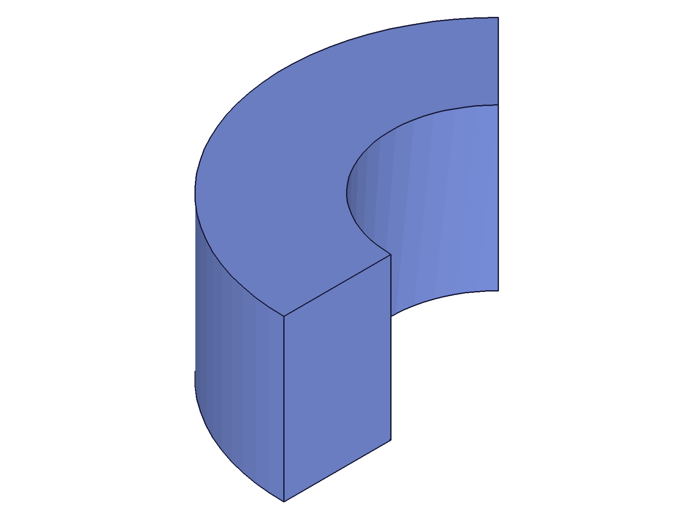 |
|---|---|

**Data:** startAngle updated from 0 to PI/4. Shape visibly different — the starting edge shifted 45°. See `files/02-update-startAngle-startAngle-response.json`.

---

## 03 — toggle inverted

Script: `scripts/03-toggle-inverted.mjs` — ✅ Quarter ring toggled CCW→CW→CCW. All three updates returned feature ID 94, maxLevel=31.

|  | 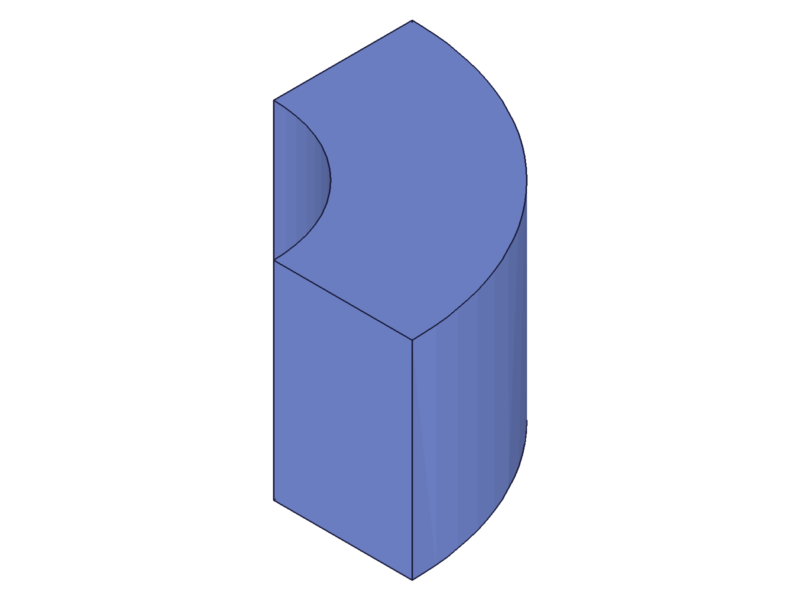 |
|---|---|

**Data:** Inverted toggle visibly changes the sweep direction. CCW quarter ring and CW quarter ring are on opposite sides of the axis. Toggle back to CCW restores original geometry.

**📌 LLM doc:** `inverted` takes integer 1/0 (same as revolve creation). Toggling is fully reversible.

---

## 04 — update name

Script: `scripts/04-update-name.mjs` — ✅ Feature renamed `OriginalRev` → `RenamedRev`. maxLevel=31.

**Data:** Structure trees before/after confirm:
- Before: feature name=`OriginalRev`, child body=`OriginalRev_0`
- After: feature name=`RenamedRev`, child body=`OriginalRev_0` (unchanged)

**📌 LLM doc:** Renaming updates the feature node only. Child body nodes retain their original name with `_0` suffix. Same pattern as `updateExtrusion`.

---

## 05 — swap references

Script: `scripts/05-swap-references.mjs` — ✅ Rectangle profile swapped to circle profile. Returns feature ID 99, maxLevel=31.

|  | 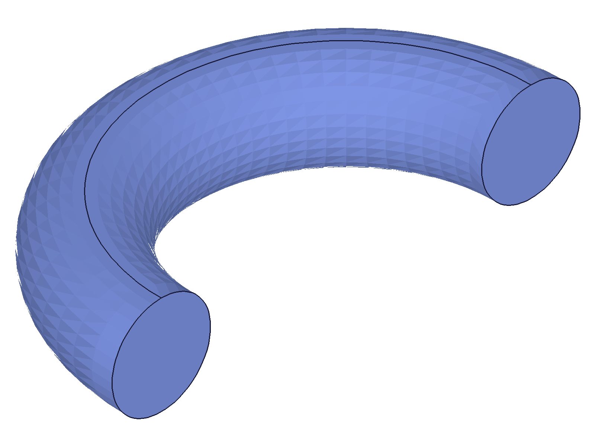 |
|---|---|

**Data:** Dramatic shape change — rectangular cross-section half-ring → circular cross-section half-ring (torus). Both references (regionRect=90, regionCircle=95) from the same sketch.

**📌 LLM doc:** `references` swap works — completely changes the revolve cross-section. Must use region IDs from existing sketch in the part.

---

## 06 — swap axis

Script: `scripts/06-swap-axis.mjs` — ✅ Revolve axis swapped from YAxis to XAxis. Returns feature ID 94, maxLevel=31.

| 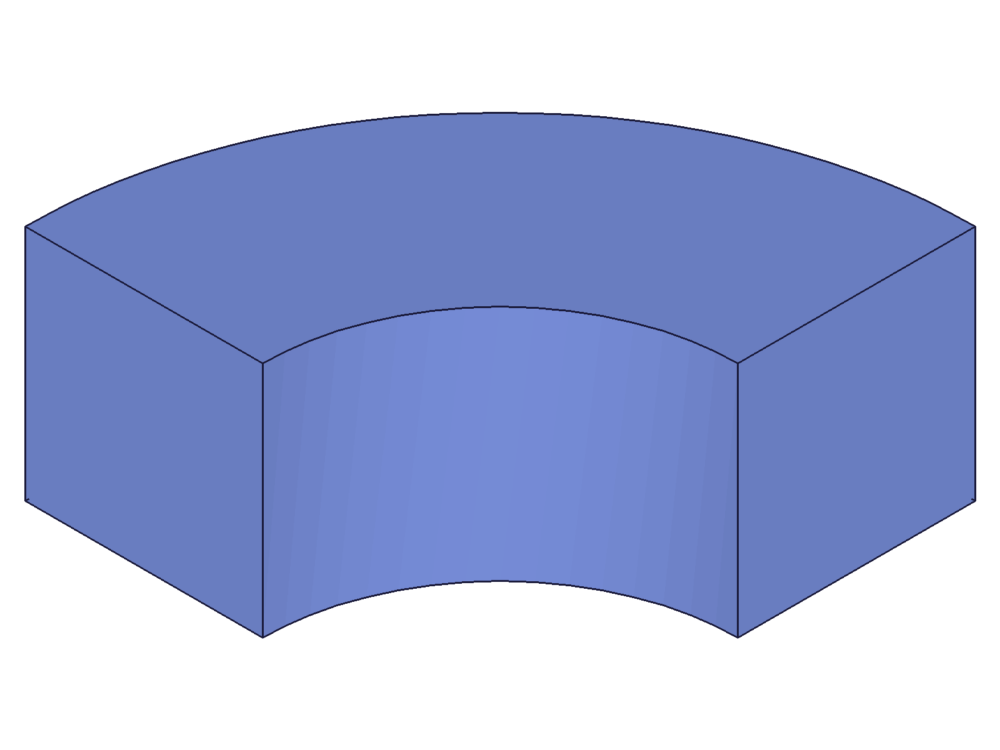 | 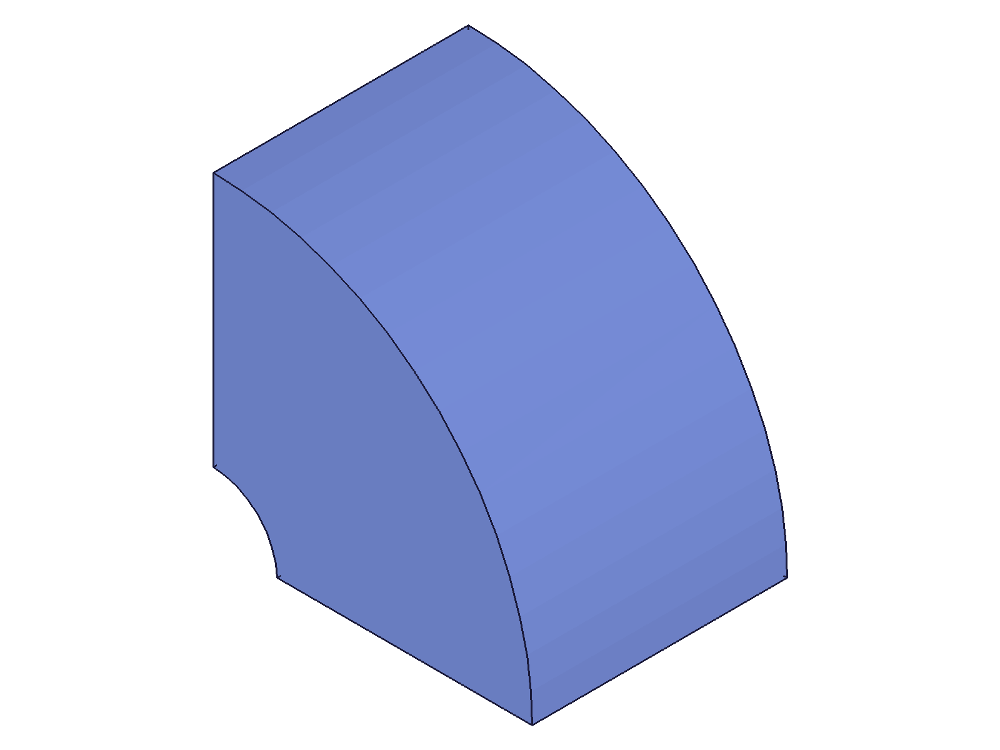 |
|---|---|

**Data:** Orientation changed dramatically — horizontal quarter ring (Y-axis rotation) → vertical quarter ring (X-axis rotation).

**📌 LLM doc:** `axisIds` swap works — changes the rotation axis. Can swap between any valid axis type (built-in work axis, custom work axis, sketch line, etc.).

---

## 07 — expression-driven angles (buggy script)

Script: `scripts/07-expression-driven.mjs` — ⚠️ Expression binding via `updateRevolve` worked, but auto-recalc test was invalid due to using wrong `updateExpression` form (direct name/value instead of `toUpdate` array — a known silent no-op).

**Data:** `updateRevolve` with `endAngle: '@expr.ANG2'` returned maxLevel=31 and geometry updated correctly. The `updateExpression` call used the wrong form: `{ id, name, value }` instead of `{ id, toUpdate: [{ name, value }] }` — returned result=1 but value was unchanged. See `updateExpression.md` CRITICAL section.

**Learned:** Confirmed @expr. syntax works in updateRevolve for angle params. The auto-recalc test was re-done in scripts 14 and 15.

---

## 08 — multiple updates in one session

Script: `scripts/08-multiple-updates.mjs` — ✅ Three cumulative updates in one open/close session: endAngle=PI, startAngle=PI/4, inverted=1. All returned feature ID 94, maxLevel=31.

|  |  |
|---|---|

**Data:** All three updates accumulated. Final shape shows PI/4→PI arc, inverted (CW). See `files/08-multiple-updates-multi-update-responses.json`. Only one `closeFeature` needed at the end.

**📌 LLM doc:** Multiple `updateRevolve` calls within one open/close session are cumulative. Each call is additive — no need for separate open/close per update.

---

## 09 — without openFeature (error case)

Script: `scripts/09-no-openFeature.mjs` — ✅ Error as expected. Returns null, maxLevel=51.

**Data:** Two error messages:
1. Code 1200: "The provided feature is not allowed to update. It's not active and open."
2. Code 1004: "\"id\" must be provided for update."

See `files/09-no-openFeature-no-open-response.json`.

**📌 LLM doc:** Same error pattern as other update APIs. Code 1200 is the gate error.

---

## 10 — wrong ID types (error cases)

Script: `scripts/10-wrong-id.mjs` — ✅ Both part ID and sketch ID rejected. Returns null, maxLevel=51.

**Data:** Both produce:
1. Code 1007: "The provided id for the feature is not a feature or work geometry id."
2. Code 1004: "\"id\" must be provided for update."

**📌 LLM doc:** Must pass the revolve feature ID, not part ID or sketch ID. Error code 1007 is the wrong-type error.

---

## 11 — expression auto-recalc (buggy script)

Script: `scripts/11-expr-autorecalc.mjs` — ⚠️ Same bug as script 07 — used wrong `updateExpression` form. Expression value unchanged (confirmed by getExpression: still 3.14159). Geometry did not update.

**Learned:** Superseded by scripts 14 and 15.

---

## 12 — all params in one call

Script: `scripts/12-all-params-one-call.mjs` — ✅ All params changed in single updateRevolve call: name, references (rect→circle), axisIds (Y→X), startAngle, endAngle, inverted. Returns feature ID 99, maxLevel=31.

|  | 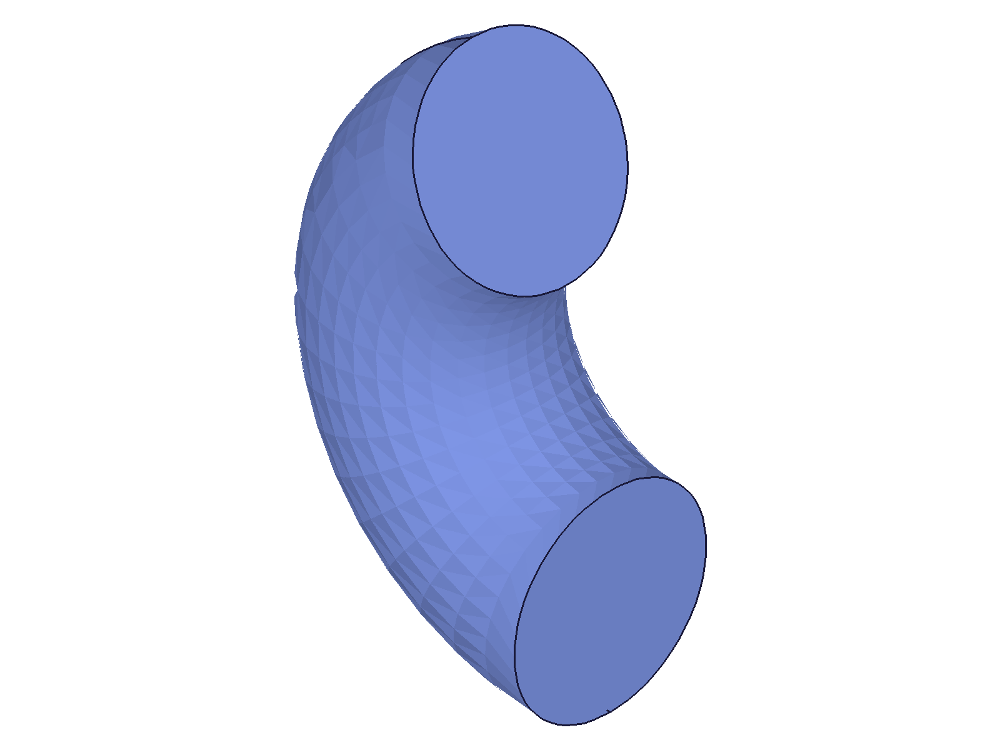 |
|---|---|

**Data:** Full ring (rect profile, Y-axis) → partial torus (circle profile, X-axis, PI/6→PI, CW). Dramatic visual change confirms all params applied in one call.

**📌 LLM doc:** All params can be updated simultaneously in a single call. No need to call updateRevolve multiple times for different params.

---

## 13 — param persistence

Script: `scripts/13-param-persistence.mjs` — ✅ Omitted params keep their current values across updates.

| 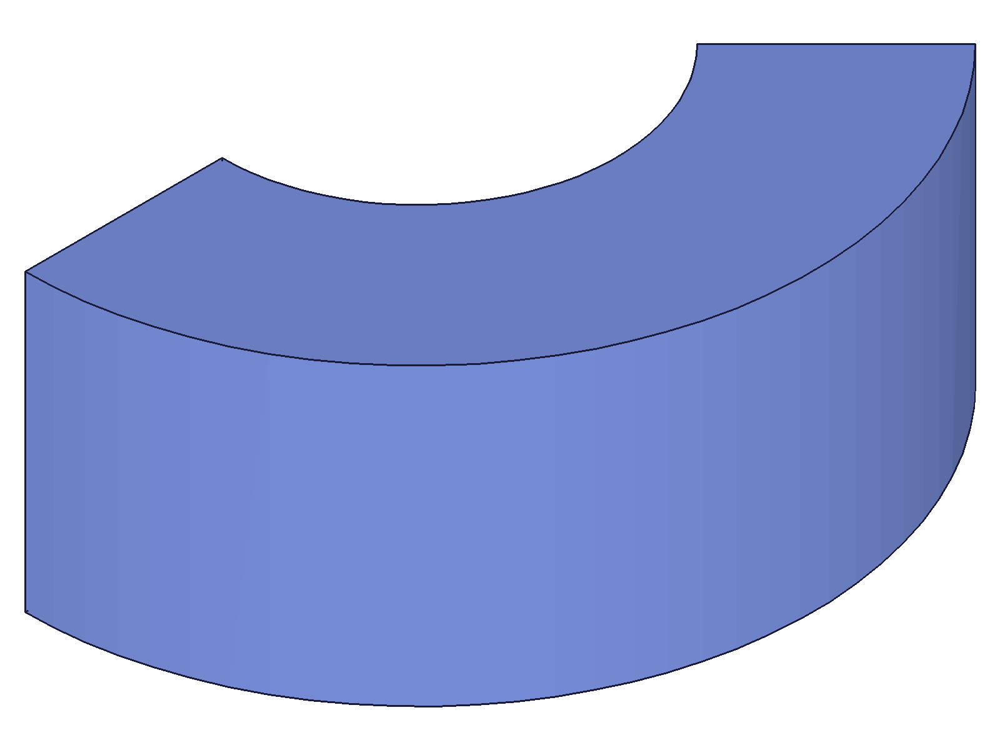 | 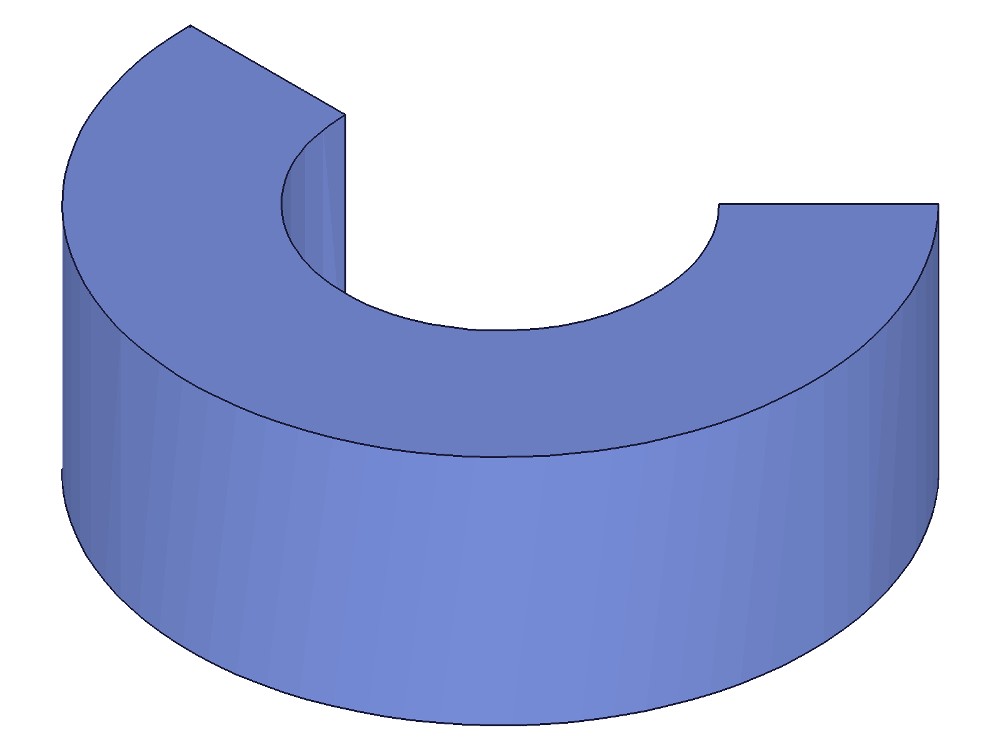 | 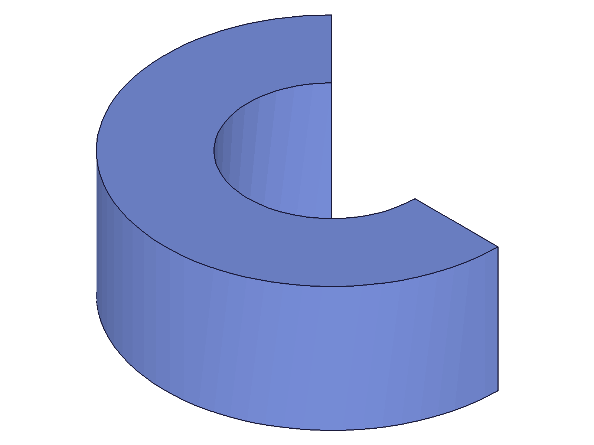 |
|---|---|---|

**Data:** 
- Initial: startAngle=PI/4, endAngle=PI, inverted=1 (CW arc from 45°→180°)
- After endAngle=3PI/2 only: startAngle=PI/4 persisted, inverted=1 persisted. Arc widened.
- After inverted=0 only: startAngle=PI/4 and endAngle=3PI/2 persisted. Direction flipped CCW.

All three shapes are visually distinct, confirming each update only changed its target parameter.

**📌 LLM doc:** Params persist when omitted. Consistent with docs: "If optional parameters are not set, the feature will keep the existing values."

---

## 14 — expression auto-recalc (via updateRevolve)

Script: `scripts/14-expr-autorecalc-fixed.mjs` — ⚠️ Expression binding set via `updateRevolve` does NOT auto-recalc when `updateExpression` is called.

**Data:** 
- Created revolve with endAngle=PI/2, then used updateRevolve to change endAngle to '@expr.SWEEP' (SWEEP=PI). Geometry updated to half ring.
- Called `updateExpression` (correct `toUpdate` form) to change SWEEP from 3.14159 to 1.5708. getExpression confirmed value changed.
- Snapshot after: geometry still appears as half ring (~PI). Auto-recalc did NOT happen.

**📌 LLM doc:** Expression binding set via `updateRevolve` may bake in the value rather than creating a live parametric link. Compare with script 15 where binding at creation time DOES auto-recalc.

---

## 15 — expression auto-recalc (via revolve creation)

Script: `scripts/15-expr-with-recalc.mjs` — ✅ Expression binding set at creation time DOES auto-recalc.

| 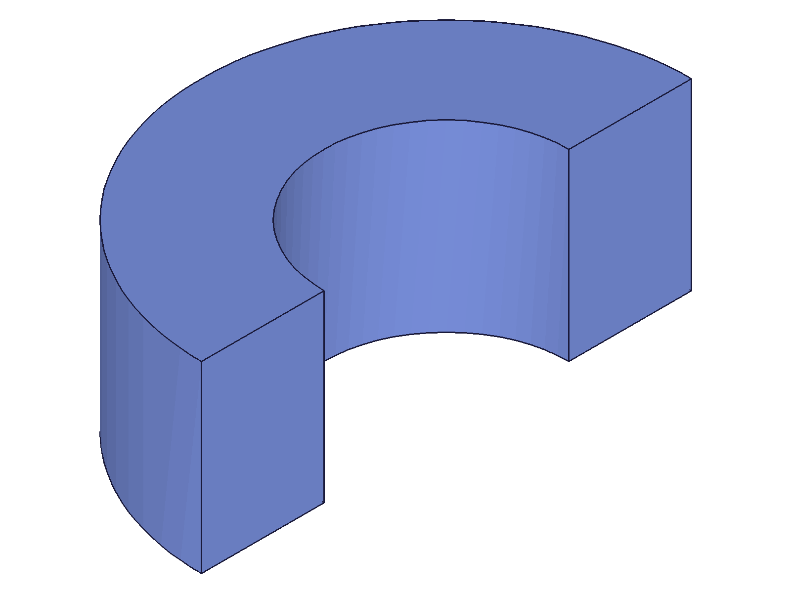 | 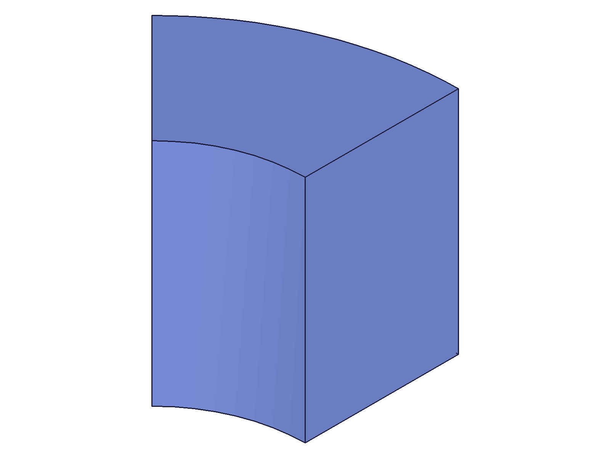 |
|---|---|

**Data:**
- Created revolve with endAngle='@expr.ANG' where ANG=3.14159 (PI). Shows half ring.
- Called `updateExpression` (correct `toUpdate` form) to change ANG to 0.7854 (PI/4). getExpression confirmed: value=0.7854.
- Snapshot after updateExpression (before recalc): geometry changed to ~45° arc. Auto-recalc worked!
- Snapshot after explicit recalc(): identical to above — recalc() was redundant.

**📌 LLM doc:** When @expr. is set at CREATION time (`part.revolve`), updateExpression auto-recalcs geometry — no open/close or recalc() needed. When @expr. is set via `updateRevolve` (post-creation), auto-recalc does NOT work. To get live expression binding after creation, use `linkWithExpression` instead of `updateRevolve`.
