# Training: part.twist & part.updateTwist

**Date:** 2026-04-18

## Goal

Testing `v1.part.twist` and `v1.part.updateTwist` — profile-based parametric feature that sweeps a 2D sketch profile with rotational twist along the extrusion direction.

**Methods to cover:**

- `twist` — basic creation with twistAngle
- `twist` types: UP, DOWN, SYMMETRIC, CUSTOM
- `twist` params: references (region vs contour elements), limit1, limit2, twistAngle, twistCenter, direction, capEnds, name
- `updateTwist` — modify angle, limits, type, capEnds, references after creation

**Questions:**

- How does twistAngle interact with limit2? Is it total twist over the full length?
- What does twistCenter actually do? How does it differ from the default?
- Does direction work the same as extrusion (magnitude irrelevant, limit2 controls distance)?
- What happens with twistAngle=0? Is it just a straight extrusion?
- Can you use negative twistAngle?
- What does capEnds=FALSE produce visually?
- Does updateTwist require openFeature/closeFeature?
- Can references be changed via updateTwist?

---

## 01 — basic twist (angle=0)

Script: `scripts/01-basic-twist.mjs` — ✅ twistAngle=0 produces a straight extrusion (rectangular box), identical to `part.extrusion` with same profile. Feature ID=94, maxLevel=31.

|  |
|---|

**Data:** result=94, maxLevel=31 (see `files/01-basic-twist-basic-twist-response.json`).

**Learned:** twistAngle=0 (default) = straight extrusion. Twist is purely additive to the extrusion sweep.

---

## 02 — twist angles (PI/4, PI/2, PI)

Script: `scripts/02-twist-angles.mjs` — ✅ all three angles work. Progressive twist clearly visible. PI/4=gentle, PI/2=90° rotation, PI=180° dramatic twist.

| 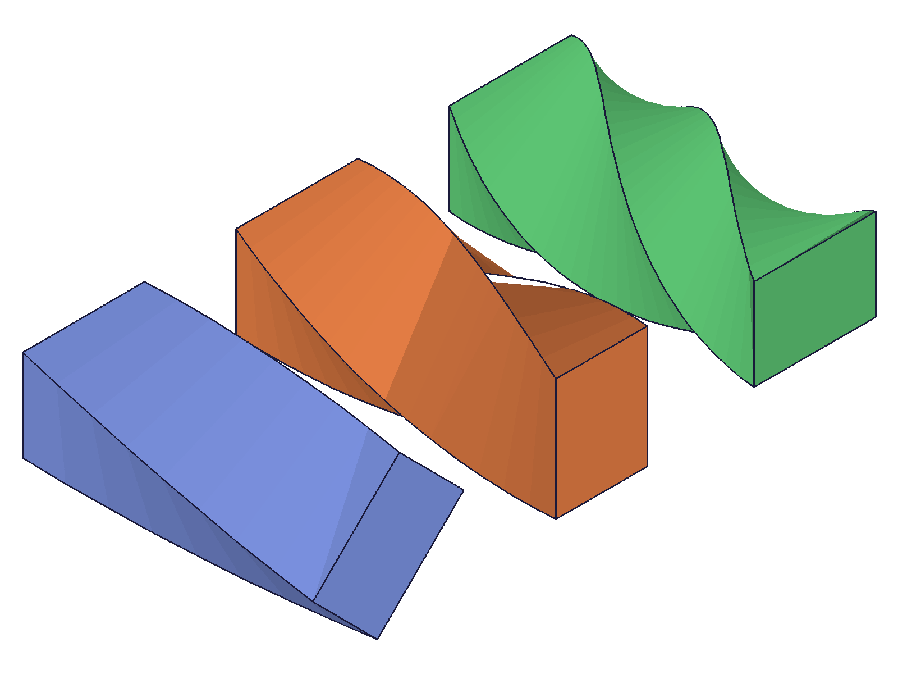 |
|---|

**Data:** PI/4: id=94, PI/2: id=179, PI: id=264 — all maxLevel=31 (see `files/02-twist-angles-twist-angles-response.json`).

**Learned:** twistAngle is the TOTAL rotation of the profile from the base to the top of the extrusion. It's applied progressively over the full length (limit2). The profile at the base matches the original sketch; at the top it's rotated by twistAngle radians.
**📌 LLM doc:** twistAngle is total rotation over the full extrusion length, not per-unit-length.

---

## 03 — negative twist angle

Script: `scripts/03-negative-angle.mjs` — ✅ negative twistAngle (-PI/2) twists in the opposite direction. maxLevel=31.

| 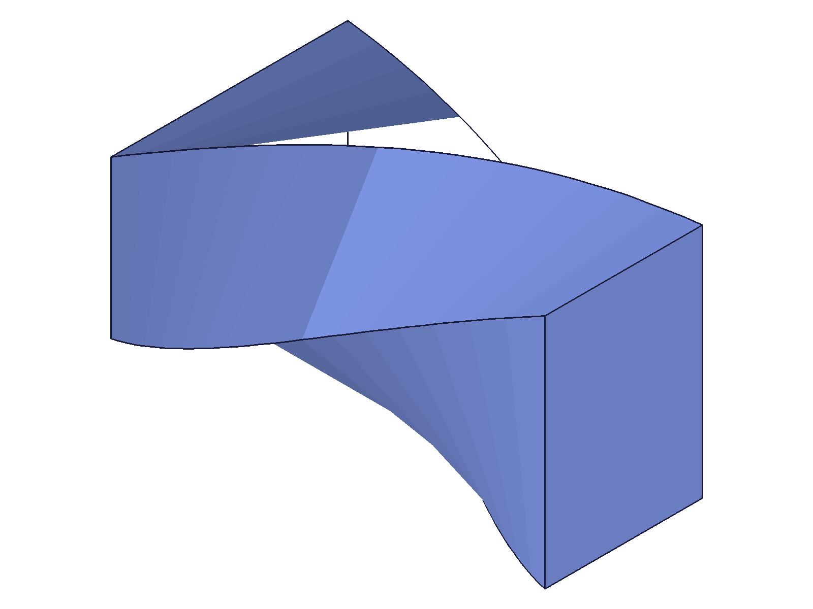 |
|---|

**Data:** result=94, maxLevel=31 (see `files/03-negative-angle-negative-angle-response.json`).

**Learned:** Negative angles twist counterclockwise (when viewed from above, looking down the extrusion direction). Positive = clockwise. Both valid.
**📌 LLM doc:** Negative twistAngle reverses twist direction.

---

## 04 — type variants (UP, DOWN, SYMMETRIC)

Script: `scripts/04-types.mjs` — ✅ all three types work with twist. UP extrudes +Z, DOWN extrudes -Z, SYMMETRIC extrudes both directions.

| 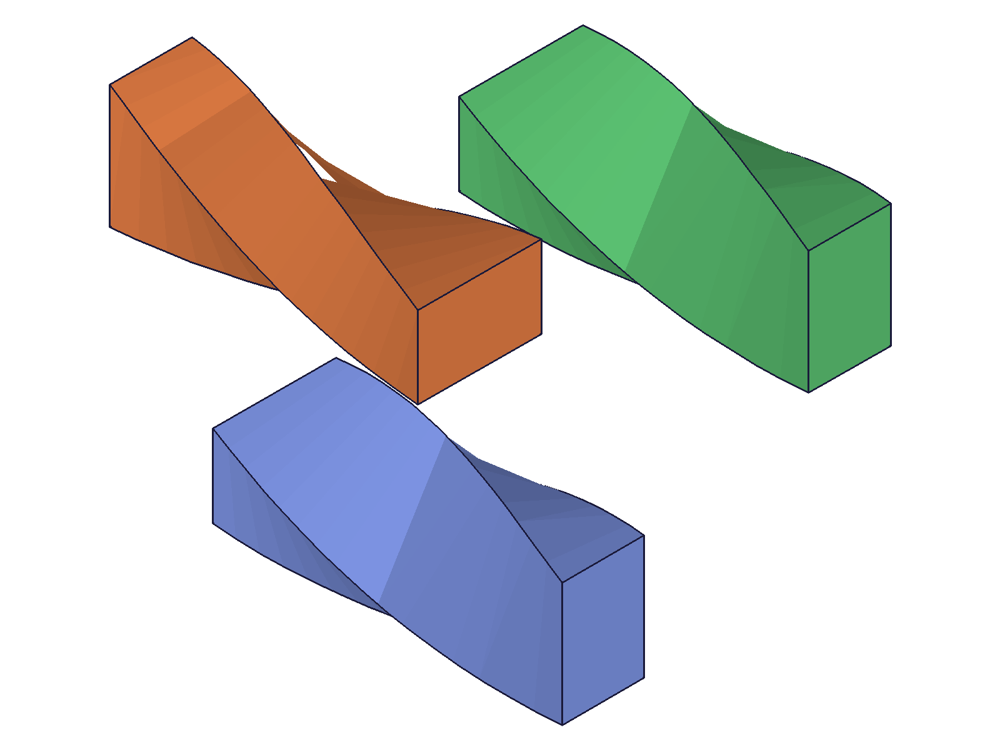 |
|---|

**Data:** UP: id=94, DOWN: id=179, SYMMETRIC: id=264 — all maxLevel=31 (see `files/04-types-types-response.json`).

**Learned:** Type system works identically to `part.extrusion`. SYMMETRIC splits limit2 equally both directions from sketch plane.
**📌 LLM doc:** Types work same as extrusion — UP/DOWN/SYMMETRIC/CUSTOM.

---

## 05 — CUSTOM type with limit1 offset

Script: `scripts/05-custom-type.mjs` — ✅ CUSTOM type with direction=[0,0,1], limit1=20, limit2=120, twistAngle=PI/2. Body starts offset 20mm from sketch plane and extends to 120mm.

|  |
|---|

**Data:** result=94, maxLevel=31 (see `files/05-custom-type-custom-basic-response.json`).

**Learned:** CUSTOM type enables limit1 (start offset) and custom direction. limit1 controls where the body starts, limit2 where it ends. Both are distances along the direction vector.

---

## 06 — capEnds (solid vs sheet)

Script: `scripts/06-cap-ends.mjs` — ✅ capEnds=1 creates capped solid, capEnds=0 creates open sheet body (no top/bottom faces).

| 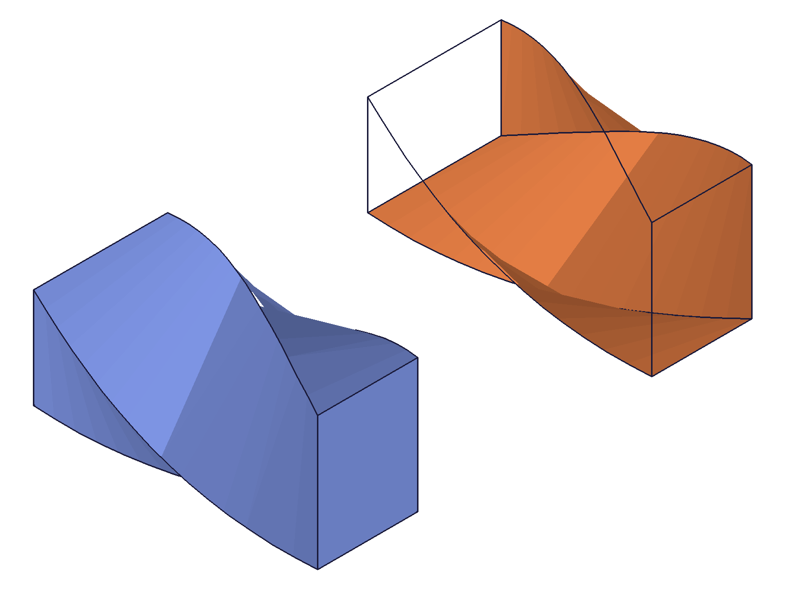 |
|---|

**Data:** capEnds=1: id=94, capEnds=0: id=179 — both maxLevel=31 (see `files/06-cap-ends-cap-ends-response.json`).

**Learned:** Sheet body (capEnds=0) has no caps — top is open wireframe. Useful for surface modeling workflows.
**📌 LLM doc:** capEnds is integer (1/0), not string. Creates sheet body when 0.

---

## 07 — twistCenter (axis position)

Script: `scripts/07-twist-center.mjs` — ✅ **Major finding.** twistCenter defines where the twist axis passes through. When the axis is offset from the profile, the profile orbits around the axis creating a curved/banana shape.

| 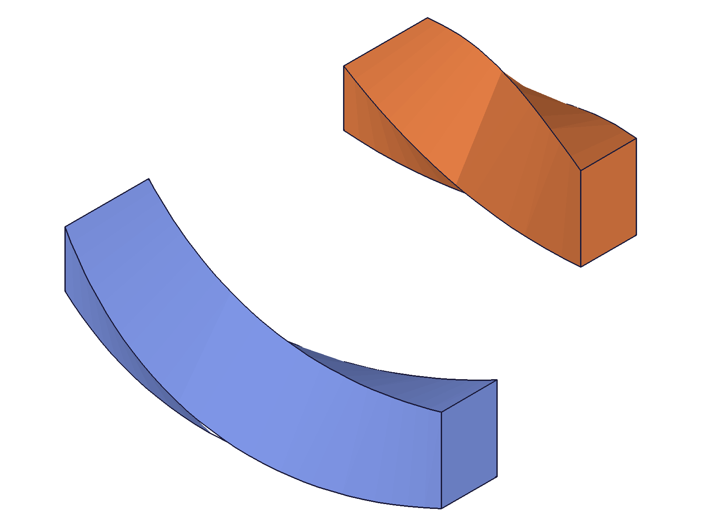 |
|---|

**Data:** center=[0,0,0] (profile at x=-50): id=94, center=[50,0,0] (profile at x=50): id=179 — both maxLevel=31 (see `files/07-twist-center-twist-center-response.json`).

**Learned:** twistCenter + direction define the twist axis LINE. The profile rotates around this axis as it's extruded. If the axis passes through the profile center → pure in-place twist. If the axis is offset → orbital path (body curves away). The blue body orbited around origin because the profile was 50mm away from the axis. The orange body twisted in-place because the axis passed through its center.
**📌 LLM doc:** twistCenter defines the twist axis position — offset from profile center creates orbital/curved bodies. CUSTOM type only.

---

## 08 — diagonal direction

Script: `scripts/08-diagonal-direction.mjs` — ✅ CUSTOM with direction=[1,0,1] produces a diagonal twist at 45°.

| 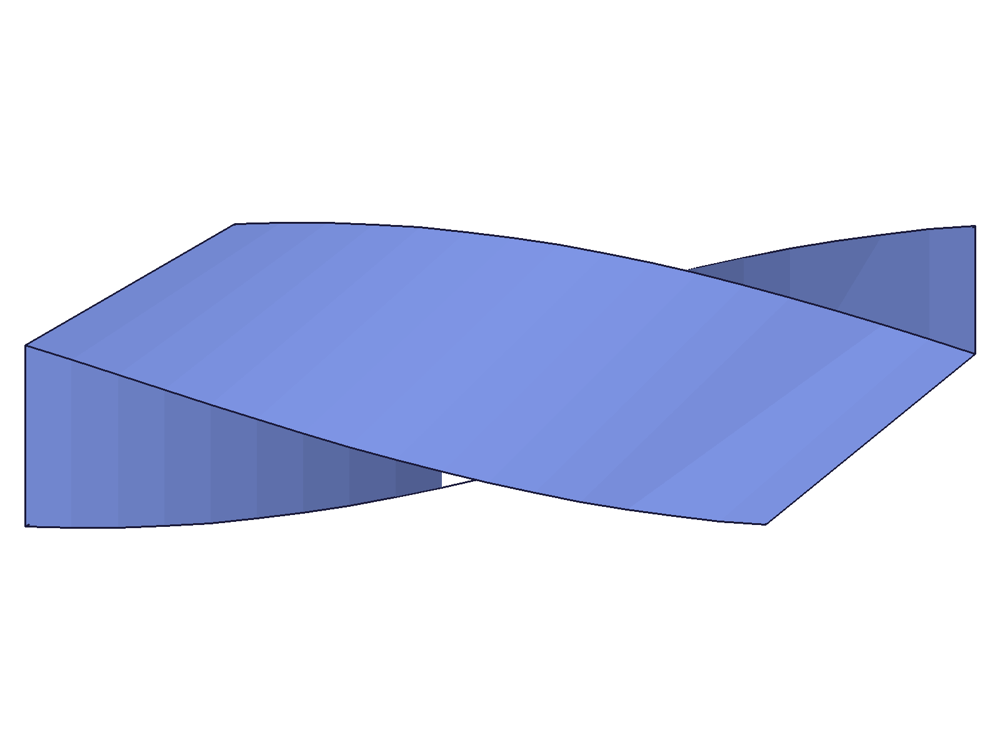 |
|---|

**Data:** result=94, maxLevel=31 (see `files/08-diagonal-direction-diagonal-response.json`).

**Learned:** Diagonal directions work fine. The twist axis aligns with the direction vector. Magnitude is irrelevant — limit2 controls the distance.

---

## 09 — perpendicular direction (error)

Script: `scripts/09-perpendicular-direction.mjs` — ❌ direction=[1,0,0] (perpendicular to sketch normal [0,0,1]) fails with error 1122.

**Data:** result=94 (degenerate feature), maxLevel=51. Error: "Direction not valid. Direction can't be perpendicular to the normal vector of sketch plane for PerpTwist (CC_Twist)." (see `files/09-perpendicular-direction-perpendicular-response.json`).

**Learned:** Same constraint as extrusion — direction must have a component along the sketch normal. Cannot twist purely sideways.
**📌 LLM doc:** Direction can't be perpendicular to sketch normal — same as extrusion.

---

## 10 — updateTwist (basic)

Script: `scripts/10-update-twist.mjs` — ✅ updateTwist works with openFeature/closeFeature. Changed twistAngle from PI/4→PI and limit2 from 80→120.

| 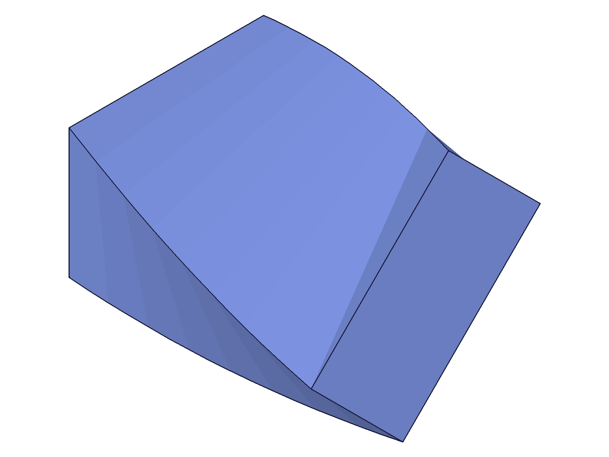 | 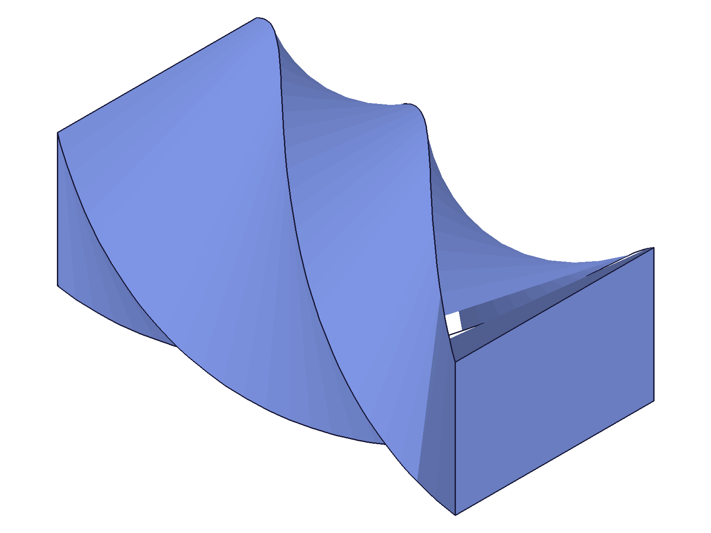 |
| --- | --- |

**Data:** updateTwist result=94, maxLevel=31 (see `files/10-update-twist-update-response.json`). Before: gentle PI/4 twist. After: dramatic PI twist, longer body.

**Learned:** updateTwist follows standard open→update→close pattern. Can modify twistAngle and limit2.

---

## 11 — updateTwist type & capEnds change

Script: `scripts/11-update-type-change.mjs` — ✅ Changed type from UP→SYMMETRIC and capEnds from 1→0. Both updates succeed.

**Data:** SYMMETRIC change: result=94, maxLevel=31. capEnds=0 change: result=94, maxLevel=31 (see `files/11-update-type-change-update-type-response.json`).

**Learned:** updateTwist can change type and capEnds post-creation.

---

## 12 — expression-driven twist

Script: `scripts/12-expressions.mjs` — ✅ twistAngle and limit2 accept `@expr.` expressions. Updating the expression and recalcing changes the twist.

|  | 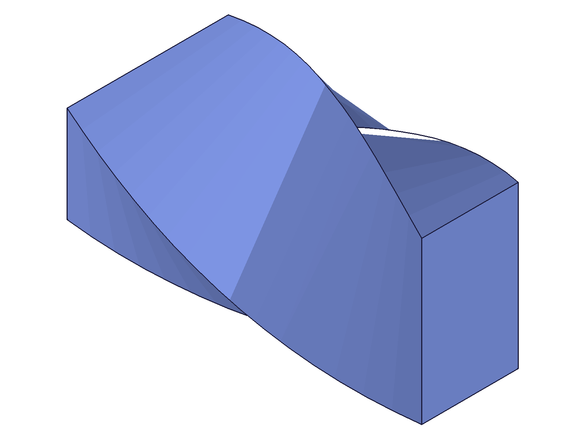 |
| --- | --- |

**Data:** result=96, maxLevel=31 (see `files/12-expressions-expr-response.json`). Created with A=PI/2, then updated A to PI. Visual change confirmed in snapshots.

**Learned:** Expression binding works for twistAngle and limit2 via `@expr.NAME` syntax.
**📌 LLM doc:** All numeric params accept expressions.

---

## 13 — contour element references

Script: `scripts/13-contour-refs.mjs` — ✅ Passing sketch line IDs directly (no region) works. result=92, maxLevel=31.

**Data:** see `files/13-contour-refs-contour-response.json`.

**Learned:** Like extrusion, references accepts both region IDs and contour element IDs forming a closed profile.

---

## 14 — edge cases

Script: `scripts/14-edge-cases.mjs` — mixed results.

- **limit2=0** — ❌ maxLevel=51, error 1122: "Height not valid. Value for height must be greater than 0"
- **empty refs []** — ❌ maxLevel=51: "Nothing was selected" + "There is no sketch region"
- **4π angle (2 full rotations)** — ✅ maxLevel=31, creates drill-bit/helical shape
- **negative limit2 (-50)** — ✅ maxLevel=31, reverses extrusion direction

| 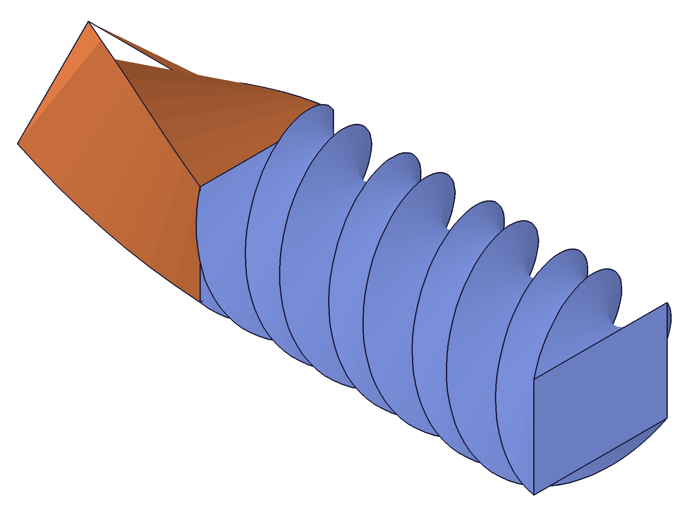 |
|---|

**Data:** see `files/14-edge-cases-edge-cases-response.json`.

**Learned:** No upper limit on twistAngle — large angles produce multi-rotation helical bodies. Negative limit2 reverses direction (same as extrusion). Zero limit and empty refs produce degenerate features.
**📌 LLM doc:** No angle limit. limit2=0 and empty refs are errors. Negative limit2 valid.

---

## 15 — updateTwist without openFeature

Script: `scripts/15-update-without-open.mjs` — ❌ Fails with error 1200: "The provided feature is not allowed to update. It's not active and open."

**Data:** result=null, maxLevel=51 (see `files/15-update-without-open-no-open-response.json`).

**Learned:** openFeature is required before updateTwist, same as all update* APIs.
**📌 LLM doc:** updateTwist requires openFeature/closeFeature.

---

## 16 — capEnds string type

Script: `scripts/16-capends-string.mjs` — ❌ capEnds='FALSE' fails with error 1001: "The parameter 'capEnds' has the wrong type! It should be of type (boolean)"

**Data:** result=null, maxLevel=51 (see `files/16-capends-string-cap-string-response.json`).

**Learned:** capEnds must be integer (1 or 0), NOT strings 'TRUE'/'FALSE'. Same as extrusion.
**📌 LLM doc:** capEnds is integer boolean (1/0), not string.

---

## 17 — twistCenter with UP type

Script: `scripts/17-twistcenter-up-type.mjs` — ✅ twistCenter=[50,0,0] with type=UP. Profile at x=30-70. Result is a normal in-place twist — no orbital curvature.

| 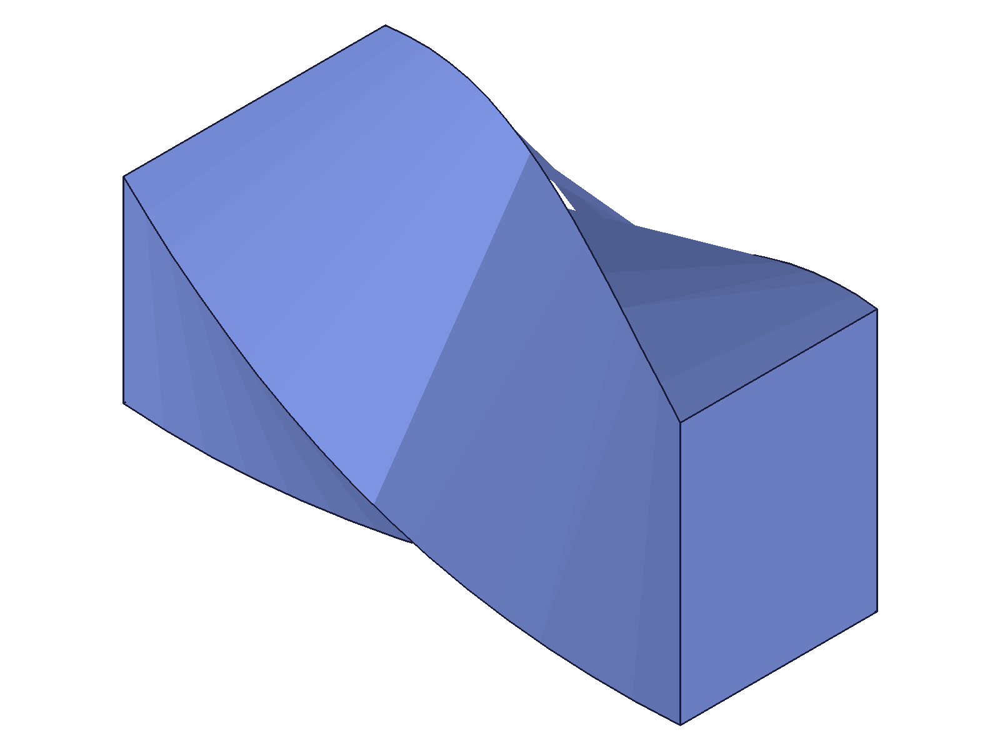 |
|---|

**Data:** result=94, maxLevel=31 (see `files/17-twistcenter-up-type-center-up-response.json`).

**Learned:** Confirms the docs: twistCenter is silently ignored for non-CUSTOM types. For UP/DOWN/SYMMETRIC, the twist axis automatically uses the sketch normal through the profile area. Only CUSTOM type respects twistCenter.
**📌 LLM doc:** twistCenter and direction are CUSTOM-only. Silently ignored otherwise.

---

## Coverage Checklist

- [x] twist called successfully with basic params
- [x] All required params tested (id, references)
- [x] Key optional params: twistAngle, limit2, limit1, type, direction, twistCenter, capEnds, name
- [x] All type variants: UP, DOWN, SYMMETRIC, CUSTOM
- [x] updateTwist tested (angle, limit, type, capEnds changes)
- [x] Contour element refs (not just regions)
- [x] Expression-driven params
- [x] Edge cases: zero limit, empty refs, large angle, negative angle, negative limit
- [x] Error cases: perpendicular direction, missing openFeature, string capEnds
- [x] Behavioral claims verified with data AND snapshots
