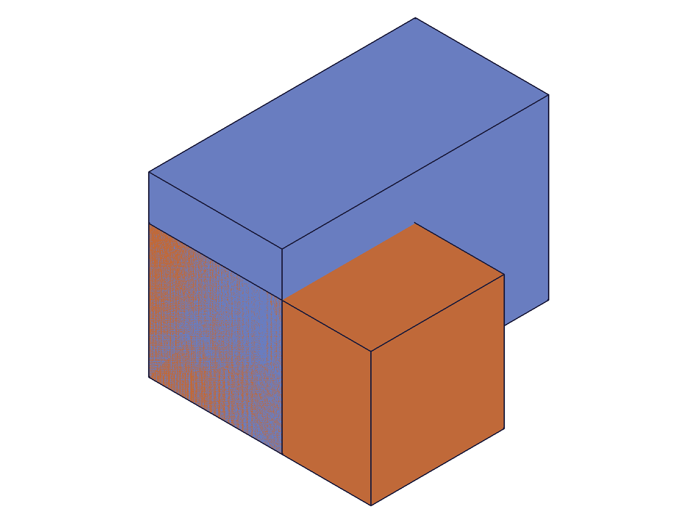
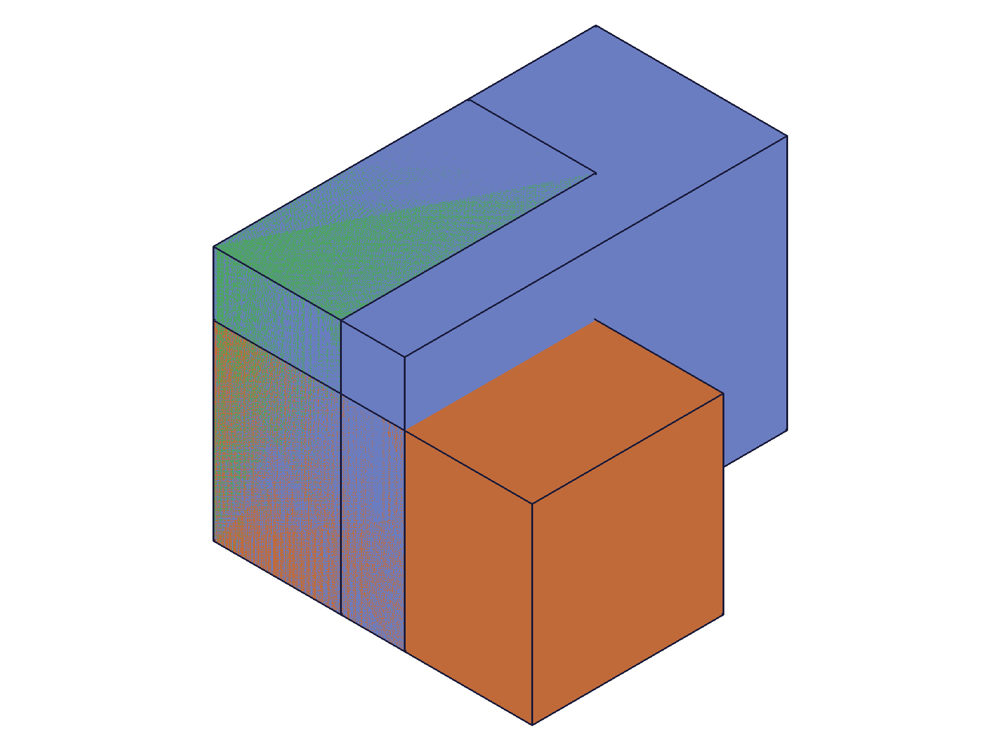
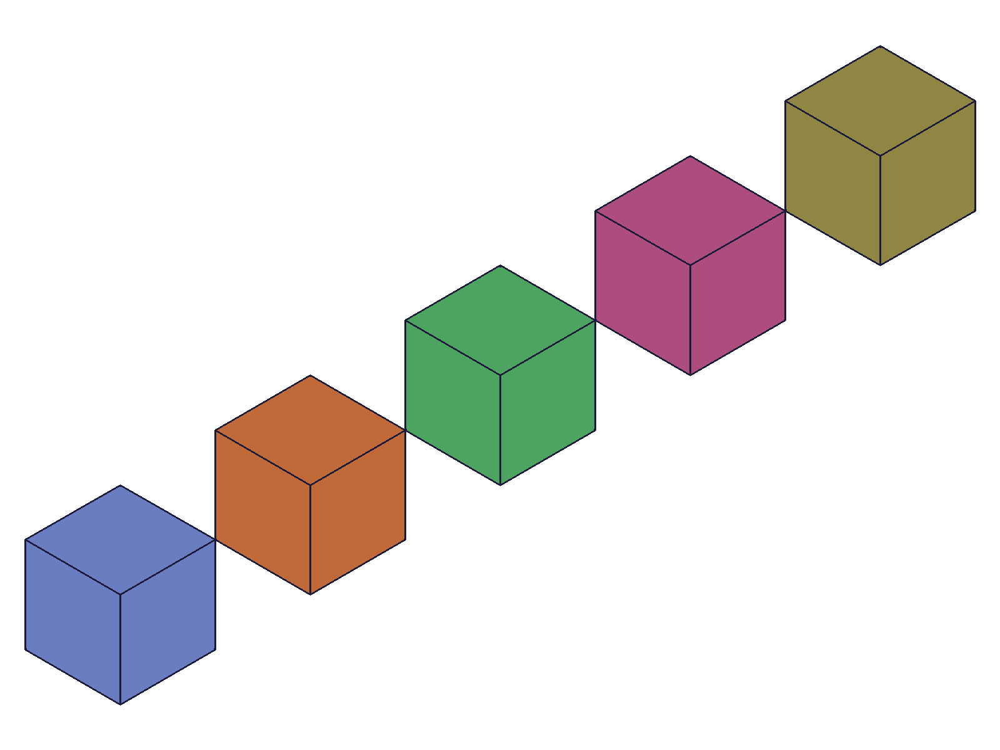
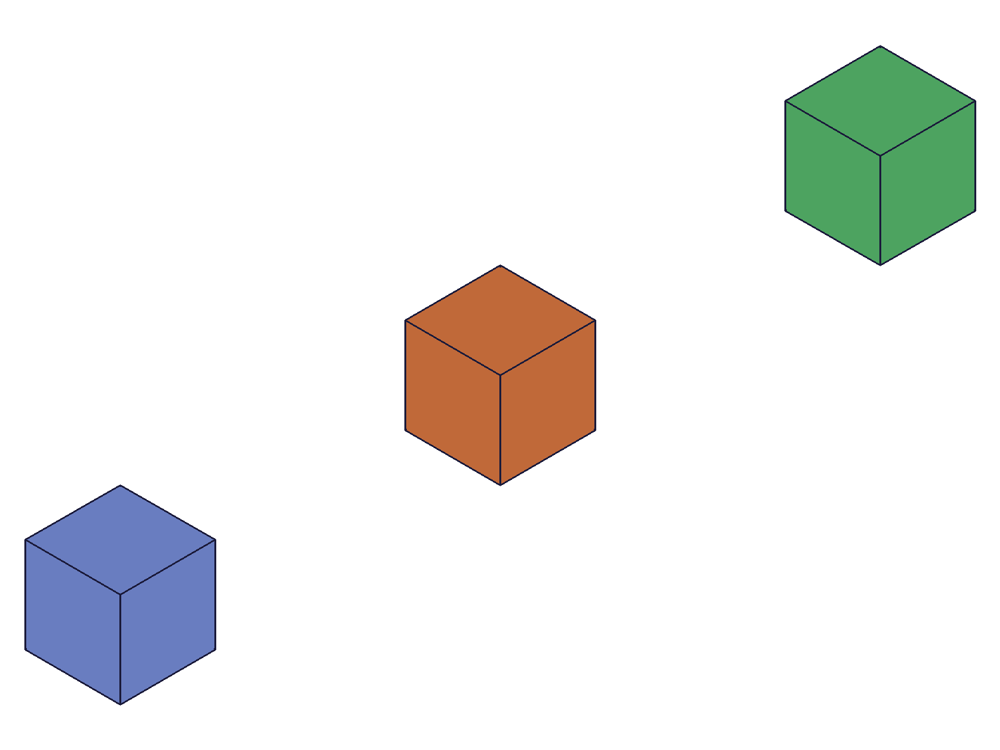
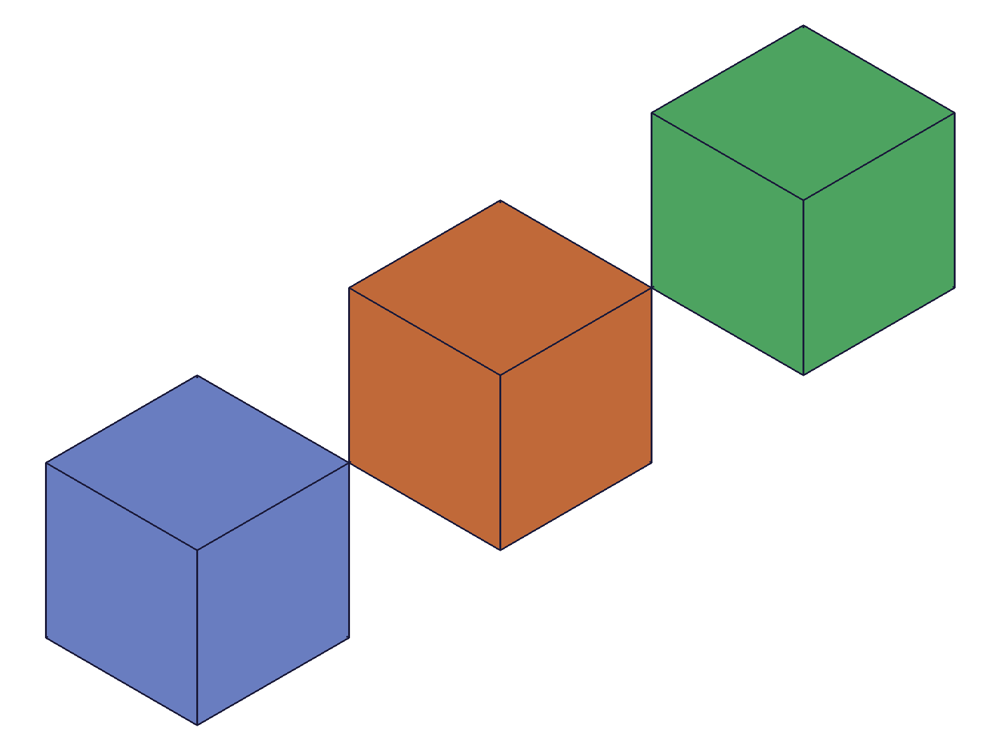
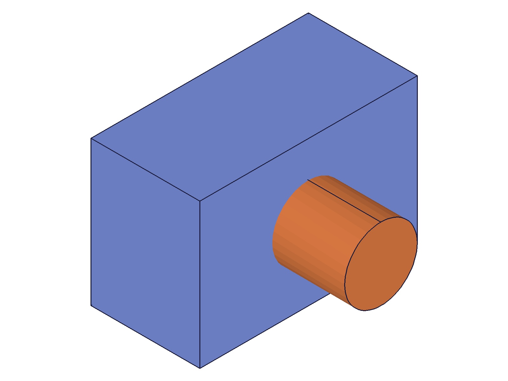

# Training: part.entityDeletion & part.updateEntityDeletion

**Date:** 2026-04-20

## Goal

Testing `v1.part.entityDeletion` and `v1.part.updateEntityDeletion`.

**Methods to cover:**

- `entityDeletion` — basic deletion of a feature's solid(s)
- `entityDeletion` params: id (part), name, targets (as plain IDs), targets with indices
- `entityDeletion` with pattern features — deleting specific pattern instances by index
- `entityDeletion` with multiple targets
- `updateEntityDeletion` — change targets, change indices after creation
- `updateEntityDeletion` — requires open/close feature gate

**Questions:**

- What exactly does entityDeletion do? Does it remove the feature or just suppress its geometry?
- How do indices work — are they 0-based? Do they map to pattern instance indices?
- Can you target a simple feature (box, extrusion) or only multi-solid features (patterns)?
- What happens if you target all instances of a pattern?
- What does the return value look like?
- Is the deletion reversible (via updateEntityDeletion removing the target)?
- What happens with invalid/non-existent targets?

---

## 01 — basic entityDeletion (simple feature)

Script: `scripts/01-basic-deletion.mjs` — ✅ entityDeletion removes a box feature's geometry.

Created two boxes (Box1 at origin, Box2 offset via workCSys). entityDeletion targeting Box2 returned feature ID 192 with maxLevel 31 (info).

|  |  |
|---|---|

**Data:** STEP body count — before: 2, after: 1. Box2 solid removed.

**Learned:** entityDeletion creates a new feature in the design tree that suppresses targeted features' geometry. Returns the deletion feature's own ID.
**📌 LLM doc:** Basic usage, return value is the deletion feature ID.

---

## 02 — multiple targets

Script: `scripts/02-multiple-targets.mjs` — ✅ multiple plain IDs work in targets array.

Created three boxes, deleted box2 and box3 in one entityDeletion call.

|  |  |
|---|---|

**Data:** STEP body count — before: 3, after: 1 (not checked explicitly but visual confirms).

**Learned:** Multiple plain IDs in targets array works as expected.

---

## 03 — pattern with indices

Script: `scripts/03-pattern-indices.mjs` — ✅ indices selectively delete pattern instances.

Created a box + linearPattern(count=5). Deleted indices [1, 3] from the pattern.

|  |  |
|---|---|

**Data:** STEP body count — before: 5, after: 3. Exactly 2 instances removed (the 2nd and 4th). Indices are 0-based.

**Learned:** Indices are 0-based, matching the pattern's LP1_0 through LP1_N children in the structure tree. Visually creates gaps in the pattern.
**📌 LLM doc:** Indices are 0-based, work with linearPattern/circularPattern instances.

---

## 04/06 — targets as object without indices (delete all)

Scripts: `scripts/04-targets-object-format.mjs`, `scripts/06-structure-analysis.mjs` — ✅ `{ id: patternId }` without indices deletes ALL solids.

**Data:** STEP body count — before: 4, after: 0 in both scripts. Structure tree still shows LP1 with 4 children (LP1_0..LP1_3), but the entityDeletion feature (Del1) suppresses all their geometry.

**IMPORTANT FINDING:** The PNG snapshots showed 4 boxes AFTER deletion — stale render data. The STEP export (0 bodies) is the ground truth. The renderer does not always update correctly after entityDeletion.

**Learned:** Targeting a pattern with `{ id: pattern }` (no indices) deletes ALL instances. The original box feature's solid is also gone — the pattern consumes it.
**📌 LLM doc:** No indices = delete all solids from that feature. Renderer may show stale data — trust STEP export.

---

## 07 — updateEntityDeletion (change indices)

Script: `scripts/07-update-deletion.mjs` — ✅ update changes which indices are deleted.

Initial: deleted indices [1, 3] from a 5-count pattern. Updated: changed to delete indices [0, 4].

|  |  |
|---|---|

**Data:** STEP body count — 3 in both states (5-2=3). Different gaps visible in snapshots. updateEntityDeletion returns the deletion feature's own ID (226). Requires open/close gate.

**Learned:** updateEntityDeletion REPLACES the targets list entirely (not additive). Must use openFeature/closeFeature.
**📌 LLM doc:** Update replaces targets, requires gate, returns same feature ID.

---

## 08 — error cases

Script: `scripts/08-error-cases.mjs` — documented error behaviors.

| Test | maxLevel | Error message |
|---|---|---|
| Invalid target ID (99999) | 51 | "ToId()/TOID() didn't get an existing or valid id." |
| Out-of-range index (5 on single-solid) | 51 | "[Evaluation error in APIHelper.PrepareEntityObjs:[CCVM::ldm: objId not found]]" |
| Empty targets array | 51 | "The type '0' is not supported in PrepareAPIParams!" |

**Learned:** All invalid inputs return maxLevel 51 with descriptive errors. Empty targets = type error, not a graceful "nothing to delete".
**📌 LLM doc:** Common error messages and what they mean.

---

## 09 — update without open/close gate

Script: `scripts/09-update-no-gate.mjs` — ✅ confirmed gate requirement.

Without openFeature: maxLevel 51, "The provided feature is not allowed to update. It's not active and open."
With openFeature: maxLevel 31, success.

**Learned:** Same gate pattern as all other update APIs.

---

## 10 — delete all pattern indices explicitly

Script: `scripts/10-delete-all-pattern-indices.mjs` — ✅ deleting all indices removes all geometry.

**Data:** STEP body count — before: 4, after: 0. Same result as targeting the pattern without indices (script 04/06).

---

## 11 — extrusion feature target

Script: `scripts/11-extrusion-target.mjs` — ✅ works with any feature type, not just boxes/patterns.

Created box + extrusion (circle profile). Deleted the extrusion.

|  |  |
|---|---|

**Data:** STEP body count — before: 2, after: 1. Extrusion's cylinder removed, box remains.

**Learned:** entityDeletion works with any feature that produces geometry (box, cylinder, extrusion, pattern, etc.).
**📌 LLM doc:** Works with any solid-producing feature.

---

## 12 — delete source box consumed by pattern

Script: `scripts/12-delete-source-box.mjs` — ❌ fails with error.

Error: "Entity 'Box1' is not available. It has already been consumed/used in another operation." (code 1014, maxLevel 51)

**Learned:** Cannot target a feature whose geometry has been consumed by a downstream feature (like a pattern). Must target the consuming feature (the pattern) instead.
**📌 LLM doc:** Document the consumed-feature restriction.

---

## 13 — mixed target formats (plain ID + object)

Script: `scripts/13-mixed-targets.mjs` — ❌ fails with type error.

Error: "An element of parameter 'targets' has the wrong type! It should be of type (string|real|id)" (code 1001, maxLevel 51)

**Learned:** Cannot mix plain IDs and `{ id, indices }` objects in the same targets array. Must use one format consistently.
**📌 LLM doc:** Document the format consistency requirement.

---

## 14 — all-objects format with mixed intents

Script: `scripts/14-all-objects-mixed.mjs` — ✅ works when ALL targets are objects.

Deleted cylinder (`{ id: cyl }`) and pattern indices 1,2 (`{ id: pattern, indices: [1, 2] }`) in one call.

**Data:** STEP body count — before: 5 (1 cylinder + 4 pattern), after: 2 (2 remaining pattern instances).

**Learned:** Use all-objects format when mixing simple features and indexed pattern deletion in the same call.
**📌 LLM doc:** To mix feature deletion with selective pattern deletion, use all-objects format.

---

## 15 — update name

Script: `scripts/15-update-name.mjs` — ✅ name updates via updateEntityDeletion.

Structure tree confirmed: feature name changed from "OrigName" to "RenamedDeletion" (id=136).

**Learned:** Name can be changed via updateEntityDeletion's `name` parameter.
