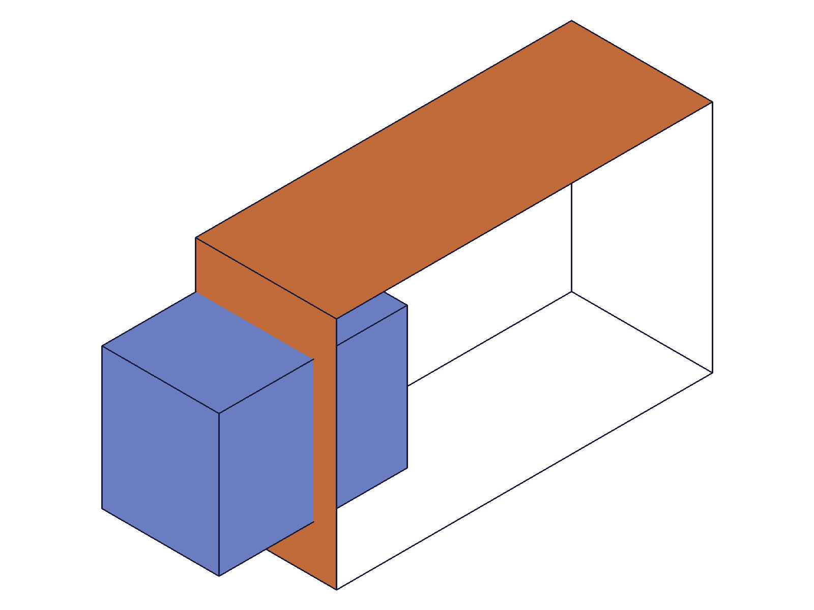
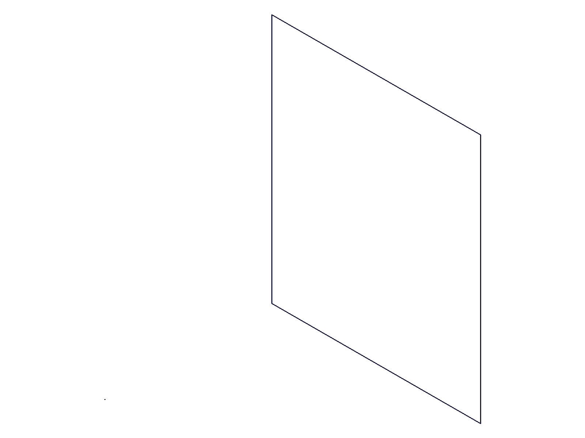
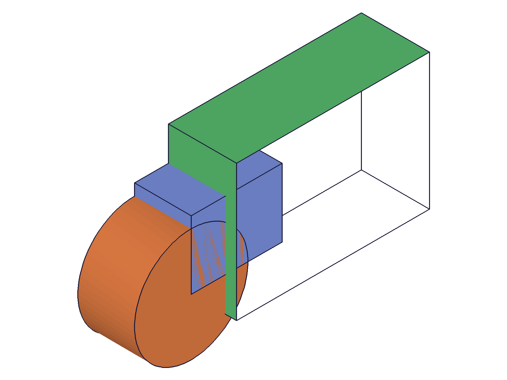
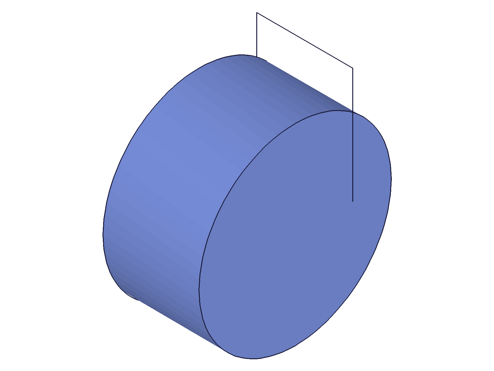
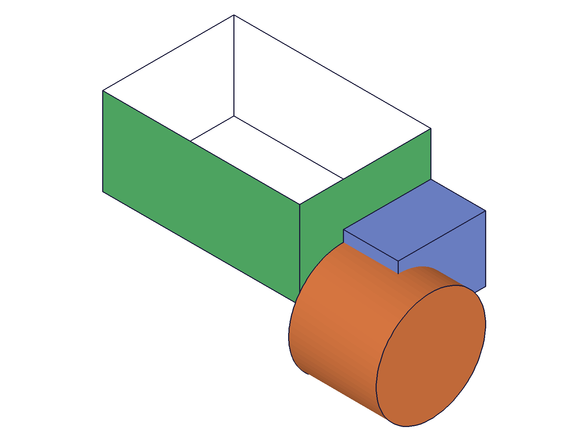
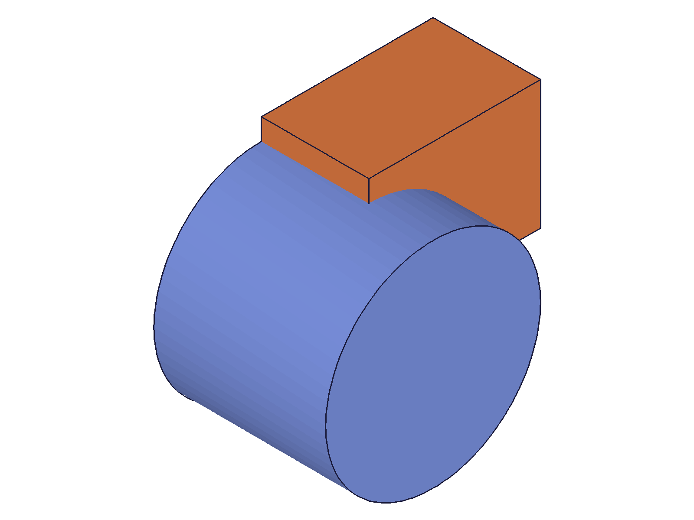
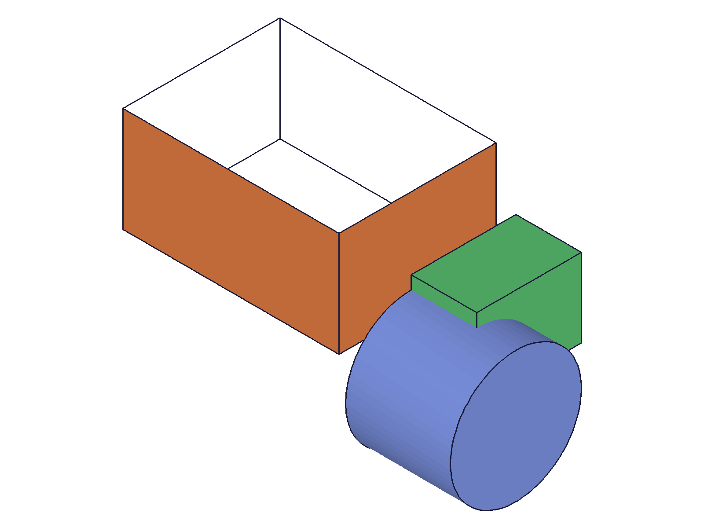
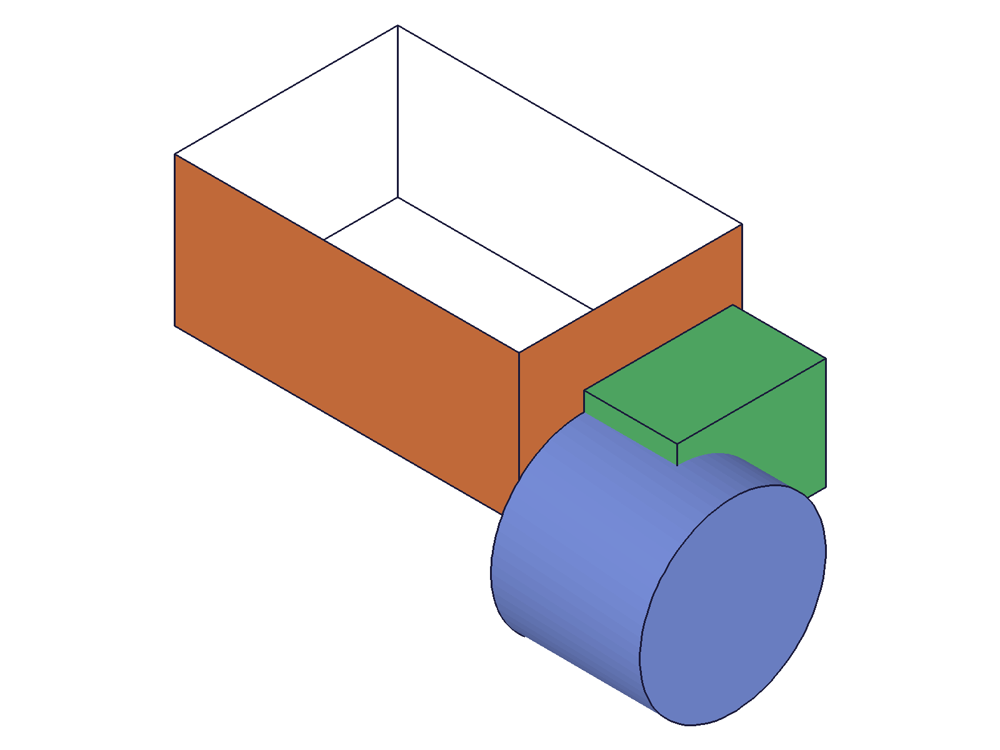

# Training: part.sliceBySheet & part.updateSliceBySheet

**Date:** 2026-04-20

## Goal

Testing `v1.part.sliceBySheet` and `v1.part.updateSliceBySheet`.

**Methods to cover:**

- `sliceBySheet` — basic slice using a sheet body (extrusion with capEnds=0)
- `sliceBySheet` params: id, target, tool, inverted, name
- `sliceBySheet` — target as plain ID vs object with indices
- `sliceBySheet` — tool as plain ID vs object with indices
- `sliceBySheet` — inverted flag (which side to keep)
- `sliceBySheet` — sheet not intersecting target (edge case)
- `sliceBySheet` — consumption behavior (are target/tool consumed?)
- `updateSliceBySheet` — change inverted, target, tool, name
- `updateSliceBySheet` — requires openFeature?

## 01 — basic slice attempt (non-intersecting tube)

Script: `scripts/01-basic-slice-by-sheet.mjs` — ✅ call succeeded but sheet tube didn't intersect the box. Rectangle on Top (XY) plane from (-20,-20) to (100,80) with CUSTOM extrusion z=20 to z=21 — all 4 tube walls outside box boundaries. Result was a silent no-op: maxLevel=31, new feature ID returned.

## 02 — sheet intersecting box (vertical wall at x=30)

Script: `scripts/02-sheet-intersects-box.mjs` — ✅ call succeeded (result 269, maxLevel 31). Sheet tube on Top (XY) plane, rectangle from (30,-30) to (200,90), extruded UP z=0 to z=60. Wall at x=30 passes through box (80x60x50).

|  |  |
|---|---|

**Data:** After image shows only a flat rectangular outline — no visible solid body. The slice produced geometry but it appears to be a sheet, not a solid.

## 03 — clean slice with reference cylinder

Script: `scripts/03-clean-slice.mjs` — ⚠️ sliceBySheet succeeded (maxLevel 31) but the result is a **CC_Sheet** body, not a CC_Solid. Boolean union with the slice result failed: `"The body used for Union (CC_Union) is a Sheet, please select a solid."`

|  |  |
|---|---|

**Data:** Before shows box (blue) + sheet tube (green) + cylinder (orange). After shows only the cylinder — the box solid was consumed and the result is an unusable sheet body.

**📌 LLM doc:** Top (XY) plane extrusion produces CC_Sheet results from sliceBySheet — document this critical gotcha.

## 04 — investigate result structure

Script: `scripts/04-investigate-result.mjs` — Structure dump confirms: CC_SliceBySheet (174) has child `CC_Sheet` named `SliceBySheet_0`. Internal members: `bodyToCut=87` (box CC_Solid, consumed=1), `sheetBody=170` (CC_Sheet, consumed=1). Graphic shows 0 meshes, 0 edges.

**Learned:** Both target solid and tool sheet are consumed. The result body type depends on the sheet geometry — vertical wall from Top plane extrusion → CC_Sheet.

## 05 — horizontal sheet from Front plane ✓

Script: `scripts/05-horizontal-sheet.mjs` — ✅ SUCCESS. Sheet created on Front (XZ) plane, rectangle from (-20, 20) to (100, 200), extruded along +Y. Horizontal wall at z=20 cuts through the box. Result is **CC_Solid** (not CC_Sheet). Boolean union with the slice result succeeded (maxLevel 31).

|  |  |
|---|---|

**Data:** CC_SliceBySheet child is `CC_Solid` named `SliceBySheet_0`. After image shows sliced box portion (orange, flatter shape) and reference cylinder (blue).

**📌 LLM doc:** Front (XZ) plane extrusion produces working CC_Solid results. The sketch plane used for sheet creation determines whether sliceBySheet produces solid or sheet results.

## 06 — vertical sheet inverted comparison

Script: `scripts/06-vertical-inverted.mjs` — Top (XY) plane vertical sheet always produces CC_Sheet regardless of inverted value. inverted=0: CC_Sheet (maxLevel 31). inverted=1: CC_Sheet, result=null (maxLevel 51, error).

## 07 — vertical sheet from Right plane ✓

Script: `scripts/07-right-plane-vertical.mjs` — ✅ Right (YZ) plane extrusion works! Cutting wall at y=30 passes through box. Result is CC_Solid. Boolean test succeeded.

**📌 LLM doc:** Both Front and Right plane extrusions produce correct solid results. Only Top (XY) plane extrusions are broken.

## 08 — Top plane different edge orientations

Script: `scripts/08-top-plane-y-cut.mjs` — Both y=30 and x=50 cuts from Top plane → CC_Sheet. Confirms the issue is the sketch plane, not the specific edge.

## 09–11 — inverted parameter behavior

Scripts 09–11: inverted=1 works correctly in a clean script (CC_Solid, maxLevel 31). The failure in script 09 was due to multiple `part.create` calls in one script. inverted must be **integer 0 or 1** — `true` (JS boolean) and `'TRUE'` (string) both fail with misleading error: `"id" must be provided to create CC_SliceBySheet"`.

**📌 LLM doc:** inverted is integer 0/1 only, same as capEnds. Document the misleading error for wrong types.

## 12 — consumption behavior

Script: `scripts/12-consumption.mjs` — ✅ Confirmed:
- **Target is consumed:** boxId reuse → `"Entity 'Box' is not available. It has already been consumed/used in another operation."` (code 1014)
- **Tool (sheet) is consumed:** sheetId reuse → `"Entity 'Sheet' is not available. It has already been consumed/used in another operation."`
- **Slice result is usable:** boolean with returned sliceId succeeded (maxLevel 31)

**📌 LLM doc:** Both target and tool are consumed — same pattern as part.slice and part.boolean.

## 13 — object form target/tool + name

Script: `scripts/13-object-target-tool.mjs` — ✅ Object form `{ id, indices: [0] }` works for both target and tool. Name parameter works — feature named `MySlice`, body named `MySlice_0`.

## 14 — solid as tool (error case)

Script: `scripts/14-solid-tool-error.mjs` — ✅ Expected error: `"The solid selected as sheet body used for SliceBySheet (CC_SliceBySheet) is not a sheet"`. maxLevel 51. A degenerate feature ID (110) is returned despite the error.

**📌 LLM doc:** The tool MUST be a sheet body. Solids are rejected with a clear error message.

## 15 — updateSliceBySheet

Script: `scripts/15-update-slice-by-sheet.mjs` — ✅ All update operations work:
- **Without openFeature:** Correctly fails: `"The provided feature is not allowed to update. It's not active and open."` + `"id" must be provided for update."`
- **Update inverted:** ✓ (maxLevel 31)
- **Update tool:** ✓ — changed from sheetId to sheet2Id
- **Update name:** ✓ — renamed to 'RenamedSlice', verified in structure

|  |  |  |
|---|---|---|

**📌 LLM doc:** updateSliceBySheet requires openFeature/closeFeature. Can update inverted, tool, name, target.

## 16 — no intersection (Front plane approach)

Script: `scripts/16-no-intersection.mjs` — Sheet at z=100, box height=50. No intersection. Result: CC_Solid, maxLevel 31. Silent no-op — solid preserved on one side of the non-intersecting sheet.

**📌 LLM doc:** No-intersection is a silent no-op, same as part.slice.
