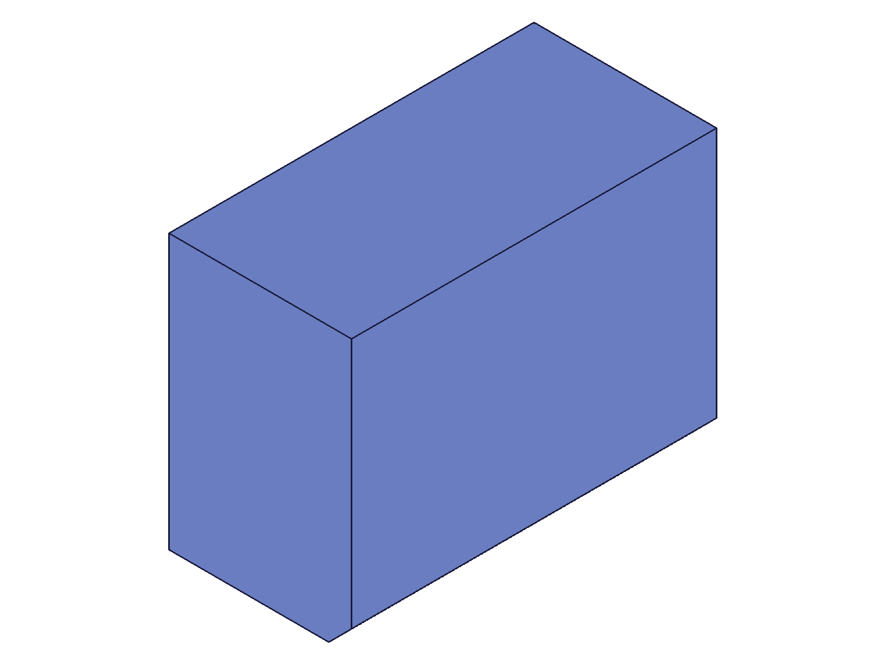
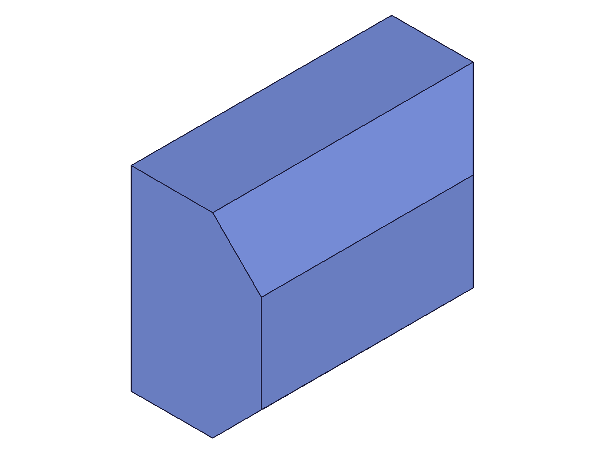
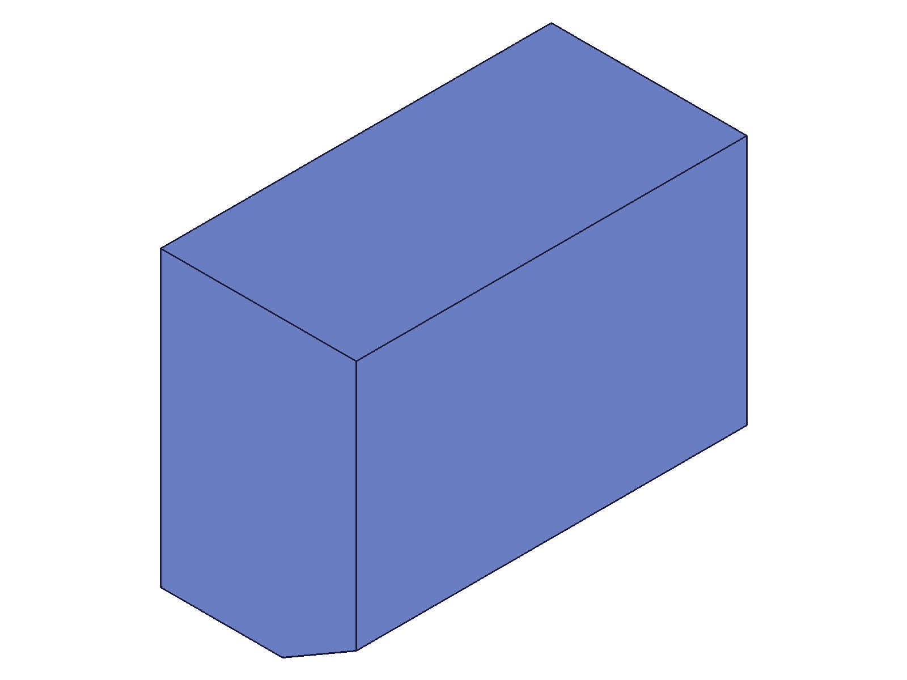
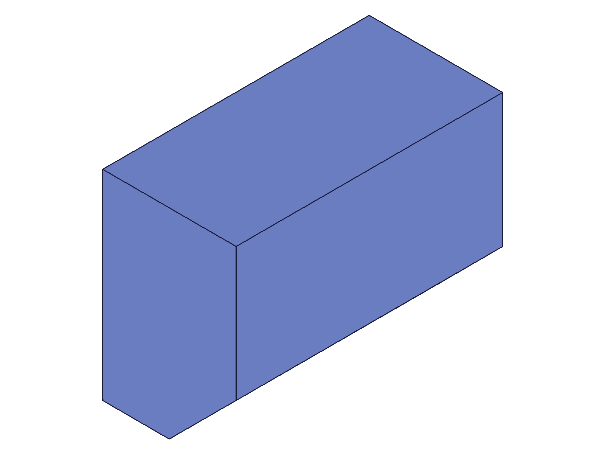
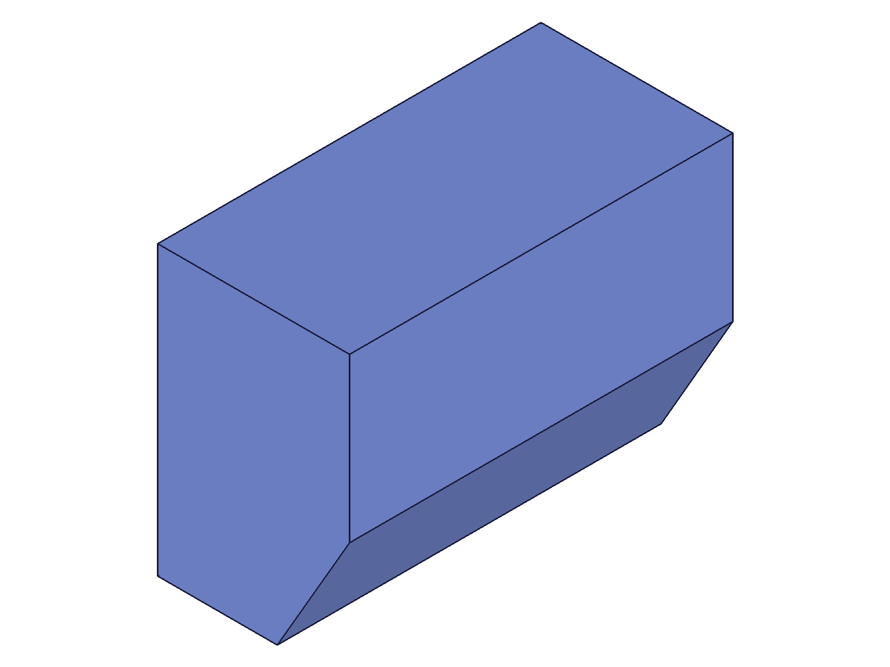
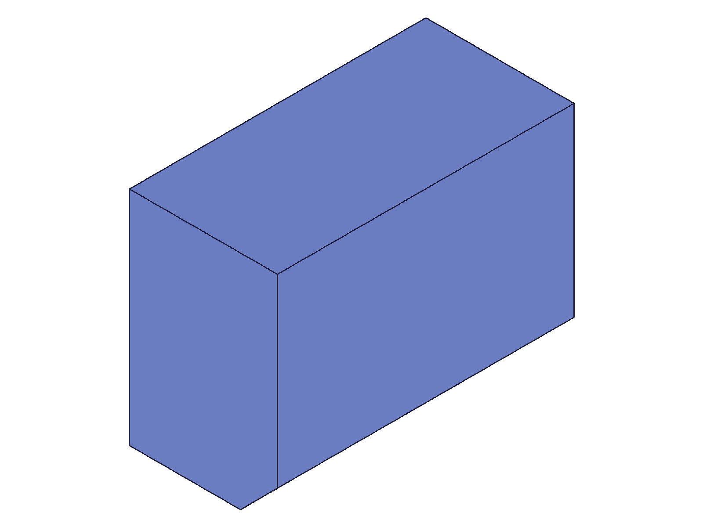
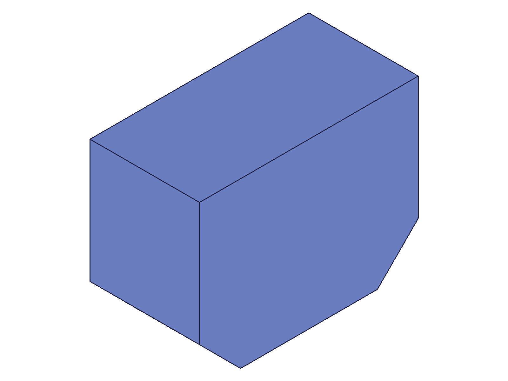
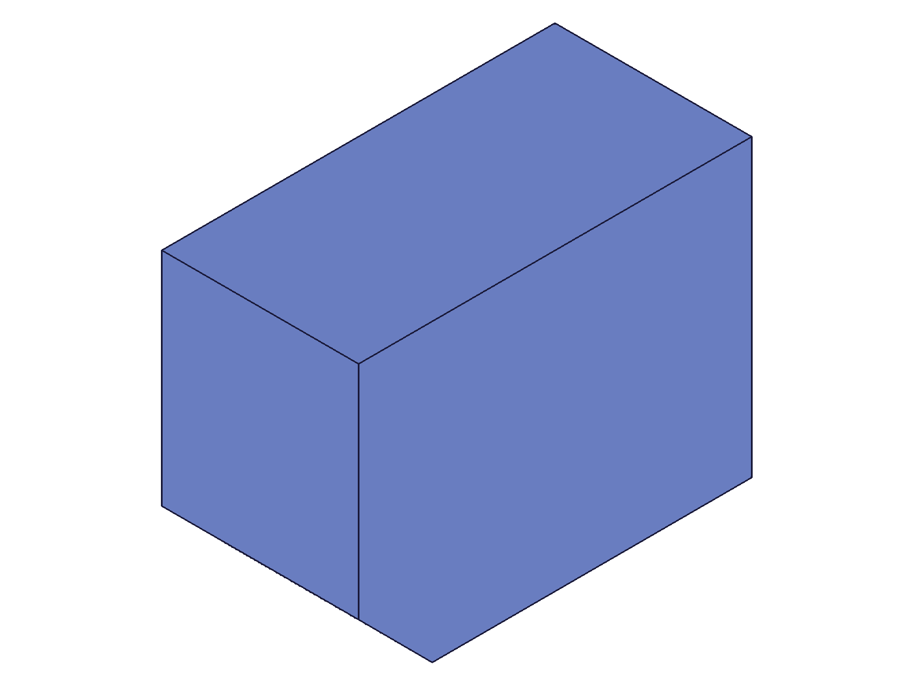
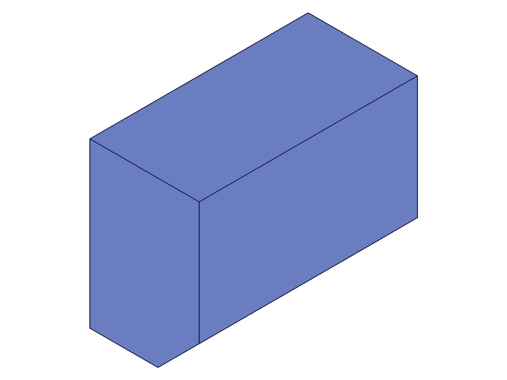
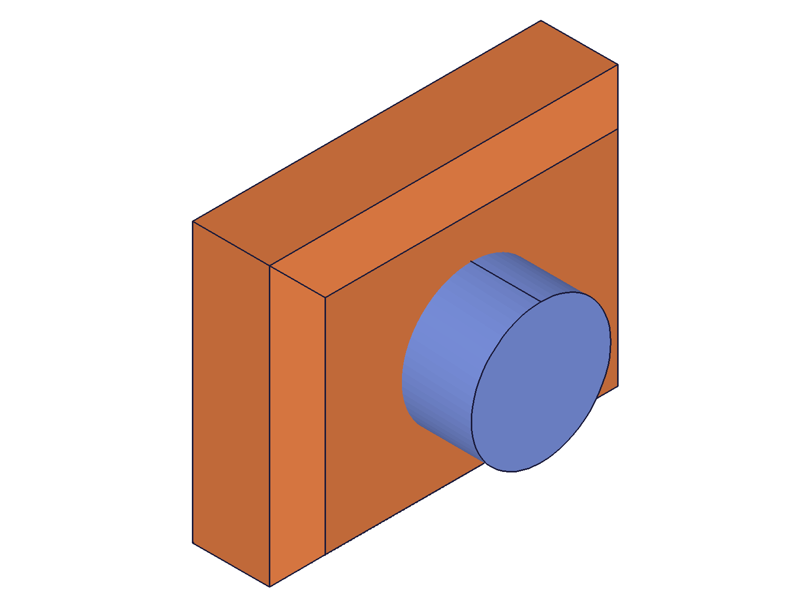

# Training: part.chamfer

**Date:** 2026-04-20

## Goal

Testing `v1.part.chamfer` and `v1.part.updateChamfer`.

**Methods to cover:**

- `chamfer` — create chamfer feature on brep edges
- `chamfer` params: id (part), name, references (edge IDs), type, distance1, distance2, angle
- `chamfer` types: EQUAL_DISTANCE, TWO_DISTANCES, DISTANCE_ANGLE
- `updateChamfer` — change type, distances, angle, references, name after creation
- Edge ID acquisition via `getGeometryIds`

**Questions:**

- How does `getGeometryIds` map positions to edges for chamfer references?
- What happens with EQUAL_DISTANCE at various distance1 values?
- How does TWO_DISTANCES behave — which face gets which distance?
- How does DISTANCE_ANGLE work — angle in radians, which face is the reference?
- Can you chamfer multiple edges at once?
- What happens when chamfer distance exceeds edge length?
- Can you change chamfer type via updateChamfer?
- Can you change references (edges) via updateChamfer?
- Do expressions work for distance1/distance2/angle?

---

## 01 — basic EQUAL_DISTANCE chamfer

Script: `scripts/01-basic-equal-distance.mjs` — ✅ Chamfer created on a single top-front edge of an 80x60x40 box.

|  |  |
|---|---|

**Data:** chamferId=120, maxLevel=31 (info, no errors), messages=[]. Edge found via `getGeometryIds` at pos [40,0,40] → edge ID 106. `distance1=5` with default type EQUAL_DISTANCE.

**Learned:** Basic chamfer works. Returns feature ID. Takes part ID (not feature ID). `references` takes brep edge IDs from `getGeometryIds`. The chamfer is subtle at distance1=5 on a large box — visible as a small angled cut on the top-front edge.

## 02 — multiple edges, large chamfer

Script: `scripts/02-multiple-edges-large.mjs` — ✅ Chamfered 3 top edges (front, right, back) at distance1=15.

|  |  |
|---|---|

**Data:** 3 edge IDs [106,107,108] found via `getGeometryIds`. chamferId=120, maxLevel=31. Single chamfer feature handles all 3 edges in one call.

**Learned:** Multiple edges work in a single `references` array — one chamfer feature covers all of them. The corner transitions where two chamfered edges meet are handled automatically (triangular corner facets). EQUAL_DISTANCE with distance1=15 produces 45° cuts that are clearly visible.

## 03–05 — TWO_DISTANCES type & edge ID behavior

Scripts: `scripts/03-two-distances.mjs` (revised), `scripts/04-two-distances-retry.mjs`, `scripts/05-two-dist-with-snapshot-first.mjs`

**Finding: edge IDs change after visualization.**

Without calling `snapshot()` / `requestVisualisation` before `getGeometryIds`:
- Edge at [40,0,40] → ID **75**
- EQUAL_DISTANCE chamfer on edge 75 → ✅ works (chamferId=91)
- TWO_DISTANCES chamfer on edge 75 → ❌ fails: "An element of parameter 'references' has an invalid id!" (maxLevel=51)

With `snapshot()` called before `getGeometryIds`:
- Edge at [40,0,40] → ID **106**
- TWO_DISTANCES chamfer on edge 106 → ✅ works (chamferId=120, maxLevel=31)

|  |
|---|

**Data:** TWO_DISTANCES with distance1=5, distance2=20 produces a clearly asymmetric cut. The snapshot shows the front edge chamfered with a wider cut on one face than the other.

**Learned:** `requestVisualisation` (triggered by `snapshot()`) generates full BRep edge IDs (106+). Pre-visualization IDs (75) are partially valid — they work for EQUAL_DISTANCE but not TWO_DISTANCES or (likely) DISTANCE_ANGLE. **Always call `requestVisualisation` or take a snapshot before `getGeometryIds` when using non-default chamfer types.**

📌 LLM doc: Document the edge ID pre/post-visualization behavior and TWO_DISTANCES requirements.

## 06 — DISTANCE_ANGLE type

Script: `scripts/06-distance-angle.mjs` — ✅ DISTANCE_ANGLE chamfer with distance1=15, angle=C:PI/6 (30°).

|  |
|---|

**Data:** chamferId=120, maxLevel=31. Edge 106 (post-visualization). Angle accepts expression strings like `'C:PI/6'`.

**Learned:** DISTANCE_ANGLE works as documented. The `angle` param accepts expression strings (not just numeric radians). At 30°, the chamfer is shallower than the 45° EQUAL_DISTANCE default. The distance1 controls the cut depth along one face, angle controls the slope.

## 07–08 — recalc vs requestVisualisation for edge IDs

Scripts: `scripts/07-recalc-vs-vis.mjs`, `scripts/08-recalc-then-two-dist.mjs`

**Data from script 07:**
- Baseline (no recalc/vis): edge ID **75**
- After `recalc()`: edge ID **106**
- After `requestVisualisation`: edge ID **106** (same as recalc)

**Data from script 08:** TWO_DISTANCES with recalc-only edge 106 → ✅ result=120, maxLevel=31.

**Learned:** It's `recalc()` that generates the full BRep edge IDs, not visualization specifically. After `part.box` creation, the internal BRep hasn't been fully resolved yet — edge IDs are preliminary (75-range). Calling `recalc()` resolves the BRep and produces stable edge IDs (106-range) that work with all chamfer types.

📌 LLM doc: Recommend calling `recalc()` before `getGeometryIds` for chamfer references. Pre-recalc edge IDs only work for EQUAL_DISTANCE.

## 09 — updateChamfer: change distance

Script: `scripts/09-update-distance.mjs` — ✅ Updated chamfer distance1 from 5 to 20 via openFeature → updateChamfer → closeFeature.

|  |  |
|---|---|

**Data:** updateChamfer result=120 (same chamfer feature ID), maxLevel=31. The open/close feature pattern is required.

**Learned:** `updateChamfer` follows the standard open→update→close pattern. Takes the chamfer feature ID (not part ID). Returns the same feature ID on success. Distance change is immediately visible.

## 10 — updateChamfer: change type

Script: `scripts/10-update-type.mjs` — ✅ Changed chamfer type through all three variants: EQUAL_DISTANCE → TWO_DISTANCES → DISTANCE_ANGLE.

|  |  |
|---|---|

**Data:** Both updates returned result=120, maxLevel=31. TWO_DISTANCES with d1=5, d2=20; DISTANCE_ANGLE with d1=15, angle=C:PI/3 (60°).

**Learned:** `updateChamfer` can change the chamfer type. When switching types, provide the type-specific params (e.g., provide `distance2` when switching to TWO_DISTANCES, `angle` when switching to DISTANCE_ANGLE). The snapshots show clearly different chamfer profiles for each type.
📌 LLM doc: Document type switching via updateChamfer.

## 11 — expression-driven chamfer

Script: `scripts/11-expression-driven.mjs` — ✅ Chamfer with `distance1: '@expr.chamferDist'`, then expression updated from 10→25 and recalc'd.

|  |  |
|---|---|

**Data:** chamferId=122, maxLevel=31. No errors with `@expr.` prefix for distance1. Snapshots look similar due to auto-scaling (single body), but chamfer accepted the expression and recalculated without error.

**Learned:** `distance1`, `distance2`, and `angle` all accept expression strings (`@expr.NAME`). Updating the expression + recalc changes the chamfer parametrically.
📌 LLM doc: Document expression support for chamfer parameters.

## 12 — oversized chamfer distance

Script: `scripts/12-oversized-distance.mjs` — distance1=50 on 80x60x40 box (exceeds 40mm height on front face).

**Data:** result=120 (feature created!) but maxLevel=51: "Chamfer could not be applied to all edges." The feature is created in a **degenerate/failed state** — it exists in the feature tree but the geometry is broken.

**Learned:** Oversized chamfer distances don't fail cleanly — the feature is still created (non-null result) but with an error message. The feature is in a failed state. Check `maxLevel >= 51` to detect this. The EQUAL_DISTANCE chamfer at 45° needs distance1 ≤ min(adjacent face height, adjacent face width) to succeed.
📌 LLM doc: Document degenerate chamfer behavior and error detection.

## 13 — vertical edges

Script: `scripts/13-vertical-edges.mjs` — ✅ Chamfered both front vertical edges at distance1=15.

|  |
|---|

**Data:** Edge IDs [102,103] at positions [0,0,20] and [80,0,20]. chamferId=120, maxLevel=31.

**Learned:** Works on any edge orientation — horizontal, vertical, diagonal. Edge positions for vertical edges use the midpoint z coordinate.

## 14 — updateChamfer: change references

Script: `scripts/14-update-references.mjs` — ✅ Changed chamfer from front-left vertical edge to top-front edge via updateChamfer.

|  |  |
|---|---|

**Data:** Initial edge 102 (vertical), after recalc new edge 196 (top-front). updateChamfer result=120, maxLevel=31.

**Learned:** `updateChamfer` can change the `references` (target edges). After the chamfer is created, the BRep topology changes — edge IDs from before the chamfer are no longer valid. Must call `recalc()` again before `getGeometryIds` to get edge IDs from the current (post-chamfer) geometry state.
📌 LLM doc: Document that edge IDs change after chamfer creation and need recalc to refresh.

## 15 — default values and name

Script: `scripts/15-defaults-and-name.mjs` — ✅ Chamfer with only `id` and `references` (all other params use defaults).

**Data:** result=120, maxLevel=31. Rename via updateChamfer also works (result=120, maxLevel=31).

**Learned:** Defaults: name="Chamfer", type=EQUAL_DISTANCE, distance1=2. All optional params have sensible defaults per the docs. The default distance1=2 produces a very small chamfer (barely visible at this box scale). Name can be changed via updateChamfer.

## 16 — realistic workflow

Script: `scripts/16-realistic-workflow.mjs` — ✅ Box base + cylindrical extrusion + chamfer on all 4 top edges of the base.

|  |
|---|

**Data:** 4 top edge IDs [141,142,143,144]. chamferId=165, maxLevel=31 (no errors). Workflow: part.create → part.box → sketch + circle + region → extrusion → recalc → getGeometryIds → chamfer.

**Learned:** Chamfer works correctly in a multi-feature part. The `getGeometryIds` correctly finds base box edges even with other features present. The chamfer is applied only to the selected edges (box top) without affecting the cylindrical protrusion.
