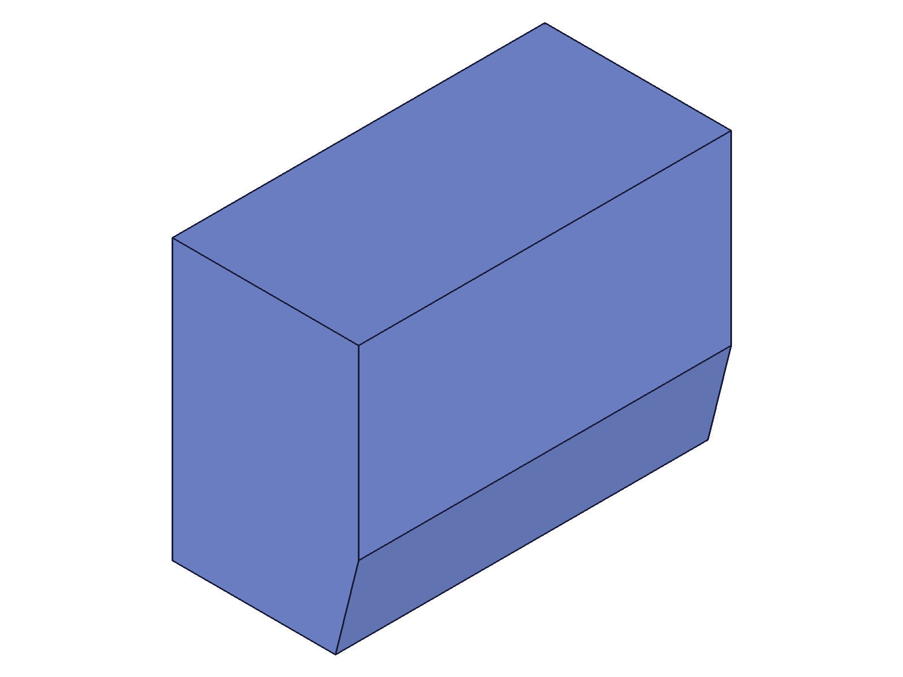
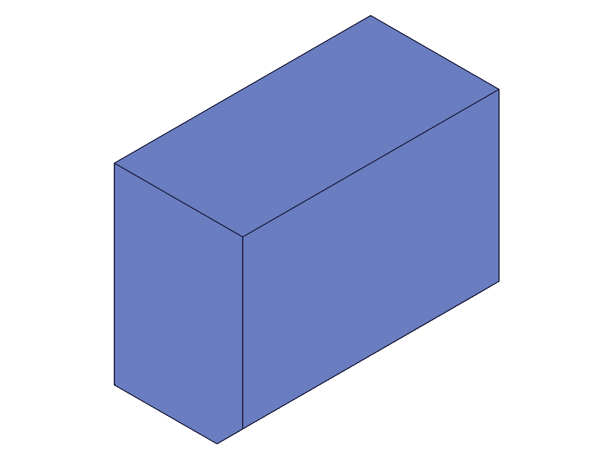

# Training: part.updateChamfer

**Date:** 2026-04-20

## Goal

Focused study of `v1.part.updateChamfer` edge cases and behaviors not covered in the prior chamfer session.

**Methods to cover:**

- `updateChamfer` — error when called without `openFeature`
- `updateChamfer` — oversized distance update (does it create degenerate state?)
- `updateChamfer` — type switching edge cases (DISTANCE_ANGLE → EQUAL_DISTANCE, clearing of type-specific params)
- `updateChamfer` — adding `@expr.` to existing numeric chamfer
- `updateChamfer` — distance2 param when type is EQUAL_DISTANCE (ignored?)
- `updateChamfer` — multiple sequential updates on same feature
- `updateChamfer` — fix a degenerate chamfer by updating to valid params
- `updateChamfer` — update only name, verify geometry unchanged

**Questions:**

- What error message does updateChamfer return without openFeature?
- Can you rescue a degenerate chamfer (oversized distance) by updating to a smaller value?
- When switching from TWO_DISTANCES to EQUAL_DISTANCE, does distance2 get ignored?
- Can you add an expression binding via updateChamfer (create with numeric, update with @expr)?

---

## 01 — updateChamfer without openFeature

Script: `scripts/01-no-open-feature.mjs` — ❌ Error as expected. updateChamfer fails without openFeature.

|  |
|---|

**Data:** result=null, maxLevel=51. Two error messages: code 1200 "The provided feature is not allowed to update. It's not active and open." and code 1004 '"id" must be provided for update.' (see `files/01-no-open-feature-no-open-response.json`).

**Learned:** Calling updateChamfer without openFeature returns null result and two error messages. The feature is not modified. Error code 1200 is the "not open" gate error. The second error (1004) is a cascade — since the feature isn't open, the id effectively becomes invalid for update context.
📌 LLM doc: Document error code 1200 and the exact error message for "not open" state.

## 02 — fix degenerate chamfer via updateChamfer

Script: `scripts/02-fix-degenerate.mjs` — ✅ Degenerate chamfer (d=50, maxLevel=51) successfully fixed to d=10 (maxLevel=31).

|  |  |
|---|---|

**Data:** Oversized creation: result=120, maxLevel=51, error "Chamfer could not be applied to all edges." Fix update: result=120, maxLevel=31, no messages. (See `files/02-fix-degenerate-oversized-response.json` and `files/02-fix-degenerate-fix-response.json`.)

**Learned:** Degenerate chamfer features CAN be rescued. Open the feature, update with a valid distance, close. The maxLevel drops from 51 to 31 and geometry is restored. This is useful for error recovery — you don't need to delete and recreate the feature.
📌 LLM doc: Document that degenerate chamfers can be fixed via updateChamfer.

## 03 — full type switching cycle

Script: `scripts/03-type-switch-edge-cases.mjs` — ✅ Switched DISTANCE_ANGLE → EQUAL_DISTANCE → TWO_DISTANCES → DISTANCE_ANGLE. All succeeded.

|  |  |  |
|---|---|---|

**Data:** All 3 updates returned result=120, maxLevel=31. Snapshots show distinct chamfer profiles for each type: EQUAL_DISTANCE (symmetric, small), TWO_DISTANCES (asymmetric d1=5/d2=20, large visible cut on right side), DISTANCE_ANGLE (d1=15, angle=PI/3=60°, angled cut).

**Learned:** Type switching works bidirectionally between all 3 types. When providing type-specific params (distance2 for TWO_DISTANCES, angle for DISTANCE_ANGLE), the new values are applied. Visual confirmation: each type produces a clearly different chamfer profile.

## 04 — add expression via updateChamfer

Script: `scripts/04-add-expression-via-update.mjs` — ✅ Created with numeric d1=5, updated to @expr.chamDist (=15), expression changed to 25, then back to numeric 8.

|  |  |  |
|---|---|---|

**Data:** All transitions succeeded (maxLevel=31). Expression update from 15→25 worked after recalc. Reverting to numeric d1=8 also worked. (See `files/04-add-expression-via-update-expr-update-response.json`.)

**Learned:** Expression bindings can be added post-creation via updateChamfer. The transition numeric → @expr → numeric all works. When changing expression values, `recalc()` is needed to propagate the change to the chamfer geometry.
📌 LLM doc: Document expression add/remove via updateChamfer.

## 05 — irrelevant type-specific params silently ignored

Script: `scripts/05-distance2-on-equal-dist.mjs` — ✅ Set distance2 and angle on EQUAL_DISTANCE type — both accepted without error, no visible effect.

|  |  |  |
|---|---|---|

**Data:** Both updates returned result=120, maxLevel=31. All 3 snapshots are visually identical — the chamfer did not change shape.

**Learned:** Type-irrelevant params (distance2 on EQUAL_DISTANCE, angle on EQUAL_DISTANCE) are silently accepted but have no effect. No error, no warning. The chamfer geometry is unchanged.
📌 LLM doc: Document that irrelevant type params are silently ignored.

## 06 — multiple sequential updates

Script: `scripts/06-multiple-sequential-updates.mjs` — ✅ Three open/close cycles: d=5→10, →TWO_DISTANCES(5,15), →EQUAL_DISTANCE(15)+rename.

|  |
|---|

**Data:** All 3 updates returned result=120, maxLevel=31. (See `files/06-multiple-sequential-updates-sequential-results.json`.)

**Learned:** Multiple sequential open→update→close cycles on the same feature work without issues. No state accumulation or degradation. Name change in the same call as type+distance change also works.

## 07 — update valid chamfer to oversized distance

Script: `scripts/07-update-to-oversized.mjs` — ✅ Updated valid chamfer (d=10) to oversized (d=50). Feature becomes degenerate.

|  |  |
|---|---|

**Data:** result=120, maxLevel=51, error "Chamfer could not be applied to all edges." (See `files/07-update-to-oversized-oversized-update.json`.) Same error pattern as chamfer creation with oversized distance.

**Learned:** updateChamfer can make a valid chamfer degenerate — same behavior as creation. The feature ID is returned (non-null) but geometry is broken. Always check maxLevel after updateChamfer.
📌 LLM doc: Document that updateChamfer can break a valid chamfer the same way creation can.

## 08 — type switch without type-specific params

Script: `scripts/08-type-switch-no-params.mjs` — ✅ Switched to TWO_DISTANCES (no distance2) and DISTANCE_ANGLE (no angle) — both used defaults.

|  |  |
|---|---|

**Data:** Both returned result=120, maxLevel=31. No errors.

**Learned:** When switching types without providing type-specific params, the server uses defaults: distance2=2 for TWO_DISTANCES, angle=C:PI/4 (45°) for DISTANCE_ANGLE. The existing distance1 is preserved. This is consistent with the docs' default values for chamfer creation.
📌 LLM doc: Document that type switching without explicit params uses creation defaults.
