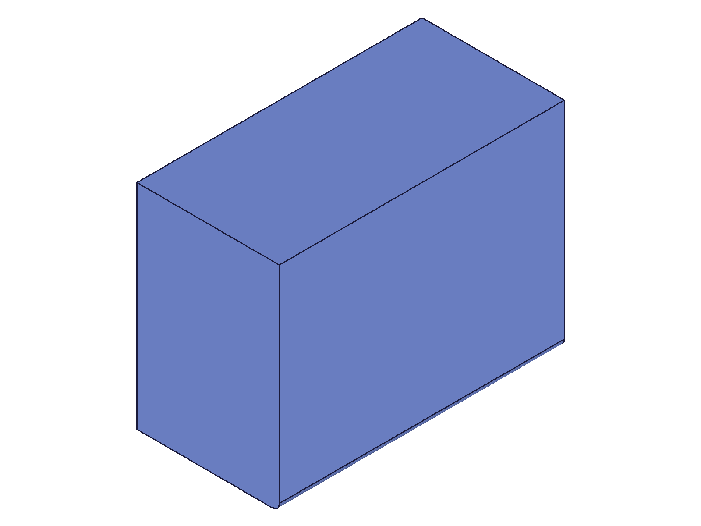
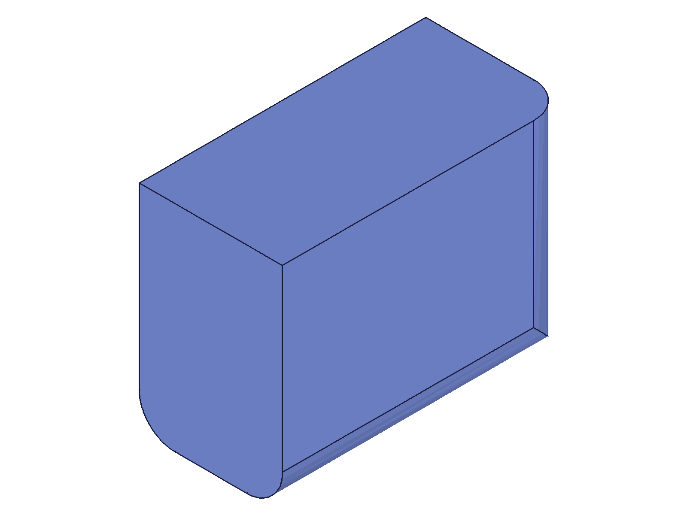
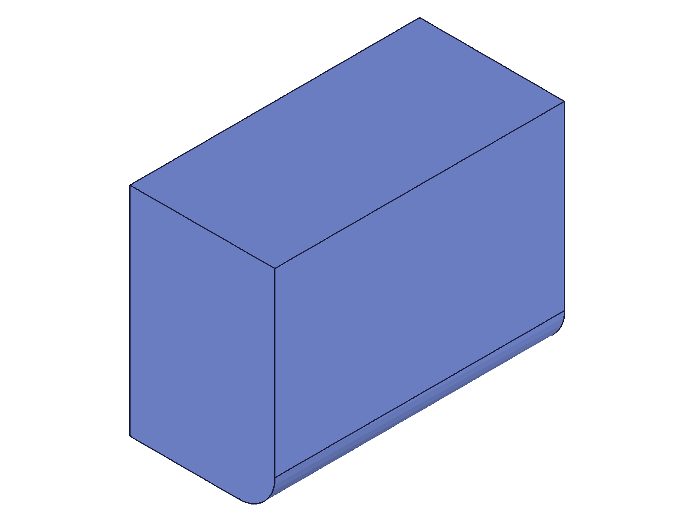
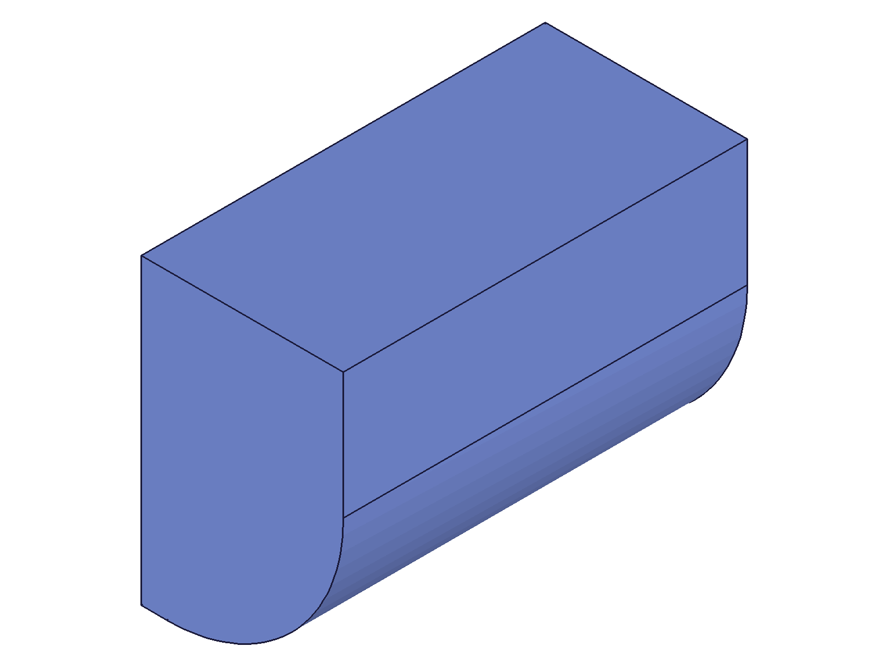
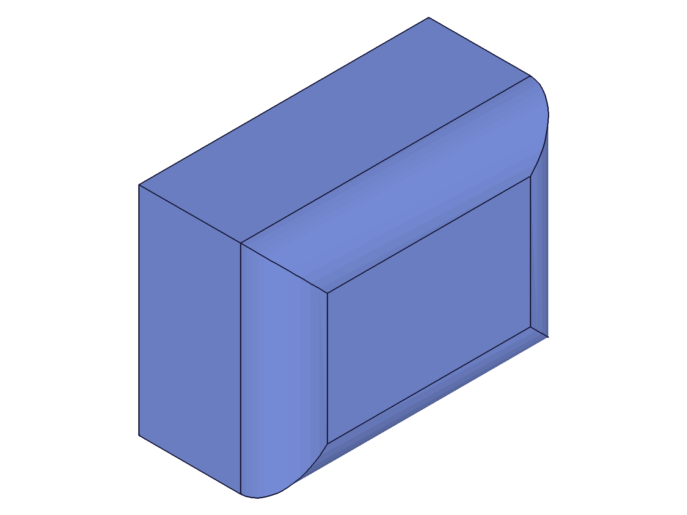
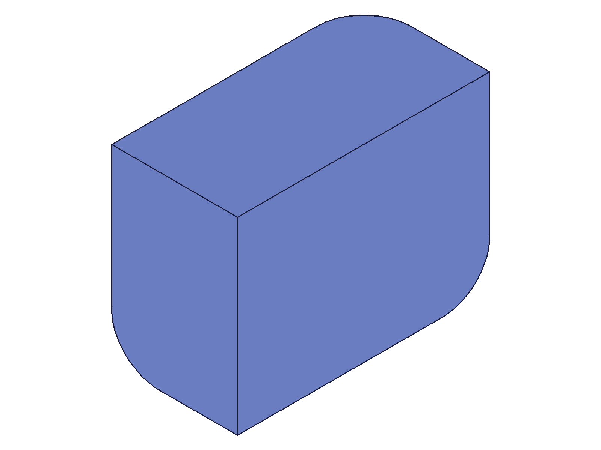
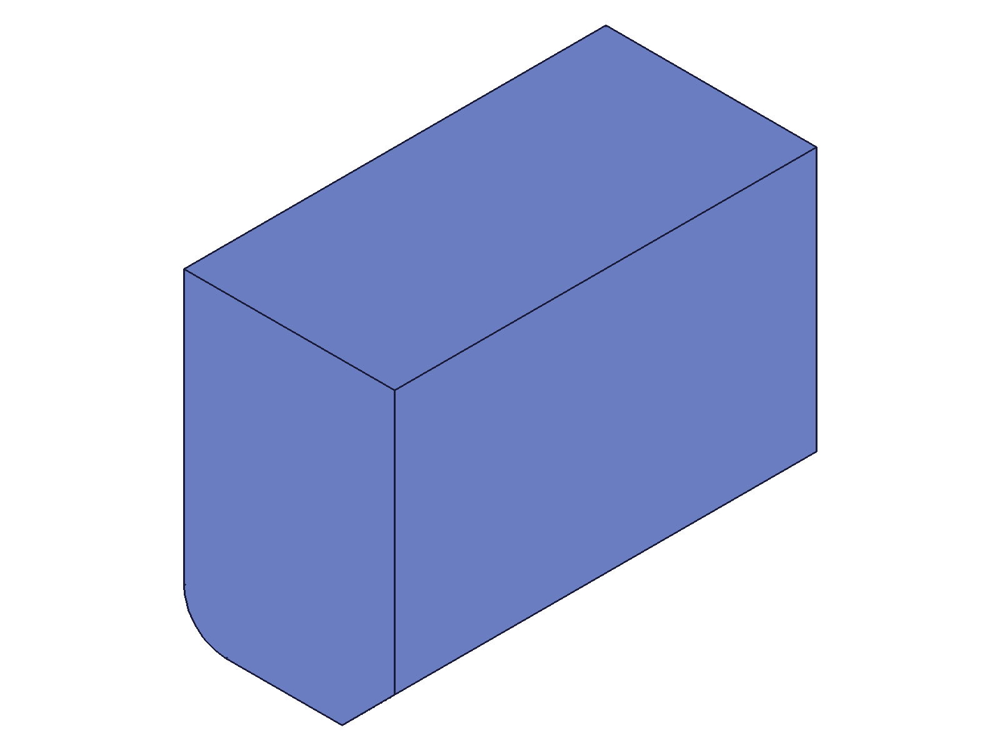
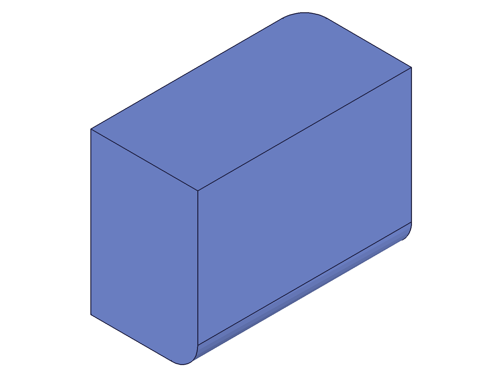

# Training: part.fillet

**Date:** 2026-04-20

## Goal

Testing `v1.part.fillet` — creating fillet (rounded edge) features on brep edges.

**Methods to cover:**

- `fillet` — create fillet feature on brep edges
- `fillet` params: id (part ID), name (default="Fillet"), references (edge IDs), radius (default=2)
- Expression-driven radius (`@expr.NAME` strings)
- Multiple edges in one call
- Edge ID behavior (recalc requirement — does the chamfer gotcha apply here too?)

**Questions:**

- Does fillet share the same recalc-before-getGeometryIds requirement as chamfer?
- What happens with oversized radius (exceeds geometry)?
- Does the default radius=2 work as documented?
- How do corner transitions work when filleting adjacent edges?
- Can you fillet edges that were already chamfered?
- What does the error look like for invalid edge IDs?
- How does vertex count change with fillet vs chamfer (rounded = more triangles)?

---

## 01 — basic fillet, default radius

Script: `scripts/01-basic-default-radius.mjs` — ✅ Fillet created on top-front edge with default radius.

|  |  |
|---|---|

**Data:** filletId=149, maxLevel=31. Edge found via `getGeometryIds` at pos [40,0,40] → edge ID 135 (post-recalc). Default radius=2 produces a barely visible rounding on the 80×60×40 box.

**Learned:** Basic fillet works. Takes part ID, returns feature ID. Mirrors chamfer API pattern. Default radius=2 is very small.

## 02 — large radius with vertex count attempt

Script: `scripts/02-large-radius.mjs` — ✅ Fillet at radius=15 clearly visible.

|  |  |
|---|---|

**Data:** filletId=149, maxLevel=31. `requestVisualisation().graphic` returns null before fillet creation — graphic data is only available from API response envelopes (`r.graphic`), not from `requestVisualisation` in CLI context.

**Learned:** Radius=15 produces a very visible rounded edge. The `requestVisualisation` graphic field is null in CLI mode.
**📌 LLM doc:** Default radius=2 is too small for visibility on typical parts. Use 5-15 for visible results.

## 03 — multiple edges in one call

Script: `scripts/03-multiple-edges.mjs` — ✅ Three edges filleted in a single call.

|  |
|---|

**Data:** 3 edge IDs [135,136,127] from positions (top-front, top-right, bottom-front). filletId=149, maxLevel=31. Single fillet feature handles all 3 edges.

**Learned:** Multiple edges in one `references` array work. Corner transitions where filleted edges meet are handled automatically with smooth blending.
**📌 LLM doc:** Document multiple-edge support and automatic corner blending.

## 04 — graphic data structure exploration

Script: `scripts/04-graphic-data-comparison.mjs` — ✅ Explored graphic envelope structure.

**Data:** `r.graphic` from API responses has keys `containers` and `properties`, NOT `meshes` at top level. Structure: `r.graphic.containers[].meshes[]` with per-container bounding box in `containers[].properties.min/max`. The `requestVisualisation()` returns null for graphic before fillet.

**Learned:** Graphic data is nested: containers → meshes. Each container has bounding box in `properties.min/max`. Vertex data is in `containers[0].meshes[0].positions`.

## 05 — no-recalc edge IDs (SURPRISING)

Script: `scripts/05-no-recalc-edge-ids.mjs` — ✅ Fillet works WITHOUT recalc before getGeometryIds!

|  |
|---|

**Data:** Pre-recalc edge ID=75 (vs post-recalc=135). Fillet result=91, maxLevel=31. No errors.

**Learned:** Unlike chamfer (which requires recalc for TWO_DISTANCES/DISTANCE_ANGLE types), fillet works with pre-recalc edge IDs. This is because fillet has no type variants — it's always a constant-radius fillet. However, recalc is still recommended for consistency and because edge IDs change between pre/post recalc states.
**📌 LLM doc:** Document that fillet works without recalc (unlike chamfer), but recommend recalc anyway for reliable edge IDs.

## 06 — expression radius with wrong API call (FAILED)

Script: `scripts/06-expression-radius.mjs` — ❌ Failed due to incorrect expression creation syntax.

**Data:** Used `expression({ id, name, value })` instead of `expression({ id, toCreate: [{ name, value }] })`. The expression wasn't created, so `@expr.filletR` couldn't resolve → error 1000 "Could not convert api params."

**Learned:** Expression creation requires `toCreate` array syntax. Script 06 failure was a script bug, not an API limitation.

## 08 — expression radius retry (FIXED)

Script: `scripts/08-expression-radius-retry.mjs` — ✅ `@expr.filletR` works when expression is created properly.

|  |
|---|

**Data:** Expression created with `toCreate` syntax (result=1, maxLevel=31). Fillet with `radius: '@expr.filletR'` → result=122, maxLevel=31. Radius=12 visible.

**Learned:** `@expr.NAME` syntax works for fillet radius, same as chamfer distance params.
**📌 LLM doc:** Expression-driven radius works via `@expr.NAME` strings.

## 07 + 09 — oversized radius

Script: `scripts/07-oversized-radius.mjs` — radius=35 on 80×60×40 box succeeded (maxLevel=31).
Script: `scripts/09-oversized-radius-retry.mjs` — radius=50 created degenerate feature.

|  |  |
|---|---|

**Data (07):** radius=35 result=120, maxLevel=31. On an edge where adjacent faces are 40 (height) and the full width — the fillet is huge but geometrically valid.

**Data (09):** radius=50 result=149, maxLevel=51, error: `"Fillet could not be applied to all edges."` Non-null result means feature exists in tree but geometry is broken. Same degenerate-feature pattern as chamfer.

**Learned:** Large radii can work if adjacent faces accommodate them. When radius exceeds what faces can support, you get a degenerate feature (non-null ID, maxLevel=51). Always check maxLevel.
**📌 LLM doc:** Oversized radius creates degenerate features — identical pattern to chamfer. Always check maxLevel >= 51.

## 10 — all 4 top edges

Script: `scripts/10-all-top-edges.mjs` — ✅ All 4 top edges of box filleted in one call.

|  |  |
|---|---|

**Data:** 4 edge IDs [135,136,137,138]. filletId=149, maxLevel=31. Corners show smooth spherical blending where rounded edges meet.

**Learned:** Filleting all edges of a face produces beautiful corner blending — smooth dome-like transitions at each vertex.

## 11 — corner adjacent edges (3 edges meeting at a vertex)

Script: `scripts/11-corner-adjacent-edges.mjs` — ✅ Three edges meeting at one corner filleted.

|  |  |
|---|---|

**Data:** Edge IDs [127,132,128] at the right-back-top area. filletId=149, maxLevel=31. The corner where 3 fillets meet shows a smooth spherical blend surface.

**Learned:** Corner blending is automatic and smooth when multiple filleted edges share a vertex.
**📌 LLM doc:** Document automatic corner blending behavior.

## 12 — fillet after chamfer

Script: `scripts/12-fillet-after-chamfer.mjs` — ✅ Chamfer on top-front edge, then fillet on bottom-front edge.

|  |
|---|

**Data:** chamferId=120, filletId=220. Both maxLevel=31. Edge IDs changed between chamfer and fillet (pre-chamfer bottom-front was different from post-chamfer=188). Required recalc+getGeometryIds between features.

**Learned:** Chamfer and fillet coexist on the same part. Edge IDs change after either feature is applied — must re-query `getGeometryIds` after any topology-changing operation.
**📌 LLM doc:** Document edge ID instability after topology changes.

## 14 — inline math expression

Script: `scripts/14-inline-expression.mjs` — ✅ Inline expression `'5/2'` works for radius.

**Data:** `radius: '5/2'` → result=120, maxLevel=31. Inline math expressions evaluate correctly.

**Learned:** Both `@expr.NAME` references and inline math expressions (like `'5/2'`, `'10+5'`) work for the radius parameter.
**📌 LLM doc:** Document both expression forms.

## 15 — invalid edge IDs and error messages

Script: `scripts/15-invalid-edge-id.mjs` — tested invalid ID, empty refs, face ID.

**Data:**
- Invalid ID (99999): result=null, maxLevel=51, errors: "ToId()/TOID() didn't get an existing or valid id." (warning 41) + "An element of parameter 'references' has an invalid id!" (error 51)
- Empty refs ([]): result=126 (non-null!), maxLevel=51, error: "There is no entity for BadFillet2 (CC_ConstantRadiusFillet)." — degenerate feature created
- `getGeometryIds` with `surfaces` key returned undefined — need to check correct key name for face IDs

**Learned:** Invalid ID → null result. Empty refs → degenerate feature (non-null ID, broken). Internal kernel name is `CC_ConstantRadiusFillet`.
**📌 LLM doc:** Document error messages for common failures.

## 16 — sequential fillets (fixed)

Script: `scripts/16-sequential-fillets-retry.mjs` — ✅ Two separate fillet features on different edges.

|  |
|---|

**Data:** fillet1=120 (top-front, r=10), fillet2=220 (bottom-right, r=8). Both maxLevel=31. Required recalc between fillets to get valid edge IDs for second fillet.

**Learned:** Multiple fillet features work. Must recalc and re-query edge IDs between features.

## 17 — bounding box comparison

Script: `scripts/17-bounding-box-comparison.mjs` — ✅ Bounding box unchanged after fillet.

**Data:** After fillet with radius=15, bounding box remains [0,0,0]→[80,60,40]. Fillet only removes material from edges — it doesn't extend past the original geometry bounds.

**Learned:** Fillet never changes the bounding box. It's a subtractive operation on edges.
**📌 LLM doc:** Note that fillet is subtractive — doesn't extend geometry bounds.
