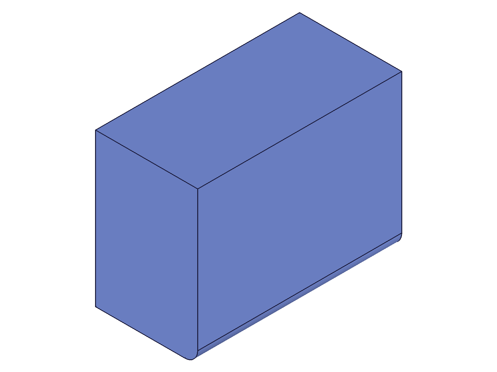
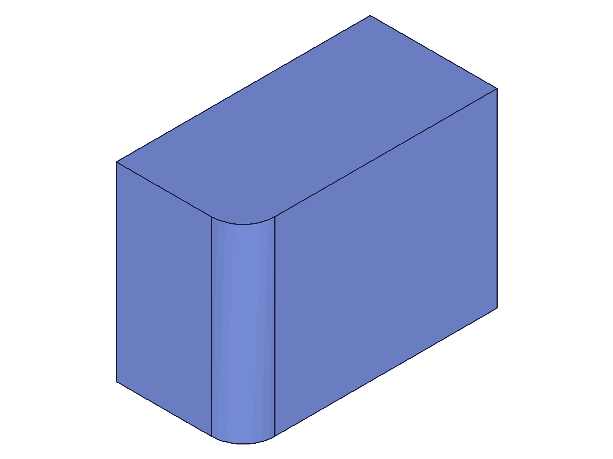
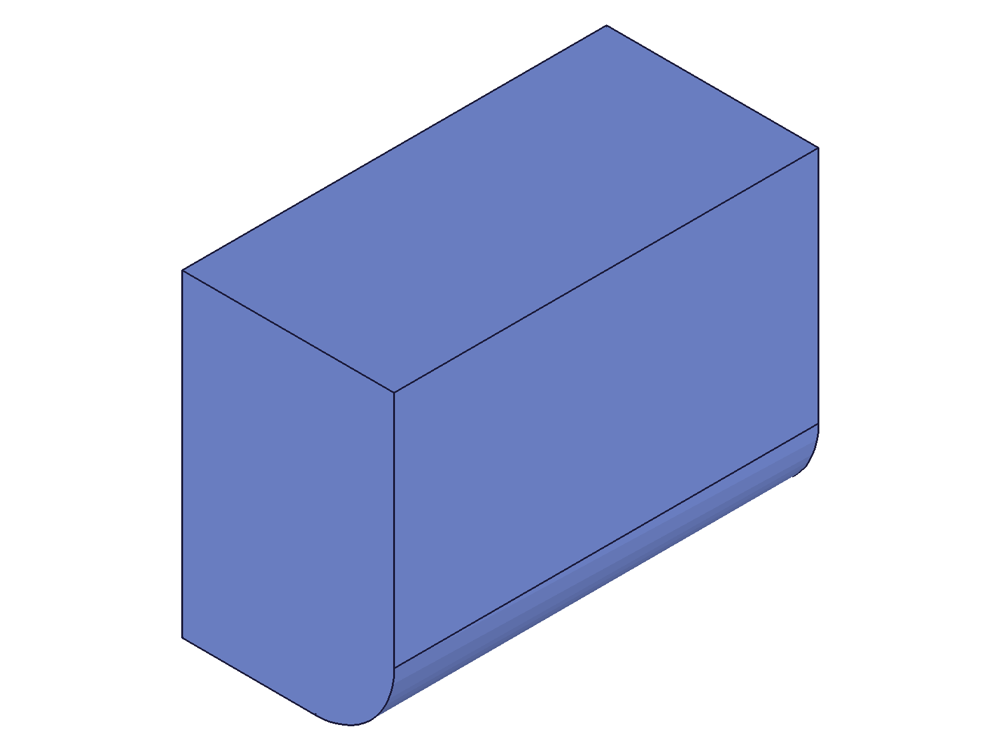
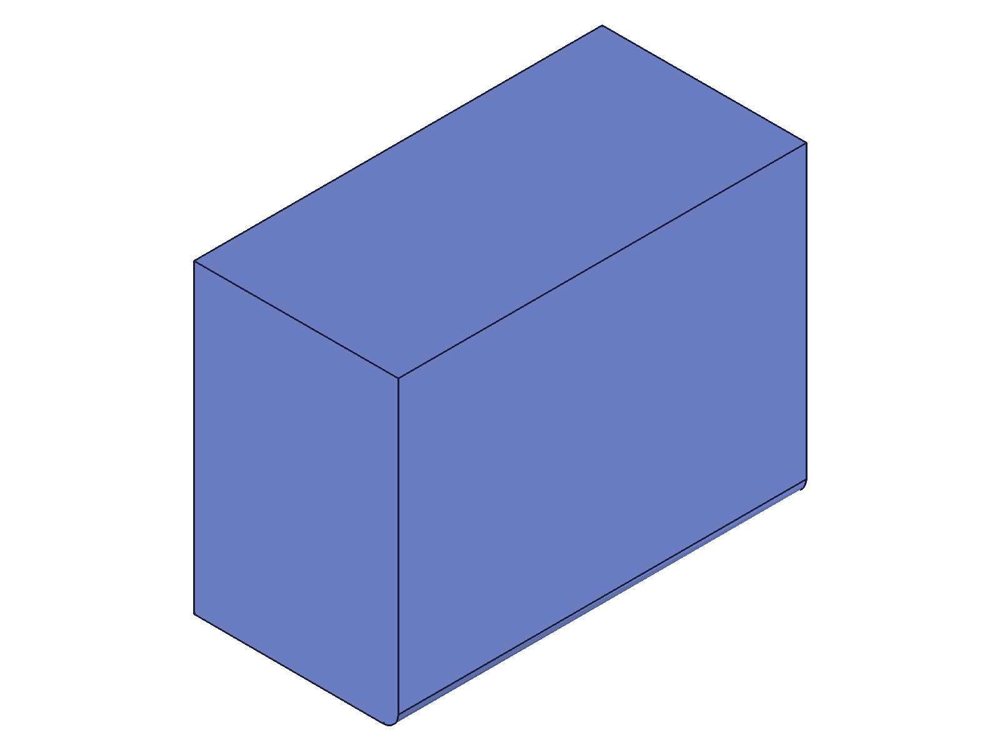

# Training: part.updateFillet

**Date:** 2026-04-20

## Goal

Testing `v1.part.updateFillet` — modifying fillet features after creation.

**Methods to cover:**

- `updateFillet` — change radius (numeric and expression)
- `updateFillet` — change references (re-target to different edges)
- `updateFillet` — rename feature
- `updateFillet` — error without openFeature
- `updateFillet` — fix degenerate fillet (oversized radius → valid)
- `updateFillet` — make valid fillet degenerate (valid → oversized)
- `updateFillet` — expression binding add/remove post-creation
- `updateFillet` — multiple sequential updates

**Questions:**

- Does updateFillet follow the same openFeature/closeFeature pattern as updateChamfer?
- Can a degenerate fillet be rescued via updateFillet?
- Does changing references require re-queried edge IDs from the current geometry?
- Are there any fillet-specific gotchas not shared with chamfer?

---

## 01 — basic radius update

Script: `scripts/01-basic-radius-update.mjs` — ✅ Radius updated from 5 to 15 via openFeature/updateFillet/closeFeature.

|  |  |
|---|---|

**Data:** filletId=120, update result=120, maxLevel=31. No messages. (See `files/01-basic-radius-update-update-response.json`.) Before: small r=5 fillet on bottom-front edge. After: large r=15 fillet clearly visible.

**Learned:** Basic updateFillet works. Same open→update→close pattern as updateChamfer. Takes the fillet feature ID (not part ID). Returns the feature ID on success.
📌 LLM doc: Document the openFeature/updateFillet/closeFeature pattern.

## 02 — updateFillet without openFeature

Script: `scripts/02-no-open-feature.mjs` — ❌ Error as expected.

|  |
|---|

**Data:** result=null, maxLevel=51. Two error messages: code 1200 "The provided feature is not allowed to update. It's not active and open." and code 1004 "\"id\" must be provided for update." (See `files/02-no-open-feature-no-open-response.json`.)

**Learned:** Identical error pattern to updateChamfer. Must call openFeature first.
📌 LLM doc: Document error code 1200 for missing openFeature.

## 03 — fix degenerate fillet

Script: `scripts/03-fix-degenerate.mjs` — ✅ Degenerate fillet (r=50, maxLevel=51) rescued to r=10 (maxLevel=31).

|  |  |
|---|---|

**Data:** Oversized creation: result=120, maxLevel=51, error "Fillet could not be applied to all edges." Fix update: result=120, maxLevel=31, no messages. (See `files/03-fix-degenerate-oversized-response.json` and `files/03-fix-degenerate-fix-response.json`.)

**Learned:** Degenerate fillets CAN be rescued via updateFillet. Open the feature, update to valid radius, close. Same pattern as updateChamfer.
📌 LLM doc: Document degenerate rescue capability.

## 04 — update valid fillet to oversized

Script: `scripts/04-update-to-oversized.mjs` — ✅ Valid fillet (r=10) updated to oversized (r=50). Feature becomes degenerate.

|  |  |
|---|---|

**Data:** result=120, maxLevel=51, error "Fillet could not be applied to all edges." (See `files/04-update-to-oversized-oversized-update.json`.)

**Learned:** updateFillet can make a valid fillet degenerate — same as updateChamfer. Always check maxLevel after update.
📌 LLM doc: Document that updates can break valid fillets.

## 05 — rename only

Script: `scripts/05-rename-only.mjs` — ✅ Renamed from "OriginalName" to "RenamedFillet". Geometry unchanged.

|  |  |
|---|---|

**Data:** result=120, maxLevel=31. Both snapshots visually identical — rename does not affect geometry. (See `files/05-rename-only-rename-response.json`.)

**Learned:** Name-only update works without touching geometry.

## 06 — update references (move fillet to different edge)

Script: `scripts/06-update-references.mjs` — ✅ Fillet moved from top-front edge to top-left vertical edge.

|  |  |
|---|---|

**Data:** Initial edge=106, after topology change new left edge=199. Update result=120, maxLevel=31. Snapshots clearly show fillet relocated from bottom-front to left vertical edge.

**Learned:** References can be updated to re-target the fillet to completely different edges. Must re-query edge IDs via recalc+getGeometryIds after the initial fillet changes topology.
📌 LLM doc: Document reference updates and edge ID re-querying requirement.

## 07 — expression binding add/remove

Script: `scripts/07-expression-binding.mjs` — ✅ Full cycle: numeric r=5 → @expr.filletR (=15) → expr updated to 25 → numeric r=8.

|  |  |  |
|---|---|---|

**Data:** All transitions succeeded (maxLevel=31). Expression update from 15→25 worked after recalc. Revert to numeric r=8 also worked. (Note: r=15 and r=25 snapshots look similar due to auto-scaling on single body — size-only changes.)

**Learned:** Expression bindings can be added/removed post-creation via updateFillet. Numeric → @expr → numeric all works. Same pattern as updateChamfer.
📌 LLM doc: Document expression binding support via updateFillet.

## 08 — multiple sequential updates

Script: `scripts/08-sequential-updates.mjs` — ✅ Three open/close cycles: r=5→10, →18+rename, →3.

|  |
|---|

**Data:** All 3 updates returned result=120, maxLevel=31. (See `files/08-sequential-updates-sequential-results.json`.)

**Learned:** Multiple sequential open→update→close cycles work without issues. No state accumulation. Radius change + name change in same call works.

---

## Coverage Assessment

- [x] API called successfully (01)
- [x] Required parameter (id) tested in all scripts
- [x] Optional params: radius (01,03,04,07,08), name (05,08), references (06)
- [x] Error without openFeature (02)
- [x] Degenerate rescue (03)
- [x] Update to oversized (04)
- [x] Expression binding add/remove (07)
- [x] Multiple sequential updates (08)
- [x] Realistic usage combining with prerequisites (all scripts)
- [x] All findings verified with data + visual evidence

**Answers to initial questions:**
1. Yes — identical openFeature/closeFeature pattern as updateChamfer
2. Yes — degenerate fillets can be rescued
3. Yes — changing references requires re-queried post-recalc edge IDs
4. No fillet-specific gotchas beyond chamfer — the behavior is parallel. Fillet is simpler (no type/distance2/angle params).
