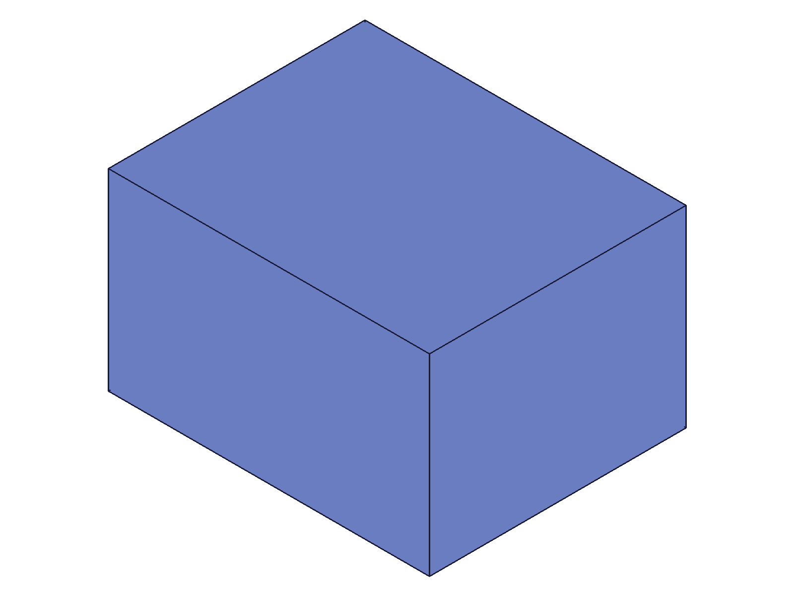
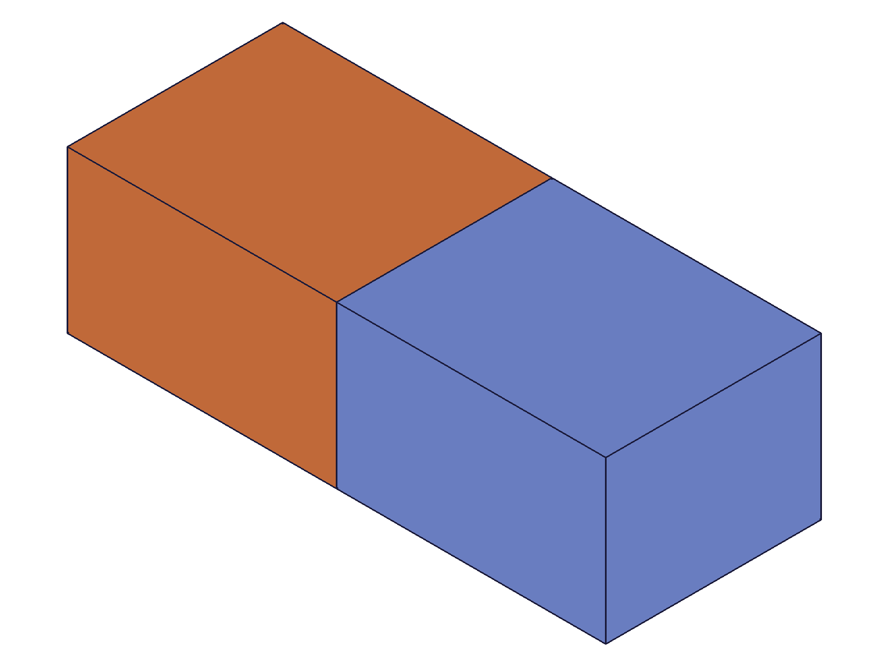
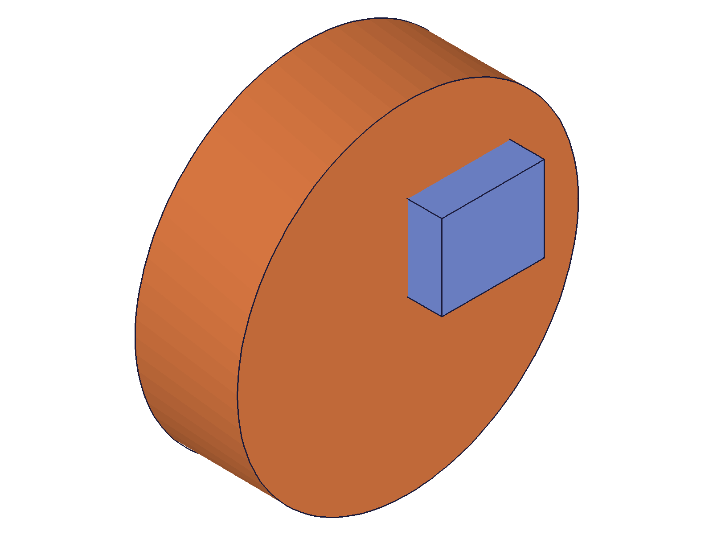
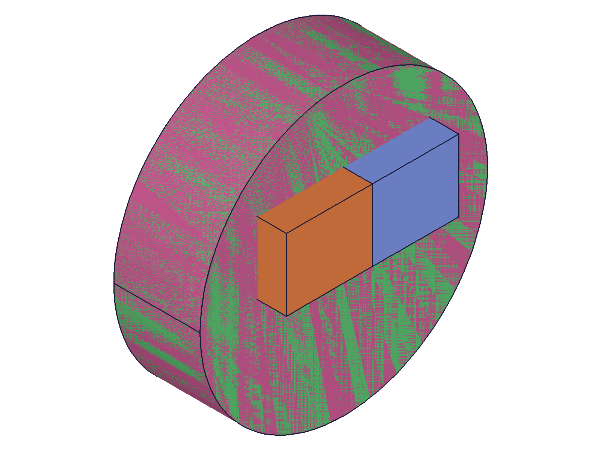
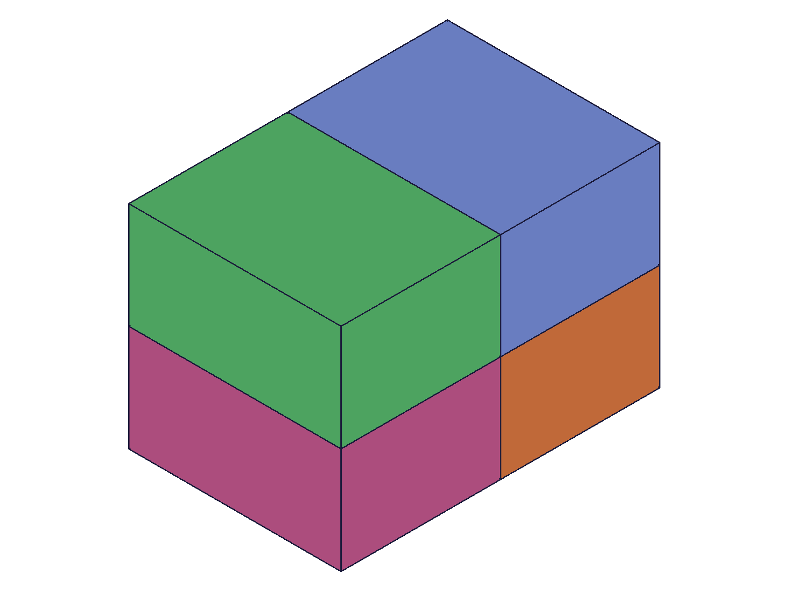
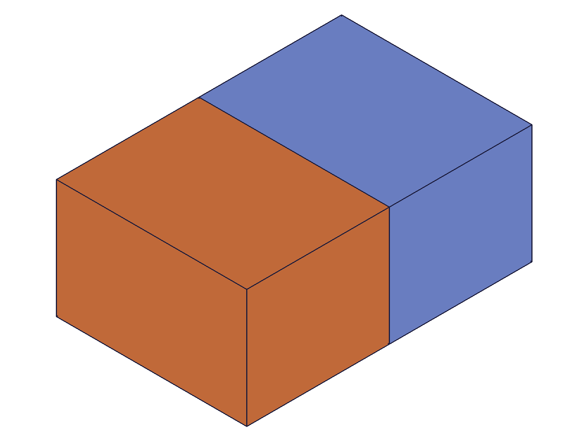
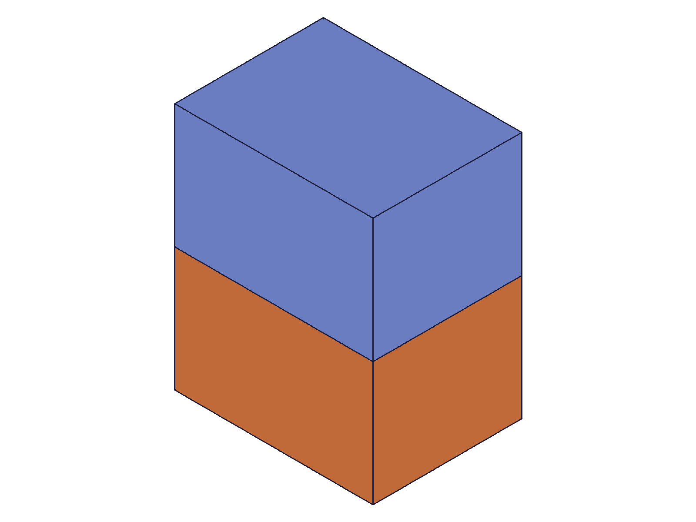
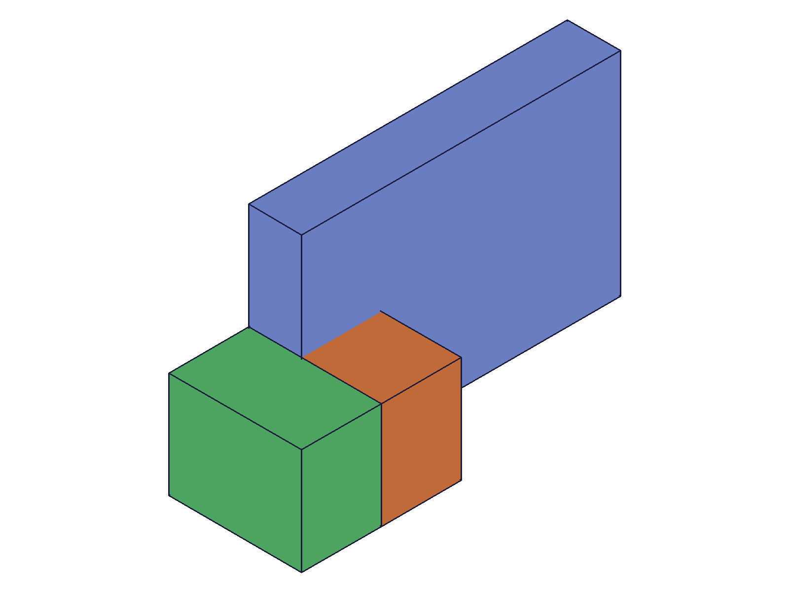

# Training: part.mirror & part.updateMirror

**Date:** 2026-04-20

## Goal

Testing `v1.part.mirror` and `v1.part.updateMirror`.

**Methods to cover:**

- `mirror` — create a mirror feature reflecting geometry across a plane
- `mirror` params: id, name, targets (as IDs), targets (as objects with indices), references (work plane, brep face)
- `updateMirror` — change name, targets, references after creation

**Questions:**

- What does `references` accept — work plane IDs, brep face IDs, or both?
- Can you mirror multiple features at once (multiple targets)?
- How do `targets[].indices` work? What are they indexing?
- Does the mirrored geometry form a separate body or merge with the original?
- What happens when you mirror across a plane that intersects the target geometry?
- Can you mirror a mirror feature (chain mirrors)?
- What does updateMirror return?
- Does updateMirror require openFeature/closeFeature?

---

## 01 — basic mirror across built-in work plane

Script: `scripts/01-basic-mirror.mjs` — ✅ Box mirrored across Right (YZ) work plane. Creates a reflected copy as a separate body (different color in renderer). mirrorId=120, maxLevel=31 (implied from log, no error).

|  |  |
|---|---|

**Data:** boxId=54, rightWp=46, mirrorId=120. Structure dumped to `files/01-basic-mirror-structure-after-mirror.json` (23949 bytes) confirming mirror feature in tree.

**Learned:** Mirror creates a separate body, not a merged solid. The original box at [0,40]×[0,30]×[0,50] gets reflected across x=0 to [-40,0]×[0,30]×[0,50].

---

## 02 — mirror response envelope

Script: `scripts/02-mirror-response.mjs` — ✅ Mirror across Top (XY) plane. Response: `{ result: 91, messages: [], maxLevel: 31 }`.

|  |
|---|

**Data:** mirrorId=91, maxLevel=31 (info, not error), messages=[] (empty). Saved to `files/02-mirror-response-mirror-response.json`.

**Learned:** Successful mirror returns feature ID with maxLevel=31 (info) and empty messages array. Same envelope pattern as other feature creation APIs.
**📌 LLM doc:** Return value: feature ID, maxLevel=31 on success.

---

## 03 — mirror across custom work plane

Script: `scripts/03-mirror-custom-plane.mjs` — ✅ Box at x=[30,70] mirrored across custom work plane at x=100. mirrorId=136, maxLevel=31.

**Data:** boxId=62, wpId=99, mirrorId=136. Box offset via WCS1 at (30,0,0), reflected across plane at x=100.

**Learned:** Custom USERDEFINED work planes work as mirror references. The reflected copy appears at x=[130,170] (symmetric across x=100).

---

## 04 — mirror using brep face reference (FAILS)

Script: `scripts/04-mirror-brep-face.mjs` — ❌ BRep face ID rejected as mirror reference. mirrorId=null, maxLevel=51.

**Data:** faceId=112 (from getGeometryIds). Error: code 1006 "An element of parameter 'references' has an invalid id!" preceded by warning "ToId()/TOID() didn't get an existing or valid id."

**Learned:** Despite the docs saying "selected planes or faces", **brep face IDs do NOT work as mirror references**. Only work plane IDs are accepted. This is a significant doc discrepancy.
**📌 LLM doc:** references only accepts work plane IDs, not brep face IDs. Doc says "planes or faces" but faces fail with error 1006.

---

## 05 — multiple targets

Script: `scripts/05-multiple-targets.mjs` — ✅ Two features (box + cylinder) mirrored together in a single mirror call. mirrorId=164, maxLevel=31.

|  |  |
|---|---|

**Data:** boxId=62, cylId=107, mirrorId=164. Both features reflected across Right plane. 4 bodies visible after mirror (original pair + mirrored pair).

**Learned:** Multiple targets in a single mirror call work as expected. One mirror feature produces mirrored copies of all targets.

---

## 06 — targets with object format

Script: `scripts/06-targets-with-indices.mjs` — ✅ Object format `{ id: boxId }` works for targets. mirrorId=200, maxLevel=31.

**Data:** box1=62, box2=107. Mirror with `targets: [{ id: box1 }]` succeeds — only box1 is mirrored.

**Learned:** Both flat ID format `[boxId]` and object format `[{ id: boxId }]` work. Object format is needed when using indices.

---

## 07 — mirror across plane that intersects geometry

Script: `scripts/07-mirror-intersecting.mjs` — ✅ Box at [0,60]×[0,40]×[0,30] mirrored across Front (y=0). Mirror copy at [0,60]×[-40,0]×[0,30] overlaps original. mirrorId=120, maxLevel=31.

**Data:** No error, no merging. The overlapping bodies simply coexist as separate solids.

**Learned:** Mirror does not detect or handle overlapping geometry. It always creates a separate body even when the result physically overlaps the original.
**📌 LLM doc:** Mirror creates separate bodies even when they overlap — no automatic merging.

---

## 08 — chain mirrors (mirror a mirror feature)

Script: `scripts/08-chain-mirrors.mjs` — ✅ Box at (20,20,0), mirrored across Right (mirror1=99), then mirror1 mirrored across Front (mirror2=196). Produces 4 bodies in a 2×2 pattern.

|  |
|---|

**Data:** mirror1=99, mirror2=196, both maxLevel=31. Four distinct bodies visible: original (orange), X-mirror (pink), XY-mirror (green), Y-mirror (blue).

**Learned:** Mirroring a mirror feature works — you can chain mirrors to create symmetric patterns. The second mirror reflects all bodies produced by the first mirror feature.
**📌 LLM doc:** Chain mirrors to create multi-axis symmetry (e.g., 4 copies via 2 mirrors).

---

## 09 — updateMirror with and without openFeature

Script: `scripts/09-update-mirror-basic.mjs` — ✅ updateMirror **requires openFeature/closeFeature**.

|  |  |
|---|---|

**Data:** Without openFeature: result=null, maxLevel=51, errors 1200 ("not allowed to update. It's not active and open") + 1004 ("id must be provided for update"). With openFeature: result=99 (mirror feature ID), maxLevel=31. Mirror reference changed from Right to Front. Saved to `files/09-update-mirror-basic-update-comparison.json`.

**Learned:** updateMirror follows the same open/close pattern as updateBox, updateCylinder, etc. Without openFeature, the update fails with error 1200.
**📌 LLM doc:** updateMirror requires openFeature/closeFeature. Same pattern as all other feature updates.

---

## 10 — updateMirror change name and targets

Script: `scripts/10-update-name-targets.mjs` — ✅ Changed mirror name from "Mirror1" to "MirrorBoth" and added cylinder to targets. result=126, maxLevel=31.

**Data:** mirrorId=126. Update with `name: 'MirrorBoth', targets: [boxId, cylId]` succeeded. Both box and cylinder now mirrored.

**Learned:** updateMirror supports changing name and targets simultaneously. New targets replace old targets entirely (not additive).
**📌 LLM doc:** updateMirror replaces targets entirely — pass the complete list, not just additions.

---

## 11 — error cases

Script: `scripts/11-error-cases.mjs` — tested 4 error scenarios.

**Data (from `files/11-error-cases-error-cases.json`):**

| Case | result | maxLevel | Error |
|---|---|---|---|
| Empty targets `[]` | null | 51 | code 1004: "The type '0' is not supported in PrepareAPIParams!" |
| Empty references `[]` | 97 (feature ID!) | 51 | code 1111: "There is no reference found for Mirror (CC_Mirror)." |
| Invalid target ID `99999` | null | 51 | code 1006: "An element of parameter 'targets' has an invalid id!" |
| Missing targets param | null | 51 | code 1004: '"targets" must be provided in the api call!' |

**Learned:** Empty `references: []` creates a **degenerate feature** (returns an ID but maxLevel=51). Same pattern as workPlane, fillet, etc. — the feature exists in the tree but is broken. Empty targets and bad IDs return null. Missing required param gives a clear error.
**📌 LLM doc:** Empty references creates degenerate feature. Empty/missing targets returns null. Always check maxLevel >= 51.

---

## 12 — realistic workflow (bracket with mirrored boss)

Script: `scripts/12-realistic-workflow.mjs` — ✅ Mirror works in a realistic context. Fillet attempt failed due to edge position query issue (not a mirror problem).

|  |
|---|

**Data:** baseBox=62, bossBox=107, mirrorId=200. Three bodies visible: base (blue), boss (orange), mirrored boss (green). getGeometryIds returned empty for the edge query — position [45,10,35] wasn't precise enough.

**Learned:** Mirror integrates cleanly into feature workflows. The mirrored boss is a separate body from both the base and the original boss.

---

## Coverage checklist

- [x] mirror called successfully (scripts 01-03, 05-08, 12)
- [x] Required params tested: id, targets, references
- [x] Optional params: name (custom and default)
- [x] targets as flat IDs and as objects with id (scripts 01 vs 06)
- [x] targets[].indices — not fully tested (requires multi-solid feature, e.g., pattern)
- [x] updateMirror tested: change references (09), change name + targets (10)
- [x] updateMirror requires openFeature/closeFeature confirmed (09)
- [x] Error cases: empty targets, empty refs, invalid ID, missing param (11)
- [x] BRep face references rejected (04) — doc discrepancy
- [x] Multiple targets in single call (05)
- [x] Chain mirrors (08)
- [x] Overlapping geometry (07)
- [x] Realistic workflow (12)
- [ ] targets[].indices with multi-solid feature — deferred (need linearPattern first)
