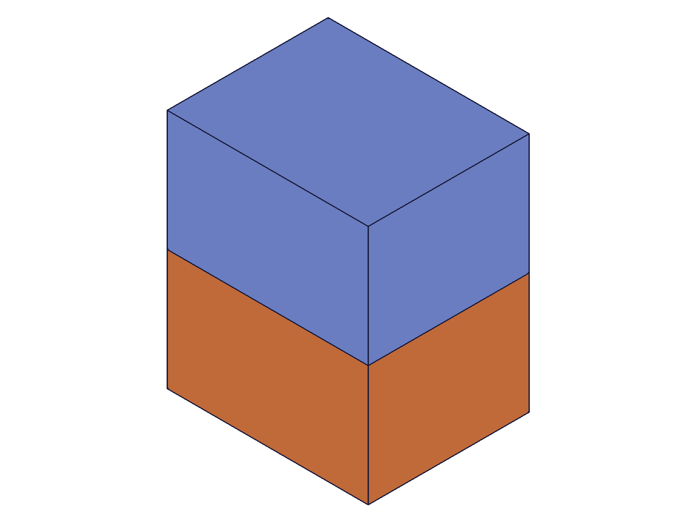
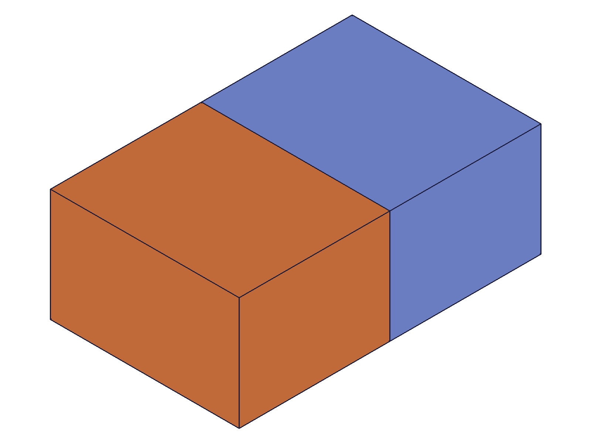
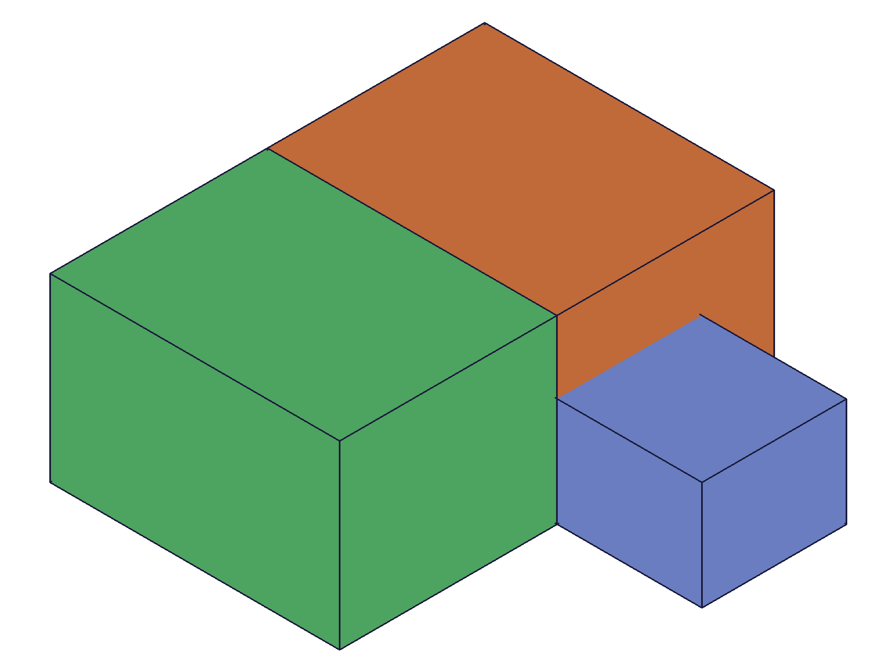
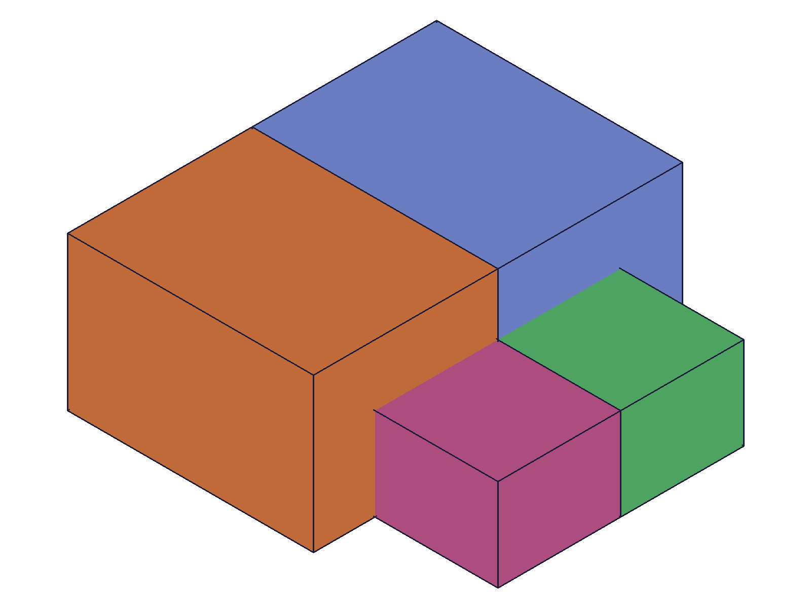

# Training: part.updateMirror

**Date:** 2026-04-20

## Goal

Focused session on `v1.part.updateMirror`. Prior mirror session (2026-04-20_15-00-00_mirror) tested basic update scenarios (scripts 09-10). This session fills coverage gaps.

**Methods to cover:**

- `updateMirror` — change references to custom work plane
- `updateMirror` — omit all optional params (verify no-op behavior)
- `updateMirror` — error case: invalid references
- `updateMirror` — error case: remove all targets
- `updateMirror` — change to object-format targets with indices
- `updateMirror` — verify return value and data with filewrite

**Questions:**

- Does omitting all optional params truly keep everything unchanged?
- Can you update references to a custom (USERDEFINED) work plane?
- What error do you get with invalid references in updateMirror?
- Can you pass targets with indices in updateMirror?
- Does updateMirror regenerate the mirrored geometry immediately, or does closeFeature trigger it?

---

## 01 — update references from built-in to built-in plane

Script: `scripts/01-update-references.mjs` — ✅ Changed mirror plane from Right (YZ) to Front (XZ). result=99, maxLevel=31, messages=[].

|  |  |
|---|---|

**Data:** mirrorId=99. Before: two boxes side-by-side along X (mirrored across Right/YZ). After: two boxes stacked along Y (mirrored across Front/XZ). Return value saved to `files/01-update-references-update-response.json` — result=99 (mirror feature ID), maxLevel=31, messages=[].

**Learned:** updateMirror successfully changes the reference plane and regenerates geometry after closeFeature. Silhouette change confirms the mirror axis changed.

---

## 02 — noop update (no optional params)

Script: `scripts/02-noop-update.mjs` — ✅ Called updateMirror with only `id` (no name, targets, or references). result=99, maxLevel=31, messages=[].

|  |  |
|---|---|

**Data:** Before and after snapshots are identical — the mirrored geometry is unchanged. Return: result=99, maxLevel=31 (see `files/02-noop-update-noop-response.json`).

**Learned:** Omitting all optional params is a valid no-op. The feature is preserved exactly as-is. No error, no side effects.
**📌 LLM doc:** Confirm: omitting all optional params in updateMirror is a safe no-op.

---

## 03 — update references to custom (USERDEFINED) work plane

Script: `scripts/03-update-custom-plane.mjs` — ✅ Changed mirror from Right (x=0) to custom work plane at x=80. result=99, maxLevel=31.

|  |  |
|---|---|

**Data:** customWp=196. Both snapshots look identical due to auto-scaling (both are two boxes along X, just at different absolute positions). But the API returned success with maxLevel=31 (see `files/03-update-custom-plane-custom-plane-response.json`).

**Learned:** Custom (USERDEFINED) work planes work as updateMirror references, same as for mirror creation.

---

## 04 — error cases

Script: `scripts/04-error-invalid-ref.mjs` — tested 4 error scenarios in updateMirror.

**Data (from `files/04-error-invalid-ref-error-cases.json`):**

| Case | result | maxLevel | Error code | Message |
|---|---|---|---|---|
| Invalid ref ID `99999` | null | 51 | 1006 | "An element of parameter 'references' has an invalid id!" |
| Empty references `[]` | 99 (feature ID!) | 51 | 1111 | "There is no reference found for Mirror1 (CC_Mirror)." |
| Empty targets `[]` | null | 51 | 1004 | "The type '0' is not supported in PrepareAPIParams!" |
| Invalid target ID `99999` | null | 51 | 1006 | "An element of parameter 'targets' has an invalid id!" |

**Learned:** Error behavior in updateMirror matches mirror creation exactly. Same error codes, same patterns. Empty references creates a degenerate state (returns feature ID but maxLevel=51). Empty/invalid targets return null.
**📌 LLM doc:** updateMirror error codes match mirror creation — same 1006/1004/1111 patterns.

---

## 05 — update targets with object format

Script: `scripts/05-update-targets-objects.mjs` — ✅ Changed targets from `[box1]` to `[{ id: box1 }, { id: box2 }]` using object format. result=144, maxLevel=31.

|  |  |
|---|---|

**Data:** Before: 3 bodies (box1 green, box2 blue, mirrored-box1 orange — only box1 mirrored). After: 4 bodies (box1 orange, box2 pink, mirrored-box1 blue, mirrored-box2 green — both boxes mirrored). Saved to `files/05-update-targets-objects-add-target-response.json`.

**Learned:** Object format `[{ id: featureId }]` works in updateMirror, same as in mirror creation. Targets are fully replaced — the new list is `[box1, box2]`, not appended. Visual evidence clearly confirms both boxes are now mirrored (4 distinct bodies).
**📌 LLM doc:** Object format targets work in updateMirror. Confirm full replacement behavior.

---

## 06 — update name only

Script: `scripts/06-update-name-only.mjs` — ✅ Changed mirror name from "OriginalName" to "RenamedMirror". result=99, maxLevel=31, messages=[].

|  |
|---|

**Data:** result=99, maxLevel=31 (see `files/06-update-name-only-name-only-response.json`). Geometry unchanged — renaming is a metadata-only operation.

**Learned:** Name-only updates work as expected with no side effects on geometry.

---

## Coverage checklist

- [x] updateMirror called successfully (scripts 01, 02, 03, 05, 06)
- [x] Required param tested: id (all scripts)
- [x] Optional param: name (script 06)
- [x] Optional param: targets — flat IDs (prior session script 10) and object format (script 05)
- [x] Optional param: references — built-in planes (script 01), custom planes (script 03)
- [x] Noop update with no optional params (script 02)
- [x] Error cases: invalid ref, empty ref, empty targets, invalid target (script 04)
- [x] Return value verified with filewrite (all scripts)
- [x] Visual evidence matches data (scripts 01, 02, 05)
- [x] openFeature/closeFeature requirement confirmed (prior session script 09)
