# Training: part.linearPattern

**Date:** 2026-04-20

## Goal

Testing `v1.part.linearPattern` and `v1.part.updateLinearPattern`.

**Methods to cover:**

- `linearPattern` — basic 1D pattern along a work axis
- `linearPattern` params: id, name, targets, dir1 (references, distance, count, inverted, merged)
- `linearPattern` with dir2 — 2D grid pattern
- `linearPattern` with work points to define direction
- `linearPattern` with targets using object format (id + indices)
- `updateLinearPattern` — change count, distance, references, merged after creation

**Questions:**

- What IDs go in `dir1.references` — work axis, brep edge, sketch line, or work points?
- Does `count` include the original or is it additional copies?
- What does `merged: TRUE` actually do to the resulting bodies?
- Can `distance` be an expression string?
- Does `inverted` reverse the pattern direction?
- What happens with `count: 0` or `count: 1`?
- Can you pattern multiple features at once?

---

## 01 — basic linear pattern along work axis

Script: `scripts/01-basic-workaxis.mjs` — ✅ `linearPattern` with work axis, count=4, distance=40 works.

|  | 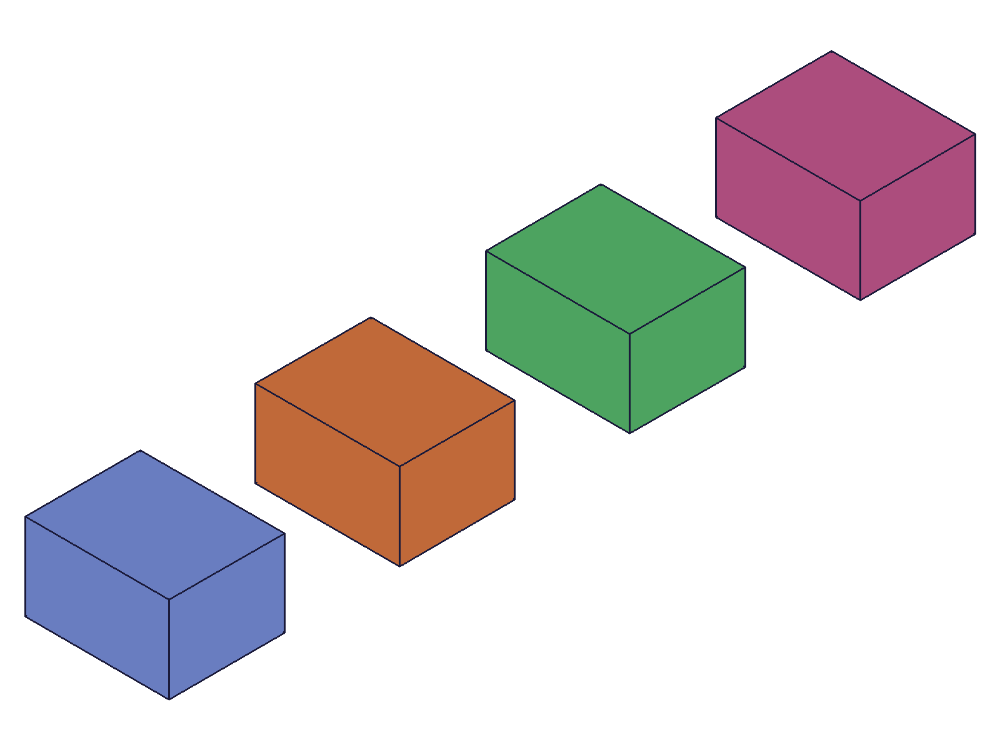 |
|---|---|

**Data:** result=128 (feature ID), maxLevel=31 (info), messages=[]. 4 boxes visible in +X direction.

**Learned:** `count` includes the original — count=4 produces 1 original + 3 copies = 4 total bodies. Returns the linear pattern feature ID. Each copy gets a distinct color in the renderer.

📌 LLM doc: count includes original body

## 02 — count edge cases

Script: `scripts/02-count-meaning.mjs` — ⚠️ count=1 succeeds, count=0 fails.

| 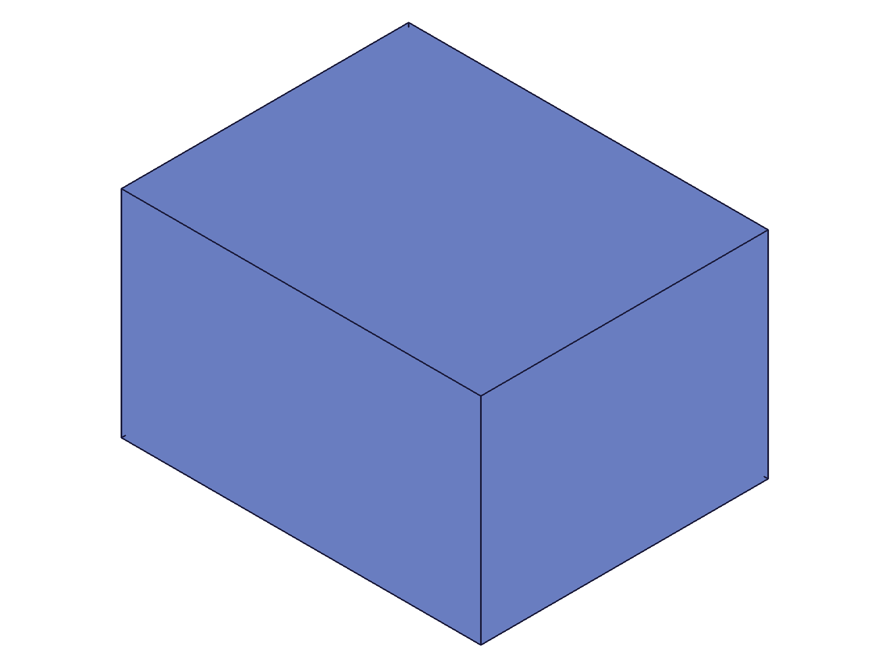 |
|---|

**Data:** count=1: result=99, maxLevel=31 — creates a pattern feature but with no additional copies (just the original). count=0: result=null, maxLevel=51, error code 1004 "id must be provided to create CC_LinearPattern" — misleading error message; the real issue is count=0 is invalid.

**Note:** The count=0 test ran after a second `part.create` in the same script, which independently causes failures (see 03b findings). However, count=0 is likely still invalid — minimum useful count is 1.

**Learned:** count=1 is valid (creates the feature with no extra copies). count=0 fails. Minimum count is 1, but ≥2 needed for actual copies.

📌 LLM doc: count minimum is 1 (for the original), count=0 errors

## 03 — inverted parameter

Scripts: `scripts/03c-inverted-isolated.mjs`, `scripts/03d-inverted-true-isolated.mjs` — ✅ both inverted=0 and inverted=1 work in isolation.

|  | 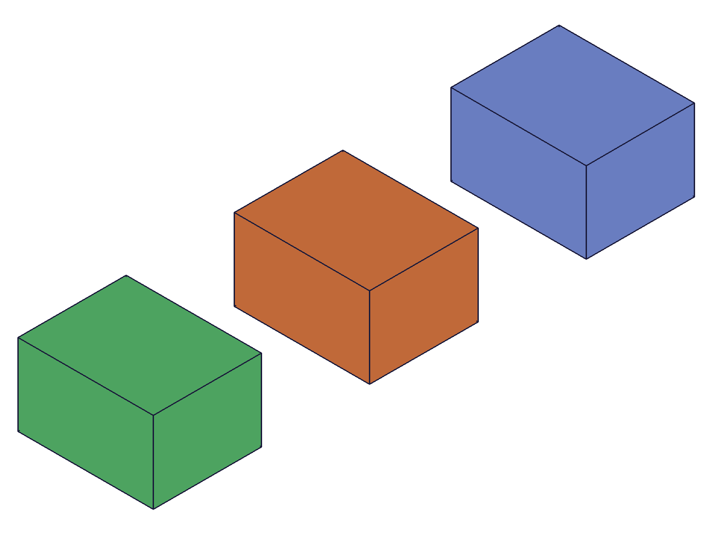 |
|---|---|

**Data:** inverted=0 result=107, maxLevel=31. inverted=1 result=107, maxLevel=31. Both produce 3 boxes. Color ordering differs between the two (original body position vs copies).

**Learned:** `inverted` uses numeric 0/1 (ClassCAD boolean). `inverted: 1` reverses the pattern direction along the reference axis. Box at origin=[60,0,0] with +X axis: inverted=0 patterns in +X, inverted=1 patterns in -X.

**Harness finding:** Multiple `part.create` calls within a single script cause the second linearPattern call to always fail with code 1004 "id must be provided". This is NOT about the parameter values — it's a harness/server state issue. Always use one `part.create` per script.

📌 LLM doc: inverted uses 0/1, reverses direction

## 04 — merged parameter

Scripts: `scripts/04-merged.mjs`, `scripts/04b-nonmerged.mjs` — ✅ clear visual difference.

| 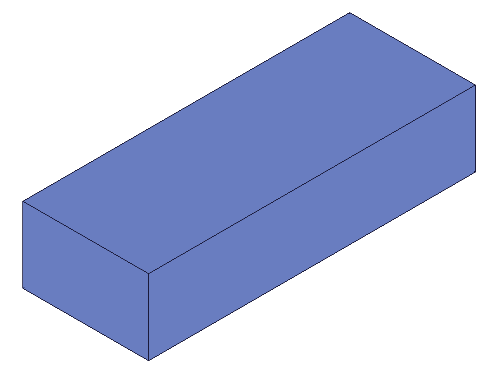 |  |
|---|---|

**Data:** merged=1 result=99, maxLevel=31. Non-merged result=99, maxLevel=31. Both with distance=15 (< box length=20, so overlapping).

**Learned:** `merged: 1` performs a boolean union on all pattern instances, producing a single continuous body (single color). `merged: 0` (default) keeps each copy as a separate body (distinct colors, overlapping). Merged mode is useful for creating continuous geometry from overlapping patterns.

📌 LLM doc: merged unions all copies into one body

## 05 — two-direction grid pattern

Script: `scripts/05-two-directions.mjs` — ✅ 4×3 grid pattern.

| 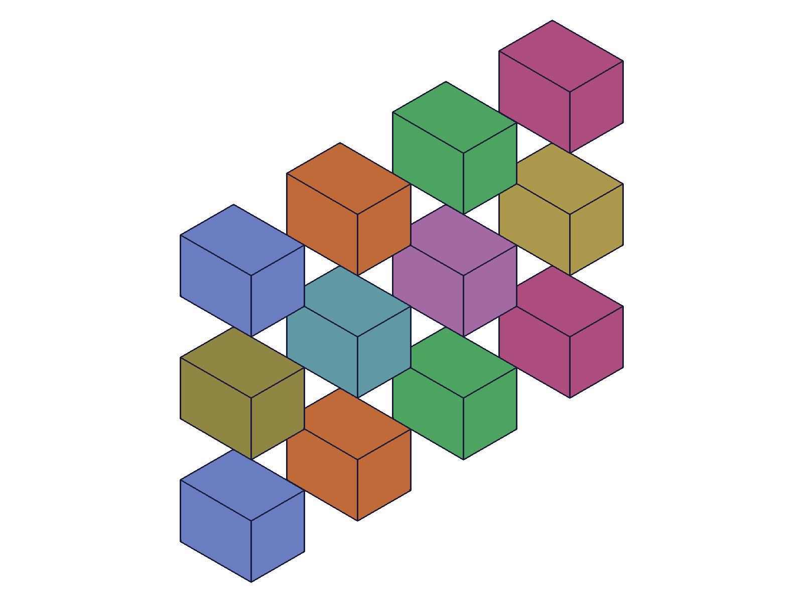 |
|---|

**Data:** result=107, maxLevel=31. 12 boxes visible (4 in X × 3 in Y). Each body gets a distinct color.

**Learned:** `dir2` creates a second pattern direction. Total count = dir1.count × dir2.count (4×3=12). Each direction needs its own work axis reference. dir2.count defaults to 1 (no second direction).

📌 LLM doc: dir2 for 2D grids, total = dir1.count × dir2.count

## 06 — work points as direction reference

Script: `scripts/06-workpoints-direction.mjs` — ✅ two work points define a diagonal direction.

| 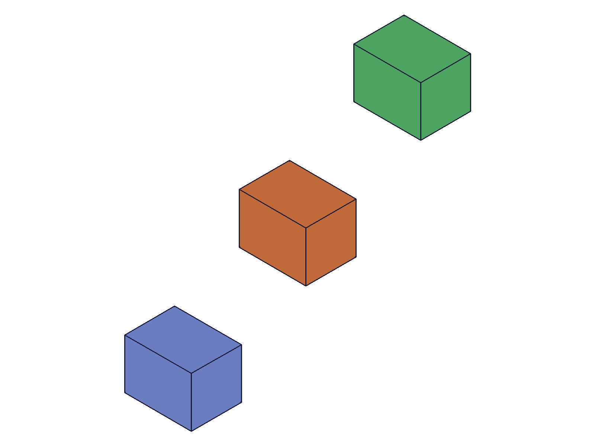 |
|---|

**Data:** result=107, maxLevel=31. 3 boxes along the diagonal from [0,0,0] to [50,30,0].

**Learned:** `dir1.references` accepts two work point IDs `[wp1, wp2]` to define the pattern direction vector (from wp1 to wp2). This allows arbitrary diagonal patterns without creating a work axis.

📌 LLM doc: two work points define direction vector

## 07 — expression-driven distance and count

Script: `scripts/07-expression-distance.mjs` — ✅ expressions work for both distance and count.

| 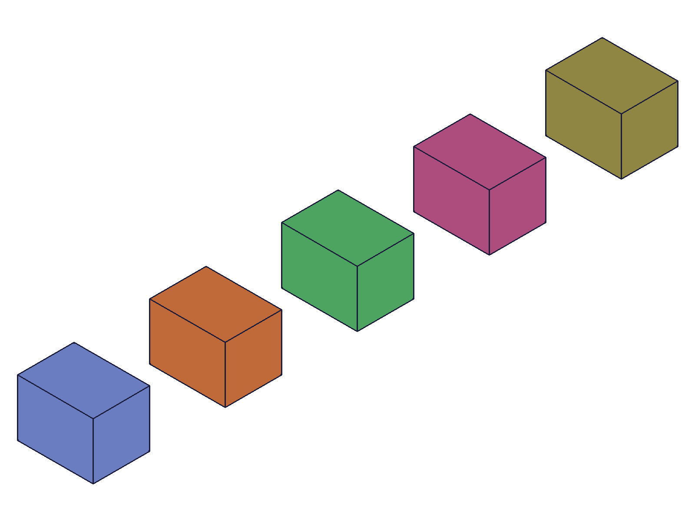 |
|---|

**Data:** result=101, maxLevel=31. 5 boxes spaced at 35mm apart (spacing=35, copies=5).

**Learned:** Both `distance` and `count` accept `@expr.NAME` syntax. Pattern is expression-driven — updating the expression will recalculate the pattern automatically.

📌 LLM doc: distance and count support @expr. syntax

## 08 — multiple targets

Script: `scripts/08-multiple-targets.mjs` — ✅ both features patterned together.

| 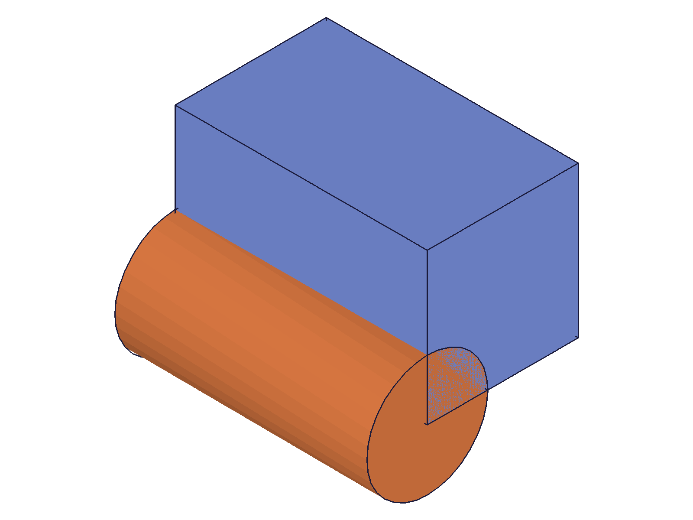 | 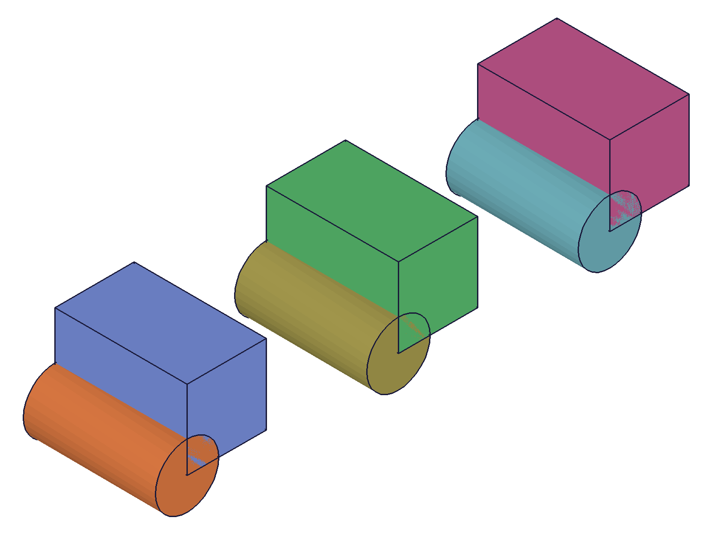 |
|---|---|

**Data:** result=164, maxLevel=31. 3 copies of the box+cylinder pair along X.

**Learned:** `targets` accepts multiple feature IDs. All targets are patterned together, maintaining their relative positions. Each copy gets distinct colors per body.

📌 LLM doc: targets can include multiple features

## 09 — updateLinearPattern: change count

Script: `scripts/09-update-count.mjs` — ✅ count updated from 3 to 6.

| 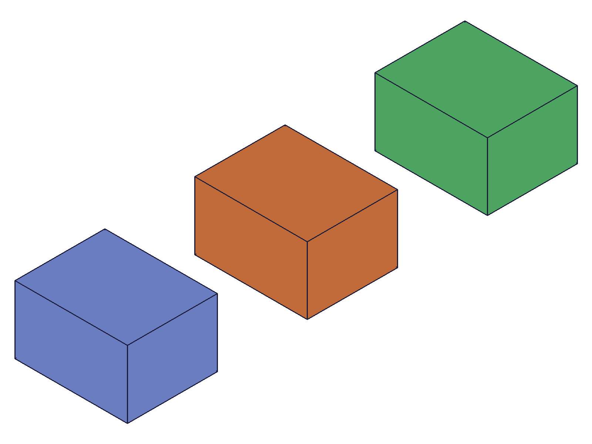 | 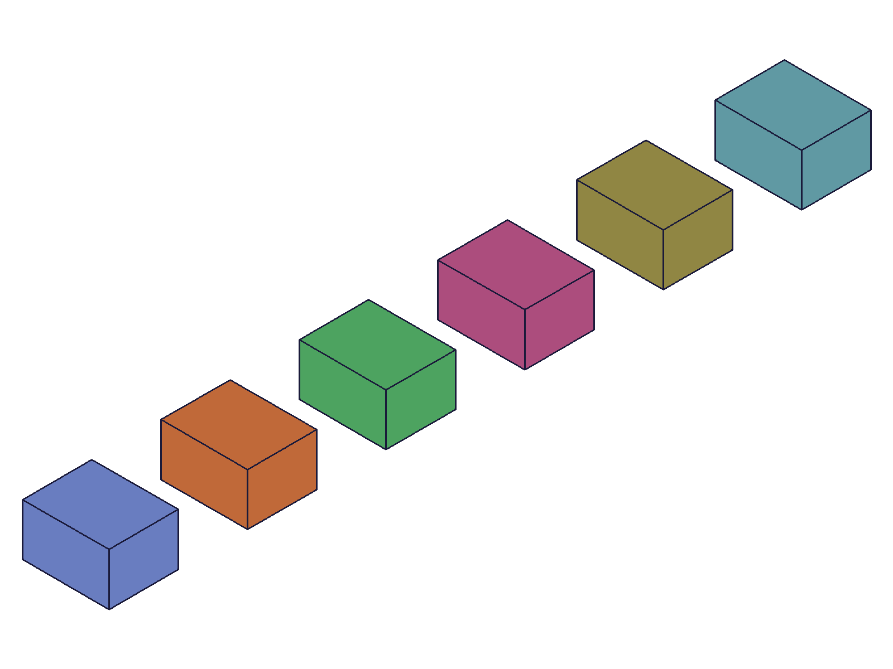 |
|---|---|

**Data:** update result=99 (same feature ID), maxLevel=31. Before: 3 boxes. After: 6 boxes.

**Learned:** `updateLinearPattern` requires openFeature/closeFeature. Partial updates work — only pass the fields you want to change. Updating count adds/removes copies while keeping the same feature ID.

📌 LLM doc: partial updates work, requires open/close gate

## 10 — updateLinearPattern: change distance

Script: `scripts/10-update-distance.mjs` — ✅ distance updated from 30 to 60.

**Data:** result=118, maxLevel=31. Spacing between boxes doubled.

📌 LLM doc: distance updatable

## 11 — updateLinearPattern: add dir2

Script: `scripts/11-update-add-dir2.mjs` — ✅ converted 1D pattern to 2D grid.

| 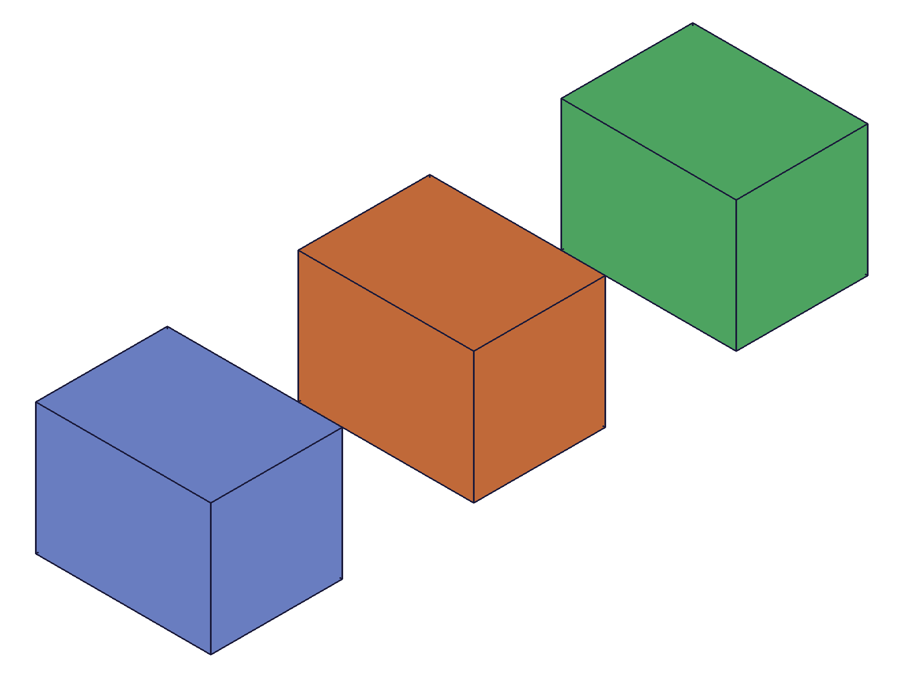 | 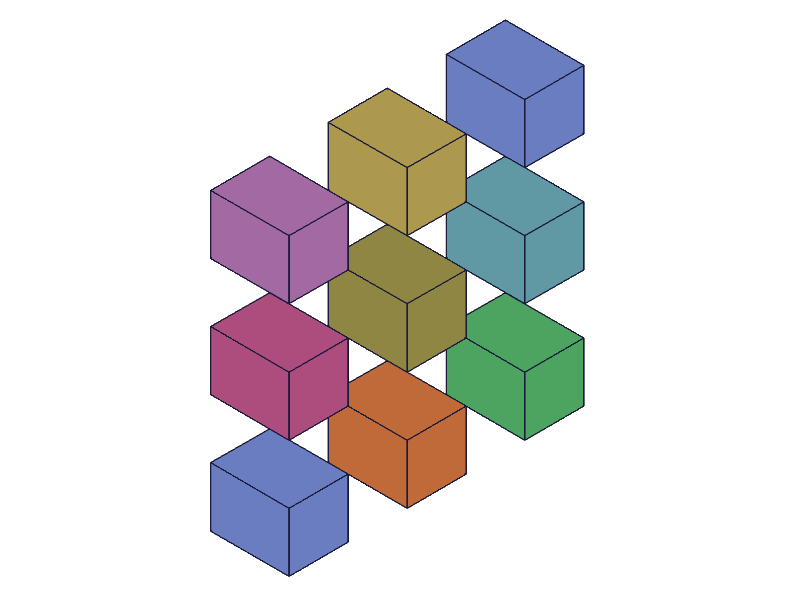 |
|---|---|

**Data:** result=107, maxLevel=31. Before: 3 boxes in a line. After: 3×3 grid.

**Learned:** You can add `dir2` via update to convert a 1D pattern to a 2D grid after creation.

📌 LLM doc: dir2 can be added via update

## 12 — updateLinearPattern: toggle merged

Script: `scripts/12-update-merged.mjs` — ✅ non-merged → merged.

| 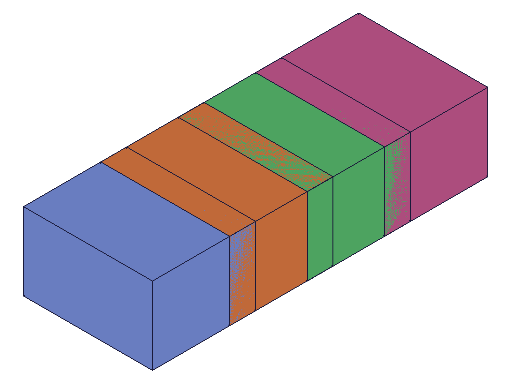 |  |
|---|---|

**Data:** result=99, maxLevel=31. Before: 4 overlapping separate bodies. After: single merged body.

📌 LLM doc: merged can be toggled via update

## 13 — updateLinearPattern: without openFeature

Script: `scripts/13-update-no-open.mjs` — ❌ fails as expected.

**Data:** result=null, maxLevel=51. Two error messages: code 1200 "The provided feature is not allowed to update. It's not active and open." and code 1004 "id must be provided for update."

**Learned:** Confirms the openFeature/closeFeature gate is mandatory. The error is clear and descriptive.

## 14 — brep edge as direction reference

Script: `scripts/14-brep-edge-reference.mjs` — ✅ brep edge works as direction reference.

| 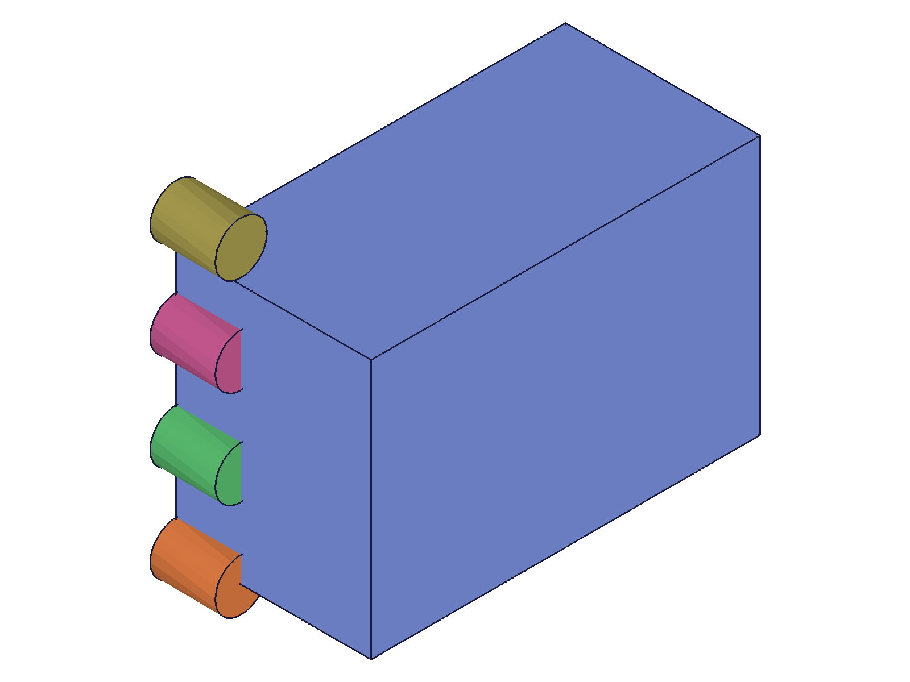 |
|---|

**Data:** result=118, maxLevel=31. Used `getGeometryIds` to find edge ID 76 on the box, then patterned 4 cylinders along that edge's direction.

**Learned:** `dir1.references` accepts brep edge IDs from `getGeometryIds`. The pattern direction follows the edge orientation. This is useful when you want to pattern along an existing geometry edge without creating a separate work axis.

📌 LLM doc: brep edges work as direction references
