# Training: part.circularPattern

**Date:** 2026-04-20

## Goal

Testing `v1.part.circularPattern`.

**Methods to cover:**

- `circularPattern` — basic circular pattern around a work axis
- `circularPattern` params: id, targets, references, angle, count, inverted, merged, name
- Angle semantics: does angle=0 mean equal spacing? What units?
- Count semantics: does count include the original (like linearPattern)?
- Object-format targets with indices

**Questions:**

- Does `count` include the original (like linearPattern) or is it copies only?
- What does `angle: 0` mean? Equal spacing around 360°?
- What happens when angle × count > 2π (overlap)?
- Does `inverted` flip CW vs CCW rotation?
- What reference types work for the axis (work axis, brep edge, work points)?
- Can angle and count accept expression strings?

---

## 01 — basic circular pattern along work axis

Script: `scripts/01-basic-workaxis.mjs` — ✅ 4 boxes at 90° intervals around Z axis.

| 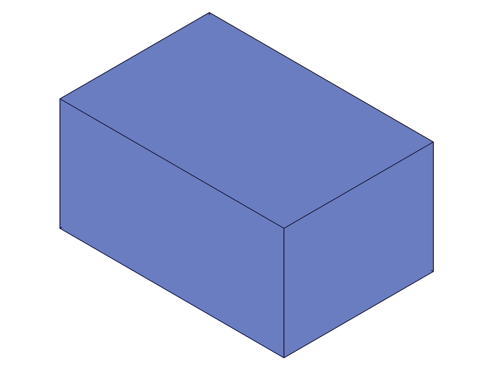 | 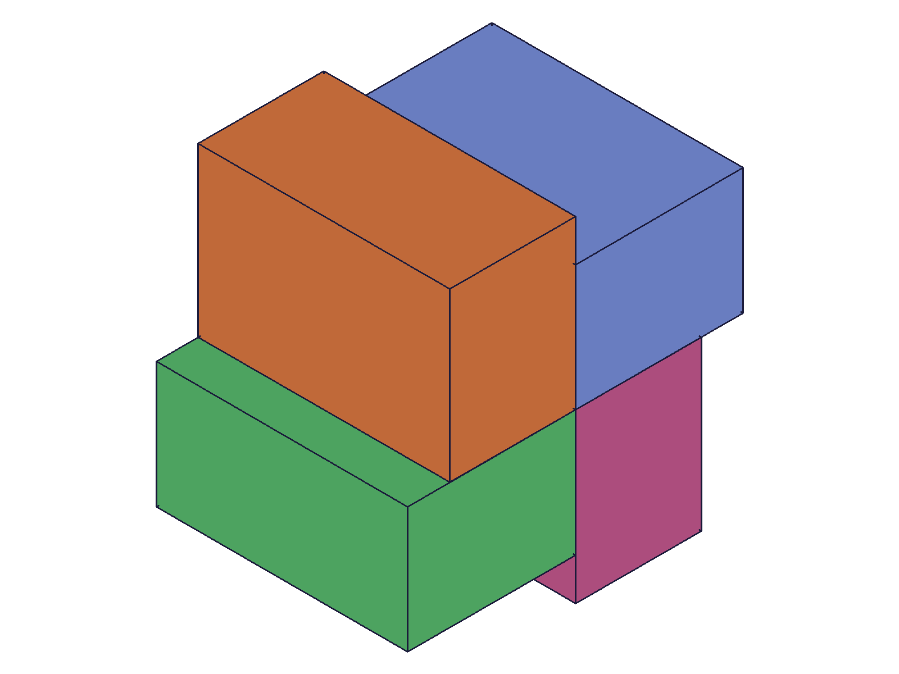 |
|---|---|

**Data:** cpId=128, maxLevel=31. 4 distinct-colored boxes visible at 0°, 90°, 180°, 270° around Z axis.

**Learned:** `circularPattern` works with work axis reference. `count=4` produces 4 total bodies (includes original), same as `linearPattern`. `angle` is the spacing between adjacent instances in radians.

📌 LLM doc: count includes the original, angle is spacing in radians

## 02 — angle=0 with count=6

Script: `scripts/02-count-and-angle0.mjs` — ⚠️ angle=0 stacks all copies at same position.

| 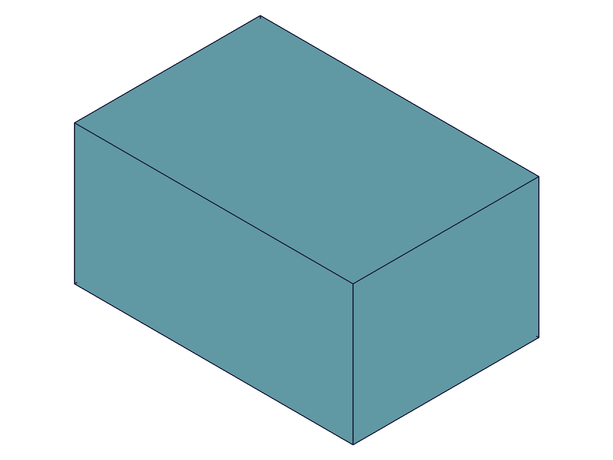 |
|---|

**Data:** result=99, maxLevel=31. Only a single box visible despite count=6 — all 6 copies are at the same angular position.

**Learned:** `angle=0` means literally 0° between copies — all instances overlap at the original position. It does NOT mean "equal spacing around 360°". For equal spacing, calculate manually: `angle = 2*PI / count`.

📌 LLM doc: angle=0 stacks copies, NOT equal spacing — must calculate manually

## 03 — inverted parameter

Scripts: `scripts/03-inverted.mjs`, `scripts/03b-inverted-true.mjs` — ✅ inverted reverses rotation direction.

| 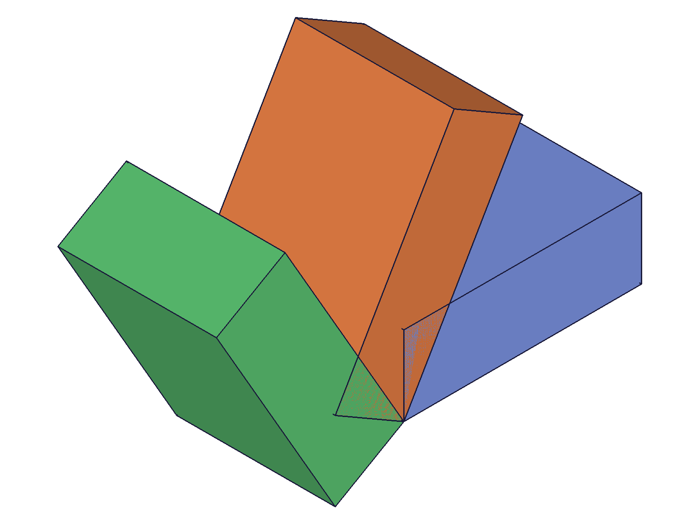 | 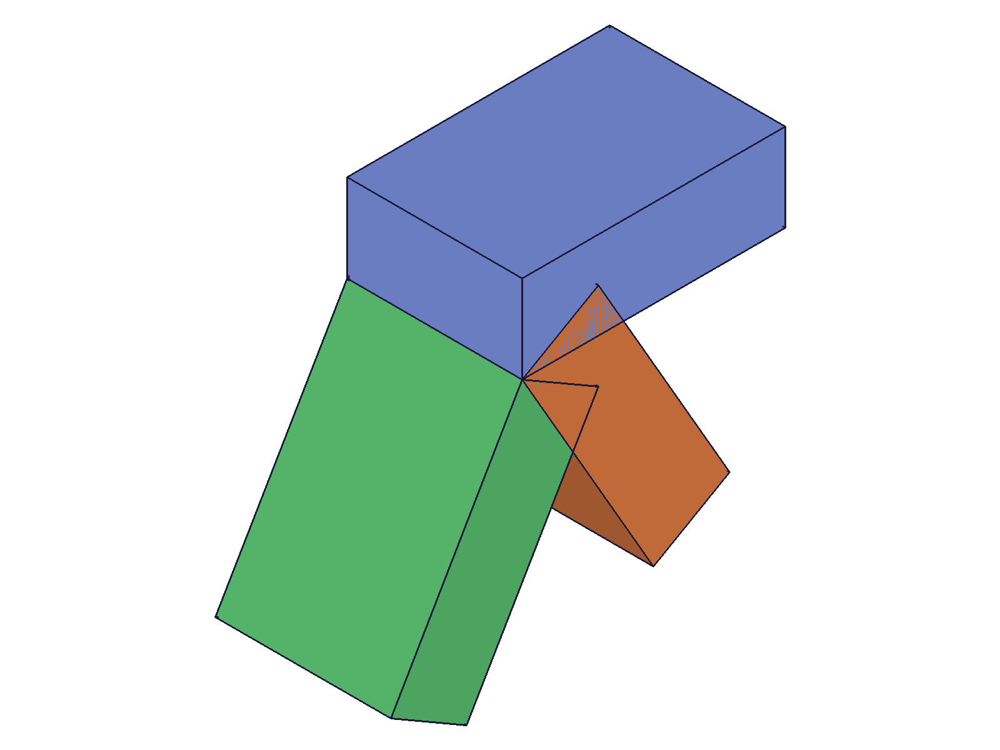 |
|---|---|

**Data:** Both result=99, maxLevel=31. inverted=0: copies go CCW when viewed from +Z. inverted=1: copies go CW.

**Learned:** `inverted` uses numeric 0/1 (ClassCAD boolean). Controls rotation direction around the axis. Default (0) is CCW when viewed from the positive direction of the axis.

📌 LLM doc: inverted=0 is CCW, inverted=1 is CW

## 04 — merged parameter

Scripts: `scripts/04-merged.mjs`, `scripts/04b-merged-debug.mjs`, `scripts/04c-merged-overlapping.mjs` — ❌ merged always fails with boolean error 1001.

| 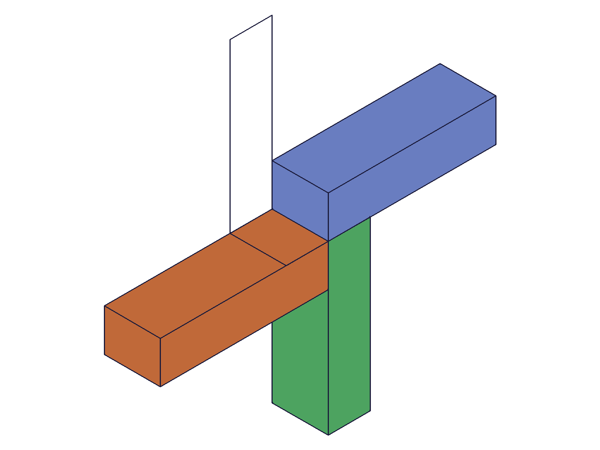 |
|---|

**Data:** All merged attempts return maxLevel=51 with error: "Boolean operation failed with error 1001". Feature is created (result=99/128) but the boolean union step fails. Bodies remain separate despite `merged: 1`. Tested both non-overlapping (04) and overlapping (04c) configurations — same failure in both cases.

**Learned:** `merged: 1` for circularPattern consistently fails with boolean error 1001 in the current ClassCAD version. The pattern feature is created but bodies remain separate. This differs from `linearPattern` where merged works. Use `part.boolean` after creation as a workaround.

📌 LLM doc: merged fails for circularPattern — use boolean as workaround

## 05 — full circle with 8 cylinders

Script: `scripts/05-full-circle.mjs` — ✅ 8 cylinders at 45° intervals forming a ring.

| 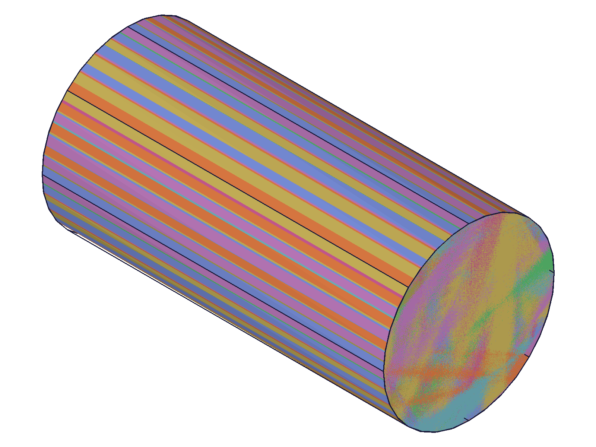 |
|---|

**Data:** result=81, maxLevel=31. 8 cylinders evenly distributed around Z axis (45° = π/4 each). Each has distinct color.

📌 LLM doc: for equal spacing, use angle = 2π/count

## 06 — expression-driven angle and count

Script: `scripts/06-expression-driven.mjs` — ✅ expressions work for both angle and count.

| 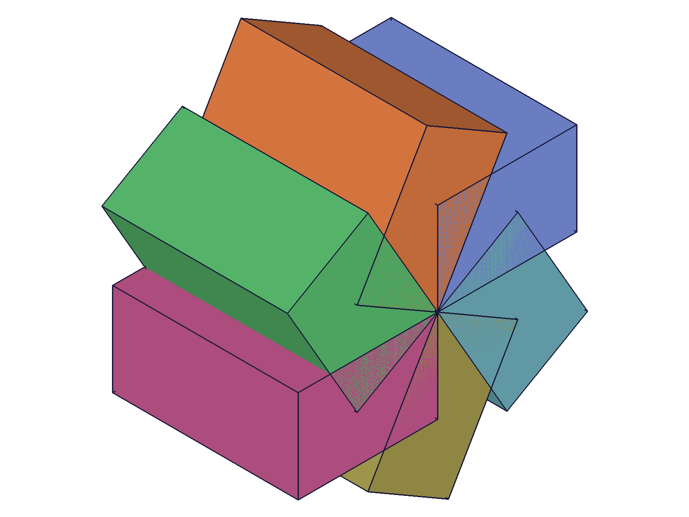 |
|---|

**Data:** result=101, maxLevel=31. 6 boxes at 60° intervals. Used `@expr.spacing_angle` and `@expr.copies`.

**Learned:** Both `angle` and `count` accept `@expr.NAME` syntax. Pattern is expression-driven.

📌 LLM doc: angle and count support @expr. syntax

## 07 — multiple targets

Script: `scripts/07-multiple-targets.mjs` — ✅ both features patterned together.

| 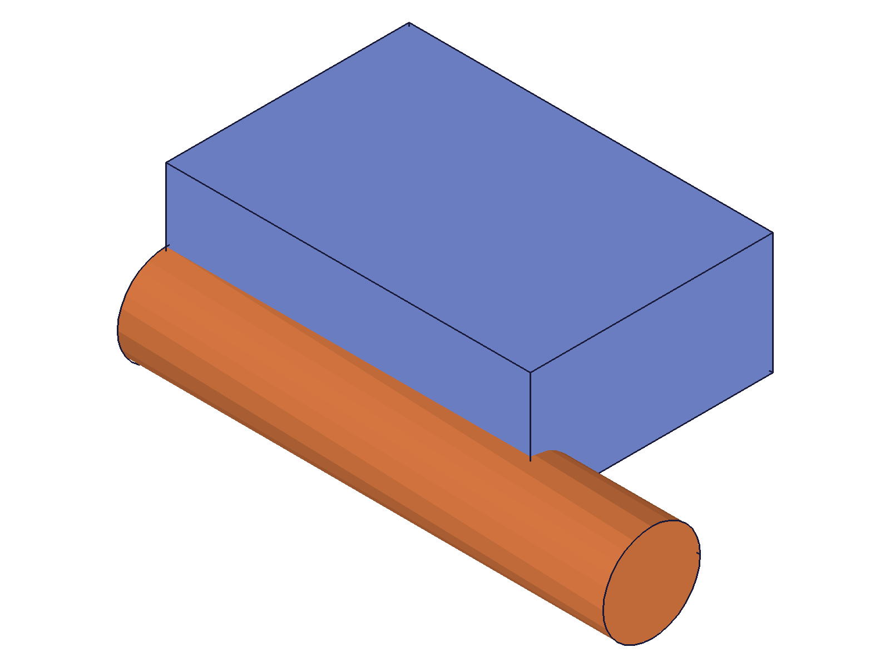 | 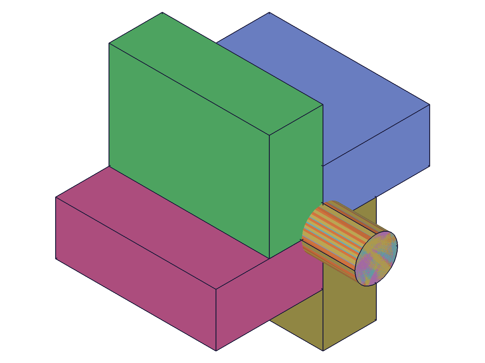 |
|---|---|

**Data:** result=156, maxLevel=31. 4 copies of box+cylinder pairs at 90° intervals. Relative positions maintained.

📌 LLM doc: multiple targets maintain relative positions

## 08 — count=1

Script: `scripts/08-count-edge-cases.mjs` — ✅ count=1 creates feature with no copies.

|  |
|---|

**Data:** result=99, maxLevel=31. Single box visible — pattern feature exists but no additional copies.

📌 LLM doc: count=1 valid, minimum useful count is 2

## 09 — brep edge as axis reference

Script: `scripts/09-brep-edge-axis.mjs` — ✅ brep edge works as rotation axis.

| 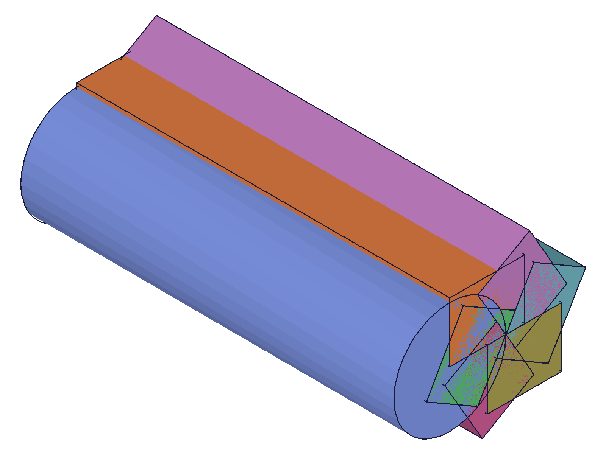 |
|---|

**Data:** result=110, maxLevel=31. Used `getGeometryIds` to find edge ID 62 on a cylinder, patterned 6 small boxes around it at 60° intervals.

**Learned:** `references` accepts brep edge IDs from `getGeometryIds`. The edge's direction defines the rotation axis. Works just like a work axis reference.

📌 LLM doc: brep edges work as rotation axis references

## 10 — negative angle

Script: `scripts/10-negative-angle.mjs` — ✅ negative angle reverses rotation direction.

| 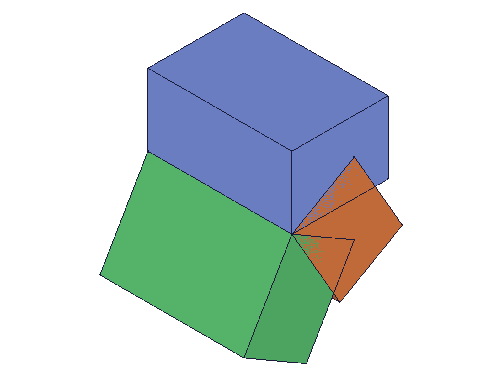 |
|---|

**Data:** result=99, maxLevel=31. Negative angle produces CW rotation (same effect as inverted=1 with positive angle).

**Learned:** Negative angle values are accepted and reverse the rotation direction. Equivalent to using `inverted: 1` with the absolute angle value.

📌 LLM doc: negative angle reverses direction (same as inverted)

## 11 — object-format targets

Script: `scripts/11-object-targets.mjs` — ✅ `{ id: featureId }` format works.

**Data:** result=99, maxLevel=31. Same visual result as flat ID array. Object format allows optional `indices` for multi-solid features.

---

## Coverage Checklist

- [x] The API has been called at least once successfully
- [x] Every required parameter has been tested (id, targets, references)
- [x] Key optional parameters have been exercised (angle, count, inverted, merged, name)
- [x] count includes original (like linearPattern) — verified
- [x] angle=0 semantics documented (stacks, not equal spacing)
- [x] Inverted reverses direction — verified visually
- [x] Merged fails with boolean error — documented
- [x] Expression-driven angle and count — verified
- [x] Multiple targets — verified
- [x] Brep edge as axis reference — verified
- [x] Negative angle — verified
- [x] Object-format targets — verified
- [x] At least one realistic usage combining API with prerequisites
