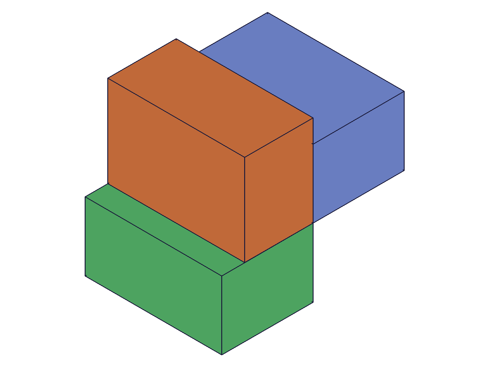
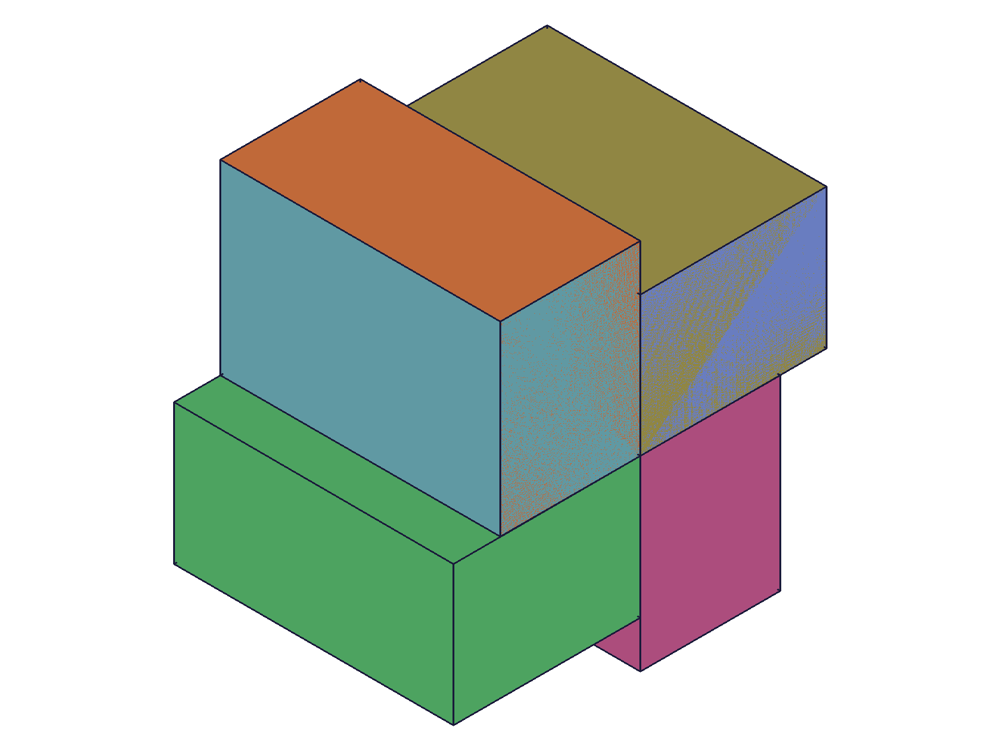
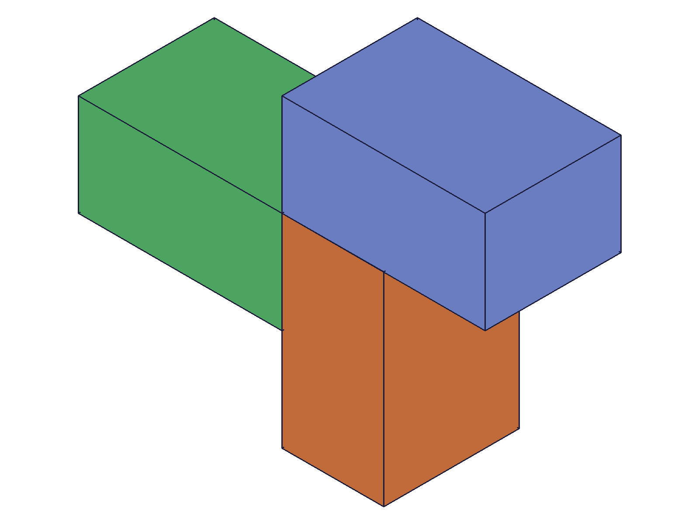

# Training: part.updateCircularPattern

**Date:** 2026-04-20

## Goal

Testing `v1.part.updateCircularPattern`.

**Methods to cover:**

- `updateCircularPattern` — update angle, count, references, inverted, merged, targets, name
- Partial updates (only pass what changed)
- openFeature/closeFeature requirement
- Without openFeature (expected failure)

**Questions:**

- Do partial updates work (like updateLinearPattern)?
- Can you change the rotation axis reference via update?
- Does updating merged still fail (given the circularPattern merged bug)?
- Can you change targets via update?

---

## 01 — update count

Script: `scripts/01-update-count.mjs` — ✅ count updated from 3 to 6.

|  |  |
|---|---|

**Data:** update result=99 (same feature ID), maxLevel=31. Before: 3 boxes. After: 6 boxes at 90° intervals.

**Learned:** Partial updates work — only pass `count` to change count. Returns same feature ID. Requires openFeature/closeFeature.

📌 LLM doc: partial updates work, requires open/close gate

## 02 — update angle

Script: `scripts/02-update-angle.mjs` — ✅ angle updated from 90° to 45°.

**Data:** result=99, maxLevel=31. Boxes are closer together after update.

📌 LLM doc: angle updatable

## 03 — update inverted

Script: `scripts/03-update-inverted.mjs` — ✅ direction reversed.

**Data:** result=99, maxLevel=31. Pattern direction flipped from CCW to CW.

📌 LLM doc: inverted can be toggled

## 04 — without openFeature

Script: `scripts/04-no-open-feature.mjs` — ❌ fails as expected.

**Data:** result=null, maxLevel=51. Error code 1200: "The provided feature is not allowed to update. It's not active and open." Same error pattern as updateLinearPattern.

📌 LLM doc: requires openFeature gate

## 05 — update references (change axis)

Script: `scripts/05-update-references.mjs` — ✅ rotation axis changed from Z to X.

|  |  |
|---|---|

**Data:** result=107, maxLevel=31. Before: pattern around Z axis (horizontal arrangement). After: pattern around X axis (vertical arrangement). Completely different spatial layout.

**Learned:** `references` can be changed via update — changes the rotation axis. This is a powerful operation that reorients the entire pattern.

📌 LLM doc: rotation axis can be changed via update

## 06 — update targets

Script: `scripts/06-update-targets.mjs` — ✅ targets updated to include additional feature.

**Data:** result=118, maxLevel=31. Originally patterning just the box, updated to pattern box+cylinder together.

📌 LLM doc: targets can be changed via update

---

## Coverage Checklist

- [x] The API has been called at least once successfully
- [x] Partial updates tested (count, angle, inverted, references, targets — each independently)
- [x] openFeature/closeFeature gate verified (fails without)
- [x] References update tested (axis change)
- [x] Targets update tested
- [x] Error handling verified
