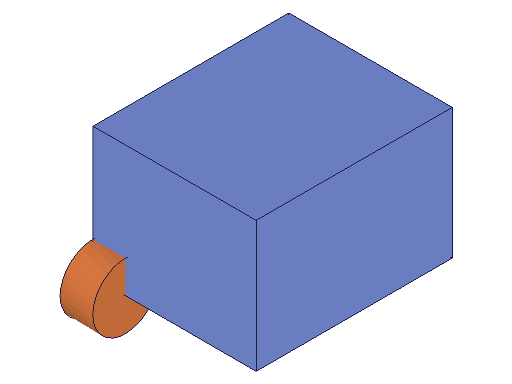
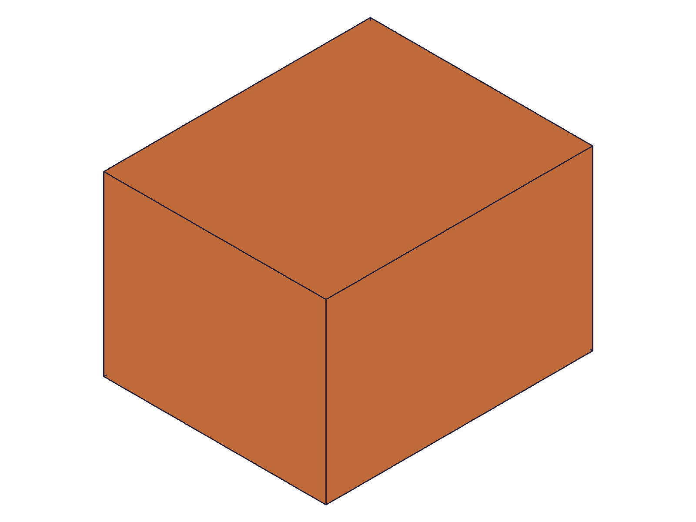
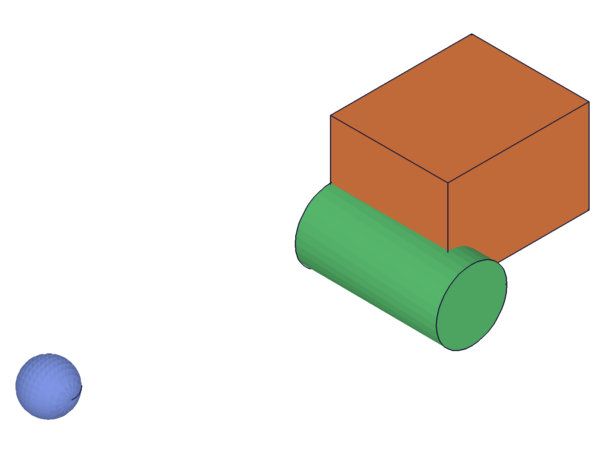

# Training: part.translation

**Date:** 2026-04-20

## Goal

Testing `v1.part.translation`.

**Methods to cover:**

- `translation` — basic translation along a work axis
- `translation` params: id, targets, references, distance, inverted, name
- References: work axis, brep edge, two work points
- Expression-driven distance
- Multiple targets

**Questions:**

- Does this MOVE the body or create a COPY at the translated position?
- What happens with distance=0?
- Does inverted reverse the direction?
- How does this differ from solid.translation (direct)?

---

## 01 — basic translation along work axis

Script: `scripts/01-basic-workaxis.mjs` — ✅ box moved 50mm in +X.

|  |  |
|---|---|

**Data:** tId=156, maxLevel=31. Before: box adjacent to reference cylinder. After: box moved 50mm in +X, clearly separated from the stationary reference cylinder.

**Learned:** `part.translation` is a MOVE operation, not a copy. It translates the targeted features along the reference direction. Non-targeted features remain in place.

📌 LLM doc: translation MOVES bodies, does not copy

## 02 — inverted direction

Script: `scripts/02-inverted.mjs` — ✅ box moved in -X direction.

|  |
|---|

**Data:** tId=156, maxLevel=31. Box (started at x=50) moved in -X direction with inverted=1.

📌 LLM doc: inverted=1 reverses direction

## 03 — expression-driven distance

Script: `scripts/03-expression-distance.mjs` — ✅ expression works for distance.

**Data:** tId=120, maxLevel=31. Box moved by `@expr.offset` (60mm).

📌 LLM doc: distance supports @expr. syntax

## 04 — two work points as direction reference

Script: `scripts/04-two-workpoints.mjs` — ✅ diagonal direction from work points.

**Data:** tId=126, maxLevel=31. Box moved along diagonal defined by WP1→WP2.

📌 LLM doc: two work points define direction

## 05 — multiple targets

Script: `scripts/05-multiple-targets.mjs` — ✅ both box and cylinder moved together.

|  |
|---|

**Data:** tId=176, maxLevel=31. Box (orange) and cylinder (green) both moved 60mm in +X. Reference sphere (blue) stayed in place, confirming only targets move.

📌 LLM doc: multiple targets move together, non-targets stay

## 06 — distance=0

Script: `scripts/06-distance-zero.mjs` — ✅ feature created, nothing moves.

**Data:** result=99, maxLevel=31. Feature created but body stays at original position.

📌 LLM doc: distance=0 valid, no-op

---

## Coverage Checklist

- [x] The API has been called at least once successfully
- [x] Every required parameter tested (id, targets, references)
- [x] Key optional parameters exercised (distance, inverted, name)
- [x] Confirmed this is a MOVE, not copy
- [x] Expression-driven distance
- [x] Two work points as direction
- [x] Multiple targets
- [x] distance=0 edge case
