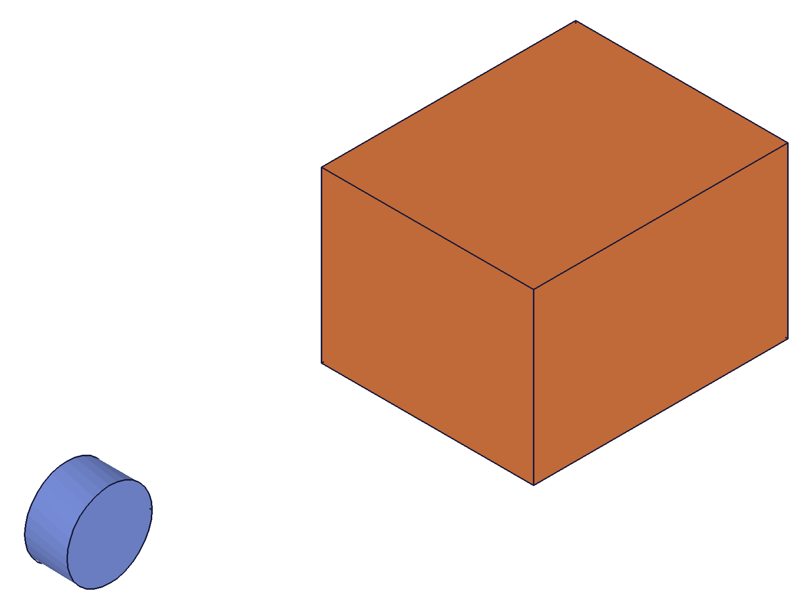
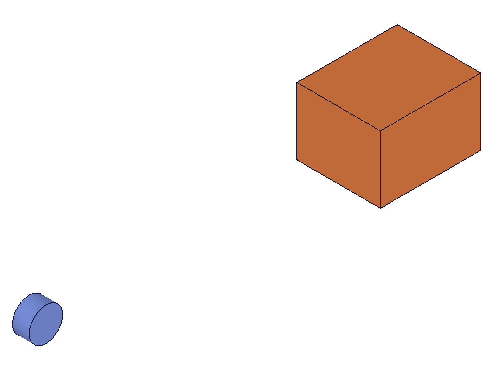
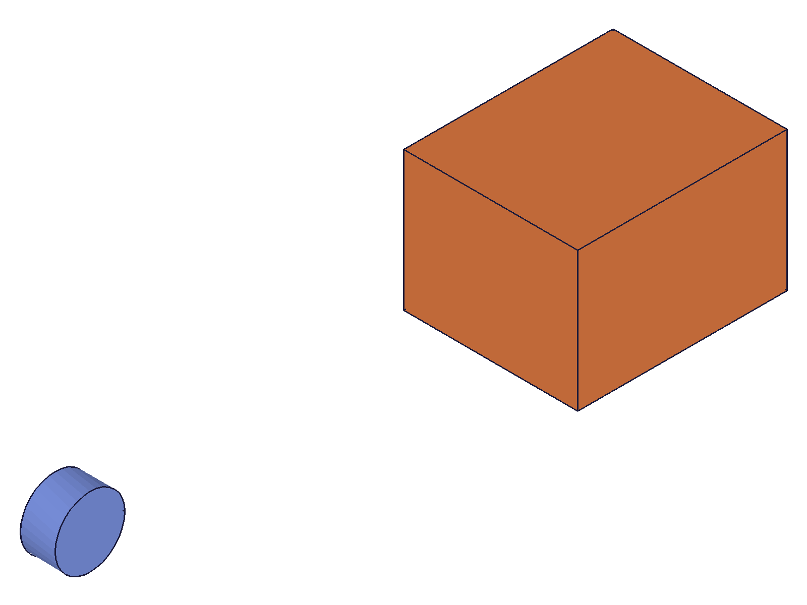
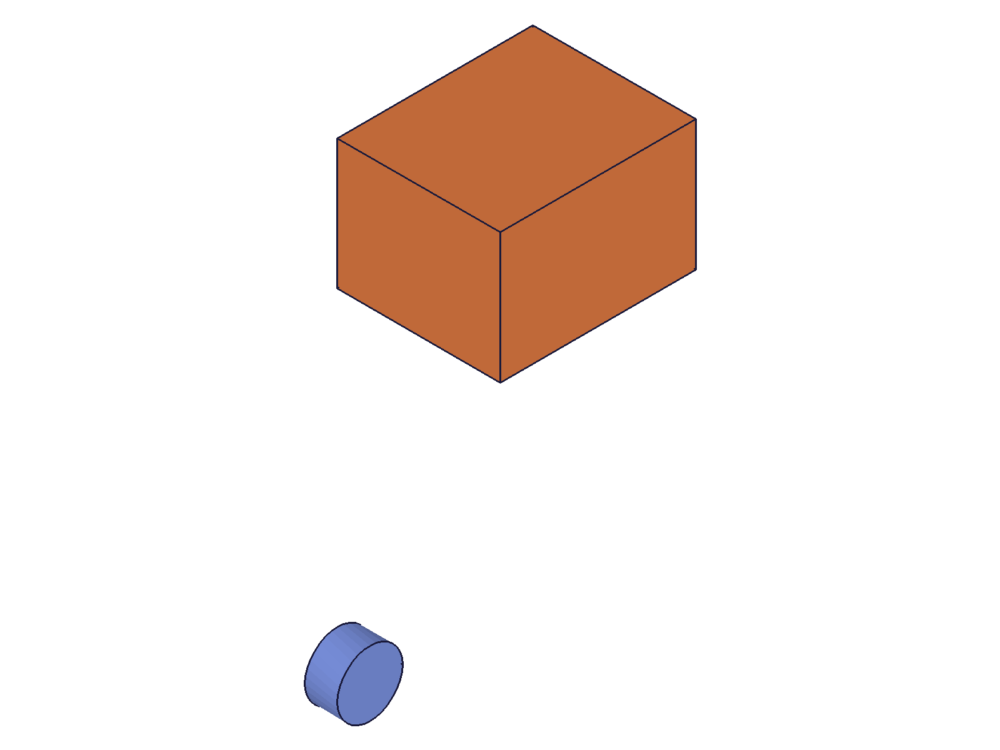

# Training: part.updateTranslation

**Date:** 2026-04-20

## Goal

Testing `v1.part.updateTranslation`.

**Methods to cover:**

- `updateTranslation` — update distance, references, inverted, targets
- Partial updates (only pass changed fields)
- openFeature/closeFeature requirement
- Without openFeature (expected failure)

---

## 01 — update distance

Script: `scripts/01-update-distance.mjs` — ✅ distance updated from 30 to 80.

|  |  |
|---|---|

**Data:** result=118, maxLevel=31. Box moved further from reference cylinder after distance increase.

📌 LLM doc: partial updates work, requires open/close gate

## 02 — update inverted

Script: `scripts/02-update-inverted.mjs` — ✅ direction reversed.

**Data:** result=118, maxLevel=31. Box moved in opposite direction after toggling inverted.

📌 LLM doc: inverted can be toggled

## 03 — without openFeature

Script: `scripts/03-no-open.mjs` — ❌ fails as expected.

**Data:** result=null, maxLevel=51. Code 1200: "The provided feature is not allowed to update. It's not active and open."

📌 LLM doc: requires openFeature gate

## 04 — update references (change direction)

Script: `scripts/04-update-references.mjs` — ✅ direction changed from X to Y.

|  |  |
|---|---|

**Data:** result=126, maxLevel=31. Before: box offset in +X. After: box offset in +Y (different spatial position relative to reference cylinder).

📌 LLM doc: direction can be changed via update

---

## Coverage Checklist

- [x] Partial updates tested (distance, inverted, references)
- [x] openFeature/closeFeature gate verified
- [x] Direction change via references update verified
