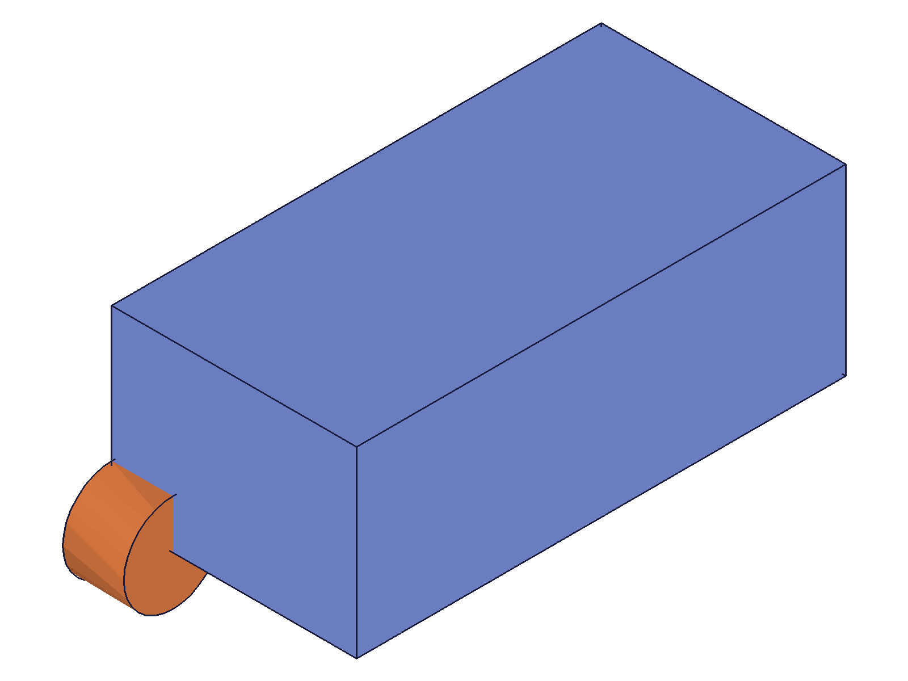
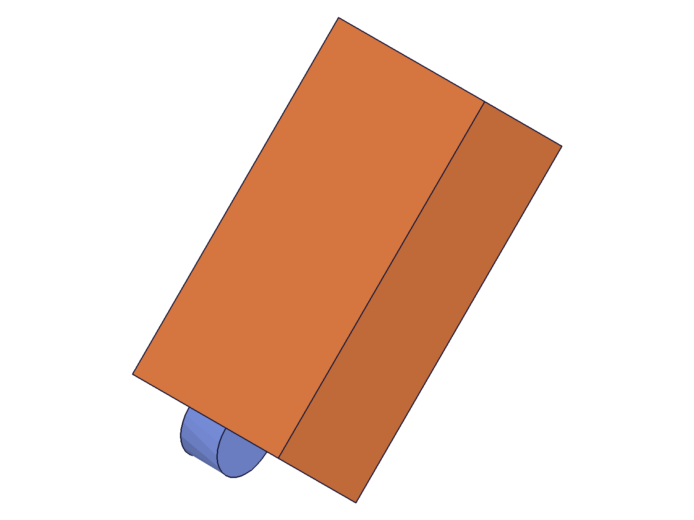

# Training: part.rotation

**Date:** 2026-04-20

## Goal

Testing `v1.part.rotation`.

**Methods to cover:**

- `rotation` — basic rotation around a work axis
- `rotation` params: id, targets, references, angle, inverted, name
- Angle in radians
- References: work axis, two work points
- Multiple targets
- Expression-driven angle

**Questions:**

- Does this ROTATE in-place (like translation moves)?
- What does angle=0 do?
- Does inverted reverse rotation direction?

---

## 01 — basic rotation 45° around Z

Script: `scripts/01-basic-rotation.mjs` — ✅ box rotated 45° CCW around Z axis.

|  |  |
|---|---|

**Data:** rId=156, maxLevel=31. Before: elongated box along +X. After: box rotated 45° CCW, now diagonal. Reference cylinder at origin stays fixed.

**Learned:** `part.rotation` rotates targeted features in-place around the reference axis. Like `part.translation`, this is a MOVE, not a copy. Non-targeted features remain stationary.

📌 LLM doc: rotation moves bodies in-place, not a copy

## 02 — inverted rotation

Script: `scripts/02-inverted.mjs` — ✅ rotated CW instead of CCW.

**Data:** rId=118, maxLevel=31. Box rotated in opposite direction (CW) with inverted=1.

📌 LLM doc: inverted=1 reverses rotation direction

## 03 — expression-driven angle

Script: `scripts/03-expression-angle.mjs` — ✅ expression works for angle.

**Data:** rId=120, maxLevel=31. Used `@expr.rotAngle` (C:PI/4 = 45°).

📌 LLM doc: angle supports @expr. syntax

## 04 — 90° rotation

Script: `scripts/04-90deg-rotation.mjs` — ✅ clear 90° rotation visible.

|  |  |
|---|---|

**Data:** rId=156, maxLevel=31. Box originally along +X, now rotated 90° CCW to point along +Y. The tall/narrow appearance from iso view confirms the rotation.

## 05 — multiple targets

Script: `scripts/05-multiple-targets.mjs` — ✅ both box and cylinder rotated together.

**Data:** rId=176, maxLevel=31. Box and cylinder both rotated 90° around Z. Reference sphere stays in place.

📌 LLM doc: multiple targets rotate together

---

## Coverage Checklist

- [x] The API has been called at least once successfully
- [x] Required parameters tested (id, targets, references)
- [x] Key optional parameters exercised (angle, inverted, name)
- [x] Confirmed this is a MOVE/rotate, not copy
- [x] Expression-driven angle
- [x] Multiple targets
- [x] Rotation direction (CCW default, CW with inverted=1)
