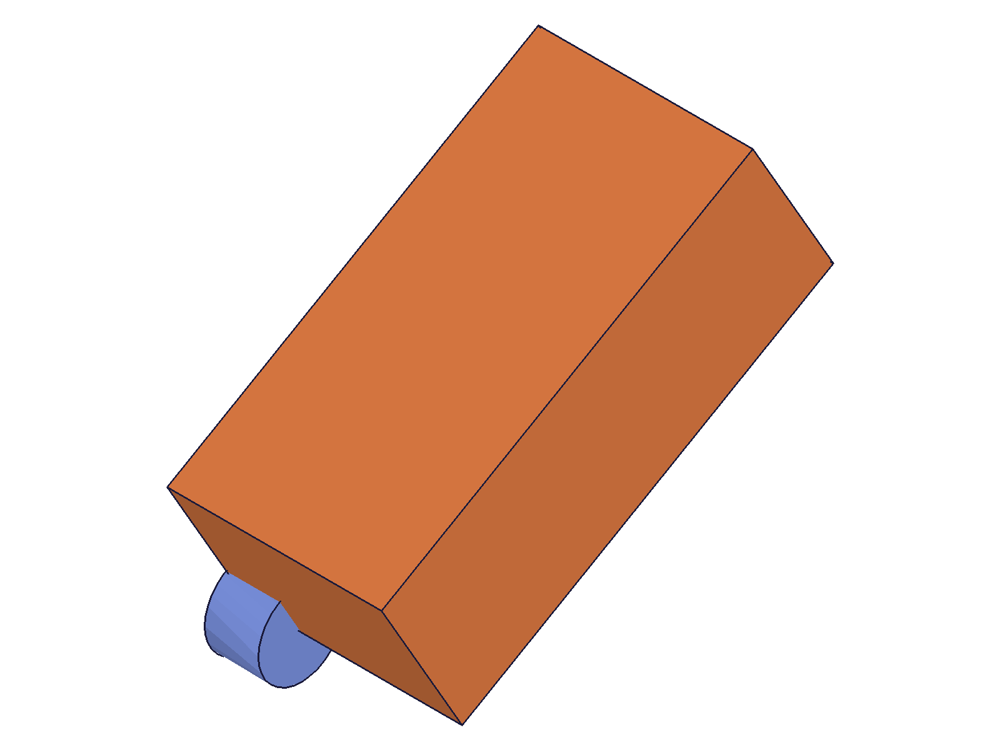
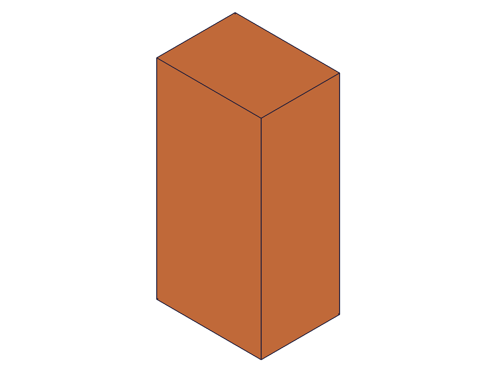
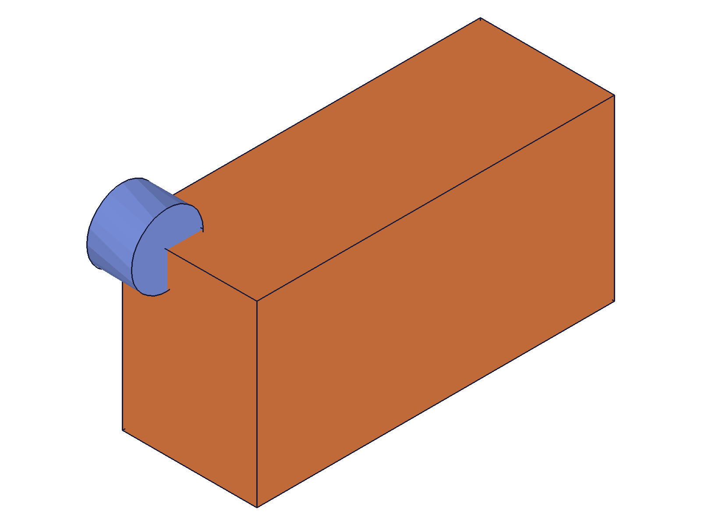

# Training: part.updateRotation

**Date:** 2026-04-20

## Goal

Testing `v1.part.updateRotation`.

---

## 01 — update angle

Script: `scripts/01-update-angle.mjs` — ✅ angle updated from 30° to 90°.

|  |  |
|---|---|

**Data:** result=118, maxLevel=31. Box rotated more after angle increase.

📌 LLM doc: partial updates work, requires open/close gate

## 02 — without openFeature

Script: `scripts/02-no-open.mjs` — ❌ fails as expected.

**Data:** result=null, maxLevel=51. Code 1200: "The provided feature is not allowed to update."

## 03 — update references (change axis)

Script: `scripts/03-update-axis.mjs` — ✅ rotation axis changed from Z to X.

|  |  |
|---|---|

**Data:** result=126, maxLevel=31. Completely different orientation after axis change.

📌 LLM doc: axis can be changed via update

---

## Coverage Checklist

- [x] Partial updates tested (angle, references)
- [x] openFeature/closeFeature gate verified
- [x] Axis change via references update verified
