# Training: part.transformationByCSys

**Date:** 2026-04-20

## Goal

Testing `v1.part.transformationByCSys` and `v1.part.updateTransformationByCSys`.

**Methods to cover:**

- `transformationByCSys` — basic usage with two WCS references
- `transformationByCSys` params: id, name, targets (flat + object w/ indices), references [to, from]
- `updateTransformationByCSys` — change targets, change references, change name

**Questions:**

- How does the "from"/"to" WCS ordering work? (references[0] = "to", references[1] = "from")
- What happens with identity transform (same WCS for from and to)?
- Can the targets include multiple features?
- Does it work with object-style targets (with indices)?
- What does the transformation actually do — move the solid to the "to" WCS location?
- What errors occur if references are invalid or missing?

---

## 01 — basic transform (translation via WCS offset)

Script: `scripts/01-basic-transform.mjs` — ✅ Box moved from origin to [60,40,30] via two WCS with different offsets.

|  | 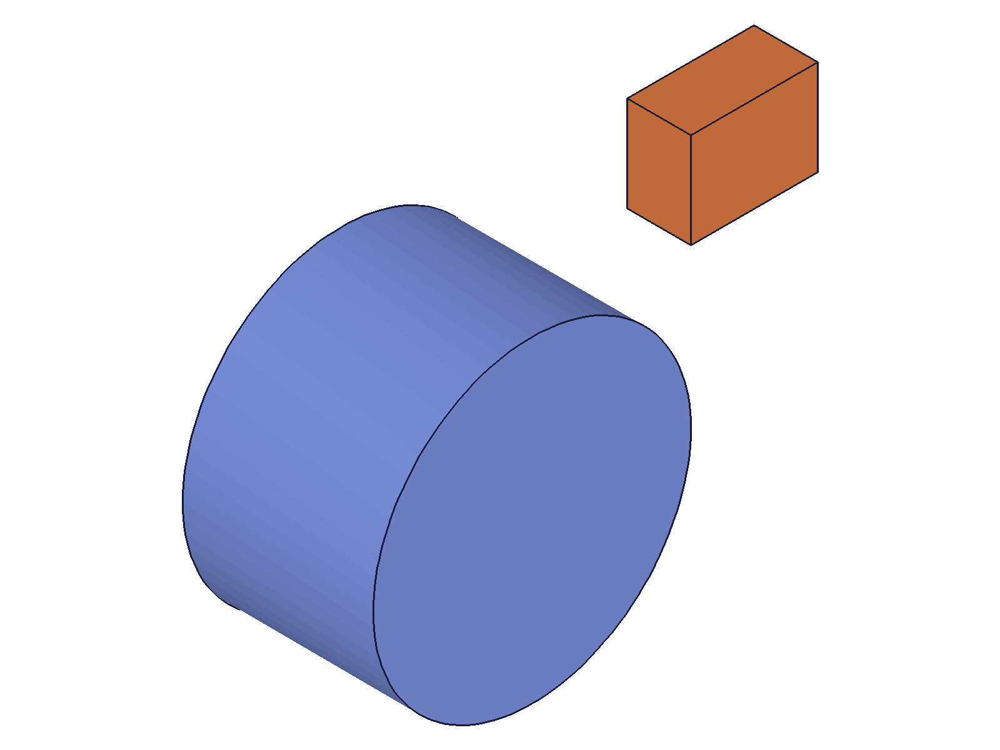 |
|---|---|

**Data:** result=164, maxLevel=31. Box visually displaced to upper-right, reference cylinder stayed in place.

**Learned:** `references[0]` = "to" WCS, `references[1]` = "from" WCS. The transformation computes the matrix between the two coordinate systems and applies it to the target bodies.

📌 LLM doc: Core mechanics — references order is [to, from], returns feature ID.

## 02 — identity transform

Script: `scripts/02-identity-transform.mjs` — ✅ Identity transform (both WCS at origin) creates the feature but body stays in place.

| 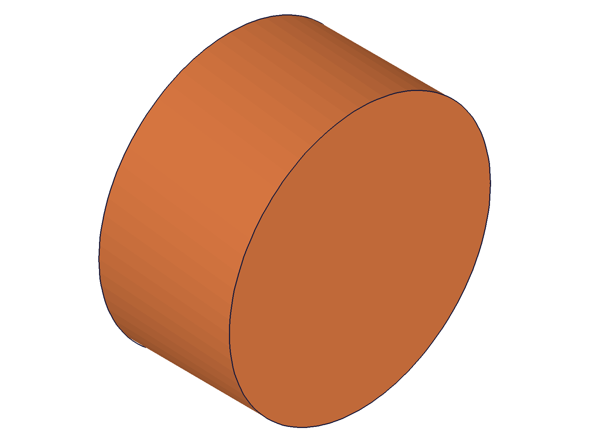 | 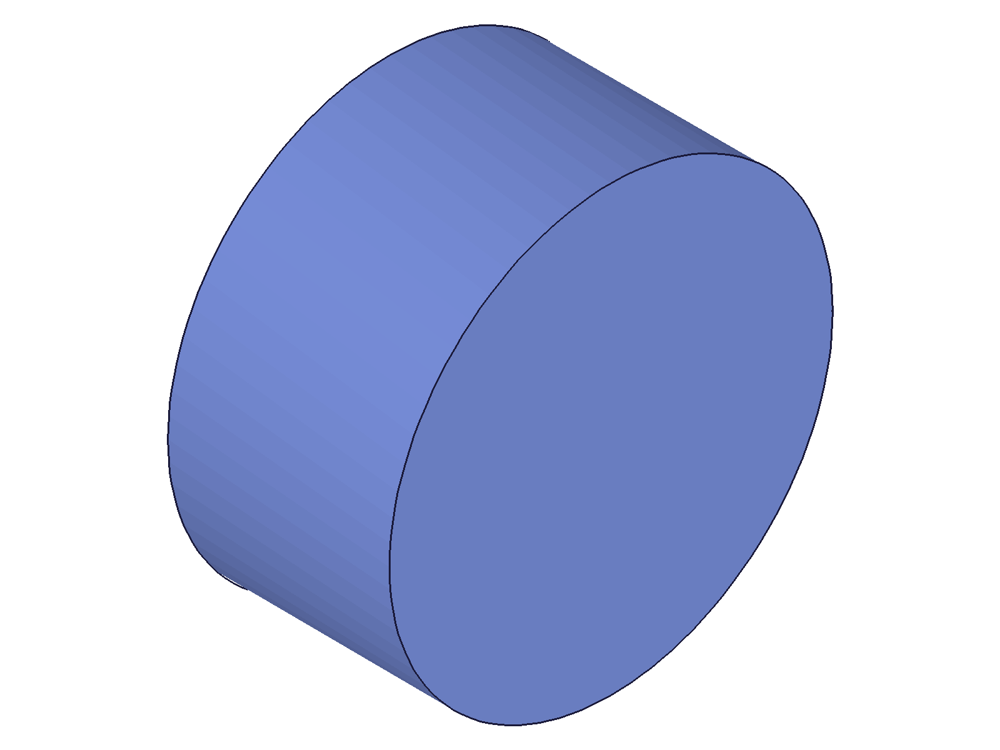 |
|---|---|

**Data:** result=164, maxLevel=31. Before/after visually identical (expected — no transform delta).

**Learned:** Same-position WCS pair = identity transform. Feature is created successfully but geometry doesn't move. Valid use case for placeholder features.

## 03 — rotation via WCS

Script: `scripts/03-rotation-via-wcs.mjs` — ✅ Box rotated 90° around Z by using a WCS with Z-rotation.

|  | 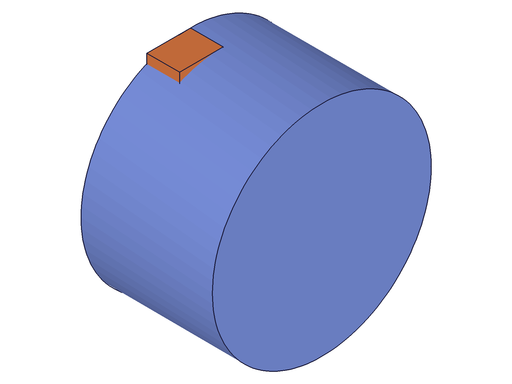 |
|---|---|

**Data:** result=164, maxLevel=31. After snapshot shows box clearly rotated — the long axis that was along X now points along Y.

**Learned:** WCS rotation drives the transformation rotation. The from-WCS had no rotation, the to-WCS had π/2 Z rotation → body rotated 90° around Z.

📌 LLM doc: WCS rotation produces body rotation — no separate angle parameter needed.

## 04 — multiple targets

Script: `scripts/04-multiple-targets.mjs` — ✅ Both boxes moved together, reference cylinder stayed fixed.

| 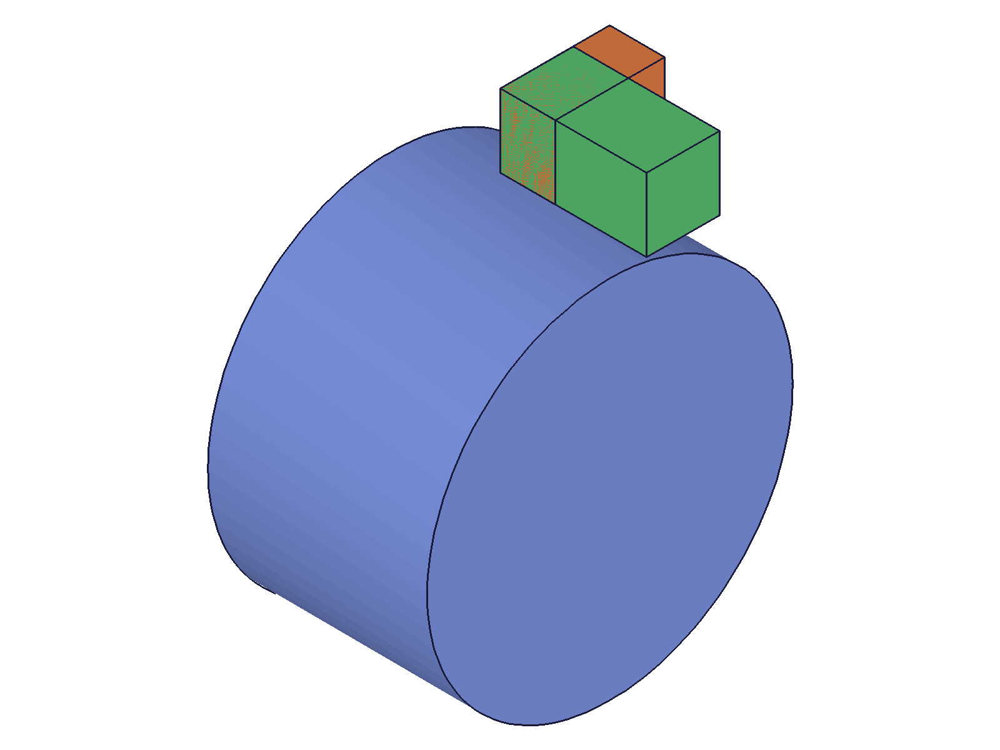 |
|---|

**Data:** result=228, maxLevel=31. Both boxes (green + orange) visible at offset position above the cylinder.

**Learned:** Multiple targets in the array are transformed together as a group, maintaining relative positions.

## 05 — combined translation + rotation

Script: `scripts/05-combined-translate-rotate.mjs` — ✅ Box both translated and rotated 45° via WCS with offset + rotation.

| 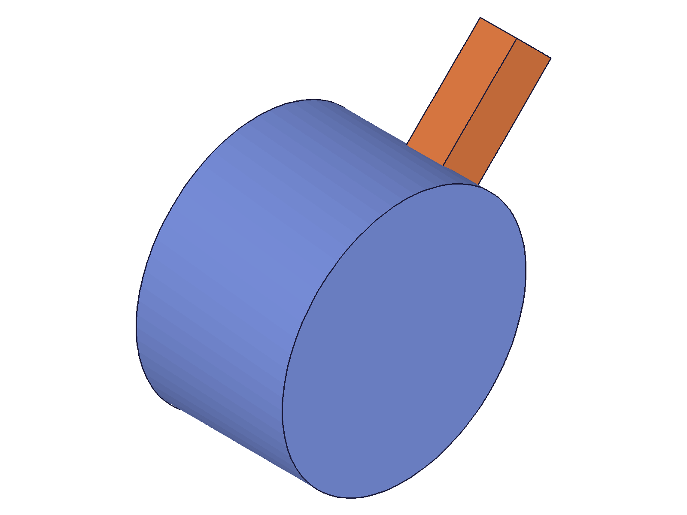 |
|---|

**Data:** result=164, maxLevel=31. Box is visibly displaced and rotated at an angle relative to the cylinder.

**Learned:** A WCS with both offset and rotation produces a combined translation+rotation transform in a single feature.

📌 LLM doc: Combined transforms via WCS offset+rotation.

## 06 — object-style targets with indices

Script: `scripts/06-object-targets-indices.mjs` — ✅ Works with `[{ id: boxId, indices: [0] }]` format.

| 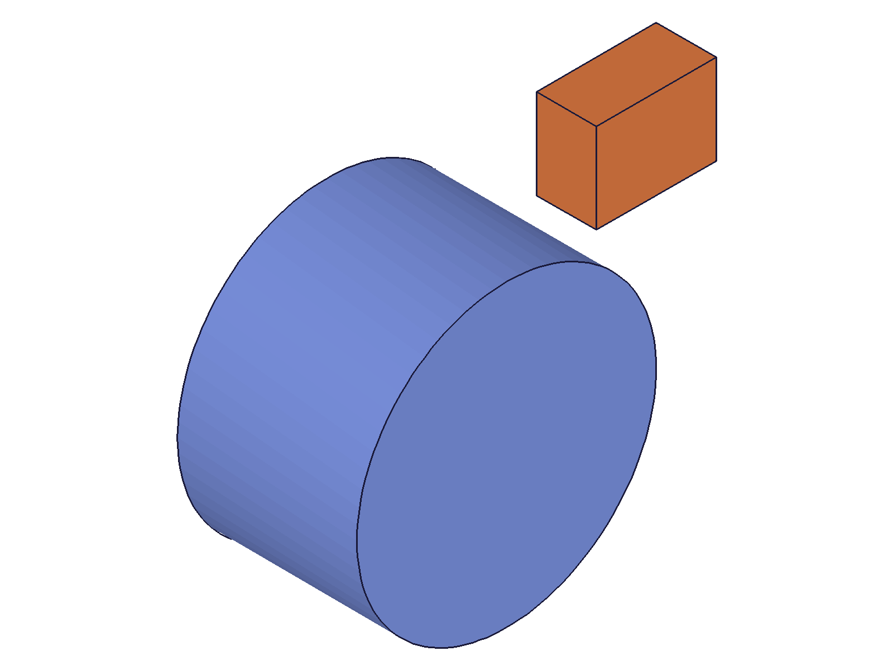 |
|---|

**Data:** result=164, maxLevel=31. Box moved to offset position, same as flat-ID variant.

**Learned:** Object-style targets with indices work. Indices select which solids of a multi-solid feature to transform.

## 07 — reversed references order

Script: `scripts/07-reversed-references.mjs` — ✅ Box at [60,40,30] moved back toward origin by swapping from/to.

| 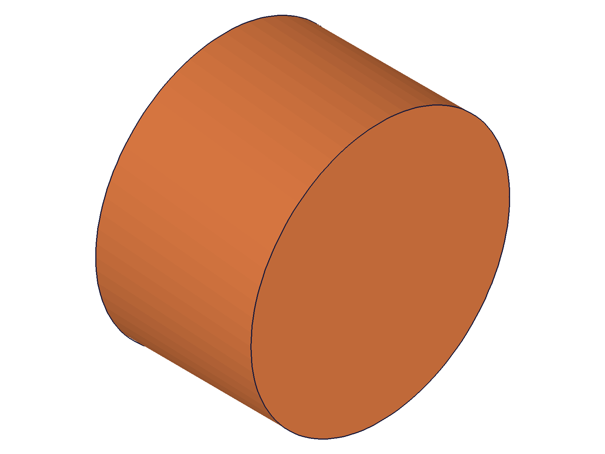 | 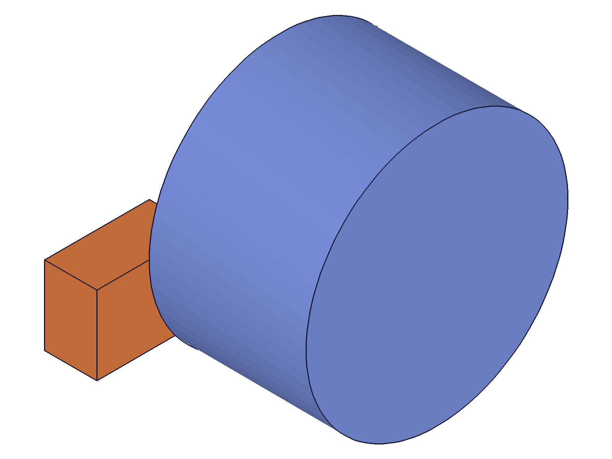 |
|---|---|

**Data:** result=164, maxLevel=31. Box position changed relative to the fixed cylinder.

**Learned:** Swapping the from/to WCS reverses the transform direction. `[wcsB, wcsA]` moves body from A-space to B-space.

## 08–09 — update without openFeature (error)

Scripts: `scripts/08-update-references.mjs`, `scripts/09-update-targets.mjs` — ❌ Both failed with maxLevel=51.

**Data:** Error code 1200: "The provided feature is not allowed to update. It's not active and open."

**Learned:** `updateTransformationByCSys` requires `openFeature` / `closeFeature` wrapping, same as all parametric feature updates.

📌 LLM doc: Critical gotcha — update requires openFeature/closeFeature.

## 10 — update references (with openFeature)

Script: `scripts/10-update-refs-proper.mjs` — ✅ Changed "to" WCS from [50,0,0] to [0,50,40].

| 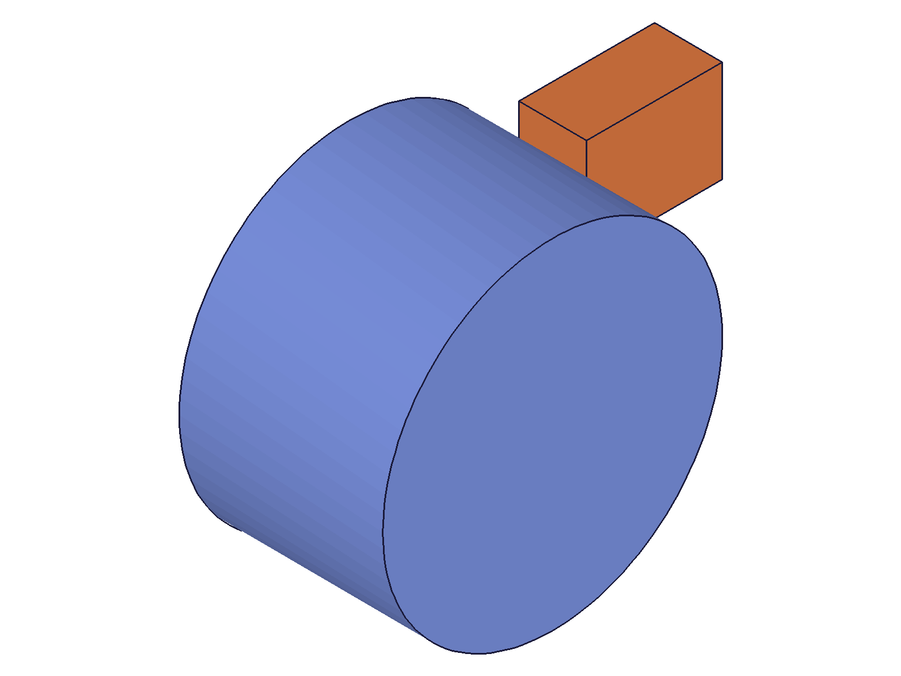 | 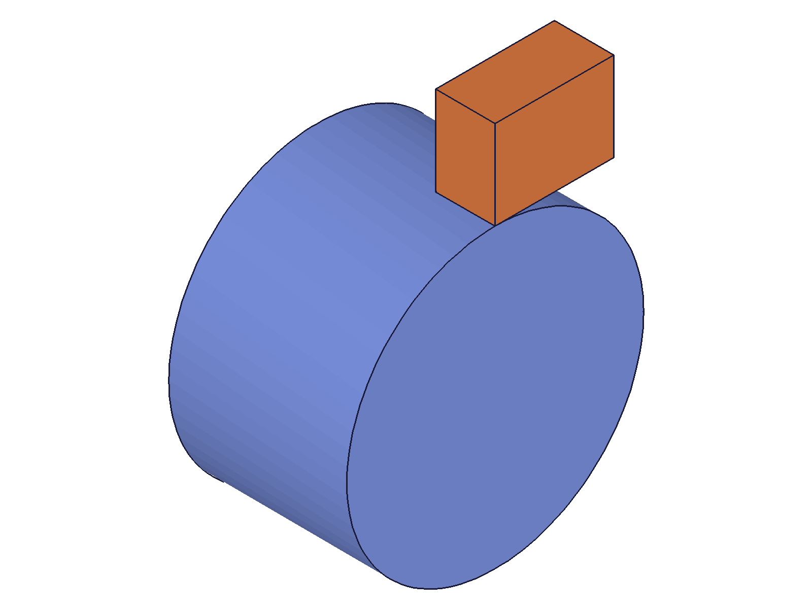 |
|---|---|

**Data:** update result=134 (same feature ID), maxLevel=31. Box position clearly changed between initial and updated snapshots.

**Learned:** Update references works correctly with openFeature. Returns same feature ID.

## 11 — update targets (with openFeature)

Script: `scripts/11-update-targets-proper.mjs` — ✅ Changed target from box1 to box2.

| 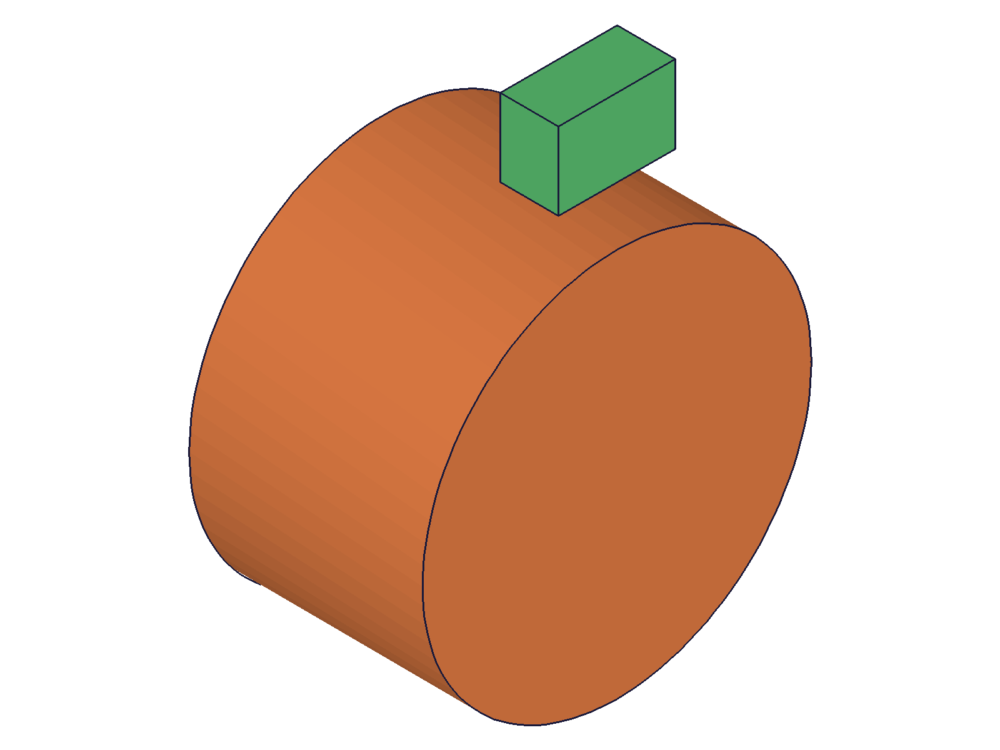 | 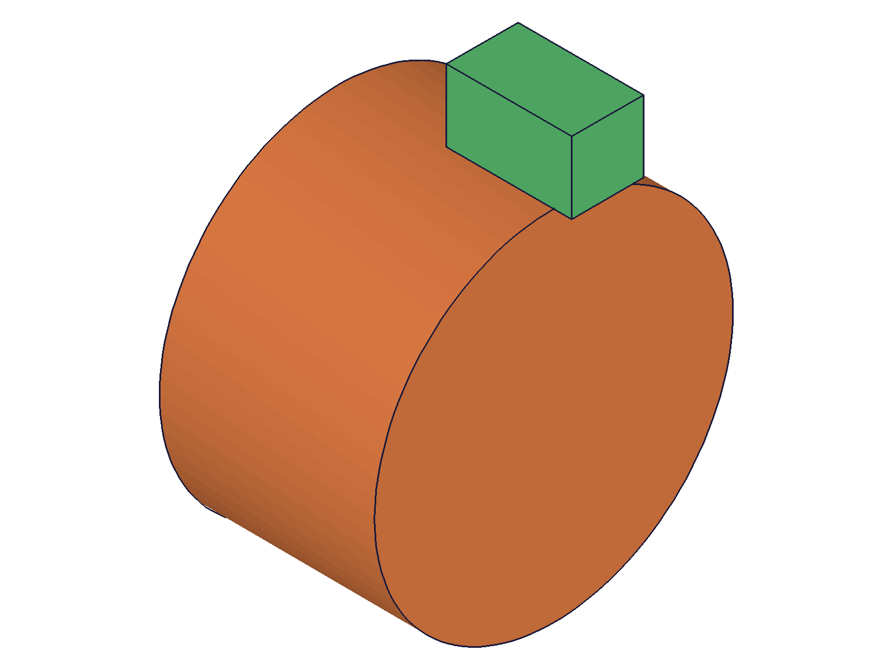 |
|---|---|

**Data:** update result=163 (same feature ID), maxLevel=31. Initial: small box1 moved. Updated: larger box2 moved to same position instead. Box1 returned to original position.

**Learned:** Changing targets swaps which feature gets transformed. Previous target reverts to its pre-transform position.

📌 LLM doc: Update can change both targets and references.

## 12 — update name

Script: `scripts/12-update-name.mjs` — ✅ Renamed feature from "OriginalName" to "RenamedTransform".

**Data:** update result=107, maxLevel=31. Name update succeeded. `getObjectName` doesn't exist in the API (script error), but the update itself returned successfully.

## 13 — error cases

Script: `scripts/13-error-single-ref.mjs` — Three error tests:

1. **Single reference:** maxLevel=51, code 1002 — "references has invalid number of elements! There should be 2 element(s)"
2. **Empty references:** maxLevel=51, code 1002 — same error
3. **Empty targets:** maxLevel=51, code 1004 — "The type '0' is not supported in PrepareAPIParams"

**Learned:** Exactly 2 references required. Empty targets array gives a confusing type error rather than a clear "no targets" message.

📌 LLM doc: Error messages — references must be exactly 2, empty targets gives unhelpful error.

## 14 — X-axis rotation via WCS

Script: `scripts/14-wcs-with-rotation-axes.mjs` — ✅ Box rotated 45° around X axis.

**Data:** result=164, maxLevel=31. Snapshot shows only cylinder (box rotated out of visible plane / behind cylinder in isometric view).

**Learned:** Rotation around any axis works via WCS rotation parameter `[rx, ry, rz]`.

## 15 — default name

Script: `scripts/15-default-name.mjs` — ✅ Feature created without name parameter.

**Data:** result=107, maxLevel=31. Structure tree shows `name: "TransformationByCSys"`, class `CC_TransformationByCSys`.

**Learned:** Default name is "TransformationByCSys" as documented.

## 16 — XYAXISORIGIN WCS type

Script: `scripts/16-xyaxisorigin-wcs.mjs` — ✅ WCS created via work point references, used for transform.

**Data:** result=212, maxLevel=31. Both XYAXISORIGIN WCS created successfully and used as transform references.

**Learned:** Both WCS types (CUSTOM and XYAXISORIGIN) work as references for transformationByCSys.

## 17 — realistic workflow (broken: WCS created after openFeature)

Script: `scripts/17-realistic-workflow.mjs` — ❌ Update failed because new WCS was created after openFeature.

**Data:** Error code 1001: "An element of parameter 'references' has the wrong type"

**Learned:** Creating a WCS after `openFeature` positions it before the transform in the tree. The newly created WCS is not recognized as a valid reference for the update. All WCS references must exist in the tree BEFORE the transform feature.

📌 LLM doc: Critical gotcha — WCS references for update must exist before the transform feature in the tree.

## 18 — realistic workflow (fixed)

Script: `scripts/18-realistic-fixed.mjs` — ✅ Full workflow: create bracket → transform to mount position → update mount angle.

| 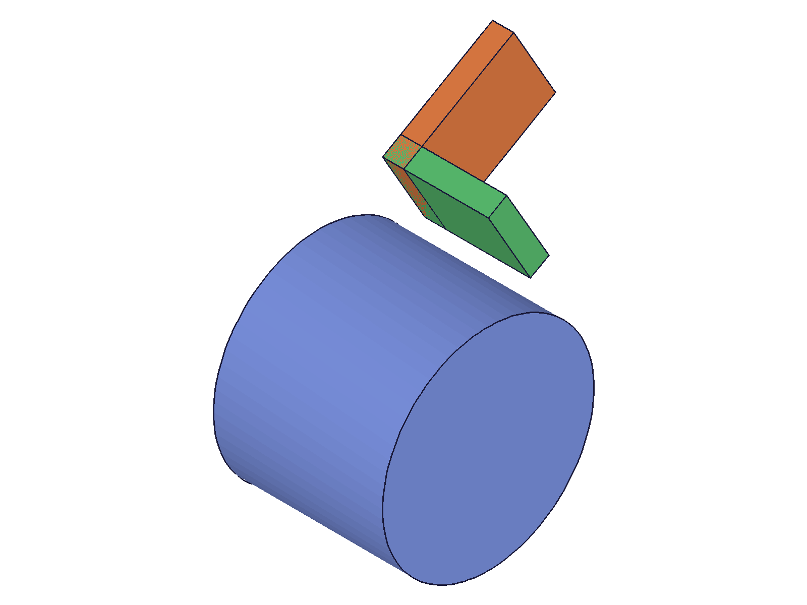 | 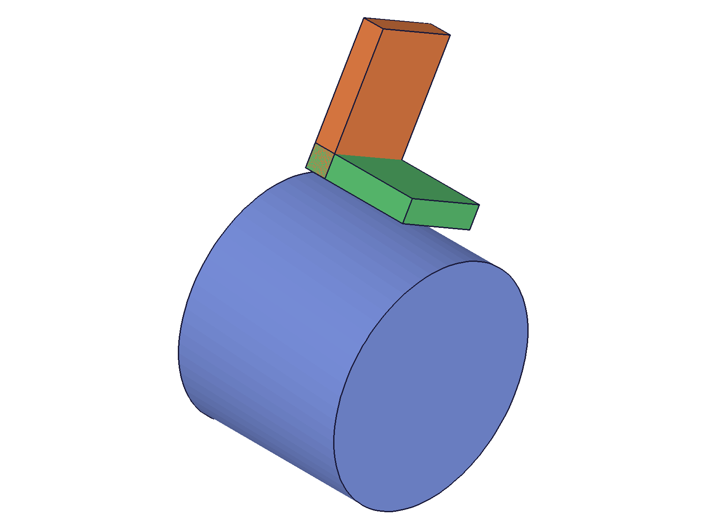 |
|---|---|

**Data:** Initial mount result=236, update result=236, maxLevel=31. Bracket (base green + post orange) visibly rotated more in the adjusted snapshot (π/3 vs π/6). Marker cylinder stayed fixed.

**Learned:** Full create→transform→update workflow works when all WCS are created before the transform feature.
