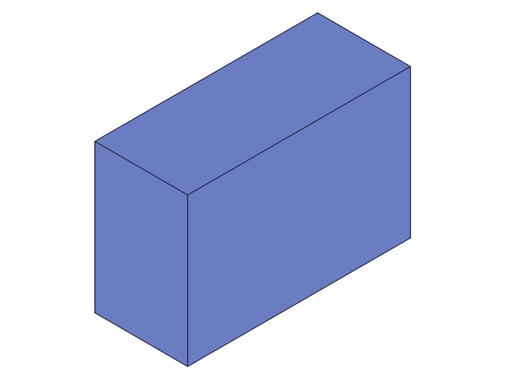
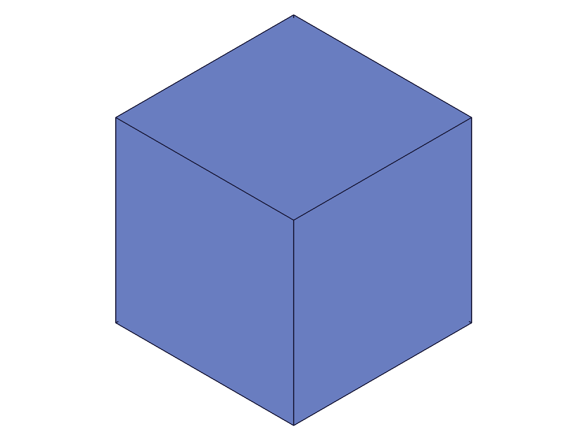
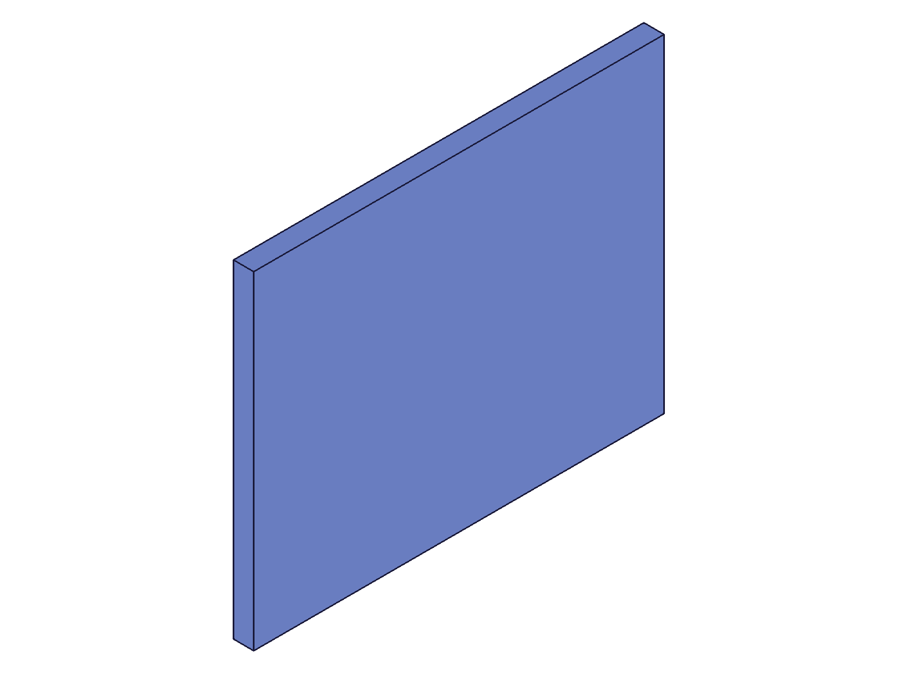
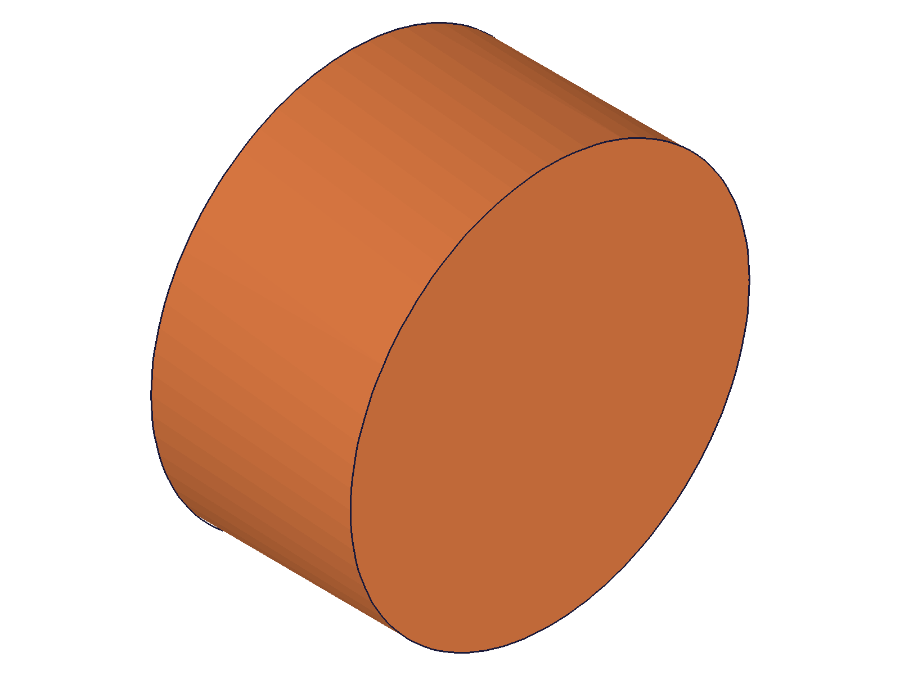

# Training: part.importFeature

**Date:** 2026-04-20

## Goal

Testing `v1.part.importFeature` — imports external model data (STP format) into an existing part.

**Methods to cover:**

- `importFeature` with `data` param (inline STEP string from `common.save`)
- `importFeature` with `file` param (local file path)
- `importFeature` with `data` + `encoding: 'base64'`
- `importFeature` with `data` + `compression: 'deflate'`
- `importFeature` with `data` + both encoding + compression
- `importFeature` params: name (custom vs default)
- Error cases: missing data source, invalid data, wrong format

**Questions:**

- What does the result look like? Feature ID?
- Does the imported geometry appear as a solid in the part?
- Can you import into a part that already has geometry?
- What structure tree entries does import create?
- Does format default to 'STP' or is it required?

---

## 01 — basic data import

Script: `scripts/01-basic-data-import.mjs` — ✅ Box saved as STP string, imported into fresh part.

|  |
|---|

**Data:** result=54 (feature ID), maxLevel=31, messages=[] (empty). STP data string was 9601 chars.

**Learned:** `importFeature` with `data` param creates a CC_Import entity and returns its feature ID. Geometry imports as a solid body.

📌 LLM doc: Basic usage — data param with STP string, returns feature ID.

## 02 — file import

Script: `scripts/02-file-import.mjs` — ✅ Box saved to `/tmp/cc-test-import.stp`, imported via `file` param.

|  |
|---|

**Data:** result=54, maxLevel=31. File import works identically to data import.

## 03 — structure tree inspection (multi-body import)

Script: `scripts/03-structure-inspection.mjs` — ✅ Imported STP containing both a box and a cylinder into a part that already had a box.

|  |
|---|

**Data:** result=91 (CC_Import feature ID). Part ended up with 3 solids (1 existing + 2 imported). The CC_Import entity has child CC_Solid nodes named `MultiBodyImport_0` and `MultiBodyImport_1` — one per body in the STP. Each child solid has `consumed: 0`, `dontClearEntity: 1`, `consumeNeedsCopy: 1`.

**Learned:** Multi-body STP imports create multiple child solids under the CC_Import entity, named `<importName>_N`. Import adds to existing geometry — does not replace.

📌 LLM doc: Multi-body import behavior, child solid naming convention, coexistence with existing geometry.

## 04 — base64 encoding

Script: `scripts/04-base64-encoding.mjs` — ✅ STP saved with base64 encoding, imported with `encoding: 'base64'`.

**Data:** result=54, maxLevel=31. Base64 data was 12796 chars (vs 9601 raw). Import succeeded.

## 05 — deflate compression

Script: `scripts/05-deflate-compression.mjs` — ✅ STP saved with deflate compression, imported with `compression: 'deflate'`.

**Data:** result=54, maxLevel=31. Deflate data was only 286 chars (massive compression from 9601 raw).

📌 LLM doc: Deflate gives ~97% compression on STP strings — highly recommended for data transfer.

## 06 — base64 + deflate combined

Script: `scripts/06-base64-deflate.mjs` — ✅ STP saved with both encoding and compression.

**Data:** result=54, maxLevel=31. Combined data was 2972 chars. Encoding order: compression first, then base64 (per docs: "If compression is also set, the decoding happens first!").

📌 LLM doc: Encoding/compression order — decode base64 first, then decompress. Combined approach works.

## 07 — default name

Script: `scripts/07-default-name.mjs` — ✅ Import without `name` param.

**Data:** result=54, maxLevel=31. Entity class=CC_Import, name="Import". Confirms documented default.

## 08 — error cases

Script: `scripts/08-error-no-data.mjs` — Mixed results:

| Case | Result | MaxLevel | Error |
|---|---|---|---|
| No data/file/url | null | 51 | code 1004: "Either data, file or url must be provided to load content from." |
| Invalid STP data | 60 | 31 | **No error** — feature created |
| Non-existent file | null | 51 | code 1008: "The provided file does not exist." |
| Invalid format string | 74 | 31 | **No error** — feature created |

**Learned:** Missing data source and missing file produce clear errors. But invalid data content and invalid format strings **silently create empty import features** (maxLevel=31, feature ID returned).

📌 LLM doc: Critical gotcha — invalid data/format silently creates empty imports. Always verify part.solids after import.

## 09 — bad data geometry check

Script: `scripts/09-bad-data-geometry.mjs` — ✅ Confirmed invalid data creates CC_Import with no children and no solids.

**Data:** CC_Import entity has `children: undefined`, part solids=[] (empty). Same for invalid format string.

**Learned:** Empty import features are harmless but misleading — they take up space in the feature tree without contributing geometry.

## 10 — format defaults

Script: `scripts/10-format-default.mjs` — ✅ Two tests:

- **Data import without `format` param:** result=54, maxLevel=31, children=[59], solids=[57]. **Works — format defaults to STP.**
- **File import without `format` param:** result=54, maxLevel=31, children=[59]. **Works — format auto-detected from `.stp` extension.**

📌 LLM doc: Format param is optional — defaults to STP for data, auto-detected from extension for files.

## 11 — realistic workflow (base plate + imported bracket)

Script: `scripts/11-realistic-boolean.mjs` — ✅ Created bracket (box + cylinder union), saved as STP, imported into part with base plate.

|  |  |
|---|---|

**Data:** import result=120, maxLevel=31. Part has 2 solids after import (1 plate + 1 imported bracket). The bracket union was preserved as a single solid in STP export/import.

**Learned:** Boolean-unioned bodies export as single solids in STP, and import as single solids. The import is non-destructive — existing geometry stays.

## 12 — multiple sequential imports

Script: `scripts/12-multiple-imports.mjs` — ✅ Two separate imports (box + cylinder) into the same part.

|  |
|---|

**Data:** import1=54 (CC_Import Import1_Box), import2=65 (CC_Import Import2_Cyl). Part has 2 solids. EntitySet contains both CC_Import entities as separate children.

**Learned:** Multiple imports into the same part work. Each creates a separate CC_Import entity in the EntitySet.

---

## Coverage Summary

- [x] Basic successful call (scripts 01, 02)
- [x] Required param `id` tested
- [x] Data sources: `data` (01), `file` (02), `url` (not tested — no URL available)
- [x] Optional params: `name` (01, 07), `encoding` (04), `compression` (05), `format` (10)
- [x] Encoding combinations: base64 (04), deflate (05), both (06)
- [x] Error cases (08, 09)
- [x] Multi-body import (03)
- [x] Multiple imports (12)
- [x] Realistic usage (11)
- [x] Structure tree inspection (03, 09, 12)
- [ ] `updateImportFeature` — separate task #2 in PLAN.md
- [ ] `url` param — no test URL available
