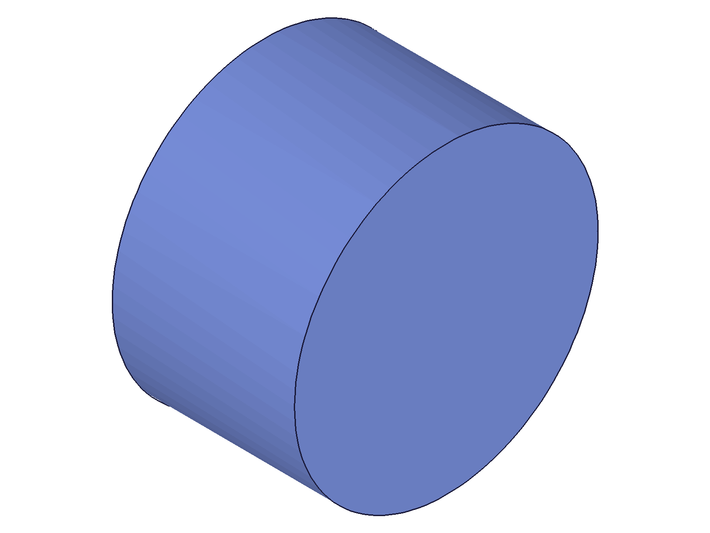
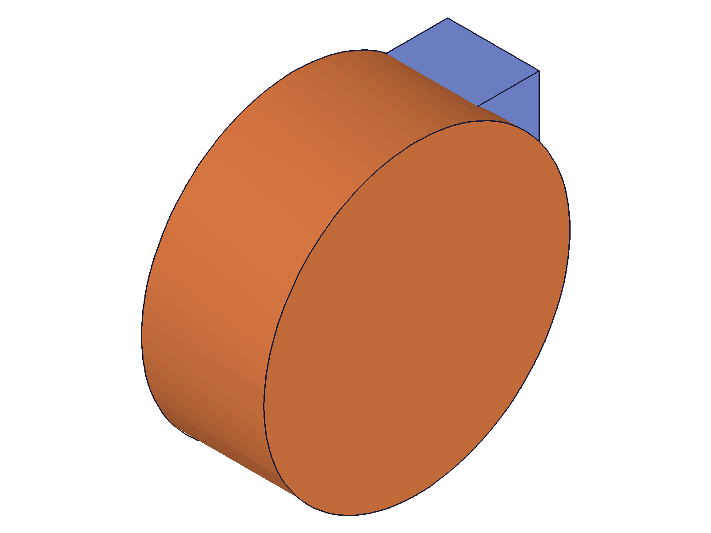
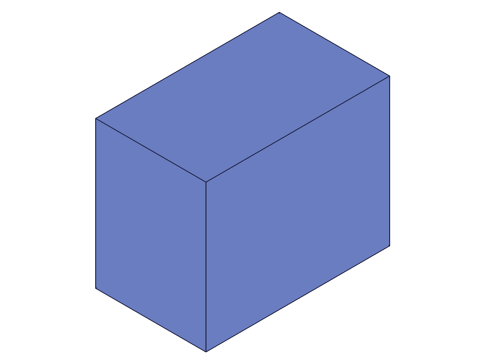
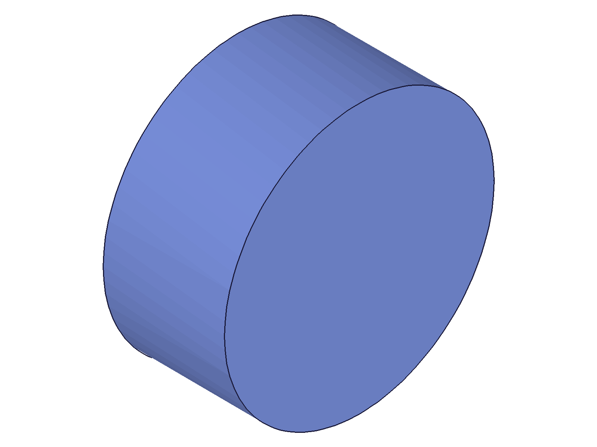

# Training: part.updateImportFeature

**Date:** 2026-04-20

## Goal

Testing `v1.part.updateImportFeature` — updates an existing import feature with new data, name, or source.

**Methods to cover:**

- `updateImportFeature` — rename only (no data change)
- `updateImportFeature` — replace data with new STP content (inline `data` param)
- `updateImportFeature` — replace with data + compression + encoding
- `updateImportFeature` — change to file-based source
- `updateImportFeature` — verify geometry actually updates (vertex count, body count)
- Error cases: wrong ID type, invalid data, missing ID

**Questions:**

- Does updating `data` actually replace the imported geometry?
- Does the number of solids change if the new STP has more/fewer bodies?
- What happens if you pass only `name` — does existing geometry stay?
- What happens if you pass invalid/garbage data to update?
- Is `id` the import feature ID or the part ID?
- What does the return value look like?

---

## 01 — rename without openFeature (fails)

Script: `scripts/01-rename-only.mjs` — ❌ `updateImportFeature` without `openFeature` fails: code 1200 "The provided feature is not allowed to update. It's not active and open."

**Data:** result=null, maxLevel=51, two errors (1200 + 1004).

**Learned:** `updateImportFeature` requires the feature to be opened with `openFeature` first, same as all other `update*` methods.

📌 LLM doc: Requires `openFeature`/`closeFeature` wrapping.

## 02 — rename with openFeature (still fails)

Script: `scripts/02-open-then-rename.mjs` — ❌ Even with `openFeature`, name-only update fails: code 1004 "Either data, file or url must be provided to load content from."

**Data:** result=null, maxLevel=51.

**Learned:** Despite docs saying "optional parameters keep existing values," a data source (`data`, `file`, or `url`) is **always required**. Name-only rename without data is not supported.

📌 LLM doc: Data source is mandatory (contradicts docs that suggest it's optional).

## 03 — replace data (box → cylinder)

Script: `scripts/03-update-with-data.mjs` — ✅ Box STP replaced with cylinder STP via `openFeature` → `updateImportFeature` → `closeFeature`.

|  |  |
|---|---|

**Data:** result=54 (same feature ID), maxLevel=31. Geometry changed from box to cylinder (confirmed visually and by structure tree).

**Learned:** The update replaces the geometry entirely. The feature ID stays the same.

📌 LLM doc: Core usage pattern — open, update, close. Returns same feature ID.

## 04 — multi-body to single-body

Script: `scripts/04-multi-to-single.mjs` — ✅ Import with 2 solids (box+cylinder) updated to single-body STP (small box).

|  |  |
|---|---|

**Data:** Solids before: 2, after: 1. Feature ID unchanged (54), maxLevel=31.

**Learned:** Body count adjusts dynamically. Old child solids are removed, new ones created.

## 05 — compressed update (deflate + base64)

Script: `scripts/05-compressed-update.mjs` — ✅ Update with STP data using `compression: 'deflate'` + `encoding: 'base64'` works.

**Data:** result=54, maxLevel=31. Compressed data was 2656 chars vs 7670 raw.

## 07 — single to multi-body

Script: `scripts/07-single-to-multi.mjs` — ✅ Single-body import updated to 3-body STP (box + 2 cylinders).

**Data:** Solids before: 1, after: 3. Feature ID unchanged (54), maxLevel=31.

**Learned:** Update handles body count changes in both directions (up and down).

## 10 — name preservation behavior

Script: `scripts/10-name-check-fixed.mjs` — Mixed results for name handling.

**Data:**
- Name before: `MyCustomName`
- Name after data-only update (no `name` param): `MyCustomName` — **preserved** ✅
- Name after name+data update: `NewName` — **updated** ✅
- Name-only update (no data): returns null, maxLevel=51 — **errors** but name still changes to `OnlyName`!

**Learned:** Name is preserved when omitted from data updates. Name changes work when provided alongside data. Name-only updates error (data required) but **the name change is still applied** — a partial-success bug.

📌 LLM doc: Name preservation, partial-success bug on name-only update.

## 11 — garbage data update (destructive!)

Script: `scripts/11-garbage-data-update.mjs` — ⚠️ Garbage data silently replaces valid geometry with nothing.

**Data:** result=54, maxLevel=31 (reported success!). Solids before: 1, after: 0.

**Learned:** Unlike `importFeature` where garbage just creates an empty import, `updateImportFeature` with garbage **destroys existing geometry** silently. No error, no warning. This is worse than `importFeature` because valid geometry is lost.

📌 LLM doc: CRITICAL — garbage data destroys existing geometry silently.

## 06 — error cases

Script: `scripts/06-error-cases.mjs` — Testing wrong IDs, garbage data, bad file paths.

**Data:**
- Wrong ID (part ID instead of import feature ID): null, maxLevel=51, code 1007 "not a feature or work geometry id"
- Garbage inline data: result=54, maxLevel=31 — **silent success** (see entry 11 for consequences)
- Non-existent file: null, maxLevel=51, code 1008 "The provided file does not exist"

## 12 — file-based update

Script: `scripts/12-file-update.mjs` — ✅ Box import updated via `file` param pointing to saved cylinder STP.

|  |  |
|---|---|

**Data:** result=54, maxLevel=31. Geometry changed from box to cylinder.

**Learned:** File-based updates work the same as inline data updates.

---

## Coverage Checklist

- [x] API called successfully (script 03)
- [x] Required parameter (`id`) tested
- [x] Key optional parameters exercised (name, data, file, format, compression, encoding)
- [x] openFeature/closeFeature requirement documented
- [x] Multi-body transitions tested (both directions)
- [x] Error cases tested (wrong ID, garbage data, bad file path, name-only)
- [x] Realistic usage (box→cylinder replacement with compressed data)
- [x] Behavioral claims verified with data AND visual evidence
