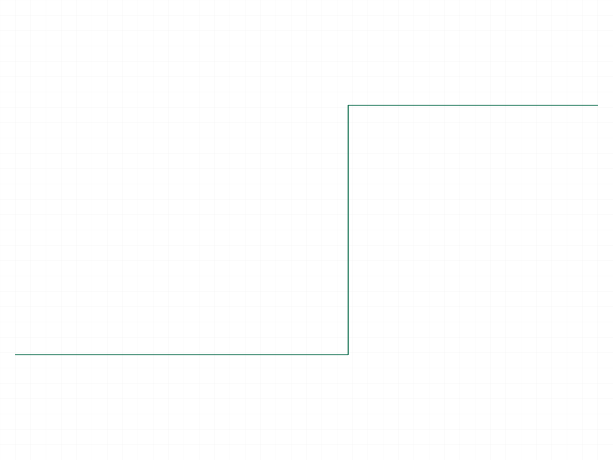
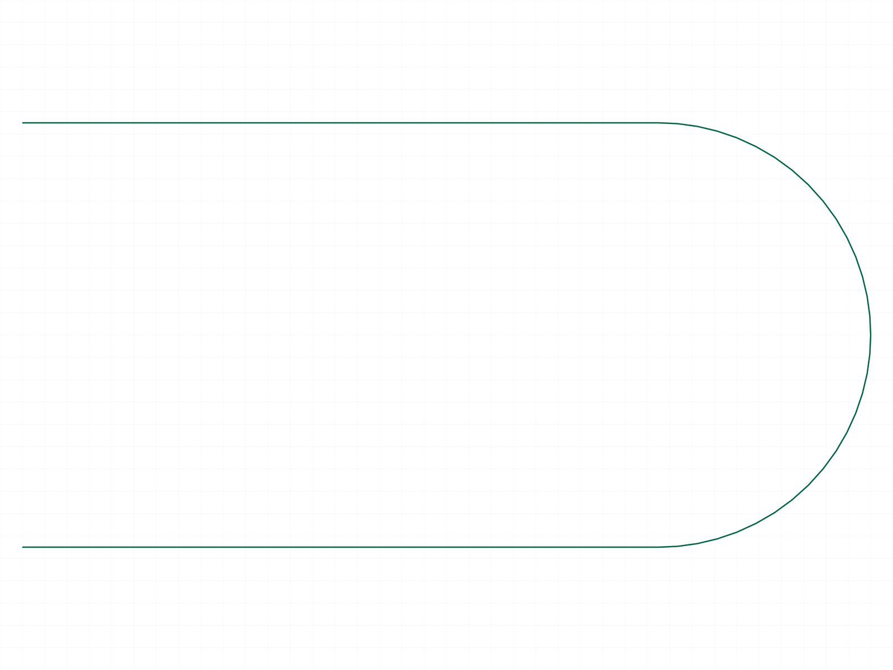
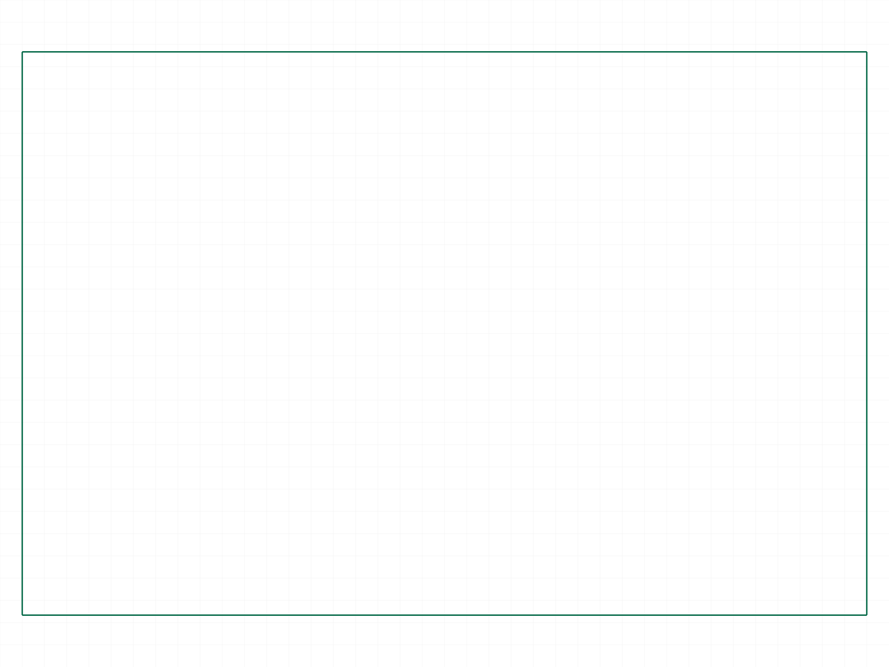

# Training: part.compositeCurve

**Date:** 2026-04-20

## Goal

Testing `v1.part.compositeCurve` and `v1.part.updateCompositeCurve`.

**Methods to cover:**

- `compositeCurve` — create from sketch curves (sketch-curve IDs)
- `compositeCurve` — create from brep edges (brep-edge IDs)
- `compositeCurve` params: id, name, references
- `updateCompositeCurve` — change references after creation

**Questions:**

- What types of references work? (sketch curves, brep edges, mix?)
- What is the composite curve used for downstream? (sweep paths, guide curves?)
- Does the order of references matter?
- What happens with non-contiguous curves?
- What does the returned feature ID represent in the feature tree?

---

## 01 — basic composite from sketch curves

Script: `scripts/01-basic-from-sketch.mjs` — ✅ Two connected sketch lines form an L-shape composite curve. Result: feature ID 76, maxLevel 31.

**Data:** `files/01-basic-from-sketch-cc-response.json` — `result: 76`, empty messages, maxLevel 31.

|  |
|---|

**📌 LLM doc:** Basic usage — pass sketch-curve IDs as references. Returns feature ID.

## 02 — composite from brep edges

Script: `scripts/02-from-brep-edges.mjs` — ✅ Two brep edge IDs from a box (top-front and top-right edges). Result: feature ID 91, maxLevel 31.

**Data:** `files/02-from-brep-edges-cc-brep-response.json` — `result: 91`, empty messages. Edge IDs found via `getGeometryIds` with `lines[].pos`.

|  |
|---|

**📌 LLM doc:** Brep edges work as references. Use `getGeometryIds` to find edge IDs.

## 03 — non-contiguous curves

Script: `scripts/03-non-contiguous.mjs` — ✅ Two sketch lines with a gap between them (line1: [0,0]-[30,0], line2: [50,20]-[80,20]). Result: feature ID 74, maxLevel 31.

**Data:** `files/03-non-contiguous-cc-gap-response.json` — no error. Non-contiguous curves are accepted without warning.

**📌 LLM doc:** Non-contiguous curves are accepted — no error or warning.

## 04 — default name and structure tree

Script: `scripts/04-default-name-and-structure.mjs` — ✅ Created composite curve without `name` param. Default name is `"CompositeCurve"`. Feature class: `CC_CompositeCurve`, parent is the part's feature list (ID 16).

**Data:** Structure tree (`files/04-default-name-and-structure-structure.json`) shows feature 84 with `name: "CompositeCurve"`, `class: "CC_CompositeCurve"`. The `references` member stores sketch-curve IDs as an array of `{value, type: "id"}` objects.

**📌 LLM doc:** Default name is "CompositeCurve". Feature class is CC_CompositeCurve.

## 05 — single curve reference

Script: `scripts/05-single-curve.mjs` — ✅ Single sketch line as the only reference. Result: feature ID 66, maxLevel 31.

**Data:** `files/05-single-curve-cc-single-response.json` — works fine with a single curve.

## 06 — updateCompositeCurve (add third line)

Script: `scripts/06-update-composite-curve.mjs` — ✅ Created with 2 lines, then updated to 3 lines using open→update→close pattern. Returns same feature ID (84), maxLevel 31.

**Data:** `files/06-update-composite-curve-update-response.json` — `result: 84`.

|  |  |
|---|---|

Before shows L-shape (2 lines), after shows staircase (3 lines). Update confirmed visually and by data.

**📌 LLM doc:** `updateCompositeCurve` requires open→update→close. Returns feature ID.

## 07 — update name only

Script: `scripts/07-update-name.mjs` — ✅ Renamed from "OldName" to "NewName" using update with only `name` param. Confirmed via structure tree: feature 76 has `name: "NewName"`.

**Data:** Structure tree (`files/07-update-name-structure-after-rename.json`) confirms the rename.

## 08 — empty references

Script: `scripts/08-empty-references.mjs` — Feature is created (ID 54) but with ERROR maxLevel 51. Message: "There are missing references for CC_Empty (CC_CompositeCurve)." (code 1111).

**Data:** `files/08-empty-references-cc-empty-response.json` — feature created in broken state.

**📌 LLM doc:** Empty references creates a broken feature with error code 1111. Avoid.

## 09 — mixed geometry types (line + arc + line)

Script: `scripts/09-with-arcs.mjs` — ✅ Line → arc → line path. Result: feature ID 85, maxLevel 31.

|  |
|---|

U-shape path visible with the arc connecting two horizontal lines.

**📌 LLM doc:** Arcs work as references alongside lines.

## 10 — update without openFeature

Script: `scripts/10-update-without-open.mjs` — ❌ Update without `openFeature` fails. Result: null, maxLevel 51. Error: "The provided feature is not allowed to update. It's not active and open." (code 1200).

**Data:** `files/10-update-without-open-no-open-response.json` — confirms hard requirement.

**📌 LLM doc:** `openFeature` is mandatory before `updateCompositeCurve`.

## 11 — invalid references

Script: `scripts/11-invalid-reference.mjs` — Two error cases:

1. **Bogus ID (99999):** Result null, maxLevel 51. Error: "An element of parameter 'references' has an invalid id!" (code 1006).
2. **Part ID (wrong type):** Result null, maxLevel 51. Error reveals **accepted types**: `["sketch-curve", "edge-line", "edge-arc", "edge-circle", "edge-nurbs", "face-plane"]` (code 1001).

**Data:** `files/11-invalid-reference-invalid-ref-responses.json`.

**📌 LLM doc:** Accepted reference types list. face-plane is accepted (extracts boundary edges).

## 12 — multiple composite curves / shared references

Script: `scripts/12-multiple-composites.mjs` — ✅ Created 3 composite curves. Two from separate curve subsets, third shares curves with the others. All succeed (maxLevel 31).

**Data:** `files/12-multiple-composites-multi-cc-responses.json` — cc3 with shared refs: result 122, maxLevel 31.

**Learned:** A sketch curve can belong to multiple composite curves simultaneously.

## 13 — face-plane reference (failed — wrong param)

Script: `scripts/13-face-plane-ref.mjs` — Script error due to using `pos` instead of `positions` for `getGeometryIds` planes lookup. See script 14 for fix.

## 14 — face-plane reference (fixed)

Script: `scripts/14-face-plane-ref-fixed.mjs` — ✅ Face-plane reference works! Passing a face ID extracts its boundary loop. Face-only CC (ID 91) succeeded, maxLevel 31.

Mixed edge + face failed: "At least at the position {0,0,30} more than two lines/edges meet each other" (code 1121). This makes sense — face boundary has 4 edges, adding another edge creates an ambiguous junction.

|  |
|---|

Shows rectangle outline — the boundary loop of the box's top face.

**Data:** `files/14-face-plane-ref-fixed-face-responses.json`.

**📌 LLM doc:** Face-plane extracts boundary loop. Mixing edge + face can cause junction ambiguity (code 1121).
