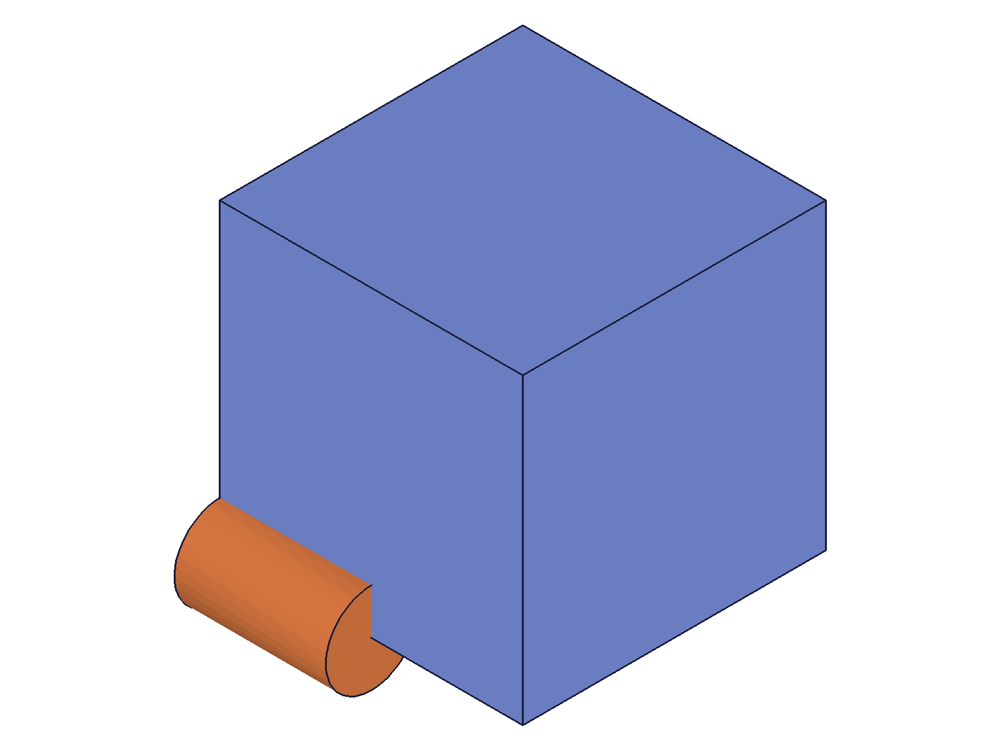
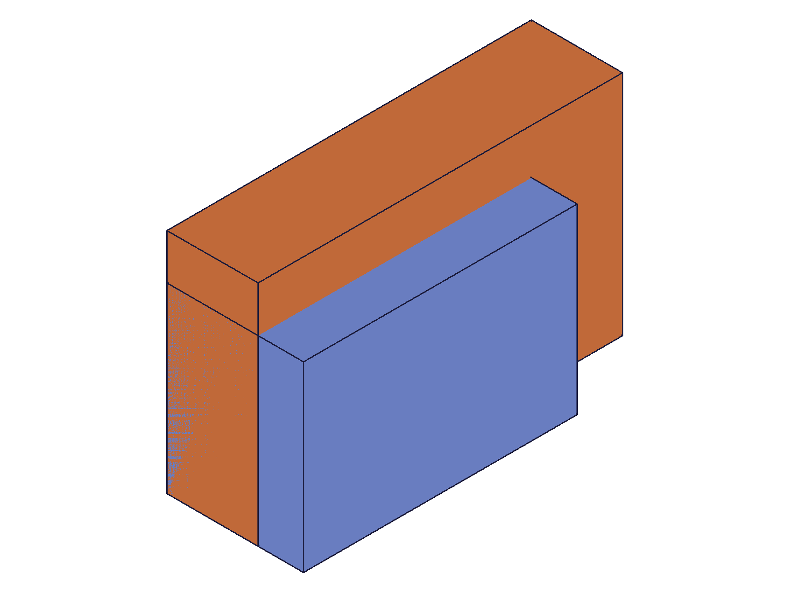
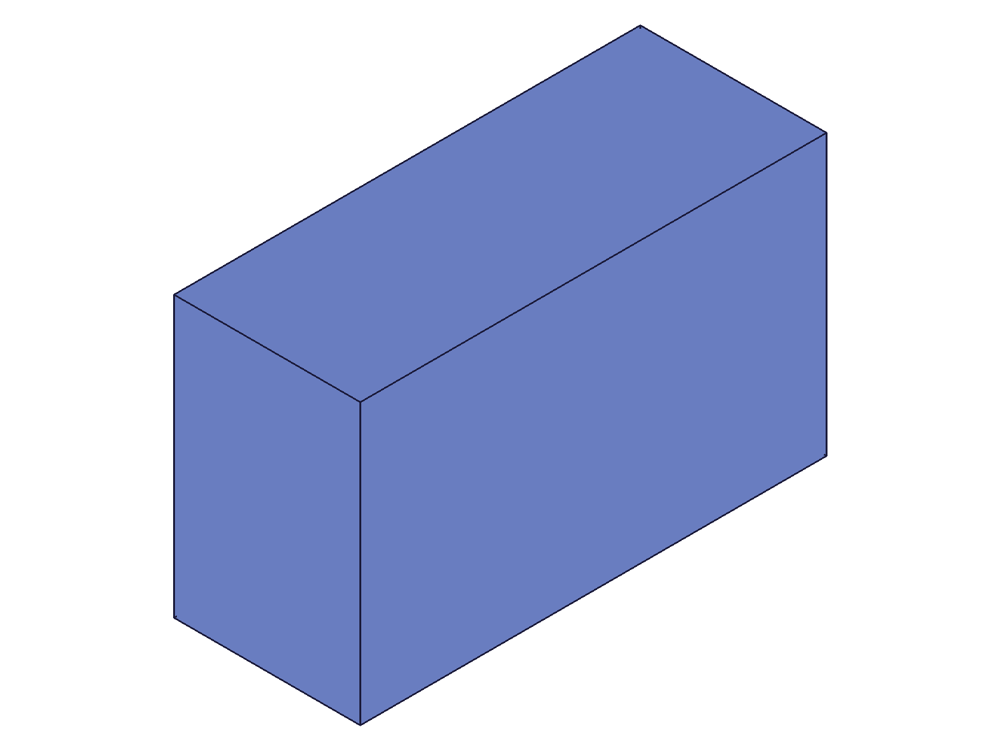

# Training: part.createUncommitedObject

**Date:** 2026-04-21

## Goal

Testing `v1.part.createUncommitedObject` — creates a new uncommitted (empty) feature in a part.

**Methods to cover:**

- `createUncommitedObject` — required params: `id` (part), `type` (CC_ class string), `name`
- What CC_ type strings are valid? (CC_Box, CC_Cylinder, CC_Extrusion, CC_Sketch, etc.)
- What is the returned ID? Can it be used with `update*` APIs?
- What does "uncommitted" mean? Is the feature in the feature tree? Does it have geometry?

**Questions:**

- What happens when you create an uncommitted CC_Box? Is it an empty shell you then populate via `updateBox`?
- Does the uncommitted feature appear in the structure tree?
- Can you use `openFeature` / `closeFeature` on it?
- What happens with invalid type strings?
- How does this compare to just calling `part.box()` directly?
- Does the assembly variant (`assembly.createUncommitedObject`) work the same way?
- What's the relationship to the open/close feature editing gate?

---

## 01 — basic CC_Box creation

Script: `scripts/01-basic-cc-box.mjs` — creates an uncommitted CC_Box and inspects the result.

**Data:** `createUncommitedObject` returned id=52, maxLevel=31 (info). No geometry produced (no PNG). `getFeature({ name: 'EmptyBox' })` returned null with maxLevel=51 — the uncommitted feature is NOT findable by name without recalc.

**Structure tree inspection:** The uncommitted object (id 52) appears in `AllObjects.members.uncommitedObjectsIds` as an array entry. Its node in the tree has class `CC_Box`, name `EmptyBox`, parent=`CC_EntitySet`, with default members: length=100, width=100, height=100, solidOperation=0. A `CC_OperationReference` (id 54) in the operation sequence points to it.

**📌 LLM doc:** Uncommitted features are tracked in `AllObjects.uncommitedObjectsIds`. They have default member values but no geometry. `getFeature` cannot find them without a prior `recalc`.

## 02 — commit via open + update + close

Script: `scripts/02-update-uncommitted-box.mjs` — creates uncommitted box, then commits via open → updateBox → close.

|  |
|---|

**Data:** `openFeature` maxLevel=31 (OK). `updateBox({ length: 60, width: 40, height: 30 })` returned id=52, maxLevel=31. `closeFeature` maxLevel=31. After close, `getFeature` returns id=52 successfully. `uncommitedObjectsIds` is now empty. Structure tree shows updated dimensions (length=60, width=40, height=30).

**📌 LLM doc:** Commit workflow: `createUncommitedObject` → `openFeature` → `update*` → `closeFeature`. After close, the feature is committed, has geometry, and is findable by `getFeature`.

## 03 — singleton constraint

Script: `scripts/03-various-types.mjs` — tries creating multiple CC_ types in sequence without committing.

**Data:** CC_Cylinder succeeded (id=52). All subsequent types (CC_Sphere, CC_Cone, CC_Extrusion, etc.) failed with error: "There is still an uncommited feature called 'Cylinder', please commit or decline the feature first."

**📌 LLM doc:** Only ONE uncommitted feature can exist at a time. Must commit or decline before creating another.

## 05 — sequential type testing (with commit)

Script: `scripts/05-types-sequential.mjs` — tests all feature types one-at-a-time, committing each before creating the next.

**Data:** Working types: CC_Box, CC_Cylinder, CC_Sphere, CC_Cone, CC_Extrusion, CC_Revolve, CC_Fillet, CC_Chamfer, CC_Sketch, CC_WorkPlane, CC_WorkAxis, CC_WorkPoint, CC_WorkCSys, CC_Mirror, CC_LinearPattern, CC_CircularPattern, CC_Translation, CC_Rotation, CC_EntityInjection, CC_Slice, CC_Twist, CC_SliceBySheet, CC_EntityDeletion, CC_CompositeCurve, CC_TransformationByCSys.

Failed types: `CC_Boolean` ("non-existent class"), `CC_ImportFeature` ("non-existent class").

**📌 LLM doc:** Most feature types work. Boolean must use specific type names (CC_Union/CC_Subtraction/CC_Intersection). Import must use CC_Import.

## 06 — boolean class names

Script: `scripts/06-find-boolean-class.mjs` — creates a boolean via `part.boolean`, inspects class name, tests alternatives.

**Data:** `part.boolean({ type: 'UNION' })` creates an object with class `CC_Union`. Valid boolean class names for `createUncommitedObject`: CC_BooleanOperation (generic), CC_Union, CC_Subtraction, CC_Intersection. `CC_Boolean` and `CC_BoolOp` are NOT valid classes.

**📌 LLM doc:** Boolean features use type-specific class names. CC_BooleanOperation is the generic name.

## 10 — commit vs decline

Script: `scripts/10-commit-vs-decline.mjs` — explicit comparison of commit (with update) vs decline (without update).

|  |
|---|

**Data:**
- **Commit:** `openFeature` → `updateBox` → `closeFeature` → `getFeature` returns id, node exists in tree = true
- **Decline:** `openFeature` → `closeFeature` (no update) → `getFeature` returns null, node exists in tree = false
- `uncommitedObjectsIds` is empty after both operations (cleared in both cases)

**📌 LLM doc:** Decline = `openFeature` + `closeFeature` with NO update call in between. The feature is completely removed. Commit = `openFeature` + `update*` + `closeFeature`.

## 11 — default values

Script: `scripts/11-defaults-and-geometry.mjs` — commits a box with defaults (updateBox with no params).

|  |  |
|---|---|

**Data:** Default CC_Box: length=100, width=100, height=100. Default CC_Cylinder: height=100, diameter=100. Calling `updateBox({})` with no dimension params commits the box with its default values (100x100x100).

**📌 LLM doc:** Uncommitted features have default values. `updateBox({})` with no params is a no-op update that commits with defaults.

## 12 — invalid type strings

Script: `scripts/12-invalid-type.mjs` — tests various invalid type string formats.

**Data:** Type strings are case-sensitive. Failed: `INVALID`, `Box`, `cc_box`, `CC_BOX`, `CC_box`, empty string. All produce "Creation an object of a non-existent class" error. Succeeded: `CC_Part` (creates an uncommitted part object — unusual).

**📌 LLM doc:** Type must be an exact CC_ class name, case-sensitive.

## 13 — missing params

Script: `scripts/13-missing-params.mjs` — tests missing required params.

**Data:** All three params are required: `id` ("The parameter 'id' must be provided"), `type` ("The parameter 'type' must be provided"), `name` ("The parameter 'name' must be provided"). Duplicate names are allowed — creating an uncommitted feature with the same name as an existing feature succeeds.

## 14 — direct vs uncommitted creation

Script: `scripts/14-vs-direct-creation.mjs` — compares `part.box()` with `createUncommitedObject` + commit.

|  |
|---|

**Data:** Both paths produce identical results after commit. Direct box (60x40x30, blue) and uncommitted-then-committed box (80x50x20, orange) coexist with proper geometry. Operation sequence has both references.

## 16 — blocking behavior

Script: `scripts/16-blocks-creation.mjs` — tests what APIs are blocked while an uncommitted feature exists.

**Data:** While an uncommitted feature exists, ALL feature creation APIs are blocked: `part.box`, `part.cylinder`, `part.sketch`, `part.workPlane`, `part.entityInjection` — all return error "There is still an uncommited feature". However, `part.expression` (non-feature) is NOT blocked — expressions can still be created.

**📌 LLM doc:** Uncommitted features block all feature creation. Expression creation is exempt.

## 17 — CC_Import and getFeature timing

Script: `scripts/17-cc-import-and-getfeature.mjs` — tests CC_Import (correct class name) and getFeature timing.

**Data:** CC_Import succeeds (id=52). Its default members: `_VERSION` and `solidOperation` only. `getFeature` for uncommitted features: fails before `recalc`, succeeds after `recalc`. After commit, getFeature continues to work.

**📌 LLM doc:** The correct class for import features is `CC_Import` (not `CC_ImportFeature`). `getFeature` requires recalc to find uncommitted features.

## 18 — expressions with uncommitted features

Script: `scripts/18-expressions-with-uncommitted.mjs` — tests expression-driven dimensions on uncommitted box.

|  |
|---|

**Data:** `updateBox({ length: '@expr.L', width: '@expr.W', height: '@expr.H' })` works during commit. Box gets expression bindings (expr: ExpressionSet.L). After commit, dimensions match expression values (80, 50, 30).

## 19 — assembly variant

Script: `scripts/19-assembly-variant.mjs` — tests `assembly.createUncommitedObject`.

**Data:** Assembly variant works identically. Working types: CC_FastenedConstraint, CC_FastenedOriginConstraint, CC_RevoluteConstraint, CC_CylindricalConstraint, CC_PlanarConstraint. Failed: CC_PrismaticConstraint, CC_BallConstraint (non-existent classes). CC_FastenedConstraint has default members: xOffset, yOffset, zOffset, xRotation, yRotation, zRotation, firstRefMate, secondRefMate.

**📌 LLM doc:** Assembly variant uses same pattern. Constraint class names must be exact.

## 20 — decline verification

Script: `scripts/20-decline-verification.mjs` — verifies the decline → new create → commit cycle.

|  |
|---|

**Data:** After decline (open + close without update): `uncommitedObjectsIds` is empty, node is removed from tree. New `createUncommitedObject` succeeds immediately. Subsequent commit works correctly. Declined feature name is not findable by `getFeature`.

---

## Coverage Checklist

- [x] API called successfully (scripts 01, 02)
- [x] Every required parameter tested (script 13: id, type, name)
- [x] Key optional parameters — NONE (all params are required)
- [x] Every type variant exercised (scripts 05, 06, 12)
- [x] Update/delete tested — commit via open/update/close, decline via open/close (scripts 02, 10, 20)
- [x] Realistic usage combining with prerequisites (scripts 14, 18)
- [x] Behavioral claims verified with data AND visual evidence
