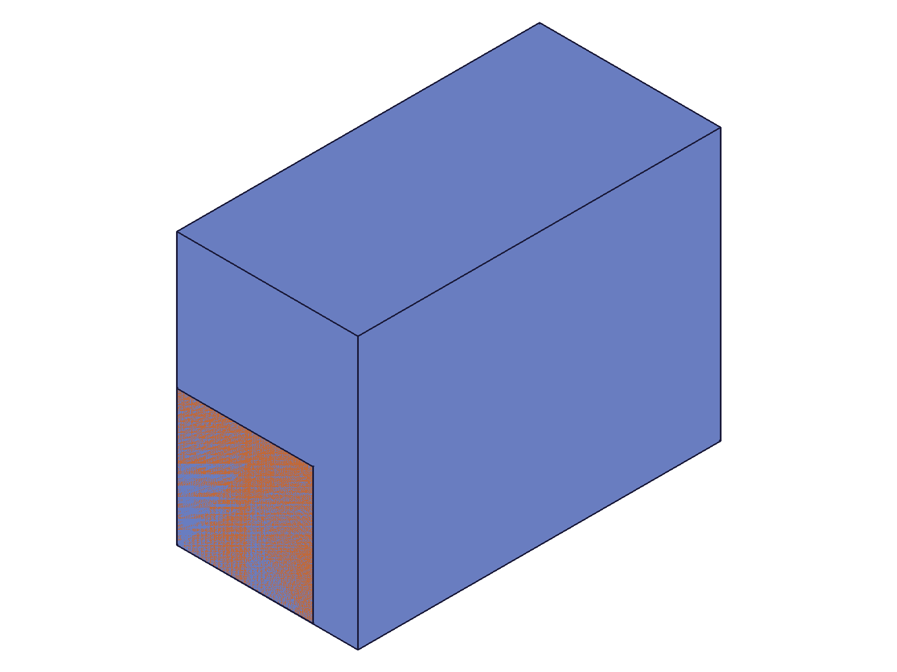
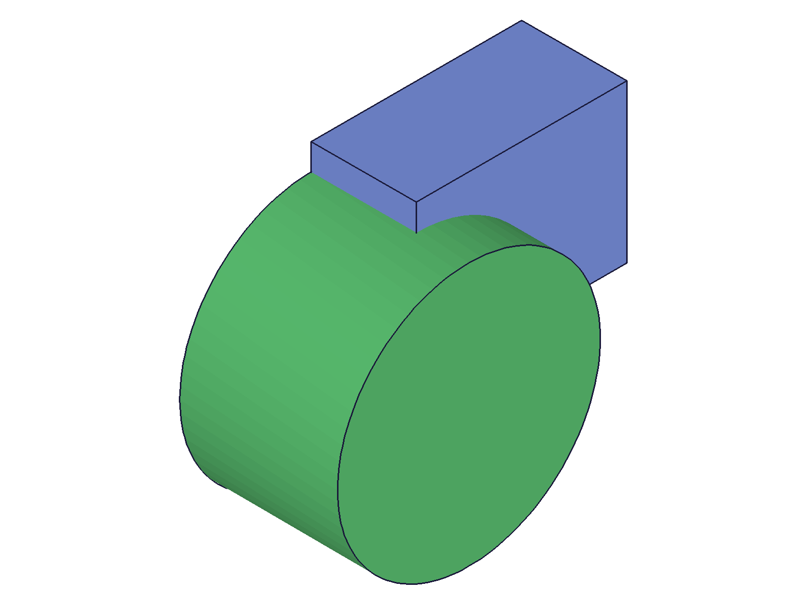
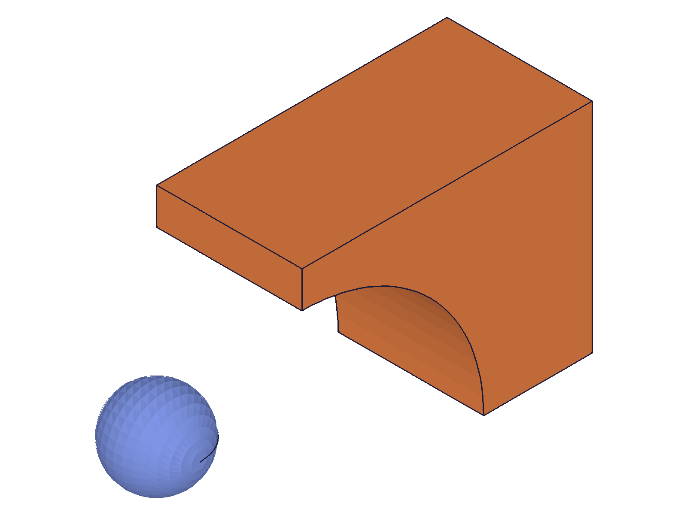

# Training: operationMoveBefore

**Date:** 2026-04-21

## Goal

Testing `v1.part.operationMoveBefore` and `v1.part.operationMoveToEnd`.

**Methods to cover:**

- `operationMoveBefore` — params: id (partId), featureId (feature to move bar before)
- `operationMoveToEnd` — params: id (partId)
- Return value: VOID for both

**Questions:**

- What happens to geometry when the rollback bar is moved before a feature? Does the feature become invisible?
- Does moving the bar forward (toward end) trigger recalc as docs say?
- Can you move before the very first feature?
- What happens with invalid featureId (wrong ID, part ID instead of feature)?
- What is the relationship between operationMoveBefore and openFeature/closeFeature?
- Can you create new features when the bar is moved partway through the tree?
- Does operationMoveToEnd restore all features?
- What does the structure tree look like at different bar positions?

---

## 01 — basic moveBefore/moveToEnd

Script: `scripts/01-basic-moveBefore.mjs` — ✅ Both APIs work as documented.

Created 3 features (box id:54, cylinder id:91, workPlane id:110). `operationMoveBefore({ id: partId, featureId: cylId })` hid the cylinder and work plane. `operationMoveToEnd` restored everything.

|  |  |  |
|---|---|---|
| all features | before cylinder | restored |

**Data:** Both calls returned null result, maxLevel 31. See `files/01-basic-moveBefore-moveBefore-cyl.json` and `files/01-basic-moveBefore-moveToEnd.json`.

**Learned:** moveBefore hides all features at and after the target position. moveToEnd fully restores them.
**📌 LLM doc:** Core behavior confirmed.

---

## 02 — before first feature + error cases

Script: `scripts/02-before-first-feature.mjs` — ✅ Moving before first feature works. Error cases are clear.

- `moveBefore(boxId)` — succeeds (maxLevel 31). All solid geometry hidden.
- `moveBefore(partId)` — **error** (maxLevel 51, code 1001): `"The parameter \"featureId\" has a wrong id type! Provide only following id types: [\"feature\",\"workgeometry\",\"sketch\"]"` — very clear error.
- `moveBefore(999999)` — **error** (maxLevel 51, code 1006): `"An element of parameter \"featureId\" has an invalid id!"` preceded by warning code 0.

**📌 LLM doc:** Document accepted ID types and error messages.

---

## 03 — structure tree at different bar positions

Script: `scripts/03-structure-at-positions.mjs` — ✅ Key architectural finding.

**The RollbackBar (CC_RollbackBar, id 20) is a node in the OperationSequence that physically moves position within the children array:**

- **All features active:** children end with `..., BoxRef(56), CylinderRef(93), WorkPlaneRef(112), RollbackBar(20)` — bar at end.
- **Before cylinder:** `..., BoxRef(56), RollbackBar(20), CylinderRef(93), WorkPlaneRef(112)` — bar between box and cylinder.
- **Before box:** `..., RightRef(48), RollbackBar(20), BoxRef(56), CylinderRef(93), WorkPlaneRef(112)` — bar before all custom features.

**All features remain in the structure tree regardless of bar position.** The tree is not pruned — features after the bar are simply not evaluated. This is why `getFeature` can still find rolled-back features (see script 09).

**Data:** Structure trees saved as `files/03-structure-at-positions-structure-*.json` (25KB each).

**📌 LLM doc:** Document the RollbackBar mechanism — it moves within the OperationSequence children array.

---

## 04 — create feature at mid-tree position

Script: `scripts/04-create-at-mid-tree.mjs` — ✅ Creating features while bar is mid-tree inserts them at the bar position.

Moved bar before cylinder, created Box2 (id 110). After moveToEnd, the operation sequence was:
```
BoxRef(56) → BoxRef0(112) → CylinderRef(93) → RollbackBar(20)
```

Box2 was inserted BETWEEN Box1 and Cylinder — exactly at the bar position.

|  |  |
|---|---|
| mid-tree (box + box2, cyl rolled back) | all restored (box + box2 + cyl) |

**📌 LLM doc:** This is the primary use case — insert features mid-tree. Document the pattern: moveBefore → create → moveToEnd.

---

## 05 — interaction with openFeature

Script: `scripts/05-interaction-openFeature.mjs` — ✅ openFeature works on both rolled-back and visible features.

- `openFeature(cylId)` while cylinder is rolled back: **succeeds** (maxLevel 31)
- `openFeature(boxId)` while bar is mid-tree: **succeeds** (maxLevel 31)
- `updateBox(height: 100)` while bar is mid-tree: **succeeds** (maxLevel 31)
- After moveToEnd + openFeature(boxId): bar stays at end position (index 9 of 10 in children array)

**Data:** `files/05-interaction-openFeature-open-*.json` confirm all maxLevel 31.

**📌 LLM doc:** openFeature is not blocked by bar position. You can open/update features regardless of where the bar is.

---

## 06 — moveBefore on work geometry

Script: `scripts/06-moveBefore-workgeo.mjs` — ✅ Works on custom AND default work geometry.

- `moveBefore(wpId)` custom work plane: maxLevel 31
- `moveBefore(waId)` custom work axis: maxLevel 31
- `moveBefore(topId)` default "Top" plane: maxLevel 31 — the bar can go VERY early in the tree

**📌 LLM doc:** featureId accepts default work geometry too — you can roll back past the built-in planes.

---

## 07 — boolean rollback

Script: `scripts/07-boolean-rollback.mjs` — ✅ Rolling back past a boolean undoes the boolean.

Created box + cylinder → SUBTRACTION boolean. Rolling back through the tree:

|  |  |  |
|---|---|---|
| after boolean (cut) | before boolean (box + cyl) | before cylinder (box only) |

**Data:** All moveBefore calls returned maxLevel 31. Visual evidence clearly shows: boolean → separate bodies → single body as bar moves backward.

**📌 LLM doc:** Document that moveBefore properly undoes dependent operations like booleans.

---

## 08 — idempotent behavior and edge cases

Script: `scripts/08-moveBefore-same-position.mjs` — ✅ All edge cases are silent no-ops.

- `moveBefore(cylId)` twice in a row: both maxLevel 31 (idempotent)
- Move backward then forward: both maxLevel 31
- `moveToEnd` when already at end: maxLevel 31 (idempotent)

**Data:** `files/08-moveBefore-same-position-*.json` confirm all silent success.

**📌 LLM doc:** Both APIs are idempotent — calling at the current position is a no-op.

---

## 09 — getFeature during rollback

Script: `scripts/09-getFeature-during-rollback.mjs` — ✅ getFeature finds features regardless of bar position.

- `getFeature('Cyl1')` while cylinder is rolled back: **returns 91** (maxLevel 31) — still findable
- `getFeature('Box1')` while visible: returns 54 (maxLevel 31)
- `getFeature('DoesNotExist')`: null (maxLevel 51)

**📌 LLM doc:** getFeature is not affected by bar position. You can find features even when they're rolled back.

---

## 10 — insert fillet mid-tree (failed — wrong param name)

Script: `scripts/10-insert-mid-tree-workflow.mjs` — ❌ Fillet failed: `"The parameter \"references\" must be provided"` — used `geomIds` instead of `references`.

The moveBefore + recalc + getGeometryIds flow worked correctly (got edge ID 213). The failure was in fillet param naming, not in the rollback mechanism.

---

## 11 — successful mid-tree insertion with boolean

Script: `scripts/11-insert-simple-midtree.mjs` — ✅ Full workflow: moveBefore → create sphere → moveToEnd.

Operation sequence after moveToEnd:
```
BoxRef(56) → CylinderRef(93) → SphereRef(204) → SubtractionRef(112) → RollbackBar(20)
```

Sphere was inserted BEFORE the subtraction. The boolean was re-evaluated with the sphere present.

|  |
|---|
| all features: box with cut + sphere (inserted mid-tree) |

**📌 LLM doc:** Document the full insert-mid-tree workflow pattern.
