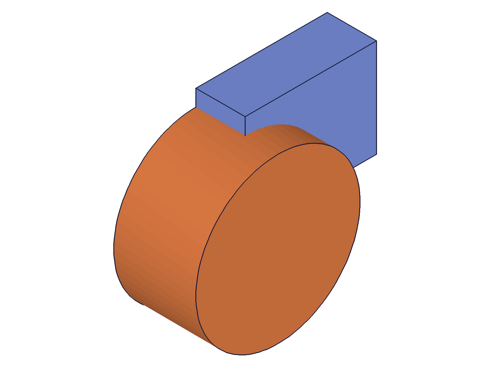
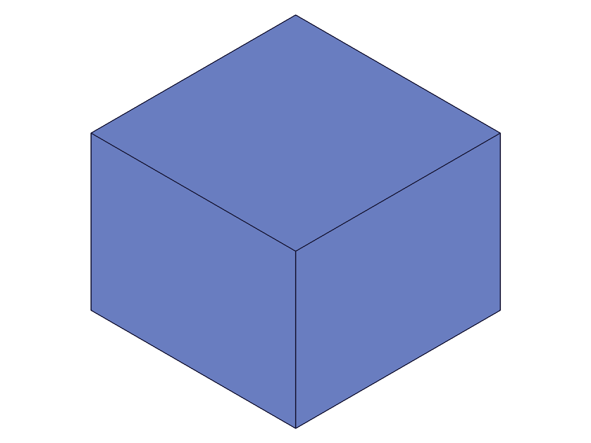
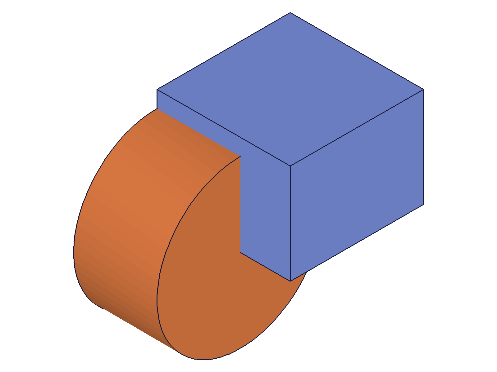
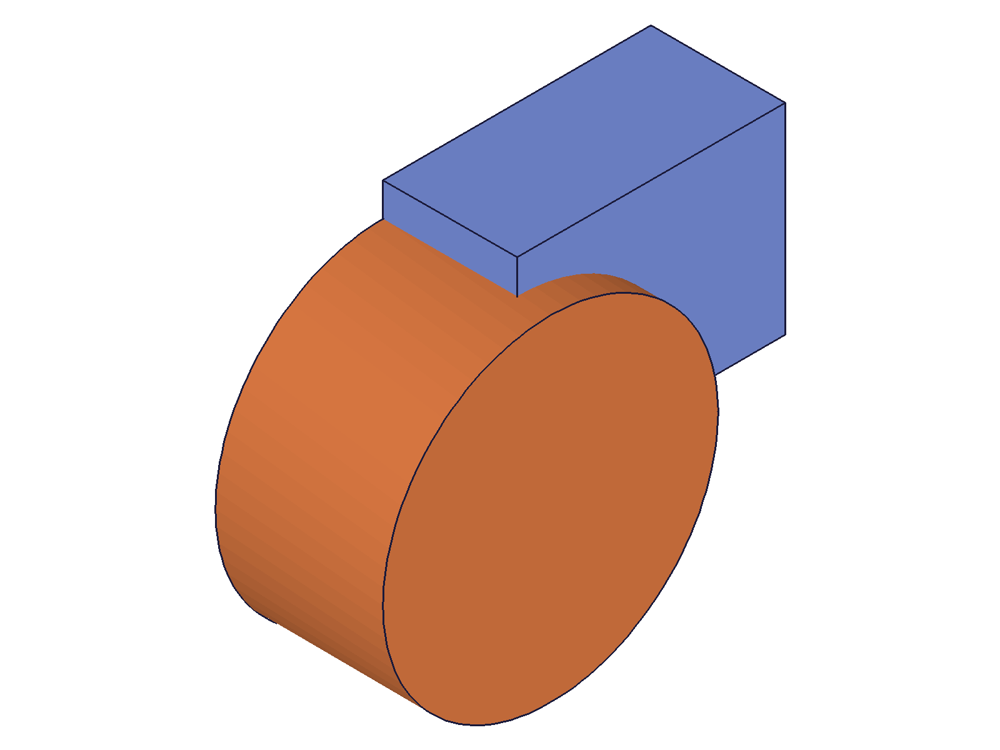
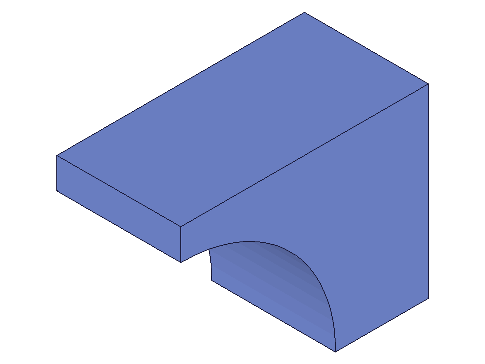
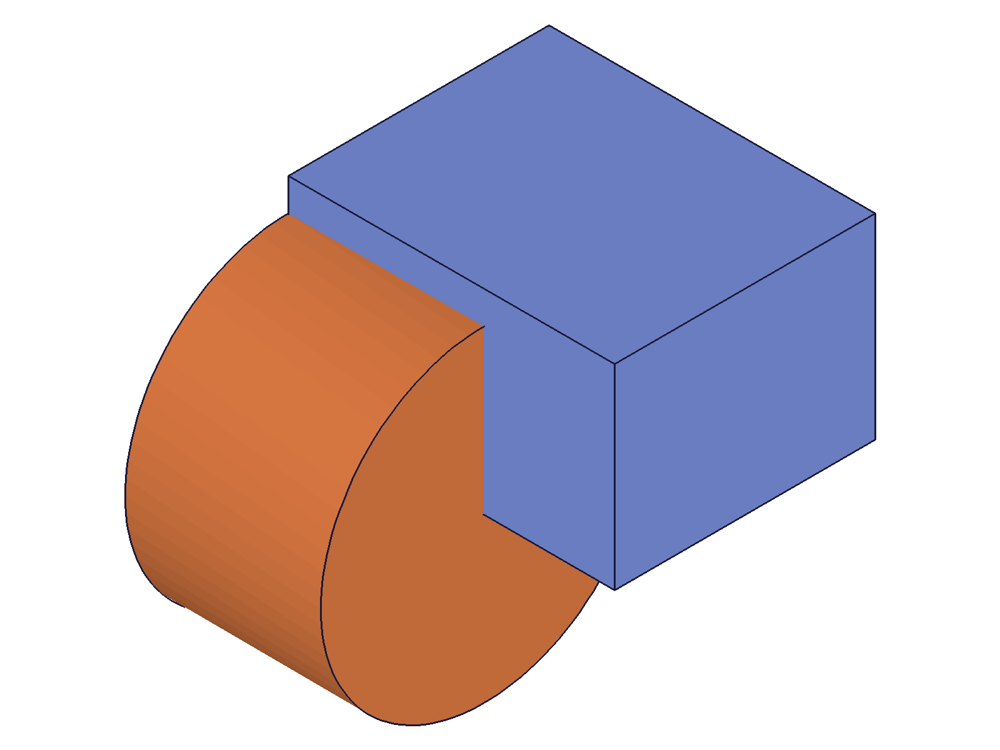
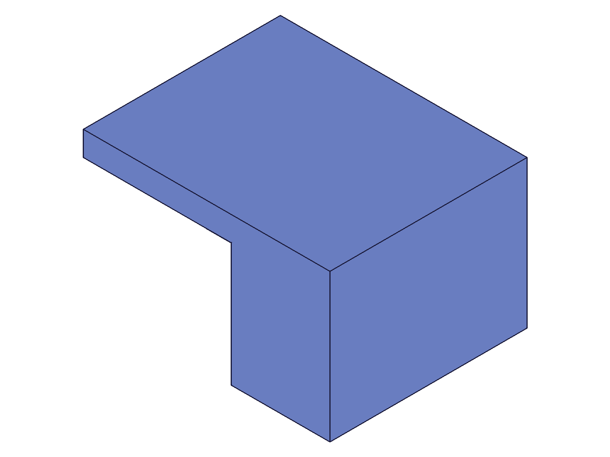

# Training: operationMoveToEnd

**Date:** 2026-04-21

## Goal

Focused testing of `v1.part.operationMoveToEnd`. The prior session (operationMoveBefore) used moveToEnd as a "restore" tool but didn't test its own error cases or recalc semantics in depth.

**Methods to cover:**

- `operationMoveToEnd` — params: id (partId), return: VOID

**Questions:**

- What happens calling moveToEnd on a part with no features?
- Error cases: invalid ID, wrong ID type (feature ID instead of part ID), non-existent ID
- Does moveToEnd after openFeature + updateBox actually trigger recalc? Can we verify the geometry changed?
- Does moveToEnd after openFeature WITHOUT changes still return success?
- What about moveToEnd after moveBefore + openFeature(rolled-back feature) + update — does it propagate?

---

## 01 — moveToEnd on empty part

Script: `scripts/01-empty-part.mjs` — ✅ Works on a part with no custom features.

**Data:** result=null, maxLevel=31. See `files/01-empty-part-moveToEnd-empty.json`.

**Learned:** moveToEnd is a no-op on an empty part (only default work geometry). No error.

---

## 02 — error cases

Script: `scripts/02-error-cases.mjs` — ✅ All error cases produce clear messages.

| Input | maxLevel | Code | Error |
|---|---|---|---|
| `id: boxId` (feature) | 51 | 1001 | `"has a wrong id type! Provide only following id types: [\"part\"]"` |
| `id: 999999` | 51 | 1006 | `"has an invalid id!"` (preceded by warning code 0) |
| `id: 0` | 51 | 1006 | `"has an invalid id!"` |
| `id: undefined` ({}) | 51 | 1004 | `"must be provided in the api call!"` |

**Data:** `files/02-error-cases-*.json` — all 4 error envelopes saved.

**📌 LLM doc:** Document error codes and messages for moveToEnd. Note that `id` must be a part ID (code 1001 if feature ID passed).

---

## 03 — recalc after mid-tree update

Script: `scripts/03-recalc-after-update.mjs` — ✅ moveToEnd recalcs after openFeature + updateBox.

Created box (height 30) + cylinder. Rolled back before cylinder, updated box height to 80, closed feature, then moveToEnd. The restored state shows the taller box + cylinder.

|  |  |  |
|---|---|---|
| initial (h=30) | mid-tree updated (h=80, cyl rolled back) | after moveToEnd (h=80 + cyl) |

**Data:** updateBox returned result=54 (boxId), maxLevel=31. moveToEnd returned null, maxLevel=31. Visual confirms: box proportions changed from flat to tall.

**📌 LLM doc:** Confirmed: moveToEnd triggers recalc when changes were made via openFeature/closeFeature.

---

## 04 — moveToEnd without changes

Script: `scripts/04-moveToEnd-no-changes.mjs` — ✅ moveToEnd succeeds even when no changes were made.

Rolled back, opened box, closed without changes, then moveToEnd. Result: null, maxLevel 31. Both box and cylinder restored.

|  |
|---|
| after moveToEnd (no changes made) |

**Data:** `files/04-moveToEnd-no-changes-moveToEnd-no-changes.json` — maxLevel=31.

**Learned:** open/close without changes + moveToEnd = no error, no recalc needed. Silent success.

---

## 05 — recalc propagation through boolean

Script: `scripts/05-recalc-propagation.mjs` — ✅ moveToEnd propagates upstream changes through downstream booleans.

Created box (h=40) + cylinder + SUBTRACTION boolean. Rolled back before boolean, updated box height to 100, then moveToEnd. The boolean was re-evaluated with the taller box.

|  |  |  |
|---|---|---|
| initial (h=40 with cut) | mid-tree (h=100, bool rolled back) | after moveToEnd (h=100 with cut) |

**Data:** moveToEnd returned null, maxLevel=31. Visual shows: the cut is proportionally smaller on the taller box in the final image, confirming the boolean was re-evaluated with the updated box dimensions.

**📌 LLM doc:** Document recalc propagation — changes to upstream features cascade through downstream features (booleans, patterns, etc.) on moveToEnd.

---

## Coverage Checklist

- [x] API called successfully (scripts 01, 03, 04, 05)
- [x] Required parameter `id` tested
- [x] Error cases tested (wrong type, nonexistent, zero, missing)
- [x] N/A — no enum values, no update/delete variant
- [x] Realistic usage: mid-tree edit + moveToEnd with boolean propagation (script 05)
- [x] All findings verified with data (maxLevel, result values) AND visual evidence (snapshots)
