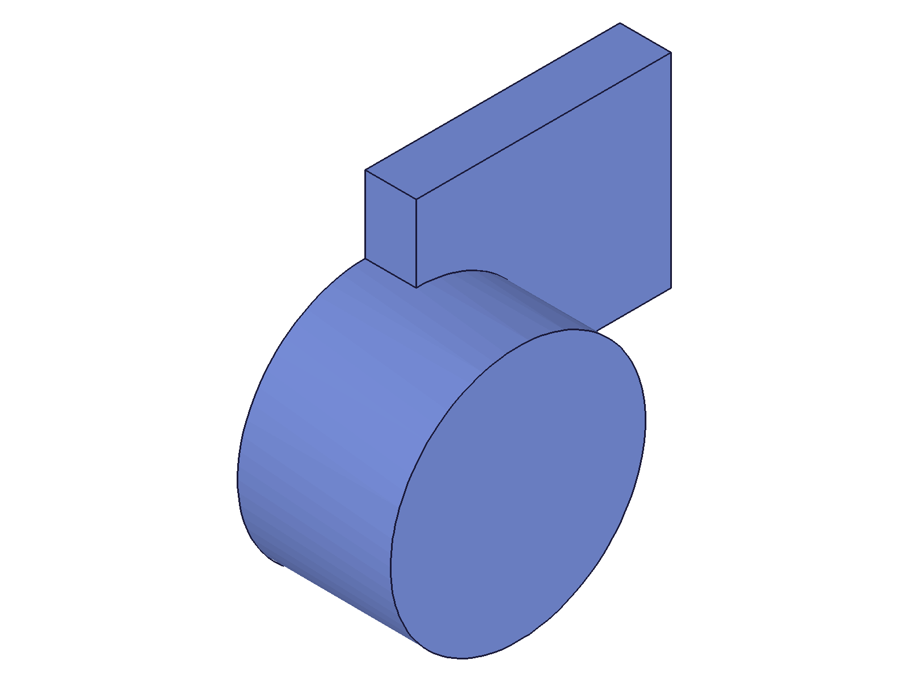

# Training: part.getFeature

**Date:** 2026-04-21

## Goal

Testing `v1.part.getFeature` — looks up a feature by name within a part and returns its ID.

**Methods to cover:**

- `getFeature` — basic lookup by name (required params: `id`, `name`)
- Return value: feature ID or VOID when not found

**Questions:**

- What does the return look like for a found feature vs. not found?
- Is the name search case-sensitive?
- What happens with duplicate feature names?
- Does it find all feature types (box, extrusion, sketch, work planes, booleans, etc.)?
- Does it work with auto-generated names vs. custom names (via `setObjectName`)?
- Does it find features that have been reordered via `operationMoveBefore`?
- What happens when searching in a rolled-back state (openFeature)?
- What messages/maxLevel are returned on success vs. failure?

---

## 01 — basic lookup (found vs. not found)

Script: `scripts/01-basic-lookup.mjs` — ✅ `getFeature("Box")` returns the box feature ID (54), matching what `box()` returned.

|  |
|---|

**Data:** Found → `{ result: 54, messages: [], maxLevel: 31 }`. Not found → `{ result: null, messages: [{ code: 0, level: 51, message: 'Feature with name "NonExistent" does not exist' }], maxLevel: 51 }`. See `files/01-basic-lookup-basic-lookup.json`.

**Learned:** Found returns the feature ID with maxLevel 31. Not found returns `null` (not VOID) with maxLevel 51 and code 0.
**📌 LLM doc:** Return values and error format.

## 02 — case sensitivity

Script: `scripts/02-case-sensitivity.mjs` — ✅ Name matching is **case-sensitive**.

**Data:** "Box" → 54 (found). "box" → null. "BOX" → null. "bOx" → null. See `files/02-case-sensitivity-case-sensitivity.json`.

**Learned:** Exact case match required. No fuzzy or case-insensitive matching.
**📌 LLM doc:** Case-sensitive matching.

## 03 — custom name

Script: `scripts/03-custom-name.mjs` — ✅ Custom names at creation time work with `getFeature`.

**Data:** Box created as "MyBox" → found. Default "Box" → not found. See `files/03-custom-name-custom-name.json`.

**Learned:** When a custom name is given at creation, the default name is never assigned.

## 04 — duplicate names (initial probe)

Script: `scripts/04-duplicate-names.mjs` — Two boxes with default names. "Box" → returns the first (54). Guessed suffixes ("Box_1", "Box 2", "Box_2") all failed.

**Data:** box1=54, box2=91. "Box" → 54 (first match). See `files/04-duplicate-names-duplicate-names.json`.

**Learned:** First-match wins. But what's the second box named? Needs structure dump.

## 05 — duplicate names (structure analysis)

Script: `scripts/05-duplicate-names-structure.mjs` — ✅ Found the actual naming convention from structure tree.

**Data:** Structure tree shows: Box(54), Box0(91), Box1(128), Box2(165). After renaming box2(91) to "RenamedBox", lookup by "RenamedBox" returns 91. See `files/05-duplicate-names-structure-full-structure.json`.

**Learned:** Auto-naming pattern is: `Type`, `Type0`, `Type1`, `Type2`, ... (first gets clean name, subsequent get zero-indexed suffix with no separator).
**📌 LLM doc:** Auto-naming convention — critical for agents constructing lookup names.

## 06 — multiple feature types (primitives)

Script: `scripts/06-feature-types.mjs` — ✅ All primitive types findable: Box(54), Cylinder(91), Cone(110), Sphere(129). All matched their creation IDs.

**Data:** See `files/06-feature-types-feature-types.json`.

**Learned:** All solid primitives (box, cylinder, cone, sphere) work with `getFeature`.

## 07 — confirmed naming convention

Script: `scripts/07-naming-convention.mjs` — ✅ Verified naming pattern with 5 boxes.

**Data:** IDs [54, 91, 128, 165, 202] mapped to names ["Box", "Box0", "Box1", "Box2", "Box3"]. All matched. See `files/07-naming-convention-naming-convention.json`.

**Learned:** Naming confirmed: first = "Type", subsequent = "Type" + zero-indexed number (no space, no underscore).
**📌 LLM doc:** Naming pattern confirmed.

## 08 — work geometry (NOT findable)

Script: `scripts/08-work-geometry.mjs` — ✅ Work geometry features are NOT findable via `getFeature`.

**Data:** Created workPlane("MyPlane"), workAxis("MyAxis"), workPoint("MyPoint") — all returned null. Built-in names (Origin, Top, Front, Right, XAxis, YAxis, ZAxis) — all null. See `files/08-work-geometry-work-geometry.json`.

**Learned:** `getFeature` does NOT search work geometry or built-in origin features. Use `getWorkGeometry` instead.
**📌 LLM doc:** Scope limitation — only searches operation features, not work geometry or sketches.

## 09 — sketches (NOT findable via getFeature)

Script: `scripts/09-sketch-extrusion.mjs` — ✅ Sketches are NOT findable via `getFeature`.

**Data:** "MySketch" → null, "Sketch" → null. Both with maxLevel 51.

**Learned:** Sketches live in the SketchSet, not the OperationSequence. Use `getSketch` instead.
**📌 LLM doc:** Sketches are NOT findable — use `part.getSketch` for sketch lookup.

## 10 — boolean and consumed tools

Script: `scripts/10-boolean-chamfer-fillet.mjs` — ✅ Boolean features are findable. Consumed tool features remain findable.

**Data:** "MyBool" → 128 (matches boolId). "ToolBox" (consumed by boolean) → 91 (still matches). See `files/10-boolean-chamfer-fillet-boolean-chamfer.json`.

**Learned:** Features consumed by a boolean remain in the tree and are still findable by name.

## 11 — extrusion and sketch distinction (fixed)

Script: `scripts/11-extrusion-proper.mjs` — Extrusion creation failed (regionId was null), but confirmed the sketch vs. getFeature distinction.

**Data:** "Sketch" via `getFeature` → null. "Sketch" via `getSketch` → 52 (matches). Extrusion couldn't be tested due to missing region.

**Learned:** Confirms sketch/getFeature split. Extrusion test inconclusive (not a getFeature issue).

## 12 — rename with setObjectName

Script: `scripts/12-after-rename.mjs` — ✅ `setObjectName` updates the lookup name. `updateBox({ name })` does NOT.

**Data:** Before rename: "OriginalName" → 54. After `setObjectName("NewName")`: "OriginalName" → null, "NewName" → 54. After `updateBox({ name: 'UpdatedName' })`: "NewName" → 54 (still!), "UpdatedName" → null.

**Learned:** `setObjectName` is the correct way to rename a feature for `getFeature` lookup. `updateBox({ name })` does not affect the lookup name.
**📌 LLM doc:** Use `setObjectName` for renaming — `updateBox({ name })` does NOT update the lookup name.

## 13 — updateBox vs. setObjectName (deep dive)

Script: `scripts/13-updatebox-vs-setobjectname.mjs` — ✅ Confirmed: `updateBox({ name })` fails entirely (maxLevel 51), while `setObjectName` works.

**Data:** `updateBox({ name: 'BoxRenamed' })` returned maxLevel 51 (error). Original name "TestBox" still worked after the failed call. After `setObjectName("SetObjName")`, "TestBox" → null, "SetObjName" → 54. See `files/13-updatebox-vs-setobjectname-rename-comparison.json`.

**Learned:** `updateBox({ name })` appears to be non-functional for renaming (returns error). `setObjectName` is the only working rename path.
**📌 LLM doc:** updateBox name param note, setObjectName is the correct rename API.

## 14 — after operationMoveBefore

Script: `scripts/14-after-move.mjs` — ✅ Feature reordering does NOT affect `getFeature` lookup.

**Data:** Three boxes (First=54, Second=91, Third=128). After moving Third before First: all three still found by name with correct IDs. See `files/14-after-move-after-move.json`.

**Learned:** `operationMoveBefore` changes tree order but does not affect name lookup.

## 15 — rolled-back state (openFeature)

Script: `scripts/15-rollback-state.mjs` — ✅ ALL features findable regardless of rollback position.

**Data:** Three boxes (Alpha=54, Beta=91, Gamma=128). After `openFeature(Alpha)` (rolling back Beta and Gamma): all three still return their IDs with maxLevel 31. After restore: same. See `files/15-rollback-state-rollback-state.json`.

**Learned:** `getFeature` searches the full tree, ignoring rollback bar position. Rolled-back features are still accessible by name.
**📌 LLM doc:** Rollback does not hide features from getFeature.

## 16 — edge cases and errors

Script: `scripts/16-edge-cases.mjs` — ✅ All edge cases return clean errors, no crashes.

**Data:** See `files/16-edge-cases-edge-cases.json` for full messages.
- Empty name → code 0, "Feature with name \"\" does not exist"
- Missing `name` → code 1004, "The parameter \"name\" must be provided"
- Missing `id` → code 1004, "The parameter \"id\" must be provided"
- Wrong ID type (box ID) → code 1001, "wrong id type! Provide only: [\"part\"]"
- Invalid ID (0) → code 1006, "invalid id"

**Learned:** Validation order: `id` checked first for type and validity, then `name`. Error code 0 means "valid call, feature not found". All errors are maxLevel 51.
**📌 LLM doc:** Error table with codes and messages.

## 17 — transformation features

Script: `scripts/17-transform-features.mjs` — Mirror and translation creation failed (returned null IDs), so lookup was trivially null=null. MainBox still found.

**Learned:** Mirror/translation param issues unrelated to getFeature. No conclusion about whether transformation features are findable (would need working creation first).

## 18 — realistic workflow

Script: `scripts/18-realistic-workflow.mjs` — ✅ Full workflow: create named features, look them up, use the returned IDs.

|  |  |
|---|---|

**Data:** Base(54), Pillar(91), Assembly(110) — all found by name. `updateBox` on the found ID returned maxLevel 51 (likely needs `openFeature` since boolean exists after it). See `files/18-realistic-workflow-workflow.json`.

**Learned:** `getFeature` is the standard way to retrieve a known feature by name for subsequent operations. The returned ID is directly usable with update APIs (though `openFeature` may be needed if downstream features exist).
