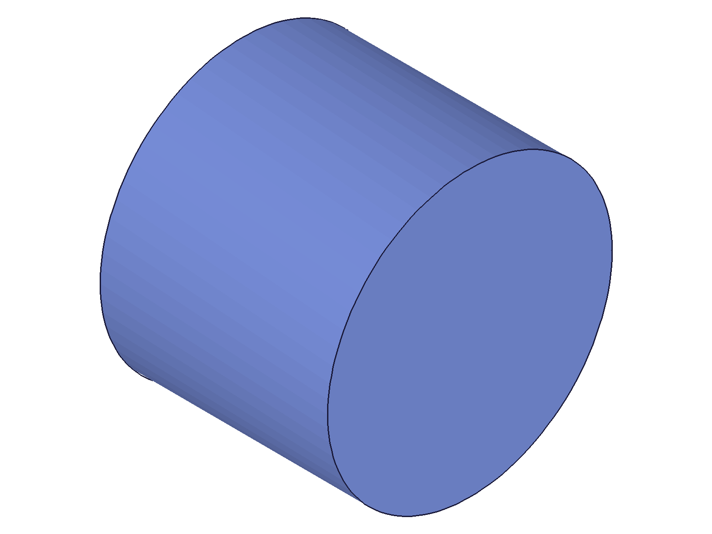
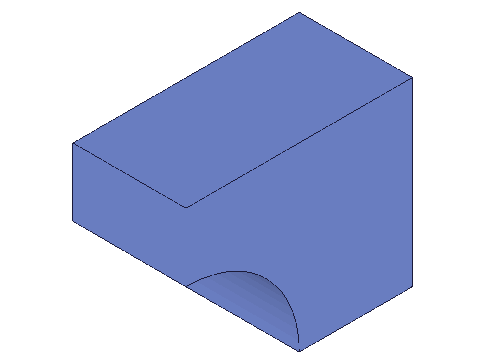
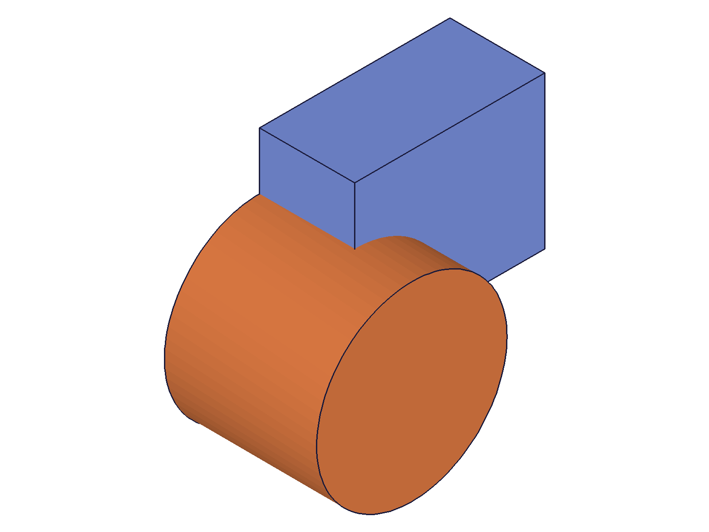
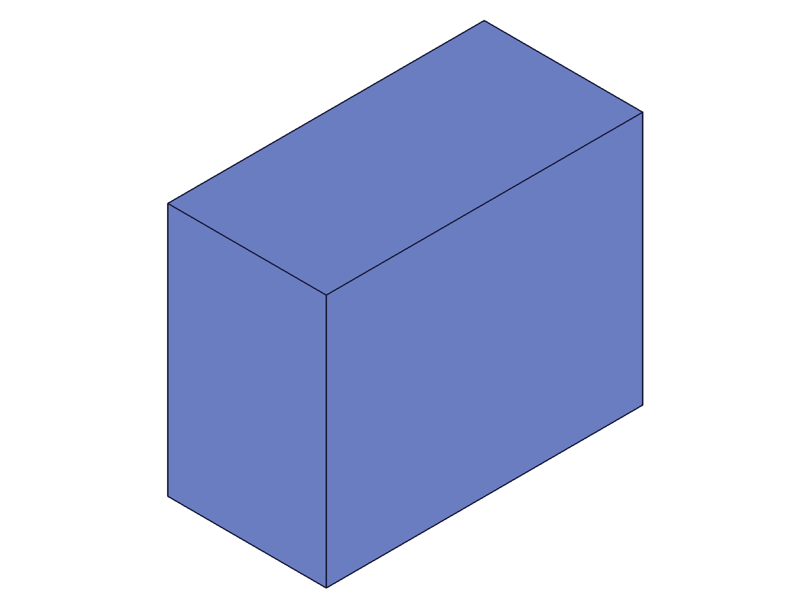

# Training: part.deleteFeature

**Date:** 2026-04-21

## Goal

Testing `v1.part.deleteFeature` — deletes features, work geometries, and sketches by ID.

**Methods to cover:**

- `deleteFeature` — basic single feature deletion (box, cylinder, etc.)
- `deleteFeature` — multi-ID deletion (pass array with multiple IDs)
- `deleteFeature` — deletion of different object types: features, work geometry, sketches
- `deleteFeature` — interaction with dependent features (delete a feature used in a boolean)
- `deleteFeature` — error cases: invalid IDs, wrong ID types, empty array, nonexistent IDs

**Questions:**

- Does it return VOID on success as documented? ✅ Yes
- Can you delete multiple features in one call? ✅ Yes
- What happens when you delete a feature that another feature depends on? ✅ Error 1111 but deletion proceeds
- Does deletion interact with the rollback bar position? ✅ Yes — deletes rolled-back features but with errors
- What error codes and messages are returned for bad inputs? ✅ Documented below
- Can you delete consumed boolean tools? ✅ Yes, with error 1111 on the boolean
- Can you delete a feature while inside openFeature/closeFeature? ✅ Yes, but closeFeature then fails

---

## 01 — basic single feature deletion

Script: `scripts/01-basic-delete.mjs` — ✅ as documented. Returns VOID (null), maxLevel 31, empty messages. Feature is fully removed — `getFeature` returns null with error 51.

|  |
|---|

**Data:** deleteFeature result=null, maxLevel=31, messages=[]. After delete, getFeature("Box") returns null, maxLevel=51.

## 02 — multi-feature deletion

Script: `scripts/02-multi-delete.mjs` — ✅ Multi-ID deletion works. Three features (box, cylinder, sphere) deleted in one call. Same response: null, maxLevel 31, empty messages.

|  |
|---|

**Data:** All three features confirmed gone via getFeature after deletion.

**📌 LLM doc:** Multi-ID deletion is supported — pass all IDs in a single `ids` array.

## 03 — delete different types

Script: `scripts/03-delete-types.mjs` — ✅ All four types accepted: work plane, work axis, sketch, and feature (box). All return null/maxLevel 31.

**Data:** See `files/03-delete-types-delete-types-response.json`. All four deletions returned maxLevel 31 with empty messages.

**📌 LLM doc:** Deletes features, work geometry, AND sketches as documented.

## 04 — delete boolean target

Script: `scripts/04-delete-boolean-dep.mjs` — ⚠️ Deleting the box (target of a boolean subtraction) succeeds in removing the box, but the boolean breaks with error 1111: "There is unrecognized ID as an entity for Subtraction (CC_Subtraction)."

|  |  |
|---|---|

**Data:** result=null, maxLevel=51, error code 1111. Before: box-with-hole. After: only cylinder remains (the tool body).

**Learned:** Deletion proceeds even when downstream features reference the deleted feature. The downstream feature (boolean) breaks but the deletion itself happens. maxLevel 51 signals the dependency breakage.

**📌 LLM doc:** Deleting a feature referenced by a boolean produces error 1111 but still deletes the feature. The boolean is left in a broken state.

## 05 — delete the boolean itself

Script: `scripts/05-delete-boolean-itself.mjs` — ✅ Clean success. Deleting the boolean operation restores both the target (box) and tool (cylinder) as separate bodies.

|  |  |
|---|---|

**Data:** result=null, maxLevel=31. After delete, getFeature("Box") returns ID 54, getFeature("Cylinder") returns ID 91 — both survive with original IDs.

**Learned:** Deleting a boolean operation is safe — the operands are preserved, each returning to its independent state.

**📌 LLM doc:** Deleting a boolean restores target and tool as separate independent bodies.

## 06 — delete boolean tool

Script: `scripts/06-delete-boolean-tool.mjs` — ⚠️ Same behavior as script 04. Deleting the cylinder (tool of the boolean) produces error 1111 on the boolean.

|  |  |
|---|---|

**Data:** result=null, maxLevel=51, error 1111. The boolean is left broken — same as deleting the target.

**📌 LLM doc:** Both target and tool deletion break a boolean with error 1111. Delete the boolean first, then delete the operands.

## 07 — error cases

Script: `scripts/07-error-cases.mjs` — comprehensive error testing.

**Data:** See `files/07-error-cases-error-cases.json`.

| Input | maxLevel | Code | Message |
|---|---|---|---|
| Invalid ID (999999) | 51 | 1006 | "An element of parameter \"ids\" has an invalid id!" |
| Part ID (wrong type) | 51 | 1001 | "wrong id type — provide only: [feature, workgeometry, sketch]" |
| Empty array `[]` | 31 | — | No error, silent no-op |
| Missing `ids` param | 51 | 1004 | "must be provided in the api call!" |
| ID = 0 | 51 | 1006 | "invalid id!" |
| Double delete (already-deleted ID) | 51 | 1006 | "invalid id!" |

**Learned:** Empty array is a silent no-op. Double-deleting is treated as "invalid id" — the ID ceases to exist after first deletion.

**📌 LLM doc:** Document all error codes. Empty `ids: []` is a no-op, not an error. Double-delete gives error 1006.

## 08 — rollback bar interaction

Script: `scripts/08-rollback-interaction.mjs` — ⚠️ Dangerous behavior discovered.

**Data:** See `files/08-rollback-interaction-rollback-interaction.json`.

- Deleting a rolled-back feature (sphere): returns maxLevel 51 with internal errors ("Index N ausserhalb des Arraybereichs", "objId not found"). BUT the feature is removed from the tree.
- Deleting an active feature while rolled back (cylinder): maxLevel 31, clean success.
- After moveToEnd: box survives, cylinder and sphere both gone.

**Learned:** deleteFeature works on rolled-back features despite reporting errors. The errors are misleading — the deletion still takes effect. Active features during rollback delete cleanly.

**📌 LLM doc:** Do NOT delete rolled-back features — it produces errors but still removes the feature, leaving the model in a potentially inconsistent state. Delete active features only.

## 09 — mixed valid and invalid IDs

Script: `scripts/09-mixed-valid-invalid.mjs` — ✅ Atomic behavior confirmed.

**Data:** Passed [boxId, 999999, cylId]. Result: maxLevel 51, error 1006 on invalid element. Both valid features survived — box and cylinder still findable.

**Learned:** The call is atomic. If ANY ID in the array is invalid, NO features are deleted. The invalid ID poisons the batch.

**📌 LLM doc:** Deletion is atomic — one bad ID in the array prevents all deletions.

## 10 — delete during openFeature

Script: `scripts/10-delete-during-open.mjs` — ⚠️ Dangerous behavior.

**Data:** See `files/10-delete-during-open-open-interaction.json`.

- Delete cylinder while box is open: maxLevel 31 (success)
- Delete the opened box itself: maxLevel 31 (success)
- closeFeature: maxLevel 51, error 1001 "wrong id type"

**Learned:** deleteFeature works during an openFeature editing session, but it corrupts the editing context. closeFeature fails afterward.

## 11 — rollback delete verification

Script: `scripts/11-rollback-verify.mjs` — Confirms script 08 finding.

**Data:** See `files/11-rollback-verify-rollback-verify.json`.

- getFeature before delete: ID 91 (found)
- Delete rolled-back cylinder: maxLevel 51 (errors)
- getFeature after errored delete (still rolled back): null (GONE)
- getFeature after moveToEnd: null (still gone)

**Learned:** Confirmed — deleting a rolled-back feature permanently removes it despite error-level messages. The feature is gone immediately, not just after moveToEnd.

## 12 — open/delete/close (different feature)

Script: `scripts/12-open-delete-verify.mjs` — ⚠️ Confirms: deleting ANY feature while inside openFeature breaks closeFeature.

**Data:** See `files/12-open-delete-verify-open-delete-verify.json`.

- Delete cylinder while box is open: maxLevel 31
- closeFeature(partId): maxLevel 51, error 1001 "wrong id type — provide only: [feature, workgeometry, sketch, constraint, relation]"
- Box survives (ID 54), cylinder is gone

**Learned:** Even deleting a *different* feature during an editing session breaks closeFeature. The editing context is corrupted by any deletion.

**📌 LLM doc:** NEVER call deleteFeature while inside openFeature/closeFeature. It corrupts the editing context and closeFeature will fail.

## 13 — delete with downstream fillet (skipped)

Script: `scripts/13-delete-with-downstream.mjs` — `getBrepGeometryIndex` returned null (no brep data available in CLI context). Fillet downstream test skipped. Boolean dependency test (scripts 04-06) already covers the dependency behavior pattern.

## 14 — delete built-in origin geometry

Script: `scripts/14-delete-builtin.mjs` — ⚠️ Built-in origin geometry CAN be deleted!

**Data:** getWorkGeometry("Top") returned ID 38. deleteFeature({ids: [38]}) returned maxLevel 31 — clean success.

**Learned:** Built-in origin planes (Top, Front, Right) can be deleted. This is dangerous — other features that reference origin planes would break.

**📌 LLM doc:** Built-in origin work geometry CAN be deleted. Be careful not to delete origin planes/axes that other features reference.
