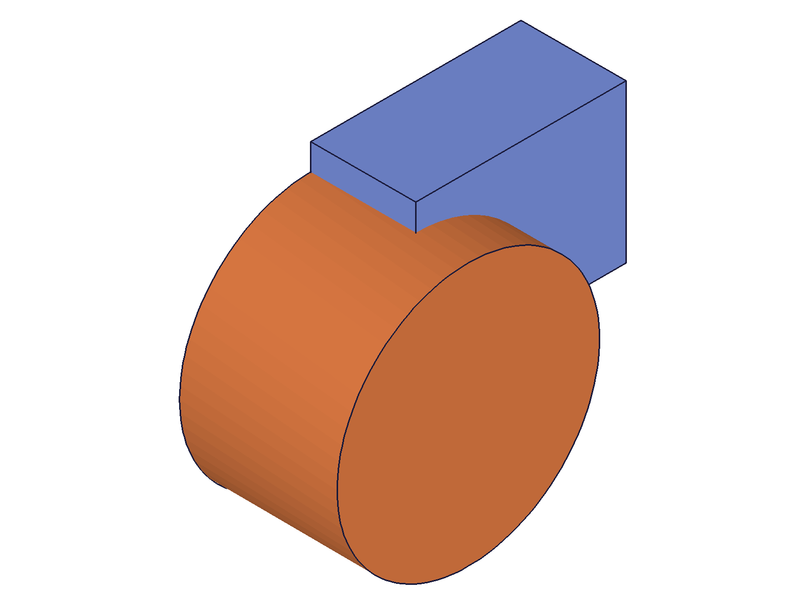
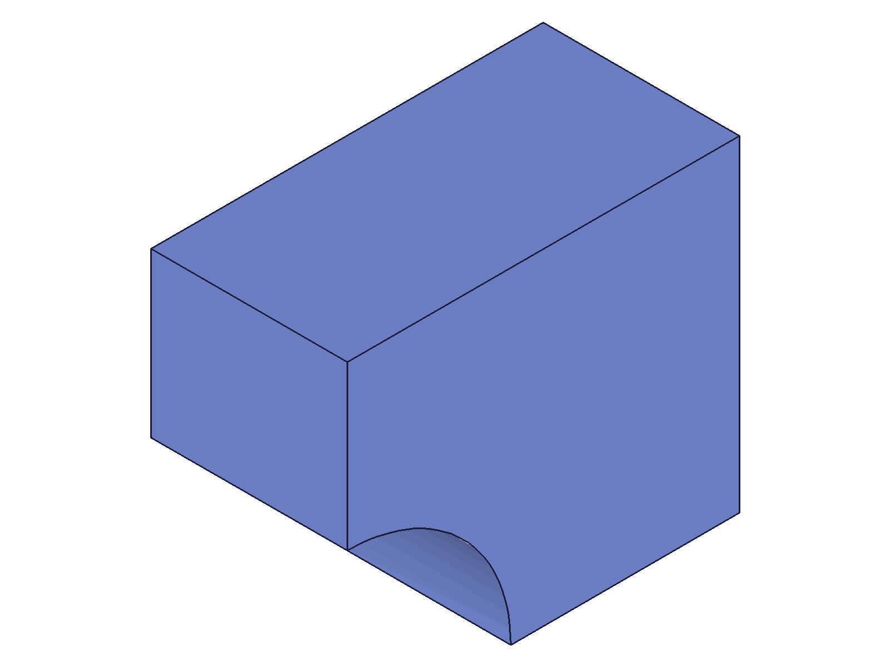

# Training: RollbackBar vs GhostRollbackBar

**Date:** 2026-04-21

## Goal

Studying the two rollback mechanisms in ClassCAD's feature tree: the persistent RollbackBar (controlled by `operationMoveBefore`/`operationMoveToEnd`) and the temporary GhostRollbackBar (controlled by `openFeature`/`closeFeature`). Understanding how they interact and how `openFeature` enables mid-tree editing without destroying downstream features.

**Questions to answer:**

- Is the GhostRollbackBar visible as a node in the structure tree?
- When `openFeature` is called, what happens to downstream features' visibility and geometry?
- How does `closeFeature` restore state and recalculate?
- Can we observe the difference between RollbackBar and GhostRollbackBar positions in the structure tree?
- What happens when `operationMoveBefore` and `openFeature` are combined?
- If a mid-tree feature is opened and updated, do downstream features (booleans, patterns) survive and recalculate?
- Can you `openFeature` on a feature behind the RollbackBar?
- What is the state of graphic/geometry data during an open session?

---

## 01 — baseline structure

Script: `scripts/01-baseline-structure.mjs` — ✅ Created 3-feature part and inspected the structure tree.

**Data:** OperationSequence (id=18) has 11 children. RollbackBar (id=20) is a `CC_RollbackBar` node with `parent=18`. No `CC_GhostRollbackBar` node exists in the tree.

**Learned:** GhostRollbackBar is NOT a distinct node in the structure tree. The structure tree JSON is keyed by node ID — sibling order was not initially observable via `Object.values()` filter.

## 02 — structure during openFeature

Script: `scripts/02-open-feature-structure.mjs` — ✅ Opened the middle feature (Cyl1) and compared structure tree before, during, and after.

|  |  |  |
|---|---|---|

**Data:** OperationSequence children are identical in all three states (same node list, same flags=4096). No ghost nodes appear. All features remain findable by `getFeature` (Box1=54, Cyl1=91, Sph1=110) during openFeature.

**Learned:** `openFeature` does not change the structure tree representation. No nodes are hidden, added, or removed. The "visibility" changes mentioned in the API doc are internal to the rendering engine, not exposed via the structure tree API.

## 03 — graphic data during openFeature

Script: `scripts/03-graphic-during-open.mjs` — ⚠️ `requestVisualisation` returns 0 meshes in CLI mode (before, during, and after openFeature).

**Learned:** The graphic mesh data is not available in CLI worker mode. Cannot verify body visibility changes through this path. Snapshots are the only visual evidence available.

## 04 — operationMoveBefore vs openFeature capabilities

Script: `scripts/04-movebefore-vs-open.mjs` — ✅ Key behavioral comparison.

**Data:**

| Operation | operationMoveBefore | openFeature |
|---|---|---|
| Create new feature | ✅ OK (inserted at bar position) | ❌ "still an open feature" |
| Update different feature | ❌ "not active and open" | ❌ "not active and open" |
| Update target feature | N/A (no "target") | ✅ OK |

**Learned:** The two mechanisms serve fundamentally different purposes:
- **RollbackBar** (`operationMoveBefore`): Controls design tree position. Allows feature creation at the bar position but NOT editing. A history cursor.
- **GhostRollbackBar** (`openFeature`): Creates an exclusive editing context for one feature. Blocks all other operations (creation and editing other features). An edit lock.

📌 LLM doc: This is the core distinction — document it clearly.

## 05 — mid-tree edit with downstream boolean

Script: `scripts/05-mid-tree-boolean-survival.mjs` — ✅ Box → Cylinder → Boolean(subtraction). Opened and updated the Box, then closed. Boolean survived and recalculated.

|  |  |
|---|---|

**Data:** Box updated from 80×60×40 to 120×100×60. After closeFeature, boolean `BoolSub` (id=110) still exists. The visual shows the box grew and the cylindrical cutout is now proportionally smaller. maxLevel=31 throughout (no errors).

**Learned:** `openFeature` + `update*` + `closeFeature` enables true mid-tree parametric editing. Downstream features (booleans, etc.) survive and recalculate automatically on `closeFeature`. No need to delete and recreate.

📌 LLM doc: Mid-tree editing is safe — downstream features recalculate.

## 06 — openFeature on rolled-back feature

Script: `scripts/06-open-behind-rollbackbar.mjs` — ✅ Rolled bar before Sph1, then opened Sph1 (behind the bar). Both openFeature and updateSphere succeeded (maxLevel=31).

**Data:** openFeature(sph) behind the RollbackBar: maxLevel=31. updateSphere(sph, radius=30): maxLevel=31. Also tested openFeature(box) on a visible feature: maxLevel=31.

**Learned:** `openFeature` works on features regardless of their position relative to the RollbackBar. The GhostRollbackBar operates independently of the RollbackBar.

📌 LLM doc: openFeature works on rolled-back features.

## 07 — combined interaction

Script: `scripts/07-combined-interaction.mjs` — ✅ Tested `operationMoveBefore`/`operationMoveToEnd` while a feature is open.

**Data:**
- `operationMoveBefore` during openFeature: maxLevel=31 ✅
- `operationMoveToEnd` during openFeature: maxLevel=31 ✅
- Feature creation during openFeature + moveBefore: maxLevel=51 ❌ "still an open feature"

**Learned:** The RollbackBar can be moved freely while the GhostRollbackBar is active. The openFeature edit lock takes priority — feature creation is always blocked when a feature is open, regardless of RollbackBar position.

📌 LLM doc: RollbackBar operations work during openFeature. Creation is still blocked.

## 08 — node flags across states

Script: `scripts/08-flags-during-states.mjs` — ✅ Compared node flags across all-active, moveBefore, and openFeature states. All flags are `4096` in every state.

**Data:** BoxRef, CylinderRef, SphereRef, and RollbackBar all have flags=4096 regardless of bar positions.

**Learned:** The structure tree node `flags` field does not encode rollback state. Rolled-back vs active features are indistinguishable by flags.

## 09 — OperationSequence children ordering

Script: `scripts/09-opseq-ordering.mjs` — ✅ **Major finding.** The `children` field is an **ordered array** and the RollbackBar physically moves position within it.

**Data:**

Default (bar at end):
```
children: [24, 28, 32, 36, 40, 44, 48, 56, 93, 112, 20]
                                                     ^^^ RollbackBar at end
```

After `moveBefore(cylId)`:
```
children: [24, 28, 32, 36, 40, 44, 48, 56, 20, 93, 112]
                                             ^^^ RollbackBar before CylRef
```

Also found `editFeatureIndex` member on the OperationSequence node: value `-1` when no feature is open.

📌 LLM doc: RollbackBar position is visible in children array order. editFeatureIndex tracks GhostRollbackBar.

## 10 — editFeatureIndex as GhostRollbackBar indicator

Script: `scripts/10-editfeatureindex.mjs` — ✅ **Key finding.** `editFeatureIndex` on the OperationSequence node tracks which feature is open (GhostRollbackBar position).

**Data:**

| State | editFeatureIndex | Meaning |
|---|---|---|
| Baseline (nothing open) | -1 | No feature being edited |
| openFeature(boxId) | 7 | BoxRef at children[7] |
| openFeature(cylId) | 8 | CylinderRef at children[8] |
| openFeature(sphId) | 9 | SphereRef at children[9] |
| After closeFeature | -1 | Edit session ended |

**Learned:** The GhostRollbackBar is NOT a physical node — it's tracked by the `editFeatureIndex` member. The value is the index into the OperationSequence `children` array. `-1` = no feature open. The `children` array does NOT change during openFeature — only the RollbackBar's physical position changes via `operationMoveBefore`.

📌 LLM doc: This is the key structural difference. RollbackBar = physical node position. GhostRollbackBar = virtual index.

## 11 — isDirty tracking

Script: `scripts/11-isdirty-tracking.mjs` — ✅ `isDirty` member tracks whether updates were made during the current editing session.

**Data:**

| State | editFeatureIndex | isDirty |
|---|---|---|
| Baseline | -1 | 0 |
| After open | 7 | 0 |
| After update | 7 | 1 |
| After second update | 7 | 1 |
| After close | -1 | 0 |
| Open without update | 8 | 0 |
| Close without update | -1 | 0 |

**Learned:** `isDirty` becomes 1 only when an actual `update*` call is made. It resets to 0 on `closeFeature` (when RollbackBar is at end, meaning full recalculation occurs). Open/close without updates keeps isDirty at 0.

## 12 — combined indicators with mid-tree RollbackBar

Script: `scripts/12-combined-indicators.mjs` — ✅ Both bars active simultaneously. RollbackBar mid-tree + openFeature on earlier feature.

**Data:**

| State | editFeatureIndex | isDirty | RollbackBar index |
|---|---|---|---|
| Baseline | -1 | 0 | 10 (end) |
| moveBefore(sph) + openFeature(box) | 7 | 0 | 9 (before sph) |
| After update | 7 | 1 | 9 |
| After closeFeature | -1 | **1** | 9 |
| After moveToEnd | -1 | 0 | 10 (end) |

**Learned:** When the RollbackBar is mid-tree, `closeFeature` resets `editFeatureIndex` to -1 BUT `isDirty` stays 1. This means `closeFeature` commits the feature edit but does NOT replay downstream features that are behind the RollbackBar. The full recalculation only happens when `operationMoveToEnd` moves the bar forward, replaying those features. At that point `isDirty` returns to 0.

📌 LLM doc: isDirty semantics differ based on RollbackBar position. Full recalc only happens when bar reaches or passes the modified features.

---

## Summary

All 8 questions answered:

1. **GhostRollbackBar visible as node?** NO — it's tracked by `editFeatureIndex` member on the OperationSequence node.
2. **Downstream features during openFeature?** Unchanged in structure tree. All remain findable. Rendering appears unchanged in CLI mode.
3. **closeFeature restore and recalculate?** Resets `editFeatureIndex` to -1. Recalculates downstream features from the edit point to the RollbackBar position (NOT beyond the RollbackBar if it's mid-tree).
4. **Observable difference in structure tree?** YES — RollbackBar position in `children` array; GhostRollbackBar as `editFeatureIndex`; `isDirty` for modification tracking.
5. **Combined operationMoveBefore + openFeature?** Both work independently. RollbackBar operations succeed during openFeature. Feature creation is still blocked by the edit lock.
6. **Mid-tree booleans survive?** YES — downstream features survive and recalculate on closeFeature.
7. **openFeature on rolled-back features?** YES — works regardless of RollbackBar position.
8. **Graphic data during open?** Not available in CLI mode (0 meshes from `requestVisualisation`).
