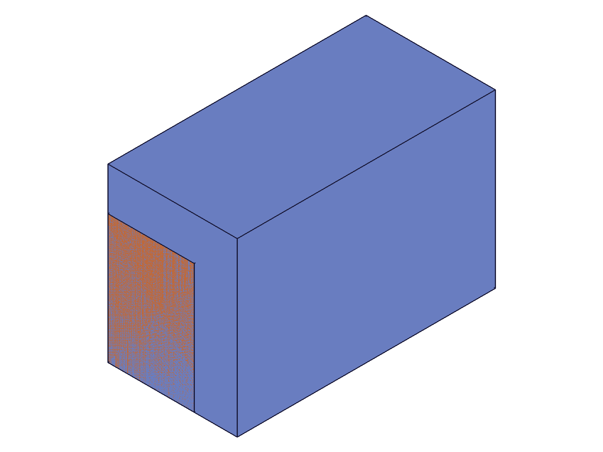
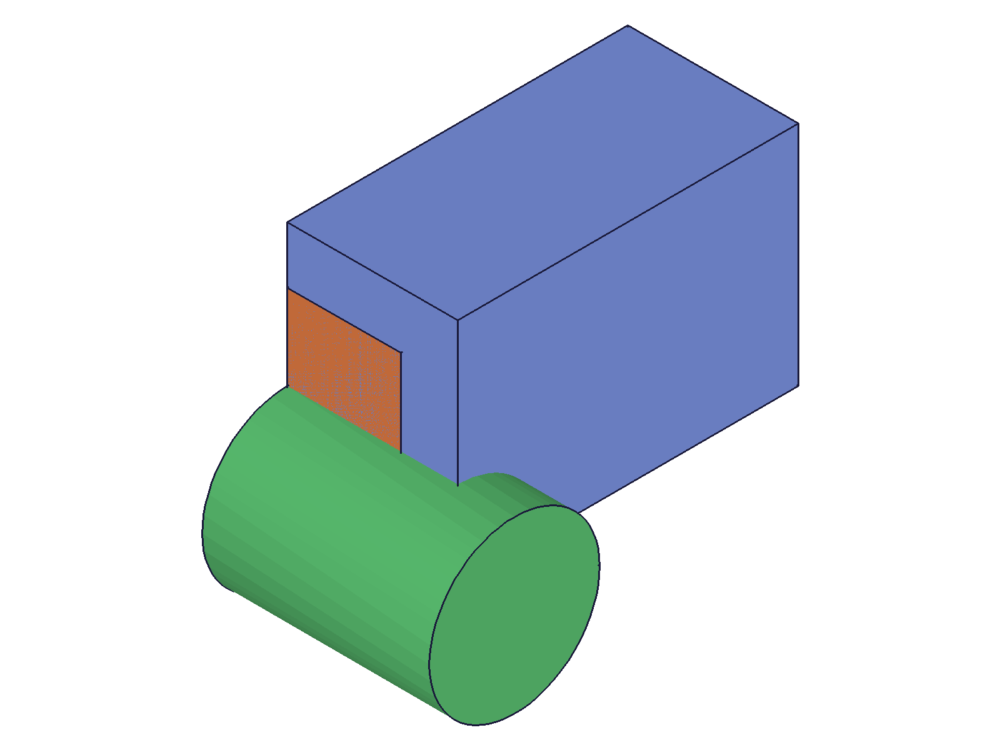
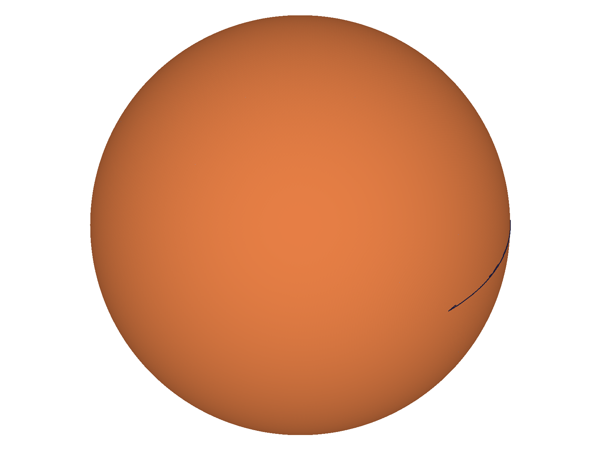
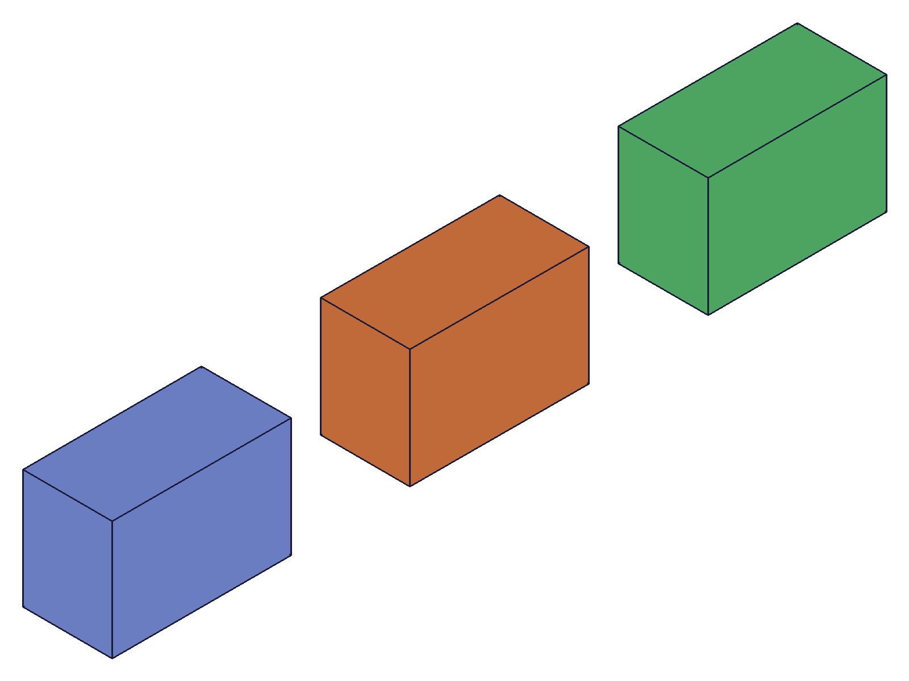
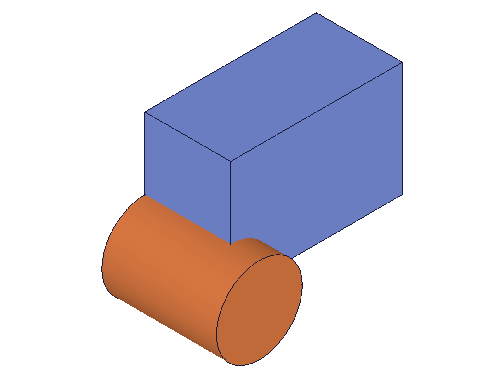
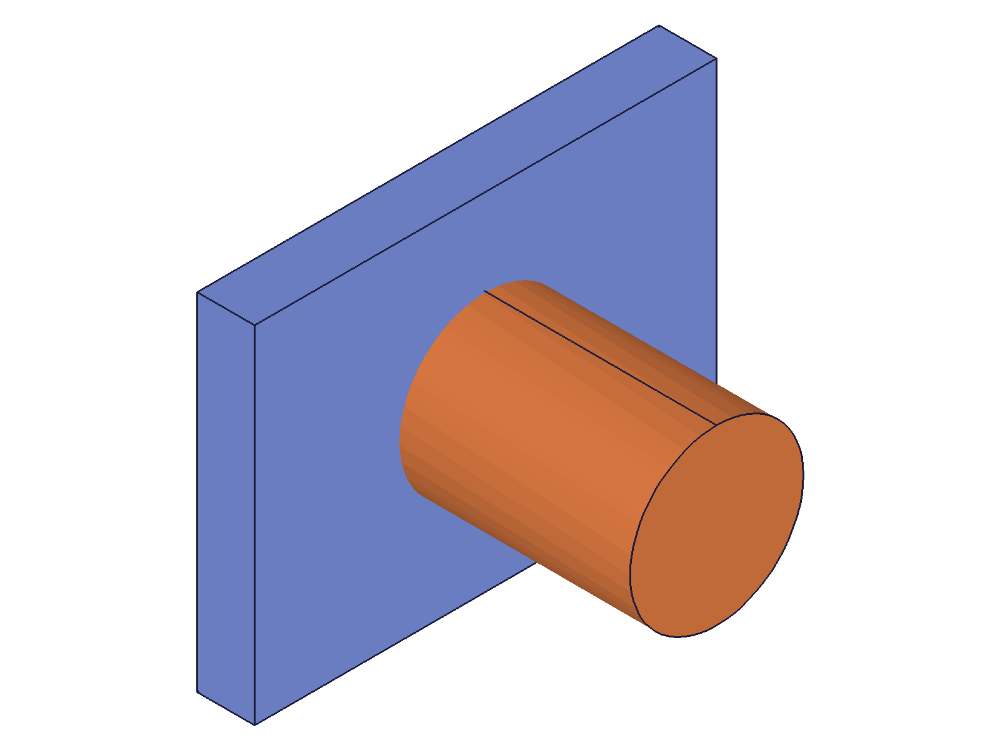
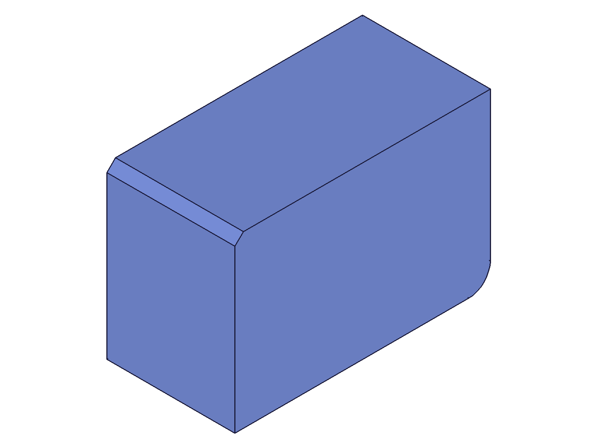
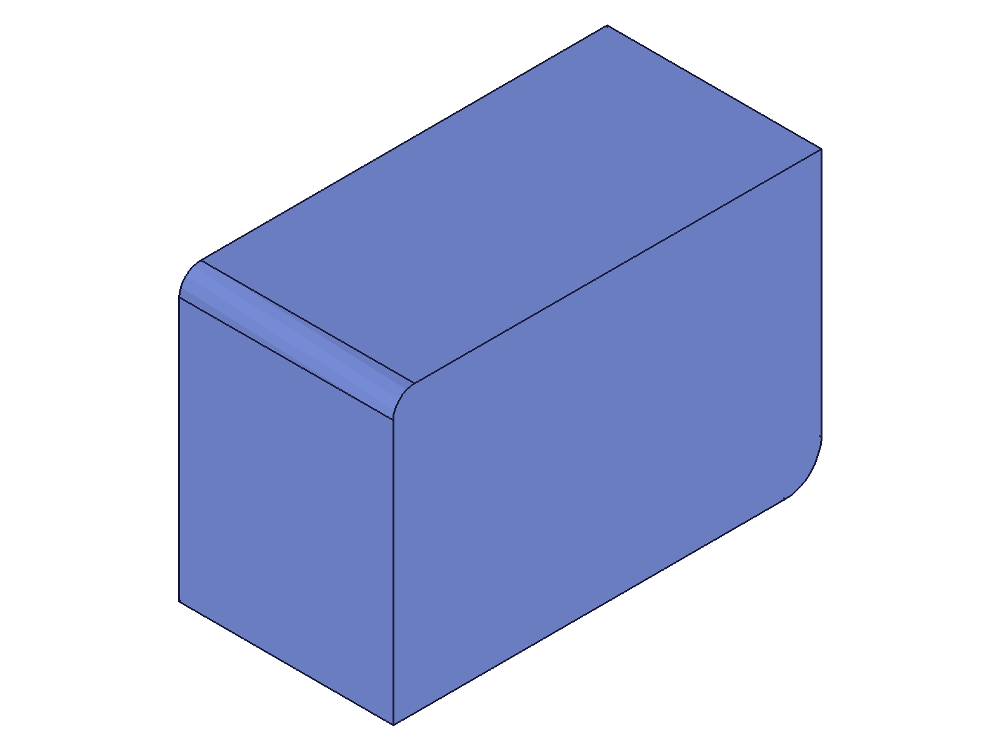
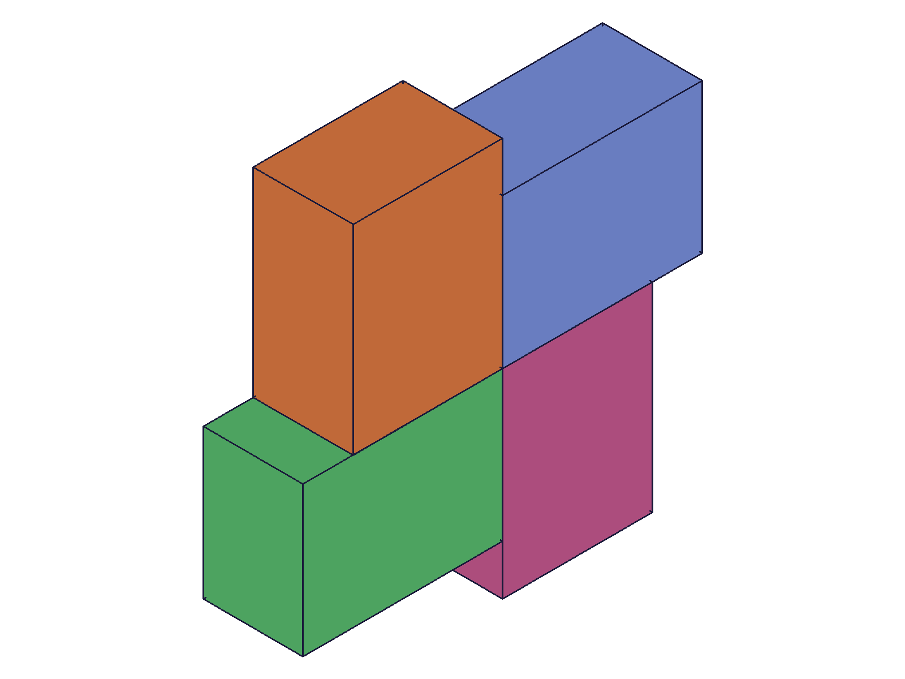

# Training: part.setAppearance

**Date:** 2026-04-21

## Goal

Testing `v1.part.setAppearance` — the part-domain variant of `common.setAppearance`.

**Methods to cover:**

- `part.setAppearance` — basic color + transparency on a part feature
- `part.setAppearance` — per-solid indexing on multi-solid features (boolean results, patterns)
- `part.setAppearance` — batch (array) form
- `part.setAppearance` — faceting overrides (chordHeightTol, angleTol)
- Compare `part.setAppearance` vs `common.setAppearance` — same or different?

**Questions:**

- Does `part.setAppearance` accept all the same targets as `common.setAppearance`?
- Does it work on entity injection features or only part features?
- Can you target individual solids within pattern features using indices?
- Does appearance from `part.setAppearance` persist through save/load?
- Are there any behavioral differences from `common.setAppearance`?
- How does `part.setAppearance` interact with features that produce multiple solids (booleans, patterns)?

---

## 01 — basic color on part feature

Script: `scripts/01-basic-color.mjs` — ✅ `part.setAppearance` succeeds with `result: null`, `maxLevel: 31`. Set color `[255,0,0]` + transparency `0.3` on a `part.box` feature. `requestVisualisation` returned null graphic in CLI mode — cannot use for read-back in harness.

|  |
|---|

**Data:** `result: null`, `maxLevel: 31`, no messages (see `files/01-basic-color-set-result.json`).

## 02 — verify readback

Script: `scripts/02-verify-readback.mjs` — ✅ confirmed `requestVisualisation` returns null for both `result` and `graphic` in CLI mode. Not usable for appearance read-back in this harness.

|  |
|---|

**Data:** `vis.result: null`, `vis.graphic: null`. No way to read back stored appearance in CLI mode.

## 03 — target types

Script: `scripts/03-target-types.mjs` — ✅ target type behavior matches `common.setAppearance` exactly.

|  |
|---|

**Data** (from `files/03-target-types-target-types.json`):

| Target | maxLevel | Verdict |
|---|---|---|
| Part feature (box) | 31 | ✅ |
| Part container ID | 51 | ❌ error 1007 "must be an operation id" |
| Entity injection feature | 31 | ✅ |
| Direct solid ID | 31 | ✅ |
| Sketch ID | 51 | ❌ error 1007 |
| Work plane ID | 51 | ❌ error 1007 |

📌 LLM doc: Same valid target types as `common.setAppearance`. No part-domain-specific differences.

## 04 — per-solid indexing

Script: `scripts/04-per-solid-index.mjs` — ✅ indexing works, edge cases match `common.setAppearance`.

|  |  |
|---|---|

**Data** (from `files/04-per-solid-index-index-results.json`):

- `{ id: boxId, indices: [0] }` → maxLevel 31 ✅
- `{ id: boxId, indices: [1] }` → maxLevel 51 ❌ "objId not found" (OOR)
- `{ id: boxId, indices: [] }` → maxLevel 31 (silent no-op)

## 05 — batch (array) form

Script: `scripts/05-batch-form.mjs` — ✅ batch form works. Can mix plain target IDs and `{ id, indices }` objects.

|  |  |
|---|---|

**Data:** Both batch calls returned `result: null`, `maxLevel: 31`.

## 06 — part vs common comparison

Script: `scripts/06-part-vs-common.mjs` — ✅ the two APIs are fully interchangeable. Each can overwrite the other's settings.

|  |
|---|

**Data:** All four calls (part→box1, common→box2, common overwrite part, part overwrite common) → maxLevel 31.

📌 LLM doc: `part.setAppearance` and `common.setAppearance` are interchangeable. They set the same underlying appearance data.

## 07 — faceting override

Script: `scripts/07-faceting-override.mjs` — ✅ per-feature faceting works via `part.setAppearance`. Combined color+faceting in a single call also works.

|  |  |
|---|---|

**Data:** `chordHeightTol: 5.0, angleTol: 45` (coarse) and `chordHeightTol: 0.01, angleTol: 1` (fine) both maxLevel 31. The before/after snapshots show different tessellation density, confirming the faceting override takes effect.

## 08 — linear pattern indices

Script: `scripts/08-pattern-indices.mjs` — ✅ linear pattern (3 instances) supports per-instance indexing via `{ id: lpId, indices: [N] }`.

|  |  |
|---|---|

**Data:**

- Indices [0], [1], [2] → maxLevel 31 ✅
- Index [3] → maxLevel 51 ❌ "objId not found" (OOR — pattern has 3 instances)
- Multiple indices [0,2] → maxLevel 31 ✅

📌 LLM doc: Pattern features support per-instance coloring via indices. Count N → valid indices 0 to N-1.

## 09 — edge cases

Script: `scripts/09-edge-cases.mjs` — ✅ all edge cases match `common.setAppearance`.

**Data** (from `files/09-edge-cases-edge-results.json`):

| Test | maxLevel | Notes |
|---|---|---|
| No properties (just target) | 31 | Silent no-op |
| Color only | 31 | ✅ |
| Transparency only | 31 | ✅ |
| OOR color [-10, 300, 128] | 31 | No validation |
| OOR transparency >1 | 31 | No validation |
| OOR transparency <0 | 31 | No validation |
| Color 2 elements | 51 | Error 1002 "should be 3" |
| Color 4 elements | 51 | Error 1002 "should be 3" |
| Float color values | 31 | Accepted |
| Invalid target (99999) | 51 | Error 1006 "invalid id" |

📌 LLM doc: Same edge case behavior as `common.setAppearance` — no range validation, exact 3-element color required.

## 10 — save/load persistence

Script: `scripts/10-save-load-persist.mjs` — ✅ appearance persists through OFB save/load cycle.

|  |  |
|---|---|

**Data:** Saved (63804 bytes base64), cleared, reloaded. Snapshots are visually identical before and after reload. Renderer uses its own palette so appearance colors aren't visible, but geometry and structure are preserved.

## 11 — extrusion feature target

Script: `scripts/11-extrusion-target.mjs` — ✅ extrusion features accept appearance.

|  |  |
|---|---|

**Data:** Both `target: extId` and `target: boxId` → maxLevel 31. Extrusion features are valid targets.

## 12 — boolean feature target (surprising)

Script: `scripts/12-boolean-target.mjs` — `part.boolean` returns VOID (null), so the boolean feature itself cannot be targeted.

|  |  |
|---|---|

**Data:**

- `target: boolId (null)` → maxLevel 51 ❌ error 1001 "target = VOID is not allowed"
- `target: box1` (boolean input) → maxLevel 31 ✅
- `target: cyl1` (boolean tool) → maxLevel 31 ✅

**Learned:** `part.boolean` returns VOID, not a feature ID. The input features (target, tools) remain valid targets for appearance. This matches the boolean being a VOID-returning modifier.

📌 LLM doc: Boolean features return VOID — color the input features instead.

## 13 — overwrite behavior

Script: `scripts/13-overwrite-behavior.mjs` — ✅ all overwrite patterns succeed (maxLevel 31).

**Data:** Setting color-only, then transparency-only, then both, then faceting-only — all maxLevel 31. Cannot verify whether unspecified properties are preserved or reset (no read-back in CLI mode).

## 14 — fillet/chamfer targets (consumed feature discovery)

Script: `scripts/14-fillet-chamfer-target.mjs` — fillet feature fails with error 1014 (consumed), chamfer succeeds.

|  |  |
|---|---|

**Data:**

- `target: filletId` → maxLevel 51 ❌ error 1014 "Entity 'Fillet1' is not available. It has already been consumed/used in another operation."
- `target: chamferId` → maxLevel 31 ✅ (chamfer is the last feature → still valid)

**Learned:** The fillet was consumed by the subsequent chamfer. Only the "tip" (latest) feature in the design history can be targeted.

📌 LLM doc: Consumed features fail with error 1014. Only the latest feature owning the solid can have appearance set.

## 15 — consumed feature behavior (deep dive)

Script: `scripts/15-consumed-features.mjs` — confirms the consumed feature pattern systematically.

|  |
|---|

**Data** (from `files/15-consumed-features-consumed-results.json`):

| Scenario | maxLevel | Notes |
|---|---|---|
| Box before fillet created | 31 | ✅ works when box is the tip |
| Box AFTER fillet created | 51 | ❌ 1014: consumed by fillet |
| Fillet (tip) | 31 | ✅ |
| Fillet after second fillet | 51 | ❌ 1014: consumed by fillet2 |
| Fillet2 (new tip) | 31 | ✅ |

**Learned:** Each new downstream feature consumes its predecessor. Only the **final feature in the chain** can have appearance set. This is the feature tree's design-history enforcement.

📌 LLM doc: Critical gotcha — consumed features error 1014. Target the tip feature, not predecessors.

## 16 — circular pattern (wrong params)

Script: `scripts/16-circular-pattern-indices.mjs` — `circularPattern` returned VOID because I used `axis: { references: [...] }` instead of `references: [...]`. All appearance calls failed since `cpId` was null.

**Data:** `cpId: null`. All index attempts → error 1001.

**Learned:** `circularPattern` takes `references` at the top level, not nested in an `axis` object.

## 17 — circular pattern (fixed)

Script: `scripts/17-circ-pattern-fixed.mjs` — ✅ fixed params, circular pattern works. Per-instance indexing confirmed.

|  |  |
|---|---|

**Data:** `cpId: 99`. Indices [0], [1], [2], [3] all maxLevel 31. Count=4 → 4 valid indices (0-3). Note: with `angle: 1.5708` (90°) and `count: 4`, only 3 additional copies are created (the original + 3 copies = 4 instances).

📌 LLM doc: Circular pattern indexing works the same as linear pattern.

## 18 — common.setAppearance also fails on consumed features

Script: `scripts/18-common-vs-consumed.mjs` — **both APIs fail identically on consumed features.**

**Data:**

- `part.setAppearance` on consumed box → maxLevel 51, error 1014
- `common.setAppearance` on consumed box → maxLevel 51, error 1014
- Both succeed on the fillet (tip) → maxLevel 31

**Learned:** The consumed-feature restriction is NOT specific to `part.setAppearance`. Both APIs enforce the same design-history rule. The existing `common.setAppearance` doc should be updated.

📌 LLM doc: Update `common/setAppearance.md` with the consumed-feature error 1014 finding.

---

## Summary

`part.setAppearance` is functionally identical to `common.setAppearance`. All tested behaviors match:
- Same parameters, return value, target types, error codes
- Same consumed-feature restriction (error 1014)
- Same batch form, per-solid indexing, pattern indexing
- Same edge case handling (no range validation, 3-element color required)
- Appearance persists through OFB save/load

The consumed-feature restriction (error 1014) is the most significant finding for agents — it was not documented in the existing `common.setAppearance` LLM doc.
