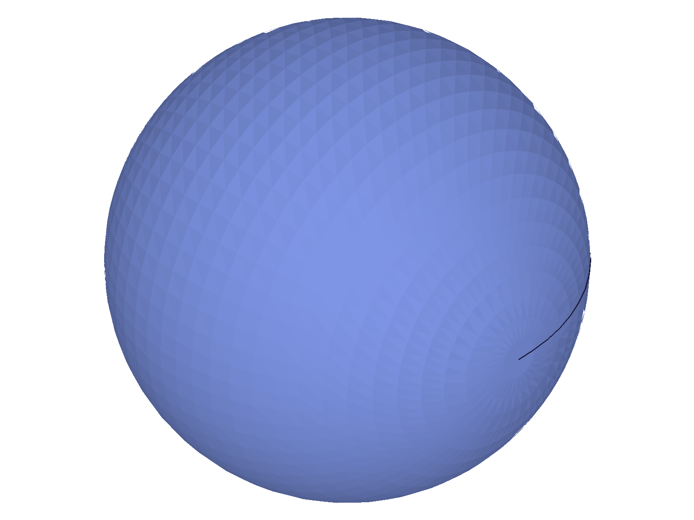
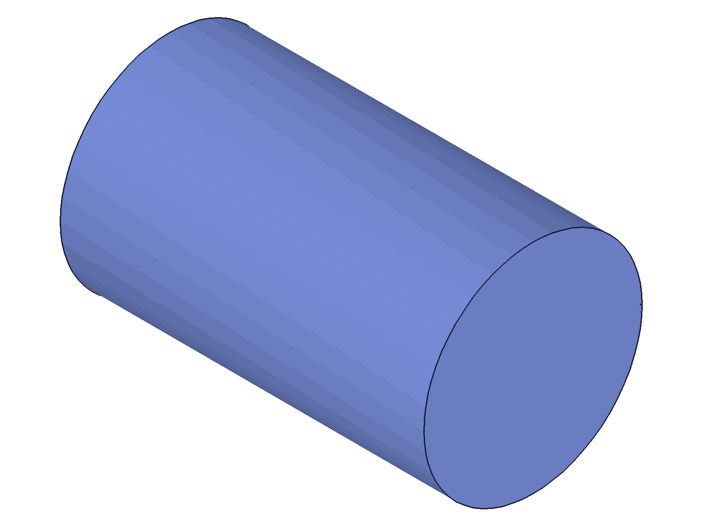
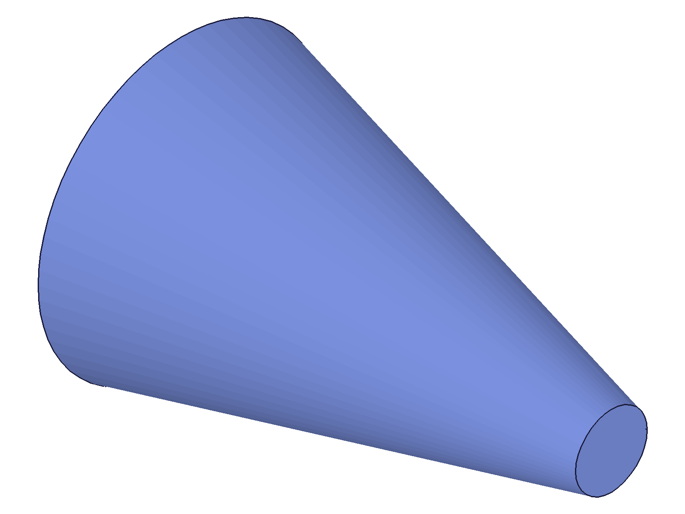
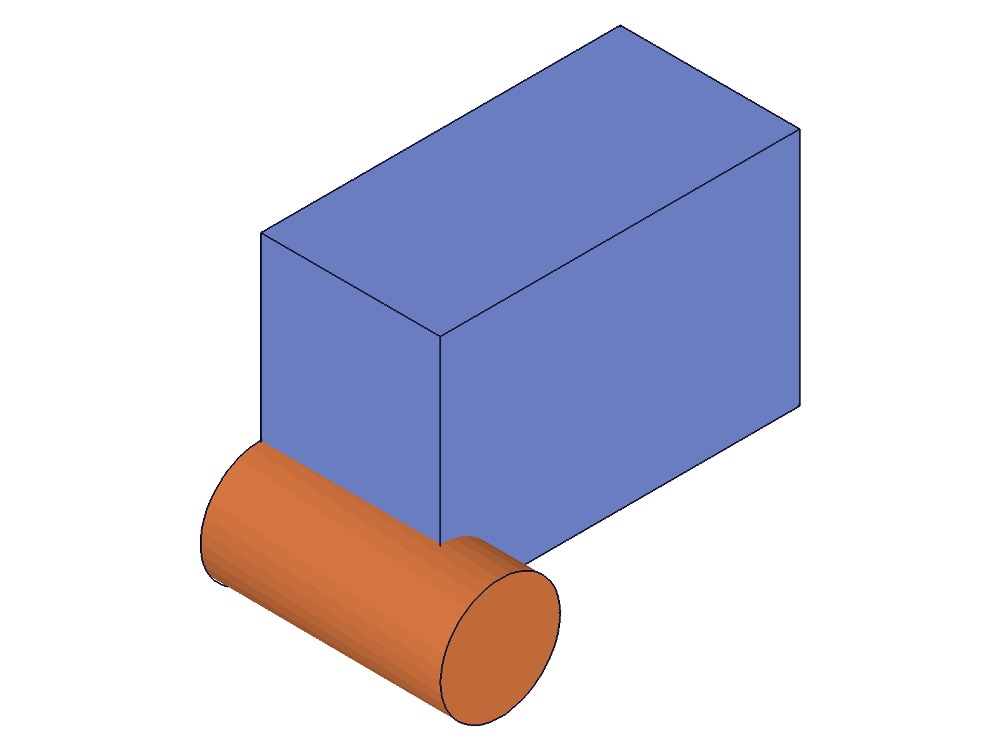
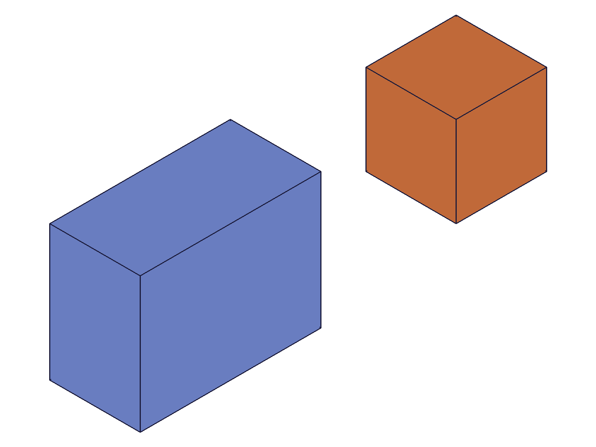
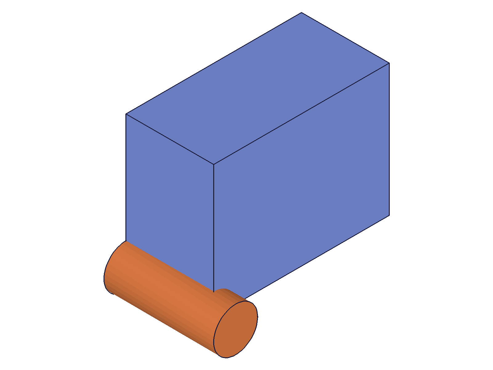
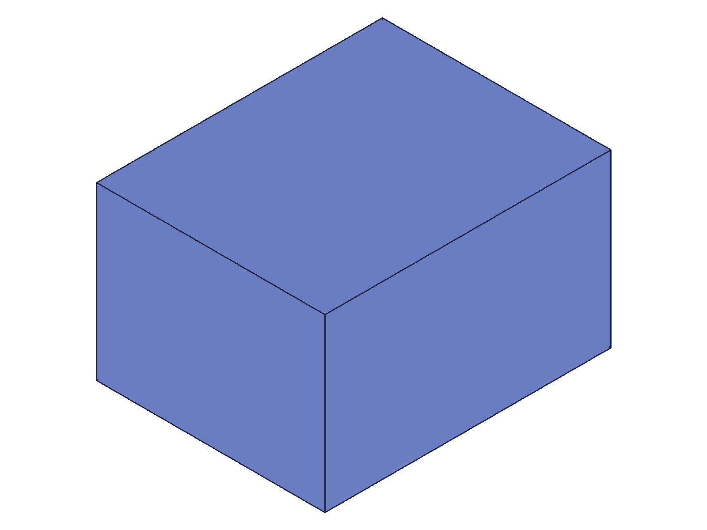
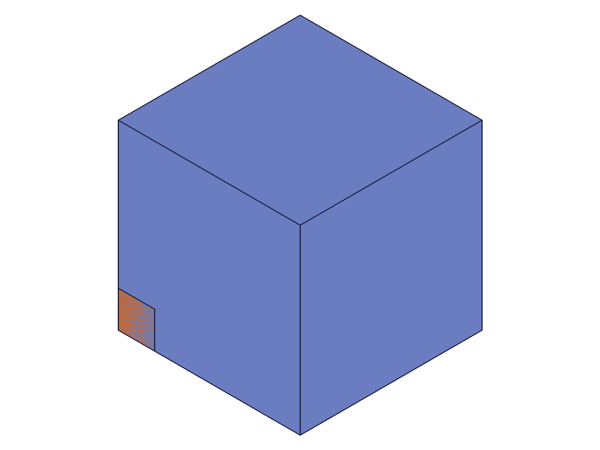
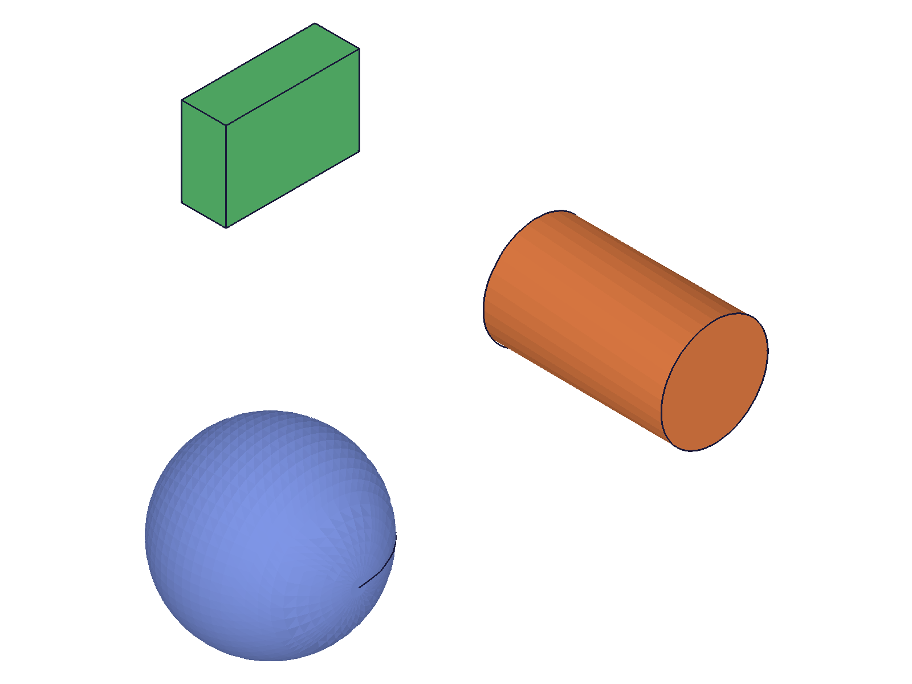
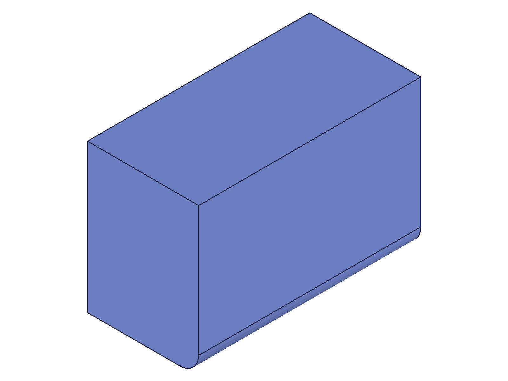

# Training: part.calculateMassProperties

**Date:** 2026-04-21

## Goal

Testing `v1.part.calculateMassProperties` — calculates center of gravity (cog) and volume for a given object.

**Methods to cover:**

- `calculateMassProperties` with part ID (single part with one solid)
- `calculateMassProperties` with part ID (multiple solids via boolean/features)
- `calculateMassProperties` with feature ID (individual feature)
- `calculateMassProperties` with entity injection + direct solids
- `calculateMassProperties` with solid ID (direct solid)
- Return value structure: `{ cog: point, volume: real }`
- Volume accuracy: compare known primitives (box, sphere, cylinder) against expected values
- COG accuracy: verify center of gravity for symmetric shapes
- Edge cases: empty part, invalid ID, consumed feature
- Assembly-level usage (if possible within part context)

**Questions:**

- Does `id` accept feature IDs, solid IDs, or only part IDs?
- What happens with an empty part (no geometry)?
- Is volume in cubic mm (matching the mm coordinate system)?
- How does COG behave with multiple solids?
- Does it work on entity injection features with multiple direct solids?
- What does it return for a consumed/intermediate feature?

---

## 01 — box basic

Script: `scripts/01-box-basic.mjs` — ✅ Box 60×40×30 returns exact volume=72000, COG=[30,20,15].

|  |
|---|

**Data:** volume=72000 (exact), COG={x:30, y:20, z:15} (exact center of box). maxLevel=31 (info). See `files/01-box-basic-mass-props-box.json`.

**Learned:** Volume is in mm³ (consistent with mm coordinate system). COG for a box at origin equals half-dimensions. Return value uses maxLevel=31 on success.

---

## 02 — sphere

Script: `scripts/02-sphere.mjs` — ✅ Sphere r=25 volume close to analytical.

|  |
|---|

**Data:** volume=65458.95 (expected 65449.85, diff ~9.1 mm³ = 0.014%). COG={x:~0, y:~0, z:~0} (floating-point zero). See `files/02-sphere-mass-props-sphere.json`.

**Learned:** Curved geometry volumes have small numerical error from B-rep integration (~0.01%). COG at origin for centered sphere — coordinate values are floating-point noise (e-15 range).

---

## 03 — cylinder

Script: `scripts/03-cylinder.mjs` — ✅ Cylinder d=30, h=50 volume close to analytical.

|  |
|---|

**Data:** volume=35342.21 (expected 35342.92, diff ~0.70 mm³). COG z=24.996 (expected 25.0). See `files/03-cylinder-mass-props-cyl.json`.

**Learned:** Cylinder volume very accurate. COG z at half-height as expected.

---

## 04 — cone (degenerate tDiameter=0)

Script: `scripts/04-cone.mjs` — ❌ Server error on cone with tDiameter=0.

**Data:** result=null, maxLevel=51 (ERROR). Error: `"[Evaluation error in PartAPI_v1.calculateMassProperties::PROC:[Type error: A variable of the type NullMem...]]"`. See `files/04-cone-mass-props-cone.json`.

**Learned:** `calculateMassProperties` crashes on cone features with `tDiameter=0` (true point cone). This is a server bug — the NullMem error indicates an uninitialized internal variable.
**📌 LLM doc:** Document that cones with `tDiameter=0` cause calculateMassProperties to fail.

---

## 05 — truncated cone

Script: `scripts/05-truncated-cone.mjs` — ✅ Truncated cone (tDiameter=10) works. Near-zero (tDiameter=0.001) still fails.

|  |
|---|

**Data:** Truncated cone volume=32985.96 (expected 32986.72, diff ~0.76). COG z=19.28. Near-zero tDiameter=0.001 still returns error. See `files/05-truncated-cone-mass-props-trunc-cone.json`.

**Learned:** The degenerate cone bug triggers at very small tDiameter values, not just exactly zero. Truncated cones with reasonable tDiameter work fine.
**📌 LLM doc:** Workaround for cone: use tDiameter > 0 (at least ~1mm).

---

## 06 — ID types (part vs feature)

Script: `scripts/06-id-types.mjs` — Part ID works, feature IDs fail with error 1001.

|  |
|---|

**Data:** Part-level volume=84566.12 (box 72000 + cyl 12566.37, diff ~0.25). Both box and cylinder feature IDs returned error: `"The parameter \"id\" has a wrong id type! Provide only following id types: [\"part/assembly\",\"instance\",\"solid\"]"` (code 1001). See `files/06-id-types-id-types.json`.

**Learned:** Accepted ID types are **part/assembly, instance, solid**. Feature IDs (from `part.box`, `part.cylinder`, etc.) are NOT accepted. This is critical — to get mass properties of individual features, you must use solid IDs (entity injection route), not feature IDs.
**📌 LLM doc:** Document accepted ID types and error for feature IDs.

---

## 07 — empty part

Script: `scripts/07-empty-part.mjs` — ❌ Server error on empty part (no geometry).

**Data:** result=null, maxLevel=51. Same NullMem error as degenerate cone. See `files/07-empty-part-empty-part.json`.

**Learned:** `calculateMassProperties` crashes on parts with no solid geometry. Does not return a graceful zero volume — throws internal error instead.
**📌 LLM doc:** Document empty part crash. Must ensure geometry exists before calling.

---

## 08 — invalid IDs

Script: `scripts/08-invalid-id.mjs` — Various error types for invalid inputs.

**Data:**
- Invalid ID (99999): error 1006 "invalid id"
- Zero ID (0): same error
- Sketch ID: error 1001 "wrong id type"
- Work plane ID: error 1001 "wrong id type"

See `files/08-invalid-id-invalid-ids.json`.

**Learned:** Clear error messages for invalid inputs. Error 1006 for nonexistent IDs, error 1001 for wrong type. Sketches and work geometry are explicitly rejected.
**📌 LLM doc:** Document error codes.

---

## 09 — entity injection with direct solids

Script: `scripts/09-entity-injection.mjs` — ✅ Solid IDs work. Entity injection feature ID fails.

|  |
|---|

**Data:**
- Part level: volume=32000 (24000+8000), COG=[15,0,0] — correct volume-weighted average.
- Solid 1 (40×30×20 box at origin): volume=24000, COG=[0,0,0] — center of solid.box is at origin (box centered).
- Solid 2 (20³ box translated [60,0,0]): volume=8000, COG=[60,0,0].
- Entity injection feature ID: error 1001 (not accepted).

See `files/09-entity-injection-entity-injection.json`.

**Learned:** Direct solid IDs work. Entity injection feature IDs don't. Solid-level COG is in part-local coordinates. Part-level COG is volume-weighted average of all solids.
**📌 LLM doc:** Document solid ID support. Note COG coordinate system.

---

## 10 — boolean and consumed features

Script: `scripts/10-boolean-consumed.mjs` — Part works after boolean. Consumed box feature ID fails (same "wrong id type" error, not a "consumed" error).

|  |  |
|---|---|

**Data:** After subtraction of cylinder from box: volume=188858.41 (192000 - π×10²×40 ≈ 179434 expected for full overlap... but cylinder at default position [0,0,0] with h=50 extends beyond box). COG shifted slightly from center due to material removal. Consumed box feature ID fails with error 1001 (same "wrong id type" as any feature). See `files/10-boolean-consumed-boolean-consumed.json`.

**Learned:** Feature IDs are always rejected regardless of consumption state. Mass properties correctly reflect boolean operations.

---

## 11 — extrusion feature

Script: `scripts/11-extrusion-feature.mjs` — ✅ Part with extrusion returns correct volume. Feature ID fails.

|  |
|---|

**Data:** volume=60000 (50×30×40 rectangle extruded), COG=[25,15,20] exact. Extrusion feature ID returns error 1001. See `files/11-extrusion-feature-extrusion-mass.json`.

**Learned:** Confirms: pass the part ID, not the feature ID.

---

## 12 — weighted COG verification

Script: `scripts/12-cog-weighted.mjs` — ✅ Volume-weighted COG verified across two boxes.

|  |
|---|

**Data:** Total volume=1008000 (1000000+8000). COG=[49.68, 49.68, 49.68]. Note: the small box was placed via WCS reference but ended up at origin (references param on part.box did not offset as expected), making all three COG axes equal. Volume-weighted COG calculation is correct for the actual geometry positions. See `files/12-cog-weighted-weighted-cog.json`.

**Learned:** COG is always volume-weighted average across all solids in the part.

---

## 13 — direct solid types (sphere, cylinder, box)

Script: `scripts/13-direct-solid-types.mjs` — ✅ All direct solid types return correct mass props via solid ID.

|  |
|---|

**Data:**
- Sphere (r=20): vol=33514.89 (expected 33510.32), COG≈[0,0,0]
- Cylinder (d=24, h=40, translated [80,0,0]): vol=18095.38 (expected 18095.57), COG=[80,0,0]
- Box (30×20×10, translated [0,80,0]): vol=6000 (exact), COG=[0,80,0]
- Part total: vol=57610.27 (expected 57605.90)

See `files/13-direct-solid-types-solid-types.json`.

**Learned:** All primitive solid types work with `calculateMassProperties` via solid ID. Solid-level COG is reported in part-local coordinates including any translation applied at creation.

---

## 14 — fillet effect on volume

Script: `scripts/14-fillet-chamfer.mjs` — ✅ Mass props update correctly after fillet.

|  |
|---|

**Data:** Before fillet: volume=72000, COG=[30,20,15]. After fillet (r=5 on one edge): volume=71677.96, COG shifted slightly. Volume removed by fillet: 322.04 mm³. See `files/14-fillet-chamfer-fillet-comparison.json`.

**Learned:** Mass properties correctly reflect topology changes from fillets/chamfers. Volume decreases as expected from material removal.

---

## 15 — return value structure

Script: `scripts/15-return-structure.mjs` — Detailed inspection of return envelope.

**Data:**
- Envelope keys: `result, messages, maxLevel, structure, graphic`
- `result` keys: `cog, volume`
- `cog` is an **object** `{ x, y, z }`, NOT an array `[x, y, z]`
- `cog.x`, `cog.y`, `cog.z` are numbers
- `volume` is a number
- `messages` is empty array on success
- `maxLevel` = 31 (info level) on success
- `structure` is present (full object tree), `graphic` is falsy

See `files/15-return-structure-return-structure.json`.

**Learned:** The docs say `cog: point` but `point` in the return value is `{x, y, z}` object, not `[x, y, z]` array. This differs from input parameters where points are arrays. Volume is a plain number.
**📌 LLM doc:** Document that COG is `{x, y, z}` object (not array).

---

## 16 — after feature update

Script: `scripts/16-after-update.mjs` — ✅ Mass props update immediately after open/close/update pattern.

**Data:** Before: vol=72000, COG=[30,20,15]. After updateBox (120×80×60): vol=576000, COG=[60,40,30]. Both exact. See `files/16-after-update-after-update.json`.

**Learned:** Mass properties reflect geometry changes immediately after the open→update→close pattern. No stale cache.

---

## 17 — assembly

Script: `scripts/17-assembly-basic.mjs` — ✅ Assembly, instance, and template IDs all work.

|  |
|---|

**Data:**
- Assembly (asmId): vol=48000, COG=[70,15,10] — sum of two instances
- Instance 1 (at origin): vol=24000, COG=[20,15,10]
- Instance 2 (at [100,0,0]): vol=24000, COG=[120,15,10]
- Template (part): vol=24000, COG=[20,15,10]

COG verification: x=(24000×20 + 24000×120)/48000 = 70 ✓

See `files/17-assembly-basic-assembly.json`.

**Learned:** All three accepted ID types confirmed:
- **Assembly ID** → sums all instances, COG in assembly coordinates
- **Instance ID** → individual instance mass props in assembly coordinates
- **Template/part ID** → template's own mass props in its local coordinates
**📌 LLM doc:** Document assembly-level behavior comprehensively.

---

## 18 — save/load cycle

Script: `scripts/18-save-load-cycle.mjs` — ✅ Mass props identical after OFB save/load.

**Data:** Before: vol=72000, COG=[30,20,15]. After save→clear→load: vol=72000, COG=[30,20,15]. Exact match. See `files/18-save-load-cycle-save-load.json`.

**Learned:** Mass properties survive save/load cycles.

---

## 19 — multiple features (box + extrusion)

Script: `scripts/19-multiple-features.mjs` — ✅ Part sums all solid bodies.

|  |
|---|

**Data:** Box (80×60×40=192000) + cylindrical extrusion (π×10²×30≈9425): total vol=201423.26 (expected 201424.78, diff ~1.5). COG=[40.0, 30.0, 19.77]. See `files/19-multiple-features-multi-features.json`.

**Learned:** When a part has multiple bodies (box feature + extrusion feature), calculateMassProperties sums all volumes and computes volume-weighted COG.

---

## 20-22 — expression-driven geometry (investigation)

Scripts: `scripts/20-expression-driven.mjs`, `scripts/21-expression-with-recalc.mjs`, `scripts/22-expression-debug.mjs` — Expression update did not propagate to geometry.

**Data:** `updateExpression({ id: partId, name: 'L', value: '100' })` did not change the expression value — `getExpression` still showed value=50 after the call. Even with `common.recalc()` and open/close, volume stayed at 30000 instead of the expected 60000. See `files/22-expression-debug-expression-debug.json`.

**Learned:** This is an expression propagation issue, not a mass properties issue. The `calculateMassProperties` API correctly reports the current geometry state. If expressions don't update geometry, mass props won't change. Not documenting this as a mass properties gotcha — it's an expression system issue.

---

## Coverage Checklist

- [x] API called successfully with part ID
- [x] Every accepted ID type tested: part, assembly, instance, solid
- [x] Rejected ID types documented: feature, sketch, work geometry, entity injection, invalid
- [x] Return value structure verified (`{ cog: {x,y,z}, volume: number }`)
- [x] Volume accuracy verified against analytical values for box, sphere, cylinder, truncated cone
- [x] COG accuracy verified for symmetric shapes and multi-body weighted average
- [x] Edge cases: empty part (crash), degenerate cone (crash), invalid ID (error 1006), wrong type (error 1001)
- [x] Assembly-level behavior tested (assembly, instance, template IDs)
- [x] Post-update behavior verified (open/close pattern, save/load cycle, fillet)
- [x] Behavioral claims verified with filewrite data + snapshots
