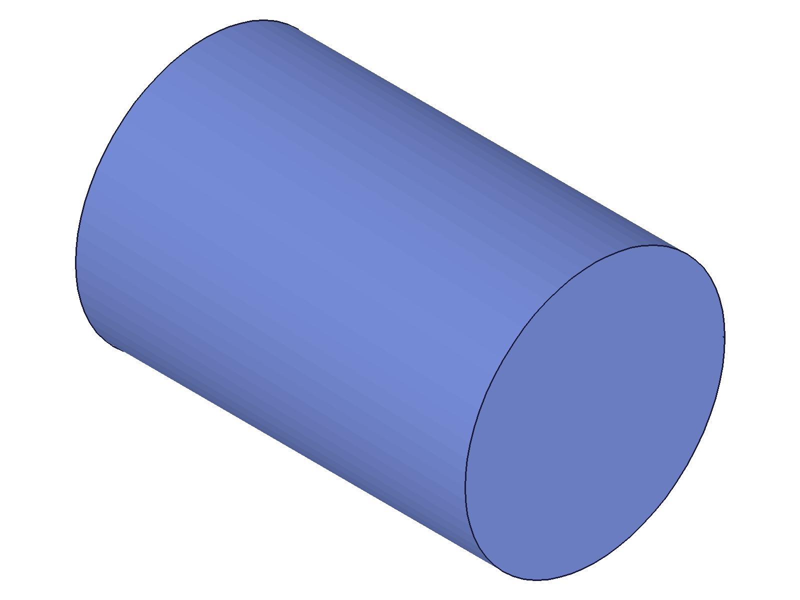
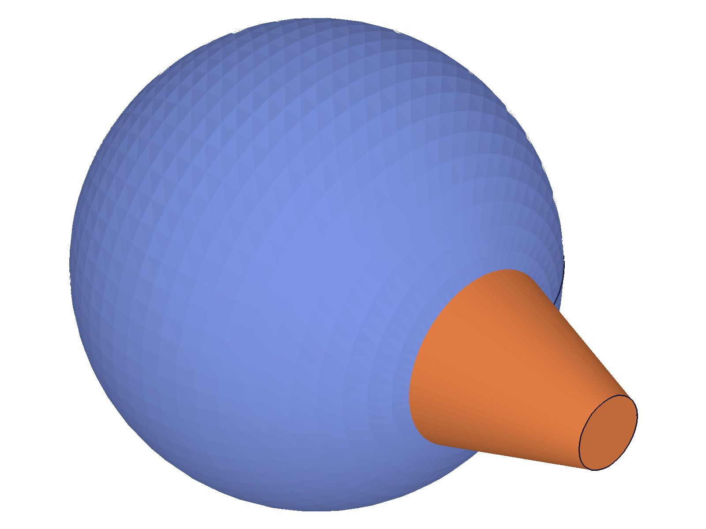
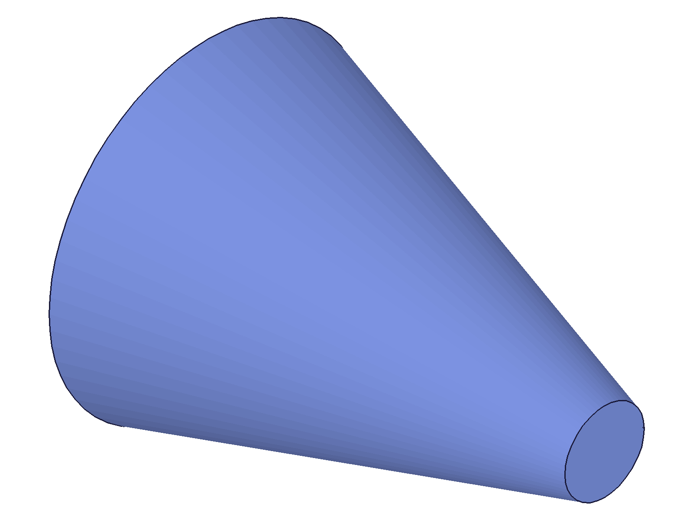
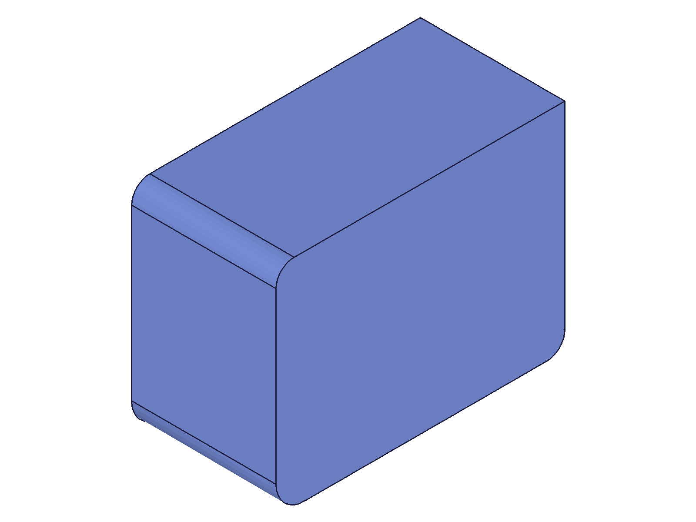

# Training: part.getGeometryIds

**Date:** 2026-04-21

## Goal

Testing `v1.part.getGeometryIds` — the position-based brep geometry lookup API.

**Methods to cover:**

- `getGeometryIds` — basic edge lookup on a box (`lines` param with `pos`)
- `getGeometryIds` — face lookup on a box (`planes` param with `positions`)
- `getGeometryIds` — vertex/point lookup (`points` param with `pos`)
- `getGeometryIds` — arc/circle lookup on cylinder/fillet geometry
- `getGeometryIds` — cylindrical/conical/spherical face lookup
- `getGeometryIds` — nurbsCurves and nurbsSurfaces on freeform geometry
- `getGeometryIds` — multiple queries in one call (batch)
- `getGeometryIds` — interaction with `recalc()` (pre-recalc vs post-recalc IDs)
- `getGeometryIds` — edge cases: wrong positions, no matches, approximate positions

**Questions:**

- What happens when the position doesn't match any geometry?
- How precise must the position be? Does it tolerate approximate coordinates?
- Can you query multiple geometry types in a single call?
- Does each category array return results in the same order as the input?
- What IDs come back for different geometry types on a simple box?
- How do the returned IDs relate to IDs from `getBrepGeometryIndex`/`getBrepGeometryByIndex`?

---

## 01 — box edge lookup

Script: `scripts/01-box-edges.mjs` — ✅ Edge lookup works. Returns IDs in order. Result only contains the queried category.

|  |
|---|

**Data:** Bottom-front edge [40,0,0] → id 98. Right-bottom [80,30,0] → 99. Top-front [40,0,40] → 106. Vertical [0,0,20] → 102. Multi-edge query [40,0,0], [80,30,0], [0,0,20] → `{lines: [98, 99, 102]}`. maxLevel=31 (info).

**Learned:** Edge lookup uses midpoint positions. Result object only includes the queried category key (e.g., `{lines: [...]}` not all 10 categories). Multi-edge queries return results in input order.

---

## 02 — box face lookup

Script: `scripts/02-box-faces.mjs` — ✅ Face lookup works with `positions` (plural, array of points).

|  |
|---|

**Data:** All 6 faces found: top=115, bottom=110, front=111, left=114, right=112, back=113. Single position on the face works. Multiple positions per face (edge midpoints) also works — docs say "position on the plane or multiple positions of midpoints of adjacent edges."

**Learned:** For `planes`, pass `positions: [[x,y,z]]` (array of point arrays). A single center-of-face point suffices. Two edge midpoints also work for disambiguation.

---

## 03 — box vertex lookup

Script: `scripts/03-box-vertices.mjs` — ✅ All 8 vertices found at exact corner positions.

**Data:** 8 vertices: IDs 90-97. Origin [0,0,0] → 90. Far corner [80,60,40] → 96. Results maintain input order.

**Learned:** Vertex lookup requires exact positions (the vertex coordinates themselves).

---

## 04 — cylinder geometry (initial test)

Script: `scripts/04-cylinder-geometry.mjs` — ⚠️ Circle edge at [20,0,60] FAILED (maxLevel 51), but center [0,0,60] WORKED.

|  |
|---|

**Data:** `circles: [{pos: [20,0,60]}]` → `{circles: [[]]}` maxLevel 51. `circles: [{pos: [0,0,60]}]` → `{circles: [77]}` maxLevel 31. Cylindrical face with 1 position → FAILED. Top/bottom flat faces → OK.

**Learned:** The position [20,0,0] is the seam vertex on cylinders/cones. Querying at the seam vertex fails. Center of circle works. Cylindrical faces need more than 1 position.
**📌 LLM doc:** Seam vertex causes failures — document avoidance pattern.

---

## 05 — mixed type query

Script: `scripts/05-mixed-query.mjs` — ✅ Multiple geometry types in one call works.

**Data:** `{points: [{pos:[0,0,0]}], lines: [{pos:[40,0,0]}], planes: [{positions:[[40,30,40]]}]}` → `{lines:[98], planes:[115], points:[90]}`. Result keys = only queried types. Empty input arrays omitted from result.

**Learned:** Can query points, lines, planes, arcs, circles, etc. all in a single call. Only queried categories appear in the result.
**📌 LLM doc:** Document mixed-type query pattern.

---

## 06 — cylinder debug (seam investigation)

Script: `scripts/06-cylinder-debug.mjs` — ✅ Confirmed: circle edge works at non-seam positions, cylindrical face needs 2+ positions.

|  |
|---|

**Data:** `getGeometryPositions` for circle 77: identifying position is [-20, ~0, 60] (opposite seam). Circle lookup at [0,20,60] → OK, [-20,0,60] → OK. Cylindrical face with 2 surface points → `{cylinders:[72]}` OK. With 3 points → also OK.

**Learned:** The identifying position for a circular edge is the arc midpoint (opposite the seam). For cylindrical faces, 2 or more surface points are needed — 1 point fails.
**📌 LLM doc:** Document minimum point requirements per geometry type.

---

## 07 — error cases & tolerance

Script: `scripts/07-error-cases.mjs` — ✅ Tight tolerance for free-space positions, but "best fit" works on surfaces.

**Data:**
- Far-off [500,500,500] → `{lines:[[]]}` maxLevel 51. Error: "At the given position: [{500,500,500}] no geometry could be found..."
- 0.001 off → FOUND edge (tolerance ~0.001 OK)
- 0.1 off → FAILED
- 1.0 off → FAILED
- 5.0 off → FAILED
- Face center [40,30,40] queried as `lines` → FOUND edge 109 (nearest edge of the face!)
- Edge midpoint [40,0,0] queried as `planes` → FOUND face 111

**Learned:** Two regimes: (1) if point is ON a brep surface, the API finds the nearest element of the requested type on that surface — works across large distances on the surface; (2) if point is NOT on any surface (floating in space), tolerance is very tight (<0.1 units). Failed lookups return `[]` at that position in the result array.
**📌 LLM doc:** Document tolerance behavior and the two-regime lookup.

---

## 08 — pre-recalc vs post-recalc IDs

Script: `scripts/08-pre-recalc.mjs` — ⚠️ IDs change after recalc! Both pre and post return valid results, but the IDs are different.

**Data:** Pre-recalc: edge=67, face=84, vertex=59. Post-recalc: edge=98, face=115, vertex=90. All lookups succeed in both cases (maxLevel 31).

**Learned:** `getGeometryIds` works before recalc, but returns "preliminary" IDs that differ from post-recalc IDs. Pre-recalc IDs may not work with all APIs (confirmed by chamfer training: pre-recalc IDs fail for TWO_DISTANCES and DISTANCE_ANGLE chamfer types). Always recalc before querying for IDs you'll pass to other APIs.
**📌 LLM doc:** Emphasize recalc-first pattern.

---

## 09 — sphere & cone faces

Script: `scripts/09-sphere-cone.mjs` — ⚠️ Sphere face with 1 point → FAILED, 2 points → OK. Cone positioning was wrong (used non-existent `position` param).

|  |
|---|

**Data:** Sphere face: `spheres: [{positions: [[30,0,0]]}]` → FAILED. `spheres: [{positions: [[30,0,0], [0,30,0]]}]` → `{spheres:[87]}`. Cone queries all failed (cone was at origin, not at position [80,0,0] as intended — `position` param doesn't exist on `part.cone`).

**Learned:** Spherical faces also need 2+ positions (same as cylindrical). All curved surface types need multiple positions.

---

## 10 — cone brep enumeration

Script: `scripts/10-cone-debug.mjs` — ✅ Revealed cone brep structure: seam line + 2 arcs + 3 faces + 2 vertices.

|  |
|---|

**Data:** Cone (bD=40, tD=10, H=50) brep: line 0 (seam) at [12.5,0,25], arc 0 (bottom) at [-20,~0,0], arc 1 (top) at [-5,~0,50], face 0 (bottom flat), face 1 (conical surface — 3 positions), face 2 (top flat), point 0 [20,0,0], point 1 [5,0,50].

**Learned:** Cones and cylinders share the same brep structure: a seam line in the +X direction splits circular edges into arcs. The identifying positions are arc midpoints (opposite seam at -X). Seam points are at +X. The conical face is identified by 3 positions: seam line midpoint + 2 arc midpoints.

---

## 11 — cone with correct geometry types

Script: `scripts/11-cone-correct.mjs` — ⚠️ Cone arcs NOT findable via `arcs` param! But conical face works with 2-3 positions.

**Data:** `arcs: [{pos: [-20,0,0]}]` → FAILED. `arcs: [{pos: [-5,0,50]}]` → FAILED. `cones: [{positions: [[12.5,0,25], [-20,0,0], [-5,0,50]]}]` → `{cones:[72]}`. With 2 of 3 positions → also works. Seam line and flat faces → OK.

**Learned:** Despite being brep arcs, the cone's circular edges cannot be found via `arcs`. They need the `circles` param (tested next).

---

## 12 — cylinder brep enumeration

Script: `scripts/12-cylinder-brep.mjs` — ✅ Confirmed cylinder has identical structure to cone: seam line + 2 arcs + 3 faces.

**Data:** Cylinder (D=40, H=60): line 0 (seam) at [20,0,30], arc 0 at [-20,~0,0], arc 1 at [-20,~0,60]. Face 0 (bottom), face 1 (cylindrical — 3 positions), face 2 (top). Points at seam vertices [20,0,0] and [20,0,60].

**Learned:** Both cylinder and cone circular edges are arcs in the brep (split by seam line). The `circles` param in getGeometryIds abstracts over this — it finds circular/arc edges regardless of brep classification.

---

## 13 — cone circles via circles param

Script: `scripts/13-cone-circles.mjs` — ✅ Cone circular edges ARE findable via `circles` param. Only seam vertex fails.

**Data:** `circles: [{pos: [-20,0,0]}]` → `{circles:[76]}`. Center [0,0,0] → 76. Rim [0,20,0] → 76. Seam [20,0,0] → FAILED.

**Learned:** The `circles` param works for ALL circular/arc edges — both cylinder and cone. The `arcs` param is for non-circular arcs (e.g., fillet arcs). Never query at the seam vertex (default: [+radius, 0, Z]).
**📌 LLM doc:** Document circles vs arcs param distinction.

---

## 14 — fillet workflow (practical)

Script: `scripts/14-fillet-workflow.mjs` — ✅ Full workflow: find edge → fillet → recalc → find more edges → fillet.

|  |
|---|

**Data:** Found vertical edge id 102. Fillet radius=8 → id 120. After recalc, re-queried edges: bottom-front = 149 (was 98 pre-fillet). Found 2 more edges [154, 156]. Second fillet succeeded → id 181.

**Learned:** Edge IDs change after topology-modifying operations (fillet). Must recalc + re-query after each fillet/chamfer. Multiple edges can be found in one call and passed directly to fillet's `references` array.
**📌 LLM doc:** Document the re-query pattern after topology changes.

---

## 15 — sphere brep (NURBS check)

Script: `scripts/15-nurbs-edges.mjs` — ✅ Sphere is purely analytic: 1 arc, 1 face, 2 points. No NURBS curves/surfaces.

|  |
|---|

**Data:** Sphere (r=30): arc 0 at [30,0,~0], face 0 (sphere) at [30,0,~0], point 0 (south pole) [~0,0,-30], point 1 (north pole) [~0,0,30]. No lines, no NURBS. Sphere face found via `spheres: [{positions: [[30,0,0], [0,30,0]]}]` → id 68.

**Learned:** Primitive shapes (box, cylinder, cone, sphere) are all analytic — no NURBS elements. NURBS would only appear on freeform geometry (sweeps, lofts, imports). The sphere has a seam arc (equator-like) at the +X direction.

---

## 16 — order preservation & partial failures

Script: `scripts/16-order-preservation.mjs` — ✅ Results maintain input order. Failed lookups return `[]` at the corresponding position.

**Data:** Order A [98,99,102] reversed = Order B [102,99,98]. Mixed query with invalid position: `[98, [], 102]` — the failed lookup at index 1 returns `[]`. maxLevel=51 due to the error, but other results are still valid.

**Learned:** Order is guaranteed. A failed lookup doesn't prevent other lookups from succeeding. The error entry is `[]` (empty array), not null.
**📌 LLM doc:** Document order guarantee and partial failure behavior.

---

## 17 — fillet arc positions

Script: `scripts/17-fillet-arcs.mjs` — ✅ Fillet arcs findable via `arcs` param at their midpoint position.

|  |
|---|

**Data:** Fillet (r=8) on front-left vertical edge creates 2 arcs: bottom [2.34, 2.34, 0] and top [2.34, 2.34, 40]. These are the 45° points of the fillet radius. Query `arcs: [{pos: [2.34, 2.34, 0]}]` → `{arcs:[170]}`. The fillet cylindrical face (id 169) has 4 edge positions.

**Learned:** Fillet arcs are true arcs (not circles) and are found via the `arcs` param. The identifying position is the arc midpoint. Value ≈ `r * (1 - cos(45°)) ≈ r * 0.293` for a 90° fillet. The `arcs` param is for non-circular arcs; `circles` is for circular/near-full-circle edges.
**📌 LLM doc:** Document arcs vs circles distinction with fillet example.

---

## 18 — find all 12 box edges (practical)

Script: `scripts/18-practical-all-edges.mjs` — ✅ All 12 edges found. Perfect round-trip with getGeometryPositions.

|  |
|---|

**Data:** 12 unique IDs: [98,99,100,101,106,107,108,109,102,103,104,105]. `getGeometryPositions` returns the exact same midpoint positions used to query. Bottom edges: 98-101, vertical: 102-105, top: 106-109.

**Learned:** Box edge midpoint positions are: X midpoint = L/2 (or 0 or L), Y midpoint = W/2 (or 0 or W), Z midpoint = H/2 (or 0 or H). `getGeometryIds` and `getGeometryPositions` are exact inverses — positions round-trip perfectly.
**📌 LLM doc:** Include box edge position formula for common use case.
